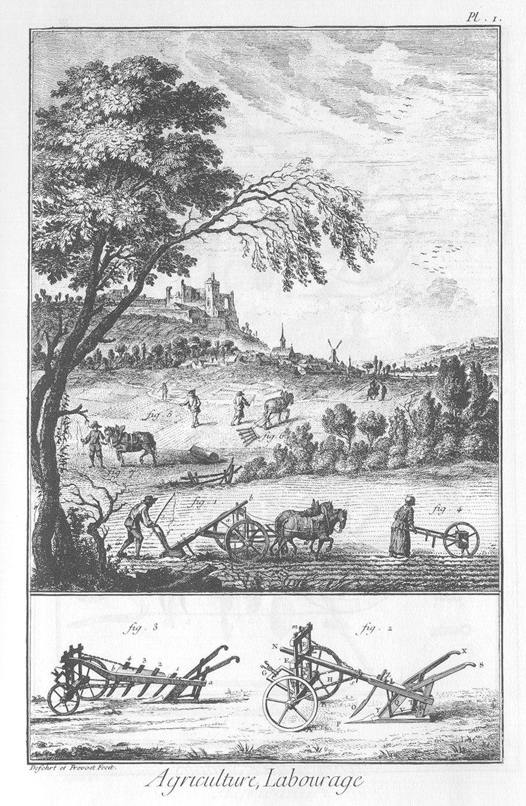
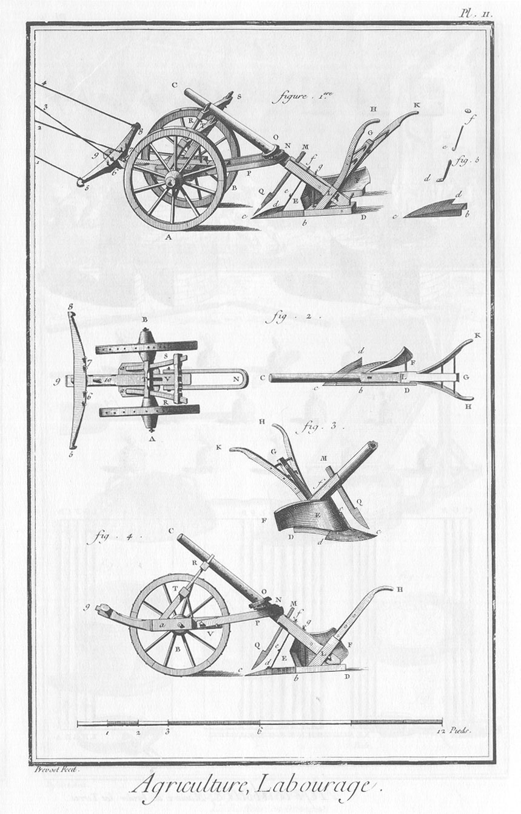
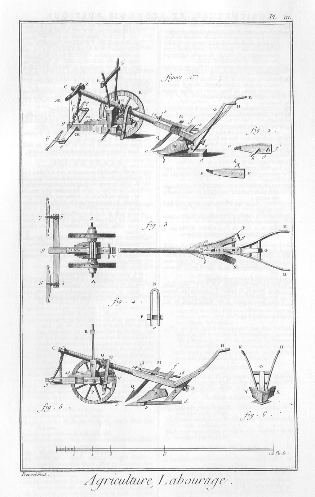
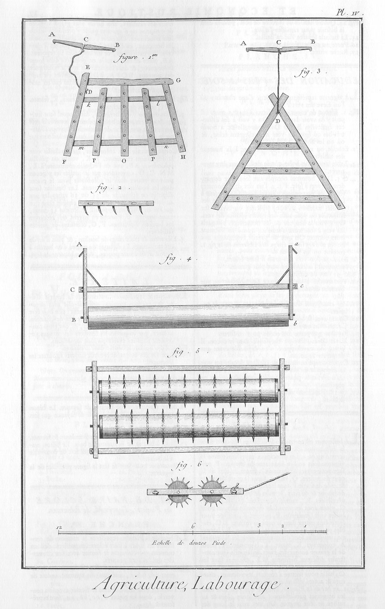
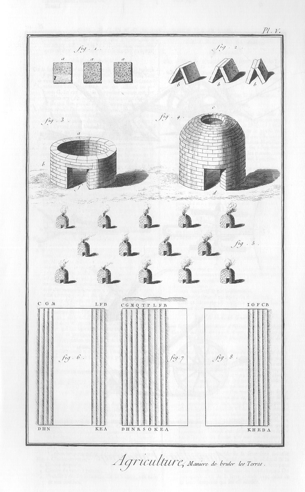

LABOURAGE.
==========

PLANCHE Iere.
-------------

1. Laboureur qui ouvre un sillon.

2. Charrue ordinaire.

3. Charrue de M. Tull.

4. Semeuse qui conduit le semoir de l'abbé Soumille dans le sillon où la semence est aussi-tôt recouverte par la terre, que le versoir ou oreille de la charrue (fig. 1.) y jette en formant le sillon suivant indiqué par la ligne ponctuée.

5. Semeur qui répand la semence à la main, sur une piece de terre préparée par différens labours.

6. Charretier qui conduit la herse pour couvrir la semence.

7. Charretier qui conduit le rouleau ou brisemotte, pour rabattre & égaler la terre.

PLANCHE II. La charrue à versoir.
---------------------------------

1. La charrue entiere vûe en perspective.
	- A, B, les rouelles.
	- 9, V, le têtard.
	- a, a, les jumelles.
	- 5, 8, l'épart ou balance.
	- 5, 1: 7, 2, traits du cheval sous la main gauche.
	- 6, 3: 8, 4, traits de l'autre cheval,
	- V, P, N, le collier ou chignon.
	- O, les rondelles ou entrempoirs.
	- C D, la haye.
	- c D, le sep.
	- L, G, étançon.
	- L H, L K, mancherons.
	- E F, versoir ou écu, ou oreillon.
	- T, selette.
	- R, S, chevalet ou hausse.
	- c d b, soc.
	- d e, e f, aiguille.
	- M, Q c, coutre.
	- g, clef.

2. L'avant & l'arriere-trains séparés & représentés à vûe d'oiseau.
	- 5, 8, l'épart ou balance.
	- 9, V, le têtard,
	- V N, le collier ou chignon.
	- a a, les jumelles.
	- 6, 7, chevilles où l'on attache les traits du dedans.
	- 10, autre cheville où l'on attache le trait du palonnier d'un troisieme cheval, quand on s'en sert.
	- T, selette.
	- R S, chevalet ou hausse.
	- a S, a R, épées.
	- L'essieu A B des rouelles fait avec le têtard un angle d'environ 85 ou 86 degrés, du côté du versoir, afin que la pointe du soc reste engagée dans la terre à main gauche, & que l'arriere train ne retombe pas dans le sillon précédemment tracé. L'arriere-train.
	- C L, la haye.
	- b c d, le soc.
	- c b D, le sep.
	- L G, étançon.
	- L H, L K, les mancherons.

3. L'arriere-train en perspective, vû du côté du versoir.
	- M Q c, le coutre.
	- D d c, le sep recouvert du soc.
	- d c, tranchant du soc.
	- e f l'aiguille.
	- E F, versoir ou oreillon.
	- G, étançon,
	- K H, mancherons.

4. Le profil de la charrue en entier, la roue antérieure A supprimée. Les mêmes lettres désignent les mêmes parties qu'aux figures précédentes.

5. Le soc & l'aiguille séparés.

PLANCHE III. La charrue à tourne-oreille.
-----------------------------------------

1. La charrue entiere vûe en perspective.
	- A B, les rouelles ou roues, fig. 1. 3.
	- 9, V, le têtard, 3. 5.
	- a, a, jumelles ou mammelles, 1. 3. 5.
	- 5, 8, traversier, 1. 3.
	- u P N, le collier, 4. 5.
	- O, rondelles ou dehourdoirs, 1. 5.
	- C D, la haie, 1. 5.
	- c, d, le scep, 1. 5.
	- L G, étançon, 1. 3. 5.
	- L H, L K, mancherons, 1. 3. 5. 6.
	- E F, oreille, 2. 3.
	- T, selette, 1. 5.
	- R, S, joucquoi, ou joucquoir, 1. 5.
	- Z AE, l'embranloir, 1.
	- Z OE, la hardiere, ou hardiau. 1.
	- AE OE, la commande, 1.
	- X Y, le soc, 1. 3. 5. 6.
	- 12, la lumiere, 3.
	- 6, 7, les briolers, 1. 3.
	- G, mortoise en gueule de loup, sur le haut de l'étançon, 3. 6.
	- 10, 11, le petit têtard, 1. 3. 5.
	- 13, le pretre, 1. 3. 5.
	- 14, 15, le pleyon, 1. 5.
	- T R, T S, essais ou épées, 1. 5.

2.
	- e f, la face intérieure de l'oreille.
	- h, l'arbalêtrier qui s'implante dans le trou L de l'étançon.
	- g, poignée de l'oreille.
	- e, crochet qui entre dans un piton fixé en b à chaque côté du scep,
	- 1. 3. & 5. E F, face extérieure de l'oreille.

3. Plan à vûe d'oiseau de l'avant & de l'arriere-train de la charrue.
	- X Y, les fourchettes ou fourceau.

4. Le collier ou chignon.
	- P, la clef du chignon qui embrasse le têtard en-dessous. Le chignon s'applique sur la cheville 11 (fig. 3.) qui traverse le petit têtard.

5. Profil de la charrue, où la roue antérieure A est supprimée.

6. Vûe de face des fourchettes X Y.

PLANCHE IV. Herses. Rouleau. Herse roulante.
--------------------------------------------

1. Herse quarrée.
	- A B, palonnier.
	- C D, la corde.
	- E F, grand bras.
	- E G, tête. G H, second bras.
	- O, bras du milieu.
	- P P, petit bras.
	- k l, m n, épée ou batte. Cette herse a vingt-cinq dents.

2. Profil de la herse, vû du côté du bras G H.

3. Herse triangulaire faite de deux bras assemblés à mi-bois en D sous un angle de 60 deg. & écartés par trois traverses. La premiere traverse a deux chevilles ou dents ; la seconde, quatre ; & la troisieme, sept ; & chaque bras, six : ce qui fait en tout vingt-cinq.

4. Rouleau B b, avec son brancard fait de deux treselles A B, a b, assemblées par une traverse C c.

5. Herses roulantes avec leurs chevilles ou dents de fer, & leur brancard.

6. Profil de la herse, fig. 5.

PLANCHE V. Maniere de brûler les terres.
----------------------------------------

1. Gasons.

2. Gasons dressés.

3. Fourneau de gasons séchés, commencé.

4. Fourneau achevé.

5. Arrangement des fourneaux.

6. Maniere dont on laboure avec la charrue à versoir, en la conduisant de A en B, de C en D, de E en F, de G en H, &c. L'inclinaison des hachures marque celle du versoir sur la longueur du sillon.

7. Maniere dont on laboure en planche avec la même charrue, en la conduisant de A en B, de C en D, de E en F, de G en H, de K en L, de M en N, de O en P, de Q en R, de S en T; sur laquelle ligne S T on revient de T en S; ce qui forme la séparation des planches.

8. Maniere dont on laboure avec la charrue à tourne- oreille. On ouvre un sillon de A en B, l'oreille étant à droite, comme les hachures en représentent la position ; puis on ouvre un autre sillon à côté de celui-là de C en D, observant de changer de côté l'oreille de la charrue ; & ainsi de suite, en changeant successivement l'oreille de côté.

[->](../03-Semoirs/Légende.md)
