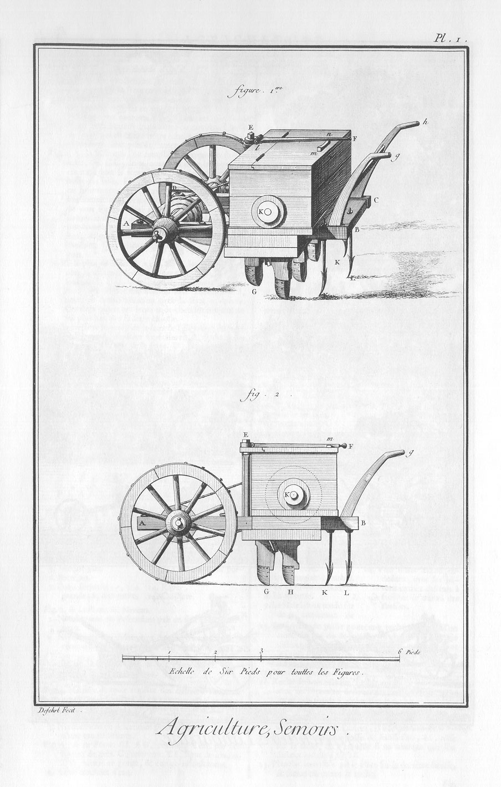
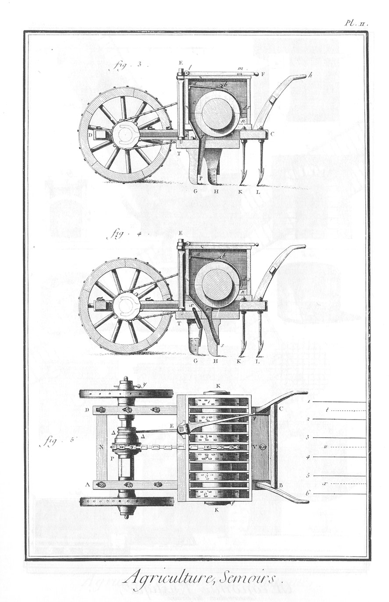

SEMOIRS.
========

PLANCHE Iere.
-------------

1. Semoir composé sur les principes de MM. Duhamel, Tull & autres. Le semoir tout monté en perspective.
	- A B D C, les brancards sur lesquels sont posés les coffres du semoir.
	- G, socs antérieurs.
	- H, socs postérieurs.
	- K, L, K, les trois dents de herses.
	- K, un des tourillons du cylindte.
	- B g, C h, les mancherons.
	- E F, le gouvernail.

2. Elévation latérale du semoir. Les dénominations sont les mêmes que dans la figure précédente.

PLANCHE II.
-----------

3. Coupe longitudinale du semoir par le milieu d'un des socs antérieurs G.

4. Coupe longitudinale par le milieu d'un des socs postérieurs H.

5. Plan du semoir où l'on voit les dix cloisons qui séparent le coffre : le plan de la route des six socs, 1, 2, 3, 4, 5, 6, & celui de la route des trois herses, t, u, x.

PLANCHE III.
------------

6. Plan géométral du cylindre, de l'essieu, des roues, & de la chaîne sans fin qui les assemble.

7. L'essieu.

8. Profil des deux poulies poligones & de la chaîne sans fin qui les embrasse.

9. Coupes & représentation perspective du verrou A, B & de la noix C D, qui porte la poulie poligonale de l'arbre.

10. Elévation d'une des dix cloisons.

11. Le gouvernail F E; son axe E T, & la fourchette T R qui conduisent le verrou.

12. Représentation perspective d'une des six tranches du cylindre cellulaire, où l'on voit la disposition des cellules dans lesquelles le grain est porté.

13. Développement de la chaîne sans fin, qui passant sur les poulies de l'arbre & du cylindre, communique le mouvement des roues au cylindre.

Nota. On ne décrit point ici le semoir de M. l'abbé Soumille, parce qu'il en est fait mention dans la Planche premiere d'Agriculture, fig. 4.

[->](../04-Façon_des_foins_&_moisson/Légende.md)
