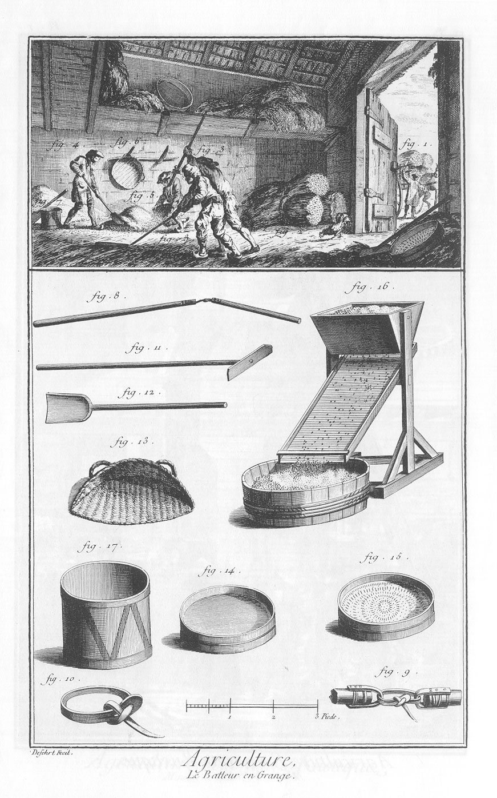

BATTEUR EN GRANGE.
==================

La vignette représente une grange.

1. Voiture chargée de gerbes, que l'on décharge à la porte de la grange.
2. Gerbes destinées aux batteurs.
3. Batteurs en grange actuellement occupés à battre les épics.
4. Ouvrier qui rassemble en tas avec une pelle les grains sortis des épics.
5. Ouvrier qui prend du grain pour le vanner.
6. Le crible.
7. Septier, minot, ou autre mesure pour mesurer le grain.
8. Fleau dont se servent les ouvriers de la fig. 3.
9. Maniere dont les deux branches du fleau sont attachées l'une à l'autre.
10. Le noeud du fleau.
11. Rabot pour retirer le grain épars après qu'il a été battu.
12. Pelle de bois pour ramasser le grain en tas, ou pour le mettre dans la mesure.
13. &
14. Vans, instrumens destinés à remuer ou vanner le grain, pour en ôter la poussiere & les ordures.
15. Crible à mains, instrument percé de petits trous par lesquels on fait passer, en le remuant circulairement, le grain plus nettoyé qu'il n'a pû l'être par le van.
16. Crible à pié, espece de trémie dont l'usage est le même que le crible à mains.
17. Mesure pour mesurer le grain.

[->](../06-Conservation_des_grains/Légende.md)
