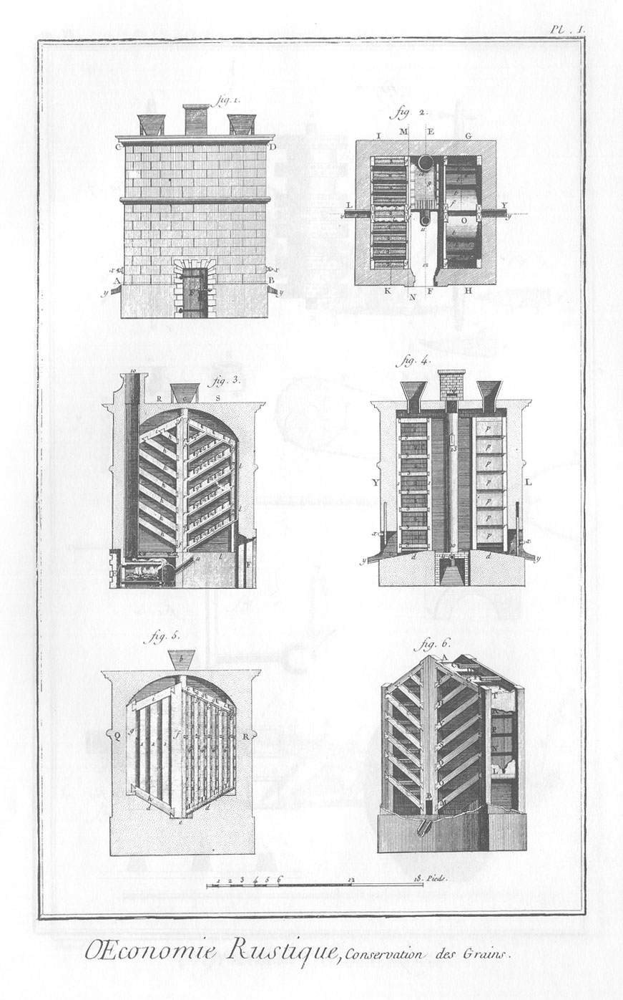
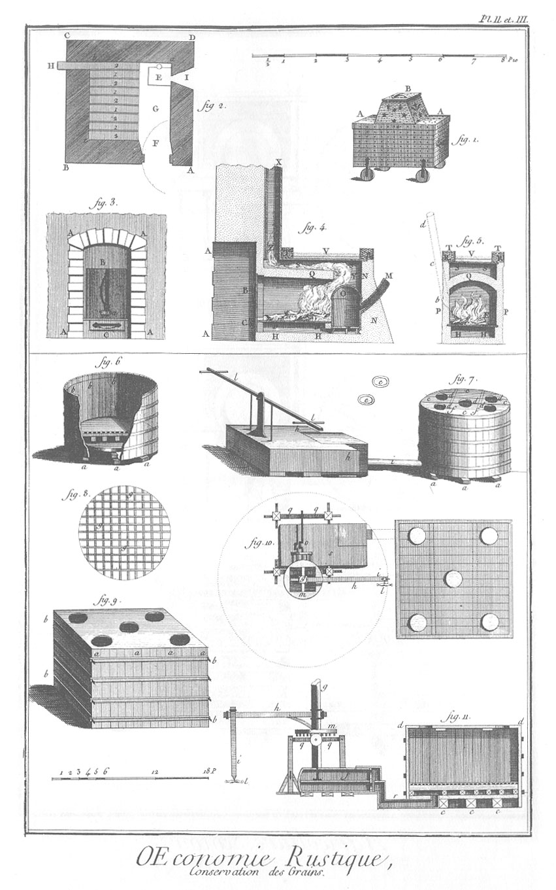

CONSERVATION DES GRAINS, d'après M. Duhamel.
============================================

PLANCHE Iere.
-------------

1. Corps du bâtiment de l'étuve, vû par-devant.
2. Coupe horisontale de l'étuve par la ligne A B de la fig. premiere.
3. Coupe verticale de l'étuve par la ligne E F de la fig. 2.
4. Coupe verticale de l'étuve par la ligne L Y de la fig. 2.
5. Coupe verticale de l'étuve par la ligne M N de la fig. 2.
6. Elévation perspective d'une des armoires de l'étuve.

PLANCHES II. & III.
-------------------

1. Petit poîle de tôle à l'italienne.
2. Plan d'une petite étuve.
3. Poîle à la françoise.
4. Coupe longitudinale du poîle à la françoise.
5. Coupe transversale du poîle a la françoise.
6. Vûe d'un grenier en tour ou cuve.
7. Le même grenier, avec son couvercle & ses soufflets.
8. Grillage qui se place ou se forme dans l'intérieur de la cuve, sur le fond d'en-bas.
9. Grenier en forme de caisse.
10. Plan du grenier en forme de caisse, & du manége qui fait mouvoir les soufflets.
11. Coupe verticale du même.

[->](../07-Moulins_à_vent_&_à_eau/Légende.md)
