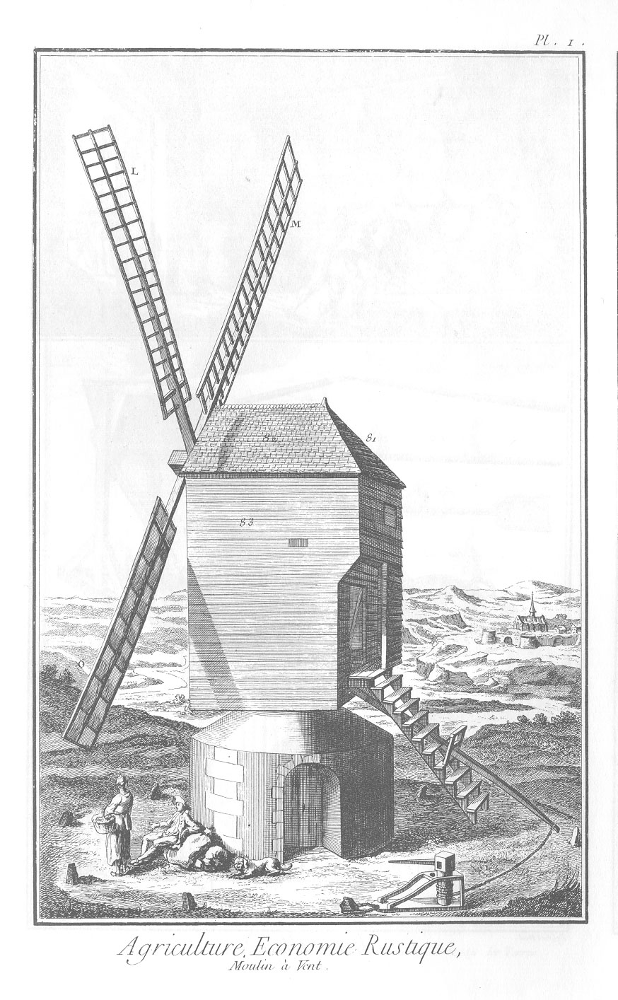
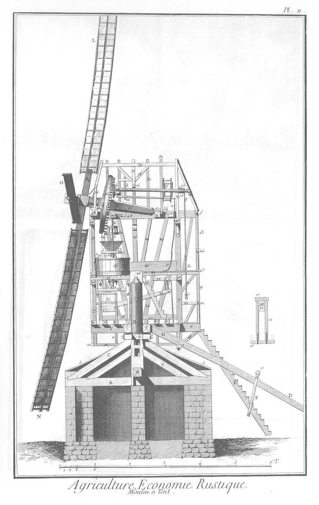
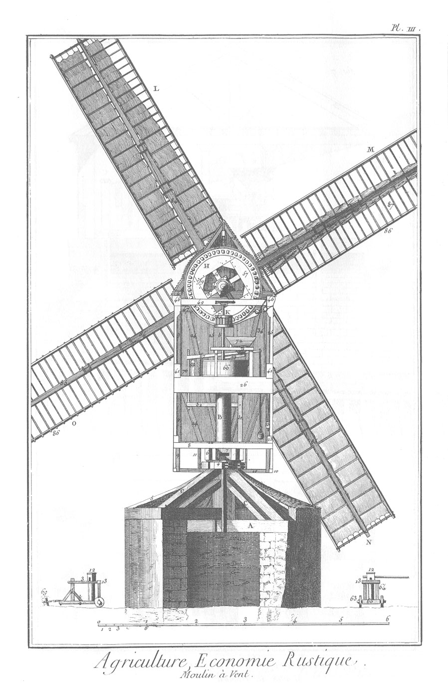
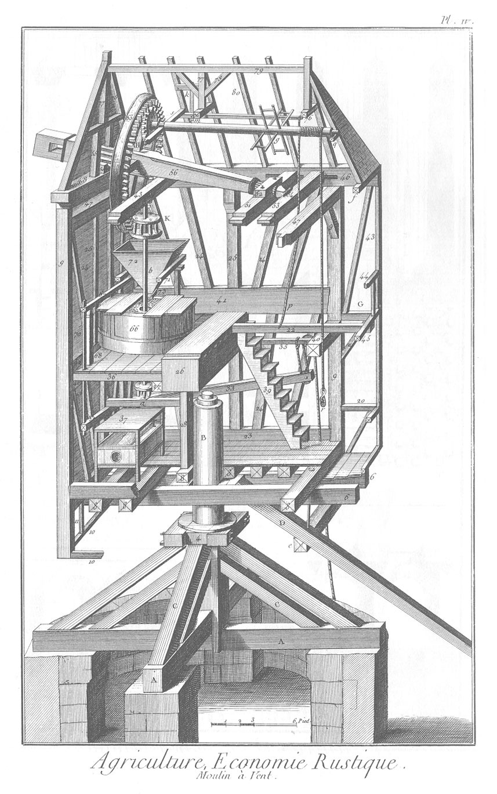
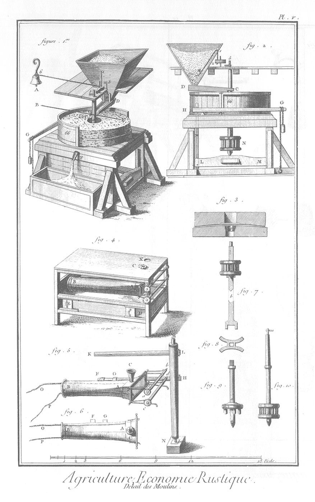
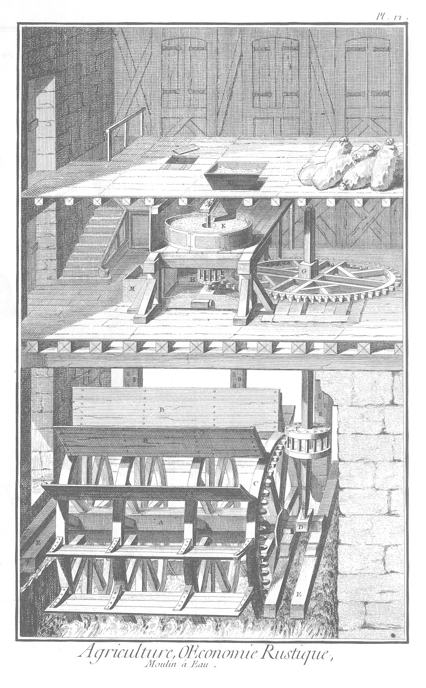
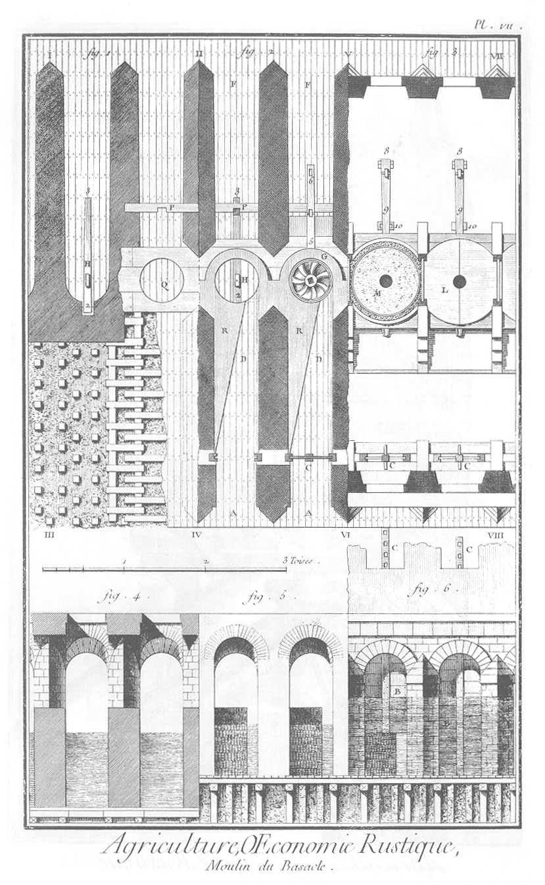
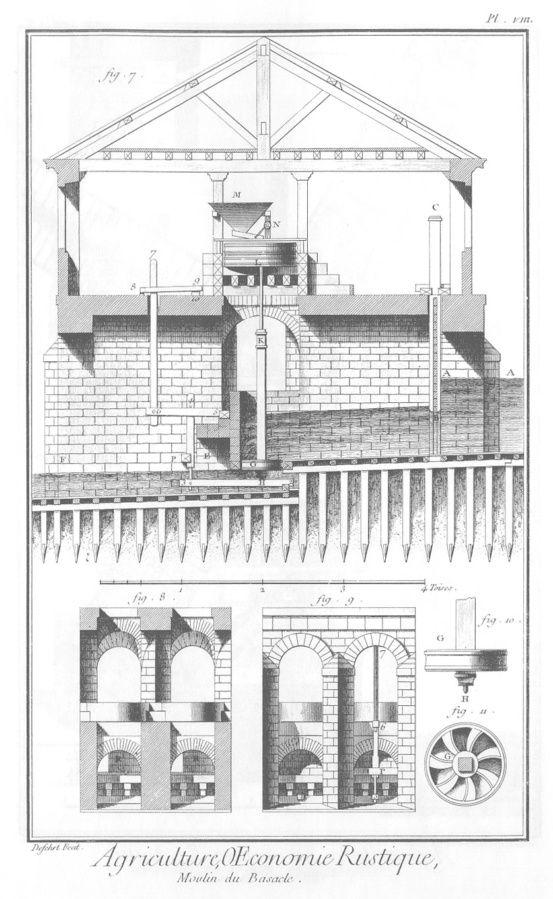
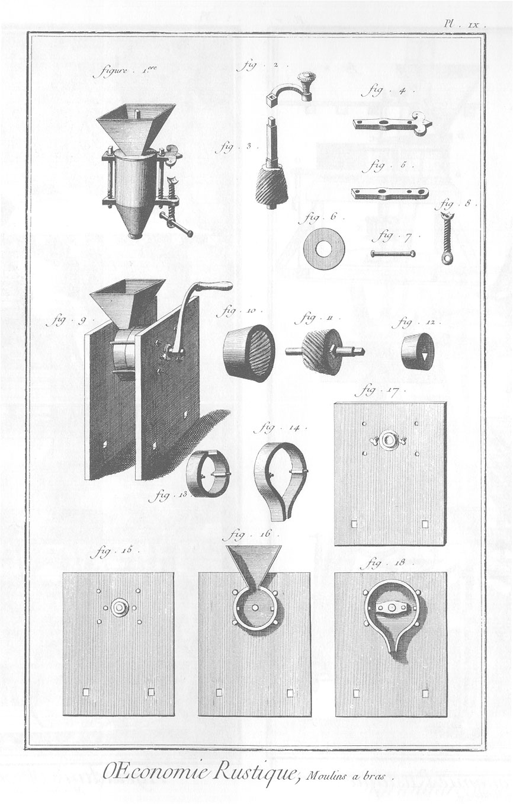

MOULINS A VENT ET A EAU, pour moudre le blé.

PLANCHE Iere. Vûe extérieure d'un moulin à vene.
------------------------------------------------

PLANCHE II. Coupe verticale du moulin sur sa longueur.
------------------------------------------------------

PLANCHE III. Coupe verticale du moulin sur sa largeur.
------------------------------------------------------

Engin à tirer au vent.

- 12, Treuil.
- 13, chaperon.
- 64, jambes.
- 60, essieu.
- k, poteau debout.
- i, liens.
- 2, 3, semelles.
- 63, roues.
- 69, pieu.

PLANCHE IV. Vûe perspective de l'intérieur du moulin. 
-----------------------------------------------------

Lettres & chiffres relatifs aux quatre premieres planches.

- A, solles, Planc. 2. 3. 4.
- B, attaches, 2. 3. 4.
- C,
	- liens, 2. 3. 4.
	- 4, chaise, 2. 3. 4.
	- 5, chevrons de pié, 2. 3.
	- 6, trattes, 2. 3. 4.
	- 7, couillards, 2. 3. 4.
	- 8, doubleaux, 2. 3. 4.
	- 9, poteaux corniers, 2. 3. 4.
	- 10, soûpentes, 2. 3. 4.
	- 11, entretoises, 2. 3. 4.
- D, queue, 2. 4.
- E,
	- limons de la montée, 2.
	- 14, bras du chevalet, 2.
- F,
	- chevalet, 2.
	- 15, support de la montée, 2.
	- 16, entretoise, 2.
	- 17, chaperon, 2.
	- 18, lien du rossignol, 2.
	- 19, poteau d'angle, 2.
	- 20, appui du faux pont, 2. 4.
	- 21, lien sous la sabliere de la galerie, 2.
	- 22, planchers, 2. 3. 4.
	- 23, pannettes, 2. 3. 4.
	- 24, guettes, 2. 3. 4.
	- 25, poteaux de remplissage, 2. 3. 4.
	- 26, sommier, 2. 3. 4.
	- 27, faux sommier, 2. 4.
	- 28, poteau du faux sommier, 2. 4.
	- 29, pallier, 2.
	- 30, souche, 2.
		- a, petit fer, & chevilles du blutoir, 2.
	- 31, poteau de la braye, 2. 3.
	- 32, braye, 2. 3.
	- 33, bascule du frein, 2. 3. 4.
	- 34, épée de la bascule du frein, 2. 3.
	- 35, petite poulie du frein, 2. 4.
	- 36, plancher des meules, composé de quatre cartelles, 2. 4.
	- 37, la huche & le blutoir, 2. 4.
	- 38, anche, 2.
	- 39, montée du second étage, 2. 4.
	- 40, colliers, 2. 4.
	- 41, pannes meulieres, 2. 3. 4.
	- 42, entretoise, 2.
- G, galerie, 2. 4.
	- 43, poteau de croisée de la galerie, 2. 4.
	- 44, sabliere d'appui, Planc. 2. 4.
		- f, sabliere du haut de la galerie, 2. 4.
	- 45, sabliere du bas de la galerie, 2. 4.
	- 46, hautes pannes, 2. 3. 4.
	- 47, colliers, 2. 3. 4.
	- 48, jeu, 2. 3. 4.
	- 49, pallier de gros fer, 2. 3.
		- b, gros fer, 2. 3.
	- 50, marbre sur lequel pose le collet de l'arbre tournant. 2. 4.
	- 51, pallier du petit collet, 2. 4.
	- 52, semelle du petit collet, 2. 4.
	- 53, pallier de heurtoir, 2. 4.
	- 54, heurtoir, 2. 4.
	- 55, lutons, 2. 3. 4.
	- 56, arbre tournant, 2. 4.
- H, rouet, 2. 3. 4.
	- 57, chanteaux, 3.
	- 58, paremens, 3.
	- 59, goussets, 3.
	- 61, embrassures, 3.
- K, lanterne, 2. 3. 4.
	- 62, tourtes, 2.
	- 65, frein, 2. 3. 4.
	- 66, archures, 2. 3. 4.
	- 67, trempure, 2. 3. 4.
	- 68, d'os d'âne, 3. 4.
- L, M, N, O, les aîles, 1. 2. 3.
	- 70, épée de fer, 4.
	- 71, tremions, 2. 3. 4.
	- 72, tremie, 2. 3. 4.
	- 73, auget, 2. 3. 4.
	- 74, clés des paliers, 2.
	- 75, jambes'de forces, 3. 4.
	- 76, entrait, 2. 4.
	- 77, poinçon, 2. 3. 4.
	- 78, liens, 2. 4.
	- 79, faîte, 2. 4.
	- 80, chevrons du comble, 2. 4.
	- 81, planches sur lesquels posent les bardeaux, 1.
	- 82, bardeaux, 1.
	- 83, aix à couteau, 1.
	- 84, volans, 2. 3.
	- 85, antes, 3.
	- 86, coterets, 3.
	- 87, lattes, 3.
- h, g, q, arbre de l'engin pour monter le blé dans le moulin.
- h, hérisson.
- s, levier sur lequel repose le collet de l'arbre.
- s m n, autre levier sur lequel repose le premier.
- m k, barre de fer par laquelle le levier est suspendu.
- g, tambour ou devidoir sur lequel passe la corde sans fin appellée la vindenne.
- n, p, corde par laquelle on gouverne cette machine.
- q, r, cordé destinée à monter les sacs dans le moulin. Fig. 2, 3.

PLANCHE V. Détails du moulin à vent & à eau.
--------------------------------------------

1. Vûe perspective de la cage de charpente qui soûtient les meules des moulins à eau ; des meules & archures ; de la tremie, &c.
	- F, anche par laquelle la farine tombe dans la huche, cottée 38 dans les planches précédentes. a, fer.
	- C D, auget.
	- C E, C B, cordes pour donner plus ou moins de blé.
	- 1, 2, corde qui suspend le morceau de bois qui fait sonner la sonnette.
	- A, la sonnette.
	- 2, 6, corde par laquelle le morceau de bois tire la sonnette.
	- 4, porte de la tremie suspendue par une corde au point 3.
	- 66, les archures.
	- G, extrémité de la trempure.

2. Les mêmes objets vûs de profil.
	- C D, l'auget.
	- 66, les archures.
	- H G, la trempure.
	- 70, épée.
	- L M, la braye.
	- N, la lanterne.

3. Coupe des meules & du boitillon.
	- a, le boitillon.

4. La cage du blutoir du moulin à vent en perspective.
	- A B, chausse du blutoir.
	- C, entonnoir de la chausse.
	- X, autre ouverture dans laquelle on conduit le manche de l'anche quand on ne veut pas bluter.
	- E D, portes par lesquelles on retire la farine.

5. La chausse en perspective ; les treuils par lesquels elle est tendue, & les bâtons qui la mettent en mouvement.
	- A B, la chausse.
	- C, l'entonnoir.
	- O, P, cordes qui passent dans les fourreaux de la chausse.
	- a b, c d, petits treuils par le moyen desquels on tend la chausse.
	- F H, la baguette.
	- F G, attaches qui reçoivent la baguette.
	- K L, bâton.
	- M N, arbre vertical.

6. Plan de la chausse. Les lettres comme à la figure précédente.

7. Le gros fer & sa lanterne : on le suppose rompu en b, afin de rapprocher les extrémités.

8. L'anil.

9. Le petit fer. a, la tourte dont les fuseaux rencontrent l'extrémité K du bâton K L, fig. 5.

10. Fer d'un moulin à eau.

PLANCHE VI. Vûe intérieure du moulin à eau ordinaire.
-----------------------------------------------------

- A, axe de la grande roue à aubes.
- B B, aubes.
- C, la roue garnie de soixante-douze alluchons.
- D, palier de l'arbre vertical D G.
- F, lanterne de dix-huit fuseaux.
- G, hérisson, ou roue horisontale de soixante-douze dents.
- H, lanterne à douze fuseaux de fer, qui porte la meule supérieure.
- K, auget. L, tremie.
- M, huche. Le détail de toutes les parties de ce moulin, qui lui sont communes avec le moulin à vent, & de quelques autres qui lui sont particulieres, sont représentées Planc. V. du moulin à vent, fig. 1. 2. & 10.

PLANCHE VII. Moulin à eau du Basacle à Toulouse, pour le blé.
-------------------------------------------------------------

1. La division j. ij. iij. iv. est le plan de la fondation de deux coursiers.
	- 3 H 2, palier.
	- H, crapaudine sur laquelle repose le pivot inférieur de l'arbre de la meule.
	- P, traverse de bois entaillée où coule l'épée qui suspend le palier.
	- Q, platteforme sur laquelle la mâçonnerie du tambour est construite. On voit même figure la construction du radier ; c'est un assemblage de longrines & de traversines qui reposent sur les têtes des pieux : il est recouvert par des madriers dont la longueur est suivant la longueur du coursier.

2. La division ij. v. iv. vj. est le plan de deux coursiers pris au-dessus du radier.
	- A D, A D, radier du côté d'amont.
	- C, vannes qui ferment le coursier.
	- R R, massifs de mâçonerie qui dirigent le cours de l'eau à la circonférence de la tonnelle.
	- G, la tonnelle où l'on voit la roue.
	- H 3, 2, palier.
	- H, crapaudine du pivot inférieur de l'arbre de la meule.
	- 6, 5, la braie.

3. La division v. vij. vj. viij. est le plan de l'intérieur du moulin pris au-dessus de deux coursiers.
	- M, meule.
	- L, couverseaux qui avec les archures renferment les meules. Les archures sont ici en partie de mâ- çonnerie, & en partie de bois.
	- 9 8, trempure.
	- 10, coins à élever ou abaisser la trempure.
	- C, C, vannes qui ferment ou ouvrent le coursier du côté d'amont.

4. La division indiquée par cette figure est la coupe transversale de deux coursiers, faite par le centre de la tonnelle, & vûe du côté d'aval.

5. Coupe transversale de deux coursiers faite par un plan qui passe par les vannes, & vûe du côté d'amont.
	- R R, massifs qui resserrent le coursier vû du côté d'amont.

6. Elévation de deux coursiers & d'une portion de l'étage au-dessus, vûe du côté d'amont.
	- B B, vannes.
	- C C, queue des vannes. L'une des vannes est toute fermée ; l'autre autant ouverte qu'on le voit Planc. VIII. au profil, fig. 7.

PLANCHE VIII.
-------------

7. Coupe longitudinale suivant la longueur d'un des coursiers.
	- A A, niveau des eaux au-dessus du moulin.
	- B C, vannes qui descendent à coulisses dans des poteaux, pour ouvrir ou fermer le coursier.
	- B D, coursier d'amont.
	- E F, coursier d'aval.
	- 3 H 2, palier qui est accroché & repose en 2 sur un seuil que l'on voit fig. 8 & 9.
	- 3, 4, épée par laquelle le palier est suspendu à la braie.
	- 6, 5, la braie.
	- 6, 7, épée par laquelle la braie est suspendue à la trempure.
	- 8, 9, la trempure.
	- 10, coin qui éleve ou abaisse la trempure, & éloigne ou rapproche les meules.
	- H K, arbre de la roue.
	- G, la roue.
	- K L, fer de la meule supérieure.
	- L, archure ou tonnelle qui contient les meules.
	- M, tremie.
	- N, petit cric qui approche ou éloigne l'auget.
	- P, traverse entaillée où coule l'épée de communication de la braie au palier.

8. Coupe transversale de deux coursiers faite par le centre de la tonnelle, & vûe d'amont.
	- R R, partie du massif qui resserre le coursier, & qui forme la tonnelle vûe d'aval.

9. Elévation extérieure des deux coursiers, vûe d'aval.

10. Profil de la roue.

11. Plan de la roue qui est renfermée dans la tonnelle.

PLANCHE IX. Divers moulins à bras.
----------------------------------

1. Moulin à cage ronde tout monté.

2. La manivelle.

3. La noix ou meule montée sur son arbre.

4. Entretoise supérieure.

5. Entretoise inférieure.

6. Rondelle qui ferme la partie supérieure du moulin, & sur laquelle repose la tremie.

7. Le boulon de la vis.

8. La vis.

9. Autre moulin à bras tout monté.

10. La boîte, dont l'intérieur est cannelé ou à dents.

11. La noix montée sur son arbre.

12. Noyau de la noix.

13. Cloison de devant.

14. Cloison de derriere.

15. Face extérieure de la platine de derriere.

16. Face intérieure de la platine de derriere.

17. Face extérieure de la platine de devant.

18. Face intérieure de la platine de devant.

[->](../08-Moulins_a_exprimer_le_suc_des_fruits_et_l'huile_des_graines/Légende.md)
