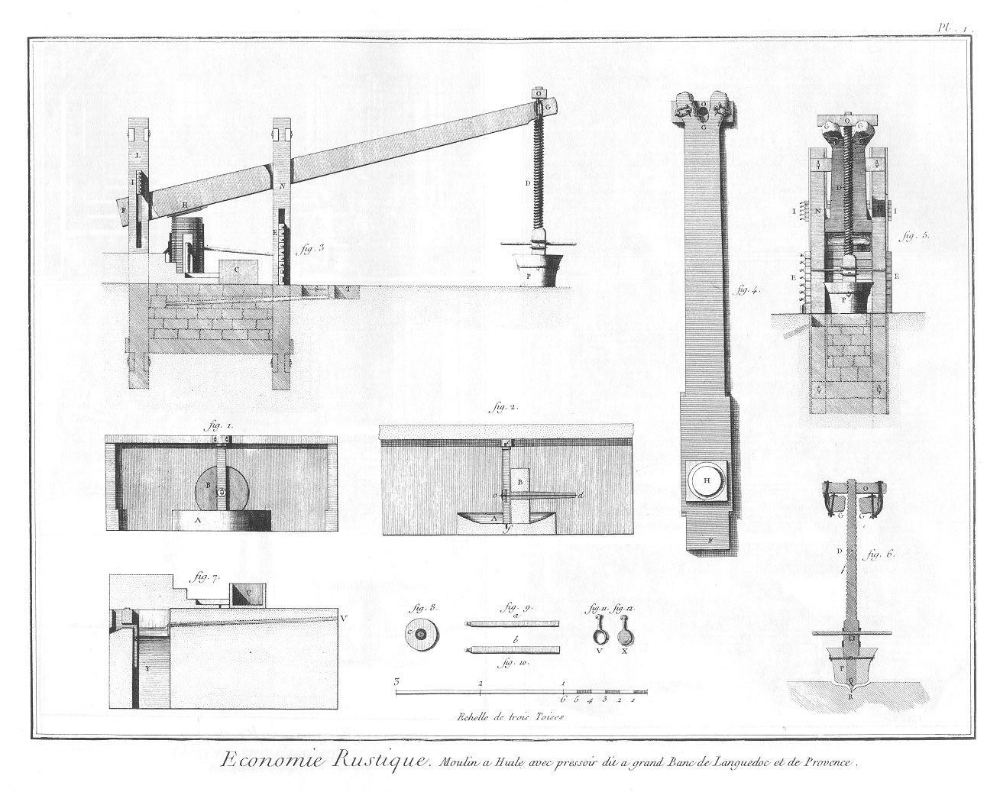
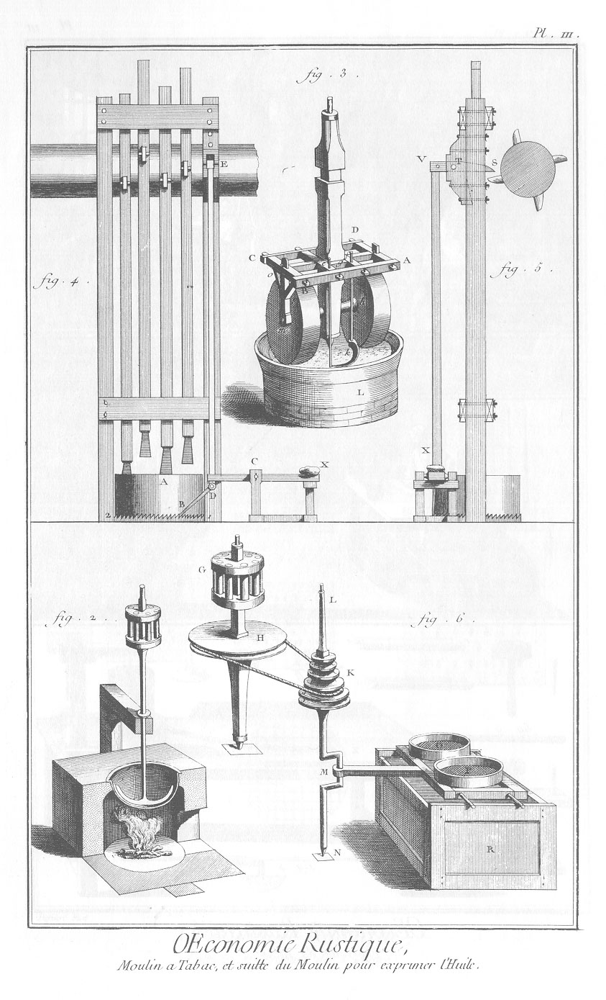

MOULINS A EXPRIMER LE SUC des fruits & l'huile des graines.
===========================================================

PLANCHE Iere. double. Moulin à huile avec pressoir, dit à grand banc, de Languedoc & de Provence.
-------------------------------------------------------------------------------------------------

1. Vue du moulin où l'on écrase les olives.
	- A, le bassin.
	- B, la meule.
2. Coupe du moulin.
	- A, coupe du bassin.
	- B, coupe de la meule. On voit aussi dans cette figure le bras de la meule assemblé avec l'arbre du moulin.
	- c d, le bras.
	- e f, l'arbre.
	- f, pivot sur lequel l'arbre se meut.
	- e, son tourillon d'en-haut.
3. Elévation du pressoir.
	- D, la vis.
	- F G, l'arbre.
	- E, clefs ou solives des petites jumelles N.
	- H, les cabats.
	- I, clefs ou solives des grandes jumelles L.
	- O, écrou de la vis.
	- P, le massif tenant à la vis.
	- C, auge placé à côté du pressoir.
	- S, premiere cuvette.
	- T, seconde cuvette dont l'usage est expliqué fig. 7.
4. Arbre séparé vû en-dessous.
	- O, écrou attaché à l'arbre, comme on voit, par des anneaux de fer & des clavettes.
	- H, plan de la partie en saillie qu'on voit en H, fig. 3.
	- F, queue de l'arbre F G.
	- G, sa fourche.
5. Vûe du pressoir en-devant.
	- O, l'écrou.
	- G G, les fourches de l'arbre.
	- N N, les petites jumelles.
	- I I, clefs des jumelles de derriere.
	- E E, clefs des jumelles de devant.
	- D, la vis.
	- P, le massif de la vis.
6. Coupe verticale de la vis & du massif.
	-O, écrou
	- G G, bouts de la fourche de l'arbre embrassés de leurs attaches.
	- D, la vis.
	- P, le massif.
	- Q, pivot de la vis.
	- R, crapaudine du pivot Q.

7. Coupe du massif sur lequel le pressoir est assis. Voyez en S (fig. 3), une cuvette : c'est là que se rend l'huile de dessous le pressoir. Gette cuvette est pleine d'eau aux deux tiers. On ramasse l'huile de dessus cette eau ; ensuite par un robinet (même fig. 3.) on laisse passer dans la cuvette T l'eau de la cuvette S, avec ce qui est resté d'huile à sa surface. De la cuvette T, l'eau & l'huile restante se rendent par le canal V (fig. 7) dans l'enfer Y. Ce receptacle Y se vuide de son eau par la chantepleure Z, qui puisant l'eau à une certaine profondeur, laisse l'huile qu'on ramasse ensuite, & rien ne se perd.

8. Un cabas.

9. a, clé ou solive des grandes jumelles.

10. b, clé ou solive des petites jumelles.

11. Cuiller ou casserole de cuivre.

12. Lame de cuivre.

PLANCHE II. Moulin à exprimer l'huile des graines.
--------------------------------------------------

1.
	- A B, arbre tournant qui porte les volans.
	- C, rouet.
	- D, autre rouet.
	- D E, arbre vertical.
	- F, pallier qui porte l'arbre vertical.
	- E, lanterne de l'arbre.
	- G, autre rouet de l'arbre horisontal.
	- H K, Q Q, levées de l'arbre.
	- L M, petits rouets.
	- N N, cammes ou levées.
	- O P, pilons.
	- Q Q, cammes qui font mouvoir les pilons.
	- S S, R R, autres pilons.
	- f, f, f, mortiers.
	- T V, c d, moises qui guident les pilons dans leur mouvement.
	- a b, moises à laquelle sont fixés les cliquets qui servent à suspendre les pilons.
	- 1, 5, place où l'on met les sacs.
	- 6, 7, calles qui servent à la pression latérale.
	- 4 4, autres calles.
	- 3, coins que le pilon S enfonce pour serrer.
	- 2, coin renversé que le pilon R chasse pour desserrer. 
	- X Y, Z AE, piece de bois où sont pratiqués les mortiers.

PLANCHE III. Détails du précédent moulin, & moulin à moudre le tabac.
---------------------------------------------------------------------

2. Chaudiere où le marc se prépare à une seconde expression.

3. Moulin à écraser différentes substances végétales qui donnent de l'huile. On voit sur l'arbre un collet quarré sur lequel on monte un hérisson ou rouet horisontal, qui emprunte son mouvement du moulin, fig. 2.
	- A B C D g, chassis.
	- m, h, les meules.
	- e k f, faux qui ramasse la graine.
	- L, le massif de la cuve en pierre qui reçoit l'huile de la graine écrasée.

4. Moulin à tabac.
	- A, le mortier.
	- B, le cliquet.
	- E D, chevron qui pousse le cliquet.
	- 1, 2, rochet qui entoure le mortier.
	- B C X, bascule qui sert à relever le chevron du cliquet.

5. Profil de la batterie de la fig. 4.
	- S T V, bascule supérieure qui pousse le chevron du cliquet.
	- V X, chevron du cliquet.

6. Machine à sasser ou tamiser le tabac.
	- G, lanterne.
	- H, poulie.
	- K, poulie à plusieurs gouttieres, sur une desquelles passe la corde sans fin qui vient de la poulie H.
	- L M N, manivelle.
	- O P, tamis.
	- R, coffre.

[->](../09-Manufacture_de_tabac/Légende.md)
