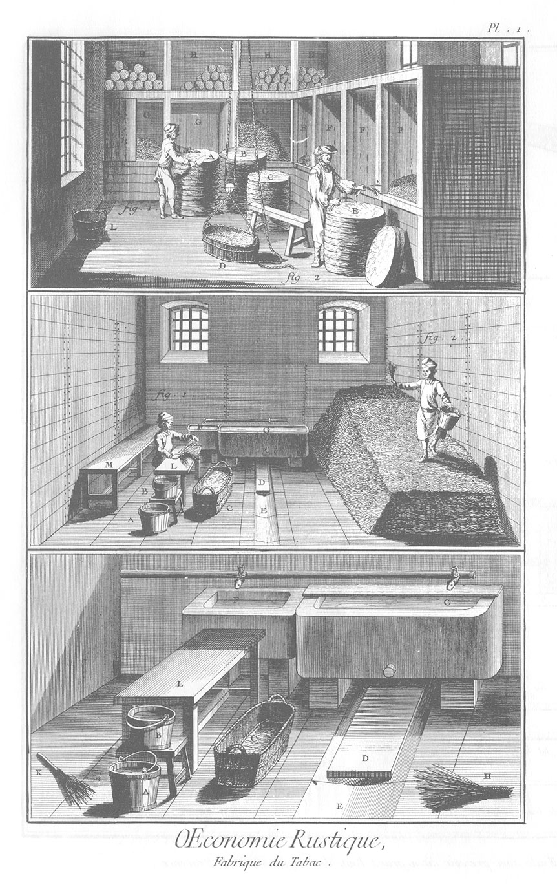
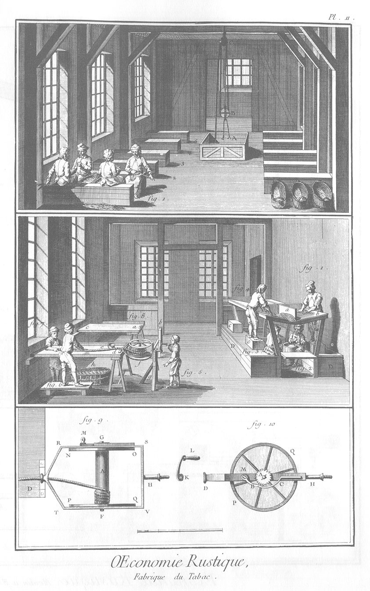
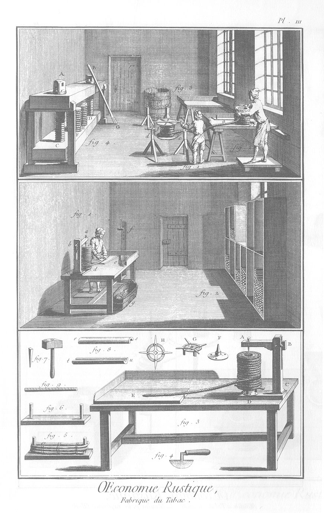
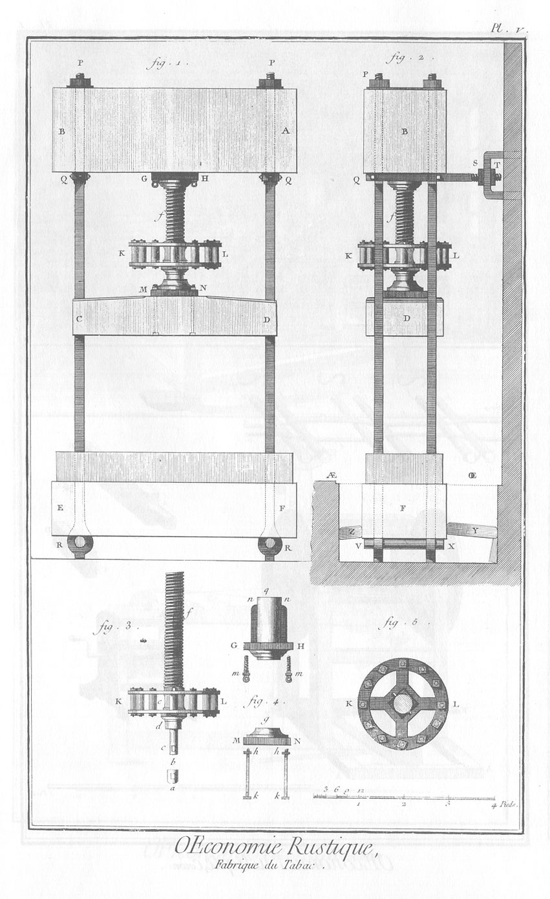
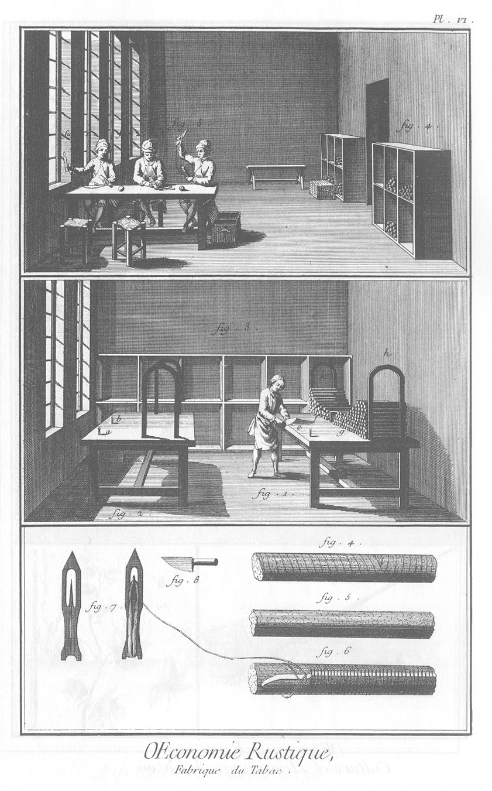

MANUFACTURE DE TABAC.
=====================

PLANCHE Iere.
-------------

Le haut de la planche. Attelier de l'époulardage où l'on fait le triage des feuilles, & où l'on sépare les manoques, pour les distribuer par sortes dans les cases F G.

1. Ouvrier qui coupe autour de la masse d'un boucaud toutes les feuilles qui ont été avariées en mer ou autrement.
	- A B C, masses de feuilles contenues dans les boucauds.

2. Ouvrier qui détache les manoques de la masse E d'un boucaud pour les distribuer dans les cases F.
	- D, panier que l'on enleve par le moyen d'une poulie, pour transporter les feuilles dans l'attelier des écoteurs, placé au-dessus de celui-ci.
	- HHH, rolles de tabac déposés au-dessus des cases.

Le milieu de la Planche, attelier de la mouillade.

1. L'ouvrier placé devant une table L, choisit dans les manoques ou bottes de feuilles celles qui sont propres à faire des robes. On entend par robes les feuilles les plus longues & les plus larges destinées à recouvrir les rolles. Il les mouille avec un balai servant d'aspersoir ; elles passent ensuite à l'attelier des écoteurs.
	- C, manne où l'ouvrier met les robes à mesure qu'il les mouille.
	- A B, seaux dans lesquels la sauce est contenue.

2. Ouvrier monté sur un amas de feuilles. Il tient d'une main un seau rempli de sauce, & de l'autre un aspersoir pour mouiller par couches ce qu'on appelle déchets mélangés. On voit par la figure que cet attelier est placé au rez-de-chaussée ; que le pavé est formé par de grandes dalles de pierres un peu inclinées vers celles du milieu E, qui sont creusées en caniveau pour laisser écouler l'eau superflue. D, planche qui couvre une partie du caniveau, afin que l'accès auprès des cuves de pierre F G, soit plus facile. Les parois de cet attelier sont couverts de fortes planches, pour empêcher que les tas de feuilles ne touchent les murailles. Il y a aussi différentes tables, comme M.

Le bas de la Planche. Les parties les plus essentielles de l'attelier de la mouillade, vûes plus en grand, & cottées des mêmes lettres.

- A B, seaux.
- C, manne.
- D, planche qui couvre le caniveau E.
- F G, deux robinets partant d'un tuyau commun, par lesquels l'eau nécessaire est versée dans les cuves de pierre qui sont au-dessous, dans lesquelles on prépare la sauce.
- H, K, grands & petits balais ou aspersoirs à l'usage des mouilleurs.

PLANCHE II.
-----------

Le haut de la Planche, attelier des écoteurs. A, ouverture pratiquée au plancher & entourée d'une rampe, par laquelle, au moyen des poulies mouflées B C, on monte les feuilles qui sortent de la mouillade, dont l'attelier, aussi-bien que celui de l'époulardage, est placé au-dessous de celui-ci.

1. &
2. &
3. &
4. &
5. Bancs sur chacun desquels sont assis plusieurs petits garçons occupés à écôter les feuilles, c'est-à-dire à en ôter la côte longitudinale. Ils jettent les feuilles écôtées dans une autre manne, & les côtons ou côtes derriere les bancs où ils sont assis.

Le milieu de la Planche, filage, attelier des fileurs.

1. &
2. &
3. &
4. Filage à la françoise. Il se fait sur une table fort élevée, divisée par des cloisons en quatre parties égales, qui sont les places d'autant d'ouvriers. D D, bancs sur lesquels s'asseyent les ouvriers servans, fig. 2. & 3. Il y en a deux pour chacun des deux ouvriers fileurs, fig. 1. & 4. L'un (fig. 2.) prend une certaine quantité de feuilles proportionnée à la grosseur que l'on veut donner au boudin. Il les comprime par un premier tord, & les passe ensuite à l'ouvrier fileur (fig. 1.), pour être filés les uns au bout des autres. Le second enfant assis à côté & sur le même banc, & qui n'a point été représenté pour éviter la confusion, passe des robes toutes préparées au même fileur. Le fileur (fig. 4.) est de même servi par deux enfans, dont l'un lui fournit des poignées & l'autre des robes. L'un & l'autre des deux fileurs (fig. 1. & 4.) forment avec les poignées des parties de boudin longues d'environ trois pieds a b, appellées poupes. Chacun des fileurs est monté sur un escabeau c c, pour pouvoir opérer avec plus de facilité sur la table indiquée où il forme les poupes. L'autre côté de l'attelier représente la maniere de filer à la hollandoise, en se servant du rouet.

5. Enfant qui tourne le rouet f.

6. Fileur qui réunit les unes aux autres les poupes que les fileurs (fig. 1. & 4.) ont formées, & les couvre d'une nouvelle robe.

7. Enfant qui fournit les robes au fileur.
	- e, écuelle dans laquelle est une éponge imbibée d'huile d'olive, dont le fileur se frotte les mains, pour que le boudin roule avec plus de facilité entre elles & la table. Les fileurs de poupes en ont aussi une semblable.
	- d, crapaudine de bois sur laquelle roule le bourlet ou collet du rouet.
	- g, poteau sur lequel roule l'autre tourillon du rouet.
	- h, manne dans laquelle l'ouvrier de la fig. 7. prend les robes.

8. Table dégarnie de son rouet.
	- a c, la table.
	- a, la crapaudine.
	- b, montant qui porte le tourillon de la manivelle.

Le bas de la Planche.

9. Plan du rouet : il est de fer, & composé d'un chassis R S T V, dont les longs côtés R S, T V, sont percés en G & F de deux trous ronds, pour recevoir les tourillons de l'arbre ou noyau A sur lequel le boudin se roule. Les longs côtés sont réunis ensemble par la traverse S V, & par les parties R D, T D, qui. communiquent à la douille D, par l'ouverture de laquelle passe le boudin. Tout le chassis est d'une seule piece. Les extrémités du noyau A sont terminées par deux cercles N O, P Q, dont on voit l'élévation dans le profil du rouet (fig. 10.), & fermées intérieurement par deux plaques de tolle. Sur le milieu de la traverse S V, est fixé un boulon H, qui sert de tourillon au rouet. L'extrémité de ce tourillon taraudée en vis, est reçue dans l'ouverture K de la manivelle K L, dont la poignée L est mobile sur une broche qui la traversé. Le tourillon H roule dans des collets qui sont au haut du poteau vertical g ; & le bourlet de la douille D roule dans la crapaudine de bois dont on a parlé, qui est fixée sur le bord de la table du fileur.

10. Le profil du rouet.
	- Q, élévation d'un des cercles qui terminent le noyau du rouet.
	- A, rochet denté monté quarrément sur le prolongement du tourillon G du noyau A, fig. 9.
	- B, cliquet qui est continuellement poussé contre les dents du rochet par le ressort C.
	- M, piton à vis qui sert de centre de mouvement au cliquet, & que l'on ôte quand on veut devider le boudin dont le rouet est chargé, pour en former des rolles.

PLANCHE III.
------------

Le haut de la Planche, attelier des rolleurs.

1. Ouvrier qui devide le rouet chargé de tabac en boudin, & le fait passer au rolleur, fig. 2. f, le rouet dont les tourillons sont portés par les deux poteaux d e. Chacun de ces poteaux est retenu par quatre liens assemblés dans les faces & sur le plancher. Pour devider le boudin de tabac de dessus le rouet, on ôte le piton M (Planc. II. fig. 9 & 10.), & par ce moyen le cliquet B; ce qui permet au rouet de rétrograder.

2. Le rolleur. C'est l'ouvrier qui forme les rolles. On entend par rolle une pelote où le boudin est roulé plusieurs fois sur lui-même. Voici la maniere dont on les forme. Le rolleur a devant lui sur sa table l'instrument (fig. 6.) du bas de la Planche, qu'on nomme matrice, garni de deux chevilles de bois, & ayant saisi un bout du boudin, il l'applique à côté d'une des chevilles, & forme un écheveau composé de trois tours (fig. 5. du bas de la Planche.) Il lie en trois endroits cet écheveau avec de la ficelle, & le retire ensuite de dessus la matrice. C'est cet écheveau qui occupe le centre du rolle & en forme le noyau. Pour achever de le former, le rolleur attache le bout de boudin à une des extrémités avec une petite cheville de bois, & continue de tourner le boudin autour du noyau, jusqu'à ce qu'il soit tout couvert. On forme ainsi trois, quatre ou cinq couches les unes sur les autres, dont on observe de bien serrer & cheviller les différens tours.

3. Autre table destinée au même usage. On voit à côté un boucaud g, rempli de chevillettes de bois d'environ trois pouces de longueur, qui servent à fixer les différens tours du boudin les uns sur les autres.

4. Vûe perspective de la presse, pour comprimer & égaliser les rolles. Elle est composée de deux fortes tables de bois d'orme. La supérieure portée par des chevalets est percée de deux trous, pour laisser passer les vis de bois A C, B D. La table inférieure est aussi percée de deux trous qui répondent au-dessous de ceux de la table supérieure. Ces trous sont taraudés pour recevoir les vis & leur servir d'écrous. C'est sur la table inférieure que l'on pose les rolles F F qu'on éleve avec la table inférieure mobile entre les quatre montans des chevalets, pour les comprimer fortement entre les deux tables, en faisant tourner les vis A B du sens convenable avec le levier G.

Le milieu de la Planche, attelier des coupeurs.

1. Le coupeur debout devant une table solide recouverte d'une planche, tire à lui le bout du boudin d'un rolle a d, qui est monté sur la machine, dont le détail est au bas de la Planche ; & l'ayant étendu, il applique dessus la matrice ou mesure (fig. 8.) & avec le couteau (fig. 4.) il coupe de mesure ce boudin : ce qui forme des longueurs e. Il continue jusqu'à ce que le rolle soit entierement employé. b c, montant percé d'une longue mortoise, pour que le bras a b, qui porte le pivot supérieur, puisse s'élever & s'abaisser à volonté, suivant les différentes hauteurs des rolles. f, chambriere. g, manne dans laquelle le coupeur transporte les longueurs, pour les déposer par sortes & qualités dans les cases.

2. Cases formées de planches d'environ dix-huit pouces de profondeur, où on dépose par sortes les longueurs.

Bas de la Planche.

3. La table du coupeur vûe sous un autre aspect & plus en grand.
	- A B C D, machine dans laquelle le rolle est monté.
	- D C, semelle B C, poteau vertical percé d'une longue mortoise pour laisser couler le bras. Les faces latérales sont aussi percées de plusieurs trous ronds pour recevoir une cheville de fer qui fixe le bras à la hauteur que l'on veut.
	- A B, le bras dont le tenon est traversé d'une clé aussi de bois, pour affermir solidement le bras avec le montant.
	- A, pivot supérieur que l'on fait entrer à force dans le centre du rolle.
	- F, platine & pivot inférieur que l'on fixe en D sur l'extrémité de la semelle, par quatre vis à bois. Le pivot qui roule dans le canon de la platine, & dont la partie supérieure est quarrée, est reçu dans un trou de même forme qui est au centre de la piece G, dont on voit le plan en H.
	- E, la planche sur laquelle le coupeur coupe les longueurs.

4. Couteau du coupeur.

5. La matrice chargée d'un écheveau.

6. La matrice vûe séparément.

7. Masse ou marteau du rolleur, & chevillette quarrée dont il fait usage pour assujettir les uns sur les autres les différens tours du boudin qui forment un rolle.

8. La matrice avec laquelle le coupeur mesure les longueurs du boudin qu'il veut couper, pour que les bouts soient égaux entre eux.
	- r s, matrice vûe par-dessus, & du côté où l'ouvrier la tient.
	- t u, matrice vûe par-dessous & du côté qui s'applique sur le boudin. Cet outil est ferré par les deux bouts.

9. Longueur de boudin égale à la longueur de la matrice, & un peu moindre que la longueur des carottes qu'elles doivent former.

PLANCHE IV. Presses.
--------------------

Attelier des presses où on met le tabac en carottes.

- 1, 2, 3, 4, 5, 6, &c. presses rangées des deux côtés & sur le mur du fond de cet attelier. Il y en a dans la fabrique de Paris jusqu'à soixante rangées le long des quatre faces d'une longue galerie. Vingt ou vingt-cinq ouvriers appliquent leurs forces à l'extrémité du grand levier de fer avec lequel on fait tourner les vis des presses.
- A, chapiteau qui couvre l'ouverture de l'écrou dans lequel passe la vis, dont l'extrémité supérieure entre dans le chapiteau, lorsqu'on desserre la presse, & que la lanterne est élevée à une certaine hauteur.
- B, la lanterne qui est montée quarrément sur la vis, & dont les platines & les fuseaux sont aussi de fer.
- C, sommier ou table de la presse entaillée aux quatre coins pour faire place aux jumelles le long desquelles il peut descendre, étant suspendu à l'extrémité inférieure de la vis. L'excursion est d'environ deux piés.
- D, pile de tables remplies de moules, dans chacun desquels on a mis six ou huit longueurs, que la forte pression réunit & forme en carottes.
- E, seuil de la presse dont on ne voit que la moindre partie, le reste étant dans une fosse recouverte de planches qui affleurent le plancher ou rez-de-chaussée de cet attelier. La presse cottée 2 est entierement vuide, ainsi que toutes celles qui sont du côté des fenêtres. Celles qui sont cottées 3, 4, 6, ont été plus ou moins comprimées. Celle qui est cottée 5 n'a point de sommier ni de vis. On voit aussi dans le milieu du même attelier un long établi sur lequel on range les tables qui contiennent les moules.

1. Pieces du moule vû en grand. Il est composé de deux pieces de bois gh, kl, creusées en gouttieres demi-cylindriques. Les pieces inférieures k l sont séparées les unes des autres par de petits ais m m, n n, comme on le voit dans toutes les autres figures de la même planche.

2. Elévation d'une pile de tables remplies de moules, & les moules de longueurs pour former des carottes par la pression. Cette pile est composée de cinq tables, & chaque table contient douze moules, chaque moule huit bouts ou longueurs : ce qui en une seule pressée sait soixante carottes.
	- c c c c, pieces supérieures des moules. Entre d & e, on voit que les ais qui séparent les moules les uns des autres, laissent un vuide ; ce qui permet aux pieces supérieures des moules de descendre, lorsque le sommier de la presse s'applique en c c c c d e, & sur leurs faces supérieures. Cette premiere table a b, fait le même effet par rapport à celle qui est au-dessous, ainsi de suite jusqu'à la derniere.
	- f, profil des longs coins plats qui servent à presser latéralement les ais & les moules les uns contre les autres.

3. Elévation d'une pile de tables pour faire du tabac à six bouts Il y a six tables les unes sur les autres, & chacune contient quatorze moules.

4. Etabli sur lequel on arrange les moules dans les tables, & où on les remplit de longueurs.
	- o o o o o, pieces supérieures des moules non encore mises en place.
	- p p p, moules chargés de longueurs, & recouverts de leurs pieces supérieures.
	- q q q q, moules non encore chargés. C'est sur le fond de la gouttiere & entre les ais, que l'on étend le nombre de longueurs, six ou huit, convenable à la sorte de carottes que l'on veut former : on les y comprime légerement avec un vieux moule r r (au-dessous de la table), en frappant avec la masse s s ; en sorte que l'on puisse placer les pieces supérieures o o o o des moules, qui aussi-bien que les ais qui les séparent, doivent être graissées avec de l'huile d'olive.
	- t t, écuelle qui contient l'huile d'olive & l'éponge.
	- x, espece de brosse servant à nettoyer le fond des gouttieres des pieces inférieures.
	- u, maillet pour chasser les coins qui compriment latéralement les moules entre les côtés de la table.

PLANCHE V. Elévation, profil & développement d'une presse.
----------------------------------------------------------

1. Elévation d'une presse.
	- A B, sommier ou écrou de bois de chêne ; il est percé de quatre trous quarrés de deux pouces de dimension, pour laisser passer les quatre jumelles de fer de deux pouces d'équarissage.
	- P R, P R, deux bandes de fer plates, percées aussi de deux trous quarrés ; elles reçoivent les extrémités supérieures des deux jumelles. Les jumelles sont terminées en vis qui sont reçues dans de forts écrous de fer qui empêchent le sommier de s'élever.
	- G H, platine de la boëte de fer, ou écrou proprement dit de la vis f.
	- K L, lanterne de la vis ; elle est aussi toute de fer.
	- M N, crapaudine sur laquelle roule la portée de la vis, & par laquelle le sommier mobile ou la table C D est suspendue. Ce sommier est entaillé aux quatre coins pour recevoir les quatre jumelles le long desquelles il doit glisser ; elles lui servent de guide.
	- E F, seuil de la presse, au-dessous duquel en R R, sont deux boulons qui passent dans les yeux des jumelles, ce qui les empéche de s'élever. Le seuil est placé dans une fosse de maçonnerie, & y entre jusqu'à la retraite qu'on voit dans la planche. C'est sur cette retraite & sur une feuillure pratiquée dans la maçonnerie, que se reposent les planches ou madriers qui ferment les fosses où sont placés les seuils des presses, & où ils sont isolés. On a soin aussi de les enduire de goudron pour les conserver.

2. Profil ou élévation latérale de la même presse.
	- P, écrou de fer au haut des jumelles.
	- B, sommier ou écrou de bois.
	- Q T, moises de fer entaillées du côté des jumelles, qu'elles reçoivent dans leurs entailles, comme on voit en Q, fig. 1. une des deux moises plus longue que l'autre, a son extrémité T taraudée en vis, & traverse un fort crampon scellé dans le mur. La longue moise y est fixée par un écrou T & par un contre-écrou S; en sorte qu'elle ne peut avancer ni reculer. Les deux moises sont jointes ensemble par des boulons à tête & à vis ; elles reposent sur des bossages soudés aux faces latérales des jumelles, & elles portent le sommier, comme on voit, fig. 1. f, la vis.
	- K L, la lanterne.
	- D, sommier mobile ou table de la presse avec les entailles qui reçoivent les jumelles
	- F, le seuil dont on voit les retraites sur lesquelles posent les planches qui affleurent le rez de chaussée indiqué par la ligne ponctuée AE OE.
	- Z Y, étrésillons qui assujettissent le corps de la presse dans la fosse de maçonnerie où le seuil est renfermé.
	- V X, fort boulon de fer qui traverse les yeux des jumelles, dont la partie inférieure terminée en quarré, pose sur le fond de la fosse.

3. Profil de la vis & de la lanterne séparée de la presse.
	- f, la vis dont les filets qui sont quarrés, ont cinq lignes de largeur, & autant de profondeur.
	- e, partie de la tige de la vis, qui est arrondie & placée entre deux parties quarrées qui traversent les platines de la lanterne K L. C'est sur cette partie arrondie que s'applique l'extrémité du levier avec lequel on serre la presse.
	- d, assiete ou pivot qui repose sur la crapaudine du sommier mobile.
	- d b, tige qui traverse cette crapaudine & la platine qui lui sert de base. L'extrémité b est percée d'une mortoise c.
	- a, cul-de-lampe, dans lequel entre l'extrémité b de la tige, après avoir traversé la crapaudine & sa platine quarrée. Le cul-de-lampe est aussi percé d'une mortoise égale à la mortoise c de la tige d b. Une clavette de calibre joint ensemble ces deux pieces, entre lesquelles la crapaudine & sa platine qui ne sont qu'une seule piece, peuvent tourner aisément.

4. Profil de la boîte ou écrou proprement dit, qui re- çoit la vis.
	- G g H, la boîte.
	- n n, les deux lardons qui sont soudés sur la surface extérieure de la boîte pour la fortifier & l'empêcher de tourner dans le sommier de bois A B, fig. 1. où elle est encastrée jusqu'à la platine G H. Cette platine de la forme d'un parallélogramme, presque aussi longue que le sommier a d'épaisseur, est percée aux quatre coins, pour recevoir des pitons à vis m m, par le moyen desquels la boîte est fixée & demeure suspendue à la face inférieure du sommier ou écrou de bois que la vis peut traverser.
	- M g N, profil de la cra- paudine.
	- g, partie sur laquelle s'applique la portée d de la vis, fig. 3.
	- M N, la platine de même dimension que celle de la boîte ; elle est aussi percée aux quatre angles de trous destinés à recevoir l'extrémité h des boulons k k qui traversent toute l'épaisseur du sommier mobile C D, fig. 1. & de la platine M N. Les têtes k k de ces boulons sont noyés & affleurent la surface inférieure du sommier en dessous ; leurs extrémités supérieures h h, qui sont taraudées en vis, sont reçues, après avoir traversé la platine, dans des écrous, par le moyen desquels le sommier mobile demeure suspendu à la crapaudine.

5. Plan de la lanterne K L, qui a douze fuseaux. Les extrémités des fuseaux sont taraudées & reçoivent des écrous, par le moyen desquels ils sont fixés solidement aux platines de la lanterne.

PLANCHE VI.
-----------

Le haut de la Planche, attelier des ficeleurs.

1. &
2. &
3. Ouvriers qui ficelent les carottes de tabac, après qu'elles sont sorties des moules.
4. Corps de tablettes où les ouvriers placent les carottes ficelées qui doivent ensuite passer dans l'attelier des pareurs, & aussi celles qui sont encore sous lisieres, telles qu'elles viennent de l'attelier des presses. Quelques mannes, pour transporter les carottes, sont tout ce qu'on trouve d'instrument dans cet attelier.

Le milieu de la Planche, attelier des pareurs.

1. Pareur qui avec le couteau à parer coupe & ébarbe les extrémités des carottes. Pour cela il appuie la carotte contre une cheville de fer fixée dans la table e, sur laquelle il travaille, & de l'autre main il coupe le superflu qui n'a pas pu être cordé. Leurs tables ou établis sont garnis de deux arcs de fer h, k, dont l'usage est d'empecher les carottes de rouler. Du côté g sont les carottes parées, & de l'autre f celles qui n'ont pas eu cette préparation.

2. Autre établi pour parer. a b, chevilles.

3. Corps de tablettes pour déposer les carottes.

4. Carotte sous lisiere, c'est-à-dire enveloppée d'un ruban de fil tourné en spirale tout du long de la carotte. On les enveloppe ainsi au sortir des moules & dans l'attelier des presses, pour empêcher que les différentes longueurs ne se séparent dans le transport & par le frottement.

5. Carotte dépouillée de sa lisiere, ou telle qu'elle est en sortant du moule, avant d'en avoir été revêtue.

6. Carotte en partie ficelée, où on voit la vignette qui contient une ligne d'impression.

7. Aiguilles de ficeleur. L'une est vuide, & l'autre est chargée de ficelle.

8. Couteau du pareur.

[->](../10-Chanvre_premier_travail_à_la_campagne/Légende.md)
