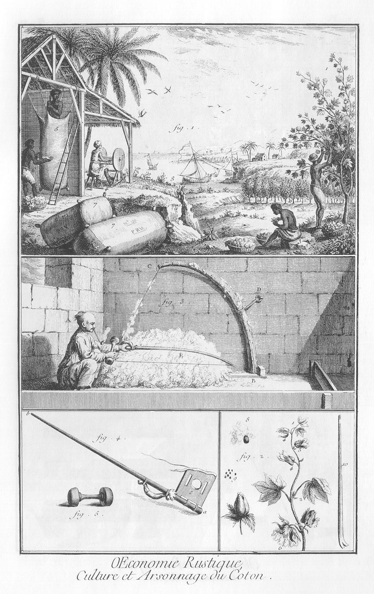

CULTURE ET ARSONNAGE du Coton.
==============================

1. Une habitation des Isles de l'Amérique où l'on cultive le coton.
	- No. 1, cotonier dans toute sa grandeur, arbuste portant le coton.
	- 2, negre qui cueille le coton.
	- 3, negre qui épluche le coton.
	- 4, négresse qui passe le coton au moulin, pour en séparer la graine.
	- 5, negre qui emballe le coton en le foulant des piés, & se servant d'une pince de fer pour le même effet.
	- 6, autre negre qui de tems en tems mouille la balle extérieurement en jettant de l'eau avec les mains pour faire resserrer la toile qui hape mieux le coton & l'empêche de gonfler & de remonter vers l'orifice de la balle.
	- 7, balles de coton prêtes à être livrées à l'acheteur.
	- 8, petits bâtimens caboteurs qui viennent charger du coton sur la côte.
	- 9, partie d'une plantation de cotoniers.
	- 10, case à coton, & engard sous lequel se rangent les négresses qui passent le coton au moulin.

2. Extrémité d'une branche de cotonier.
	- No. 1. Petites feuilles à trois pointes.
	- 2, grandes feuilles à cinq pointes.
	- 3, fleurs.
	- 4, 4, feuilles formant le calice de la fleur.
	- 5, cocon, ou fruit du cotonier ; couvert de son calice.
	- 6, fruit ouvert dont les flocons de coton sont épanouis.
	- 7, cocon qui commence à s'ouvrir par la pointe.
	- 8, graine de coton à-peu-près de grosseur naturelle.
	- 9, graines de coton proportionnées au dessein de la plante.
	- 10, pince de fer en pié de chevre, servant à fouler le coton dans les balles.

3. Arsonnage du coton.
	- A, le chinois.
	- B C, faisceau de roseaux qui soûtient l'arson.
	- d, anneau de fer qui soutient le faisceau de roseaux.
	- E, le coton sous la corde de l'arson.

4. L'arson.
	- a b, perche de l'arson.
	- c, panneau de l'arson.

5. Coche.

[->](../12-Travail_&_emploi_du_coton/Légende.md)
