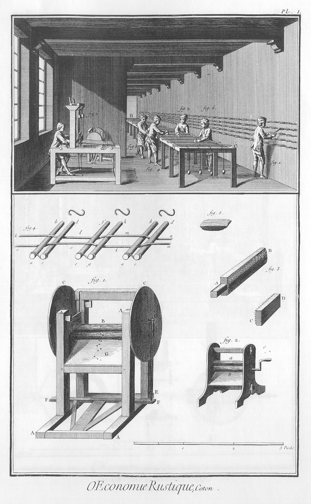
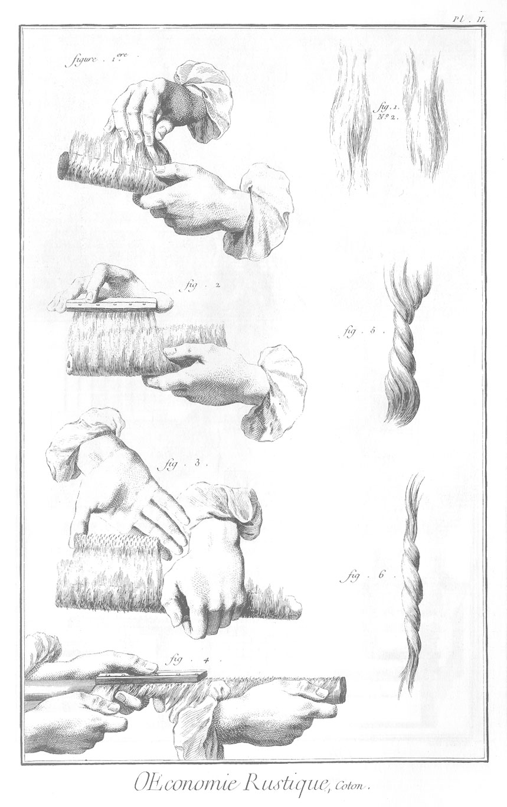
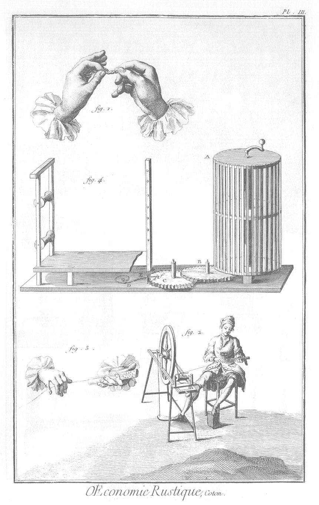
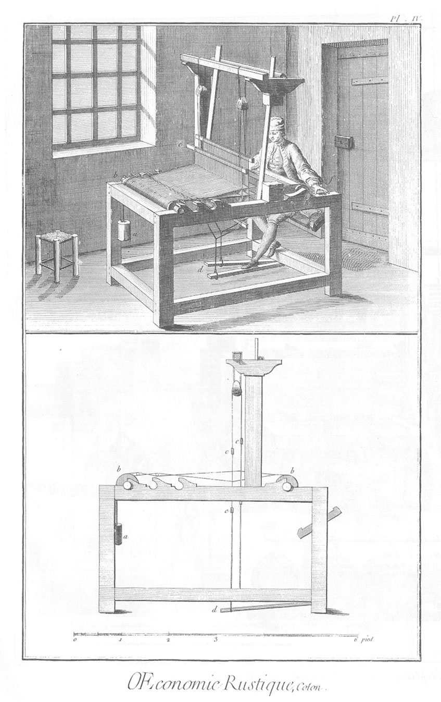

TRAVAIL ET EMPLOI DU COTON.
===========================

PLANCHE Iere.
-------------

Le haut de la Planche, ou la vignette représente l'interieur d'une fabrique.

1. Ourdisseur qui ourdit la chaîne. L'ourdissoir est composé de cinq rangs de chevilles sur lesquelles il étend & assortit les fils de différentes couleurs, observant de conserver les encroix. Ces chevilles sont de six pouces de longueur hors du mur & par couples. La distance d'une couple à l'autre est d'environ un pié.

2. &

3. Ouvriers qui avec de la colle imbibent la chaîne envergée & étendue sur l'équari A B, sur les longs côtés duquel les enverjures ou baguettes C D reposent.

4. &

5. Deux autres ouvriers qui suivent les précédens & achevent d'étendre l'apprêt, en passant leurs vergettes ou pelotes de pluche de laine dessus & dessous la chaîne, à laquelle ils les appliquent en coulant de A vers B, pour la sécher & en séparer les fils.

6. Tisserand qui fabrique sur le métier une piece de toile. On voit auprès le moulin à pié.

Le bas de la Planche. 

1. Moulin à pié pour séparer le coton de sa graine.
	- A A A A, les montans & patins du chassis qui porte les rouleaux.
	- B, les rouleaux, à une des extrémités de chacun desquels est fixée quarrément une des deux roues ou volans
	- C, C, qui tournent en sens contraire.
	- D, cheville placée hors du centre servant de manivelle.
	- D E, corde qui communique le mouvement du marchepié à une des roues C. Il y en a une semblable à l'autre extrémité F du marchepié E F.
	- G, tablette inclinée sur laquelle tombe la graine. Les coussinets ou collets dans lesquels roulent les tourillons des rouleaux, peuvent être serrés ou desserrés à volonté, pour approcher ou éloigner les rouleaux mobiles dans les rainures des montans où on les fixe par des clés.

2. Petit moulin à main pour le même usage.
	- a b, les rouleaux cannelés.
	- c, la manivelle.

3. Les deux cardes du fileur.
	- A B, la grande carde.
	- C D, la petite carde.

4. Partie de la chaîne & des baguettes ou envergeures sur lesquelles les fils de la chaîne s'entrecroisent.
	- a b, c d, couple de baguettes.
	- e f, g h, autre couple de baguettes éloignées d'environ un pié de la premiere. Les deux baguettes d'une couple sont jointes ensemble par des S de fil de fer.
	- r s t u, un des fils de la chaîne qui passe alternativement dessous & dessus une des baguettes de chaque couple.
	- k l m n, second fil de la chaîne qui passe dessus & dessous les baguettes qui sont mises pour soûtenir la chaîne dans toute sa longueur, & conserver tous les encroix que l'ourdisseur (fig. 1.) de la vignette y a pratiqués.

5. Une des deux pelotes revêtue de pluche de laine, dont les apprêteurs (fig. 2. 3. 4. 5.) se servent comme de vergettes pour étendre l'apprêt sur la chaîne. L'intérieur de la pelote est rempli de crin frisé.

PLANCHE II. Maniere de peigner le coton.
----------------------------------------

1. Premiere opération. Peigner du coton avec une seule carde.

	- bis. Flocons de coton faits à la main, après qu'on a séparé la graine.

2. Seconde opération. Continuation du peigner du coton, ou partage du coton sur deux cardes.

3. Troisieme opération du peigner du coton, ou transport du coton de la grande carde sur la plus petite.

4. L'étoupe du coton.

5. Flocon de coton lustré une premiere fois.

6. Flocon de coton lustré une seconde fois.

PLANCHE III.
------------

Maniere de lustrer & de filer le coton.

1. Lustrage du coton.

2. Filage du coton.

3. Mains du fileur vûes séparément.

4. L'ourdissoir.
	- A, le tambour de l'ourdissoir.
	- B C, roues qui mesurent la quantité de l'ourdissage.
	- D d f, ressort qui avertit de la quantité de l'ourdissage.

	Lorsque le tambour a fait autant de tours qu'il en faut pour que la roue B en fasse un ; & la roue B autant de tours qu'il en faut pour que la roue C en fasse un : alors la cheville d rencontre l'extrémité f du ressort D d f, passe & laisse revenir le ressort qui frappe un coup contre la cheville E.

PLANCHE IV. Métier à faire la toile de coton.
---------------------------------------------

Nota. Dans le texte ce sont des lettres majuscules, & dans les Planches on a mis des lettres minuscules.

Le haut de la planche représente le métier à faire la toile de coton, & l'ouvrier à son métier : ce métier n'a rien de particulier.

- a, le poids qui passe sur l'ensuple de derriere, & qui tend la chaîne.
- b b, l'ensuple & le chassis du métier.
- c, les lisses.
- d, les marches.
- f, l'ouvrier.

Au bas de la Planche, le même métier vû de profil. Les mêmes lettres marquent les mêmes parties.

- e e, les maillons.

[->](../13-Culture_de_la_vigne/Légende.md)
