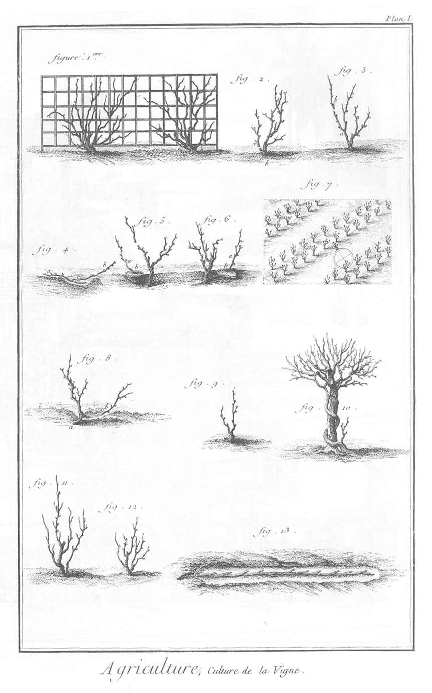
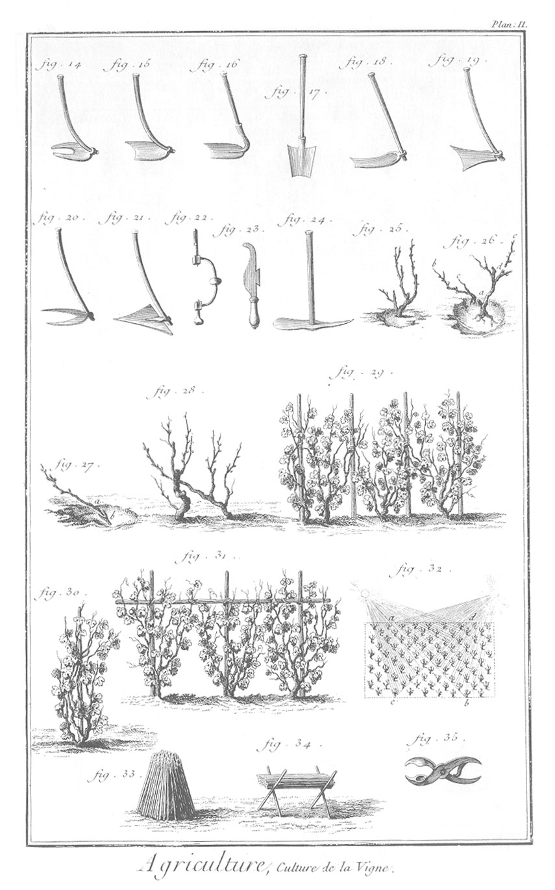

CULTURE DE LA VIGNE.
====================

PLANCHE Iere. Plant & plantations de la vigne.
----------------------------------------------

1. Gros sep de vigne en espalier.
2. &
3. Plan de crocette ou de bouture.
	- a, fig. 2.
	- b, fig. 3. crocette ou bouture.
4. Deux brins de plant en racine a b, disposés comme ils doivent l'être dans la bovette.
5. Plan de marcotte. a, brin passé par le panier b.
6. Autre plan de marcotte. a, brin passé à-travers une piece de gason b percée.
7. Plantation de vigne distribuée par planches.
8. Maniere dont la vigne veut être plantée.
9. Plan piqué droit, à ravaler ou provigner.
10. Vigne attachée à l'arbre ou saule.
11. Vigne moyenne.
12. Vigne basse.
13. Vigne dont on a déchaussé les racines pour en connoître l'âge.

PLANCHE II. Suite de la Planche précédente, & outils.
-----------------------------------------------------

14. Houe à deux bran-
15. Houe simple. 
16. Sarcle, ou hoyau plat. 
17. Bêche. 
18. Hoyau.
19. Raclette.
20. Crochets.
21. Maille.
22. Tarriere. ches.
23. Serpette.
24. Pioche de Bourgogne.
25. Maniere de déchausserla vigne.
26. Choix du plant.
27. Maniere de greffer.
28. Greffe en tronc.
29. &
30. &
31. Différentes manieres de lier la vigne à l'échalat.
32. De l'exposition de la vigne.
33. &
34. Différentes manieres d'entasser les échalats, après qu'on a déchalassé; soit en mort (fig. 33.) ou sur des échalats fichés en terre en croix de saint André, en formant des chevalets, fig. 34.
35. Outil à écraser les limaçons

[->](../14-Pressoirs/Légende.md)
