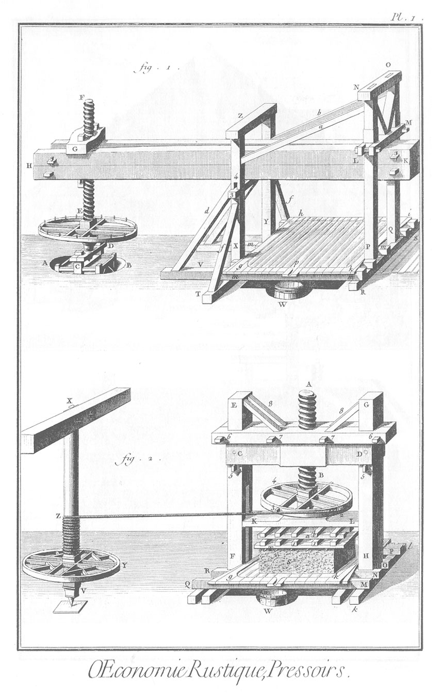
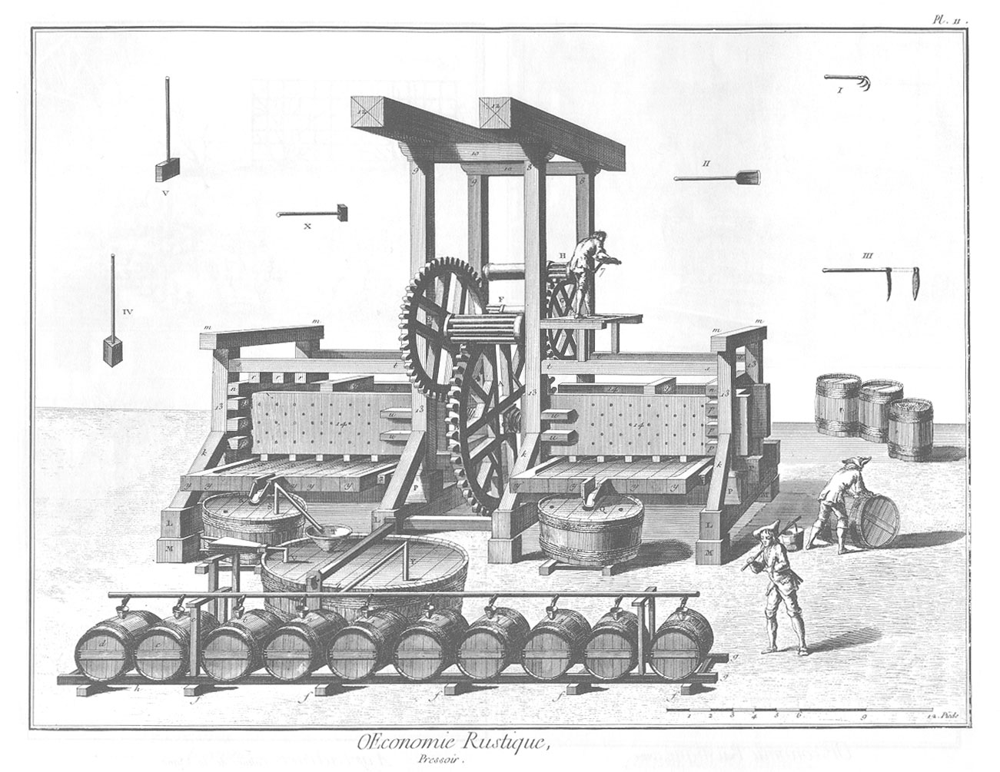
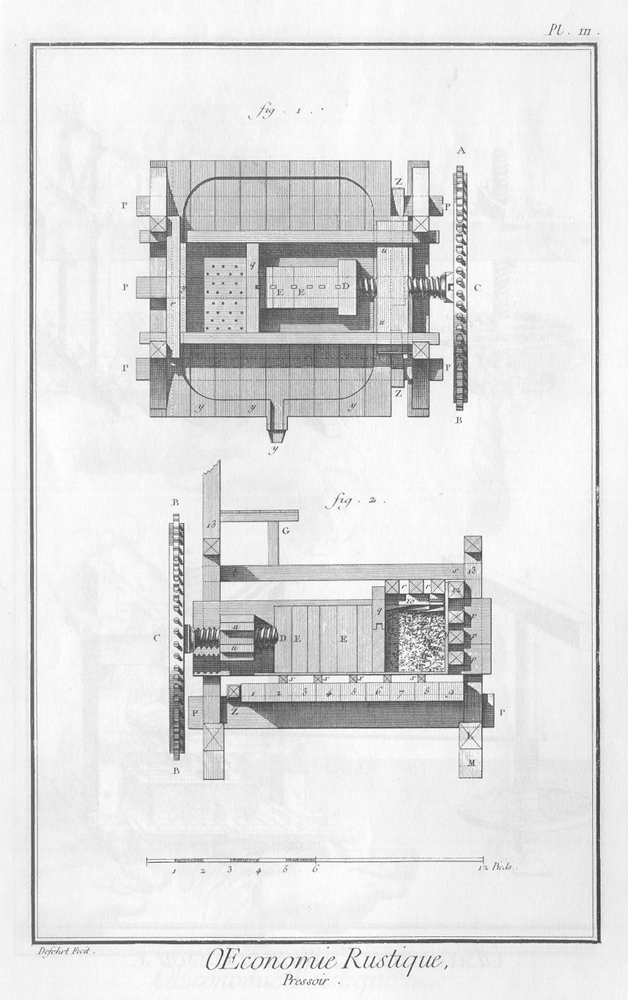

PRESSOIRS.
==========

PLANCHE Iere.
-------------

1. Pressoir à cage.
	- H K, arbre.
	- P Q, jumelles.
	- X Y, fausses jumelles.
	- Z, chapeau des fausses jumelles.
	- N O, chapeau des jumelles.
	- R S, faux chantier.
	- T, le souillard sur lequel les fausses jumelles sont assemblées.
	- f f, contrevents des fausses jumelles.
	- d, autres contrevents des fausses jumelles.
	- V, patin de ces contrevents.
	- m m, chantiers.
	- g, h, i, k, la maye.
	- p, beron.
	- 3, clés des fausses jumelles.
	- 4, mortoise de la jumelle.
	- L M, moises supérieures des jumelles.
	- a b, contrevents des jumelles & des fausses jumelles.
	- E, la roue.
	- E F, la vis.
	- G, l'écrou.
	- C D, moises de la cage.
	- A B, fosse de la cage.
	- W, barlong qui reçoit le vin au sortir du pressoir.

2. Pressoir appellé étiquet.
	- A B, vis. 2, 3, 4, la roue.
	- C D, écrou.
	- 5, 5; 6, 6; 7, 7; clés qui assemblent les moises ou chapeaux.
	- 8, 8, liens.
	- G H E F, jumelles.
	- K L, mouton.
	- g k, la maie.
	- Q M, R N, O P, chantiers.
	- k l, faux chantiers.
	- W, barlong.
	- S, marc.
	- T T, planches.
	- I I, a b, garniture qui sert à la pression.
	- V X, arbre ou tour.
	- Y, roue.
	- Z 2, la corde.

PLANCHE II. double. Pressoir à double coffre.
---------------------------------------------

Élévation perspective du pressoir.

- P P, chantier.
- L L, faux chantier.
- 8, 8; 9, 9; 13, 13, &c. jumelles k, k, k, contrevents.
- m n, chapeaux des jumelles.
- 10, 10, &c. autres chapeaux ou chapeaux du befroi.
- 12, 12, traverses.
- t, s, chaîne.
- q, mulet.
- 14, 14, &c. flasques. y, y, y, y, pieces de maie.
- z, coins.
- p, p, p, pieces de bois appuis du dossier.
- x, x, x, x, x, chevrons.
- u u, écrous.
- A B, grande roue.
- E, roue moyenne.
- G, petite roue.
- D E, pignon de la moyenne roue.
- F G, pignon de la petite roue.
- H K, pignon de la manivelle.
- M, bouquets ou piédestaux de pierre.
- X, masse de fer.
- I. grapin.
- II. pelle.
- III. pioche.
- IV. & V. battes.
- R, Q, barlongs.
- V, soufflet.
- S, T, tuyau de fer blanc.
- T, entonnoir.
- V Y, grand barlong.
- Y Z, tuyau de fer blanc.
- a, b, c, d, 1, 2, 3, 4, 5, 6, tonneaux.
- g, g, f, f, h, chantier.
- e, e, chevalets qui soutiennent le tuyau de fer blanc.

PLANCHE III.
------------

1. Plan & profil de l'un des coffres du pressoir.
	- P P, chantier.
	- r r, brebis.
	- y, dossier.
	- q, le mulet.
	- y, y, y, y, pieces de maie.
	- Z, coins.
	- D, mouton.
	- E E, coins ou pousseculs.
	- u u, écrou.
	- C D, vis.
	- A B, grande roue.

2. Coupe suivant la longueur d'un des coffres du pressoir.
	- L L, faux chantier.
	- 13, 13, jumelles.
	- t s, chaînes.
	- y, dossier.
	- r r, brebis.
	- q, le mulet.
	- 1, 2, 3, 4, 5, 6, 7, 8, 9, pieces de maie.
	- Z, coins.
	- D, mouton.
	- E E, coins ou pousseculs.
	- p, p, p, appuis du dossier.
	- 10, mouleau.
	- G G, planches à couteaux.
	- x, x, x, x, chevrons.
	- u u, écrou.
	- C D, vis.
	- A B, grande roue.
	- M, bouquets ou piés-destaux de pierre.
	- F, le marc.

[->](../15-Pressoir_à_Cidre/Légende.md)
