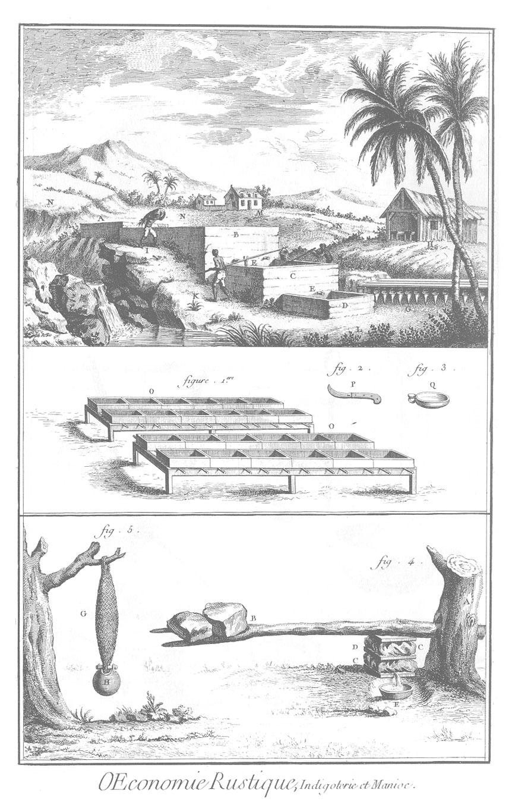

INDIGOTERIE ET MANIOC.
======================

Le haut de la Planche ou la vignette représente la vûe d'une indigoterie.

- A, reservoir d'eau claire.
- B, la trempoire.
- C, la batterie.
- D, le reposoir qu'on nomme aussi diablotin.
- E E, robinets d'où la teinture d'une cuve passe dans la cuve qui est au-dessous.
- E F, trous que l'on débouche successivement, pour vuider l'eau claire de la batterie, lorsque la fécule bleue s'est précipitée au fond.
- G, indigot dont on a rempli des sacs de toile en forme de chausses pour le faire égoutter.
- H, hangard ouvert & à claire voie sous lequel on met l'indigot dans des caissons, pour achever de le faire sécher à l'ombre.
- I, negre qui porte la plante dans la trempoire.
- K K, negres qui agitent continuellement la teinture de la batterie avec des seaux percés & attachés à de longues perches.
- L, plantes d'indigot.
- M, maison du maître de l'habitation.
- N, campagne semée d'indigot.

1. o, o, caissons de bois élevés sur des treteaux, servans à faire sécher l'indigot à l'ombre sous le hangard de la vignette.

2. P, couteau courbé en forme de serpette, pour couper l'indigot sur pié.

3. Q, tasse d'argent bien polie, servant à examiner la formation du grain dans la teinture de la batterie.

4. Presse à manioc.
	- A, tronc d'arbre percé en-travers.
	- B, branche fourchue disposée en bras de levier & chargée de grosses pierres.
	- C, sacs d'écorce d'arbre remplis de la rapure du manioc.
	- D, bouts de planche servant à presser les sacs également.
	- E, couy ou coupe de calebasse recevant le suc du manioc dont on fait la mouchoche.

5. Maniere d'exprimer le suc du manioc à la façon des Caraïbes.
	- G, couleuvre ou espece de panier d'un tissu lâche & flexible, rempli de rapure de manioc.
	- H, poids attaché au bas de la couleuvre qui la contraint de s'allonger en diminuant sa grosseur ; ce qui suffit pour exprimer le suc de la rapure.

[->](../17-Sucrerie,_&_affinage_des_sucres/Légende.md)
