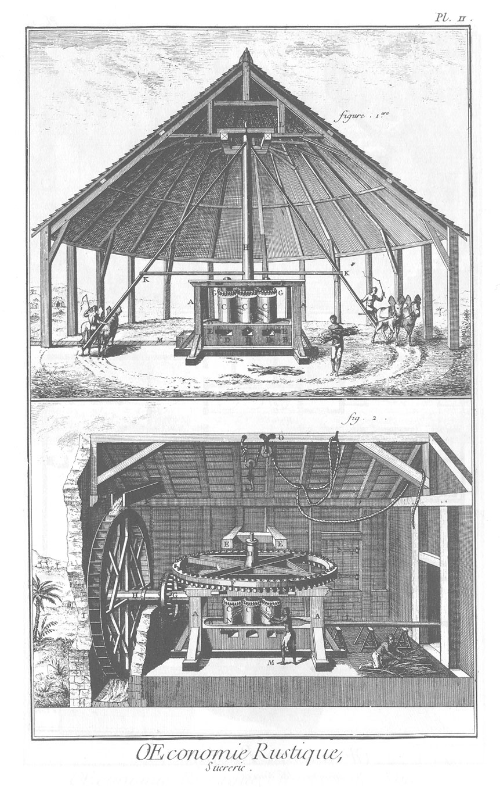
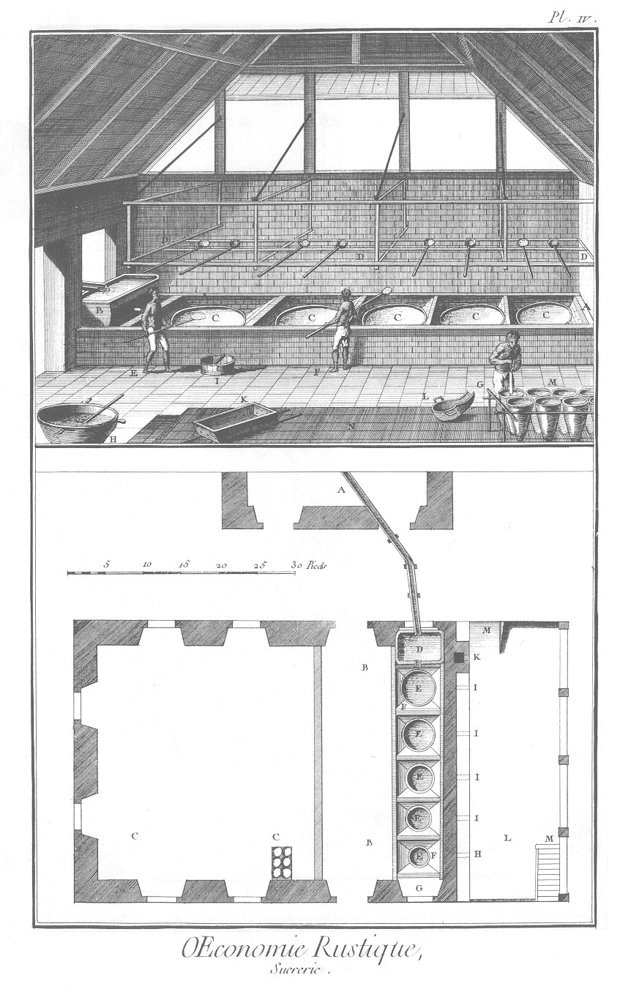
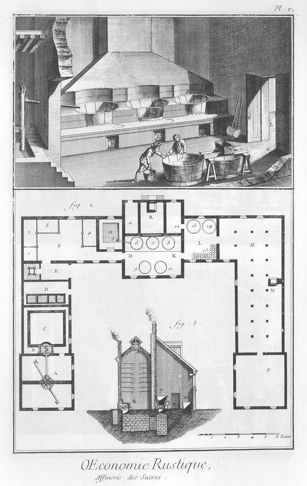
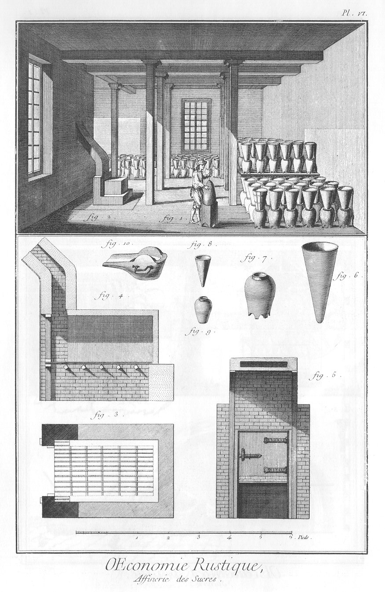
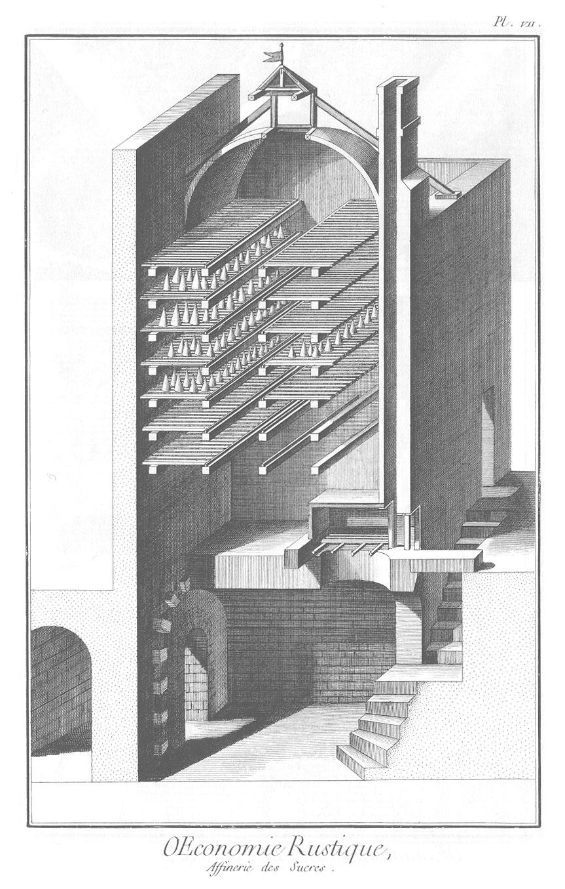

SUCRERIE ET AFFINAGE des Sucres.
================================

PLANCHE Iere.
-------------

La vignette représente la vûe d'une habitation.

- 1, maison du maître & ses dépendances.
- 2, 2, 2, partie des cases à negres formant une ou plusieurs rues, suivant le nombre & l'emplacement.
- 3, 3, 3, partie de savanne ou pâturage.
- 4, 4, lisiere ou forte haie qui sépare la savanne des plantations de cannes.
- 5, 5, 5, partie de pieces plantées en cannes à sucre à mi-côte & en plat-pays.
- 6, moulin à eau.
- 7, sucrerie avec sa cheminée, & son hangard pour les fourneaux.
- 8, gouttiere qui conduit l'eau du canal sur la roue du moulin.
- 9, décharge de l'eau du moulin.
- 10, une des cases à bagasses ou cannes écrasées.
- 11, purgerie ou grand magasin servant à mettre les sucres quand ils sont en forme, pour les purger de leur syrop superflu & les terrer.
- 12, étuve pour faire sécher les pains de sucre.
- 13, hauteurs entre lesquels sont les plantations de manioc, les bananiers & l'habitation à vivre.
- 14, morne : c'est ainsi qu'on nomme aux îles Antilles les montagnes qui paroissent détachées des autres.

1. Coupe verticale d'une étuve à mettre sécher les pains de sucre terrés.
	- A, comble de l'étuve.
	- B, murs de l'étuve.
	- C, porte.
	- D, coffre de fer servant de fourneau.
	- E, bouches du foyer & du cendrier.
	- F, rayons ou tablettes en grillage, sur lesquelles on range les pains de sucre.
	- G, plancher couvert de cinq à six pouces de mâçonnerie.
	- H, trape que l'on ouvre pour laisser aller l'humidité qui s'éleve des pains de sucre, & qui s'échappe au-dehors par les conduits i, i, pratiqués sous le larmier.

2.
	- K, canne à sucre.
	- L, feuille dentelée sur les bords.
	- M, fleche ou fleur de la canne portant la graine.
	- N, partie inférieure de la canne avec sa racine.

3. O, serpe pour sarcler & couper les cannes.

4. P, houe à fouiller la terre.

5. Q, pelle de fer pour le même usage & ramasser le sucre pilé dans le canot.

6. R, pincé de fer servant de levier.

7. S, canot avec ses pilons, pour mêler le sucre en poudre, & le fouler dans les futailles.

PLANCHE II. Deux moulins, dont un à eau.
----------------------------------------

1. Moulin mû par des animaux.
	- A A, chassis de charpente très-solide.
	- B B, table du moulin, communément faite d'un seul bloc creusé & revêtu de plomb.
	- C, C, C, trois roles couverts chacun d'un tambour ou cylindre de métal, & traversés d'un axe de fer coulé, dont l'extrémité inférieure est garnie d'un pivot portant sur une crapaudine.
	- D, D, D, D, ouvertures faites à la table pour pouvoir changer & réparer les pivots & les crapaudines.
	- E, E, entailles aux deux ouvertures des côtés, servant à chasser des coins de bois, pour serrer & rapprocher les tambours.
	- F, F, autres ouvertures sur les moises, avec des coins pour serrer les pivots supérieurs.
	- G G, hérissons dont les roles sont couronnés, & qui engrenant les uns dans les autres, font tourner les tambours en sens contraires.
	- H, axe ou arbre prolongé du principal role.
	- I, demoiselle, piece de bois dans laquelle est un collet au-travers duquel passe le pivot supérieur de l'arbre.
	- K, K, bras du moulin, auxquels la force mouvante est appliquée.
	- L, L, charpente & enrayure du comble.
	- M, rigole couverte qui conduit le suc des cannes écrasées, dans la sucrerie.

2. Moulin mû par une chute d'eau.
	- A, A, chassis de charpente très-solide.
	- B, table un peu creusée en dessus, & revêtue de plomb comme au moulin précédent.
	- C, C, C, les trois roles couverts de leurs tambours de métal, & garnis de leurs hérissons, pivots & crapaudines.
	- D, arbre vertical dont l'extrêmité supérieure passe au-travers d'un collet encastré dans la demoiselle que doivent porter les pieux de bois E E.
	- F, rouet tournant horisontalement.
	- G, rouet, au lieu duquel on peut supposer une lanterne, dont les dents ou les fuseaux s'engrainent dans celles du grand rouet horisontal.
	- H, grand arbre horisontal ou axe de la grande roue.
	- II, la grande roue à pots ou à godets recevant l'eau du canal par la gouttiere K.
	- L, petite rigole de bois, qui conduit le suc des cannes écrasées dans la sucrerie.
	- M, négresse qui passe des cannes au moulin.
	- N, bagasses ou cannes écrasées qu'une autre négresse fait repasser de l'autre côté du moulin.
	- O, palant ou corde pour enlever l'arbre, lorsqu'il y a quelques réparations à faire.

PLANCHE III. Plan des serses ou emplacement des chaudieres. Noms des chaudieres.
--------------------------------------------------------------------------------

- A, la grande.
- B, la propre.
- C, le flambeau.
- D, le syrop.
- E, la batterie. Détail du profil.
- I, I, I, massif de maçonnerie très-solide.
- 2, 2, 2, piés droits qui forment la séparation des fourneaux.
- 3, 3, 3, serses dans lesquelles les chaudieres sont encastrées.
- 4, fourneau principal où on allume le feu.
- 5, 5, 5, canal, le long duquel la flamme passe sous les chaudieres, & s'échappe par le tuyau de la cheminée.
- 6, 7, place du bac ou canot, qui reçoit le résou ou suc de cannes venant du moulin.
- 8, grande écumoire de cuivre.
- 9, grande cuilliere de cuivre.
- 10, truelle à terrer les pains de sucre.
- 11, forme à sucre, débouchée & placée dans un pot, pour que le syrop superflu au pain de sucre, s'écoule.
- 12, autre forme à sucre sur le bloc, pour en tirer le pain.
- 13, grande chaudiere à sucre, faite de cuivre ou de fer fondu.
- 14, vaisseau de cuivre nommé bec de corbin, servant à verser le syrop dans les formes.
- 15, caisse de bois grillée par le fond, & percée de plusieurs trous, servant à soutenir un blanchet ou drap de laine blanche, au travers duquel on passe le résou ou suc des cannes.
- 16, grande chaudiere de cuivre à plusieurs pieces, servant à distiller le tafia ou l'eau-de-vie des cannes.
- 17, chapiteau de cuivre avec son bec.
- 18, couleuvre d'étain soutenue par des barres de fer ; elle se met dans un grand tonneau plein d'eau froide qui rafraîchit la liqueur distillée qui circule dans ses différentes circonvolutions.

PLANCHE IV.
-----------

La vignette représente l'intérieur d'une sucrerie.

- A, glacis en briques & carreaux, plus élevés que les chaudieres.
- B, bac qui reçoit le suc de la canne venant du moulin.
- C, C, C, C, C, cinq chaudieres.
- D, D, D, D, chassis fait de fortes tringles de bois, sur lesquelles on pose les écumoires & les cuillieres à la portée des ouvriers.
- E, negre qui écume la grande chaudiere.
- F, autre negre qui observe le bouillon des chaudieres.
- G, autre negre qui, après avoir brisé la croûte qui s'est formée à la surface du syrop contenu dans les formes, remue la matiere, afin que les grumeaux ne s'attachent pas aux côtês du vase, & qu'ils se puissent disperser également.
- H, vieille chaudiere dans laquelle est une lessive dont on se sert pour épurer le résou.
- I, baille aux écumes, ou baquet où on les jette.
- K, caisse à passer le résou.
- L, bec de corbin.
- M, formes à sucre bouchées par la pointe & pleines du syrop de la batterie, après qu'il a été refroidi dans le vaisseau appellé le rafraîchissoir.
- N, plancher sur lequel est un citerneau où l'on jette les écumes & ce qui se répand du syrop, afin d'en faire le tafia.

Bas de la Planche.

- A, partie du moulin ou gouttiere qui conduit le suc de canne dans la sucrerie.
- B, B, passage & place des ouvriers.
- C, C, emplacement pour ranger les formes, avant de les porter dans la purgerie.
- D, le bac qui reçoit le résou ou le suc des cannes.
- E, E, E, E, E, les cinq chaudieres.
- F F, glacis.
- G, fenetre qui éclaire principalement la batterie.
- H, bouche du foyer sous la batterie.
- I, I, I, I, évents des autres fourneaux qu'on a soin de boucher exactement, lorsque le feu est au foyer.
- K, tuyau de la cheminée.
- L, appentis, espece de grand auvent, soutenu par des piliers pour couvrir les fourneaux & le negre qui entretient le feu sous la batterie.
- M, rampe & escalier pour descendre sous l'appentis.

PLANCHE V.
----------

La vignette represente le principal attelier d'une affinerie.
	- 6, 7, chaudieres à clarifier.
	- 8, chaudiere à cuivre, toutes trois montées sur leurs fourneaux.
	- 9, 10, chaudieres à clair.
	- 5, pompe qui fournit l'eau du bac à chaux dans les chaudieres à clarifier.

2.
	- A, manége placé au rez-de-chaussée d'un des pavillons, pour tirer de l'eau du puits B.
	- C, le réservoir général qui distribue par des tuyaux soûterreins l'eau dans tous les endroits où elle est nécessaire.
	- D, salles où sont les bacs à terre.
	- E, passage pour aller dans le magasin F; il y a aussi un escalier pour monter aux étages supérieurs qu'on appelle greniers.
	- F, magasin où on défonce les bariques de sucre brut que l'on distribue par sortes dans les bacs ou bails 1, 2, 3, 4.
	- G, bac à chaux construit en ciment ou avec un corroi de terre glaise.
	- H K, l'attelier que la vignette représente.
	- L, attelier appellé l'empli.
	- 13 & 14, chaudieres de l'empli, où on porte les syrops après leur cuisson.
	- 15, formes rangées sur trois rangs près les murs de cette salle, & la pointe en bas. Le trou qui est à cette pointe, est bouché par un petit tampon de linge.
	- M, chambre à vergeoise, au dessus de laquelle, aussi-bien qu'au-dessus des autres bâtimens, sont les greniers disposés de la même maniere que cette chambre.
	- N, son poële ou étuve.
	- P, pavillon dans lequel sont les magasins des sucs affinés.
	- R, grande étuve pour les sucs affinés, où on les fait sécher après qu'ils sont sortis des formes.
	- 11, réduit pour placer le charbon de terre dont on se sert pour chauffer le poële de cette étuve.
	- 12, autre réduit où on dépose dans des tonneaux à gueule bée les écumes que l'on enleve de la chaudiere à cuire.

3. Coupe du bâtiment par le milieu du pavillon qui contient l'attelier à clarifier & à cuire, & aussi la grande étuve.
	- K, porte de communication de l'attelier des chaudieres à la salle de l'empli.
	- 7, une des chaudieres à clarifier montée sur son fourneau. On voit au-dessous de la grille un soûterrein qui communique à la cave qui est au-dessous de l'étuve R; il sert de cendrier & d'évent.
	- 10, une des chaudieres à clair.

PLANCHE VI.
-----------

Vûe perspective de l'intérieur de la chambre à vergeoise ou d'un des greniers qui sont au-dessus.

1. Ouvrier qui, après avoir débouché le trou d'une forme bâtarde qui est posée sens-dessus-dessous sur une sellette appellée canaple, enfonce dans le syrop figé une broche de fer qu'on appelle prime, pour faciliter l'écoulement de la partie du syrop qui ne crystallise pas dans les pots sur lesquels il redresse ces formes devant lui, comme on voit.

2. Poîle ou étuve pour entretenir dans cette chambre ou grenier un certain degré de chaleur. Il est composé d'une maçonnerie de brique, & d'une caisse de fer fondu formant trois côtés & le dessus d'un parallelipipede rectangle.

3. Plan du poîle.

4. Coupe du poîle.

5. Elévation du poîle du côté de la porte & du cendrier ; on y brûle du charbon de terre.

6. Forme bâtarde, dont la pointe va en arrondissant.

7. Pot de forme bâtarde, ayant cinq pieds pour être posé à terre.

8. Forme pour mouler les pains de sucre pesant deux livres.

9. Pot pour laisser égouter cette forme.

10. Bassin à cuitte, dont on se sert pour remplir les formes dans la salle de l'empli, & autres transports des syrops d'une chaudiere dans une autre, &c.

PLANCHE VII.
------------

Cette Planche représente la grande étuve où l'on met sécher les pains de sucre, après qu'ils sont sortis des formes. On y voit la coupe du poîle de cette étuve où l'on met le feu par le dehors du bâtiment ; & celle des soûterreins qui servent de cendriers & d'évents pour le poîle & les fourneaux des chaudieres. Cette figure est relative à la figure 3. de la Planche V.

[->](../18-Travail_des_sabots,_échalats,_&c/Légende.md)
