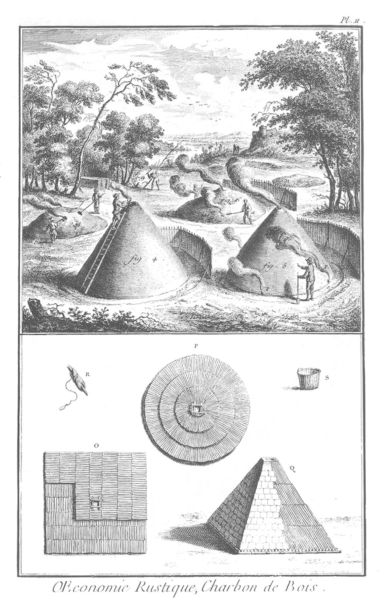
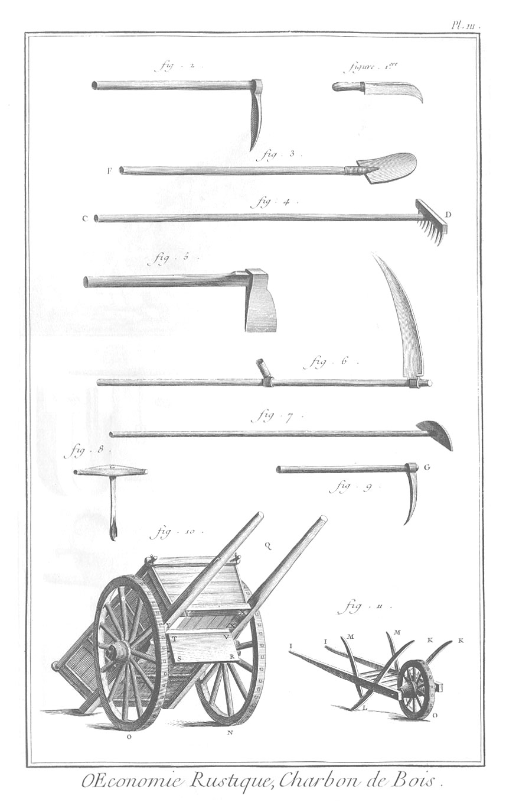

CHARBON DE BOIS.
================

PLANCHE Iere.
-------------

Le haut de la Planche, constructions différentes de fourneaux à charbon.

Premiere construction.

- A. Charbonnier qui trace au cordeau l'aire de la charbonniere.
- B. Ouvrier qui applanit l'aire de la charbonniere avec la pelle, après avoir planté au centre une buche fendue en quatre par sa partie supérieure, & aiguisée par l'autre bout, pour commencer la cheminée.
- C. Charbonnier qui applanit l'aire au rateau.
- D. Aire applanie, où l'on voit au centre la buche fendue avec les bâtons qui se croisent dans les fentes, ce en quoi consiste la premiere façon de l'arrangement du bois, & de la formation de la cheminee.
- E. Charbonnier qui a formé son premier plancher, & qui en arrête les buches par des chevilles.
- F. Charbonnier qui répand sur ce plancher du menu bois appellé bois de chemise. On voit, même figure, la formation du premier étage du fourneau.
- G. Le premier étage plus avancé, avec le commencement du second.
- H. Charbonnier qui apporte le bois à la brouette. Tous les autres étages qui vont en diminuant, à mesure qu'ils s'élevent, & qui forment une espece de cône, se construisent de la même maniere.

Deuxieme construction d'un fourneau.

1. Après avoir tracé & applani l'aire, comme il a été dit à la premiere construction, au lieu de la buche fendue en quatre, on plante au centre une longue perche ce, contre laquelle on dresse les buches dont le premier étage sera construit. Cette perche formera la cheminée.

2. Fourneau de cette construction, dont tous les étages f, g, h, i, sont formés. L'ouvrier qu'on voit au pié de ce fourneau, bêche la terre, fait un chemin, & prépare de quoi le couvrir, soit avec de la terre, soit avec du frasin, s'il en a déjà. k, extrémité d'une autre perche qui va de la circonférence du fourneau jusqu'au centre, & qui ménage le passage qui servira à allumer le fourneau.

3. Fig. qui peut également appartenir aux deux constructions, & qui en montre la derniere façon, qui consiste à former la chemise du fourneau. Le fourneau est tout couvert de sa chemise, excepté à sa partie inférieure, où on laisse une bande ou lisiere sans chemise, pour donner lieu à l'action de l'air.

Troisieme construction.

Fourneau pyramidal & recouvert de gazon, dont on voit la coupe verticale au bas de la Planche Iere. fig. N, & le plan, Pl. II. fig. O.

Le bas de la Planche.

- L. Coupe verticale par le centre d'un fourneau de la premiere construction.
- M. Coupe verticale par le centre d'un fourneau de la seconde construction.
- N. Coupe verticale par le centre d'un fourneau de la troisieme construction.

PLANCHE II.
-----------

Le haut de la Planche représente les fourneaux en feu, ou la cuisson du charbon.

4. Ouvrier qui met le feu à un fourneau de la premiere construction par le haut ; car au fourneau de la seconde construction, le feu se met par le bas où l'on a pratiqué un passage, comme on voit en k, Pl. 1. fig. 2.

5. Fourneau en feu:

6. Fourneau percé de vents. On voit un ouvrier qui lui donne de l'air.

7. &
8. Ouvriers qui polissent & rafraîchissent un fourneau plus avancé.

9. Ouvrier qui prépare du bois.

10. Bois coupé en tas.

11. Fourneau éteint. On appelle tue-vents ou brise-vents, les claies qu'on voit autour des fourneaux en feu, fig. 4, 5, 6.

Le bas de la Planche.

- O. Plan d'un fourneau de la troisieme construction.
- P. Plan d'un fourneau de la même construction, mais de forme ronde.
- Q. Elévation perspective d'un fourneau de la troisieme construction.
- R. Le traçoir.
- S. Panier à charbon.

PLANCHE III. Outils.
--------------------

1. Serpe.
2. Hoyau ou pioche.
3. Pelle. F, le manche.
4. Herque ou rateau de fer C D. 
5. Coignée. 
6. Faulx.
7. Rabot.
8. Tariere.
9. Crochet G.
10. La voiture à charbon.
11. La brouette.

Nota. On a rapporté dans le discours ces figures aux Planches des grosses forges.

[->](../20-Four_à_chaux/Légende.md)
