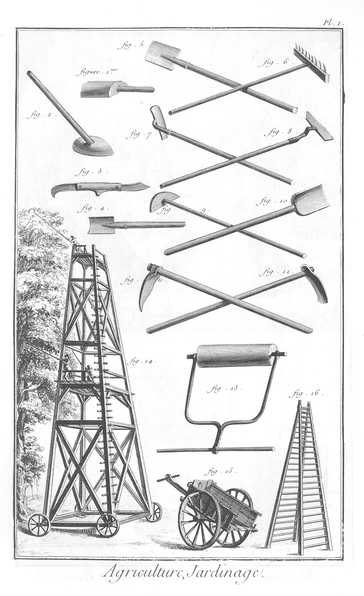
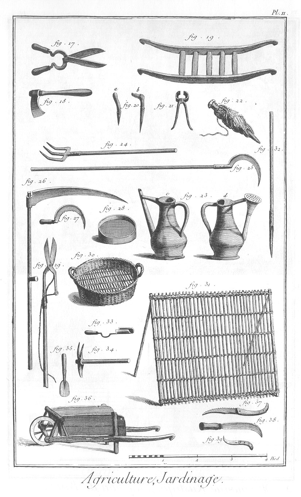
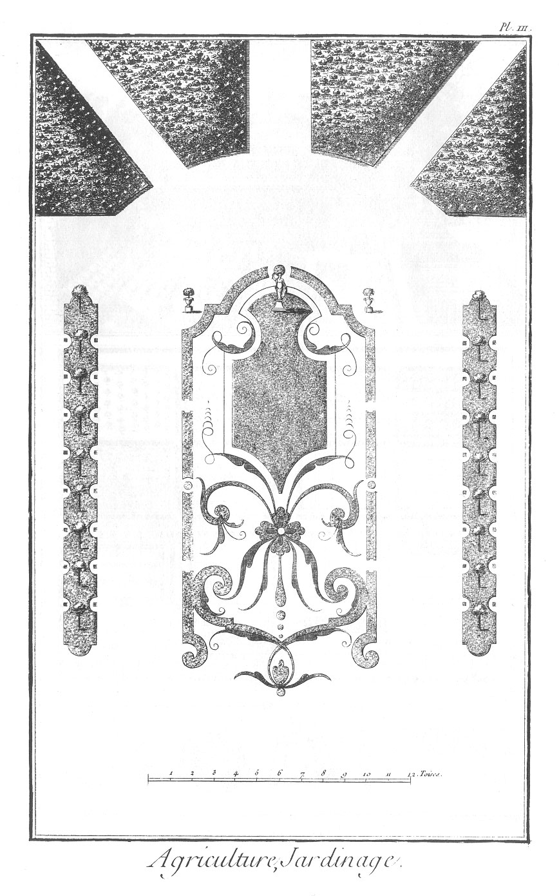
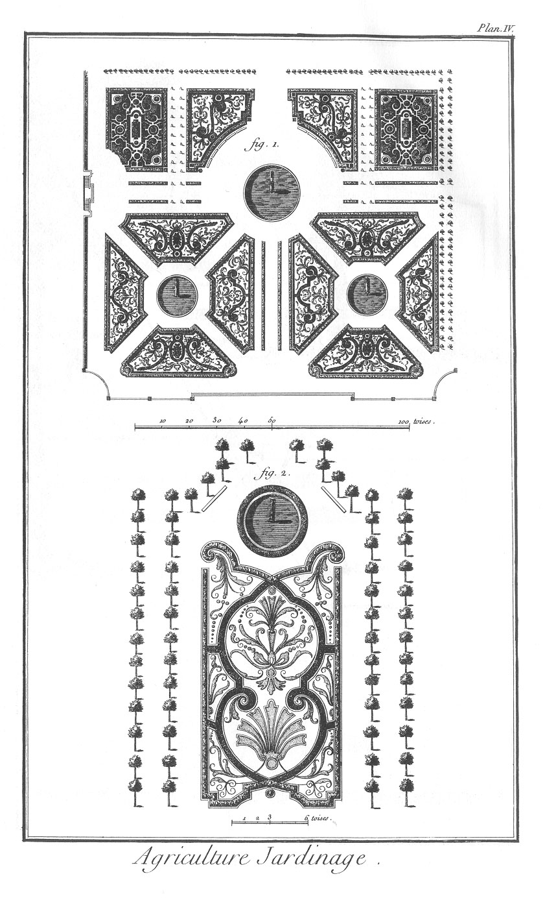
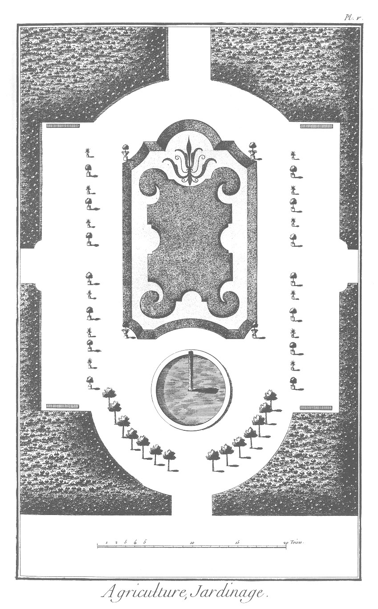
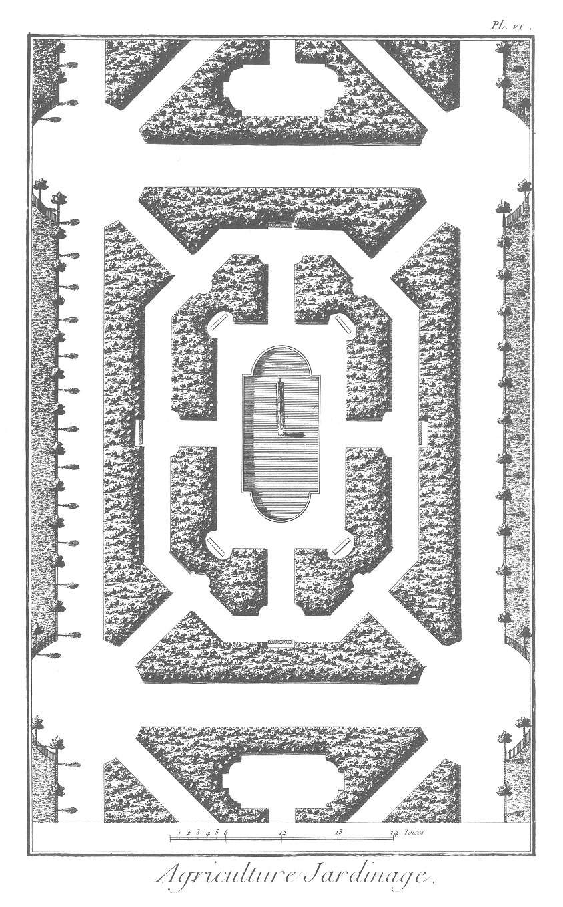
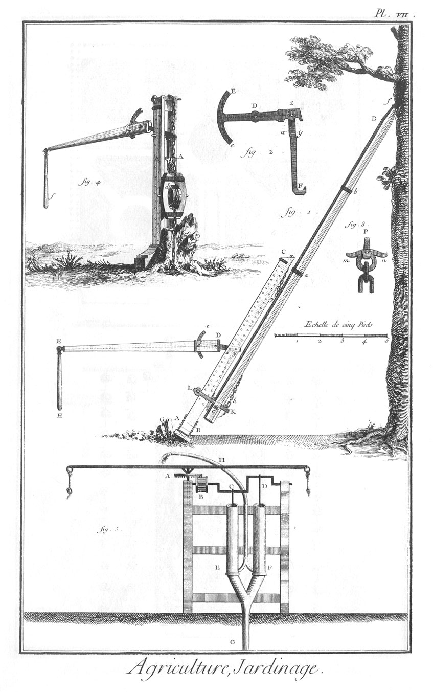

JARDINAGE.
==========

PLANCHE Iere. Outils de jardinage.
----------------------------------

1. Batte à main. 
2. Batte à bras.
3. Greffoir.
4. Houlette.
5. Bêche.
6. Rateau.
7. Ratissoir à tirer.
8. Ratissoir à pousser.
9. Rabot.
10. Pelle.
11. Pioche à pré.
12. Pioche plate.
13. Cylindre ou rouleau.
14. Chariot.
15. Tombereau.
16. Echelle double.

PLANCHE II.
-----------

17. Ciseaux.
18. Coignée à main.
19. Civiere.
20.
	- a, b, Plantoir.
	- c, arrosoir à goulot.
	- d, arrosoir à tête.
21. Tenaille. 
22. Cordeau. 
23. Arrosoirs. 
24. Fourche.
25. Croissant.
26. Faulx.
27. Faucille.
28. Crible.
29. Echenilloir.
30. Crible d'osier.
31. Claie.
32. Traçoir.
33. Déplantoir.
34. Serfouette ou binette.
35. Autre déplantoir.
36. Brouette.
37. Scie à main.
38. Serpe.
39. Serpette.

PLANCHE III Parterre mêlé de broderie & de gazon.
-------------------------------------------------

PLANCHE IV. Autres parterres mêlés de broderie & gazon.
-------------------------------------------------------

1. Celui des Tuileries.
2. Celui du jardin de l'Infante.

PLANCHE V. Boulingrin pratiqué au milieu d'un bosquet.
------------------------------------------------------

PLANCHE VI. Bosquet avec une piece d'eau.
-----------------------------------------

PLANCHE VII.
------------

Machine pour arracher de gros arbres & les souches avec leurs racines, inventée par Pierre Sommer du canton de Berne.

1. Profil de cette machine.
	- A C, deux montans de bois de chêne dont on ne voit qu'un seul dans la figure. Ils ont trois à quatre pouces d'épaisseur, & sont assemblés en A & en C par deux entretoises, & fortifiés par des frettes de fer. L'intervalle d'un montant à l'autre est de trois pouces ; ils sont chacun percés de deux rangées de trous d'un pouce & demi de diametre, qui se répondent les uns aux autres, pour recevoir des chevilles ou boulons de fer d'un pouce & un quart de diametre qui servent alternativement de point d'appui ou de centre de mouvement au levier de cette machine.
	- B D, piece de bois d'orme ou de frêne à laquelle on a donné le nom de bélier. Son extrémité supérieure est armée d'une forte piece de fer f, partagée en trois dents pour avoir prise sur l'arbre. Le bélier qui, à sa partie supérieure, a environ six pouces d'équarrissage, & à sa partie inférieure huit, est fendu obliquement en cette partie, pour laisser passer la chaîne C g h, & recevoir la poulie c, qui a quatre pouces d'épaisseur & neuf pouces de diametre. L'extrémité inférieure B est garnie d'une frette, ainsi que le corps du bélier, en a, b, f: à l'extrémité inférieure sont deux pieces de fer K L, fixées sur le bélier, & dont les deux parties L traversées par un boulon, embrassent les deux montans le long desquels ces pieces de fer peuvent glisser lorsqu'on éleve le bélier par le moyen du levier & de la chaîne. La chaîne est d'environ dix piés de longueur, & les chaînons de quatre pouces dix lignes. Elle est attachée fixement à la partie supérieure C, des montans entre lesquels est placée sa partie inférieure h, terminée, après avoir embrassé la poulie, par un anneau à oreille m n (fig. 3.) Cet anneau est saisi par le crochet P représenté en profil, fig. 2. où F est la partie inférieure du crochet.
	- z D E e, un levier & un arc de fer ; ce levier a en z environ deux pouces d'épaisseur ; il est formé en moufle pour recevoir l'extrémité supérieure du crochet z F, qui est mobile sur un boulon dans cette moufle. Il diminue d'épaisseur & de largeur à mesure qu'il approche de l'arc E e, qui n'a que six lignes d'épaisseur, & qui est percé de plusieurs trous. Auprès du boulon z sont deux entailles semi-circulaires x, y, dont les centres indiqués par des lignes ponctuées sont autant éloignés l'un de l'autre, que les centres des trous pratiqués dans les montans A C de la fig. 1. ce sont ces entailles x y, qui reposent alternativement sur les chevilles que l'on place dans les trous montans, lorsqu'on fait usage de cette machine.

2. L'arc E e & le trou D servent à fixer le long levier de bois D E, fig. 1. par deux chevilles ou boulons de fer. Celui marqué D sert de centre de mouvement. L'arc e lui est concentrique ; & au moyen d'une autre cheville d qui traverse le levier & passe dans un des trous de l'arc, on parvient à fixer ces deux pieces l'une sur l'autre, & de maniere que l'autre extrémité E du levier D E soit à portée des ouvriers qui doivent manoeuvrer. A l'extrémité E on adapte aussi un manche E H, par le moyen duquel on éleve ou on abaisse l'extrémité E du levier Jeu de cette machine. On la suppose toute montée & mise en place, le trident f piqué sous une des branches de l'arbre que l'on veut renverser, & l'extrémité inférieure A des montans bien calée & affermie par des tasseaux ou piquets G. En cet état, & supposant encore que les entailles x y (fig. 2.) reposent sur les deux chevilles de fer qui sont passées dans les trous des montans, si on abaisse l'extrémité E du levier, la cheville de la rangée extérieure sur laquelle repose l'entaille x deviendra le centre de mouvement, & le point z en s'élevant tirera le crochet F, & par conséquent la chaîne qu'il retient ; ce qui élevera le bélier d'une quantité égale à la moitié de l'espace que le point z aura parcouru. L'entaille y ne reposant plus sur la cheville de la rangée intérieure, un ouvrier tirera cette cheville & la replacera dans le trou de la même rangée immédiatement au-dessus de celui d'où elle est sortie. On laissera alors reposer le levier sur les deux chevilles, ensuite on élevera l'extrémité E du levier par le moyen du manche E H ; & ce sera alors la cheville y de la rangée intérieure qui deviendra le centre de mouvement. L'entaille x s'éloignant de la cheville de même nom, on retirera cette cheville pour la placer dans le trou qui est immédiatement au-dessus. Ainsi les deux chevilles deviennent alternativement le point d'appui du levier qui est du premier genre, lorsqu'on abaisse le point E, & du second lorsqu'on l'éleve. Ce le vier a beaucoup d'affinité avec celui connu sous le nom de la guarouste.

3. m n, anneau à oreilles cité fig. 2. qui sert à prendre le crochet P.

4. Autre application de la même machine. Pour arracher, par exemple, des souches, on ne se sert pas du bélier ; on place les montans A A perpendiculairement & le plus près de la souche que l'on peut. On passe la chaîne autour de la poulie c qui est enclavée dans une moufle d. On attache à cette moufle une autre chaîne b que l'on fait passer sous une des maîtresses racines e de la souche, & opérant comme il a été dit ci-dessus, on parvient à l'enlever & à vaincre la résistance des racines.

5. Elévation d'une pompe proposée pour arroser les plantations dans l'île de Saint-Domingue, par M. Puisieux, architecte.
	- A, rouet horisontal qui engraine dans la lanterne B.
	- C D, manivelle à deux coudes qui fait agir alternativement les pistons dans les corps de pompes.
	- E, F, corps de pompes.
	- G, tuyau d'aspiration qui est de cuir bouilli, à l'extrémité duquel on attache un morceau de liége. Par ce moyen la pompe n'aspire que l'eau la plus claire & à telle distance que l'on juge à propos.
	- H, tuyau de sortie.

[->](../22-Jardinage_potager/Légende.md)
