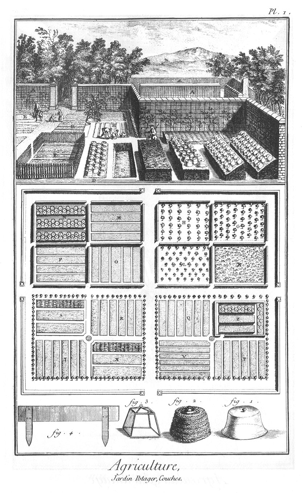
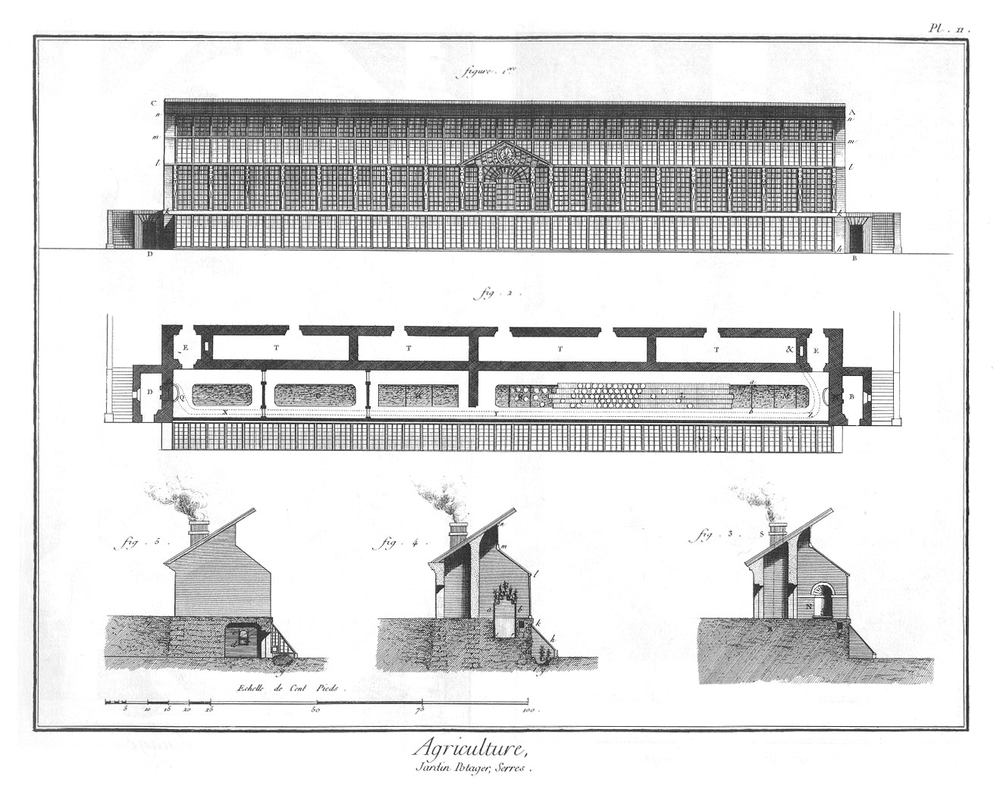
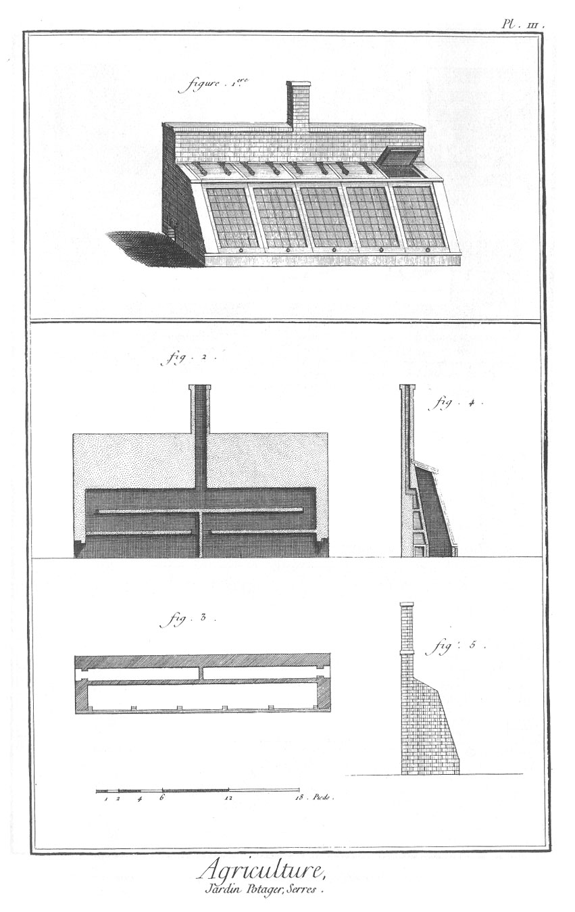
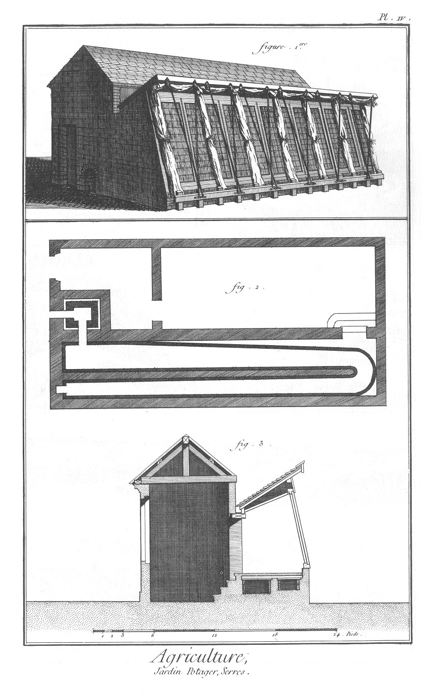
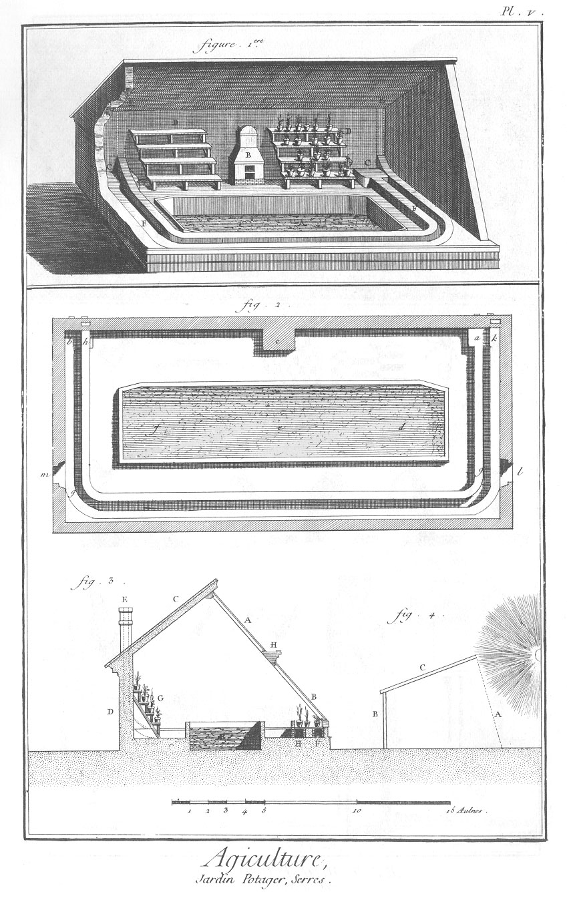

JARDIN POTAGER.
===============

PLANCHE Iere.
-------------

La vignette représente un jardin.

- A, a, partie de jardin coupé de murs servans à soûtenir des espaliers.
- B B, ados, ou couches inclinées couvertes de cloches.
- C C, couches.
- D D, couches sourdes.
- E, planches.
- F, palis ou perchis.
- G, plant d'arbres fruitiers en quinconce.
- H, plants d'arbres fruitiers en échiquier.
- K, pepiniere d'arbres.
- L, bâtardieres.
- M, planches abritées par des brise-vents.
- N, ados entouré de murs.
- O, P, Q, R, S, T, V, X, Y, planches pour différens légumes.
- Z, meloniere.

1. Cloche de verre.

2. Cloche de paille.

3. Cloche de verre à panneaux.

4. Planche à dresser le terreau sur le fumier, aux ados & aux couches.

PLANCHE II. double. Serres chaudes.
-----------------------------------

1. Elévation géométrale de la serre chaude de Trianon.

2. Plan de cette serre.

3. Coupe par une des antichambres E, où l'on voit la fontaine N dans sa niche.

4. Coupe en travers de la serre.

5. Coupe en travers de la chambre D du fourneau. Explication du plan.
	- B D, la serre.
	- N Q, les fontaines posées au-dessus des fourneaux.
	- Q, X, Y, Z, &, la cheminée qui regne sous le rez-de-chaussée le long de la ligne k k de l'élévation, & comme on voit dans le profil en P (fig. 3.).
	- F, G, H, K, M, les fosses que l'on remplit de fumier & de terre.
	- L, les planches disposées en théatre sur les barres de fer a b, sur lesquelles on arrange les pots qui contiennent les plantes, comme on voit fig. 4.
	- T T, serres où l'on place les outils, &c. 3.
	- P R S, suite de la cheminée.
	- P R est la même partie que Z & dans la fig. 2. 4.
	- h k, chassis de verre adossé contre le mur qui soûtient la serre & forme avec ce mur & le terrein une serre triangulaire dont l'élévation se voit en h k k h fig. 1.
	- g, fosse remplie de fumier où l'on place les pots.
	- k l m n, profil des vitraux qui servent de clôture à la serre.
	- r b a s, élévation d'une des barres de fer coudées qui soûtiennent les planches en théatre sur lesquelles on arrange les pots.
	- r s, fond de la fosse que l'on remplit de fumier, & dans lequel on place aussi des pots. 5.
	- e, foyer.
	- d, cendrier.

PLANCHE III.
-------------

1. Vûe perspective de la serre hollandoise pour la vigne.

2. Coupe du mur postérieur de la serre, où l'on voit les deux fourneaux & les détours des deux cheminées qui se réunissent à une seule.

3. Plan de la serre.

4. Coupe transversale par la cheminée.

5. Elévation latérale d'un des côtés de la serre. Tout ce bâtiment est construit en brique. Les vitraux doivent être exposés au midi.

PLANCHE IV.
-----------

Serre hollandoise pour élever différentes sortes de plantes. Cette serre differe de la précédente, en ce que les cheminées sont horisontales & pratiquées sous le sol de la serre.

1. Représentation perspective de cette serre & de la serre tempérée qui lui est jointe du côté du nord. On voit par cette figure, que l'on recouvre extérieurement les chassis avec des rideaux & des couvertures qui sont roulées vers le haut de chaque fenêtre, & que l'on fait descendre sur les rideaux en relâchant les cordes qui les retiennent.

2. Plan des deux serres où l'on voit le plan du fourneau & des cheminées qui regnent sous la serre. Le fourneau placé dans une petite piece séparée, est construit en brique & est entouré d'un contre-mur de mâçonnerie qui laisse un pouce d'intervalle de tous côtés, que l'on remplit ensuite de sable. Les cheminées sont construites de même ; leur partie supérieure est formée avec de grandes plaques de fer sur lesquelles on forme une aire qui est carrelée. Sur le carreau on répand environ deux pouces d'épaisseur de sable.

3. Est la coupe transversale de la serre dans laquelle on voit qu'il y a un vuide entre le plafond & la couverture. On remplit ce vuide avec du foin pour mieux défendre l'air intérieur du froid externe. On renouvelle l'air de la serre chaude avec celui de la serre tempérée qui lui est adossée.

PLANCHE V. Serre chaude d'Upsal.
--------------------------------

Elle est exposée directement au midi, & placée entre l'orangerie & la serre tempérée où on conserve les fleurs. Les pots qui les contiennent sont rangés sur des gradins disposés en amphithéatre. Sa longueur est d'environ quarante piés, sa largeur d'environ vingt, & sa hauteur de quatorze ou environ. L'aune de Suede qui est citée à notre échelle sur la Planche, est environ deux piés de France.

1.
	- A, la fosse que l'on remplit de terreau & de fumier, &c.
	- C C, deux fourneaux dont les ouvertures regardent le septentrion, & dans lesquels on brûle du bois.
	- F F, les tuyaux ou cheminées de ces fourneaux qui aprés avoir fait le tour de la serre horisontalement, remontent en E E dans l'épaisseur du mur septentrional jusqu'au-dessus du toît.
	- B, cheminée double que l'on allume ou par-dehors ou par-dedans la serre, par dehors pour échauffer ce lieu, & par-dedans pour en chasser les vapeurs humides.
	- D D, théatres sur lesquels on range les pots.
	
2. Est le plan de la serre.
	- a g h, b g k, les deux cheminées horisontales qui entourent la serre.
	- a b, les fourneaux.
	- d e f, la fosse.
	- c, la cheminée double.
	- m, porte de communication avec l'orangerie.
	- l, porte de communication avec la serre tempérée. Ces deux pieces ont leur rez-de-chaussée environ un pié plus bas que la serre chaude.

3. Représente le profil de la serre & l'élévation du fond intérieur.
	- A, fenêtres supérieures.
	- B, fenêtres inférieures.
	- C, toît de la serre.
	- D, mur septentrional.
	- AE, place occupée par les plantes rares & étrangeres.
	- F D E, H D E, cheminées horisontales sur lesquelles on place les pots remplis de fleurs.
	- G, théatre disposé en gradins, sur lequel on arrange les différentes sortes de plantes contenues dans des pots.
	- H, chemin pour aller ouvrir ou fermer les hautes fenêtres.

4. Représente quelle doit être l'inclinaison des fenêtres d'une orangerie.
	- A, fenêtre.
	- B, la muraille.
	- C, le toît.

Le tout selon les regles que Boerhaave a prescrites.

[->](../23-Fontainier/Légende.md)
