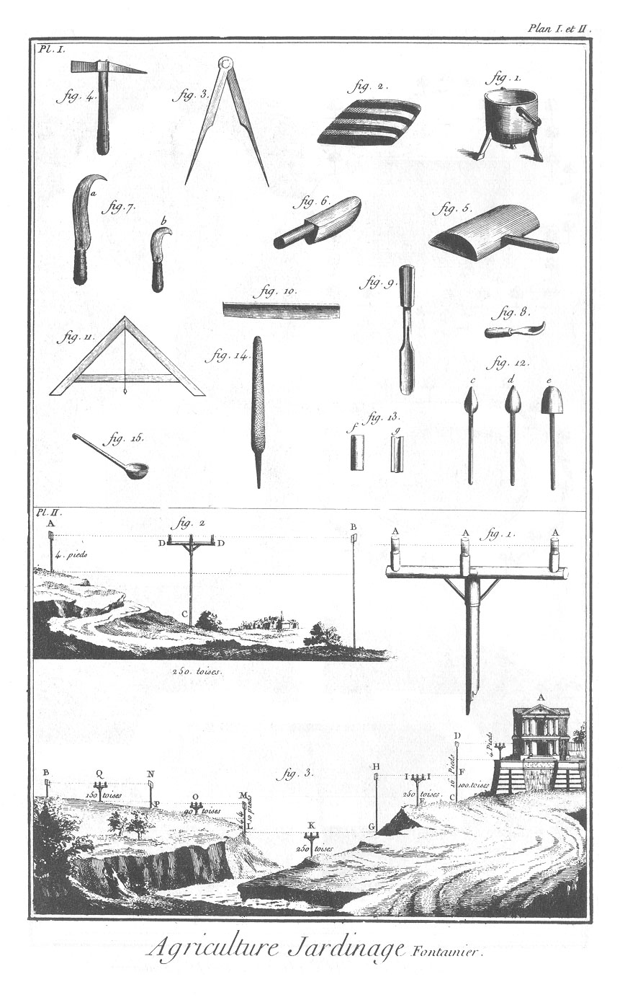
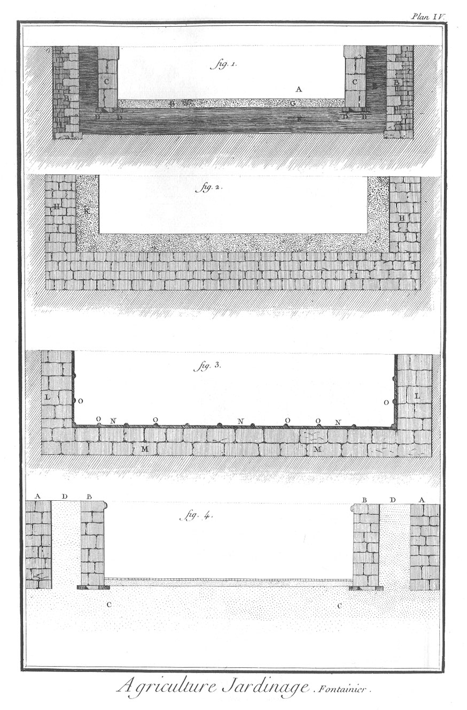
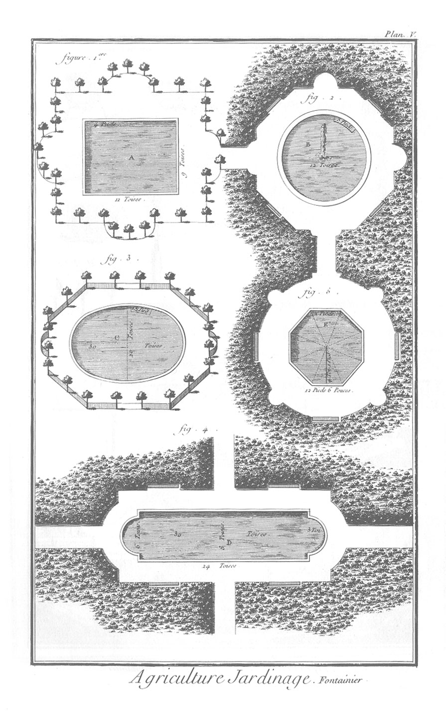

FONTAINIER
==========

PLANCHES I. & II. réunies.
--------------------------

1. Poîle à tenir la soudure fondue.
2. Porte-soudure, ou coussin de coutil.
3. Compas. 
4. Marteau. 
5. Maillet plat.
6. Boursaut.
7. Deux serpettes ; a, une grande ; b, une petite.
8. Grattoir.
9. Gouge.
10. Couteau.
11. Niveau.
12. c, d, e, différens fers à souder.
13. f, g, attelles ou poignées.
14. Rape.
15. Cuilliere.

1. de la Planc. II. Niveau.
2. Nivellement en descendant par un seul coup de niveau.
3. Nivellement en descendant & remontant des deux côtés d'une vallée par plusieurs coups de niveau.

Suite de la PLANCHE II. & PLANCHE III. réunies.
-----------------------------------------------

4. Maniere de tenir registre des différens coups de niveau en descendant & en montant, & d'en trouver la différence. Cette figure est relative à la précédente.
5. Nivellemens en descendant pour trouver la hauteur d'une eau jaillissante.

1. de la Planc. III.
	- A B, conduite d'eau par des tuyaux de grès.
	- C, reservoir.
	- E E, ligne de niveau.
	- D D, ventre en gorge, & contre-refoulement.
2. Autre conduite d'eau.
3. Jauge d'eau.
4. Quille.

PLANCHE IV. Construction d'un bassin de glaise sablé & pavé.
------------------------------------------------------------

1.
	- B B, contre-mur pour soûtenir les terres du côté du bassin.
	- E E, corroi de glaise.
	- C C, mur de douve.
	- D D, rouet de charpente sur lequel repose le mur de douve.
	- F, corroi de glaise qui forme le fond du bassin.
	- G G, fond du bassin sablé, pavé.
	- A, intérieur du bassin.
	
2. Construction d'un bassin de ciment.
	- H H, massif de pierre servant en-dehors de contre-mur.
	- K, massif de ciment.
	
3. Construction d'un bassin de plomb.
	- L L, M M, massif de pierre servant en dehors de contre-mur.
	- O, O, N, O, N, O, O, N, O, tables de plomb soudées.

Construction d'un bassin de terre franche.

4.
	- A A, contre-mur.
	- B B, mur de douve.
	- C C, rouet de charpente posé sur la masse naturelle de terre franche.
	- D D, corroi de terre franche.

Le fond de ce bassin est aussi sablé & pavé.

PLANCHE V.
----------

1. &
2. &
3. &
4. &
5. cinq différentes pieces d'eau.

[->](../24-Mouches_à_miel,_ruches/Légende.md)
