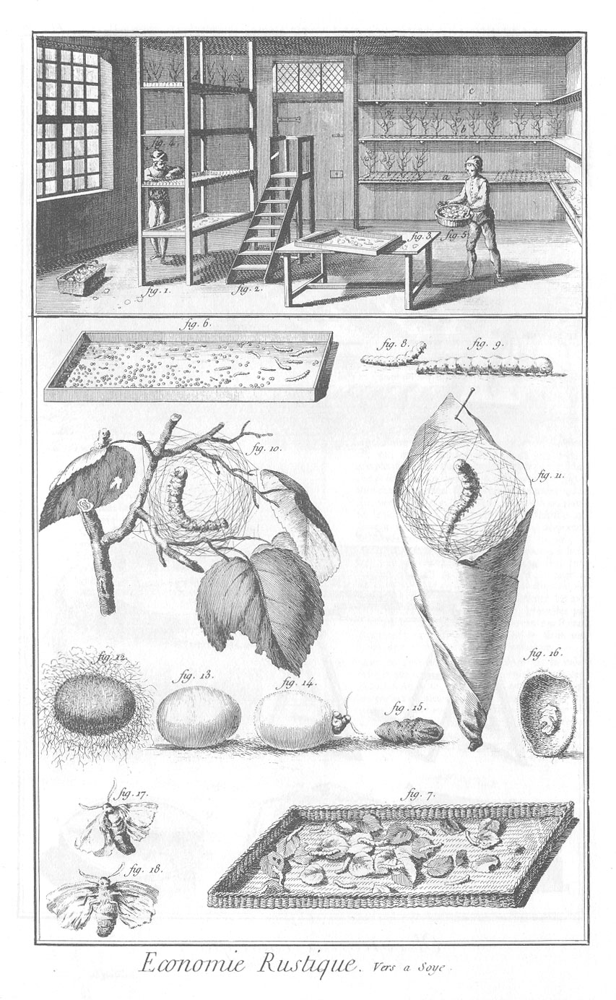

EDUCATION DES VERS A SOIE.
==========================

La vignette représente l'intérieur d'une chambre où l'on éleve des vers à soie.

1. Espece de corps de tablettes à quatre rangs : il peut y en avoir davantage. On y voit à des distances égales les boîtes sans couvercle & à bords très-bas où sont les vers nouvellement éclos, & où on les nourrit.

2. Echelle ou marchepié pour monter à la hauteur des tablettes.

3. Table avec une boîte placée dessus pour être nettoyée.

4. &
5. Deux hommes occupés aux soins que demandent les vers à soie. 

	- 4, l'un des deux hommes sépare les vers malades de ceux qui se disposent à faire leur soie.

	- 5, l'autre homme leur porte des feuilles fraîches.
		- a, b, c, tablettes ou rayons sur lesquelles on pose aussi des boîtes pleines de vers. On y voit la bruyere ou les branchages auxquels les vers à soie vont s'attacher quand ils forment leurs cocons. On met de pareils branchages aux boîtes placées sur le corps des tablettes de la fig. 1. comme on les voit en d.

6. Boîte où l'on voit des oeufs à faire éclore.

7. Manne où l'on voit les vers plus grands.

8. &

9. Vers de différens âges.

10. Ver attaché à un branchage de tablettes ou une branche de mûrier, & qui commence à tendre ses fils.

11. Ver transporté d'une boîte dans un cornet de papier.

12. Cocon avec sa bourre, séparé du branchage.

13. Cocon dont on a séparé le fleuret ou la bourre.

14. Papillon qui perce son cocon pour en sortir.

15. Lever devenu féve ou chrysalide dans le cocon. Il perce son enveloppe & s'en dépouille avant que de percer le cocon.

16. Cocon coupé en deux, au-dedans duquel on voit la dépouille du ver au sortir de la féve, & lorsqu'il est sur le point de s'échapper du cocon en papillon.

17. &

18. Papillons vûs l'un en-dessus, l'autre en-dessous.

[->](../26-Bassecour/Légende.md)
