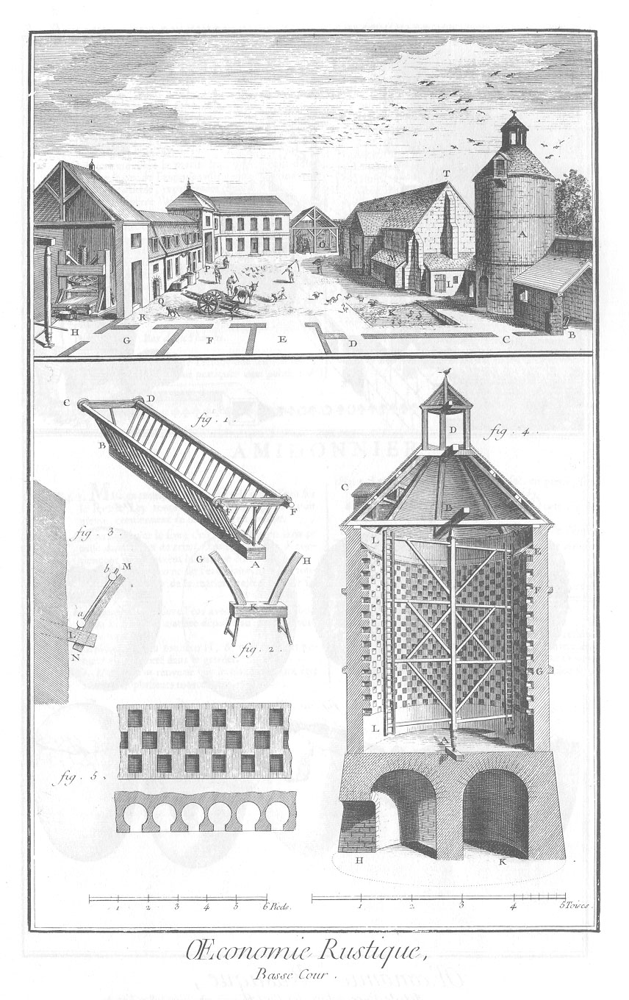

BASSE-COUR.
===========

La basse-cour est composée de différens bâtimens dont la distribution est assez arbitraire, & dépend du terrein qu'on a.

Les principaux représentés dans la vignette sont en I le logement du fermier.

- P, passage pour entrer & sortir de la ferme du côté de la cour du maître.
- Q, cellier. Entre la porte du cellier & celle de sortie P, sont les écuries pour les chevaux de labour & de trait, le puits & les auges de pierre nécessaires.
- R, entrée du pressoir.
- H, le pressoir.
- G, vinée dont les murs sont supposés abbatus pour laisser voir l'intérieur.
- F, laiterie.
- E, passage pour sortir sans entrer dans la cour du maître.
- D C, étables pour les vaches & autres animaux.
- B, bergerie : au-dessus sont des greniers pour les fourrages.
- A, colombier.
- K, marre.
- T, la grange.
- N, porte de la grange autour des murs de laquelle sont construits différens bâtimens M L, &c. qui sont les toîts à porcs, poulaillers, loge aux dindons, &c.
- O, halle pour mettre à couvert les voitures, charrues & autres instrumens nécessaires.

1. du bas de la Planche. Berceau que l'on met dans les bergeries parallelement aux longs côtés & au milieu de leur largeur. On met aussi le long des murs des rateliers, afin qu'un plus grand nombre de moutons ou d'agneaux puisse y prendre à-la fois leur nourriture. On éleve, ou on abaisse à volonté les berceaux, en élevant les selettes placées à chacune des extrémités, & sur lesquelles ils reposent.
	- A B, piece de bois creusée en gouttiere dans toute sa longueur, & dans laquelle on met la nourriture des agneaux.
	- B C F A, B D F A, ranches ou ranchers du berceau.
	- C D, F F, traverses qui en empêchent l'écartement.

2. Selette servant à soûtenir les berceaux.
	- K, selette.
	- G H, comes de ranches.

3. Partie du mur d'une bergerie, dans lequel sont scellés des morceaux de bois L, dans la mortoise desquels entre une corne de ranche N M, pour soûtenir le rancher a b, dans lequel on jette le fourrage destiné aux moutons.

4. Coupe verticale d'un colombier, qui en laisse voir la disposition intérieure. H K, voûte ou pié du colombier.
	- A B, axe de l'échelle tournante L L, M N.
	- C, D, ouvertures par lesquelles les pigeons peuvent entrer dans le colombier pour se placer dans les boulins qui l'entourent. Les boulins sont disposés en échiquier de 35 ou 36 rangs les une au dessus des autres : il y en a 64 à chaque rang ; ce qui fait en tout, en supposant seulement 35 rangs, 2240 boulins.
	- E, planche en auvent qui recouvre les boulins supérieurs.
	- F, G, ceintures de pierres saillantes.
	
5. Elévation de trois rangs de boulins, & plan d'un de ces trois rangs. La distance du milieu d'un boulin à l'autre est de douze pouces, & leur hauteur de sept.

[->](../27-Laiterie/Légende.md)
