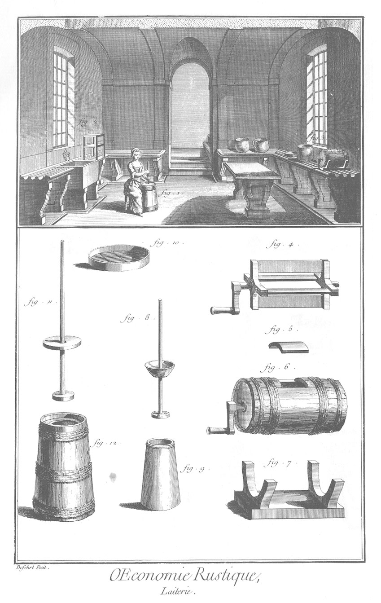

LAITERIE.
=========

La vignette représente l'intérieur de la laiterie d'une des maisons royales ; aussi est-elle plus décorée qu'elles ne le sont ordinairement : elle doit être de quelques piés plus bas que le rez-de-chaussée. Les tables sont de pierre de liais, & ont trois cannelures, par lesquelles les sérosités des laitages s'écoulent dans les éviers qui sont au-dessous.

1. Fille qui bat le beurre dans la baratte.
2. Cage sur les étages de laquelle on met égoutter les fromages.
3. Baratte flamande.
4. Arbre de la baratte.
5. Porte de la baratte.
6. Boîte ou corps de la baratte.
7. Pié de la baratte.
8. Batte à beurre d'une baratte de fayance. Le bâton traverse une sebille de bois ou de fayance qui sert de couvercle à la baratte.
9. Baratte de fayance.
10. Clayon. Il y en a de différentes grandeurs & formes.
11. Batte à beurre de la baratte de bois. Le bâton traverse une planche circulaire qui sert de couvercle à la baratte.
12. Baratte de bois dont se sert la figure premiere de la vignette.

[->](../28-Art_de_faire_éclore_les_poulets/Légende.md)
