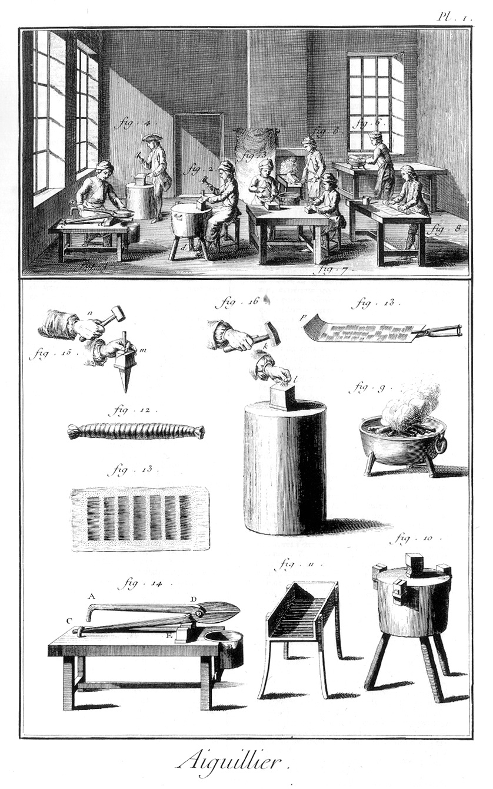
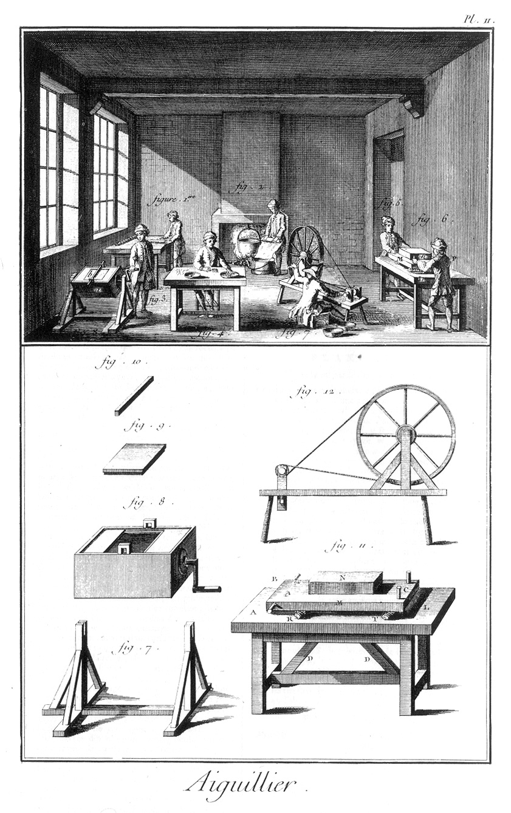

AIGUILLIER.
===========

PLANCHE Iere.
-------------

Nota. Cette Planche & la suivante, sont citées au mot Aiguille, comme n'en faisant qu'une ; mais la multiplicité des objets à représenter a obligé d'en faire deux.

1. Le coupeur.

2. Le perceur.

3. Le troqueur.

4. Le palmeur.

5. Le trempeur.

6. Le récuiseur.

7. L'évideur qui est aussi le pointeur.

8. Ouvrier qui roule le treillis sur lequel les aiguilles sont arrangées par petits tas avec de la poudre d'émeril.

9. Poile qui sert à l'ouvrier (fig. 6.) pour faire recuire les aiguilles sur une plaque de tôle.

10. Billot à trois pieds, au milieu duquel est un tas qui sert au perceur d'aiguilles (fig. 2.), & sur les bords, divers autres petits tas qui servent au dresseur pour dresser les aiguilles de marteau, après qu'elles sort trempées.

11. Fourneau de fer, composé d'une grille sur laquelle on fait le feu de charbon qui sert au trempeur (fig. 5.) pour faire rougir les aiguilles sur la plaque de tôle (fig. 13.), & les jetter ensuite dans le baquet plein d'eau froide que l on voit devant lui.

12. Treillis dans lequel sont renfermées les aiguilles pour étre portées sous la polissoire.

13. Treillis tout étendu, sur lequel on voit les aiguilles rangées & saupoudrées d'émeril à l'huile ou avec du savon. On roule ce treillis de maniere que les aiguilles soient étendues suivant leur longueur dans le rouleau (fig. 12.) que l'on ferme avec le treillis. Cette figure est mal-à-propos citée figure 24. au mot Aiguille.

14. Etabli ou banc du coupeur.
	- A D C, la cisaille.
	- E, tasseau qui la supporte.
	- C anneau qui retient la branche dormante D C.
	- B. le seau dans lequel tombent les aiguilles, à mesure que la cisaille tranche le fil d'acier dont elles son faites.

15. Situation des mains de l'ouvrier qui perce une aiguille. On se sert aussi pour cet effet & pour pratiquer la chasse ou gouttiere que l'on voit de chaque coté de l'aiguille, d'une machine qui est représentée dans la Planche de l'aiguillier-bonnetier, & que l'on appelle étau.

16. Situation des mains du palmeur (fig. 4.) applatissant l'extrémité de l'aiguille qui doit être percée.

PLANCHE II.
-----------

1. La vignette représente un ouvrier qui continue l'opération de la figure 8 de la Planche précédente. Celui-ci ficelle dans toute leur longueur, & plus fortement vers les extrémités, les rouleaux d'aiguilles que le premier a formés.

2. Un ouvrier qui déroule le treillis, & laisse tomber les aiguilles dans la lessive, après qu'elles ont été polies à la polissoire.

3. Un ouvrier qui fait tourner le van pour vanner les aiguilles avec du son sec, & les sécher par ce moyen après qu'elles ont été lessivées.

4. Un ouvrier qui détourne les aiguilles. On leur met à toutes la pointe du même côté, & on sépare les bonnes des mauvaises.

5. & 6. Deux ouvriers qui font aller & venir la polissoire.

7. L'empointeur, ouvrier qui affine la pointe des aiguilles sur une petite meule de pierre à polir, qu'il fait tourner avec un rouet.

8. Le van que le vanneur (fig. 3.) fait tourner.

Au bas de la Planche.

7. Pié ou support du van.

8. Van séparé de son support, où l'on voit distinctement la feuillure qui reçoit la porte.

9. Porte du van.

10. Barre ou verrouil qui assujettit la porte dans la feuillure destinée à la recevoir.

11. La polissoire plus en grand.
	- L, la table.
	- M, la planche qui repose sur les rouleaux de treillis R T remplis d'aiguilles que l'ouvrier (fig. 8.) de la Planche précédente) a formés, & que l'ouvrier (fig. 1. Planche 2.) a ficelés.
	- C, poignées verticales qu'un des ouvriers (fig. 5. & 6.) saisit pour tirer ou pousser la polissoire.
	- A & B, poignées horisontales qui servent au même usage.
	- D D, deux contre-vents assemblés par le bas dans la traverse du pié, & par le haut dans la table L; ils contribuent à la solidité du pié: lorsqu'on ne met qu'un seul rouleau de treillis T sous la planche M, chargé du poids N, un seul ouvrier suffit ; mais alors on suspend la planche par son autre extrémité A B avec deux cordes attachées au plancher, lesquelles passent dans les pitons que l'on voit, le rouleau R étant supprimé; on ne met jamais plus de deux rouleaux de treillis à la fois sous la polissoire.

12. Rouet de l'évideur (fig. 7.) dessiné sur la même échelle que toutes les autres figures du bas de cette Planche. Au reste, ce rouet n'a de particulier que les petites meules de pierres à aiguiser, qui sont montées sur sa broche, auxquelles on présente plusieurs aiguilles à la fois entre le pouce & le premier doigt, entre lesquels on les fait tourner. Voyez aussi les Planches de l'épinglier, & leur explication.

[->](../2-Aiguillier-Bonnetier/Légende.md)
