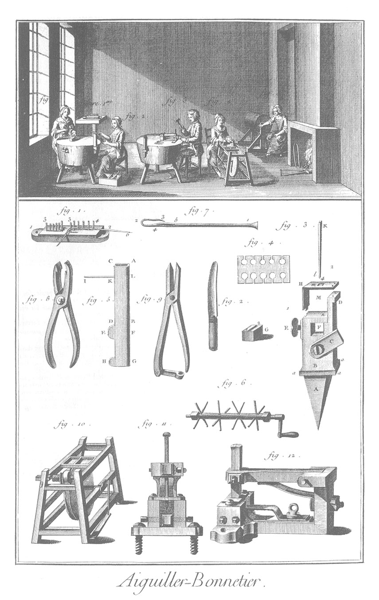

AIGUILLIER-BONNETIER.
=====================

Vignette.

1. Engin qui sert à dresser le fil dont les aiguilles sont faites. Il est représenté plus en grand, fig. 1. du bas de la Planche.

2. Ouvriere qui lime la partie des tronçons qui doit former le bec de l'aiguille ; elle tient l'aiguille avec les pinces à bride, représentées fig. 9.

3. Ouvrier qui perce l'aiguille avec le nouvel étau (fig. 12.), c'est-à-dire qu'il forme la châsse dans laquelle la pointe du bec de l'aiguille est reçue lors du coup de presse.

4. Ouvriere qui brunit des aiguilles.

5. Ouvriere qui blanchit les aiguilles. On voit dans la cheminée le gauffrier dans lequel on fait recuire la partie des aiguilles qui doit former le bec, laquelle déborde hors de cet instrument.

6. Ouvriere qui palme les aiguilles, après que le bec en est ployé.

Bas de la Planche.

1. L'engin.

2. Couteau à canelle denté comme une scie ; il sert à l'ouvriere (fig. 2.) pour pratiquer une petite rainure dans la piece de bois sur laquelle elle lime les aiguilles. On voit cette rainure au sommet de la piece de bois qui est fixée au billot du perceur (fig. 3.).

3. Ancien étau à percer.

4. La jauge.

5. Plioir.

6. Arbre du moulin de la fig. 5. de la Vignette.

7. Aiguilles entierement achevées.

8. Nouveau plioir plus commode que l'ancien.

9. Pinces à brides dont se sert l'ouvriere (fig. 2.).

10. Machine à brunir, dont se sert l'ouvriere (fig. 4.). La plus grande des deux meules est de grais, & la plus petite de bois, sur laquelle, après un enduit de colle forte, on a saupoudré de l'émeril. Ces deux meules sont séparées par la poulie sur laquelle passe la corde sans fin qui vient de la roue.

11. Elévation de la face antérieure de la nouvelle machine à percer les aiguilles, dont se sert l'ouvrier (fig. 3.).

12. Vûe perspective de la même machine.

[->](../3-Amidonnier/Légende.md)
