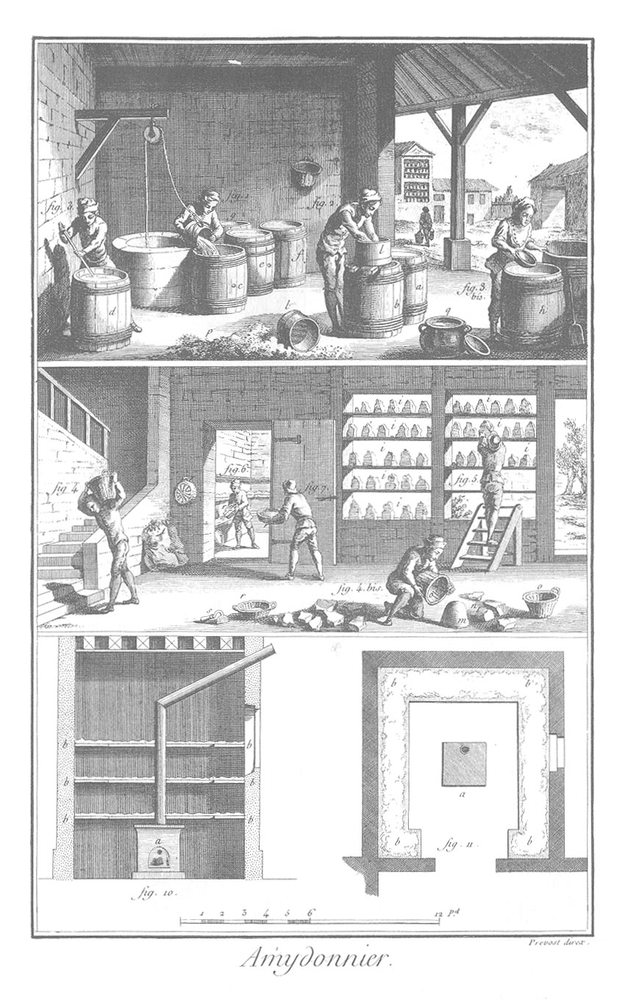

AMIDONNIER.
===========

1. Mise en trempe, ou maniere de jetter l'eau sur le levain. Les tonneaux e f & autres qu'on voit pleins, contiennent de la matiere en trempe.

2. Maniere de laver le son ; c'est la matiere en trempe mise dans le sas de crin l. Les tonneaux a b contiennent ou reçoivent la matiere en bon état.

3. Ouvrier qui lave avec de l'eau claire dans le tonneau d les résidus de la matiere restée dans le sas de crin l.

	- 3 bis. Ouvrier qui enleve l'eau avec une sebille de bois jusqu'à ce que la matiere déposée au fond du tonneau h paroisse.

4. L'amidon tiré du tonneau H, & mis dans des paniers o, est porté dans le grenier.

	- 4 bis. L'amidon m renversé sur le plancher pour être rompu en plusieurs morceaux n. 

5. Les morceaux d'amidon déjà secs en partie, sont portés sur les essuis ou tablettes i i i i.

6. &
7. L'amidon mis en poudre, est porté sur des claies b b, b b, b b, dans l'étuve.

10. &
11. Etuve & plan de l'étuve.
	- a, le plan de l'étuver Autres instrumens de l'art représentés au bas de la premiere & de la seconde vignettes.
	- p, le son sorti du sas ou tamis l.
	- q, pot de terre dans lequel l'ouvrier (fig. 3 bis) met l'eau qu'il retire du tonneau h, laquelle eau dépose encore de l'amidon commun.
	- r, panier dans lequel on porte l'amidon à l'étuve.
	- s, instrument avec lequel on ramasse l'amidon resté attaché au plancher.
	- t, sacs contenant la matiere avec laquelle se fait l'amidon, appellée grillaux & recoupettes. Ce sont des parties grossieres du bled séparées de la farine par le bluteau.

[->](../../09-Anatomie/Légende.md)
