ANATOMIE, Contenant trente-trois Planches.
==========================================

AVERTISSEMENT.
--------------

L'Anatomie, cette partie de la Physique qui donne la connoissance du corps humain, devoit paroître avec distinction dans un Dictionnaire des Sciences. C'est principalement par les Planches qu'elle pouvoit être recommandable. M. Tarin, chargé de l'Anatomie, s'étoit appliqué à chercher dans chaque auteur les figures reconnues pour les meilleures. Sa collection devant présenter toutes les parties du corps humain, il ne paroissoit pas qu'il y eût rien de mieux à faire pour la satisfaction du Public, que de puiser avec discernement dans les sources, & que d'en tirer ce qu'il y auroit de préférable. Les connoisseurs ont applaudi au choix, & toute l'Anatomie devoit être comprise en vingt-deux Planches, comme on le voit par la description qui en a été donnée dans le premier tome de l'Encyclopédie, à l'article Anatomie. On a représenté aux Libraires associés qu'il étoit difficile de suivre ce premier plan sans réduire beaucoup d'objets qui perdroient par-là leur principal mérite. Ils se sont décidés sur le champ à multiplier les cuivres, & à donner la même suite de figures dans une disposition plus étendue. Le nombre des Planches a été augmenté d'un tiers, en doublant la moitié de celles qu'on s'étoit d'abord engagé de fournir. Ils se sont fait un devoir de n'épargner ni soins ni dépenses pour attirer à leur entreprise la protection qu'elle mérite.

Planches.
---------

- Iere. Le squelette vû par-devant d'après Vesale.
- I. n°. 2. La tête du squelette vûe dans sa partie inférieure avec quelques foetus.
- II. Squelette vû de côté.
- II. n°. 2. La base du crâne, & autres détails.
- III. Squelette vû par derriere.
- III. n°. 2. L'os pariétal sous différens états.
- IV. Ecorché vû de face, d'après Albinus.
- IV. n°. 2. Mains & piés disséqués.
- V. Ecorché vû par le dos, d'après Albinus.
- VI. Les muscles des piés & des mains.
- VII. Le diaphragme d'après Haller, & le larynx d'après Haller & Eustachi.
- VIII. Les arteres, d'après Drake.
- VIII. n°. 2. Autres détails des arteres & de quelques veines.
- IX. Tronc de la veine cave.
- IX. n°. 2. Tronc de la veine porte.
- X. Neuvrologie, d'après Vieussens.
- XI. & XII. Arteres de la face, d'après Haller.
- XI. & XII. n°. 2. Suite des arteres de la face, d'après Haller.
- XIII. De l'oreille, d'après Duverney.
- XIV. Intérieur du cerveau & du cervelet, d'après Haller.
- XV. Les cavités du cerveau & du cervelet, d'après Tarin.
- XVI. Arteres de la poitrine, d'après Haller.
- XVI. n°. 2. Détail des arteres de la poitrine, d'après Haller.
- XVII. Le coeur, d'après M. Senac.
- XVII. n°. 2. Détails du coeur, d'après M. Senac.
- XVIII. Quelques parties du bas-ventre, d'après Haller.
- XVIII. n°. 2. Les reins, d'après le même.
- XIX. Parties de l'estomac, du soie & des par- ties voisines, d'après Kulm.
- XX. Le rein, d'après Nuck, Bertin & Ruisch.
- XXI. La verge vûe de différentes manieres, d'après Ruisch, Heister & autres.
- XXI. n°. 2. Détails de la verge, d'aprés Graaf & Heister.
- XXII. La matrice, d'après Haller.
- XXII. n°. 2. Détails de la matrice, d'après Haller & autres.

33 Planches.

PLANCHE Iere.
-------------

Le squelette vû par devant, d'après Vesale.

[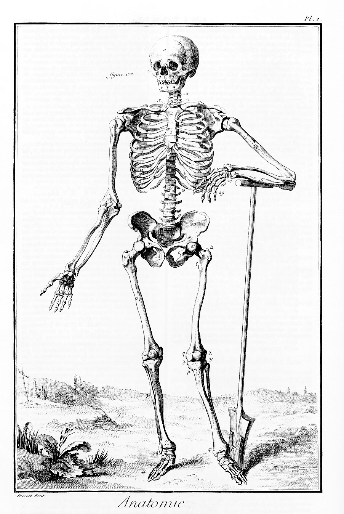](Planche_01.jpeg)

1. 
	- a, L'os du front, ou le coronal.
	- b, la suture coronale.
	- c, le pariétal gauche.
	- d, la suture écailleuse.
	- e f g, l'os temporal.
	- f, l'apophyse mastoïde.
	- e, l'apophyse zygomatique.
	- h, les grandes aîles de l'os sphénoïde, ou l'apophyse temporale.
	- i i, les os de la pomette.
	- k, la face des grandes aîles, qui se voit dans les fosses orbitaires.
	- l, l'os planum.
	- m, l'os unguis.
	- n, l'apophyse montante de l'os maxillaire.
	- o, les os du nez.
	- p, la cloison.
	- q q, les os maxillaires.
	- r r, la mâchoire inférieure.
	- s, le trou sourcilier.
	- t, le trou orbitaire inférieur.
	- u, la cinquieme vertebre du cou.
	- x, la sixieme.
	- y, le trou de leur apophyse transverse.
	- z, la symphise du menton.
	- 1, 2, 3, le sternum.
	- 1, la piece supérieure, qui reste toûjours séparée de celle qui suit.
	- 2, la partie moyenne, qui dans l'adulte n'est composée que d'une seule piece, & de cinq à six dans les jeunes.
	- 3, le cartilage xiphoïde.
	- 4, les clavicules.
	- 5, 6, 7, 8, 9, 10, 11, les vraies côtes.
	- 12, 13, &c. les fausses.
	- 15, 16, 17, 18, les cartilages qui unissent les vraies côtes au sternum.
	- 19, la derniere vertebre du dos.
	- 20, 21, les cinq vertebres des lombes.
	- θ, ω, leurs apophyses transverses.
	- 22, 22, l'os sacrum.
	- τ, τ, les trous de l'os sacrum.
	- 23, l'omoplate.
	- 24, l'os du bras, ou l'humerus.
	- 25, le rayon ou radius.
	- 26, l'os du coude, ou le cubitus.
	- 27, le carpe.
	- 28, le métacarpe.
	- 29, les doigts qui sont composés chacun de trois os nommés phalanges.
	- 30, 31, 32, les os innominés, ou les os des hanches.
	- 30, l'os ileum.
	- 31, l'os pubis.
	- 32, l'os ischium.
	- 33, le trou ovalaire.
	- 34, le fémur.
	- α, sa tête.
	- β, son col.
	- Δ, le grand trochanter.
	- ε, le petit trochanter.
	- η, le condyle interne.
	- λ, le condyle externe.
	- 35, la rotule.
	- 36, le tibia.
	- τ, le condyle externe. ,le condyle interne.
	- μ, l'empreinte ligamenteuse où s'attache le ligament de la rotule.
	- φ, la cheville ou la malléole interne.
	- 37, le peroné. π, la malléole externe.
	- 38, le tarse.
	- +, l'astragal. le naviculaire., les trois os cunéiformes.
	- 39, le métatarse.
	- 40, les doigts qui sont composés chacun de trois os nommés phalanges.

PLANCHE Iere. n°. 2.
--------------------

La tête du squelette vûe dans sa partie inférieure, avec quelques foetus.

[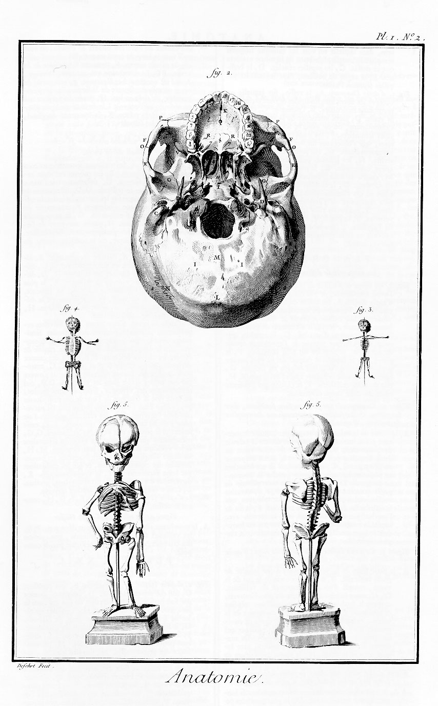](Planche_01-2.jpeg)

2.
	- A B B a a I I M L, l'occipital.
	- A, le trou occipital.
	- B, B, les condyles de cet os.
	- a, a, les trous condyloïdiens postérieurs.
	- M, l'épine.
	- I, I, les lignes demi-circulaires inférieures qui s'observent à côté de l'épine externe.
	- L, la tubérosité occipitale externe.
	- N N, la suture lambdoïde.
	- 2, 2, le pariétal.
	- C D E G c d e f g 3, 3, l'os temporal.
	- C, l'apophyse mastoïde.
	- D, l'apophyse styloïde.
	- E, l'apophyse zygomatique.
	- G, l'apophyse transverse.
	- c, la rainure mastoïdienne, dans laquelle s'attache le digastrique.
	- d, le conduit de la carotide.
	- e, l'extrémité du rocher.
	- f, la fosse articulaire.
	- g, le trou auditif externe.
	- 3, 3, une partie de la fosse temporale.
	- O O, la suture zygomatique.
	- F P 5, l'os de la pomette.
	- F, l'apophyse zygomatique de cet os, qui, avec celle de l'os des tempes
	- E, forme l'arcade zigomatique.
	- P, suture formée par l'articulation de l'os de la pomette avec l'os maxillaire.
	- 5, une partie de la fosse zygomatique.
	- h H I K V X 4, l'os sphénoïde.
	- H, I, K, les apophyses ptérigoïdes
	- V, les grandes aîles.
	- H, l'aîle externe de l'apophyse ptérigoïde.
	- I, l'aîle interne.
	- K, le petit crochet qui s'observe à l'extrémité de l'aîle interne.
	- h, la fosse ptérigoïdienne.
	- 4, le trou oval.
	- V, la fente sphéno-maxillaire.
	- Q R S i k l 7 7, le palais, ou les fosses palatines.
	- 7 7, les os du palais.
	- l l, les os maxillaires.
	- R R, articulation de ces os avec les os du palais.
	- S, articulation des os du palais entre eux.
	- Q, articulation des os maxillaires entre eux.
	- i i, les trous palatins, ou trous gustatifs postérieurs.
	- K, le trou incisif, ou trou gustatif antérieur.
	- 8, la partie postérieure des cornets inférieurs du nez.
	- 9, la partie postérieure des cornets inférieurs de l'os ethmoïde.
	- 10, l'os vomer.
	- T, articulation de cet os avec l'os sphénoïde.
	- m, articulation de cet os avec les os du palais.
	- 11, 12, 13, 14, 15, 16, 17, 18, les dents.
	- 11, 12, 13, 14, 15, les dents molaires.
	- 16, la canine.
	- 17 & 18, les deux incisives.
3. &
4. &
5. représentent des squelettes de foetus de différens âges.

PLANCHE II.
-----------

Le squelette vû de côté.

[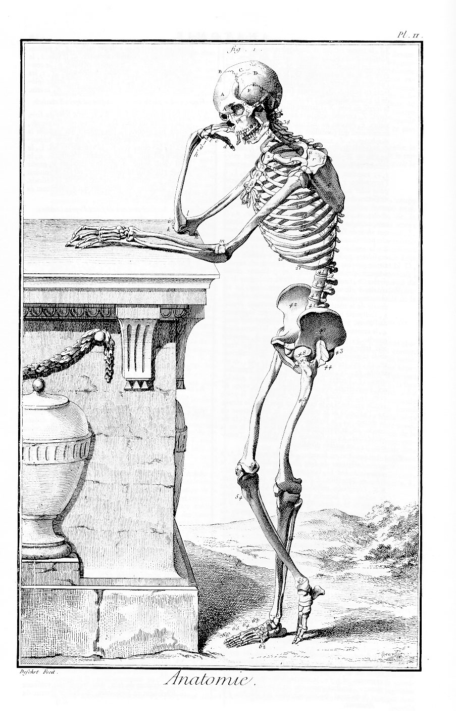](Planche_02.jpeg)

1.
	- a A B, le coronal.
	- B, la suture coronale.
	- A, la tubérosité surciliere.
	- a, le trou surcilier.
	- C, le pariétal.
	- D, l'empreinte musculaire du temporal.
	- E, la suture écailleuse.
	- F, la portion écailleuse de l'os des tempes.
	- G, l'occipital.
	- H, le trou mastoïdien postérieur.
	- I, l'apophyse mastoïde.
	- K, le trou auditif externe.
	- L, l'apophyse zygomatique de l'os des tempes.
	- M, l'apophyse zygomatique de l'os de la pomette.
	- L M, l'arcade zygomatique.
	- N, l'os de la pomette.
	- O, l'apophyse orbitaire de l'os de la pomette.
	- P, la fosse temporale.
	- R, l'orbite.
	- S, l'apophyse montante de l'os maxillaire.
	- T, les os du nez.
	- V, la fosse maxillaire.
	- S V, l'os maxillaire.
	- X, le condyle de la mâchoire inférieure.
	- Y, l'apophyse coronoïde.
	- Z, le trou mentonier.
	- b, l'entrée des fosses nazales.
	- c, le métacarpe.
	- d, les doigts.
	- e, le second rang des os du carpe.
	- f, le premier rang des os du carpe.
	- g, le cubitus.
	- h, le radius.
	- i, la tête du radius. k, l'olécrane.
	- l, l'apophyse coronoïde du cubitus.
	- m, le condyle externe de l'humerus.
	- n, son condyle interne.
	- o, la marque de l'endroit où la tête de l'humerus est séparée de cet os dans le foetus.
	- p, la tête de l'humerus.
	- q r s t u x y z, l'omoplatte.
	- q, la fosse sous-épineuse.
	- r, la fosse sur-épineuse.
	- s, l'acromion.
	- t, l'apophyse coracoïde.
	- u, l'angle postérieur supérieur.
	- x s, l'épine de l'omoplatte.
	- y, l'angle postérieur inférieur.
	- z, le col de l'omoplatte.
	- 1, la clavicule.
	- 2, 3, 4, 5, 6, 7, les différentes pieces du sternum dans les jeunes sujets.
	- 8, 9, les deux dont le cartilage xiphoïde est quelquefois composé.
	- 10, 11, 12, 13, 14, 15, 16 & 21, les cartilages des côtes.
	- t t, endroit où ces cartilages sont unis avec les côtes.
	- 22, 23 &c. 33, les côtes.
	- 34, la premiere vertebre du cou.
	- 35, 36 & 37, les vertebres du cou.
	- 38, une apophyse épineuse.
	- 39, les apophyses transverses.
	- 40, intervalle entre deux vertebres pour le passage des nerfs.
	- 41, 41, 41, &c. les cinq vertebres lombaires.
	- 42, les os des iles.
	- 43, une partie de l'os sacrum.
	- 44, le coccyx.
	- 45, le fémur.
	- 46, l'os ischion.
	- 47, l'os pubis.
	- 48, la tête du fémur.
	- 49, son cou.
	- 50, le grand trochanter.
	- 51, le condyle externe du fémur.
	- 52, le condyle interne.
	- +, la rotule.
	- 53, 54, 55, le tibia.
	- 54, la tubérosité où s'attache le ligament de la rotule.
	- 55, la malléole interne.
	- 56, le péroné.
	- 57, la malléole externe.
	- 58, l'astragal.
	- 59, le calcaneum.
	- 60, le cuboïde.
	- 61, le naviculaire.
	- 62, le moyen cunéïforme.
	- 63, le petit cunéïforme.
	- 64, le grand cunéïforme.
	- 65, le métacarpe.
	- 66, les doigts.

PLANCHE II. n°. 2. La base du crâne & autres détails.
-----------------------------------------------------

[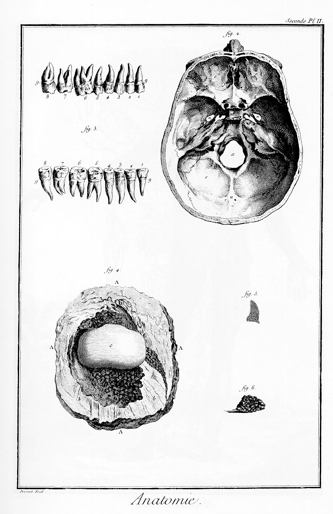](Planche_02-2.jpeg)

2. 
	- a b c c, le coronal.
	- a, l'épine du coronal coupée.
	- b, les sinus frontaux.
	- c, c, les fosses antérieures de la base du crâne.
	- d, l'apophyse crista galli.
	- e, e, f, f, la la lame cribreuse de l'os ethmoïde.
	- g, h, i, k, l, m, n, o, l'os sphénoïde.
	- g, la fosse pituitaire.
	- h, k, les petites aîles de l'os sphénoïde.
	- i, les apophyses clynoïdes antérieures.
	- l, l, les apophyses clynoïdes postérieures.
	- m, la fente sphénoïdale.
	- n, le trou ovale.
	- o, le trou épineux.
	- m, n, o, les grandes aîles.
	- p q, le rocher.
	- p, le trou déchiré moyen.
	- q, l'angle supérieur du rocher.
	- m, n, o, p, q, les fosses moyennes de la base du crâne.
	- r, le trou auditif.
	- s, le trou déchiré postérieur.
	- t, t, t, le sillon à recevoir les sinus latéraux.
	- u, la fin du sinus longitudinal.
	- x, le grand trou occipital.
	- s, t, u, les fosses postérieures inférieures de la base du crâne.
3. Les dents dans leur entier.
	- 1, 2, les incisives.
	- 3, les canines.
	- 4, 5, 6, 7, 8, les molaires.
	- g, g, g, le collet de la dent.
	- 10, 10, la couronne de la dent.
4. de Clopton Havers.
	- A A A A, la partie antérieure du genou, séparée des autres.
	- a, a, a, les grandes glandes muqueuses.
	- b, b, b, b, la membrane capsulaire.
	- c, la rotule.
5. du même. Un petit sac de moëlle qui est composée de petites vésicules.
6. du même. Glande muqueuse tirée du sinus de la par tie inférieure de l'humerus.

PLANCHE III.
------------

[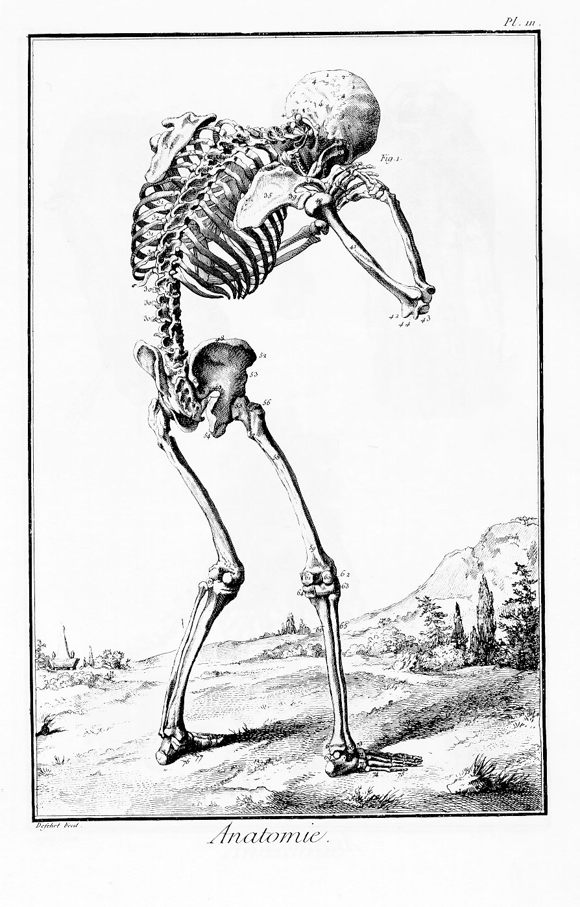](Planche_03.jpeg)

Le squelette vû par-derriere.

- 1, 1, les pariétaux.
- 2, la suture sagittale.
- 3, 6, le temporal.
- 3, la fosse temporale.
- 6, la fosse zygomatique.
- 4, 4, la suture lambdoïde.
- 5, l'occipital.
- 7, l'arcade zygomatique.
- 8, 9, 10, la machoire inférieure.
- 8, son condyle.
- 9, l'apophyse coronoïde.
- 10, l'angle de la mâchoire inférieure. +, la tubérosité occipitale.
- 11, 11, 11 & 12, les sept vertebres du cou.
- 13, 14, &c. 24, les douze vertebres du dos.
- 25 & 29, les cinq vertebres des lombes.
- 30, 30, &c. les apophyses transverses.
- 31, 31, les apophyses épineuses.
- 32, l'articulation des apophyses transverses des vertebres du dos avec les côtes.
- 33, 34, l'angle des côtes.
- 35, 36 & 39, l'omoplatte.
- 35, la fosse sous-épineuse.
- 36 & 37, l'épine de l'omoplatte.
- 36, l'apophyse acromion.
- 38, la fosse sur-épineuse.
- 39, l'angle antérieur de l'omoplatte, qui reçoit dans la cavité glenoïde la tête de l'humerus.
- 40, la tête de l'humerus.
- 41, empreinte musculaire où le deltoïde s'attache.
- 42, le condyle interne.
- 43, la partie de cet os reçue dans la partie supérieure du cubitus.
- 44, petite fossette postérieure, qui reçoit l'extrémité de l'olecrâne.
- 45, la premiere vertebre de l'os sacrum.
- 46, le coccix.
- 48, 49, 50, 51, 52, 53, l'os des iles.
- 48, 50, 52, la crête.
- 49, l'échancrure sciatique.
- 50, l'épine postérieure supérieure.
- 51, l'épine postérieure inférieure.
- 52, l'épine antérieure supérieure.
- 53, l'épine antérieure inférieure.
- 54, la tubérosité de l'ischion.
- 55, la tête du fémur.
- 56, le grand trochanter.
- 57, le petit trochanter.
- 58 & 59, la ligne âpre.
- 60, le condyle externe.
- 61, le condyle interne.
- 62, le cartilage intermédiaire de l'articulation.
- 63, 64, 66, 67, le tibia.
- 63, le condyle externe.
- 64, le condyle interne.
- 67, la malléole interne.
- 65 & 68, le peroné.
- 68, la malléole externe.
- 69, l'astragal.
- 70, le calcaneum.
- 71, le cuboïde.
- 72, le petit cunéiforme.
- 73, le moyen cunéiforme.
- 74, le métatarse.
- 75, les doigts ou orteils.
- 76, le scaphoïde.
- 77, le grand os cunéiforme.

PLANCHE III. n°. 2. L'os pariétal sous différens états.
-------------------------------------------------------

[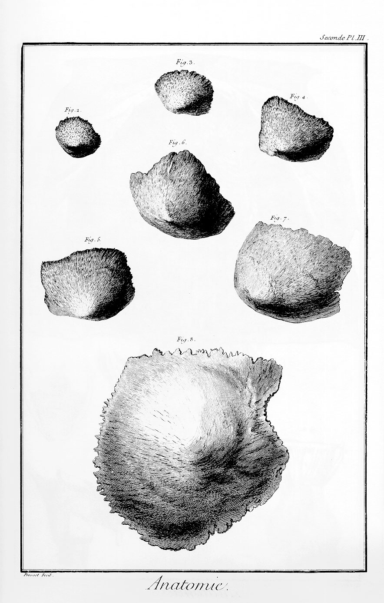](Planche_03-2.jpeg)

2. & 
3. & 
4. &
5. &
6. &
7. &
8. Différens degrés d'ossification de l'os pariétal, par où l'on voit comment les intervalles entre les fibres osseuses se sont remplis par degrés.

PLANCHE IV. L'écorché vû de face d'après Albinus.
-------------------------------------------------

[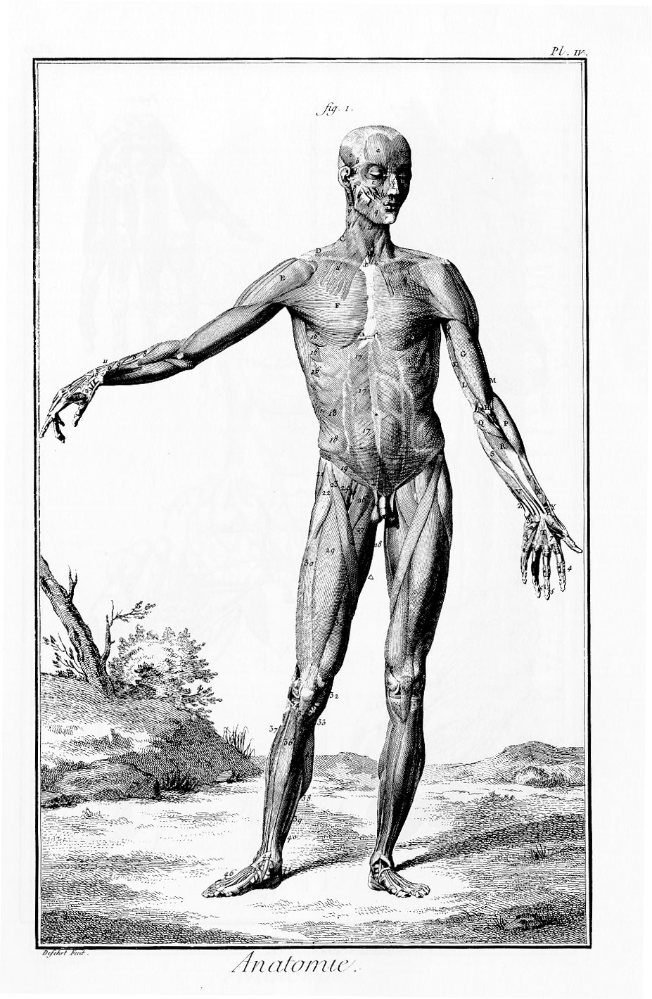](Planche_04.jpeg)

1. 
	- a, a, les muscles frontaux.
	- b, une partie de l'aponévrose qui recouvre le muscle temporal.
	- c, le muscle supérieur de l'oreille.
	- d, le muscle antérieur de l'oreille.
	- e e, l'orbiculaire des paupieres.
	- f, le tendon de ce muscle.
	- g, le muscle surcilier.
	- h h, les pyramidaux du nez.
	- i, l'oblique descendant du nez.
	- k, une partie du myrtiforme.
	- l l, le grand incisif.
	- m, le petit zygomatique.
	- n, le grand zygomatique.
	- o, le canin.
	- p p, le masseter.
	- q, le triangulaire de la levre inférieure.
	- r, le quarré de la levre inférieure.
	- s s, l'orbiculaire des levres.
	- u u, le peaussier.
	- x x, le sterno-mastoïdien.
	- y y, le clynomastoïdien.
	- z, le sterno-hyoïdien.
	- A, le sternothyroïdien.
	- B, la trachée-artere.
	- C D, le trapeze.
	- E, le deltoïde.
	- F, le grand pectoral.
	- G H I N, le biceps.
	- G, la courte tête.
	- N, la longue.
	- H, son aponévrose coupée.
	- I, son tendon.
	- K, le long extenseur.
	- L, le court extenseur.
	- M M, le brachial interne.
	- O, le coraco brachial.
	- P, le long supinateur.
	- Q, le rond pronateur.
	- R, le radial interne.
	- S, le long palmaire.
	- T, l'aponévrose palmaire.
	- V V, le sublime.
	- X, le fléchisseur du pouce.
	- Y, les extenseurs du pouce.
	- 1, le thenar.
	- 2, le court palmaire.
	- 3, l'hypothenar.
	- 4, les ligamens qui retiennent les tendons des fléchisseurs des doigts.
	- 5, le tendon du sublime.
	- 6, le profond ou le perforant.
	- 7, le mesothenar.
	- 8, 8, le radial externe.
	- 9, 9, le long extenseur du pouce.
	- 10, le court.
	- 11, l'éxtenseur des doigts.
	- 12, l'adducteur du pouce.
	- 13, le muscle adducteur du doigt index.
	- 14, l'interosseux du doigt index.
	- 15, le ligament annulaire externe.
	- Θ, le grand dorsal.
	- 16, 16, 16, les digitations du grand dentelé.
	- 17, 17, le muscle droit du bas ventre, qui paroît à-travers l'aponévrose du grand oblique.
	- 18, 18, le grand oblique.
	- 19, le ligament de Fallope. +, l'anneau.
	- 20, le testicule dans les enveloppes sur lesquelles le muscle crémaster s'étend.
	- 21, l'aponévrose du fascia lata.
	- 22, le fascia lata.
	- 23, le couturier.
	- 24, l'iliaque.
	- 25, le psoas.
	- 26, le pectinée.
	- 27, le triceps supérieur.
	- 28, le grêle interne.
	- 29, le droit antérieur.
	- Δ, le triceps inférieur.
	- 30, le vaste externe.
	- 31, le vaste interne.
	- 32, le tendon du couturier.
	- 33, le tendon du grêle interne.
	- 34, le cartilage interarticulaire.
	- 35, le ligament de la rotule.
	- 36, le jambier antérieur.
	- 37, l'extenseur commun.
	- 38, le fléchisseur des doigts.
	- 39, le fléchisseur du pouce.
	- 40, le jambier postérieur.
	- 41, ligament qui retient les fléchisseurs du pié.
	- 42, les jumeaux.
	- 43, le solaire.
	- 44, 45, les ligamens qui retiennent les extenseurs du pié & des doigts.
	- 46, le court extenseur des doigts.
	- 47, le thenar.

PLANCHE IV. n°. 2. Mains & piés disséqués.
------------------------------------------

[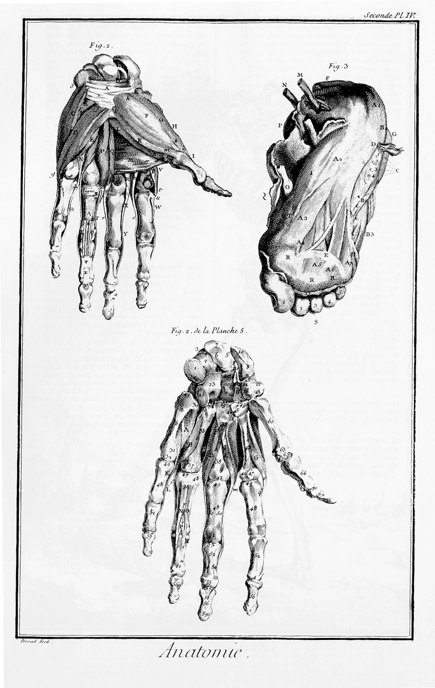](Planche_04-2.jpeg)

2.
	- A, ligament transversal du carpe.
	- a, partie de ce ligament attachée à l'os pysiforme.
	- b, la partie attachée à l'os naviculaire.
	- B, canal par lequel passe le tendon du radial interne.
	- C, abducteur du petit doigt.
	- d, son origine de l'os pysiforme.
	- e, son attache au ligament du carpe.
	- D, le court fléchisseur du petit doigt.
	- f, son origine ou ligament du carpe.
	- g, le tendon qui lui est commun avec l'abducteur du petit doigt.
	- E E, abducteur de l'os du métacarpe du petit doigt qui est ici recouvert par le court fléchisseur D, & par l'abducteur C.
	- F, le court abducteur du pouce.
	- h, son origine du ligament du carpe.
	- i, partie de l'extrémité du tendon insérée au premier os du pouce.
	- k, portion tendineuse qui s'unit aux extenseurs & au court fléchisseur du pouce.
	- G, l'opposant du pouce.
	- H, le tendon du court extenseur coupé.
	- I, tendon commun des extenseurs du pouce, qui s'étendent jusqu'au dernier os du pouce.
	- K L, le court fléchisseur du pouce.
	- K m, sa premiere queue.
	- L n, sa seconde queue.
	- l, sa troisieme queue.
	- l, partie qui naît du ligament du carpe.
	- m, extrémité tendineuse de la premiere queue qui s'insere au premier os du pouce : c'est une partie de celui qui s'insere à l'os sésamoïde qui se trouve au-dessous de cette extrémité tendineuse.
	- n o, extrémité tendineuse de la derniere portion. n, la partie insérée à l'os sésamoïde.
	- o, la partie qui s'insere au premier os du pouce.
	- M, abducteur du pouce couvert en partie par le court fléchisseur L, en partie par l'interosseux postêrieur Q du doigt du milieu.
	- p, une partie de la portion qui vient de l'os du métacarpe, qui soûtient le doigt du milieu.
	- Q, l'interosseux postérieur du doigt du milieu, couvert par l'interosseux P & le fléchisseur L.
	- r, son tendon par lequel il s'unit au tendon de l'extenseur commun des doigts.
	- R, l'interosseux antérieur du doigt du milieu couvert par l'adducteur M.
	- S, l'interosseux postérieur du doigt index couvert par l'abducteur M.
	- s, son tendon par lequel il s'insere au troisieme os, après s'être uni au tendon de l'extenseur commun du doigt index.
	- T, l'interosseux antérieur de l'index couvert par l'abducteur M & l'abducteur n.
	- V, abducteur de l'index couvert par l'adducteur M.
	- t, l'extrémité de son tendon, par laquelle u il s'insere au premier os du doigt index.
	- W, le tendon du premier vermiculaire, qui s'unit avec le tendon commun des extenseurs de l'index, & de-là s'insere au troisieme os.
	- X, tendon du second vermiculaire coupé, lequel s'unit au tendon de l'interosseux R, avec lequel il forme Y le tendon commun qui se rend au troisieme os, après s'être uni avec le tendon de l'extenseur commun.
	- Z, tendon du troisieme vermiculaire coupé, lequel s'unit au tendon de l'interosseux p, d'où r, le tendon commun, s'unissant avec le tendon de l'extenseur commun, va s'insérer au troisieme os.
	- Δ, tendon du quatrieme vermiculaire coupé, lequel s'unit au tendon de l'interosseux N, d'où ο, le tendon commun, s'unissant avec le tendon de l'extenseur propre du petit doigt, va s'insérer ensuite au troisieme os.
	- Λ, ligament par lequel le tendon des fléchisseurs, c'est-à-dire le sublime & le profond, sont couverts.
	- α α α α, son attache à chaque bord du premier os.
	- Ξ Ξ, tendon du profond coupé au commencement de chaque doigt, où il est au-dessous du tendon Π du sublime.
	- β β β, certaine marque de division.
	- γ, l'extrémité du tendon insérée au troisieme os.
	- Π, le tendon du sublime, coupé & couvert par le ligament.
	- Λ Σ Φ, les deux portions dans lesquelles le sublime se divise, couvertes par les ligamens Λ & Ψ.
	- Ψ, le ligament par lequel le tendon du profond & l'extrémité du tendon du sublime est couverte jusqu'à la partie moyenne du second doigt.
	- δ, δ, ligament attaché au bord de chaque os.

3. de Courcelles.
	- A 1 a 2, la grande aponévrose de la plante du pié.
	- A, 1, son principe.
	- A, 2, 3, 4, ses limites autour de la plante du pié.
	- A, 5, 6, 7, 8, 9, 10, 11, ses divisions en portions.
	- B 1 2 3, petite aponévrose de la plante du pié.
	- B, 1, son commencement.
	- B, 3, son extrémité.
	- C, 1, 2, 3, 4, les trous pour le passage des vaisseaux.
	- D, queue de la grande aponévrose.
	- E, fibres tendineuses courbes.
	- F, le tendon d'Achille.
	- G, le commencement de l'abducteur du plus petit doigt du pié.
	- H, fibres de la petite aponévrose, qui recouvrent le tubercule de l'os du métatarse ou cinquieme doigt.
	- I, l'abducteur du pouce couvert en grande partie par la grande aponévrose.
	- K, le ligament latéral interne. 
	- L, les vaisseaux qui passent par ce ligament.
	- M, le tendon du long fléchisseur des doigts.
	- N, le tendon du jambier postérieur.
	- O, le tendon du jambier antérieur.
	- P, l'astragal.
	- Q, lambeau de la peau.
	- R, élévations graisseuses qui recouvrent les extrémités de la grande aponévrose.
	- S, 1, 2, 3, 4, 5, le pouce & les doigts.
	- T, une partie du court fléchisseur du pouce.

La figure du bas de la Planche est la seconde de la Planche V. suivant le texte de l'Encyclopédie, à l'article Anatomie, Tome I.

- A, l'interosseux antérieur du petit doigt.
- a b, son origine de l'os du métacarpe du petit doigt.
- B, l'interosseux postérieur du doigt annulaire couvert en partie par l'interosseux A.
- d e, son origine de l'os du métacarpe du doigt annulaire.
- f, tendon par lequel il s'unit avec le tendon de l'extenseur commun, & va s'insérer au troisieme os.
- C D, l'interosseux postérieur du doigt du milieu.
- C, portion de ce muscle qui vient de l'os du métacarpe du doigt annulaire.
- D e, autre portion qui vient de celui du doigt du milieu.
- g h, son origine de l'os mitoyen du métacarpe.
- i, tendon par lequel il s'unit avec le tendon de l'extenseur commun, & va s'insérer au troisieme os.
- E F, l'interosseux antérieur du doigt du milieu.
- E, une partie qui sort de l'os du métacarpe du doigt du milieu.
- k l, son origine.
- F, partie qui provient de l'os du métacarpe du doigt index.
- n, son extrémité tendineuse.
- G, interosseux antérieur de l'index.
- n o, son origine de l'os du métacarpe du doigt index.
- p, son extrémité tendineuse
- q, insérée au premier os du métacarpe.
- H, tendon du second vermiculaire coupé, lequel s'unit au tendon de l'interosseux E F, avec lequel il forme le tendon commun, qui s'unit au tendon de l'extenseur propre du petit doigt, & va s'insérer au troisieme os.
- M, tendon du sublime coupé.
- r, quelques marques de division.
- N O, les deux portions dans lesquelles le tendon du sublime se fend.
- P, une partie qui s'en détache, & par laquelle ils sont unis.
- Q R, extrémités des queues au-delà de cetté partie par laquelle elles sont unies.
- s s, partie par laquelle elles touchent le tendon du profond qui est à côté.
- t u, l'extrémité de ces queues insérées au second os.
- 1, l'os pisiforme.
- 2, le cuboïde.
- 3, une partie de l'os cuboïde, articulée avec le radius, & recouverte d'un cartilage.
- 4, son bord recouvert d'un cartilage.
- 5, l'os lunaire.
- 6, son bord recouvert d'un cartilage.
- 7, sa face articulée avec le radius, & recouverte d'un cartilage.
- 8, l'os naviculaire.
- 9, son bord recouvert d'un cartilage.
- 10, son extrémité articulée avec le radius, & recouvert d'un cartilage.
- 11, son bord recouvert d'un cartilage.
- 12, le trapeze.
- 13, son bord revêtu d'un cartilage.
- 14, son sinus par lequel passe le tendon du radial externe.
- 15, 16, ses bords revêtus de cartilages.
- 17, le trapézoïde.
- 18, 19, ses bords revêtus de cartilages.
- 20, le grand.
- 21, sa tête revêtue d'une croûte cartilagineuse.
- 22, son bord revêtu de cartilages.
- 23, l'os cunéïforme.
- 24, son bord revêtu de cartilages.
- 25, l'apophyse onciforme.
- 26, 26, sa face revêtue d'un cartilage, & articulée avec le cuboïde & le lunaire.
- 27, son bord revêtu d'un cartilage.
- 28, l'os du métacarpe du petit doigt.
- 29, 30, ses bords revêtus de cartilages.
- 31, sa tête inférieure revêtue de cartilages.
- 32, petit os sesamïde qui se trouve quelquefois.
- 33, l'os du métacarpe, du doigt annulaire.
- 34, 35, 36, ses bords revêtus de cartilages.
- 37, sa tête inférieure revêtue de cartilages.
- 38, 38, l'os du métacarpe du doigt du milieu.
- 39, 40, 41, ses bords revêtus de cartilages.
- 42, sa tête inférieure revêtue de cartilages.
- 43, l'os du métacarpe de l'index.
- 44, 45, ses bords revêtus de cartilages.
- 46, son extrémité inférieure revêtue de cartilages.
- 47, l'os sesamoïde qui s'observe dans quelques sujets.
- 48, 48, les secondes phalanges.
- 49, 49, leurs bords revêtus de cartilages.
- 50, 50, &c. leurs éminences inégales.
- 51, &c. leurs extrémités inférieures revêtues de cartilages & articulées avec les secondes phalanges.
- 52, 52, les secondes phalanges.
- 53, &c. leurs bords revêtus de cartilages.
- 54, 54, leurs éminences inégales.
- 55, leurs extrémités inférieures articulées avec la troisieme phalange, & revêtue de cartilages.
- 56, 56, &c. les troisiemes phalanges.
- 57, leurs bords revêtus de cartilages.
- 58, &c. leurs éminences inégales.
- 59, leurs extrémités inférieures inégales en-dedans.
- 60, l'os du métacarpe du pouce.
- 61, son bord revêtu de cartilages.
- 62, 63, une partie de son extrémité inférieure revêtue de cartilages distingués en deux faces qui reçoivent les os sesamoïdes.
- 64, 65, les os sesamoïdes.
- 66, le premier os du pouce.
- 67, son bord revêtu de cartilages.
- 68, une partie de l'extrémité inférieure de ce même os revêtue de cartilages, & articulée avec le dernier os.
- 69, le dernier os du pouce.
- 70, son bord revêtu de cartilages.
- 71, son extrémité inégale. 72, l'os sesamoïde qui s'observe rarement.

PLANCHE V.
----------

L'écorché vû par le dos, d'après Albinus.

- a a, les muscles occipitaux.
- c, le releveur de l'oreille.
- d, le frontal.
- e, une partie de l'aponevrose qui recouvre le temporal.
- f, l'orbiculaire des paupieres.
- F, le muscle antérieur de l'oreille.
- g, le zygomatique.
- h, le masseter.
- i, le sternomastoïdien.
- k, le splenius.
- l l l, le trapeze.
- m, le petit complexus.
- n n, le deltoïde.
- o, le sous-épineux.
- p, portion du rhomboïde.
- q, le petit rond.
- r, le grand rond.
- s, le long extenseur.
- t t, le court extenseur.
- u, le brachial interne.
- x, le brachial externe.
- y, le long supinateur.
- z z, les radiaux externes.
- 1, l'anconée.
- 2, 3, l'extenseur commun des doigts.
- 4, 4, le long extenseur du pouce.
- 5, le court extenseur.
- 6, le cubital interne.
- 7, l'extenseur du petit doigt.
- 8, le cubital externe.
- 9, le ligament annulaire externe.
- 10, ligament particulier qui retient le tendon de l'extenseur du petit doigt.
- 11, le tendon de l'extenseur commun.
- 12, les tendons des interosseux. +, l'union des tendons des extenseurs.
- 13, le grand dorsal.
- 14, le grand oblique du bas-ventre.
- 15, le moyen fessier recouvert de l'aponevrose du fascia lata.
- 16, le grand fessier.
- 17, le vaste externe recouvert du fascia lata.
- 18, 19, le biceps.
- 18, la longue tête.
- 19, la courte.
- 20, 22, le demi-membraneux.
- 21, le demi-nerveux.
- 23, le triceps inférieur.
- 24, le grêle interne.
- 25, le vaste interne.
- 26, le plantaire.
- 27, les deux jumeaux.
- 28, le solaire.
- 29, le long fléchisseur du pouce.
- 30, le court peronier.
- 31, le peronier antérieur.
- 32, ligament qui retient les tendons de l'extenseur des doigts.
- 33, ligamens qui retiennent les tendons des peroniers.
- 34, le grand parathenar, ou l'abducteur du petit doigt.

PLANCHE VI. Muscles des piès & des mains, d'après Albinus & Courcelles.
-----------------------------------------------------------------------

[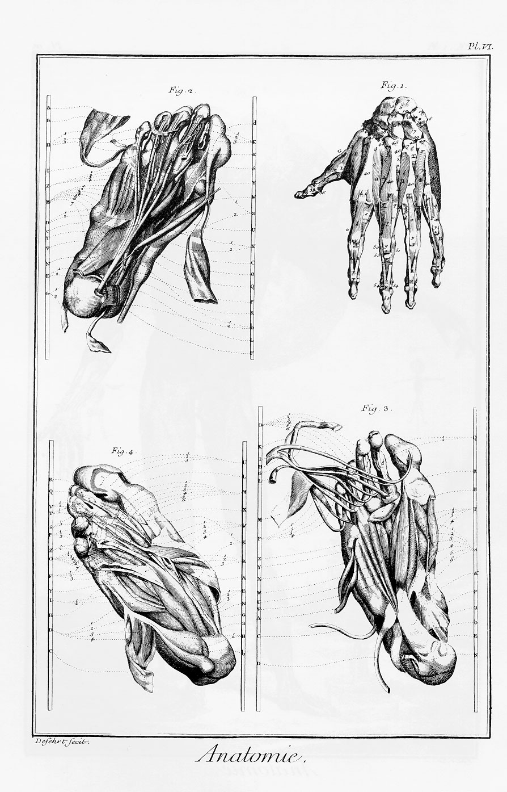](Planche_06.jpeg)

1.
	- F, l'abducteur de l'index.
	- a, son origine de l'os du métacarpe du pouce.
	- Δ, l'interosseux antérieur du doigt index couvert en partie par l'abducteur F.
	- β γ, son origine de l'os du métacarpe du doigt index.
	- ο Δ, l'interosseux antérieur du doigt du milieu.
	- δ, sa tête qui vient de l'os du métacarpe du doigt index.
	- δ ε, son origine de l'os du métacarpe du doigt index.
	- Δ, portion insérée à l'os du métacarpe du doigt du milieu.
	- ξ, son origine de l'os du métacarpe du doigt du milieu.
	- B, l'union des têtes de ce muscle.
	- ', extrémité commune charnue.
	- X, le tendon dans lequel il se termine.
	- Ξ Π, l'interosseux postérieur du doigt du milieu.
	- Ξ, sa tête qui vient de l'os du métacarpe du doigt du milieu.
	- λ μ, son origine de l'os du métacarpe du doigt du milieu.
	- Π, sa tête qui vient de l'os du métacarpe du doigt annulaire.
	- ν ξ, son origine de cet os du métacarpe.
	- ο, union des têtes.
	- π, extrémité commune charnue.
	- ς, tendon qui s'unit au tendon de l'extenseur commun, & s'insere au troisieme os.
	- Σ Φ, l'interosseux postérieur du doigt annulaire.
	- Σ, sa tête qui vient de l'os du métacarpe du doigt annulaire.
	- τ υ, son origine de l'os du métacarpe du doigt annulaire.
	- φ, tête qui vient de l'os du métacarpe du doigt auriculaire.
	- τ ν, son origine de cet os du métacarpe.
	- φ, union des deux têtes.
	- χ, extrémité commune charnue.
	- ψ, son tendon.
	- ψ, abducteur de l'os du métacarpe du quatrieme doigt, lequel s'insere à cet os & est recouvert par l'abducteur du petit doigt Ω.
	- Ω, abducteur du petit doigt de la main.
	- ω, extrémité tendineuse qui s'unit au tendon de l'extenseur propre du petit doigt.
	- a, l'interosseux antérieur du petit doigt, couvert par l'interosseux ε Φ.
	- b, son tendon qui s'unit au tendon du quatrieme vermiculaire.
	- c, l'interosseux antérieur du doigt annulaire, couvert par l'interosseux Ξ Π.
	- d, son tendon qui s'unit à celui du troisieme vermiculaire.
	- e, l'inter- osseux postérieur de l'index, couvert par l'interosseux Θ Λ.
	- f, son tendon qui s'unit au tendon commun de l'extenseur de l'index, & s'insere au troisieme os.
	- g, l'aponevrose de l'abducteur de l'index qui s'unit au tendon commun de l'extenseur de l'index.
	- h, le tendon de l'extenseur commun des doigts, qui se rend à l'index.
	- i, le tendon coupé de l'indicateur.
	- k, le tendon commun de l'indicateur & de l'extenseur commun.
	- l l, le tendon de l'extenseur commun qui se rend au doigt du milieu.
	- m n o, le tendon de l'extenseur commun qui se rend au troisieme doigt, & qui avant que d'arriver a ce doigt, est composé des deux portions m n.
	- p p, le tendon de l'extenseur propre du petit doigt.
	- q, q, q, q, les aponevroses produites par les tendons des extenseurs des doigts qui environnent leur articulation avec les os du metacarpe auxquels ils s'attachent.
	- r, l'aponevrose que fournit le premier vermiculaire au tendon commun des extenseurs de l'index.
	- s, s, s, les aponevroses que fournissent les interosseux Ξ.
	- Σ Φ, celles qui s'unissant aux tendons des extenseurs & se terminent sur leur dos, & sont continues par la partie supérieure aux aponevroses q, q, q.
	- t, t, les aponevroses semblables produites par les tendons des interosseux ο α c, a, & des vermiculaires.
	- u, tendon du premier vermiculaire, lequel s'unit avec le tendon commun de l'extenseur de l'index.
	- v, v, v, les tendons des interosseux e, Ξ Π, Σ Φ, unis avec les tendons des extenseurs h, l, o.
	- w, w, w, les tendons communs des interosseux & des vermiculaires, unis avec les tendons des extenseurs.
	- x, le tendon commun de l'abducteur du petit doigt & de son petit fléchisseur, unis avec le tendon p.
	- y, y, y, y, extrémités des tendons extenseurs z, z, z, z, qui se rendent aux secondes phalanges.
	- A, le tendon du premier vermiculaire, fortifié par une portion k qu'il re- çoit du tendon commun des extenseurs de l'index, & qui se porte au troisieme os.
	- B B B, les tendons des interosseux e, Ξ Π, Σ Φ, fortifiés par une portion des tendons extenseurs k, l, o. 
	- C, C, les tendons des interosseux Θ Λ, c, a, communs avec les vermiculaires fortifiés par une portion des tendons des extenseurs l, o, p, & qui se portent à la troisieme phalange.
	- D, le tendon commun de l'abducteur du petit doigt & de son petit fléchisseur, qui reçoit une portion de l'extenseur p, & se porte à la troisieme phalange.
	- E, E, E, E, les extrémités communes formées de l'union des tendons A B de l'index, C B du troisieme doigt, C D, du doigt du milieu, C D, du quatrieme.
	- F, F, F, F, insertion des tendons extenseurs à la troisieme phalange.
	- G, le tendon coupé du petit extenseur du pouce.
	- H, le tendon coupé du grand extenseur du pouce.
	- I, le tendon commun du grand & du petit extenseur du pouce.
	- K, son insertion à la derniere phalange de ce doigt.
	- L, l'aponevrose qui environne la capsule de l'articulation du pouce avec le métacarpe.
	- M, l'aponevrose que le tendon commun des extenseurs de l'index reçoit de la queue postérieure du fléchisseur court du pouce, laquelle est continue à l'aponevrose L.
	- N, la queue postérieure du fléchisseur court du pouce, couvert par l'abducteur F.
	- O, P, l'extrémité de l'abducteur du pouce couvert par l'abducteur F.
	- P, son extrémité tendineuse insérée au premier os du pouce.
	- 1, l'os naviculaire.
	- 2, son éminence unie avec le cubitus, & revêtue d'un cartilage mince.
	- 3, l'éminence par laquelle il est articulé avec le trapeze & le trapézoïde, couverte d'une croûte cartilagineuse mince.
	- 4, 5, ses bords revêtus d'une croûte cartilagineuse mince.
	- 6, le lunaire.
	- 7, son éminence reçûe dans l'extrémité du radius, & recouverte d'un cartilage mince.
	- 8, 9, 10, ses bords enduits d'un cartilage.
	- 11, le cuboïde.
	- 12, sa surface articulée avec le radius, & revêtue d un cartilage poli.
	- 13, 14, ses bords revêtus d'un cartilage poli.
	- 15, la face par laquelle il est articulé avec le cunéiforme, & laquelle est recouverte d'un cartilage mince.
	- 16, le pisiforme.
	- 17, l'os cunéiforme.
	- 18, sa partie articulée avec le cuboïde & le lunaire, & revêtue d'un cartilage poli.
	- 19, 20, ses bords revêtus d'un cartilage poli.
	- 21, le grand.
	- 22, sa tête revˆtue d'un cartilage, & articulée avec le lunaire & le naviculaire.
	- 23, 24, 25, ses bords revêtus de cartilages.
	- 26, le trapézoïde.
	- 27, 28, 29, ses bords revêtus de cartilages.
	- 30, le trapeze.
	- 31, 32, ses bords revêtus de cartilages.
	- 33, l'os du métacarpe du pouce.
	- 34, son bord revétu de cartilages.
	- 35, le premier os du pouce.
	- 36, la face de la tête inférieure revêtue de cartilages.
	- 37, le dernier os du pouce.
	- 38, son bord revetu de cartilages.
	- 39, son extrémité éminente & inégale.
	- 40, 40, 40, les os du métacarpe.
	- 41, 42, &c. 49, leurs bords revêtus de cartilages.
	- 50, 50, &c. les premieres phalanges des doigts.
	- 51, 51, &c. leurs parties articulées avec la seconde phalange, & revetues d'un cartilage.
	- 52, 52, &c. les secondes phalanges.
	- 53, 53, &c. leurs bords revêtus de cartilages.
	- 54, 54, leur partie articulée avec la troisieme phalange, & revêtue d'un cartilage.
	- 55, 55, &c. les troisiemes phalanges.
	- 56, leurs bords revêtus d'un cartilage.
	- 57, 57, &c. leurs extrémités inégales.

2. de Courcelles.
	- A, une portion de la petite aponevrose de la plante du pié, qui marque le lieu de son insertion.
	- B, l'abducteur du petit doigt, & son insertion.
	- C, l'abducteur du pouce avec son double tendon.
	- D, 1, 2, le fléchisseur court du petit doigt, divisé en deux ventres.
	- E, 1, 2, l'origine de l'abducteur du petit doigt, attaché à l une & l'autre tubérosité du calcaneum ; on voit le muscle même séparé en B.
	- F, l'origine de l abducteur du pouce.
	- G, 1, 2, le tendon du long péronier.
	- H, 1, 2, 3, les extrémités des tendons du fléchisseur court des doigts coupées.
	- I, le premier tendon coupé à la partie par laquelle il touche au tendon du perforé.
	- K, 1, 2, 3, les autres tendons.
	- &, ligament tendineux, qui unit les queues des tendons du perforant.
	- I, extrémité du tendon du tibial postérieur, attachée au premier os cunéiforme.
	- M, 1, 2, 3, 4, 5, les quatre queues du tendon du long fléchisseur des doigts, dont la premiere 4, 5, est coupée transversalement.
	- M, 6, tendon du fléchisseur long des doigts, plus large dans l'endroit où il commence à se séparer en quatre parties.
	- M, 7, tendon commun du fléchisseurs long des doigts, hors de situation, afin qu'on voye mieux les portions tendineuses, au moyen desquelles il communique avec le fléchisseur long du pouce.
	- R, une autre tête qui se porte vers le tendon du perforant.
	- O, portion tendineuse remarquable, qui vient du tendon du fléchisseur long du pouce, & qui s'étend sur celui du perforant.
	- P, portion tendineuse beaucoup plus petite, qui vient des mêmes tendons.
	- Q, portion tendineuse, qui vient du tendon du perforant, & qui s'insere dans celui du fléchisseur long du pouce.
	- R, petit muscle dont l'insertion est à la grande portion tendineuse O.
	- S, une partie du transversal du pié, qui paroît entre les queues du perforant.
	- T, l'interosseux interne ou inférieur du petit doigt.
	- V, l'interosseux externe ou supérieur du troisieme doigt après le pouce.
	- V & W, les deux ventres extérieurs du fléchisseur court du pouce.
	- X, 1, 2, le ventre interne du même muscle.
	- Y, une partie de l'abducteur du pouce.
	- Z, 1, 2, 3, 4, les quatre muscles lombricaux.
	- a, 1, 2, la gaine pour le tendon du fléchisseur long du pouce ouverte.
	- b, 1, 2, la gaine qui forme le ligament latéral interne, pour le passage du tendon du fléchisseur long des doigts, ouverte.
	- c, apophyse à la base du cinquieme os du métatarse.
	- d, tendon du fléchisseur long du pouce, tenu hors de sa situation par une épingle, pour faire voir la gaine dans laquelle il passe, & l'impression qu'il fait sur le court fléchisseur du pouce.

3. du même.
	- A, le fléchisseur court du petit doigt, séparé de son origine.
	- B, l'extrémité du tendon de l'abducteur du pouce, attachée à son insertion.
	- C, le tendon du court péronier, attaché à l'apophyse de la base du cinquieme os du métatarse.
	- D, le tendon du long péronier.
	- E, l'origne du petit muscle.
	- F, l'extrémité du tendon du jambier postérieur.
	- G, le tendon du fléchisseur long du pouce.
	- H, portion assez considérable sur ce sujet, qui vient du tendon du fléchisseur long du pouce, & s'unit à celui du perforant.
	- I, petite branche qui s'unit aux tendons dont on a déjà parlé.
	- K, portion du tendon du fléchisseur long des doigts, qui s'unit à celui du pouce.
	- L, petit muscle coupé transversalement à son principe E.
	- M, l'autre tête qui s'unit au tendon du fléchisseur long des doigts.
	- N, son principe qui s'attache à la petite tubérosité du calcaneum.
	- O, tendon commun du perforant, coupé.
	- O, 2, 3, 4, 5, 6, les quatre queues dans lesquelles ce tendon se divise : la premiere, 2, 3, est coupée en travers.
	- P, 1, 2, 3, 4, les quatre muscles lombricaux.
	- Q, 1, 2, l'extrémité des tendons du fléchisseur court des doigts.
	- R, le muscle transverse du pié.
	- S, 1, 2, 3, 4, 5, 6, le court fléchisseur du pouce.
		- 1, 2, 3, ses trois ventres.
		- 4, 6, sa double origine.
		- 5, continuation de la membrane qui forme les graines des fléchisseurs longs.
	- T, l'adducteur du pouce.
		- 1, 2, 3, les trois ventres de ce muscle.
		- 4, son origine au ligament du calcaneum. &, le grand ligament du calcaneum. 
	- V, l'interosseux interne ou inférieur du petit doigt.
	- U, l'interosseux externe ou supérieur du troisieme doigt après le pouce.
	- W, l'interosseux interne ou inférieur du troisieme doigt.
	- X, l'interosseux externe ou supérieur du second doigt.
	- Y, l'interosseux interne ou inférieur du second doigt.
	- Z, l'interosseux externe ou supérieur du premier doigt.
	- a, la gaine produite par le ligament latéral interne du tendon du fléchisseur long des doigts, ouverte.
	- b, la gaine qui vient du même ligament, par laquelle passe le tendon du fléchisseur long du pouce, pareillement ouverte.

4. du même.
	- A, la grande aponévrose renversée.
	- B, 1, 2, 3, les trois portions charnues de. la même aponévrose.
	- C, la petite aponévrose renversée.
	- D, 1, portion charnue antérieure de la petite aponévrose en situation, & recouverte par une aponévrose mince & transparente dans cet endroit.
	- D, 2, 3, 4, les trois autres portions charnues postérieures de la même aponévrose.
	- E, 1, 2, 3, le fléchisseur court des doigts du pié, qui a trois ventres séparés presque jusqu'à son origine.
	- F, 1, 2, 3, les trois tendons du même muscle, qui appartiennent aux trois premiers doigts.
	- G, une partie de l'abducteur du pouce.
	- H, le tendon de l'abducteur du petit doigt.
	- H, 1, 2, 2, les deux ventres de ce muscle divisés jusqu'à leur origine.
	- I, 1, 2, le fléchisseur court du petit doigt, avec les deux portions dans lesquelles il se divise.
	- K, une partie du fléchisseur court du pouce.
	- L, extrémité de la grande aponévrose, ou quatrieme portion encore entiere.
	- M, 1, 2, 3, 4, 5, 6, les trois premieres extrémités de cette aponévrose ouverte.
	- N, autre tête qui va au tendon du long fléchisseur des doigts, ou masse charnue de la plante du pié.
	- O, 1, 2, 3, 4, 5, 6, 7, les quatre tendons du long fléchisseur des doigts du pié.
	- P, 1, 2, 3, les gaines ou ligamens qui couvrent les tendons du long & court fléchisseurs des doigts.
	- Q, la gaine qui recouvre le tendon du perforant, & les extrémités du perforé.
	- R, la gaine qui recouvre le tendon du perforant, par laquelle il est fixé à la troisieme phalange.
	- S, 1, 2, la même gaine indiquée par P, 1, 2, 5, mais qui est ouverte.
	- T, 1, 2, la gaine qui est désignée par la lettre Q, mais qu'on a fendue par une incision. V, 1, 2, la même gaine que R, mais ouverte.
	- U, 1, 2, 3, la gaine du pouce, divisée en trois parties ; elle recouvre le tendon du long fléchisseur du pouce.
	- W, 1, 2, 3, 4, les quatre muscles lombricaux.
	- X, le tendon du fléchisseur long du pouce.
	- Y, l'interosseux interne ou inférieur du petit doigt.
	- Z, 1, 2, l'interosseux externe ou supérieur du troisieme doigt après le pouce. a montre l'endroit du gros tubercule du calcaneum, d'où naît la grande aponévrose plantaire ; & b, celui d'où nait la petite aponévrose.

PLANCHE VII. Le diaphragme & le larynx d'après Haller & Eustachi.
-----------------------------------------------------------------

[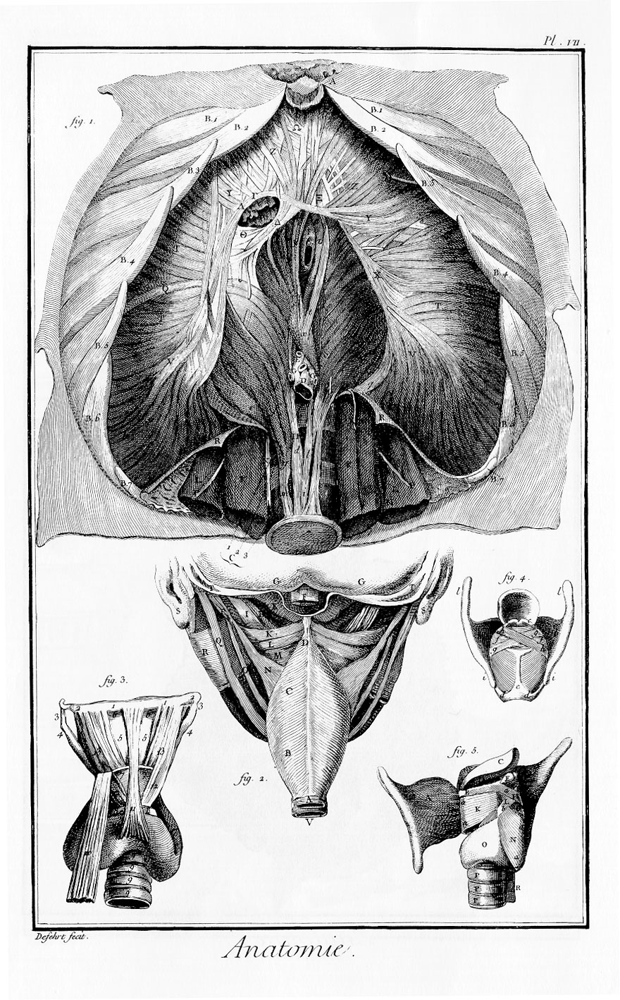](Planche_07.jpeg)

1.
	- A, le cartilage xiphoïde.
	- B, 1, 2, 3, 4, 5, 6, 7, les cartilages des sept côtes inférieures.
	- C, 1, 2, 3, les trois vertebres supérieures des lombes.
	- D, le tronc de l'aorte coupé.
	- E, l'orifice de l'artere céliaque.
	- F, la mésentérique supérieure.
	- G, G, les arteres rénales.
	- H, la veine-cave coupée dans son origine.
	- I, l'oesophage.
	- K, le muscle psoas.
	- L, le quarré des lombes.
	- N N, le nerf intercostal.
	- O O, le nerf splanchnique, ou le rameau principal du nerf intercostal, lequel forme les ganglions semilunaires.
	- P, la derniere paire dorsale qui sort au-dessous de la douzieme vertebre du dos.
	- Q Q, une partie des veines phréniques.
	- R R, l'arc intérieur ou la limite de la chair o, à laquelle le péritoine est adhérant : il se termine par des fibres ligamenteuses ou tendineuses, qui viennent de l'apophyse transverse de la premiere vertebre des lombes ; elle donne passage au psoas.
	- S S, ligament fort, continu aux fibres tendineuses du muscle transverse de l'abdomen : il vient en s'unissant avec l'arc R de l'apophyse transverse de la premiere vertebre des lombes, se terminer à la pointe de la douzieme côte ; & il est constant que la partie interne de ce ligament donne passage au quarré.
	- T V X Y Z Γ Δ Θ Λ Ξ Ω, tendon du diaphragme.
	- T T T, le principal tissu des fibres tendineuses, qui unit les chairs opposées, les appendices avec les fibres qui viennent du sternum, & ces mêmes appendices avec les fibres qui viennent des côtes. Le péritoine est fortifié dans cet endroit par des fibres tendineuses qui commencent au ligament S, & on les sépare souvent difficilement des chairs du ligament.
	- X, fibres tendineuses qui côtoyent les bords de l'aîle gauche : elles viennent du trousseau que le ligament R envoye, & elles se terminent à la partie supérieure de l'oesophage dans la principale couche.
	- T V, gros trousseau de fibres creusées en général en forme de lune, dont les cornes se terminent dans les muscles intercostaux ; la partie courbe est ouverte par l'oesophage & par la veine-cave ; les fibres des chairs moyennes s'élevent sur ce trousseau.
	- Z, Z, différens entrelacemens de fibres.
	- Ω, fibres transverses.
	- 1, le faisceau antérieur de la veine-cave, tendineux, fort, placé devant l'orifice de cette veine presque transverse ; il sort en partie du grand paquet Λ, & en partie des fibres du paquet gauche Λ.
	- Δ, faisceau gauche de la veine-cave, qui sort en partie des chairs moyennes, & en partie des fibres recourbées du faisceau postérieur.
	- Θ, faisceau postérieur de la veine-cave, qui s'observe constamment large continu au tissu principal de l'aîle droite, & qui dégenere en partie dans le faisceau Δ, en partie au-dessus de ce faisceau, en se prolongeant dans les fibres charnues moyennes.
	- Λ, faisceau droit de la veine-cave.
	- Ξ, ce trou s'observe souvent pour l'artere phrénique, quand elle perce la couche inférieure du tendon, & se porte en cette couche & la couche supérieure.
	- a a a, les chairs qui viennent des côtes.
	- b b, les chairs qui viennent du ligament S, qui montent presque droites, & soûtiennent le rein & la capsule rénale.
	- c c, les chairs qui proviennent de l'arc intérieur R.
	- d e f g h, m Π, le pilier droit du diaphragme.
	- d, l'appendice latérale externe.
	- e, la seconde appendice.
	- f, une autre portion de la seconde appendice.
	- g, le tendon commun des deux portions e & f.
	- h, l'appendice intérieure, dont une partie s'unit avec la portion g, & forme le tendon m, & en partie forme la colonne tendineuse k, qui en s'unissant à celle du côté gauche l, s'unit au tendon i, & s'insere dans la troisieme vertebre vers Π.
	- o, appendice intérieure.
	- p, appendice moyenne,
	- q appendice extérieure.
	- r, chair qui provient du ligament R, & répond à b.
	- s, chair du ligament S, qui répond à b.
	- t u w x, croix ou décussation des appendices intérieures au-dessous de l'oesophage.
	- t, la cuisse droite & supérieure qui descend à droite.
	- u, la seconde cuisse droite qui s'en va à droite & en bas.
	- w, la troisieme cuisse plus grande, qui va de gauche à droite.
	- x, la quatrieme cuisse plus grande, qui va de droite à gauche.
	- y, la colonne droite de l'oesophage.
	- z, la gauche.
	- α β, le croisement des colonnes au-dessus de l'oesophage.
	- α, la colonne droite antérieure.
	- β, la gauche postérieure.

2. Le pharynx vû postérieurement d'après M. Duverney.
	- A, le muscle oesophagien.
	- B, le crico-pharingien.
	- C, le thyro-pharingien.
	- D, le céphalo-pharingien.
	- E, portion des condyles de l'occipital.
	- F, commencement de la moelle épiniere.
	- G G, une partie de la dure-mere qui recouvre le cervelet.
	- H, la trompe d'Eustachi.
	- I, le pérystaphylin interne.
	- K, le ptérigo-pharingien.
	- L, le mylo-pharingien.
	- M, le glosso-pharingien.
	- N, le stylo-pharingien,
	- O, le stylohyoïdien.
	- P, l'apophyse styloïde.
	- Q, le digrastrique.
	- R, le ptérigoïdien interne.
	- S, l'oreille.
	- T, les os du crâne.
	- V, la trachée-artere.

3. Le larynx vû antérieurement d'après le même.
	- 11 22, l'os hyoïde.
	- 11, la base.
	- 22, l'extrémité des grandes cornes.
	- 33, ligament qui unit les grandes cornes de l'os hyoïde avec les grandes cornes 44 du cartilage thyroïde.
	- 44 55, le cartylage thyroïde.
	- 44, ses grandes cornes.
	- 66, ligament qui unit le cartilage thyroïde avec l'os hyoïde.
	- 77 77, la glande thyroïde.
	- 88, le cartilage cricoïde.
	- 9, 9, 9, 9, les cartilages de la trachée-artere.
	- 10, le sterno-thyroïdien.
	- 11, l'adeno-thyroïdien.
	- 12, 12, le crico-thyroïdien.
	- 13 13, l'hyo-thyroïdien.

4. Le larynx vû postérieurement d'après Eustachi.
	- a, la partie concave de l'épiglotte.
	- b b, la face interne du cartilage thyroïde.
	- l l, les grandes cornes.
	- i i, les petites cornes.
	- c c, le sommet des cartilages aryténoïdes.
	- d d e, le cartilage cricoïde.
	- d d ses deux petites éminences.
	- f f, l'aryténoïdien transverse.
	- g g, l'aryténoïdien oblique. gauche.
	- h h, l'aryténoïdien oblique droit.

5. Le larynx ouvert & vù sur le côté, d'après le même.
	- A B, la face interne du cartilage thyroïde.
	- A, la partie gauche.
	- B, la partie droite.
	- C D, l'épiglotte.
	- C, la face convexe.
	- D, la face concave.
	- E, portion membraneuse de la partie latérale du larynx.
	- F, sommet des cartilages aryténoïdes.
	- G, aryténoïdien transverse.
	- H, aryténoïdien oblique droit a, inséré au cartilage aryténoïde gauche.
	- I L B, l'aryténoïdien oblique gauche a, qui vient de l'aryténoïde gauche.
	- K, le thyro-aryténoïdien gauche a a, qui vient du cartilage thyroïde b, & s'insere à l'aryténoïde gauche.
	- L, le crico-aryténoïdien latéral gauche a a, qui vient du cartilage cricoïde b, & s'insere à la base de l'aryténoïde gauche.
	- M, partie de la base du cartilage aryténoïde gauche.
	- N, le crico- aryténoïdien gauche.
	- a a, la premiere origine du cartilage cricoïde.
	- b, son insertion à la base de l'aryténoïde gauche.
	- O, le cartilage cricoïde.
	- P P Q Q R, la trachée-artere.
	- P P P, les trois premiers anneaux cartilagineux.
	- Q Q, les espaces mitoyens entre ces anneaux.
	- R, la partie postérieure de la trachée-artere toute membraneuse.

PLANCHE VIII. Les arteres d'aprés Drake.
----------------------------------------

[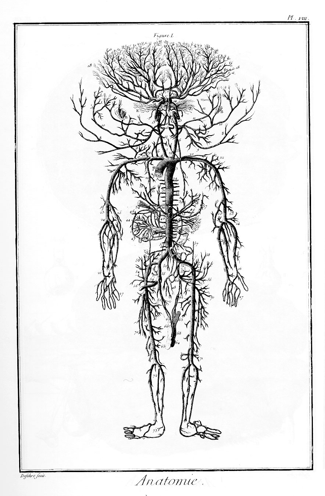](Planche_08.jpeg)

1. L'aorte ou la grande artere coupée dans son origine, à l'orifice du ventricule gauche du coeur.
	- A, les trois valvules demi-circulaires de l'aorte, comme elles paroissent, lorsqu'elles empêchent le sang de retourner dans le ventricule gauche pendant sa diastole.
	- 2, 2, les troncs des arteres coronaires du coeur, sortant du commencement de l'aorte.
	- 3, le ligament artériel, qui n'est pas exactement représenté.
	- 4, 4, les arteres souclavieres sortant de la grande artere, dont les arteres axillaires & celles du bras 23, 23, sont une continuation.
	- 5, 5, les deux arteres carotides, dont la droite sort de la soûclaviere, & la gauche de l'aorte.
	- 6, 6, les deux arteres vertébrales, sortant de la soûclaviere ; elles passent par les apophyses transverses des vertebres du cou, d'où elles entrent dans le crâne par le grand trou occipital.
	- 7, 7, les arteres qui conduisent le sang dans la partie inférieure de la face, la langue, les muscles adjacens, & les glandes.
	- 8, 8, les troncs des arteres temporales, sortant des carotides, & donnant des rameaux aux glandes parotides & aux 9, 9, muscles voisins, au péricrâne & au devant de la tête.
	- 10, 10, troncs qui envoient le sang dans la cavité du nez, & particulierement aux glandes de sa membrane muqueuse.
	- 11, 11, les arteres occipitales, dont les troncs passent sur les apophyses mastoïdes, & se distribuent à la partie postérieure du péricrâne, où elles s'anastomosent avec les branches des arteres temporales.
	- 12, 12, arteres qui portent le sang au pharynx, à la luette & à ses muscles.
	- B B, petite portion de la base du crâne, percée par l'artere de la dure-mere, qui est ici représentée avec une portion de la dure-mere.
	- 13, 13, contours que font les arteres carotides, avant que de se rendre au cerveau par la base du crâne.
	- 14, 14, partie des arteres carotides qui passent de chaque côté de la selle sphénoïde, où elles fournissent plusieurs petits rameaux qui servent à former le rete mirabile, qui est beaucoup plus apparent dans les quadrupedes que dans l'homme. (Nota. Les arteres du cervelet sont confondues avec celles du prétendu rete mirabile).
	- C, la glande pituitaire hors de la selle sphénoïde, placée entre les deux troncs tortueux des arteres carotides 14, 14.
	- D D, arteres ophtalmiques sortant des carotides, avant qu'elles s'insinuent dans la pie mere.
	- 15, contours que font les arteres vertébrales, en passant par les apophyses transverses de la premiere vertebre du cou, vers le trou de l'occipital. On a averti plus d'une fois que les cavités de ces arteres sont beaucoup plus larges dans l'endroit où elles se replient, que leurs troncs inférieurs ; ce qui sert à diminuer l'impétuosité du sang, conjointement avec leur contour. Dans les quadrupedes, les angles des inflexions ou des contours des arteres du cerveau, sont plus aigus, & servent par conséquent à diminuer davantage l'impétuosité du sang qui s'y porte avec force, à cause de la position horisontale de leurs troncs.
	- 16, les deux troncs de l'artere vertébrale, qui passent sur la moëlle allongée.
	- 17, les rameaux par lesquels les arteres carotides cervicales communiquent.
	- 18, 18, les ramifications des arteres au-dedans du crâne, dont les troncs les plus grands sont situés entre les lobes du cerveau & dans ses circonvolutions. Les veines du cerveau partent des extrémités de ces arteres ; car celles-ci pénetrent dans le cerveau par sa base, & s'y distribuent, au lieu que les troncs des veines s'étendent sur la surface du cerveau, & déchargent le sang dans le sinus longitudinal. Ces veines n'accompagnent pas les arteres, comme le font les veines & les arteres des autres parties.
	- E E, les arteres du cervelet.
	- 19, 19, les arteres du larynx, des glandes thyroïdiennes, des muscles & des parties contiguës qui sortent des arteres souclavieres.
	- 20, 20, autres arteres qui ont leur origine auprès des premieres 19, 19, & qui conduisent le sang dans les muscles du cou & de l'omoplatte.
	- 21, 21, les mammaires qui sortent des arteres souclavieres, & descendent intérieurement sous les cartilages des vraies côtes, à un demi-pouce environ de distance de chaque côté du sternum ; quelques-uns de leurs rameaux passent par les muscles pectoral & intercostal, & donnent du sang aux mammelles où ils se joignent avec quelques rameaux des arteres intercostales, avec lesquelles ils s'anastomosent. Ces arteres mammaires s'unissent avec les grandes branches des épigastriques 57, 57, ce qui augmente le mouvement du sang dans les tégumens du bas-ventre. Les extrémités des arteres lombaires & intercostales s'anastomosent avec elles de même que les précédentes.
	- 22, 22, les arteres des muscles du bras, & quelques unes de ceux de l'omoplatte. 
	- 23, 23, partie du grand tronc de l'artere du bras, que l'on s'expose à blesser en ouvrant la veine basilique, ou la plus interne des trois veines de l'avant-bras.
	- 24, 24, division de l'artere brachiale au-dessous de la courbure du coude.
	- 25, 25, branche de communication d'une artere qui sort du tronc de l'artere brachiale au-dessus de sa courbure, dans le repli de l'avant-bras, qui s'anastomose un peu plus bas avec les arteres de l'avant-bras. On trouve dans quelques sujets, au lieu de cette branche, plusieurs autres petits rameaux qui en tiennent lieu : au moyen de ces rameaux qui communiquent de la partie superieure de l'artere brachiale avec celle de l'avant-bras, le cours du sang n'est point interrompu, quoique le tronc 23 soit fortement serré; ce que l'on fait en liant cette artere lorsqu'elle est blessée dans le cas d'un anevrisme. Il est nécessaire de lier le tronc de l'artere au-dessus & au-dessous de l'endroit où elle est blessée, de peur que le sang qui passe dans ce tronc inférieur par les rameaux de communication, ne se fasse un passage par l'ouverture de l'artere, en rétrogradant.
	- 26, artere extérieure de l'avant-bras, qui forme le pouls auprès du carpe, artere radiale.
	- 27, 27, arteres des mains & des doigts.
	- 28, 28, tronc descendant de la grande artere ou de l'aorte.
	- 29, artere bronchiale sortant de l'une des arteres intercostales ; elle sort quelquefois immédiatement du tronc descendant de l'aorte, & quelquefois de l'artere intercostale supérieure qui sort de la soûclaviere. Ces arteres bronchiales s'anastomosent avec l'artere pulmonaire.
	- 30, petite artere sortant de la partie antérieure de l'aorte descendante, pour se rendre à l'oesophage.
	- 31, 31, arteres intercostales de chaque côté de l'aorte descendante.
	- 32, tronc de l'artere céliaque, d'où sortent 33, 33, 33, les arteres hépatiques, &c.
	- 34, l'artere cistique dans la vésicule du fiel.
	- 35, l'artere coronaire stomachique inférieure.
	- 36, la pilorique.
	- 37, l'épiploïque droite, gauche & moyenne, sortant de la grande gastrique.
	- 38, ramifications de l'artere coronaire, qui embrassent le haut de l'estomac.
	- 39, artere coronaire supérieure du ventricule.
	- 40, 40, arteres phréniques ou les deux arteres du diaphragme : celle du côté gauche sort du tronc de la grande artere, & la droite de la céliaque.
	- 41, le tronc de l'artere splénique sortant de la céliaque, & formant un contour.
	- 42, deux petites arteres qui aboutissent à la partie supérieure du duodenum & du pancréas ; les autres arteres de ce dernier sortent de l'artere splénique, a mesure qu'elle passe dans la rate.
	- 43, tronc de l'artere mésentérique supérieure, tourné vers le côté droit.
	- 44, 44, rameaux de l'artere mésentérique supérieure, séparés des petits intestins. On peut observer ici les différentes anastomoses que les rameaux de cette artere forment dans le mésentere, avant que de se rendre aux intestins.
	- 45, l'artere mésentérique inférieure sortant de la grande artere.
	- 46, 46, 46, anastomoses remarquables des arteres mésentériques.
	- 47, 47, rameaux de l'artere mésentérique inférieure, passant dans l'iniestin colon.
	- 48, ceux du rectum.
	- 49, 49, les arteres émulgentes.
	- 50, les arteres vertébrales des lombes.
	- 51, 51, arteres spermatiques qui descendent aux testicules 52, l'artere sacrée.
	- 53, 53, les arteres iliaques.
	- 54, les rameaux iliaques externes.
	- 55, 55, les iliaques internes, qui sont beaucoup plus grands dans le foetus que dans les adultes.
	- 56, 56, les deux arteres ombilicales coupées : celle du côté droit est-telle qu'on la trouve dans le foetus ; & celle du côté gauche, semblable à celle qu'on découvre dans les adultes.
	- 57, les arteres épigastriques qui montent sous les muscles droits de l'abdomen, & s'anastomosent avec les mammaires, comme on l'a remarqué ci-dessus.
	- 58, 58, rameaux des arteres iliaques externes ; qui passent entre les deux muscles obliques du bas ventre.
	- 59, 59, rameaux des arteres iliaques internes, qui conduisent le sang aux muscles extenseurs & obturateurs des cuisses.
	- 60, 60, troncs des arteres qui aboutissent au penis.
	- 61, 61, artere de la vessie urinaire.
	- 61, 62, arteres internes des parties naturelles, qui forment avec celles du penis qu'on voit ici représentées, les arteres hypogastriques chez les femmes. Les arteres externes des parties naturelles naissent de la partie supérieure de l'artere crurale, qui est immédiatement au-dessous des épigastriques.
	- 63, le penis enflé & desséché.
	- 64, le gland du penis.
	- 65, la partie supérieure ou dos du penis, retranchée du corps du penis, afin de pouvoir découvrir les corps caverneux.
	- 66, les corps caverneux du penis, séparés des os pubis, enflés & desséchés.
	- 67, les deux arteres du penis, comme elles paroissent après qu'on les a injectées avec de la cire sur chaque corps caverneux du penis.
	- 68, la cloison qui sépare les corps caverneux.
	- 69, les crurales.
	- 70, 70, les arteres qui passent dans les muscles des cuisses & de la jambe.
	- 71, partie de l'artere crurale qui passe dans le jarret.
	- 72, les trois grands troncs des arteres de la jambe.
	- 73, les arteres du pié avec leurs rameaux, qui communiquent de leur tronc supérieur à leur tronc inferieur, aussi-bien que leur communication à l'extrémité de chaque orteil, qui est la même que celle des doigts.

PLANCHE VIII. n°. 2. Autres détails des arteres & de quelques veines.
---------------------------------------------------------------------

[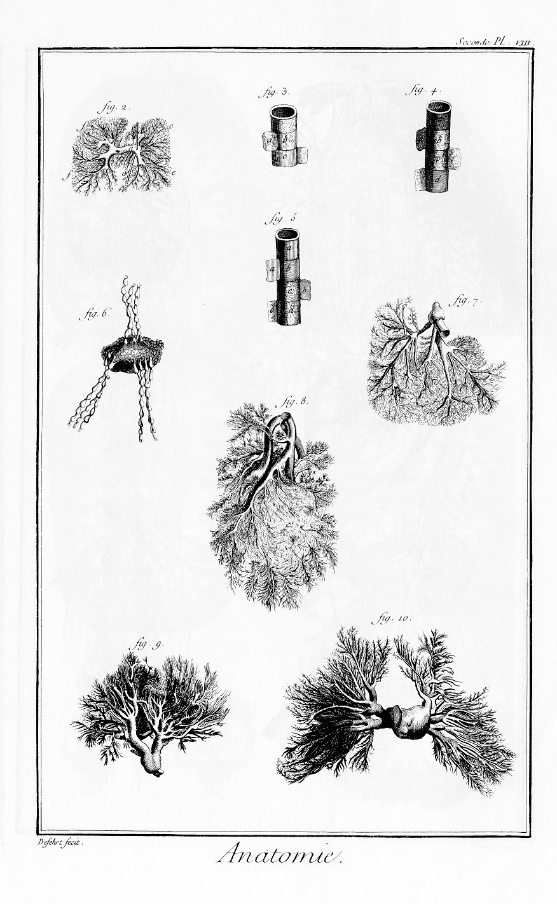](Planche_08-2.jpeg)

2. Ramifications de la veine porte dans le foie.
	- a, partie de la veine porte qui entre dans le foie.
	- c, la veine ombilicale, qui dans l'adulte forme une espece de ligament.
	- d, le canal veineux qui dégénere aussi en ligament.
	- e, l'extrémité des veines capillaires qui se terminent dans le foie.
	- f, l'extrémité des veines qui viennent des intestins, & forment le tronc de la veine porte.

3. Membranes de la trachée-artere séparées les unes des autres.
	- a, la membrane glanduleuse.
	- b, la vasculeuse.
	- c, la membrane interne.

4. Tronc d'une grosse veine disséqué.
	- a a, la membrane externe ou la nerveuse.
	- b, la vasculeuse.
	- c, la glanduleuse.
	- d, la musculaire.

5. Une partie de l'aorte tournée de dedans en-dehors.
	- a a, la membrane interne ou la nerveuse.
	- b b, la musculaire.
	- c c, la glanduleuse.
	- d, la membrane externe ou la vasculaire.

6. Vaisseaux lymphatiques.

7. Ramifications de la veine cave dans le foie.

8. de Ruisch. Parties des arteres distribuées dans le placenta.

9. L'artere pulmonaire.

10. Tronc de la veine pulmonaire.

PLANCHE IX.
-----------

[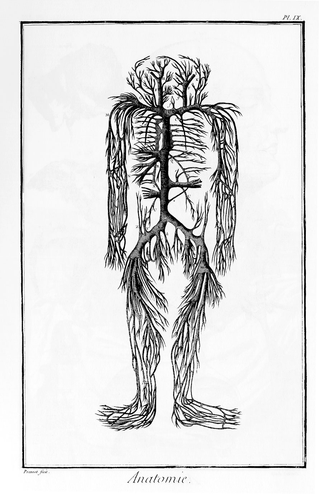](Planche_09.jpeg)

Les troncs de la veine cave avec leurs branches disséquées dans un corps adulte, &c. d'après les Transactions Philosophiques.

1. 
	- A A, l'orifice de la veine cave, comme elle paroît lorsqu'elle est séparée de l'oreillette droite du coeur.
	- a, l'orifice de la veine coronaire du coeur.
	- B A, le tronc supérieur ou descendant de la veine cave.
	- C C A, le tronc inférieur ou ascendant, ainsi nommé du mouvement du sang dans ces troncs, D D, les veines soûclavieres.
	- +, la partie de la veine gauche, qui reçoit le canal thorachique.
	- b, la veine soûclaviere azigos, dont les branches aboutissent aux côtes.
	- d d, les veines mammaires internes.
	- E E, les branches iliaques droites & gauches.
	- F F, les veines jugulaires internes.
	- G G, les jugulaires externes.
	- H H, les veines qui ramenent le sang de la mâchoire inférieure & de ses muscles.
	- I I, les troncs des jugulaires internes coupés à la base du cerveau.
	- f, les veines du thymus & du médiastin.
	- g g, les veines des glandes thyroïdales.
	- h, la veine sacrée.
	- i, la branche iliaque interne.
	- k, l'externe.
	- K K, les veines occipitales.
	- L, la veine droite axillaire.
	- M, la céphalique.
	- N, la basilique.
	- O, la veine médiane.
	- P, le tronc des veines du foie.
	- Q, la veine phrénique du côté gauche.
	- R, la veine phrénique droite.
	- r, grande veine de la glande rénale gauche & des parties adjacentes.
	- S, la veine émulgente gauche.
	- T, la veine émulgente droite qui dans ce sujet est beaucoup plus basse que la gauche contre l'ordinaire.
	- U U, les deux veines spermatiques.
	- X X, deux branches qui communiquent du tronc ascendant de la veine cave à la veine azigos, par le moyen desquelles le vent passe dans le tronc descendant de la cave, lorsqu'on souffle dans l'ascendante aux points A P C; quoique le tronc aux points A P & C soit fortement attaché au chalumeau.
	- *, branche non commune entre le tronc le plus bas de la veine cave, & la veine émulgente gauche.
	- Y, veine qui ramene le sang des muscles du bas-ventre à la branche iliaque externe.
	- Z, la veine épigastrique du côté droit.
	- l l, la veine saphene.
	- m, la veine crurale.

PLANCHE IX. n°. 2. Les troncs de la veine porte disséqués & développés.
-----------------------------------------------------------------------

[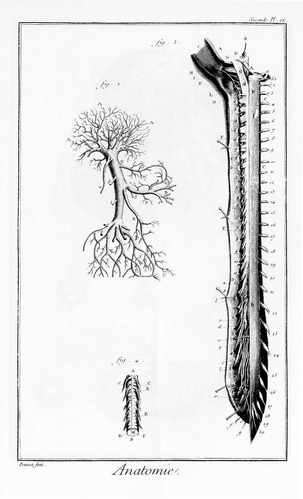](Planche_09-2.jpeg)

2.
	- A A A, les branches de la veine porte séparée du foie.
	- a, la veine ombilicale.
	- B, la branche splénique.
	- C C, les branches mésentériques continuées depuis les intestins.
	- b, le tronc de la veine pancréatique qui reçoit les branches qui viennent du duodénum.
	- c c, la veine gastrique coronaire supérieure.
	- D, la veine coronaire supérieure de l'estomac du côté gauche.
	- E, la veine coronaire inférieure.
		- 1, la veine épiploïque supérieure droite.
		- 2, la gauche, avec 3 sa médiane.
	- F, la gastro-épiploïque.
	- G, les veines appellées vasa brevia.
	- H, la veine hémorroïdale, qui vient du rectum & de l'anus.

3. La moëlle épiniere à gauche, d'après Huber.
	- A, la partie antérieure de la premiere vertebre du col, élevée un peu obliquement en-haut.
	- a, apophyse oblique supérieure de cette vertebre.
	- b, son apophyse transverse.
	- B B, production de la dure-mere, qui enveloppe la moëlle épiniere.
	- C C, l'intervalle qui reste entre cette moëlle & la cavité des vertebres qui la renferme.
	- 1, 2, 3, 4, &c. jusqu'à 30, les nerfs de la moëlle épiniere du côté gauche, avec leur ganglion.
	- Cette figure représente à droite:
	- A, espace occupé par le lobe renversé du cervelet & par son appendice uniforme B figuré simplement.
	- C, portion de l'os pierreux & de l'occipital, recouverts de la dure-mere.
	- D, une partie de la moëlle allongée, à laquelle la moëlle épiniere est continue. - a, ligne blanche médullaire qui s'éleve du sillon du quatrieme ventricule, pour se joindre à la septieme paire.
	- b, le quatrieme ventricule.
	- c, sa rainure longitudinale continue en calamus scriptorius.
	- d, éminence de la moëlle épiniere qui la termine.
	- e e, ligament de la pie-mere, qui s'étend au milieu de la queue du cheval.
	- f, le ganglion de la vingt-neuvieme paire de nerfs.
	- g, le ganglion de la trentieme.
	- F F, la dure-mere renversée de dessus la moëlle épiniere.
	- G, le nerf de la septieme paire.
	- H, la huitieme paire.
	- I, l'accessoire de la huitieme paire.
	- K, filets de communication des nerfs cervicaux entre eux.
	- L, le ligament denticulaire qui séparé les filets qui partent de la partie antérieure de l'épine, de ceux qui partent de la postérieure.
	- M, lien des corps pyramidaux postérieurs.
	- N, les corps olivaires postérieurs. O, l'artere vertébrale.
	- m m, filamens qui partent de la partie antérieure de l'épine, pour s'unir avec ceux qui partent de la postérieure.
	- n, l'endroit où les filamens nerveux commencent à concourir & à former la base de la queue du cheval.
	- o, endroit où la moëlle épiniere ne fournit plus de filets nerveux.
	- p, origine des filets nerveux qui forment la queue du cheval.
	- q q, la queue du cheval.
	- 1, C jusqu'à 8, C, les nerfs cervicaux.
	- 1, D jusqu'à 12, D, les nerfs dorsaux.
	- 1, L jusqu'à 5, L, les nerfs lombaires.
	- 1, S jusqu'à 5, S, les nerfs sacrés.

4. Une portion de la moëlle épiniere de la partie supérieure du dos, & considérée en-dedans.
	- A, le ligament de la pie-mere qui sépare la moëlle en partie droite & en partie gauche.
	- B B, éminences qui ont la figure d'un ver à soie.
	- C C, les filets nerveux qui partent de la partie antérieure de la moëlle épiniere.
	- D, coupe horisontale de la moëlle épiniere.
	- E, substance blanche qui environne
	- F la substance cendrée.

PLANCHE X. Neuvrologie d'après Vieussens.
-----------------------------------------

[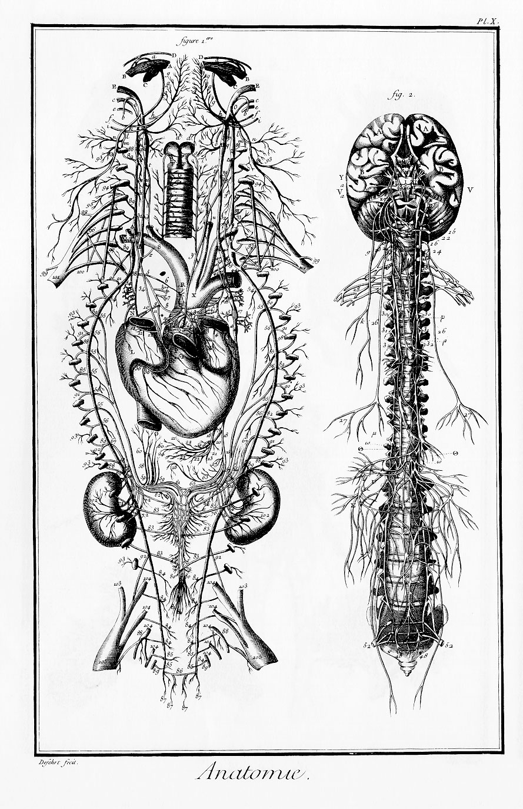](Planche_10.jpeg)

1.
	- A, le tronc de la cinquieme paire.
	- B, la grosse branche antérieure de la cinquieme paire.
	- C, la grosse branche postérieure de la cinquieme paire.
	- D, le tronc de la sixieme paire.
	- a a, le tronc du nerf intercostal.
	- E, le tronc de la huitieme paire.
	- b, le nerf spinal, l'accessoire de la huitieme paire, qui à sa sortie du crâne est environné avec la huitieme paire par une membrane commune ; d'où il lui paroît uni : mais peu après il s'en sépare en o o o.
	- c, la neuvieme paire.
	- d, filets de la neuvieme paire qui se jettent dans les glandes de la partie postérieure des mâchoires.
	- e, la dixieme paire.
	- f, rameau de la cinquieme paire, lequel va à la langue, excepté les rameaux g, g, g, qui se distribuent aux glandes maxillaires.
	- h, filet de la portion dure du nerf auditif, lequel se joint au rameau f de la cinquieme paire, & se distribue avec lui à la langue.
	- i, la premiere paire des nerfs cervicaux.
	- k, filets de la premiere paire cervicale qui s'unit au rameau f. de la cinquieme paire, & se distribue avec lui à la langue.
	- l, petit rameau de la premiere paire cervicale, dont un filet m s'insere dans la seconde paire cervicale, & le filet n se jette dans les muscles obliques de la tête.
	- o, rameau de communication entre la huitieme paire & la portion dure du nerf auditif.
	- p, rameau de la huitieme paire, dont un filet q s'unit au plexus ganglioforme cervical supérieur du nerf intercostal, & se jette ensuite dans le muscle long du cou : le filet r se distribue à quelques muscles du larynx, du pharynx & de l'os hyoïde.
	- s, filet du rameau p, un peu plus gros qu'il n'est naturellement, & qui s'unit au nerf recurrent.
	- F F, le cartilage thyroïde.
	- G G, la trachée-artere coupée transversalement un peu au-dessus des poumons.
	- H, le plexus ganglioforme cervical de la neuvieme paire, auquel la premiere paire cervicale jette un filet.
	- +, rameau de la huitieme paire, dont les filets coupés u u s'unissent avec la seconde paire cervicale, & se distribuent aux muscles scalene, mastoïdien, coracohyoïdien, sternothyroïdien, sternohyoïdien, &c.
	- 1, plexus ganglioforme thorachique de la huitieme paire.
	- x, nerf recurrent droit.
	- y, rameau de la huitieme paire du côté gauche, qui jette le nerf recurrent, & outre cela le rameau z au plexus cardiaque, le filet 2 au coeur & à l'oreillette gauche.
	- 3, filet du nerf 2 qui se distribue antérieurement au coeur du côté gauche.
	- 4, autre filet qui se distribue à l'oreillette gauche.
	- 5, rameau de la huitieme paire du côté droit, qui jette le filet 6 aux membranes de l'aorte.
	- 7, 7, rameaux coupés du nerf 5, qui se distribuent aux lobes du poumon.
	- 8, filet du nerf 5 qui s'unit au plexus cardiaque supérieur.
	- 9, tronc du rameau 5, dont le rameau 10 se jette à la partie droite du péricarde qui recouvre postérieurement le coeur ; le rameau 11 environne en forme d'anneau la veine cave descendante, où elle s'ouvre dans la partie supérieure de l'oreillette droite du coeur, après avoir jetté les rameaux 12, 12, 12, à cette oreillette.
	- 13, 13, rameaux de la huitieme paire, dont les filets qui sont représentés coupés s'entrelacent ensemble pour former les plexus pulmonaires.
	- 14, filet de la huitieme paire droite qui se distribue à l'oreillette droite.
	- 15, 15, 15, rameaux du nerf gauche de la huitieme paire, qui se distribuent en partie aux membranes de l'oesophage, & en partie au coeur.
	- 16, 16, deux petits plexus ganglioformes qui s'observent quelquefois dans le nerf gauche de la huitieme paire.
	- 17, division du nerf gauche de la huitieme paire en trois rameaux, qui se réunissent ensuite pour former un même tronc.
	- 18, 18, nerfs de la huitieme paire, qui s'élevent de la région postérieure du coeur, & communiquent ensemble au moyen du petit rameau 19.
	- 20, filets de la huitieme paire qui se distribuent à l'orifice supérieur de l'estomac.
	- 21, 21, trois petits rameaux qui communiquent ensemble, & qui après avoir jetté les filets 22, 22, 22, &c. à la partie supérieure & postérieure de l'estomac au-dessus du pylore, se joignent à quel-ques filets du plexus ganglioforme sémi-lunaire, & forment avec eux le plexus hépatique 60, 60.
	- 23, petit rameau de la huitieme paire dont les filets se distribuent à la partie supérieure & antérieure de l'estomac, si on en excepte le filet 24 qui se jette en partie au pylore, en partie au pancréas, & en partie aux conduits biliaires.
	- 25, tronc de la huitieme paire du côté gauche, un peu plus petit qu'il n'est naturellement, qui se divise au-dessous du diaphragme en plusieurs rameaux, & s'unissant aux filets 26, qui proviennent du plexus sémi-lunaire, forme avec ces filets le plexus stomachique, & se termine dans le plexus mésentérique.
	- 27, rameau de la huitieme paire gauche, que nous avons appellé rameau intérieur, & qui se distribue à la partie inférieure de l'estomac, si on en excepte les filets 28, qui se distribuent au pylore.
	- K, partie antérieure du coeur dépouillée du péricarde & des vaisseaux sanguins.
	- L, l'oreillette droite.
	- M, l'oreillette gauche.
	- N, la veine cave descendante coupée le long de l'oreillette droite.
	- O, la veine cave ascendante coupée un peu au-dessus du diaphragme.
	- Q Q, le tronc de l'aorte divisée en deux parties qui sont représentées un peu éloignées l'une de l'autre, pour faire paroître le plexus cardiaque supérieur placé entre l'aorte & la trachée-artere.
	- R, rameau droit du tronc de l'aorte ascendante.
	- S, origine de la carotide droite coupée.
	- T, origine de l'artere vertébrale droite coupée.
	- V, artere axillaire droite coupée.
	- X, rameau gauche du tronc ascendant de l'aorte, qui se divise d'abord en deux petits rameaux dont l'intérieur & le plus petit Y forme la carotide gauche : l'extérieur plus gros se termine dans l'artere vertébrale gauche Z, & dans l'artere axillaire gauche, &c. +, tronc descendant de l'aorte coupé.
	- , plexus ganglioforme cervical supérieur du nerf intercostal.
	- Δ, filet qui s'éleve du plexus ganglioforme supérieur du nerf intercostal, qui au moyen des deux rameaux 29, 29, communique avec le nerf gauche de la huitieme paire, & qui se portant en bas se distribue à la partie antérieure du péricarde. 30, filet Δ coupé à la base du coeur.
	- 31, 31, 31, filets du nerf intercostal qui se jettent dans le muscle long du cou & dans le scalene.
	- 32, rameau du nerf intercostal qui s'insere dans le plexus ganglioforme thorachique.
	- 33, filet du nerf intercostal qui environne la veine jugulaire externe, & se termine dans les membranes voisines.
	- Δ, plexus ganglioforme cervical inférieur du nerf intercostal.
	- 34, rameau du plexus ganglioforme cervical inférieur du nerf intercostal droit, qui se porte en-bas, perce le péricarde, & après l'avoir percé & avoir recû un filet du plexus cardiaque supérieur, jette le filet 35 aux membranes de l'aorte : enfin après avoir passé par-dessus le tronc de l'artere pulmonaire, se divise 36, 36, &c. & se distribue à la partie antérieure du coeur.
	- 37, plexus ganglioforme thorachique du nerf intercostal.
	- 38, filet provenant du plexus ganglioforme thorachique, qui s'unit à la huitieme paire du côté droit.
	- 39, 39, deux rameaux provenans de la partie inférieure du plexus ganglioforme thorachique du nerf intercostal gauche, dont le supérieur jette trois filets, dont deux supérieurs 40, 40, coupés, se distribuent à l'oesophage & à la trachée-artere ; le troisieme 42 s'unit à la huitieme paire gauche : le rameau inférieur 39 jette à l'oesophage le filet 41 ici coupé: enfin les deux rameaux 39, 39, après avoir jetté les filets ci dessus, se portent vers la partie moyenne de la poitrine ; & lorsqu'ils sont parvenus vers la partie postérieure de l'aorte, ils se divisent en plusieurs rameaux qui communiquent tous ensemble, & forment en s'unissant à quelques filets de la huitieme paire le grand plexus 42.
	- 43, plexus cardiaque supérieur, plus considérable que l'inférieur.
	- 44, 44, filets provenans des parties latérales du plexus cardiaque supérieur, qui se distribuent aux parties internes des lobes du poumon & aux glandes qui sont placées à la partie supérieure de ces lobes derriere la trachée-artere.
	- 45, 45, filets du plexus cardiaque supérieur, qui sont représentés coupés comme les filets 44, 44, & qui se distribuent au péricarde.
	- *, petit nerf du côté droit du plexus cardiaque supérieur qui s'unit au rameau 34, & se distribue avec lui à la partie antérieure du coeur.
	- 46, filet provenant du côté gauche du plexus cardiaque supérieur qui s'unit au filet 2 du rameau 4.
	- 47, filets du nerf cardiaque supérieur, qui se distribuent aux membranes de l'aorte.
	- 48, rameaux de la partie inférieure du plexus cardiaque supérieur, qui se distribuent à la partie postérieure du péricarde & du coeur.
	- 49, deux rameaux de la partie inférieure du plexus cardiaque supérieur qui s'unissent ensemble, jettent le filet 50 aux membranes de l'aorte, forment le plexus cardiaque inférieur 51, & enfin lient par leur extrémité 52 l'artere pulmonaire, & se contournent autour d'elle en forme d'anneau.
	- 53, petit rameau du plexus cardiaque qui se distribue à l'oreillette gauche du coeur, & s'unit au rameau 4 du nerf 2.
	- 54, 54, filets provenans du côté droit du nerf intercostal, & qui se distribuent dans les membranes des vertebres du dos, 55, 55, 55, les filets qui sortent du côté droit du nerf intercostal, & se terminent de part & d'autre dans le plexus ganglioforme sémi-lunaire 57.
	- 56, 56, 56, filets du nerf intercostal qui se terminent avec les filets 54, 54, dans les membranes qui tapissent les vertebres du dos.
	- 57, plexus ganglioforme sémi-lunaire du nerf intercostal.
	- 58, petit rameau du plexus ganglioforme sémi-lunaire, qui s'élevant en haut se-termine en partie dans la substance charnue du diaphragme, & en partie dans le centre nerveux de ce muscle.
	- 59, 59, filets de la partie supérieure du plexus ganglioforme sémi-lunaire du nerf intercostal droit, qui se distribuent aux vaisseaux cholédoques, au pylore, à l'intestin duodénum, & au pancréas ; les trois supérieurs s'unissant ensemble, se terminent dans le plexus hépatique.
	- 60, 60, plexus hépatique produit par le nerf intercostal droit, & par le nerf de la huitieme paire.
	- 61, 61, filets de la partie inférieure du plexus ganglioforme sémi-lunaire du nerf intercostal droit, qui se terminent dans les plexus mésentériques.
	- 62, filets qui se répandent sur les membranes qui revêtent les vertebres.
	- 63, plexus stomachique formé par quelques fibres du nerf droit de la huitieme paire, & par d'autres qui proviennent du plexus ganglioforme sémi-lunaire du nerf intercostal gauche.
	- 64, rameaux du plexus ganglioforme sémi-lunaire du nerf intercostal gauche, qui se réfléchissant en-haut & communiquant ensemble, forment un plexus nerveux lunaire.
	- 65, filets du plexus stomachique qui se terminent dans les plexus mésentériques.
	- 66, 66, 66, filets qui se terminent dans les membranes couchées sur les vertebres.
	- 67, rameau du côté interne du nerf intercostal, qui forme le plexus rénal droit du côté droit, & se termine du côté gauche dans le plexus sémi-lunaire.
	- 68, filet du rameau droit 67, qui se termine dans les membranes du rein droit. 
	- 69, tronc du rameau droit 67, qui s'unissant aux filets inférieurs des nerfs 55, 55, &c. du côté droit, forme avec eux une espece de réseau, & enfin le plexus rénal 70, 70.
	- 70, 70, le plexus rénal droit.
	- 71, filets intérieurs des nerfs 55, 55, &c. du côté droit, qui se terminent dans les membranes du rein droit, excepté les filets
	- 72, 72, qui se terminent avec d'autres rameaux voisins dans les membranes du rein.
	- 73, deux filets du rameau droit 67, qui se distribuent dans les membranes qui recouvrent le rein droit.
	- 74, 74, le plexus renal gauche, formé par trois rameaux du plexus ganglioforme sémi-lunaire gauche.
	- 75, petit rameau du plexus ganglioforme sémi-lunaire gauche qui se distribuent dans les membranes du rein gauche, excepte les filets
	- 76, 76, qui se terminent avec quelques rameaux voisins dans les membranes du rein gauche.
	- 77, 77, le plexus mésentérique supérieur.
	- 78, 78, le plexus mésentérique moyen.
	- 79, 79, le plexus mésentérique inférieur.
	- 80, 80, filets supérieurs du plexus mésentérique inférieur, qui se distribuent dans les membranes qui recouvrent les vertebres lombaires inférieures.
	- 81, 81, les filets inférieurs du plexus mésentérique inférieur, qui se terminent dans les membranes des vertebres de l'os sacrum, de l'intestin rectum, de la vessie, dans les ovaires & à la matrice.
	- 82, 82, &c. plexus ganglioformes ordéiformes du nerf intercostal dans la cavité du bas-ventre.
	- 83, 83, filets du nerf intercostal qui s'unissent au nerf mésentérique.
	- 84, 84, filets du nerf intercostal qui se distribuent avec les filets
	- 85, 85, &c. &
	- 87, 87, &c. aux ureteres, à l'intestin rectum, aux releveurs de l'anus, aux ovaires, à la matrice, à la vessie, à son sphincter, aux vésicules séminaires, aux prostates, & au sphincter de l'anus.
	- 86, rameau au moyen duquel les nerfs inter-costaux communiquent ensemble vers l'extrémité de l'os sacrum. 
	- 88, 88, plexus ganglioformes des nerfs vertébraux qui ne s'observent point dans la premiere, dans la vingt-huitieme, la vingt-neuvieme & la trentieme paires de ces nerfs.
	- 89, 89, rameaux que les nerfs des vertebres fournissent vers les espaces qui sont entre elles au nerf intercostal.
	- 90, nerf coupé.
	- 91, 91, &c. rameaux du nerf intercostal aux nerfs dorsaux droits.
	- 92, gros rameau du nerf intercostal qui s'unit au premier nerf sacré, & se termine avec lui dans le nerf crural postérieur.
	- 93, 93, filets des nerfs vertébraux.
	- 94, nerf diaphragmatique qui vient de la quatrieme paire des nerfs cervicaux.
	- 95, filet du nerf diaphragmatique qui se distribue aux muscles du cou, c'est-à dire au transverse & à l'épineux.
	- 96, filets de la sixieme paire cervicale qui s'unit au nerf diaphragmatique.
	- 97, filet du nerf diaphragmatique qui s'unit à un filet de la seconde paire dorsale, & ensuite au nerf intercostal.
	- 98, le nerf diaphragmatique coupé.
	- 99, distribution des nerfs brachiaux.
	- 100, nerf coupé composé de deux filets, l'un de la sixieme & l'autre de la septieme paires cervicales.
	- 101, la gaine commune des nerfs brachiaux ouverte.
	- 102, le rein un peu plus élevé du côté gauche que du droit.
	- 103, production considérable de la paire lombaire inférieure qui s'unit à la premiere sacrée, & aide à former le nerf crural postérieur.
	- 104, 104, &c. les cinq nerfs de l'os sacrum.
	- 105, le nerf crural postérieur coupé.

2. d'après Eustachi.
	- A A, B B, le cerveau vû par la partie inférieure.
	- A A, les lobes antérieurs.
	- B B, les lobes moyens.
	- C C, le cervelet.
	- D D, les extrémités des apophyses transverses de l'atlas.
	- E E, les bords relevés des cavités de l'atlas, qui recouvrent & soutiennent les condyles de l'occipital.
	- F, F, les cuisses ou pédoncules du cervelet, qui s'avancent pour former la protubérance annulaire.
	- G, G, les corps pyramidaux.
	- H, H, les corps olivaires.
	- I, I, I, la protubérance annulaire.
	- K, K, les cuisses de la moëlle allongée.
	- L, sinus entre la protubérance annulaire, les cuisses de la moëlle allongée, & les éminences orbiculaires.
	- M, les éminences orbiculaires.
	- N, le corps cendré, placé dans l'angle postérieur de la continuité des nerfs optiques, entre les cuisses de la moëlle allongée. C'est dans ce corps que se trouve l'orifice inférieur du troisieme ventricule du cerveau, d'où provient l'entonnoir.
	- O, O, les procés mamillaires, ou la premiere paire de nerfs.
	- P, P, les nerfs optiques.
	- Q, leur continuité.
	- R, R, ces nerfs avant leur union.
	- S, S, la troisieme paire de nerfs, ou les moteurs, qui viennent de la partie antérieure de la protubérance annulaire.
	- T, T, la quatrieme paire de nerfs nommés les pathétiques.
	- V, V, la cinquieme paire de nerfs venant des parties latérales de la protubérance annulaire.
	- W, X, Y, ses trois branches ; W, la premiere, X, la seconde, Y, la troisieme.
	- Z, la sixieme paire de nerfs, qui vient de la partie antérieure des éminences olivaires & pyramidales.
	- a, a, la portion dure de la septieme paire de nerfs, qui sort de la partie antérieure du côté extérieur des corps olivaires.
	- b, b, la portion molle, qui vient des parties latérales des corps olivaires.
	- c, c, paroît être le limaçon dans lequel la portion molle se distribue.
	- d, d, la huitiéme paire de nerfs, qui vient de la partie latérale & postérieure des corps olivaires.
	- e, e, les nerfs recurrens de l'épine, qui se joignent à la huitieme paire, ou l'accessoire de Willis.
	- f, f, les troncs de la huitieme paire, réunis avec les nerfs recurrens.
	- g, g, les nerfs recurrens, lorsqu'ils ont quitté la huitieme paire.
	- h, un rameau de l'accessoire, qui se distribue au muscle clino-mastoïdien & au sterno-mastoïdien.
	- i, un autre rameau, qui s'unit avec la troisieme paire cervicale.
	- k, la fin de ce nerf, qui se perd dans le trapeze.
	- l, l, l, les troncs de la huitieme paire des nerfs.
	- m, m, les rameaux de la huitieme paire, qui vont à la langue, sur-tout à sa racine & à la partie voisine du pharynx, &c.
	- n, n, les rameaux de la huitieme paire, qui se distribuent à la partie supérieure du larynx, dans lequel ils s'insinuent entre l'os hyoïde & le cartilage thyroïde, où le rameau o s'unit avec le recurrent de la huitieme paire.
	- p, le recurrent droit de la huitieme paire, qui vient de deux endroits de la huitieme paire.
	- q, le recurrent droit joint avec le nerf intercostal droit.
	- r, le recurrent gauche, qui sort de la huitieme paire par deux principes, mais un peu plus bas que le droit.
	- s, le nerf par le moyen duquel le cardiaque gauche est uni avec le recurrent gauche.
	- t, les ramifications des nerfs recurrens dans le larynx, & qui se distribuent à la glande thyroïde, au pharynx, aux crico-arythénoïdiens postérieurs, aux arythénoïdiens, aux thyro-arythénoïdiens.
	- u w x, le nerf cardiaque droit, qui vient w du nerf recurrent droit, & x de la huitieme paire.
	- y z a, le nerf cardiaque gauche, qui vient z du nerf gauche de la huitieme paire, & a du nerf intercostal gauche', comme il semble par la figure.
	- β, nerf de communication entre les cardiaques.
	- γ, les ramifications des nerfs cardiaques, qui se distribuent dans le coeur.
	- δ, δ, δ, les nerfs du poumon, qui viennent de la huitieme paire du cerveau.
	- εζ, εζ, division de la huitieme paire en deux rameaux, qui se réunissent ensuite & forment ainsi une petite île dont la droite est plus grande que la gauche.
	- η, η, η, rameaux, au moyen desquels les troncs de la huitieme paire sont unis ensemble devant & derriere l'estomac.
	- θ, rameau du tronc gauche de la huitieme paire, qui parcourt la partie supérieure de l'estomac jusqu'au pylore.
	- ι, tronc gauche de la huitieme, lequel se distribue à la portion gauche de l'estomac.
	- κ, rameaux du tronc droit de la huitieme paire, lesquels se distribuent à la partie postérieure de l'estomac.
	- μ, le tronc droit descendant derriere l'estomac, & qui s'unit ensuite ν avec le nerf intercostal gauche.
	- ξ ξ, origine du nerf intercostal, où il est uni avec la sixieme paire.
	- ο, ο, les deux rameaux, dans lesquels les troncs des nerfs intercostaux se divisent, & qui se réunissent ensuite ; d'où il arrive qu'ils forment un intervalle par lequel passe la carotide interne, & qui est renfermé avec cette artere dans le conduit du rocher par lequel cette artere entre dans le crâne.
	- ρ, ρ, les troncs des nerfs intercostaux.
	- ς, ς, les ganglions cervicaux supérieurs des intercostaux.
	- τ, τ, τ, τ, τ, τ, les troncs des nerfs intercostaux, qui se portent le long de l'épine par le cou, par la poitrine, par le bas ventre, par le bassin. υ, υ, &c. les ganglions des nerfs intercostaux.
	- Φ, Φ, Φ, &c. rameaux par lesquels les nerfs intercostaux sont unis avec les nerfs de l'épine.
	- X X X X, l'extrémité des nerfs intercostaux, unie avec la premiere & la seconde paire sacrée.
	- ψ, ψ, ψ, ψ, rameaux des nerfs intercostaux, qui unis ensemble forment des rameaux considérables ω, ω, ω, qui se portent le long des vertebres du dos, passent à-travers le diaphragme, se mêlent & s'unissent ensuite Γ ν l'un & l'autre avec le nerf droit de la huitieme paire Δ, & le droit avec le gauche.
	- Θ, Θ, rameaux des nerfs intercostaux, lesquels s'unissent aux rameaux des troncs ω, ω. Les nerfs des reins, des capsules atrabilaires, du foie, de la rate, de l'estomac, des intestins, proviennent des troncs ω, ω, des nerfs intercostaux de la huitieme paire, de leurs rameaux & de leur union.
	- Λ, Λ, Λ, Λ, rameaux au foie, dont la plûpart se distribuent au duodenum.
	- Ξ, Ξ, nerf gastro-épiploïque droit, qui va à droite le long du fond de l'estomac, où l'épiploon lui est adhérant ; il jette des rameaux Π Π Π à l'estomac, Σ Σ Σ à l'épiploon.
	- υ υ υ, nerf au rein droit & à la capsule atrabilaire droite.
	- Φ Φ, paroissent être des rameaux à la rate.
	- Ψ, nerf gastro-épiploïque gauche, qui se jette sur la portion gauche du fond de l'estomac, où l'épiploon est attaché, & jette à l'estomac des rameaux Ω Ω, Ι, Ι, &c. à l'épiploon.
	- 2, 2, 2, paroissent être des rameaux au rein gauche & à la capsule atrabilaire.
	- 3, 3, 3, 3, rameaux qui se rendent au testicule de compagnie avec les arteres spermatiques.
	- 4, 4, 4, &c. paroissent être des rameaux qui se jettent dans le mesentere & aux intestins. 
	- 5, 5, 5, &c. rameaux qui s'unissent ensemble çà & là le long des corps des vertebres, des lombes & de l'os sacrum, & se jettent au fond du bassin, où ils s'unissent 6 avec la troisieme paire sacrée, & 7 avec la quatrieme paire.
	- 8, 8, 8, &c. rameaux que les rameaux 5, 5, reçoivent des troncs intercostaux.
	- 9, 9, 9, &c. paroissent être des rameaux au mesocolon & à la partie gauche du colon.
	- 10, 10, 10, &c. la neuvieme paire appellée nerfs lingaux, & qui sort de la partie latérale des corps pyramidaux.
	- 11, rameaux de la neuvieme paire, qui se distribuent au digastrique, à l'hyoglosse, au génioglosse, à la langue, &c.
	- 12, 12, gros rameau de la neuvieme paire, qui se porte le long du cou, & se distribue au sterno-thyroïdien, au coraco-hyoïdien, au sterno-hyoïdien, &c.
	- 13, rameau d'union de la seconde paire cervicale avec le rameau 12 de l'intercostal.
	- 14, 14, &c. nerfs cervicaux.
	- 14, 14, les seconds.
	- 15, 15, les troisiemes.
	- 16, 16, les quatriemes.
	- 17, 17, les cinquiemes.
	- 18, 18, les sixiemes.
	- 19, 19, les septiemes.
	- 20, 20, les huitiemes.
	- 21, rameau d'union entre la seconde & la troisieme paire cervicale.
	- 22, 22, rameau d'union entre la 3e & la 4e paires cervicales.
	- 23, rameau de la 4e paire cervicale, qui se joint au recurrent de l'épine.
	- 24, 25, 24, 25, origine des nerfs diaphragmatiques, 24 de la quatrieme paire cervicale, 25 de la cinquieme paire.
	- 26, 26, nerfs diaphragmatiques, dont le droit descend plus directement, parce qu'il n'en est point empêché par le coeur ; le gauche descend obliquement, à cause de la situation oblique du coeur du côté gauche.
	- 27, 27, rameaux des nerfs diaphragmatiques dans le diaphragme.
	- 28, 28, union des quatre paires des nerfs cervicaux inférieurs, & de la premiere dorsale, qui forment les nerfs du bras.
	- 29, 30, 31, 32, 33, 34 &c. 39, les nerfs dorsaux.
	- 40 &c. 44, les nerfs lombaires.
	- 45 &c. 48, les nerfs sacrés.
	- 50, 51, les nerfs 50, 50, qui proviennent des dernieres paires lombaires, 51, 51 de la quatrieme paire, qui unis ensemble se joignent aux premieres paires sacrées 3 du côté droit, 2 du côté gauche, pour former les nerfs sciatiques.
	- 52, 52, les nerfs sciatiques.

PLANCHES XI. & XII.
-------------------

[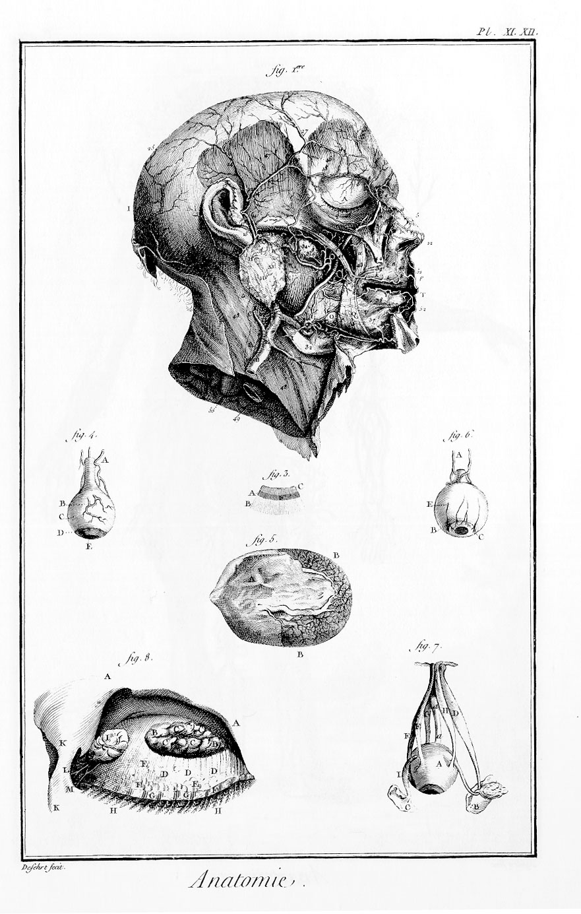](Planche_11_&_12.jpeg)

1. Les arteres de la face d'après Haller.
	- A, le tronc commun de la carotide.
	- B, la veine jugalaire commune.
	- C, la carotide interne.
	- D, la carotide externe.
	- E, l'artere thyroïdienne supérieure.
	- F, l'artere linguale couverte par les veines & par le ceratoglosse.
	- G, l'origine de l'artere labiale, pareillement couverte.
	- r r, les rameaux ptérigoïdiens.
	- Θ, un rameau au dos de la langue.
	- H, le tronc de la carotide externe dans la parotide.
	- I, l'artere occipitale couverte par la parotide & par les muscles.
	- K, l'artere pharingée cachée.
	- L, rameau superficiel de l'artere labiale.
	- M, l'artere soûmentoniere.
	- N, rameaux superficiels de la labiale.
	- O, l'artere musculaire de la levre inférieure.
	- p, anastomose avec la maxillaire interne.
	- Q, la maxillaire inférieure couverte par les muscles, & qui sort par un trou.
	- R, les rameaux de cette artere, qui se jettent au quarré & à la levre inférieure.
	- S, anastomose avec la soûmentoniere.
	- T, anastomose avec la coronaire de la levre inférieure.
	- V, les rameaux de l'artere labiale inférieure, anastomosés avec la coronaire labiale inférieure.
	- Y, la coronaire de la levre inférieure.
	- Z, un de ses rameaux au masseter & au buccinateur.
	- a, un rameau à la peau.
	- b, au triangulaire & à l'angle des levres.
	- c, un rameau de la carotide externe à la parotide.
	- d, la transversale de la face qui sort de la temporale.
	- e, rameau à la temporale & à l'orbiculaire des paupieres.
	- f, rameau alvéolaire qui accompagne le buccinateur, & qui est à-peine apparent.
	- g, rameau au zigomatique, à la partie supérieure de la parotide, à l'orbiculaire inférieure, à la peau.
	- h, rameau au buccinateur.
	- i, à l'angle des levres.
	- k k, la coronaire labiale supérieure.
	- l, la nasale latérale qui en part.
	- m, son anastomose avec l'ophtalmique.
	- n, une autre nasale dont deux rameaux.
	- o, une autre à la cloison des narines.
	- p, la coronaire de la levre supérieure du côté droit, & l'anastomose avec la gauche.
	- q, rameau au muscle zygomatique & vers l'arcade zygomatique.
	- t, le profond, qui s'anastomose d'un côté avec un compagnon du buccinateur, & de l'autre, avec le sous- orbitaire.
	- u, cette anastomose.
	- x, la place du tronc sous-orbitaire couvert par les muscles.
	- y, les anastomoses de ce rameau sous-orbitaire avec le rameau temporal.
	- z, anastomose sous-orbitaire avec la coronaire labiale.
	- 1, rameau qui se jette au fond du nez.
	- 2, anastomose avec l'ophtalmique.
	- 3, autre anastomose.
	- γ, rameau inférieur, qui se distribue au releveur commun, & qui communique avec le rameau f.
	- 4, le rameau descendant de l'ophtalmique du releveur.
	- 5, une autre aux aîles du nez.
	- 6, tronc de l'ophtalmique qui sort de l'orbite.
	- 7, rameau à la paupiere inférieure.
	- 8, à la paupiere supérieure, au corrugateur, &c.
	- 9, à l'espace qui est entre les deux sourcils.
	- 10, cutanée.
	- 11, le dorsal du nez.
	- 12, anastomose de la coronaire avec les nasales.
	- Δ, l'artere auriculaire postérieure.
	- 13, rameau de la temporale au masseter & à la parotide.
	- 14, la temporale la plus profonde.
	- 15, la temporale.
	- 16, l'auriculaire antérieure.
	- 17, la temporale interne.
	- 18, 19, ses anastomoses avec les rameaux de l'ophtalmique.
	- 20, les rameaux qui vont au front, aux tempes, au sinciput.
	- 22, la temporale externe.
	- 23, l'auriculaire supérieure.
	- 24, les arteres sincipitales.
	- 25, anastomose avec l'occipitale.
	- 26, la veine faciale.
	- 27, la veine temporale.
	- 28, la veine faciale qui monte dans la face.
	- 29, les veines frontales.
	- Λ, la veine ophtalmique.
	- 30, le conduit de Stenon.
	- 31, le conduit de la glande accessoire.
	- 32, la glande maxillaire.
	- 33, la glande parotide.
	- 34, la compagne de la parotide.
	- 35, le muscle masseter.
	- 36, le triangulaire.
	- 37, le quarré.
	- 38, l'orbiculaire inférieur.
	- 39, l'orbiculaire supérieur.
	- 40, la nasale de la levre supérieure.
	- 41, le buccinateur.
	- 42, le zigomatique.
	- 43, le releveur commun des levres.
	- 44, le releveur commun de la levre supérieure & de l'aîle du nez.
	- 45, l'orbiculaire de la paupiere.
	- 46, le frontal.
	- 47, le temporal.
	- 48, le mastoïdien.
	- 49, coupe de la trachée-artere.
	- 50, la moëlle épiniere.
	- 51, 52, le vrai milieu de chaque levre.

PLANCHE XI. & XII. n°. 2.
-------------------------

[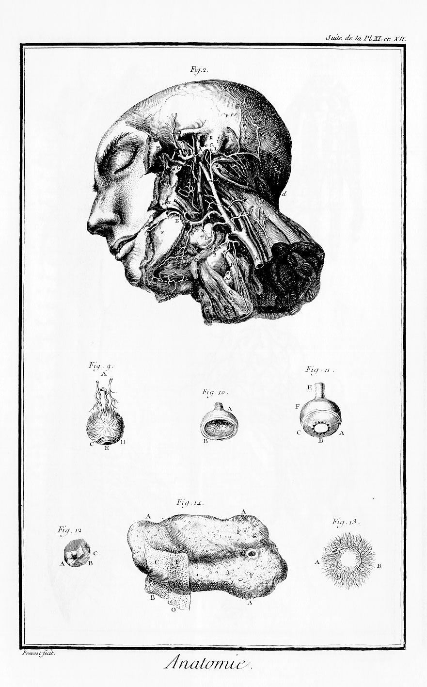](Planche_11_&_12-2.jpeg)

2. Suite des arteres de la face. Une partie de la distribution de la carotide externe d'après Haller.
	- A, le bord inférieur du cartilage thyroïde.
	- B, le bord supérieur.
	- C, l'os hyoïde.
	- D, la glande de Warthon, ou la glande maxillaire.
	- E, la glande sublinguale.
	- F, extrémité de la mâchoire inférieure, dont une des branches a été emportée.
	- G, l'aîle externe de l'apophyse ptérigoïde.
	- H, la partie antérieure de l'arcade zygomatique rompue.
	- I, la partie interne.
	- K, le conduit auditif.
	- L, l'apophyse mastoïde.
	- M, le trou par où passe la troisieme branche de la cinquieme paire N, le trou de l'artere épineuse.
	- O, la place de l'apophyse transverse de la premiere vertebre.
	- Ω, l'apophyse styloïde.
	- P, le muscle sterno-thyroïdien.
	- Q, le coraco-hyoïdien.
	- R, R, les sterno-hyoïdiens.
	- S, le mylo-hyoïdien indiqué en passant.
	- T, une partie du basioglosse, dont la plus grande partie a été détruite.
	- V, la partie du pharynx, qui descend du crochet de l'apophyse ptérigoïde.
	- X, le muscle stylo-glosse.
	- Y, le stilo-pharyngien.
	- Z, le péristaphilin externe.
	- a, le péristaphilin interne.
	- b, l'oblique supérieur, de la tête.
	- c, l'oblique inférieur.
	- Δ, le releveur de l'omoplatte.
	- d, le complexus.
	- e, le nerf de la huitieme paire.
	- f f, l'artere vertébrale, qui paroît d'abord à nud entre le grand droit & les obliques, & ensuite entre l'oblique inférieur & le releveur de l'omoplatte.
	- g, un rameau qui se distribue aux muscles obliques, au grand droit, au complexus, au petit droit.
	- h, le tronc commun de la carotide.
	- i i, la carotide interne, qui est ici un peu fléchie.
	- l, la carotide externe.
	- m, l'artere thyroïdienne supérieure.
	- n, le rameau qui se distribue aux muscles thyroïdien, cératoglosse, sterno-hyoïdien.
	- o, un rameau qui se jette dans les muscles sterno-hyoïdiens.
	- p, rameau qui descend vers le coraco-hyoïdien, le long de la peau.
	- Π, rameau qui va au crico-thyroïdien & à la glande thyroïde.
	- q, rameau de l'artere pharingée.
	- r, un rameau superficiel à la glande parotide.
	- s, le premier rameau qui va au pharynx, & qui se divise en haut & en bas.
	- t, rameau à la huitieme paire de nerfs, au ganglion intercostal, au scalene, au muscle droit interne, & ou long du cou.
	- u, le second rameau qui se distribue au pharynx.
	- *, endroit où on remarque dans différens sujets un rameau qui accompagne la jujulaire.
	- w, rameau qui se jette au droit interne, à la partie supérieure du pharynx, & qui descend.
	- y, rameau superficiel de la carotide externe.
	- z, l'artere linguale.
	- α, rameau qui se jette au cératoglosse.
	- β, le tronc profond de la linguale, ou la ranine.
	- γ, rameau superficiel ou la sublinguale.
	- δ, os mylohyoïdien.
	- ε, l'artere labiale.
	- ζ, son rameau palatin.
	- η, un grand rameau à la glande sublinguale & au mylohyoïdien, ou l'artere soûmentonniere.
	- Ξ, le rameau qui nourrit la mâchoire inférieure Κ, les rameaux de la palatine, qui se jettent aux muscles du palais.
	- λ, le profond du palais.
	- Σ, le tronc labial qui se jette à la face.
	- μ, l'artere occipitale.
	- ν, l'artere stilo-mastoïdienne.
	- ο, l'auriculaire postérieure.
	- ξ, les rameaux de l'artere splénique, qui se distribuent aux splenius.
	- π, le rameau méningé postérieur.
	- ρ, un rameau au complexus τ, le cours de la carotide, où elle commence à prendre le nom de maxillaire interne.
	- ν, l'artere temporale.
	- φ, l'artere méningée.
	- Χ, la maxillaire inférieure.
	- ψ, la temporale profonde extérieure.
	- ω, la maxillaire interne, qui côtoye la racine de l'apophyse ptérigoïde.
	- 1, l'artere temporale profonde interne.
	- 2, l'artere alvéolaire.
	- 3, la nasale & la palatine descendante, qui sont obscurément apparentes dans la fente sphénomaxillaire.

3. Le procès ciliaire vû au microscope, d'après Ruisch.
	- A, la partie tendineuse du procès ciliaire.
	- B, la partie musculeuse.
	- C, fibres circulaires du petit cercle plus sensibles qu'elles ne sont naturellement.

4. Le globe de l'oeil, & les nerfs qui s'y rendent, d'après le même.
	- A, les nerfs oculaires.
	- B B, les artérioles dispersées sur la sclérotique.
	- C, la sclérotique.
	- D, l'uvée.
	- E, la pupille.

5. La langue vûe dans sa partie inférieure, d'après le même.
	- A, tégumens membraneux de la langue.
	- B B, les arteres sublinguales.

6. La choroïde sans ses vaisseaux, d'après le même.
	- A, les nerfs, dont les dernieres ramifications se perdent dans le ligament ciliaire.
	- B, l'iris ou le lieu du ligament ciliaire, où ces rameaux se terminent.
	- C, la production de ces rameaux vers le ligament ciliaire.
	- E, l'uvée.

7. Les muscles de l'oeil presque dans leur situation naturelle, d'après Cowper.
	- A, la sclérotique.
	- B, portion supérieure de la partie osseuse de l'orbite sur laquelle on observe le petit anneau cartilagineux.
	- a a, le nerf optique.
	- C, portion inférieure de l'angle externe de l'orbite où s'insere le muscle oblique inférieur.
	- D, le grand oblique.
	- E, le superbe.
	- F, l'abducteur.
	- G, l'abaisseur.
	- H, l'adducteur.
	- I, le petit oblique.

8. La paupiere supérieure avec ses glandes & ses poils vûs à la loupe, d'après Bidloo. 
	- A A, la peau éloignée. 
	- B B, la glande supérieure.
	- C C, les petites glandes dont elle est composée.
	- D, D, les conduits de cette glande.
	- E, E, d'autres petites glandes semées sur ces conduits.
	- F, F, le tarse.
	- G, G, les membranes qui l'environnent.
	- H, H, les poils courbés en-haut.
	- I, la glande lachrymale.
	- K K, coupe des os du nez.
	- L, conduit de cette glande vers le nez.
	- M, d'autres conduits de cette glande vers la paupiere.

9. La choroïde & ses arteres, d'après Ruisch.
	- A, les arteres ciliaires.
	- C, face antérieure du ligament ciliaire.
	- D, cercle de l'iris, ou face antérieure des procès ciliaires.
	- E, la pupille.

10. d'après le même.
	- A, portion postérieure de la sclérotique.
	- B, la rétine dont toutes les arteres ne sont pas remplies.

11. L'humeur vitrée & la crystaline, d'aprês le même.
	- A, l'humeur vitrée.
	- B, le crystalin.
	- C, les procès ciliaires couverts d'une humeur noire.
	- D, les artérioles de la membrane de Ruisch.
	- E, portion du nerf optique.
	- F, portion de la sclérotique.

12. d'après le même.
	- A, la lame extérieure de la sclérotique.
	- B, la lame intérieure.
	- C, enveloppe intérieure, qu'on dit provenir de la pie-mere.

13. d'après le même.
15, les artérioles de l'iris vûes au microscope.
	- A, le grand cercle artériel de l'iris.
	- B, le petit.

14. La langue vûe dans sa face supérieure, d'après Heister.
	- A A A A, la surface supérieure de la langue, dans laquelle se voyent par-tout des papilles en forme de tête & d'autres pyramidales.
	- B, un morceau de l'enveloppe extérieure séparé du reste & renversé. On y voit un grand nombre de papilles nerveuses adhérentes à sa face interne.
	- C C, la seconde enveloppe de la langue, où le corps réticulaire de Malpighi, par les trous duquel les papilles nerveuses passent de la troisieme membrane vers la premiere.
	- O, le corps réticulaire séparé de la troisieme enveloppe de la langue, & renversé pour y faire voir les petits trous disposés en forme de réseau.
	- E E, la membrane ou le corps papillaire nerveux, dans lequel se voient les papilles nerveuses.
	- F, F, les glandes linguales & les papilles qui paroissent bien plus grosses que les antérieures.
	- G, trou qui s'observe quelquefois à la partie postérieure de la langue.

PLANCHE XIII. De l'oreille.
---------------------------

[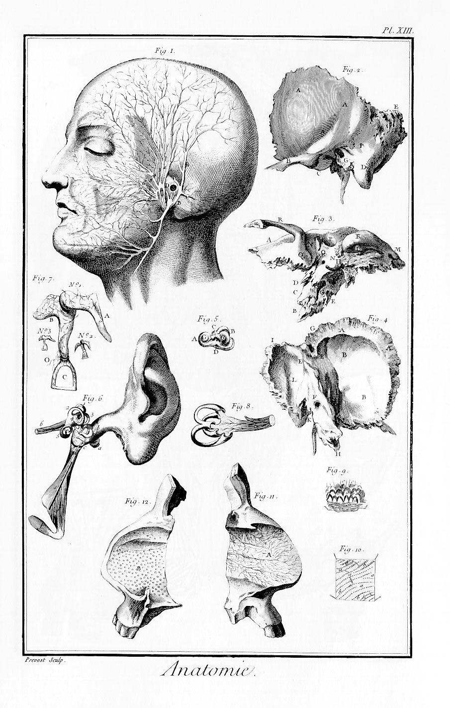](Planche_13.jpeg)

1. Distribution de la portion dure dans les différentes parties de la face, d'après Duverney.
	- A, le tronc de la portion dure à sa sortie du crâne, par le trou situé entre les apophyses stiloïdes & mastoïdes.
	- B B, le gros rameau que cette portion jette à l'oreille externe.
	- C C, le rameau inférieur qui se distribue au menton, aux muscles situés sur la mâchoire & aux tégumens.
	- D, le rameau supérieur, qui en forme de patte d'oie, se divise en plusieurs rameaux.
	- 1, 2, 3, 4, 5, les cinq rameaux de cette branche qui se distribuent aux muscles des tempes, du front & des paupieres.
	- 6, le rameau de cette branche, qui se jette au milieu des joues, & qui en se joignant à une branche de la cinquieme paire 7, devient plus gros.
	- 8, le dernier rameau de cette division, qui jette des filets au buccinateur.

2. L'os des tempes en situation, & vû à sa partie latérale externe, d'après nature.
	- A A A, partie de cet os qui forme la fosse temporale.
	- B, l'apophyse zygomatique.
	- C, l'apophyse transverse.
	- D, l'apophyse mastoïde.
	- E, l'angle lambdoïde.
	- F, le trou stylo-mastoïdien.
	- G, le trou auditif externe.

3. L'os des tempes vû dans sa partie inférieure, d'après nature.
	- A, la portion écailleuse qui forme la fosse temporale.
	- B C D E F G, le rocher.
	- B, sa pointe.
	- B C D, son angle antérieur.
	- D, l'orifice de la trompe d'Enstachi.
	- E, l'angle postérieur inférieur.
	- F, la fosse jugulaire.
	- G, le conduit de la carotide.
	- H, l'apophyse styloïde.
	- I, le trou stylo-mastoïdien.
	- K, l'apophyse mastoïde.
	- L, la rainure mastoïdienne.
	- M, l'angle lambdoïde.
	- N N O, la fosse articulaire.
	- O, sa félure.
	- P, le trou auditif externe.
	- Q, l'apophyse transverse.
	- R, l'apophyse zygomatique.

4. L'os des tempes, vû par sa face latérale interne, d'après nature.
	- A A, partie de cet os qui forme la suture écailleuse.
	- B B, face interne de la portion écailleuse.
	- D D, E E, le rocher.
	- D, sa face supérieure.
	- E E, sa face postérieure.
	- F, le trou auditif interne.
	- G H, son angle postérieur supérieur.
	- H, sa pointe.
	- I I, son angle postérieur inférieur.
	- K, la fosse jugulaire.
	- L L, la gouttiere du sinus latéral.

5. Les canaux demi-circulaires & le limaçon, d'après nature.
	- A, le limaçon.
	- B, les canaux demi-circulaires.
	- C, la fenêtre ovale.
	- D, la fenêtre ronde.

6. Les canaux demi-circulaires, le limaçon, les osselets de l'oreille, &c. en situation, d'après Valsalva.
	- a, l'extrémité de l'aqueduc de Fallope.
	- b, portion des parois du sinus mastoïdien.
	- c, muscle de la petite apophyse du marteau.
	- d, muscle de la grande apophyse du marteau.
	- e, le côté antérieur de la trompe d'Eustachi, où s'insere ce muscle.
	- f f, le péristaphylm externe.
	- g, muscle de l'étrier.
	- 1, le grand canal demi-circulaire.
	- 2, le moyen canal.
	- 3, le plus petit.
	- 4, le vestibule.
	- 5, le canal du limaçon.
	- 6, la portion molle du nerf auditif, qui se distribue au limaçon & aux canaux demi-circulaires.

7. Les osselets de l'ouie dans leur état naturel, & recouverts de leur périoste.

	- N°. 1, ces os sont représentés beaucoup plus grands qu'ils ne le sont naturellement, d'après Ruisch.
		- A, le marteau.
		- B, l'enclume.
		- C, l'étrier.
		- D, l'orbiculaire.

	- N°. 2, ces os dans leur grandeur naturelle dans les adultes.

	- N°. 3, ces os tels qu'ils s'observent dans le foetus.

8. La distribution de la portion molle dans les canaux demi-circulaires, d'après Valsalva.

9. & 10. Peau & épiderme vûs au microscope, d'après Bidloo.
	- a a, &c. les papilles.
	- b b, différentes vésicules situées entre ces papilles.
	- d d, les vaisseaux de la sueur.
	- e e, &c. les cheveux qui s'élevent des vaisseaux de la sueur.

10. L'épiderme.
	- a a, les pores de la sueur.
	- b b, &c. les sillons sur lesquels ces trous sont rangés.

11. &
12. La cloison des narines couverte de la membrane pituitaire, garnie de ses vaisseaux & de ses glandes muqueuses, d'après Ruisch.
	- A, cette cloison couverte de vaisseaux.
	- B, cette cloison garnie de sinus muqueux.

PLANCHE XIV. Intérieur du cerveau & du cervelet d'après Haller.
---------------------------------------------------------------

[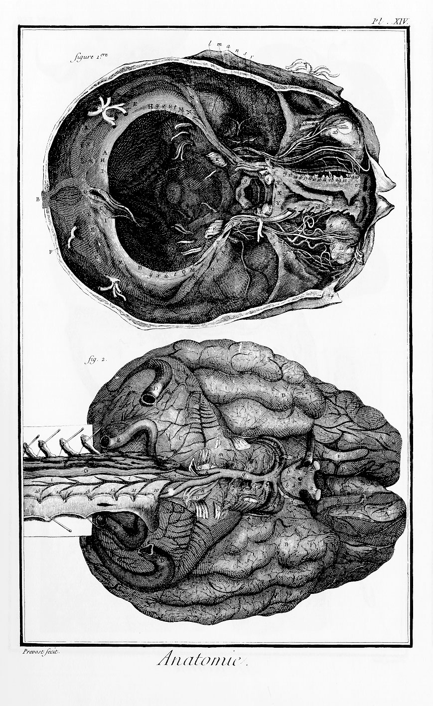](Planche_14.jpeg)

1.
	- A, la tente du cervelet.
	- B, le sinus longitudinal de la dure-mere, qui se divise en deux parties de son extrémité postérieure.
	- C, le sinus droit divisé en deux parties, dont l'une dégorge dans le sinus latéral droit, & l'autre dans le sinus latéral gauche.
	- D, vestiges de la faulx du cerveau.
	- E E, les grandes veines de la tente A.
	- F, insertion des veines du cerveau dans les sinus latéraux.
	- G, orifice du sinus occipital postérieur.
	- H H, les sinus occipitaux postérieurs, le droit & le gauche.
	- I I, la faulx du cervelet.
	- K K, les grands sinus transverses.
	- L L, les fosses jugulaires.
	- M M, les sinus pétreux inférieurs, qui s'ouvrent dans ces fosses.
	- N N, les sinus pétreux supérieurs.
	- O O, veine du cervelet, qui débouche dans ces sinus.
	- P P, sinus occipitaux antérieurs inférieurs.
	- Q Q, leur canal de décharge, qui sort avec la neuvieme paire.
	- R R, le sinus occipital antérieur & supérieur.
	- S S, la communication avec les sinus caverneux & le circulaire.
	- T, l'orifice du sinus pétreux supérieur, par lequel il s'ouvre dans le sinus caverneux.
	- V V, les sinus caverneux.
	- X X, le sinus transverse de la fosse pituitaire.
	- Y Y, le sinus circulaire de Ridley.
	- Z Z, insertion des veines antérieures du cerveau dans les sinus caverneux.
	- a a, la principale artere de la duremere.
	- b b, la veine qui l'accompagne.
	- c, endroit du crâne où elle y entre par un trou particulier.
	- d d, les arteres carotides internes dans le sinus caverneux, coupées dans l'endroit où elles entrent dans le cerveau.
	- e e, artériole qu'elle jette dans ce sinus au nerf de la cinquieme paire.
	- f f, endroit où la carotide interne produit l'artere ophtalmique.
	- g g, les apophyses clinoïdes postérieures.
	- h, l'apophyse c'ista galli.
	- i i, les sinus frontaux.
	- k k, nerf de la cinquieme paire, qui se distribue à la duremere.
	- l, troisieme branche de la cinquieme paire.
	- m, la seconde branche.
	- n, la premiere branche ou l'ophtalmique.
	- o, la quatrieme paire de nerfs.
	- p, la troisieme paire.
	- q, cloison qui sépare la cinquieme de la sixieme.
	- r, la sixieme paire.
	- s, origine du nerf intercostal.
	- t t, entrée de la septieme paire dans la dure-mere.
	- u u, premieres racines de la huitieme paire.
	- x x, secondes racines de la huitieme paire.
	- y y, la neuvieme paire.
	- z, trou de la moëlle épiniere. Dans l'oeil droit, la partie superieure de l'orbite détruite.
	- 1, 1, l'artere ophtalmique.
	- 2, 2, son rameau extérieur, qui accompagne le nerf du même nom.
	- 3, 3, rameau intérieur, qui se distribue aux narines.
	- 4, 4, rameaux à la sclérotique, dont quel-ques-uns se rendent à l'uvée.
	- 5, 5, vestiges des muscles releveurs de la paupiere & de l oeil.
	- 6, l'extrémité du releveur de la paupiere.
	- 7, la glande lacrymale.
	- 8, le nerf optique.
	- 20, 21, 22, 23, 24, 25, 26, 27, 28, 29, comme dans l'oeil du côté opposé. Dans l'oeil gauche.
	- 9, la poulie.
	- 10, le muscle grand oblique.
	- 11, le releveur de l'oeil.
	- 12, le muscle interne de l'oeil, ou l'abducteur.
	- 13, l'abducteur coupé.
	- 14, le rameau supérieur de la troisieme paire, lequel se distribue aux releveurs de l'oeil & de la paupiere.
	- 15, le reste du tronc.
	- 16, rameau de ce nerf à l'oblique inférieur.
	- 17, rameau au droit inférieur de l'oeil.
	- 18, rameau au droit interne.
	- 19, rameau au ganglion ophtalmique.
	- 20, rameau supérieur de la premiere branche de la cinquieme paire.
	- 21, filet extérieur de ce rameau.
	- 22, filet intérieur.
	- 23, rameau extérieur de la premiere branche de la cinquieme paire.
	- 24, petits rameaux qui se portent à la face par les trous de l'os de la pommette.
	- 25, rameaux à la glande lacrymale.
	- 26, rameaux inférieurs de la deuxieme branche de la cinquieme paire.
	- 27, filet de ce rameau au ganglion.
	- 28, petit filet aux narines.
	- 29, petit tronc qui s'éleve en-devant.
	- 30, le ganglion ophtalmique.
	- 31, les petits nerfs ciliaires.
	- 7, 8, comme dans l'oeil droit.

2. d'après Ridley.
	- A A, les lobes antérieurs du cerveau.
	- B B, les lobes postérieurs.
	- C C, le cervelet.
	- D D, les sinus latéraux.
	- E E, les arteres vertébrales.
	- F, les sinus vertébraux.
	- G G G, la dure-mere séparée du côté droit de la moëlle épiniere.
	- 1, 2, 3, 4, &c. les dix paires de nerfs du cerveau, avec sept autres de la moëlle épiniere.
	- a, trou qui aboutit à la tige pituitaire.
	- b b, les deux éminences orbiculaires.
	- c c, les deux troncs de l'artere carotide interne.
	- d d, leur communication avec la vertébrale.
	- e e, branches de la basilaire, qui forment le plexus choroïde.
	- f, plusieurs petites branches de la carotide interne.
	- g, l'artere basilaire, composée de deux troncs h h des arteres vertébrales.
	- i i i, l'artere épiniere.
	- k, petite branche d'une artere qui traverse la neuvieme paire.
	- l l, les jambes de la moëlle allongée.
	- m m, la protubérance annulaire, ou le pont de Varole.
	- n, les corps pyramidaux,
	- o, les corps olivaires.
	- p, la branche antérieure de la carotide interne.
	- q q, petites branches qui vont au plexus choroïde.
	- r r r r, branches d'arteres dispersées sur la protubérance annulaire.
	- s s, partie des pédoncules du cerveau.
	- \* \*, nerf accessoire.

PLANCHE XV.
-----------

Les cavités du cerveau & du cervelet, tirées des Adversaria anatomica de Tarin.

[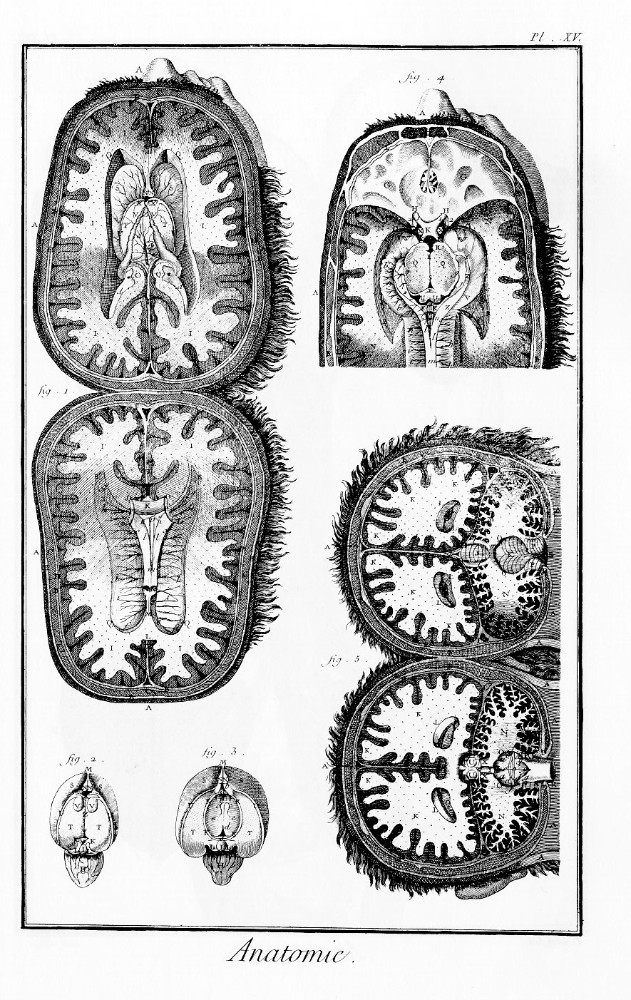](Planche_15.jpeg)

1. On voit dans cette figure les deux portions antérieure & postérieure de la tête : elle est coupée à six lignes au-dessus des sourcils, de la partie antérieure, vers la partie moyenne ; & de la partie postérieure ou de l'occiput, vers la même partie moyenne ; de maniere cependant que ces deux coupes forment dans l'endroit de leur concours un angle plus ou moins obtus, pour y découvrir en entier les ventricules supérieurs du cerveau, & les sinus postérieurs de ces ventricules. Voici ce que ces deux portions ont de commun.

	- A A, coupe des tégumens.
	- B C, coupe des os.
	- B, de leur écorce.
	- C, de leur substance spongieuse.
	- D E F G H, coupe de la dure-mere.
	- D E F G, de la faulx.
	- D E, du sinus longitudinal supérieur.
	- JIKLMNO, &c. coupe du cerveau.
	- J J, de la substance corticale.
	- I I, de la substance médullaire, distinguée des autres parties par tous les petits points par lesquels on a voulu représenter les gouttes de sang qui s'écoulent des veines coupées dans cet endroit.
	- L L, la coupe du bord postérieur du corps calleux.
	- M, de la cloison transparente.
	- N, de la colonne antérieure de la voûte.
	- O, des parties latérales du bord postérieur du corps calleux.
	- P P, des colonnes postérieures de la voûte.
	- *, extrémité postérieure des cornes du bélier.
	- Q Q R R, coupe des ventricules antérieurs du cerveau.
	- R R, des parois des sinus postérieurs. Ce qui suit est particulier à la coupe qui représente la face.
	- S S, les corps cannelés parsemés de veines.
	- T V, couches de nerfs optiques, couvertes en partie du plexus choroïde.
	- U V, éminences ovalaires des couches ; ces éminences ne s'observent pas toujours.
	- U U, nouveaux freins transparens comme de la corne, qui retiennent le tronc des veines qui viennent des corps cannelés & des couches des nerfs optiques, se décharger dans ce tronc situé dans l'angle formé par la rencontre des couches & des corps cannelés. Ces freins s'étendent de part & d'autre de la partie antérieure ; des couches, le long de l'angle dont nous venons de parler, vers leur partie postérieure sous ces couches, jusqu'à la partie antérieure de la fente des sinus antérieurs des ventricules du cerveau, & se terminent de la partie postérieure de ces couches sous ces couches mêmes, par une substance médullaire semblable à celle qui couvre les nerfs optiques. Ces freins poussent quelquefois un ou deux rameaux aux éminences ovalaires des couches.
	- X X, un de ces rameaux.
	- Z a b c, le plexus choroïde dans sa situation naturelle.
	- a, les rameaux qui se dégorgent dans les branches b, lesquelles par leur concours forment la veine de Galien.
	- c d, éminence des sinus postérieurs des ventricules supérieurs du cerveau ; ces éminences ne s'observent pas toujours.
	- d e, orifice qui conduit dans les sinus dans lesquels s'étendent les piliers postérieurs de la voûte, les cornes du belier & le plexus choroïde. Ce qui suit est particulier à la coupe opposée.
	- f g h i j, &c. face inférieure du corps calleux, ou la paroi supérieure des ventricules latéraux du cerveau & des sinus postérieurs de ces ventricules.
	- f f, la partie de ce corps, qui couvre les corps cannelés.
	- g g, la paroi supérieure des sinus postérieurs.
	- h h, les veines qui s'étendent le long de la paroi de ces ventricules.
	- i i, les cannelures formées par la courbure de cette paroi.
	- j j, la cloison transparente.
	- k, la partie inférieure du bord postérieur du corps calleux.
	- l, les parties de la voûte contiguës postérieurement à la paroi supérieure des ventricules, & antérieurement à la partie postérieure de la cloison transparente.
	- m, partie antérieure arrondie des colonnes médullaires qui forment la voûte, & qui sont un peu adhérentes dans cet endroit.
	- n o, la partie postérieure de ces colonnes, qui va toujours en s'amincissant, & qui est adhérente en n aux corps calleux, & se termine en tranchant en o.
	- p, espace triangulaire isocele, compris entre le bord postérieur des corps calleux & les colonnes postérieures de la voûte, nommé la lyre, entrecoupé de filets de la partie antérieure à la postérieure, & d'une partie latérale vers l'autre.

2. La partie moyenne de la coupe de la figure premiere, qui représente la face, le plexus choroïde en a été enlevé; la coupe O P du bord postérieur du corps calleux, &c. a été éloignée pour découvrir la partie supérieure du cervelet.
	- H, partie antérieure & supérieure du cervelet.
	- J, commissure postérieure du cerveau.
	- I, la glande pinéale.
	- K, les colonnes médullaires qui lient cette glande aux couches des nerfs optiques, & l'appliquent à la commissure postérieure du cerveau.
	- L, les natès.
	- M, coupe de la cloison transparente.
	- N N, coupe du pilier antérieur de la voûte.
	- S S, les corps cannelés
	- T, V, les couches des nerfs optiques.
	- V, les éminences arrondies des couches.
	- U, U, nouveaux freins (fig. précéd.).
	- X Y Z, fente qui sépare les couches, & qui conduit dans le troisieme ventricule.
	- X, la vulve.
	- Y, l'anus.
	- Z, la fente continue à la vulve & à l'anus : en ouvrant cette fente, on découvre le troisieme ventricule.

3. Cette figure est presque la même que la précédente, sinon qu'elle représente le troisieme ventricule.
	- H, J, I, &c. U, comme dans la figure précédente, si ce n'est que les colonnes K paroissent s'étendre le long du bord supérieur & intérieur des couches, & que les éminences V V n'ont point été représentées.
	- a b c d, le troisieme ventricule.
	- a, la commissure antérieure du cerveau.
	- b b, la partie de ce ventricule nommée l entonnoir.
	- c c, les éminences orbiculaires d'où s'élevent les colonnes N N.
	- d, conduit qui du troisieme ventricule s'étend dans le quatrieme.
	- b d, fente continue à l'entonnoir & à ce conduit.
	- c c, endroit où les couches sont quelquefois adhérentes entre elles.

4. La tête coupée, de maniere qu'on découvre les sinus antérieurs des ventricules latéraux du cerveau, & les cornes de bélier.
	- A A, coupe des tégumens.
	- B C D E *, coupe des os ; C, des sinus frontaux ; D, de la cloison de ces sinus ; E, de l'épine du coronal ; *, de l'apophyse de l'os ethmoïde.
	- F, trous olfactifs.
	- G, G, fosses antêrieures de la base du crâne, couvertes de la dure-mere.
	- H, H, trous optiques.
	- I, I, nerfs optiques qui se rendent à l'oeil par ce trou.
	- J, union de ces nerfs.
	- K, concours de ces nerfs de la partie postérieure vers l'antérieure.
	- 2, coupe des carotides internes.
	- L L, coupe de la dure-mere.
	- M M, coupe de la substance corticale du cerveau.
	- N N, coupe de la substance médullaire du cerveau.
	- O P, coupe des sinus des ventricules du cerveau ; O, des sinus antérieurs ; P, des sinus postérieurs.
	- Q, coupe des couches des nerfs optiques, bordée de la substance médullaire dont ces couches sont couvertes.
	- R, une partie & le fond de l'entonnoir.
	- S, orifice antérieur du conduit ouvert du troisieme ventricule dans le quatrieme.
	- T, la commissure antérieure du cerveau.
	- U, les natès.
	- h, i, k, l, m, n, o, p, comme dans la coupe opposée de la fig. 1ere, si ce n'est que le corps calleux a été séparé des parties latérales antérieures auxquelles il est continu, & renversé de devant en-arriere, pour faire voir que les cornes de bélier V W ne sont pas un prolongement du corps calleux.
	- V, extrémité postérieure de ces cornes voisines du bout postérieur du corps calleux.
	- W, leur extrémité antérieure cannelée & voisine X X des apophyses clinoïdes postérieures.
	- Y Y, filamens médullaires obliques de devant en-dehors & de derriere en-devant, unis ensemble pour couvrir les cornes.
	- Z Z, prolongement pyramidal des piliers postérieurs de la voûte. ce prolongement borde le bord interne des cornes.
	- a, b, le plexus choroïde. a, partie de ce plexus renversée de devant en-arriere, & représentée en z z (fig 1ere.).
	- b b, partie de ce plexus qui couvre les cornes, représentée dans sa situation naturelle.
	- c c, partie latérale externe des sinus antérieurs des ventricules antérieurs du cerveau.
	- d e R, comme dans la coupe de la figure premiere.
	- f f, bord interne & inférieur du lobe moyen du cerveau.
	- g g, fente qui se trouve entre ce bord & la moëlle allongée, & par laquelle les arteres du plexus choroïde se rendent à ce plexus.

5. Coupe verticale de la tête de droite à gauche le long de la partie postérieure des oreilles, & le cervelet coupé; de maniere qu'on puisse y découvrir le quatrieme ventricule. Ce qui suit est commun aux deux coupes.
	- A A, coupe des tégumens & des chairs.
	- B C D, coupe des os ; C, de la suture sagittale ; D, du trou oval.
	- E F G H I, coupe de la dure-mere ; F G, de la faulx, G, du sinus longitudinal ; H I, de la tente ; I, des sinus latéraux ; J K L, coupe du cerveau ; J, de la substance corticale ; K, de la substance médullaire ; L, coupe des sinus des ventricules antérieurs du cerveau dans l'espace triangulaire commun à ces sinus.
	- *, orifice des sinus postérieurs.
	- M N O, coupe du cervelet ;
	- M, de la substance corticale ;
	- N, de la substance médullaire ;
	- O, des parois du quatrieme ventricule.
	- P, parties latérales inférieures du cervelet, séparées par la petite faulx de la dure-mere. Ce qui suit est particulier à la coupe qui représente les oreilles.
	- Q, bord postérieur des cornes du bélier.
	- R, plexus choroïde qui couvre la partie postérieure des cornes.
	- S, bord postérieur du corps calleux.
	- T, les natès.
	- U, les testès.
	- V, la glande pinéale dans leur situation naturelle.
	- W, colonne médullaire d'où fort X l'origine de la quatrieme paire de nerfs.
	- Y, la face postérieure de la grande valvule du cerveau.
	- a b c d e f g, paroi antérieure du quatrieme ventricule ouvert.
	- a, la partie inférieure du conduit formé par la grande valvule & les colonnes médullaires du cervelet.
	- b c, petite fente qui divise cette paroi.
	- d d d d, les quatre petites fosses.
	- e f, portion de la septieme paire de nerf qui sort du quatrieme ventricule.
	- e, la sortie de ce quatrieme ventricule dans l'angle formé par le concours de la partie inférieure & antérieure du cervelet, & la partie postérieure de la moelle allongée.
	- g e, le bec de plume à écrire, dont les bords g g sont quelquefois crenelés.
	- h, coupe de la moëlle épiniere. Ce qui suit est particulier à la coupe opposée.
	- i, espace triangulaire qui résulte du concours de la partie inférieure, postérieure & antérieure de la faulx, avec la partie moyenne & antérieure de la tente.
	- j, extrémité supérieure de l'éminence vermiculaire, située sur la valvule Y.
	- l, parties latérales internes du cervelet, correspondantes à ces extrémités.
	- k, extrémité inférieure de l'éminence vermiculaire opposée à la paroi a b c d e f.
	- m, la partie postérieure du quatrieme ventricule.

PLANCHE XVI.
------------

Les arteres de la partie antérieure & interne de la poitrine, d'après Haller.

[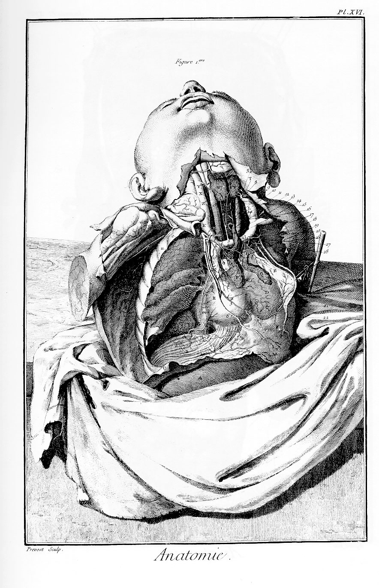](Planche_16.jpeg)

1. le foie représenté en passant.
	- B, la portion droite du diaphragme.
	- C, quelques parties des muscles de l'abdomen.
	- D, le péricarde, à-travers lequel le coeur paroît çà & là.
	- E, l'oreillette droite circonscrite par des points.
	- F, la pointe du coeur.
	- G, la veine-cave inférieure.
	- H, la veine pulmonaire droite.
	- I, la veine-cave supérieure.
	- K, sa continuation dans la jugulaire droite.
	- L, la jugulaire gauche.
	- M, une partie de l'aorte.
	- N, la ligne dans laquelle le péricarde se termine dans la veine cave.
	- O, la ligne par laquelle il est adhérent à l'aorte.
	- P, la partie droite du thymus.
	- Q, la gauche.
	- R, la lame gauche du médiastin unie avec le péricarde.
	- S, la trachée-artere.
	- T, l'oesophage.
	- V, la glande thyroïde.
	- X, la veine jugulaire interne droite.
	- Y, la veine thyroïdienne supérieure.
	- Z, le nerf droit de la huitieme paire.
	- a, tronc commun de l'artere soûclaviere & de la carotide droite.
	- b, la soûclaviere droite.
	- c, la carotide droite.
	- d, la veine mammaire droite.
	- e, l'artere mammaire droite.
	- f, rameau péricardio-diaphragmatique de la mammaire droite.
	- g, rameau qui se distribue au péricarde & aux glandes placées sous la veine cave.
	- h, rameau qui accompagne le nerf diaphragmatique.
	- i, rameau superficiel qui se distribue au poumon.
	- k, d'autres au péricarde.
	- l, rameau de l'artere diaphragmatique droite.
	- n, anastomose de l'une & l'autre artériole qui accompagne ce nerf.
	- o, rameau de l'artere diaphragmatique au diaphragme.
	- p, anastomose de la mammaire avec les rameaux de la diaphragmatique.
	- q, l'artere thymique droite.
	- r, l'artere péticardine postérieure supérieure.
	- s, l'artere thymique gauche postérieure.
	- t, la veine thymique droite.
	- u, rameau des arteres mammaires qui sort du thorax.
	- x, division de la mammaire interne.
	- y, rameau externe ou l'épigastrique.
	- z, rameau qui se distribue aux tégumens extérieurs de la poitrine.
	- 1, rameau abdominal, ou l'épigastrique intérieur.
	- 2, l'extérieur, ou la muscule phrénique.
	- 3, rameau intérieur de la mammaire, ou le phrénico-péricardien.
	- 4, rameau au médiastin.
	- 5, petit rameau au péricarde.
	- 6, petit tronc qui se porte au diaphragme.
	- 7, les arteres coronaires antérieures figurées en passant.
	- 8, la veine thyroïdienne inférieure droite.
	- 9, la veine thyroïdienne inférieure gauche.
	- 10, rameau qui se distribue à la trachée-artere.
	- 11, un autre à l'oesophage.
	- 12, un autre à la corne droite du thymus.
	- 13, la carotide gauche.
	- 14, la soûclaviere gauche.
	- 15, les deux rameaux de la thyroïdienne inférieure.
	- 16, la vertébrale gauche.
	- 17, la mammaire.
	- 18, un de ses rameaux au médiastin qui accompagne le nerf diaphragmatique.
	- 19, rameau thymiquê gauche.
	- 20, division de la mammaire gauche.
	- 21, rameau phrénique ou péricardin gauche.
	- 22, rameau épigastrique.
	- 23, la veine soûclaviere gauche.
	- 24, la jugulaire gauche.
	- 25, la mammaire gauche.
	- 26, rameau thymique gauche.
	- 27, rameau superficiel.
	- 28, la veine bronchiale gauche.
	- 29, rameau thymique.
	- 30, rameau médiastin.
	- 31, rameau bronchial.
	- 32, la veine thyroïde moyenne gauche.

PLANCHE XVI. n°. 2. Détail des arteres de la poitrine.
------------------------------------------------------

[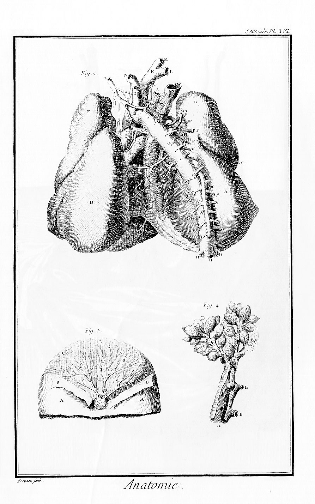](Planche_16-2.jpeg)

2. L'aorte inclinée sur la gauche, afin qu'on puisse mieux voir les arteres bronchiales du même côté, d'après Haller.
	- A B C, le poumon droit.
		- A, le lobe inférieur ; B, le supérieur ; C, le moyen.
	- D E, le poumon gauche.
		- D, le lobe inférieur, E, le lobe supérieur.
	- F F, l'oesophage.
	- G G G, l'aorte.
	- H, H, H, les rameaux qu'elle jette en-dedans ; le bas-ventre figuré en passant.
	- J, l'arc de l'aorte.
	- K, le tronc de la soûclaviere & de la carotide droite.
	- L, la soûclaviere droite.
	- M, la carotide droite.
	- N, la gauche.
	- O, la soûclaviere gauche.
	- P, le péricarde recouvert postérieurement de la plevre.
	- Q Q, le médiastin postérieur.
	- S, l'azigos.
	- T, rameau intercostal supérieur.
	- U, U, veines intercostales.
	- Y, tronc droit.
	- Λ, la trachée-artere.
	- Σ, la bronche droite.
	- a, veine bronchiale gauche.
	- b, tronc qui s'insere au-delà de l'aorte dans les espaces intercostaux.
	- c, rameau à l'oesophage ; d, à la trachée-artere ; e, ensuite à l'oesophage ; f, au même ; g, dans les tuniques de l'aorte.
	- h, l'artere péricardine postérieure supérieure, qui vient de la soûclaviere gauche, & qui se distribue à la trachée- artere & à l'oesophage,
	- i, la même qui vient de la soûclaviere droite, & se distribue au tronc de l'aorte & à la trachée-artere.
	- m, intercostale supérieure qui en sort & se porte vers l'intervalle de la seconde & de la troisieme côte.
	- n, n, les bronchiales qui se distribuent aux poumons.
	- o, une partie de la bronchiale gauche.
	- p, p, p, les arteres intercostales.
	- r, l'autre artere oesophagienne.
	- s, veine de l'azigos à l'aorte.
	- t, veine bronchiale droite de l'azigos.
	- u, d'autres petites arteres oesophagiennes.
	- x, rameau de l'artere r.
	- y z, la plus grande artere oesophagienne.
	- 1, l'artere oesophagienne.
	- 2, une autre veine.
	- 3, une troisieme.
	- 4, une quatrieme.

3. Une partie de la mammelle, d'après Nuck.
	- A A, B B, la peau coupée.
	- C C C, la partie glanduleuse de la mammelle.
	- d, d, d, d, racines capillaires des tuyaux laiteux.
	- e, e, e, trois de leurs troncs.
	- f, f, anastomoses de ces troncs entre eux.
	- g, la papille percée de plusieurs trous.

4. Les vésicules d'un rameau bronchial ; d'après Bidloo.
	- A, rameau bronchial séparé de son tronc.
	- B, B, ses petits rameaux.
	- C, C, les vésicules qui terminent ces rameaux.
	- D, vésicules séparées de différentes figures qui sont recouvertes de vaisseaux sanguins & d'autres vaisseaux qui s'entrelacent les uns avec les autres.

PLANCHE XVII. Le coeur, d'après Sénac.
--------------------------------------

[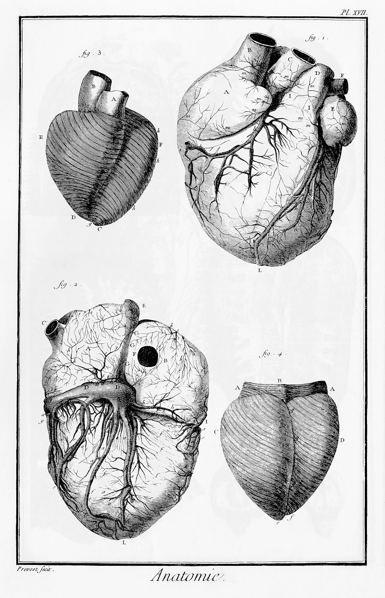](Planche_17.jpeg)

1. La face convexe du coeur ; mais il a été forcé par la cire dont il a été rempli : on ne pouvoit faire voir autrement la figure naturelle des sacs. L'injection n'a pas conservé la proportion exacte des vaisseaux ; ils ont été diversement forcés. L'aorte c, par exemple, paroît moins grosse que l'artere pulmonaire. La veine cave supérieure B a été trop dilatée ; les proportions manquent de même dans les arteres coronaires : à mesure que les ventricules ont été dilatés, ces arteres se sont allongées : à leurs extrémités, de même que dans leur cours, elles sont marquées par des points ; ce sont ces points qui les distinguent des veines.

	- A, l'oreillette droite remplie de cire : il ne paroît aucune dentelure, quoiqu'il y en ait quelque trace dans l'état naturel.
	- B, la veine cave supérieure qui est continue avec l'appendice à sa partie postérieure.
	- C, l'aorte qui vient de derriere l'artere pulmonaire. & se courbe en montant.
	- D, l'artere pulmonaire,
	- E, l'oreillette gauche, qui est plus élevée que la droite.
	- F, la veine pulmonaire antérieure.
	- I, I, les valvules de l'artere pulmonaire, qui avoient été poussées dans les sinus par l'injection, & qui paroissoient au-dehors.
	- g, branche antérieure de l'artere pulmonaire gauche.
	- h, artere coronaire droite.
	- i, i, veines innominées qui débouchent dans l'oreillette par leurs troncs.
	- k k, la veine qui accompagne l'artere.
	- L, la branche antérieure de l'artere coronaire, qui passe à la partie postérieure par la pointe du coeur.
	- m, m, m, m, m, m, arteres qui rampent sur les oreillettes & les grands vaisseaux.

Il n'est pas douteux qu'il n'y ait des variations dans les vaisseaux coronaires ; il est peu de sujets où on trouve ces vaisseaux exactement les mêmes : mais c'est dans les branches que se presentent les variations. Les troncs en général sont peu différens ; les principales divisions sont aussi moins variables. Mais on ne finiroit jamais si l'on vouloit marquer toutes les différences qui sont très-fréquentes dans les vaisseaux. Il faut cependant observer ces différences pour établir ce qui est le plus général ; elles peuvent d'ailleurs nous découvrir quelques usages particuliers ou quelques vùes de la nature.

2. La face applatie du coeur, & les oreillettes remplies. Les ventricules & les vaisseaux coronaires sont aussi remplis. Le sinus de la veine coronaire a été forcé par l'injection.
	- A, oreillette ou sac gauche dont la surface supérieure est toûjours oblique.
	- B, le sac droit qui est plus court que le sac gauche.
	- C, la veine pulmonaire gauche & postérieure.
	- D D, le sinus coronaire qui a été trop dilaté par la cire.
	- E, la veine pulmonaire droite postérieure du sac gauche.
	- F, la veine cave inférieure qui avoit été liée, & dont l'orifice paroît plus petit que dans l'état naturel.
	- G G G, adossement des sacs qui sont liés par un plan extérieur des fibres communes à l'un & à l'autre.
	- H, embouchure du sinus coronaire dans l'oreillette droite.
	- I, veine innominée avec les branches o, o, o, o.
	- L, l'artere coronaire qui vient de l'autre face du coeur.
	- a, a, a, a, a, a, a, branches des arteres coronaires sur la surface du coeur.
	- b, b, b, veine qui marche le long de la cloison.
	- c c c, seconde veine qui n'a qu'une artere qui l'accompagne.
	- d, d, deux autres veines. e e e, branche où se réunit la veine.
	- f, f, f, f, extrémités artérielles qui marchent transversalement.
	- g, g, branches veineuses sur lesquelles passent une branche artérielle a en forme d'anneau.
	- h, h, h, h, veines qui se répandent sur les sacs.
	- i, i, i, i, i, i, arteres qui rampent sur les sacs.
	- o, o, o, o, branches de la veine innominée i. On voit dans cette figure si les arteres coronaires par leurs extrémités se joignent & forment un anneau, comme Ruisch le prétend ; elles sont ici fort éloignées.

3. Les fibres musculaires du coeur & leurs contours ; pour cela on a durci un coeur par la coction, on a auparavant rempli ses cavités de charpie.
	- A, l'artere pulmonaire qui paroît relevée à la racine, parce que le ventricule droit est rempli.
	- B, l'aorte.
	- C, la pointe du ventricule gauche avec ses fibres en tourbillon : mais ce tourbillon ne peut pas être bien représenté ici, à cause de la petitesse de la pointe resserrée par la coction : c'est une espece d'étoile avec des rayons courbes qui sortent du centre ou qui s'y rendent.
	- D, la pointe du ventricule droit ; elle est en général moins longue que la pointe du ventricule gauche.
	- E, le ventricule droit vû par sa face convexe ou supérieure.
	- F, le ventricule gauche vû de même.
	- g g g, le sillon qui termine ou unit les deux ventricules. Les fibres externes s'élevent ici en petites bosses près du sillon, parce que les ventricules sont remplis, & que la cloison n a pas prêté autant que les fibres : c'est pour cela qu'on ne voit pas bien la continuité apparente de celles du ventricule droit avec celles du ventricule gauche ; mais cette continuité n'est pas douteuse ; on n'a qu'à enlever de petites lames, on verra qu'elles partent du bord du ventricule droit, pour s'étendre sur le gauche.
	- h, h, h, le côté du ventricule gauche : c'est sur ce côté que sont les fibres droites ou approchantes des droites, lorsqu'il y en a dans le coeur. Ces fibres forment une couche si mince, qu'on les emporte facilement en élevant la membrane qui les couvre.

4. La face applatie ou inférieure du coeur.
	- A, A, les fibres qui sont à la racine des oreillettes.
	- B, la cloison des oreillettes.
	- C, le ventricule gauche.
	- D, le ventricule droit.
	- e, la pointe du ventricule gauche.
	- f, la pointe du ventricule droit.
	- g, g, g, le sillon qui termine les deux ventricules.

PLANCHE XVII. n°. 2. Détail du coeur.
-------------------------------------

[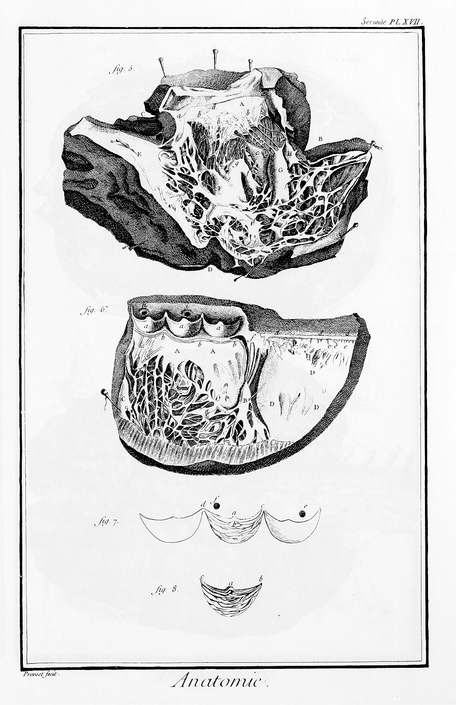](Planche_17-2.jpeg)

5. L'intérieur du ventricule gauche. Pour cela, on a fait une section par l'aorte, & on l'a poussée le long de la cloison : il n'y a que cette section qui puisse montrer la grande valvule, & laisser les piliers dans leur entier.
	- A, la grande valvule mitrale qui surpasse de beaucoup celle qui est cachée dessous.
	- B, scissure qu'on a été obligé de faire pour étendre le ventricule & l'y montrer.
	- C, autre scissure qui a été nécessaire pour la même raison.
	- D, troisieme scissure qu'on a faite à la pointe.
	- E, espace lisse & poli, qui est sous l'aorte.
	- F g, f G, piliers d'où partent les fibres tendineuses dont on a représenté l'entrée dans la valvule.
	- a, a, a, bandes ou cordons tendineux auxquels la valvule est attachée.
	- b, b, b, filamens tendineux qui rampent dans la valvule, & qui vont joindre ceux qui viennent de la racine de cette valvule.
	- d, d, d, d, d, d, racines de piliers, & les colonnes avec leurs aires. On voit au bas des piliers les colonnes, les faisceaux, les filamens, les aires, les fossettes dont le ventricule est couvert. Il n'y a rien sur cette surface qui ne soit représenté d'après nature jusqu'aux parties les plus petites.

6. On a représenté dans les figures précédentes tout ce qui est sous l'aorte, les valvules sygmoïdes & leur structure, les cordons auxquels sont attachés les valvules auriculaires, la façon dont se terminent les colonnes à ce cordon. Comme ce coeur avoit été dans l'eau alumineuse, le tissu avoit été resserré.
	- A A, espace lisse & poli qui est sous l'aorte.
	- B, pilier avec ses filets tendineux qui vont au reste de la valvule f qui a été déchirée.
	- C, autre pilier avec quelques filets tendineux qui va à un reste g de la valvule.
	- D D D, ce qui manque ici a été représenté dans la précédente figure.
	- a, a, a, valvules sygmoïdes avec leurs tubercules ; on a omis les sinus.
	- b b b, cordon qui est sous ces valvules ; il est un peu plus large dans l'état naturel, & plus proche du fond des valvules.
	- c, c, c, c, c, colonnes, faisceaux, filamens & fossettes.
	- d, d, d, d, cordon des valvules mitrales.
	- e, e, e, insertion des fibres des colonnes sous ce cordon.
	- i, h, embouchures des arteres coronaires.

7. La structure des valvules sygmoïdes.
	- a, le tubercule.
	- b, fosse au second tubercule qui est dessous.
	- c, d, les angles que forment les cornes. Toutes les fibres qu'on voit dans cette figure sont musculaires.
	- e, f, arteres coronaires.

8. Une valvule sygmoïde prise d'un autre sujet.
	- a, tubercule.
	- b, c, les cornes.

PLANCHE XVIII. Quelques parties du bas-ventre, d'après Haller.
--------------------------------------------------------------

[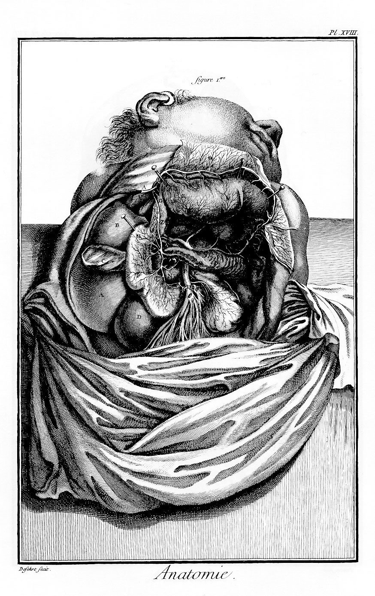](Planche_18.jpeg)

1.
	- A B, le lode droit du foie incliné à droite.
	- Γ, le lobe gauche.
	- Δ, le lobe de Spigélius.
	- C, la vésicule du fiel.
	- D, le rein droit.
	- E, l'estomac élevé en-haut.
	- F, l'oesophage.
	- Θ, une portion de l'épiploon gastro-colique.
	- G, le pylore.
	- H, la portion descendante du duodénum.
	- K, sa partie gauche & l'origine du mésentere.
	- L, le rein gauche.
	- M, la rate dans sa situation naturelle.
	- N, la face antérieure du pancréas.
	- O, la face postérieure du pancréas.
	- P, l'artere mésentérique qui passe derriere le duodénum & devant le pancréas.
	- Q, l'artere colique moyenne.
	- R, le tronc de la caeliaque.
	- S, l'artere coronaire supérieure.
	- Φ, Φ, les rameaux mésentériques de la veine porte.
	- T, la veine porte poussée sur la gauche.
	- U, rameau droit de l'artere caeliaque.
	- X, soa tronc hépatique.
	- Y, la duodénale.
	- Z, l'artere gastro-épiploïque droite qui côtoye la grande courbure de l'estomac.
	- a, a, les deux arteres pyloriques inférieures.
	- b, la grande artere pancréaticeduodénale, qui côtoye la partie cave de la courbure.
	- c, les rameaux qu'elle jette au duodénum, Y au pancréas.
	- ε, ses anastomoses avec les petites pyloriques.
	- d, la pancréatique.
	- e, l'insertion de l'artere de la splénique dans la pancréatico-duodénale.
	- c f, rameau d'une branche de la mésentérique qui s'ouvre dans cette même artere d.
	- g, lieu de l'insertion de la premiere duodénale.
	- h, l'artere splénique.
	- i, les rameaux pancréatiques.
	- k, les rameaux gastriques postérieurs.
	- l, l, l, les rameaux spléniques.
	- m, l'artere gastro-épiploïque gauche.
	- n, ses anastomoses avec la droite.
	- o, o, les vaisseaux courts.

PLANCHE XVIII. n°. 2. Les reins, d'après Haller.
------------------------------------------------

[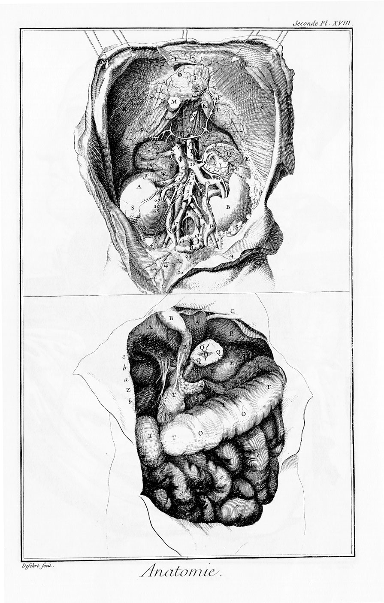](Planche_18-2.jpeg)

2.
	- A, le rein droit.
	- B, le rein gauche.
	- C, la capsule droite.
	- D, la capsule gauche.
	- E, une de ses parties un peu élevée pour voir les vaisseaux postérieurs,
	- F, grand sillon de la capsule.
	- G, le même dans la capsule droite.
	- H, H, les appendices du diaphragme.
	- J, J, le centre tendineux du diaphragme.
	- K, K, les portions du diaphragme qui sortent des côtes.
	- L, ligament suspensoire du foie.
	- M, trou de la veine cave N & de l'oesophage.
	- O, le spoas gauche.
	- P, l'uretere du même côté.
	- R, l'intestin rectum représenté en passant.
	- Q, l'uretere droit.
	- S, S, une partie de la graisse rénale.
	- T, l'aorte.
	- U, la veine cave à sa sortie du foie.
	- X, l'artere phrénique.
	- Y, rameau droit.
	- Z, rameau capsulaire antérieur.
	- a, les postérieurs.
	- b, rameau au diaphragme.
	- c, rameaux des mammaires qui paroissent un peu dans l'étendue du diaphragme.
	- d, rameau droit de l'appendice.
	- e, anastomose des arteres diaphragmatiques.
	- f, rameau gauche de la phrénique.
	- g, g, les capsulaires antérieures de la diaphragmatique.
	- h, l'oesophagienne.
	- i, i, rameaux à l'un & à l'autre tendon ; k, k, à l'appendice.
	- Γ, rameau qui perce le diaphragme pour aller au thorax.
	- Θ, anastomose ou arc des vaisseaux droit & gauche dans le tendon.
	- l, rameau au ligament suspensoire.
	- Λ, veine phrénique droite.
	- Ξ, la gauche.
	- m, l'artere coeliaque.
	- n, la mésentérique supérieure.
	- o, l'appendicale droite qui vient de l'aorte.
	- p, la premiere capsulaire gauche postérieure.
	- q, l'appendicale qui vient de l'aorte.
	- Σ, la capsulaire postérieure droite.
	- r, la seconde capsulaire postérieure gauche.
	- s, sa capsule antérieure gauche.
	- t, l'artere rénale gauche.
	- u, rameau adipeux qui vient du tronc.
	- w, l'artere rénale droite.
	- Φ, l'artere capsulaire droite antérieure de la rénale.
	- Ψ, la veine qui l'accompagne.
	- x x, les arteres aux glandes lombaires.
	- y, l'artere adipeuse droite de la rénale.
	- z, l'artere spermatique droite.
	- 1, l'adipeuse qui en sort.
	- 2, l'ureterique supérieure de l'aorte.
	- 3, le grand rameau adipeux inférieur.
	- 4, le rameau qui va aux testicules.
	- 5, la spermatique gauche.
	- 6, les adipeuses qui en sortent.
	- 8, rameaux aux testicules.
	- 9, l'adipeuse postérieure qui vient de la capsulaire.
	- 10, l'artere mésentérique inférieure.
	- 11, 11, les iliaques communes.
	- 12, 12, les externes.
	- 13, 13, les internes.
	- 14, 14, les épigastriques.
	- 15, l'artere sacrée.
	- 16, l'ureterique gauche.
	- 17, l'ureterique droite inférieure.
	- 18, la veine sacrée.
	- 19, la veine capsulaire droite.
	- 20, la veine rénale gauche.
	- 21, la capsulaire gauche de la rénale.
	- 22, l'adipeuse de la même.
	- 23, la spermatique de la même.
	- 24, la premiere rénale droite.
	- 25, la seconde.
	- 26, la spermatique qui en sort, 28 & de la veine cave.
	- 29, le sommet de la vessie.
	- 30, l'ouraque.
	- 31, les arteres ombilicales.

3. Les intestins en situation, d'après le même.
	- A A, la partie inférieure du foie élevé en-devant.
	- B B, la vésicule du fiel.
	- C, la veine ombilicale.
	- D, le petit lobe de Spigélius.
	- E E, l'estomac.
	- G, le pylore.
	- K K, l'épiploon gastro-colique.
	- O O, limite dans le colon, de laquelle provient l'épiploon gastro-colique & le colique.
	- Q Q, le petit épiploon.
	- S S, partie du mésocolon.
	- T, T, différentes parties du colon.
	- U, second coude du duodénum presque transverse.
	- X, troisieme coude du duodénum qui reçoit le canal cholédoque.
	- Y, ligament ou membrane qui va de la vésicule au colon.
	- Z a, ligament hépatico-rénal.
	- Z, limite gauche de ce ligament.
	- a, sa limite droite.
	- b b, le rein droit couvert par le péritoine.
	- c, l'orifice de Winslow, par lequel on souffle le pétit épiploon.
	- d, d, le colon avec les appendices graisseuses.
	- e, e, les intestins grêles.
	- f f, la partie du pancréas qui s'insinue dans les courbures du duodénum.

PLANCHE XIX.
------------

Parties de l'estomac, du foie & des parties voisines, d'après Kulm.

[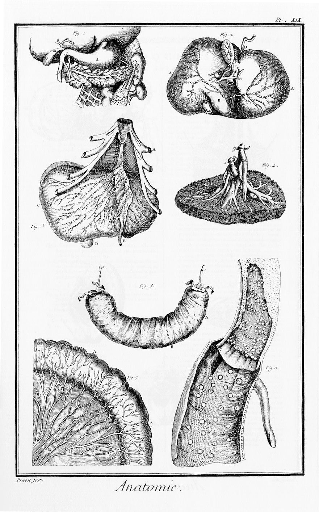](Planche_19.jpeg)

1.
	- a b c d 2, le pancréas.
	- a, a, a, a, les grains glanduleux du pancréas.
	- b, b, b, b, les petits conduits qui de ces grains se rendent dans le conduit commun.
	- d 2 f e, le commencement du duodenum.
	- e, l'orifice commun du conduit pancréatique & du canal cholédoque dans cet intestin.
	- f f, l'intestin ouvert pour voir cet orifice.
	- g, le pylore.
	- h, l'estomac.
	- i, l'orifice cardiaque.
	- k, le foie.
	- l, la vésicule du fiel.
	- m, le conduit cistique.
	- n, le conduit hépatique.
	- o, le canal cholédoque.
	- 1, 1, les vaisseaux courts.
	- 12, 2, 3, la rate.
	- 3, l'artere splénique.
	- 4, l'épiploon.
	- 5, le diaphragme.
	- 6, le rein.

2. La partie concave du foie, d'après Reverholt.
	- A A, la face interne du foie.
	- B, le petit lobe du foie.
	- C, la scissure du foie.
	- D, la veine ombilicale.
	- E, l'artere hépatique.
	- F, son rameau qui produit la cistique.
	- G, la veine-porte.
	- H, les nerfs hépatiques.
	- I, la veine-cave.
	- K, la vésicule du fiel.
	- L, le conduit cistique.
	- m, le conduit hépatique.
	- n, le canal cholédoque.
	- o, glandule cistique.
	- p, grosse glande placée sur la veine-porte, ou sur le conduit cistique.
	- q, vaisseaux lymphatiques de la vésicule.
	- r, r, r, vaisseaux lymphatiques qui proviennent de la partie concave du foie.
	
3. La face concave du foie, d'après le même.
	- A A A, une partie du sternum, avec ses cartilages,
	- B, l'appendice xiphoïde.
	- C C, le foie.
	- D, la vésicule du fiel.
	- E, la veine ombilicale.
	- F, ligament suspensoire du foie.
	- g, g, g, vaisseaux lymphatiques du côté droit.
	- h, h, ces vaisseaux coupés où ils s'unissent en perçant le diaphragme.
	- i, i, vaisseaux lymphatiques provenans de la partie gauche du foie,

4. La rate dépouillée de ses membranes, d'après Bidloo.
	- A, l'artere.
	- B, la veine ; l'une & l'autre remplies de cire.
	- a, b, ramifications de l'artere & de la veine.
	- C, C, vestiges de la capsule. D, prolongemens & plexus de nerfs.
	- E, petites fibres qui partent de la membrane propre de la rate.
	- F, vestiges des cellules rompues.
	- G, capillaires des vaisseaux lymphatiques.

5. Une portion de l'intestin jejunum renversé, d'aprês Ruisch.
	- A, fausses glandes miliaires, situées dans les rides, ou environnées de brides.
	- B, ces glandes, sans être environnées de brides.

6. d'après Peyer.
	- A A, l'extrémité de l'iléon ouverte & dilatée de maniere qu'on le voye en dedans.
	- C C, la valvule de Bauhin.
	- D D, portion du colon coupée.
	- E, E, e, e, e, glandes solitaires.
	- F F, l'intestin coecum entier.
	- G G, le même renversé pour montrer les glandes.

7. Les veines lactées, d'après Heister.
	- A A A, une partie de l'intestin jejunum.
	- B, B, B, un grand nombre de racines de veines lactées.
	- C, C, C, C, leur distribution dans le mésentere.
	- D, D, D, D, les glandes les plus considérables du mésentere.

PLANCHE XX. Le rein.
--------------------

[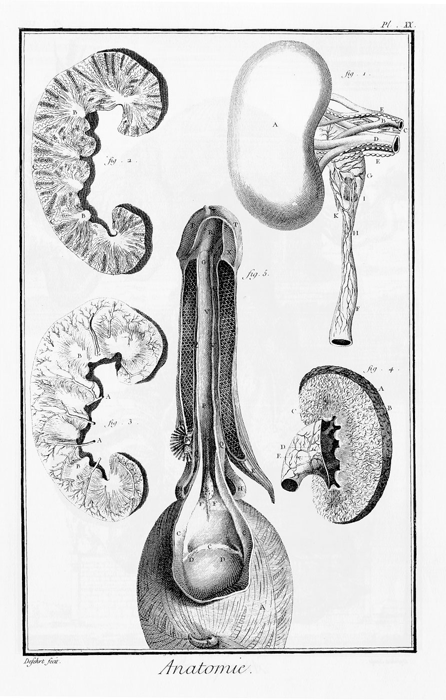](Planche_20.jpeg)

1. d'après Nuck.
	- A, le rein droit.
	- B, l'artere émulgente.
	- C, distribution des nerfs dans ce rein.
	- D, la veine émulgente.
	- E, E, les vaisseaux lymphatiques.
	- F, l'uretere.
	- G, le bassinet dilaté.
	- H, retrécissement de l'uretere.
	- I, une pierre qui s'est trouvée dans la partie dilatée.
	- G K, les vaisseaux sanguins de l'urethre.

2. &
3. Le rein coupé en deux, d'après. Bertin.

2. 
	- B, B, les papilles rénales.
	- C, C, les glandes situées entre ces papilles.

3.
	- A A, distribution des arteres dans le rein, lesquelles sont continues aux tuyaux qui composent B B les papilles.

4. La moitié du rein coupée de maniere qu'on y puisse voir la distribution des vaisseaux sanguins, d'après Ruisch.
	- A, la face extérieure du rein, dans laquelle les vaisseaux se distribuent en serpentant.
	- B, la face interne du rein, dans laquelle on voit les vaisseaux sanguins remplis de cire se distribuer de la même maniere que ci-dessus.
	- C, les papilles rénales.
	- D, le bassinet.
	- E, la cavité du bassinet, dans laquelle les papilles séparent l'urine.

5. d'après Duverney.
	- A, la vessie, sur laquelle on observe les fibres longitudinales & transverses de sa membrane musculaire.
	- B, l'ouraque.
	- C, coupe de la vessie.
	- D, paroi intérieure de la vessie.
	- E, le vérumontanum, où on observe les orifices des vésicules séminaires.
	- F, les orifices des glandes prostates, qui s'observent sur les parties latérales du vérumontanum.
	- G, les parois intérieures de l'urethre.
	- H, les glandes prostates.
	- I, origine des corps caverneux.
	- K, le muscle ischio caverneux.
	- M, coupe du muscle bulbe caverneux.
	- N, glandes de Cowper.
	- O, le conduit de ces glandes.
	- P, l'orifice de ces conduits dans l'urethre.
	- Q, coupe du tissu spongieux de l'urethre.
	- R, la fosse naviculaire.
	- S, coupe du tissu spongieux des corps caverneux.
	- T, le gland.
	- V, orifice des sinus muqueux de l'urethre.
	- X, coupe du tissu spongieux du gland continu au tissu spongieux de l'urethre.
	- Y, l'orifice du gland.

PLANCHE XXI. La verge vûe de différentes manieres.
--------------------------------------------------

[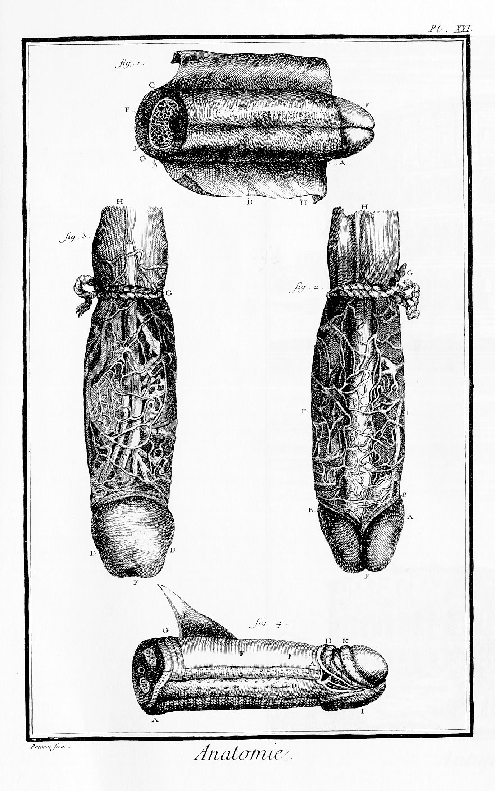](Planche_21.jpeg)

1. La verge dépouillée de la peau, desséchée après l'avoir embaumée, & vûe dans sa partie inférieure, d'après Ruisch.
	- A, superficie du tissu cellulaire, dépouillée de l'enveloppe extérieure épaisse & nerveuse : ce tissu cellulaire prend le nom de membrane adipeuse, lorsqu'il est rempli de graisse.
	- B, le corps spongieux d'un côté.
	- C, le conduit urinaire.
	- D, la surface interne de l'enveloppe épaisse & nerveuse, dépouillée du tissu cellulaire.
	- F, le gland, sur la superficie duquel on ne voit aucune papille, parce qu'elles ont disparu en séchant.
	- G, épaisseur du tissu cellulaire après l'avoir gonflé.
	- H, tête du tissu cellulaire.
	- I, la cloison qui s'observe entre les deux corps caverneux.

2. La verge vûe par sa même face supérieure, dont les veines & la substance caverneuse ont été remplies de mercure, d'après Heister.
	- A, le tronc de la veine de la verge, par laquelle le mercure a été introduit, après avoir détruit la valvule de cette veine.
	- B, B, division de cette veine en deux branches principales vers la partie moyenne de la verge.
	- C, C, la distribution de ces branches en plusieurs rameaux, surtout proche la couronne du gland.
	- D, D, distribution merveilleuse de petits rameaux sur le gland.
	- e, e, e, e, certains vaisseaux plus petits, plus grands & très-gros, qui se distribuent dans différentes endroits.
	- F, la fin de l'urethre par où sort l'urine.
	- G, le cordon avec lequel la verge a été liée après qu'on y a eu introduit le mercure.
	- H, la partie postérieure de la verge coupée.

3. La partie inférieure de la même verge, d'après Heister.
	- A, le petit frein de la verge couvert d'une infinité de petits vaisseaux.
	- B, B, la couronne & le col de la verge, rempli d'un grand nombre de vaisseaux. 
	- C, C, toute la partie inférieure du gland couvert, comme la supérieure, de petits vaisseaux très-fins & tortueux.
	- E, E, les deux corps caverneux de la verge, entre lesquels l'urethre est située & environnée d'un nombre prodigieux de vaisseaux qui communiquent & s'entrelacent de diverses manieres.
	- F, la fin de l'urethre.
	- G, cordon avec lequel on a lié la verge.
	- H, la partie postérieure de la verge coupée.

4. La verge vûe dans la partie insérieure, & le canal de l'urethre coupé, &c. d'après Morgagni.
	- A A, le corps spongieux de l'urethre coupé dans sa longueur pour voir sa cavité. 
	- D, le plus grand des pe- tits canaux de l'uretere ouvert & étendu ; on voit aussi tout le long du canal un grand nombre d'orifices de pareils canaux.
	- E, ligament suspensoire de la verge.
	- F F, La membrane qui recouvre la verge, & qui est continue à ce ligament.
	- g, une partie de cette membrane séparée de la surface des corps caverneux, & tirée en bas.
	- H, partie du prépuce tiré en arriere, où l'on voit I le frein & quelques glandes sur le frein même.
	- K, la couronne du gland, & ses glandes sébacées.

PLANCHE XXI. n°. 2. Détail de la verge.
---------------------------------------

[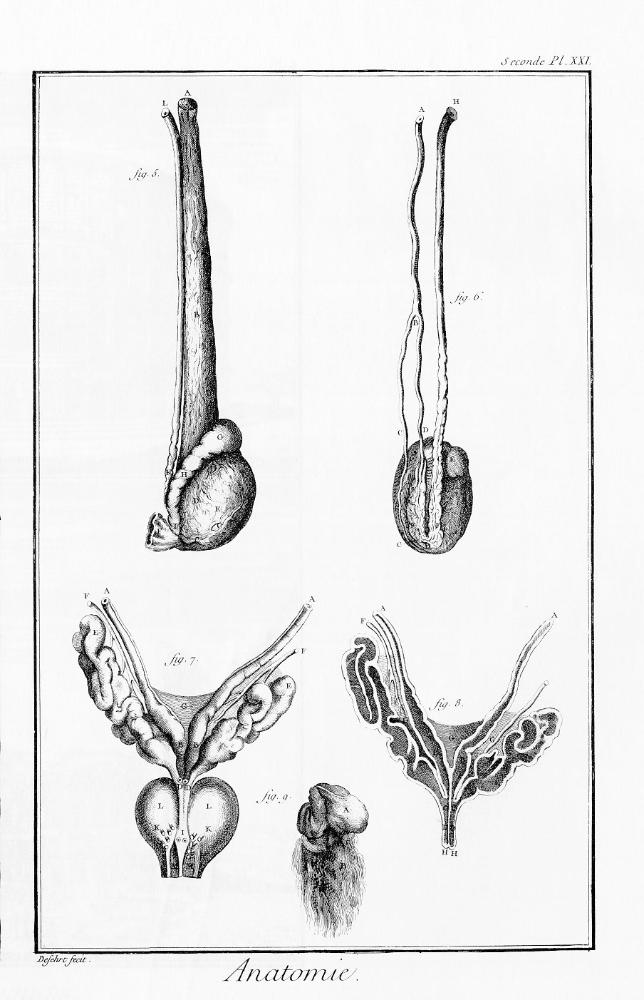](Planche_21-2.jpeg)

5. d'après Graaf.
	- A, les vaisseaux spermatiques coupés transversalement.
	- B, ces mêmes vaisseaux représentés confusément.
	- C, distribution de l'artere spermatique dans le testicule.
	- D, D, distribution de la veine spermatique sur les parties latérales du testicule.
	- E, la tunique albuginée.
	- F, une partie de la tunique vaginale emportée.
	- G, la plus grosse partie de l'épididime.
	- H, partie moyenne de l'épididime.
	- I, la plus petite partie de l'épididime.
	- K, la fin de l'épididime, ou le commencement du canal déférent.
	- I, ce canal coupé.

6. d'après le même.
	- A, l'artere spermatique.
	- B, division de cette artere en deux rameaux.
	- C, C, distribution du gros rameau au testicule.
	- D, D, distribution du petit rameau au testicule.
	- E, la plus grosse partie de l'épididime adhérante au testicule.
	- F, l'épididime renversé, pour y découvrir la distribution de l'artere.
	- G, la fin de l'épididime.
	- H, une portion du canal déférent.

7. d'après le même. Cette figure & la suivante représentent la communication des vésicules séminaires avec le canal déférent, telle qu'on la découvre dans le corps humain.
	- A, A, partie épaisse & étroite des canaux déférens.
	- B, B, partie des canaux déférens, moins épaisse & plus large.
	- C, C, extrémité retrécie des canaux déférens, laquelle s'ouvre par un orifice étroit dans les vésicules.
	- D D, col membraneux des vésicules, séparé en deux parties, de sorte que la semence de l'une de ces vésicules ne peut passer dans l'autre, que lorsqu'elle est parvenue dans l'urethre.
	- E, E, les vésicules gonflées d'ait pour y découvrir tous leurs contours.
	- F, F, vaisseaux qui se rendent aux vésicules séminaires.
	- G, G, membranes qui retiennent les vésicules séminaires & les vaisseaux déférens dans leur situation.
	- H, H, vaisseaux sanguins, qui se distribuent sur les parties latérales des canaux déférens, & qui les embrassent par leurs ramifications.
	- I, le vérumontanum.
	- K, ouvertures des conduits des prostates dans l'urethre.
	- L, coupe des prostates.
	- M, l'urethre ouverte.

8. d'après le même.
	- A, B, C, D, E, F, G, H, comme ci-dessus.

9. Le testicule, d'après Heisier.
	- A, la membrane albuginée séparée pour découvrir.
	- B, B, les vaisseaux séminaires du testicule, fins comme des cheveux, desquels tout le testicule paroît composé.

PLANCHE XXII. La matrice.
-------------------------

[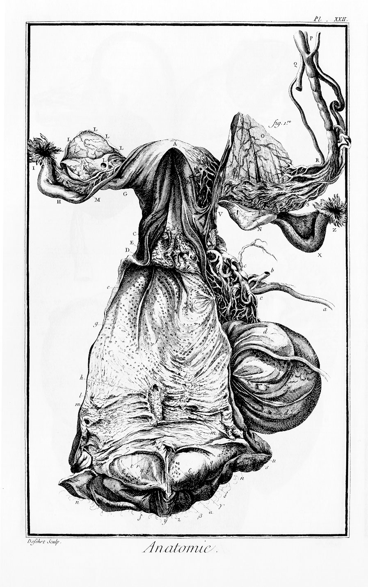](Planche_22.jpeg)

1. d'après Haller.
	- A, la matrice.
	- B, son épaisseur
	- C, son col ouvert de côté.
	- D, éminence formée par son orifice.
	- E, les valvules de son col, qui se sont trouvées dans ce cadavre plus confuses qu'elles ne sont d'ordinaire.
	- F, les oeufs de Naboth.
	- G, le ligament rond.
	- H, la trompe du côté droit.
	- I, ses franges.
	- K, l'ovaire en situation.
	- LL, différens petits oeufs entiers & disséqués.
	- M, les vaisseaux des grandes aîles.
	- N, l'ovaire gauche couvert de cicatrices.
	- O, une portion du péritoine, dont les vaisseaux sont des branches des vaisseaux spermatiques.
	- P, l'artere spermatique.
	- Q, le trone de la veine.
	- R, les petites veines.
	- S, le corps pampiniforme.
	- T, les vaisseaux qui se distribuent à l'ovaire.
	- V, autres vaisseaux qui se distribuent à la matrice.
	- X, la trompe gauche vasculeuse.
	- Y, le ligament large.
	- Z, les franges de la trompe vasculeuse.
	- a, a, les ureteres.
	- b, les branches d'arteres des hypogastriques, qui se distribuent à la matrice.
	- c, plexus formé par les arteres du vagin & celles de la matrice.
	- d, la vessie renversée.
	- e, le vagin.
	- f, la partie postérieure, dans laquelle les rides légeres qui s'y remarquent, sont presque transverses.
	- g, taches qui se remarquent fort souvent dans le vagin.
	- h, i, troncs des rides du vagin.
	- h, tronc antérieur de ces rides.
	- i, autre tronc postérieur & plus petit.
	- k, partie couverte des papilles très-serrées.
	- l, partie formées par les valvules.
	- m, rides intermédiaires transverses.
	- n, n, contours des parties externes de la génération.
	- o, embouchure de l'urethre.
	- p, les grandes lacunes utérines.
	- q, les valvules supérieures.
	- r, leurs sinus supérieurs.
	- s, leurs sinus inférieurs.
	- t, t, les grandes lacunes des sinus supérieurs.
	- u, u, les lacunes des sinus inférieurs.
	- x, x, les glandes sébacées qui se trouvent là.
	- y, le clitoris.
	- z, son prépuce.
	- α, ligne creuse qui répond au milieu du corps du clitoris.
	- β, les lacunes qui se remarquent dans cette ligne.
	- γ, les lacunes qui sont sur les côtés de cette ligne.
	- δ, les nymphes.
	- ε, ε, les glandes des nymphes.

PLANCHE XXII. n°. 2. Detail de la matrice.
------------------------------------------

[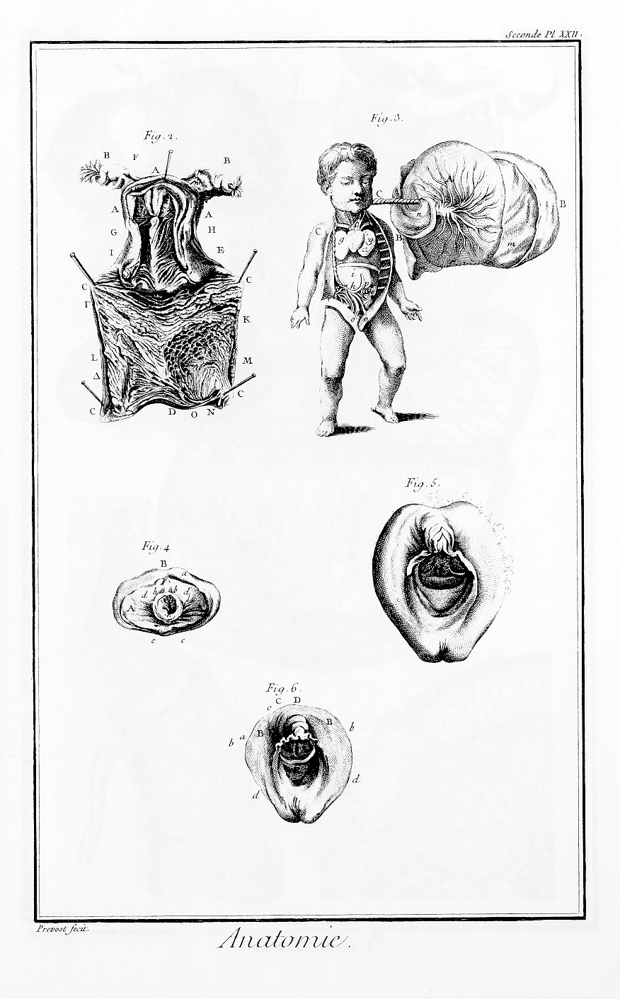](Planche_22-2.jpeg)

2. d'après Haller.
	- A A A, la matrice ouverte postérieurement.
	- B B, les ovaires & les trompes.
	- C, C, le vagin ouvert par la partie antérieure.
	- Γ, sa membrane interne, nerveuse & ridée.
	- Δ, sa chair extérieure fibreuse.
	- D, le petit cercle de l'hymen disséqué.
	- E, l'orifice de la matrice crénelé & rude.
	- F, la cloison de la matrice composée de trois sommets.
	- G, la colonne antérieure & la plus grande du vagin.
	- H, la postérieure.
	- I, les petites valvules du col de la matrice.
	- K, la partie valvuleuse du vagin, voisine de la matrice.
	- L, la colonne antérieure & la plus grande du vagin.
	- M, la colonne postérieure & la plus petite.
	- N, le caroncule intermédiaire.
	- O, la partie proche de l'hymen, composée de valvules circulaires.

3. d'après Kulm.
	- c, la partie de la tête appellée la fontanelle f, le thymus.
	- g, g, les poumons.
	- h, les vaisseaux ombilicaux.
	- i, le foie.
	- A, le placenta.
	- B, les membranes du foetus.
	- m, le chorion.
	- n, l'amnios.
	- C, le cordon ombilical.
	- o, o, les arteres ombilicales.
	- p, la veine ombilicale.
	- q, l'ouraque.

4. Un hymen circulaire & de la forme du calice d'une fleur ; il a été examiné quelques semaines après la naissance d'une fille, par Huber.
	- A A, les grandes levres. La partie saillante au haut de la figure, & en-dedans, au-dessous de la lettre B, le clitoris. Au-dessous du clitoris, au bord supérieur de l'hymen circulaire & de la forme du calice d'une fleur, entre les deux ventricules b, b du vestibule, l'orifice de l'urethre.
	- b, b, les deux ventricules du vestibule. Au centre de la figure, l'hymen circulaire & de la forme du calice d'une fleur, embrassant de tous côtés l'orifice du vagin. En regardant les bords intérieurs de cet hymen, on voit les petits sinus, qui s'étendent jusqu'au concours de la lame supérieure avec l'inférieure. Au centre de la figure & de l'espece de calice que forme l'hymen, la cavité du vagin toute couverte de rides.

5. Les parties externes de la génération d'une fille de quatorze ans, d'après le même. Autour de la figure, les poils des parties naturelles. En suivant la figure, depuis son point le plus élevé jusqu'à son point le plus bas ; la partie saillante, au haut de la figure, le clitoris avec son prépuce. Au-dessous du clitoris, à droite & à gauche, une espece de frange plissée ou de rubans, les nymphes faites comme à l'ordinaire. A droite & à gauche des nymphes, les grandes levres, comme on les voit en A A (fig. 4.) Au-dessous des nymphes & entr'elles, les lacunes, situées au haut du vestibule. A droite & à gauche des lacunes, au-dessous, les deux ventricules. Entre les deux ventricules, & tout- au-dessous, l'orifice de l'urethre. Au-dessous de l'orifice de l'urethre & des deux ventricules, l'entrée du vagin. Au-dessous, la partie qu'on voit elleptique en-bas, & comme terminée en-haut par un arc circulaire concave, désignée par la lettre E, fig. 6. l'hymen. Sous la partie elleptique de l'hymen, le corps charnu, qui le suit & l'entoure jusqu'à son bord le plus élevé, à droite & à gauche où l'on remarque les éminences de ce corps. Au-dessous de l'éminence du corps charnu, la fosse naviculaire, qui regne sur tout le cours de l'éminence du corps charnu. Sous la fosse naviculaire, & dans la direction du milieu de cette fosse à l'anus, le périnée. A l'extrémité & à la partie la plus basse de la figure, entre les deux éminences qu'on y remarque, l'anus.

6. Un hymen contre nature, où s'observe une colonne charnue qui divise l'entrée du vagin en deux segmens inegaux, d'après le cadavre d'une fille âgée de sept ans, par le même auteur.
	- E, l'hymen. Au-dessus de l'hymen E, au milieu de la ligne circulaire concave, qui le termine à sa partie supérieure, la colonne dont il s'agit. Les autres parties, en suivant la figure de haut en bas, comme nous les venons d'expliquer à la figure précédente 5.

[->](../10-Antiquites/Légende.md)
