ANTIQUITÉS
==========

Contenant onze Planches.

PLANCHE I.ere
-------------

[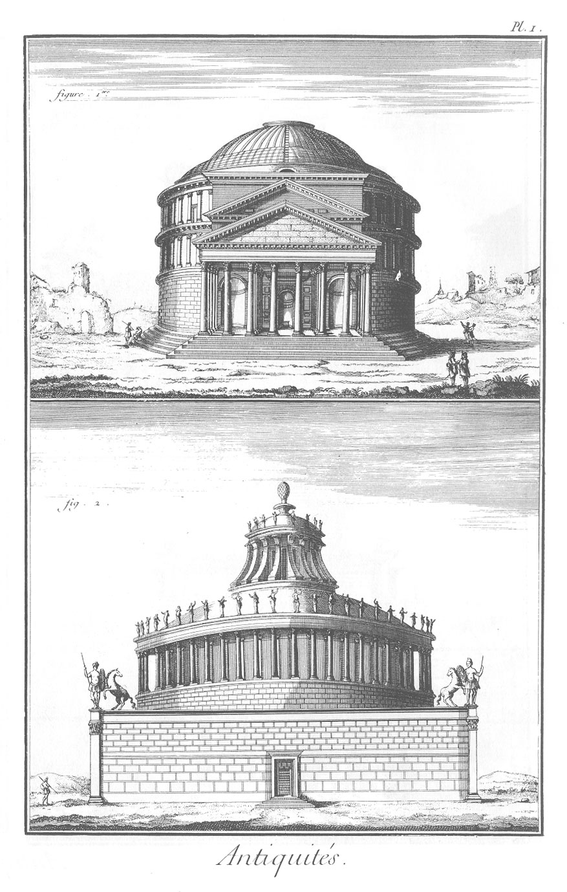](Planche_01.jpeg)

1. Le temple de Jupiter vengeur, ou le Panthéon d'Agrippa.
2. Le tombeau d'Adrien.

PLANCHE II.
-----------

[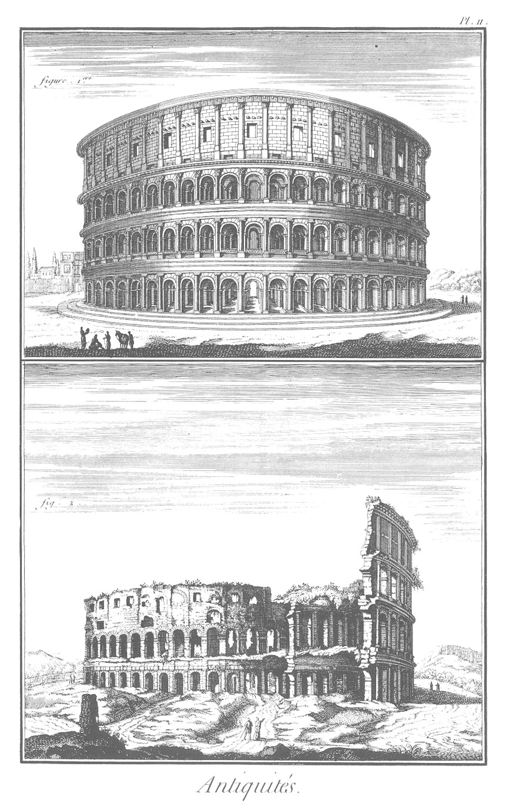](Planche_02.jpeg)

1. L'amphithéatre des Vespasiens fameux par les combats des bêtes & des gladiateurs.
2. Ruine de l'amphithéatre des Vespasiens.

PLANCHE III.
------------

[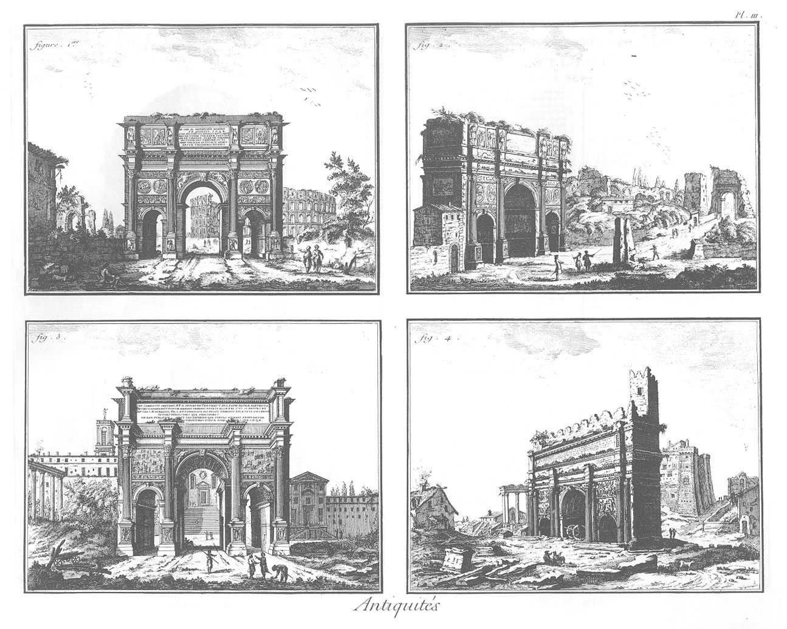](Planche_03.jpeg)

1. &
2. Are de Constantin.
3. &
4. Arc de Septime Sévere.

PLANCHE IV.
-----------

[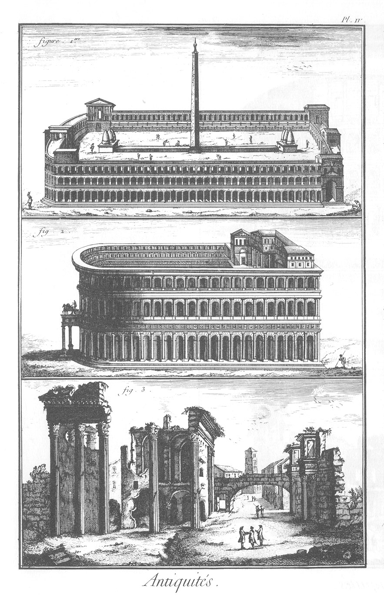](Planche_04.jpeg)

1. Cirque de Caracalla, construit hors de la ville, sur la voie Appienne, dans le voisinage du tombeau des Métellus.
2. Théatre construit par Auguste en honneur de Marcellus, fils de sa soeur.
3. Le forum, ou marché de Nerva : il est aussi connu sous le nom de transitorium, ou passage.

PLANCHE V.
----------

[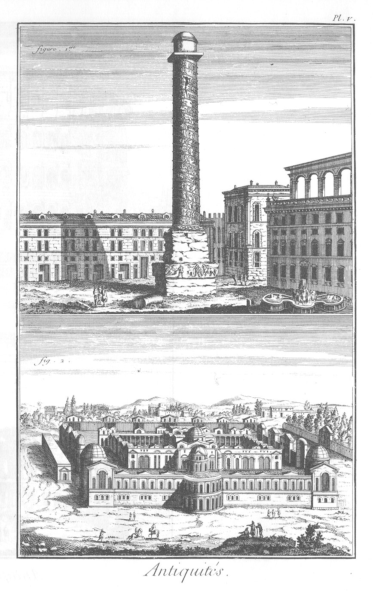](Planche_05.jpeg)

1. Colonne d'Antonin relevée par Sixte-Quint ; sa hauteur est de cent soixante quinze piés.
2. Termes ou bains de Dioclétien, construits sur le mont Viminal.

PLANCHE VI.
-----------

[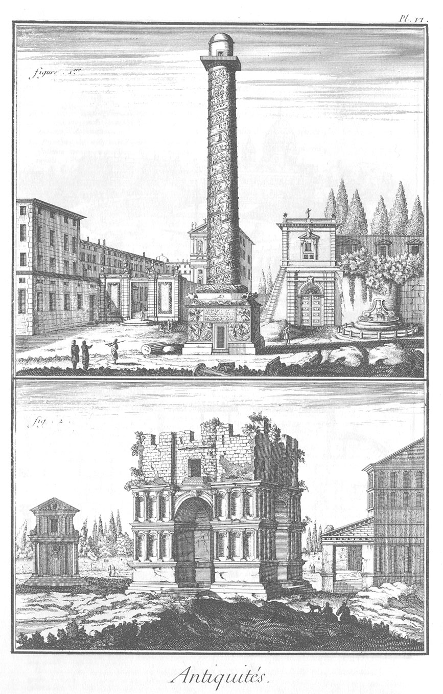](Planche_06.jpeg)

1. Colonne Trajanne. Elle est de marbre ; elle a de hauteur 128 pies sans la base, & 140 avec la base ; elle est faite de 24 pierres.
2. L'édifice construit sous le nom de Janus quadrifrons, ou Janus à quatre faces. Il décoroit le marché ou forum Boarium: quelques-uns l'ont pris mal-a-propos pour le temple de la Paix & de la Guerre.

PLANCHE VII.
------------

[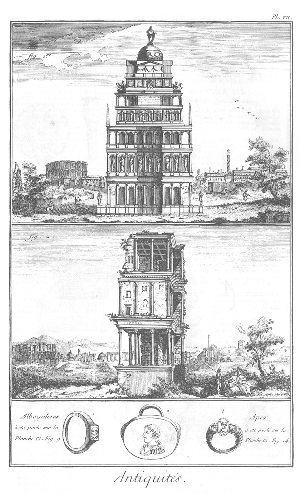](Planche_07.jpeg)

1. Le septizone de Sévere ; il étoit construit entre les monts Palatin & Coelius : c'étoit le tombeau de cet empereur & de ses enfans.
2. Ruines du septizone.
1. &
2. &
3. Anneaux. On verra l'albo galeus, Pl. IX. fig. 9. & l'apex, Pl. IX. fig. 14.

PLANCHE VIII.
-------------

[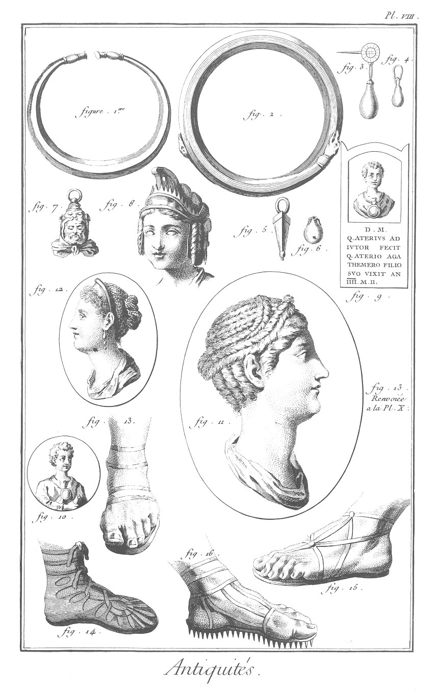](Planche_08.jpeg)

1. &
2. Bracelets.
3. &
4. &
5. &
6. Pendans d'oreille.
7. &
8. &
9. Amulettes.
10. Bulles de jeunes Romains.
11. &
12. Coëffures.
13. &
14. &
15. &
16. Chaussures.

PLANCHE IX.
-----------

[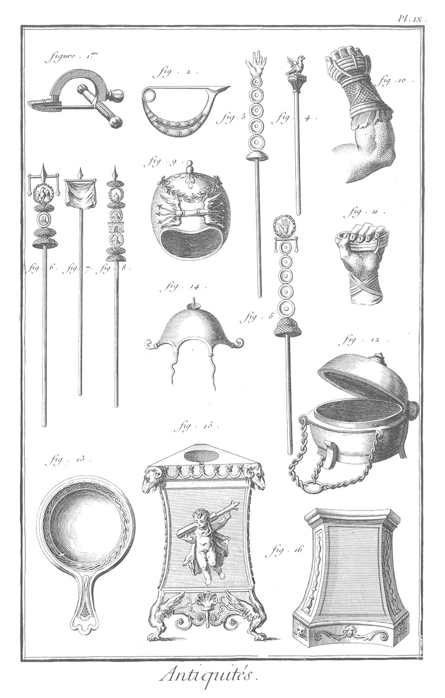](Planche_09.jpeg)

1. &
2. Boucles.
3. &
4. &
5. &
6. &
7. &
8. Enseignes militaires.
9. Albo galerus.
10. &
11. Cestes.
12. Encensoir.
13. Patere.
14. Apex.
15. Trépié.
16. Autel.

PLANCHE X.
----------

[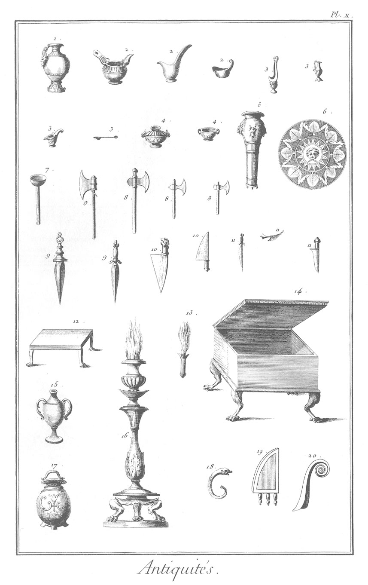](Planche_10.jpeg)

1. Proefericulum.
2. & 2, 2, Sempulum, ou sempurium.
3. & 3, 3, 3, Capides, capuloe, capedines, capedunculoe, capedunculi, urnuloe ligneoe & fictiles ; vaisseaux de bois & de terre à l'usage des sacrifices.
4. & 4, Autres pateres.
5. Benitier, amula, aquiminarium.
6. Disque, discus.
7. Maillet, malleus.
8. & 8, 8, 8, Hache.
9. & 9, Seva, ou sesespita, espece de poignard.
10. & 10, Dolabra, espece de couperet.
11. & 11, 11, Couteaux, cultri.
12. Enclabris, espece de petite table.
13. Aspersoir, aspersorium.
14. Encensoir, acerra.
15. Vaisseaux à l'usage des sacrifices.
16. Candélabre, chandelier, candelabrum.
17. Pot, olla.
18. Clairon, tuba.
19. Gaine, vagina.
20. Baton augural, lituus.

PLANCHE XI.
-----------

[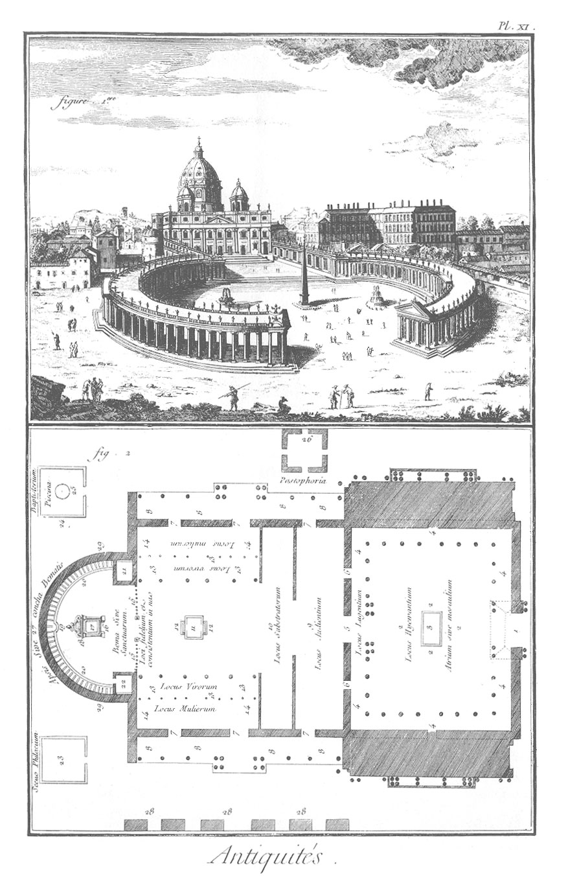](Planche_11.jpeg)

1. Saint-Pierre de Rome.
2. Eglise ancienne. Plan d'une ancienne église avec ses éxédres.
	- 1, propylée ou grand vestibule, ou la premiere entrée dans l'enceinte, ou cour antérieure à l'église.
	- 2, 2, 2, 2, mesaulium ou atrium, ou seconde enceinte, ou cour qui conduit de la premiere ou du propylée ou du grand vestibule à l'église.
	- 3, fontaine d'eau pratiquée au milieu de la seconde enceinte ; on l'appelloit cantharus ou phiala. On s'y lavoit le visage & les mains avant la priere.
	- 4, 4, 4, 4, 4, 4, portiques ou cloîtres pratiqués autour de la seconde enceinte, & appellés narthex extérieur ; c'étoit le lieu des pleurans, locus lugentium.
	- 5, la grande porte de l'église.
	- 6, 6, les deux portes des côtés.
	- 7, 7, 7, 7, 7, 7, portes ouvertes au nord & au midi.
	- 8, 8, 8, 8, 8, 8, 8, 8, portiques ou cloîtres pratiqués au nord & au midi de l'église.
	- 9, lieu des cathécumenes & des auditeurs, locus audientium. Là étoient les juifs & les gentils ; cette partie s'appelloit serula ou narthex intérieur.
	- 10, lieu des prosternés, ou du troisieme ordre des pénitens, avant l'ambon ou le jubé.
	- 11, l'ambon ou le jubé, ou l'endroit où se faisoient les lectures, qu'on appelloit aussi lutrin & pupitre.
	- 12, escaliers antérieurs & postérieurs du jubé.
	- 13, 13, 13, 13, 13, 13, cloîtres ou portiques, ou péristyles intérieurs pour les hommes.
	- 14, 14, 14, 14, cloîtres ou portiques, ou péristyles pour les femmes ; cet endroit s'appelloit cathecumenia ou hyperoa.
	- 15, 15, la balustrade.
	- 16, sanctuaire, appellé aussi bema ou le choeur ou le chancel.
	- 17, l'autel de la communion.
	- 18, le baldaquin qui couvroit l'autel ; cela s'appelloit aussi le pyrgus ou ciborium.
	- 19, stalle de l'évêque.
	- 20, 20, stalles des prêtres. La totalité des stalles s'appelloit ou synthronos ou confessus, ou tribunal ou bema.
	- 21, la petite sacristie, appellée aussi ou secretarium ou diaconium minus.
	- 22, autre édifice appellé prothesis ou le paratorium, ou le trésor, ou une autre sacristie, la grande, ou le lieu des offrandes.
	- 23, le sacrophylacium ou le diaconium magnum, ou le lieu où l'on serroit les vases sacrés.
	- 24, le baptistere.
	- 25, les fonts.
	- 26, le presbytere, les écoles, les bibliotheques.
	- 27, pourtour du sanctuaire, appellé peribolos.
	- 28, éxédres ou bâtimens extérieurs.
	- 29, le chevet de l'église ; l'arcade qui en faisoit l'ouverture, s'appelloit apsis ; le dessus en voûte ou niche, s'appelloit concha.

[->](../11-Architecture_et_Parties_qui_en_Dependent/01-Contenant.md)
