PREMIERE PARTIE.
================

Principes généraux concernant les ordres & les principaux membres d'Architecture.

Nous commençons ces élémens par les ordres d'Architecture, comme la partie qui appartient le plus au goût de l'art, & comme la connoissance la plus indispensable pour acquérir les moyens de juger de la beauté extérieure des édifices en général. D'ailleurs cette connoissance nous conduira dans la suite à concevoir la relation essentielle que les dedans d'un bâtiment doivent avoir avec les dehors, & les moyens de concilier ces deux branches de l'art avec la construction, trois parties qui constituent l'Architecture proprement dite.

PLANCHE I.ere Des cinq ordres d'Architecture.
---------------------------------------------

[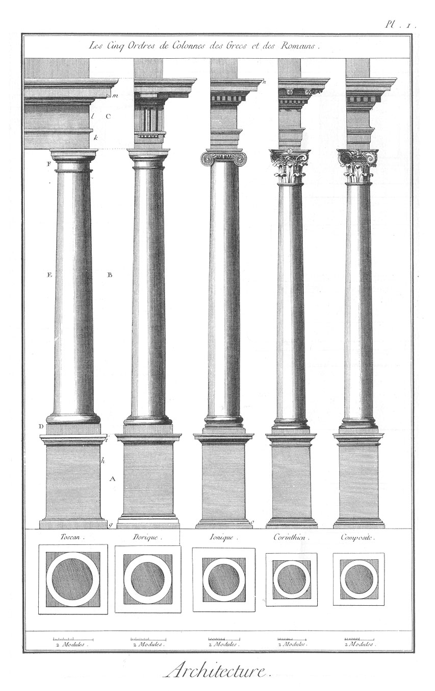](Planche_01.jpeg)

Cette Planche présente les cinq ordres d'Architecture, dont le dorique, l'ïonique & le corinthien sont grecs, & les deux autres romains.

Ces cinq ordres sont réduits ici à une même hauteur, afin qu'on puisse reconnoître par leur diverse grosseur, sur une élévation commune, leurs différens caracteres ; car il faut sçavoir que le toscan connu sous le nom d'or- dre rustique, ne doit avoir de diametre que la septieme partie de sa hauteur, y compris base & chapiteau.

Le dorique, connu sous le nom d'ordre solide, la huitieme partie.

L'ïonique, considéré comme ordre moyen, la neuvieme partie.

Le corinthien & le composite, appellés les ordres délicats, la dixieme partie.

Vitruve a refusé le nom d'ordre à ce dernier, à cause de son égalité de rapport avec le corinthien, prétendant avec raison que ce ne sont point les ornemens qui constituent l'ordre, mais bien la différence du rapport de leur grosseur avec leur hauteur.

Ces cinq ordres sont conformes aux mesures de Vignole, l'un des dix commentateurs de Vitruve, & celui qu'on a suivi en France le plus généralement. Cet auteur donne au piédestal A le tiers de la hauteur de l'ordre B, & à l'entablement C, le quart de B; il conserve cette même proportion pour tous les cinq ordres. Ce n'est pas qu'on ne puisse donner moins de hauteur à l'entablement & au piédestal ; par exemple, réduire A au quart, & C au cinquieme de B, comme le propose Palladio ; ou enfin tenir l'entablement entre le quart & le cinquieme, ainsi que l'enseigne Scammozzy. Mais ces différences de hauteur doivent se déterminer selon l'application qu'on fait des ordres à l'architecture, & la diversité des bâtimens où on les met en oeuvre ; de maniere que c'est à la prudence de l'Architecte de combiner l effet que doivent produire ces hauteurs plus ou moins considérables, toutes trois pouvant également réussir, sçavoir, celle de Vignole, pour les dehors des grands édifices ; celles de Palladio & de Scammozzy, pour leur décoration intérieure.

Le piédestal A, l'ordre B, & l'entablement C, composent donc les trois principales parties d'une ordonnance d'architecture ; mais c'est B qu'on appelle l'or- dre proprement dit, y compris la base D, le fût E, & le chapiteau F: aussi est-ce cet ordre qui donne & assigne au piédestal & à l'entablement leur véritable proportion.

Chacune de ces deux parties principales, ainsi que l'ordre, sont composées à leur tour de plusieurs autres parties ; sçavoir, pour le piédestal, le socle g, le dez h, & la corniche i ; & pour l'entablement, l'architrave k, la frise l, & la corniche m. Toutes ces parties sont encore divisées par d'autres qu'on appelle moulures, dont nous traiterons dans les Planches suivantes.

Ce que nous venons de dire touchant l'ordre toscan, peut s'appliquer aux quatre autres ; leur dimension & la division de leurs membres étant les mêmes, & ne différant que dans les détails & dans l'application de leurs principaux ornemens, ainsi que nous aurons occasion de le faire remarquer ailleurs.

PLANCHE II. Division générale des ordres d'Architecture.
--------------------------------------------------------

[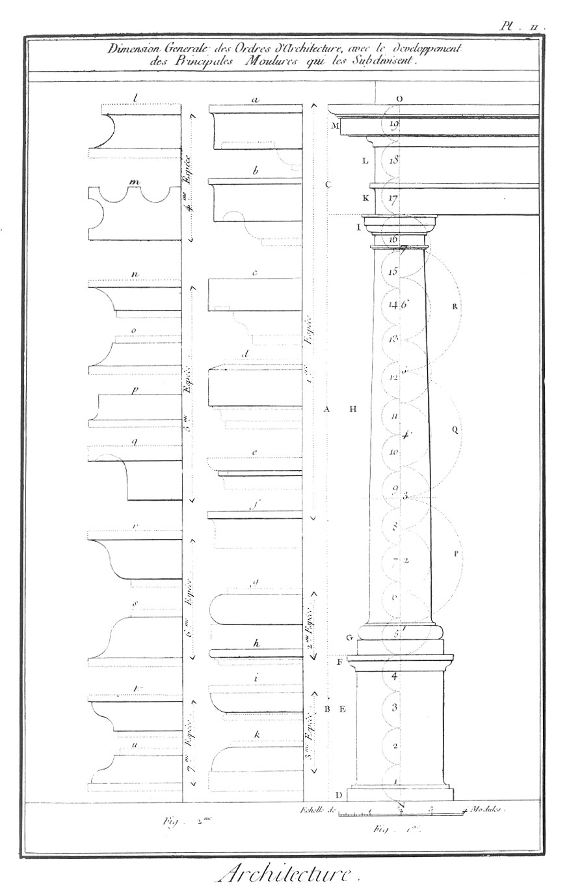](Planche_02.jpeg)

Nous avons dit dans la Planche précédente que, selon Vignole, le piédestal devoit avoir le tiers de la hauteur de l'ordre, & l'entablement le quart. Pour parvenir à trouver cette dimension, il faut diviser la hauteur donnée N, O (fig. 1.), en dix-neut parties égales ; en donner quatre au piédestal B, douze à l'ordre A, & trois à l'entablement C; en sorte que par cette division le piédestal aura le tiers de l'ordre, & l'entablement le quart, ainsi que l'expriment les dix-neufs demi-circonférences 1, 2, 3, 4, 5, &c.

Les divisions marquées par sept autres demi-circonférences, indiquent les sept diametres que doit avoir l'ordre toscan, choisi de préférence dans cette Planche, comme le moins compliqué de tous ; en sorte qu'il est aisé de concevoir que ces sept diametres établissent la hauteur de la colonne toscane, qui par conséquent a aussi quatorze modules, le diametre étant de deux modules ; on conçoit encore que le piédestal devra avoir quatre modules huit minutes, & l'entablement trois modules & demi, l'un étant le tiers, l'autre le quart de l'ordre, comme nous venons de l'observer plus haut.

Quand de cet ordre toscan on voudra passer au dorique, sans rien changer aux dimensions précédentes, on divisera la hauteur de l'ordre A en huit au lieu de sept ; & cette huitieme partie donnera le diametre dorique. Enfin cette même hauteur A sera divisée en neuf pour l'ïonique, & en dix pour le corinthien & le composite.

Il ne faut point oublier que c'est de ces différens diametres, sous une hauteur commune, que les ordres d'Architecture acquierent une expression particuliere, qui donne au toscan un caractere rustique propre aux ouvrages militaires ; au dorique, un caractere solide, propre aux édifices publics ; à l'ïonique, un caractere moyen, propre aux bâtimens d'habitation ; au corinthien, un caractere délicat, propre à la demeure des souverains ; & au composite, un caractére composé, propre aux décorations théatrales, aux fêtes publiques, aux pompes funébres, &c.

Les trois parties D, E, F, expriment, comme dans la Planche précédente, le socle, le dez & la corniche du piédestal ; les lettres G, H, I, la base, le fût & le chapiteau de l'ordre ; les lettres K, L, M, l'architrave, la frise & la corniche de l'entablement.

Les trois demi-circonférences P, Q, R, indiquent la hauteur du fût ; celles d'en-bas constatent le tiers inférieur ; élevées parallelement, elles forment un cylindre ; les deux d'en-haut ensemble, un conoïde tronqué. Il faut sçavoir encore que le fût supérieur de la colonne ne doit avoir que les cinq 6es du diametre d'en-bas ; ce qui fait différer la colonne du pilastre qui est égal dans toute sa hauteur ; d'ailleurs son plan est quarré, au lieu que la colonne doit toujours être circulaire. Voyez dans Vignole la maniere de trouver cette diminution, & de tracer la courbure nommée concoïde, qui forme les deux côtés du conoïde.

L'échelle qui se voit au bas de la figure premiere, est de quatre modules ; le module est toujours le demi-diametre de l'ordre ; ce module se divise en douze minutes pour les ordres toscan & dorique, & en dix-huit, pour les ordres ïonique, corinthien & composite. Ainsi le fût inférieur de l'ordre toscan est de deux modules ou de vingt-quatre minutes, & le fût supérieur est d'un module deux tiers, ou de vingt minutes ; ainsi pour les autres membres de cet ordre & des ordres qui suivent.

La deuxieme figure offre les sept différentes especes de moulures à l'usage non-seulement des ordres, mais aussi de tous les membres d'Architecture. La premiere espece a, b, c, d, e, f, est de moulures quarrées ; la deuxieme g, h, de moulures décrites par des demi-cercles ; la troisieme i, k, de moulures décrites par des quarts de cercle ; la quatrieme l, m, de moulures appellées concaves. la cinquieme n, o, p, q, de moulures appellées cavêts, congés & gorges ; la sixieme & la septieme, marquées r, s, t, u, de moulures appellées sinueuses. Il en est encore de composées, d'applaties, de chantournées, &c. qui se tracent à la main ou au compas, & auxquelles on donne plus ou moins de mouvement, selon l'application qu'on en veut faire dans l'Architecture, pour la pierre, le plâtre, le marbre, le bois, le fer, le bronze, &c.

On a observé d'accompagner les différentes moulures tracées dans cette Planche, de tous les membres qui peuvent indiquer les relations que les unes & les autres doivent avoir ensemble. Pour cela, on remarquera qu'aux moulures quarrées on a pris soin de ponctuer les moulures circulaires qui les peuvent accompagner ; & qu'aux moulures circulaires on a pareillement ponctué les moulures quarrées qui les couronnent ou les soutiennent ; précaution qui doit faire juger plus promptement de leur enchaînement, sur-tout lorsqu'on voudra les comparer avec celles de l'entablement de la Planche huitieme.

PLANCHE III. Des différentes especes de moulures.
-------------------------------------------------

[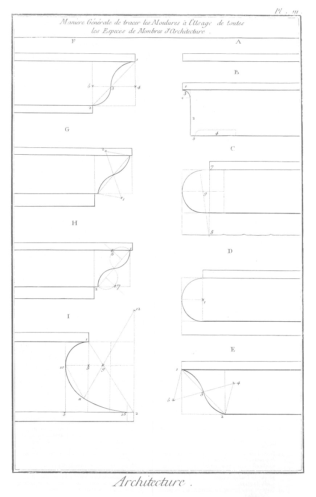](Planche_03.jpeg)

La moulure A est une petite moulure qu'on appelle filet, reglet ou listeau, composé de deux lignes paralleles, & qui se place entre les grandes moulures quarrées & circulaires, pour apporter de la variété aux différens membres des corniches.

La moulure B est une grande moulure quarrée appellée larmier ; c'est la plus saillante de toutes les moulures de cette espece ; elle se place alternativement entre les cimaises dans les corniches des entablemens. 1 est le listeau qui couronne ordinairement cette moulure. 2 est appellé la plate-bande de ce larmier. 3 est un congé qui unit la partie verticale de la plate-bande avec la saillie du listeau. 4 est un canal pratiqué ordinairement sous le sophite ou plafond de cette moulure quarrée, lequel sert à écouler les eaux du ciel, qui tombent sur la saillie de ce membre saillant. C'est ce canal 4 qui a fait donner à cette moulure le nom de larmier ou gouttiere, parce qu'il fait écouler l'eau larme à larme, ou goutte à goutte de dessus la corniche à laquelle ce membre sert de couronnement. 5 est un listeau qui éloigne le canal 4 de la face ou plate-bande 2, pour procurer à cette derniere une certaine solidité.

Les moulures C, D, sont des moulures appellées to- res, à l'usage de toutes les bases des ordres ; celle D'se trace par un demi-cercle dont le centre 1 détermine la moitié de la hauteur de cette moulure ; celle C, est un tore composé & tracé par les foyers 8 & 9, à dessein d'applatir sa partie supérieure, pour découvrir le listeau 7, qui couronne cette moulure, & que l'on suppose être élevé dans un édifice fort au-dessus de l'oeil du spectateur.

Les moulures E, F, sont appellées doucines, rangées dans la classe des moulures sinueuses ou ondulées ; elles sont destinées aux cimaises des corniches. Celle E se trace par le moyen de deux triangles équilatéraux 1, 5, 3, & 3, 4, 2; celle F se trace par deux quarts de cercle, dont les points 4, 5, servent de foyers. Si dans cette moulure on ne veut pas faire les quarts de cercle égaux, on peut diviser la diagonale 1, 2, en neuf parties égales, & faire la portion 1, 3, de cinq neuviemes, & celle 3, 2, des quatre neuviemes restans, selon que cette moulure sera droite ou renversée, au-dessus ou au-dessous de l'oeil, &c. car il est bon de remarquer que chacune des moulures dont nous parlons, peuvent également s'employer dans les parties supérieures ou inférieures des ordres ; telle, par exemple, que se remarque la doucine droite de la corniche marquée n, & la doucine renversée o de la base du piédestal de l'ordre ïonique de la premiere Planche. En général ces moulures ont autant de saillie que de hauteur.

Les moulures G, H, sont appellées talons, moulures qui ne different des deux précédentes, qu'en ce qu'elles sont tracées en sens contraire, c'est-à-dire que la portion concave des premieres est convexe dans celles-ci ; de même pour les autres portions. Le talon G est décrit par deux triangles équilatéraux, dont les sommets 1, 2, servent de centres. Celui H est au contraire tracé par l'extrémité du rayon de deux demi-cercles marqués 6, 7, formant autant de perpendiculaires élevées sur la diagonale 1, 2.

La moulure I est une scotie nommée rond creux ou nacelle ; elle sert aux bases des ordres ïonique, corinthien & composite pour faire opposition au tore qui est une moulure convexe, & avec celle dont nous parlons, elle forme une agréable diversité, lorsqu'elles sont séparées par des listeaux, comme il s'en remarque à la base attique de la Planche VI. Cette moulure se trace de deux manieres ; on appelle celle I, moderne, & celle de la Planche quatrieme, marquée K, antique. Pour tracer la moderne, il faut diviser sa hauteur & sa saillie en trois également ; & du point 8, comme centre, décrire la premiere portion de cercle 1, 10; ensuite du point 9, sommet d'un triangle équilatéral, décrire la portion de cercle 10, 11; puis du point 11 au point 9, prolonger une oblique au point 12 qui, comme centre, servira à décrire la troisieme portion de cercle 11, 15; le reste de cette courbe se tracera à la main depuis 15 jusqu'à 2.

PLANCHE IV. Suite des différentes especes de moulures.
------------------------------------------------------

[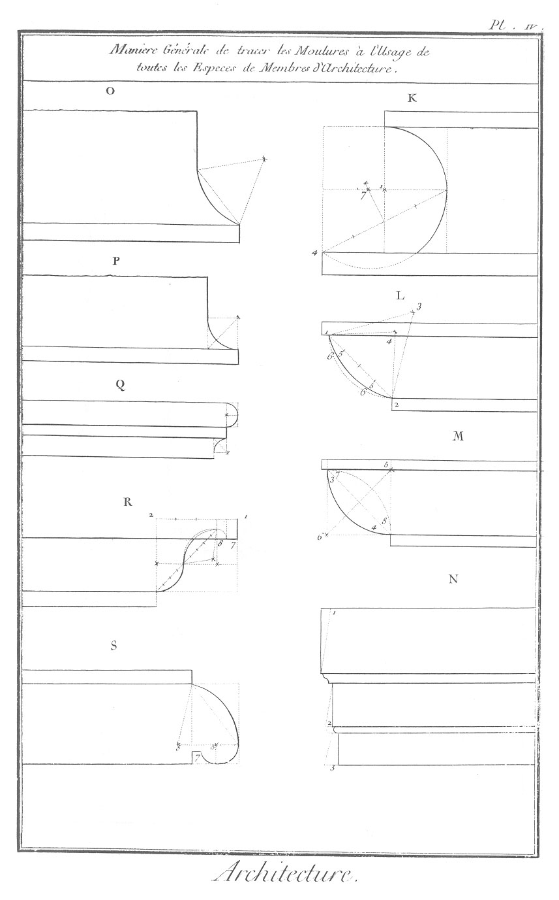](Planche_04.jpeg)

La moulure K est la scotie appellée antique, qui se décrit par les deux centres 1, 7; elle est moins estimée que la moderne, à cause de sa cavité inférieure, & de la vive arrête qu'elle forme vers 4; défaut qui ne la fait guere mettre en oeuvre que dans l'intérieur des appartemens, ou dans les dehors seulement, lorsqu'on préfere le marbre à la pierre, comme en usoient les Grecs & les Romains. Les lignes ponctuées, qui indiquent la construction de cette moulure, nous dispensent d'une plus grande explication.

Les moulures L, M, sont des quarts de rond, appellés ainsi, parce qu'assez communément elles se tracent par un quart de cercle ; mais comme toutes les especes de moulures dont nous parlons, doivent appartenir à des ordres qui ont chacun une différente expression ; que par conséquent ces moulures sont obligées d'avoir plus ou moins de concavité ou de convexité, on les trace par diverses portions de cercle que démontre la théorie, mais que le plus souvent la pratique néglige ; par exemple, le quart de rond convexe 3, 4, & le quart de rond concave 7, 8 de la figure M, sont tous deux tracés par les deux angles 5, 6 d'un quadrilatere qui leur sert de foyer. Ces deux quarts de rond sont destinés aux décorations viriles ; au contraire les deux courbes de la figure L, décrites, sçavoir, celle 5, 5, par le sommet 3 d'un triangle équilatéral ; celles 6, 6, par le sommet 4 d'un triangle isocele, présentant moins de solidité, rendent ces moulures plus propres au caractere moyen & délicat des ordres ïonique, corinthien & composite.

Les moulures de la figure N sont destinées aux architraves, aux chambranles des croisées, aux archivoltes, aux impostes, & ne sont autre chose que plusieurs plates-bandes séparées les unes des autres par de petites moulures, telles qu'il s'en remarque dans l'architrave de l'ordre corinthien ; quelquefois même, pour donner encore moins de saillie aux membres qui contiennent ces plates-bandes, on incline en-dehors la surface de ces dernieres, comme l'expriment les lignes ponctuées 1, 2, 3, & comme on le remarque à l'architrave du petit ordre intérieur de l'église de l'Oratoire à Paris.

Les moulures O, P, sont appellés congés ; ce sont des especes de cavets qui servent aux fûts des colonnes ou pilastres, pour réunir les moulures horisontales de l'astragal & du listeau de la base, avec la partie verticale de ce même fût : celle O se trace par le sommet d'un triangle équilatéral ; celle P, par l'angle d'un quadrilatere.

La moulure Q est composée d'une baguette, d'un filet & d'un congé. La baguette se trace par un demi-cercle, & le congé par un quart de cercle. Ce membre est destiné principalement à couronner la partie supérieure du fût des colonnes & des pilastres : il sert aussi dans les corniches des entablemens & des bases des colonnes, ainsi qu'on en remarque plusieurs dans les Planches VI. & VII.

La moulure R est une doucine comme celles E, F, de la planche précédente, mais à laquelle on a ajoûté un cavet 8, pour procurer un canal renfoncé au sophite d'un larmier, & former un listeau 7 sur le devant, ainsi que nous l'avons expliqué en parlant du membre B, Planche III.

Enfin la moulure S est une moulure composée appellée bec de corbin ; elle est tracée par deux courbures : la premiere tracée par le sommet du triangle équilatéral 8 ; la deuxieme, par le foyer 5. Dans la partie inférieure de cette moulure, on a observé un grain d'orge 7, espece de petite moulure quarrée & ravalée, qui sert à détacher les grandes moulures circulaires d'avec celles qui sont quarrées, dans le dessein de donner plus de jeu, plus d'effet, & une certaine articulation à toutes les moulures d'une corniche.

Tous ces membres sont susceptibles d'enrichissemens ; on y applique des ornemens selon qu'ils font partie des ordres ïonique, corinthien, ou composite ; quelquefois même les moulures de l'ordre dorique peuvent en recevoir : mais il n'en faut jamais revêtir celles de l'ordre toscan, quoiqu'il s'en remarque à la colonne trajane & dans quelques-uns de nos édifices françois. Il seroit même bon d'user avec discrétion des ornemens sur les moulures en général ; du-moins devroit-on les reserver pour les dedans des bâtimens. Dans les dehors ces ornemens sont sujets à ne présenter que de petites parties ; ils corrompent la forme des moulures ; d'ailleurs ils se dégradent par l'impression de l'air, se noircissent en peu de tems, & ne présentent plus à l'oeil, & vûs de quelque distance, qu'une confusion mal entendue.

PLANCHE V. Des piédestaux.
--------------------------

[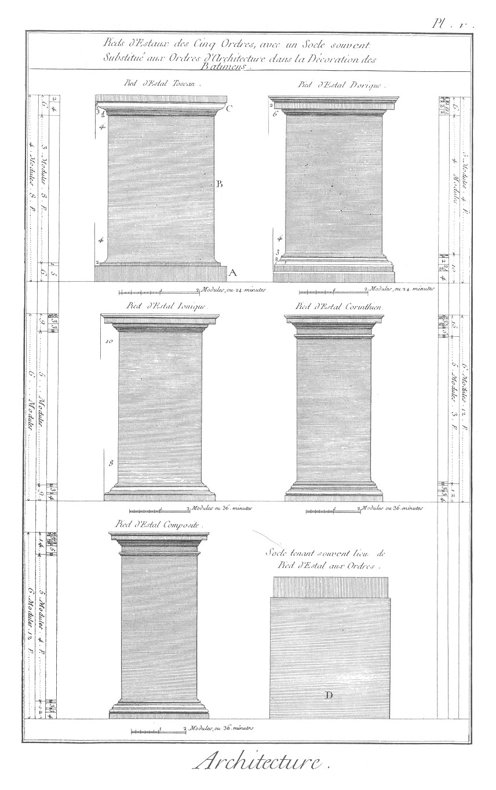](Planche_05.jpeg)

Cette Planche offre les piédestaux que les anciens ont ajoûté aux ordres d'Architecture : presque tous ont varié sur leur hauteur. Ici nous donnons ceux de Vignole, qui, comme nous l'avons remarqué, leur a établi le tiers de la colonne, y compris base & chapiteau. Chaque piédestal est composé d'une base A, d'un dez B, & d'une corniche C Les deux membres A & C sont ornés de plusieurs moulures assorties à l'expression de chaque ordre. Quelquefois l'on enrichit le dez B d'une table. Il faut avoir attention, dans l'ordre toscan, de faire cette table saillante, d'araser la dorique, de faire l'ïonique rentrante, ainsi que celles des piédestaux corinthiens & composites ; mais d'orner ces dernieres de quelques moulures.

Nous remarquerons que non-seulement les piédestaux de Vignole sont trop élevés, mais qu'en général cette innovation des modernes se contredit avec la pratique d'élever plusieurs ordres les uns sur les autres, parce que les piédestaux des ordres supérieurs produisent des porte-a-faux considérables sur ceux de dessous ; ce qui nous incline à croire qu'à l'exception des édifices publics, qui n auroient qu'un seul ordre, & où on les pourroit employer par tolérance, il n'en faudroit jamais faire usage dans les bâtimens d'habitation, mais seulement d'un socle, tel que le représente la fig. D ; socle qui pouvant être réduit au quart de l'ordre au plus ou au diametre au-moins, procure plus d'élévation à l'ordre, & évite la plus grande partie des porte-à-faux dont nous voulons parler. Il faut remarquer que ce socle doit avoir un peu plus de longueur que le dez du piédestal : celui-ci est réduit à la saillie de la base de l'ordre ; au lieu que le socle doit l'excéder de chaque côté d'une minute ou d'une minute & demie.

On trouvera dans cette Planche toutes les mesures des moulures des piédestaux selon Vignole : néanmoins on peut les varier à l'infini, selon la richesse ou la simplicité de chaque ordre, & selon leurs diverses applications à l'Architecture. Par exemple, nous ne pouvons le dissimuler, la corniche C du piédestal toscan n'est guere supportable ; elle est trop pauvre & trop matérielle, comparaison faite avec celle des autres piédestaux du même auteur. D ailleurs une corniche, pour être appellée telle, doit être composée de trois membres, & celle dont nous parlons n'en a que deux ; ce qui la doit faire rejetter absolument. A l'égard des moulures des autres corniches, elles peuvent recevoir quelques changemens, à la vérité, mais du moins elles ont un caractere convenable & une dimension générale assez analogue à l'expression de chaque ordre que leur piédestal soutient.

PLANCHE VI. Des bases.
----------------------

[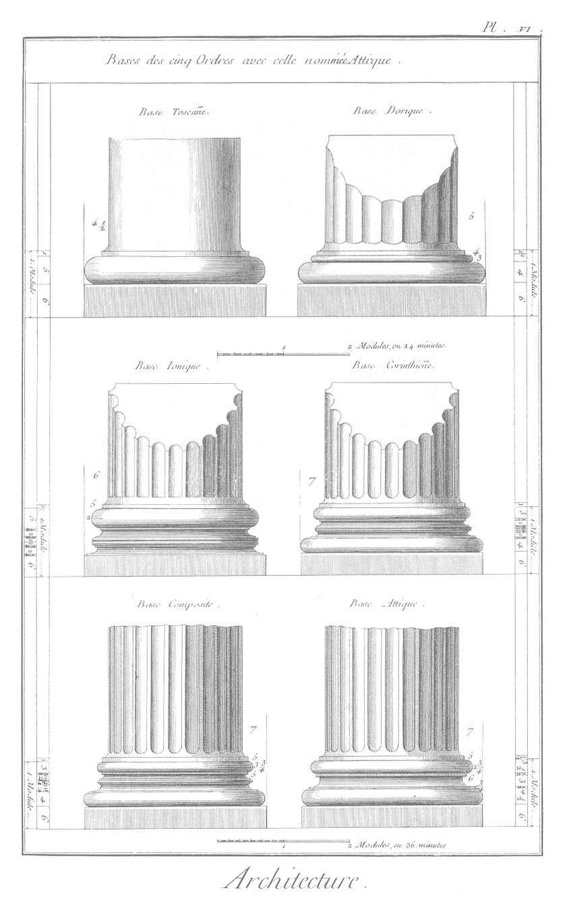](Planche_06.jpeg)

Les bases n'ont été introduites aux colonnes que lors de la construction du temple de Diane à Ephèse. Les Grecs avoient employé avant cette époque leur ordre dorique sans bases : mais dans la suite ils ne tarderent pas à s'appercevoir combien cet empatement étoit nécessaire au pié de la colonne. A juger des moulures de la base ïonique de cette Planche, la même que celle de Vignole qui la tient de Vitruve, & celui-ci de l'antiquité, on doit reconnoître que toutes les parties de l'Architecture ont eu leur enfance, & que les moulures des bases corinthiennes & composites n'ont guere été exécutées avec un plus heureux succès, principalement lorsqu'on les compare avec celle de la base nommée attique mise au jour par les Athéniens ; base qui a été composée si judicieusement, que le plus grand nombre de nos modernes l'ont employée à tous les ordres, à l'exception du toscan. Cette approbation générale de la base attique, nous paroît néanmoins un abus. La base dorique de Vignole a une beauté de convenance qu'il est bon de lui conserver ; aussi sa richesse progressive avec la toscane l'a-t-elle fait préférer par plusieurs de nos célebres architectes françois : en sorte que nous croyons que la base nommée attique doit être substituée seulement à l'ordre ïonique, & que, lorsqu'on la voudra faire servir aux ordres corinthiens & composites, comme elle seroit trop simple, on lui ajoûtera plusieurs baguettes, sans être obligé d'avoir recours à la multiplicité des scoties qu'on remarque dans les deux bases des ordres dont nous parlons. Autrement ces scoties, accompagnées ordinairement de plusieurs listeaux & baguettes, produiront trop de petites parties, ainsi qu'on le peut observer dans cette Planche, dont l'échelle de la base toscane & celle de la base dorique sont divisées en douze minutes, & celles des ordres ïonique, corinthien & composite en 18.

PLANCHE VII. Des cannelures & des chapiteaux.
---------------------------------------------

[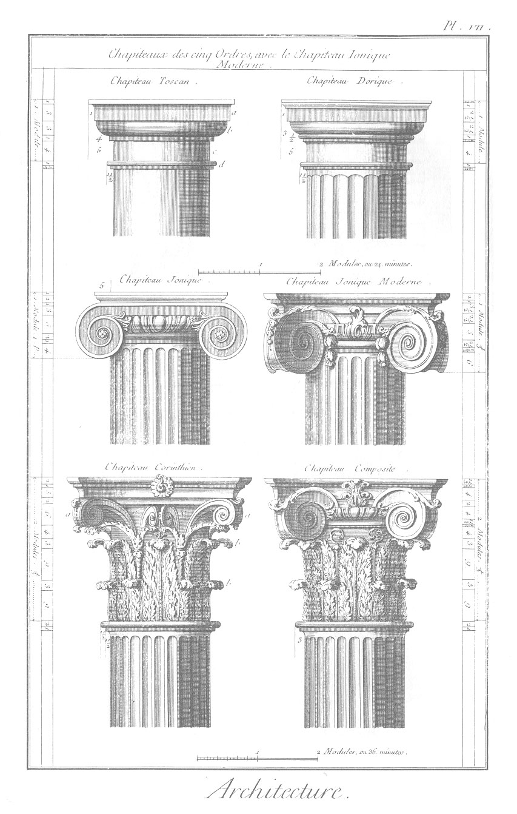](Planche_07.jpeg)

On a tracé sur cette Planche, ainsi que sur la précédente, les cannelures des fûts des colonnes dorique, ïonique, corinthienne & composite, l'ordre toscan ne devant jamais avoir de cette espece d'enrichissement, parce que la cavité des cannelures ne convient point à la rusticité de cet ordre ; ensorte que, lorsqu'on en veut orner la tige, on introduit des bossages qui lui ajoutent par leur relief un caractere de fermeté.

Les cannelures de l'ordre dorique sont à vive arrête, & beaucoup plus méplates que celles des autres ordres, dans le dessein d'altérer le moins possible la solidité de sa tige ; mais malgré l'opinion de Vignole à cet égard, qui la tient de Vitruve, nous pensons que cette vive arrête non-seulement efface à l'oeil la circonférence de la colonne, mais qu'elle lui procure une légéreté apparente qui ne peut aller avec son caractere viril ; caractere que le listeau qui se remarque entre chaque cannelure des autres ordres, lui restitueroit : aussi le plus grand nombre de nos architectes ont-ils observé ce listeau à l'ordre dorique. Au reste, les cannelures doivent s'employer avec discrétion dans les colonnes & les pilastres. Cet enrichissement semble ne devoir avoir lieu que lorsque les membres principaux de l'ordre sont ornés ; & dans ce cas il peut même être chargé de sculpture pour plus de magnificence, & pour procurer à l'ordonnance un plus parfait assortiment, de maniere que la base, le fût & le chapiteau ne fassent qu'un seul & même tout qui donne le ton au piédestal, à l'entablement & aux différentes parties de l'édifice.

Cette Planche, qui a pour objet d'offrir les chapiteaux des cinq ordres avec le chapiteau ïonique moderne, nous porte à dire un mot en particulier de leurs différentes moulures & ornemens.

Le chapiteau toscan, le plus simple de tous, est composé d'un tailloir a, d'une cimaise b, d'un gorgerin c, plus d'un astragal d, mais qui appartient au fût de la colonne.

Le chapiteau dorique est composé des mêmes membres, mais il est plus orné de moulures ; la proportion de son ordre étant moins rustique qu'au précédent, il paroît convenable que la division de ses parties soient en plus grand nombre.

Le chapiteau ïonique, couronnement de l'ordre moyen, non-seulement est aussi composé d'une plus grande quantité de moulures, mais il est enrichi d'ornemens & de volutes qui, selon l'opinion de plusieurs historiens, ont été appliqués à cet ordre, d'après l'idée de la coeffure des dames de la Grece, à qui cet ordre féminin doit sa proportion, comme l'ordre dorique masculin doit la sienne à la proportion d'un homme robuste. Ce chapiteau nommé antique, differe de celui qu'on appelle moderne, en ce que ses deux parties latérales sont dissemblables ; disparité qui a fait imaginer à Scammozzy le second chapiteau ïonique qui se remarque dans cette Planche, appellé communément le chapiteau ïonique moderne, & dont le plan du tailloir concave dans ses quatre faces autorise huit volutes angulaires ; au lieu que les quatre faces rectilignes du chapiteau antique n'en peut recevoir que quatre, sçavoir, deux sur chaque face principale, & deux coussinets dans ses deux faces latérales, ainsi que Philibert Delorme l'a exécuté au palais des Tuileries du côté des jardins.

Le chapiteau corinthien est regardé comme le chef-d'oeuvre de Callimaque, sculpteur grec ; chapiteau qui a été imité par tous nos modernes, & qui n'a guere souffert d'altération que par la négligence de quelques-uns de nos artistes ; chapiteau enfin qui a donné naissance à l'ordre qui porte son nom, & qui est appellé par Scammozzy, en faveur de son élégance, ordre virginal. Ce chapiteau est composé de huit volutes a, de deux rangs de feuilles b, & de huit caulicules c ; ses feuilles s'imitent de l'Olivier ou de l'Acante, selon leur application à l'Architecture. Les chapiteaux corinthiens de l'intérieur de l'église du Val-de-grace passent pour les plus estimés de ceux qui se voyent à Paris.

Le chapiteau composite, ouvrage des Romains, n'est autre chose que l'assemblage des feuilles du chapiteau corinthien, & des volutes du chapiteau ïonique moderne. Ces feuilles se font ordinairement à l'imitation du persil, & quelquefois se symbolisent, à raison de la dédicace du monument où on les met en oeuvre.

Il se fait encore d'autres chapiteaux qu'on appelle composés, parce qu'ils contiennent divers attributs relatifs à la guerre, aux beaux arts, à la marine, &c. mais ces sortes de productions appartenant plûtôt à la Sculpture qu'à l'Architecture, ne doivent jamais faire changer de nom à l'ordre, comme l'ont prétendu plusieurs de nos artistes, qui, en faveur de quelque altération qu'ils ont faite à leur chapiteau, ont donné à leurs colonnes ou pilastres le nom d'ordre françois, d'ordre espagnol, &c. comme si les ornemens constituoient l'ordre, & non le rapport de leur tige comparé avec leur diametre inférieur.

PLANCHE VIII. Des entablemens.
------------------------------

[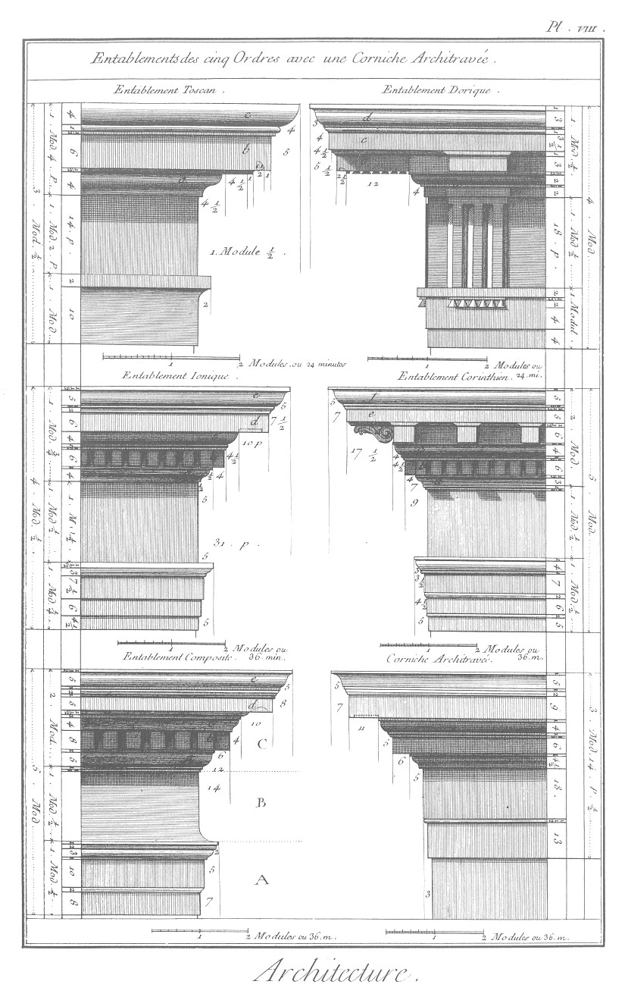](Planche_08.jpeg)

Les entablemens sont les couronnemens des ordres ; chacun d'eux doit par sa solidité, sa légéreté, sa simplicité ou la division de ses membres, porter le caractere de l'ordre auquel il appartient. Les cinq entablemens, tracés sur cette Planche d'après Vignole, offrent ce que nous exigeons ici. La corniche toscane est composée de trois membres principaux, sçavoir, a, b, c ; la dorique de quatre, a, b, c, d ; l'ïonique, de cinq, a, b, c, d, e ; la corinthienne de six, a, b, c, d, e, f ; la composite, comme membre qui appartient à un ordre moins délicat par ses ornemens que le corinthien, n'en a que cinq, comme l'ïonique, sçavoir, a, b, c, d, e.

Nous avons déjà dit que les entablemens étoient composés de trois parties principales, sçavoir, l'architrave A, la frise B, l'entablement C. Les frises sont ordinairement des membres lisses, à l'exception de celles de l'ordre dorique, & quelquefois de la corinthienne & de la composite, où l'on introduit des bas-reliefs de sculpture, des guirlandes, &c. Les architraves au contraire sont ornées de moulures, mais avec cette différence qu'elles sont méplates & seulement couronnées d'une cimaise. Les plates-bandes des architraves suivent la progression des membres des corniches. Par exemple, l'architrave toscan n'est composée que d'une plate-bande & d'un listeau ; la dorique, de deux & d'un listeau ; l'ïonique, de trois & d'une cimaise ; la corinthienne est aussi de trois plates-bandes & d'une cimaise, mais séparées chacune d'une moulure ; la composite, de deux, couronnées d'une cimaise.

De tous ces entablemens de Vignole, le toscan, le dorique, & le corinthien méritent la préférence. Nous desirerions des modillons dans la corniche ïonique, ainsi que le propose Palladio, & moins de pesanteur & de pauvreté dans la corniche & l'architrave composites.

On appercevra par les cottes de ces entablemens le rapport que Vignole a cherché à donner à chacun d'eux ; il nous suffira seulement de faire remarquer ici que l'architrave toscan est de douze minutes de hauteur, la frise, de quatorze, sa corniche, de seize, enfin la saillie, de dix-huit ; progression arithmétique qui rend son procédé facile, & qui produit le plus grand effet, ainsi qu'on le peut voir dans la plûpart de nos édifices françois, où leurs ordonnateurs ont suivi Vignole, de préférence à tous les autres commentateurs de Vitruve ; sçavoir, Hardouin Mansard, au toscan de l'orangerie de Versailles ; François Mansard, au dorique du château de Maisons ; Philibert Delorme, à l'ïonique du palais des Tuileries ; Perrault, au corinthien du péristyle du Louvre ; Le Veau, au composite du château du Rinci ; autant d'apologies pour Vignole, & d'autorités pour nos jeunes architectes. Cependant il faut convenir que le plus grand nombre, lorsqu'ils ont employé l'ïonique & le composite, ont préféré les entablemens de Palladio ; exemple, l'ïonique de la façade de Versailles, du côté des jardins, le composite du palais des Tuileries, &c.

Lorsqu'on ne peut employer les trois membres de cet entablement, quelquefois on supprime la frise, pour ne composer alors qu'une corniche architravée ; mais cette licence n'est bonne à mettre en oeuvre que dans la décoration d'un appartement, & jamais dans les dehors, malgré l'usage inconsidéré de plusieurs de nos artistes à cet égard, un entablement mutilé ne pouvant raisonnablement servir de couronnement à un ordre régulier, ainsi qu'on le peut remarquer dans les façades extérieures du château de Saint-Cloud, de celui de Montmorency, & ailleurs.

PLANCHE IX. Des balustrades.
----------------------------

[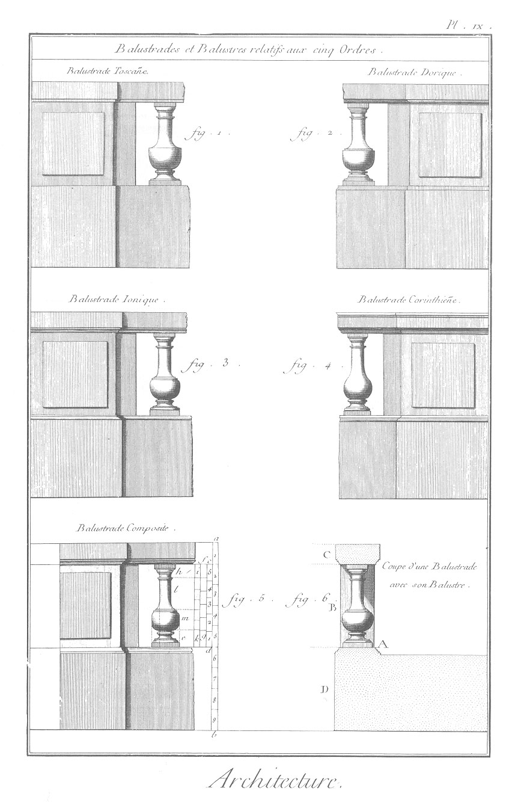](Planche_09.jpeg)

Les ordres d'Architecture, dont nous venons de parler, ayant donné les proportions aux piédestaux & aux entablemens, il est naturel de penser que tous les autres membres qui appartiennent à l'Architecture, doivent aussi tenir leurs proportions & leurs mesures de ces mêmes ordres, & qu'il doit y avoir autant de chaque espece de membres qu'il y a d'especes d'ordres.

Les balustres & les balustrades, qui ordinairement se placent aux pieds des colonnes, ou qui leur servent de couronnement, doivent donc non-seulement tenir leur expression des ordres, mais être de cinq especes, pour satis faire au caractere particulier de chacun d'eux considéré séparément. Donnons les dimensions de leurs principaux membres, d'après les mesures de celles qui nous ont paru exécutées dans nos bâtimens avec le plus de succès, & sans avoir égard à ce que nous en avons déjà dit ailleurs.

La balustre, espece de petite colonne, a donné le nom à la balustrade, appui dont la hauteur est ordinairement réglée entre deux piés & demi, & trois piés un quart. Il n'est est pas de même des balustrades qui servent de couronnement aux ordres d'Architecture ; elles doivent en apparence avoir le quart de la hauteur de la colonne, & en réalité un demi-module de plus. C'est sur ces dernieres mesures que sont dessinées les balustrades de cette Planche, ensorte que si ces balustrades de couronnement devoient servir d'appui, on supprimeroit la hauteur du socle en-dedans, comme on le voit en A: car il faut observer que dans tous les cas des balustrades, le balustre qui occupe la hauteur du dez B, soit égal au diametre de l'ordre, & que la tablette C soit de la hauteur du quart du balustre ; ensorte que l'inégalité qu'on sera obligé de donner aux différentes hauteurs des balustrades, sera portée sur celle du socle D, sans jamais rien changer ni aux balustres ni à sa tablette. Supposons donc ici une balustrade de couronnement, & assignons un moyen de parvenir facilement à la division de ses parties, moyen qui servira également aux balustrades d'appui, excepté pour ce qui regarde la hauteur des socles sur lesquels sera rejettée la différence qu'on est obligé de donner aux balustrades, à raison de leur application dans l'art de bâtir.

Soit donnée la hauteur d'une balustrade a, b, réduite au quart de l'ordre, plus un demi-module ; divisez cette hauteur a, b en neuf parties ; donnez-en quatre au socle D, quatre au dez B, & une à la tablette C.

Pour trouver les dimensions du balustre, divisez c, d en cinq, & faites la hauteur du piédouche e d'une de ces parties ; ensuite divisez f, g en cinq, donnez une de ces parties à la hauteur du chapiteau h ; enfin divisez la hauteur i, k, entre le piédouche & le chapiteau, encore en cinq, & donnez trois de ces divisions au col l, & deux à la hauteur de la panse m.

La largeur du col aura la moitié de la largeur de la panse, & celle-ci le tiers de la hauteur du balustre pour l'ordre corinthien, & les deux cinquiemes pour la panse du balustre toscan, les autres par une moyenne arithmétique.

A l'égard des moulures qui diviseront les principaux membres des balustres & des balustrades, elles doivent être prises dans celles des ordres auxquels appartiendra chaque balustrade. Les contours du galbe, du col & de la panse doivent aussi dépendre de l'expression plus ou moins délicate de l'ordre ; autrement on parviendroit peut-être à faire un bon balustre, mais qui n'étant pas relatif à l'ordonnance dont il feroit partie, offriroit un balustre ou une balustrade toscane sur une ordonnance corinthienne, ainsi qu'on le remarque au palais des Tuileries, ou une balustrade corinthienne sur un ordre dorique, comme on le voit au Luxembourg.

PLANCHE X. Des portes.
----------------------

[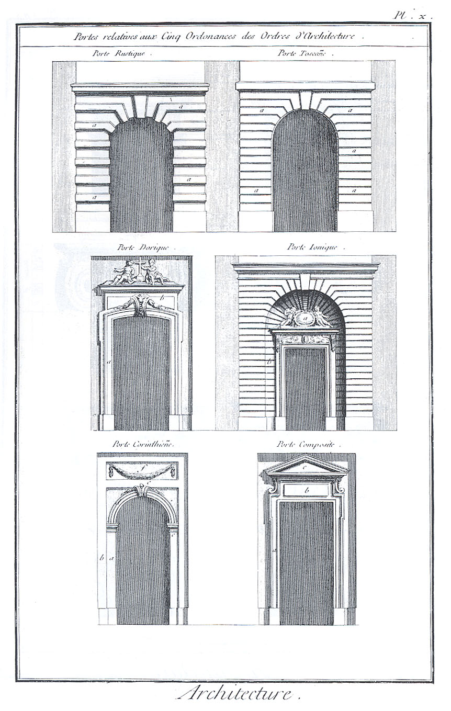](Planche_10.jpeg)

La proportion des portes, c'est-à-dire le rapport de leur hauteur avec leur largeur, doit dépendre de l'expression de l'ordonnance dont elles feront partie. Les anciens & la plus grande partie des architectes du dernier siecle, d'après le sentiment de Vitruve & de Vignole, ont donné à toutes les hauteurs de leurs ouvertures le double de leur largeur. Nos modernes ont pensé que cette hauteur commune à toutes les ouvertures, ne pouvoit aller aux cinq ordres, qui chacun ont des proportions différentes ; en conséquence ils ont conservé la hauteur du double de l'ouverture, pour les portes toscanes, ce double & un sixieme aux portes doriques ; ce double & un quart, aux ïoniques ; & ce double & demi, aux corinthiennes & composites.

La forme des ouvertures est encore une chose essentielle à observer. Il s'en fait de quatre manieres, sçavoir, de surabaissées, comme la porte rustique ; de plein ceintre, comme la porte toscane & corinthienne ; de bombées, comme la porte dorique ; à plates-bandes, comme la porte ïonique & la composite. Mais il faut sçavoir que de ces quatre formes d'ouvertures, le plein ceintre & la plate-bande sont les plus approuvées.

Après la proportion & la forme des portes, vient l'application de leurs ornemens. Ceux des portes rustiques ne doivent être que des bossages a ; ceux des portes toscanes, des refends a ; les portes doriques peuvent avoir des chambranles a, & être couronnées d'attique b ; les portes corinthiennes peuvent avoir des amortissemens a, & être enfermées dans une tour creuse, tel qu'on le remarque à la porte de l'hôtel de Conty, dont ce dessein est une copie ; les portes corinthiennes peuvent avoir pour enrichissement des piédroits a, des aletes b, des impostes c, des archivoltes d, des claveaux e, & être surmontées de tables tranchantes f, ornées de guirlandes ; enfin, les portes composites peuvent être ornées de chambranle a, d'amortissement b, & d'un fronton c, ainsi que se remarque celle du rez-de-chaussée de l'intérieur de la cour du Louvre ; autant de membres d'Architecture & d'ornemens qui peuvent se varier à l'infini, mais dont l'application, le relief & l'expression doivent se puiser dans les ordres, dans les entre-colonnemens desquels ces ouvertures sont ordinairement placées.

PLANCHE XI. Des croisées.
-------------------------

Les croisées doivent avoir les mêmes proportions que les portes, parce que toutes les ouvertures dans un bâtiment doivent avoir les mêmes rapports : les ornemens sont à-peu-près dans le même cas, mais leur forme doit différer, les ceintres surbaissés & les pleins ceintres ne convenant qu'aux ouvertures des portes ; & les arcs bombés & les plates bandes semblant devoir être consacrés seulement aux ouvertures des croisées. Certainement chaque membre dans l'Architecture porte un caractere établi par l'usage, dont on ne doit s'écarter que par de bonnes raisons : cependant cette considération a paru arbitraire à la multitude ; d'où il est résulté qu'au lieu de faire de belles portes & de belles croisées dans nos bâtimens françois, on n'a plus songé qu'à faire des percemens dans les murs de face, sans égard à la beauté des formes, à la conformité de l'ordonnance, & à la relation que les vuides doivent avoir avec les pleins, dans la décoration de nos édifices. C'est en pure perte, pour le grand nombre, qu'on remarque au Louvre, au Luxembourg, à la Sorbonne, des desseins en ce genre d'un goût exquis ; on imite ceux des Tuileries, du Palais Royal & tant d'autres fort au-dessous de ceux que nous citons, sans songer que les croisées se répétant à l'infini dans un bâtiment, c'est vouloir multiplier la médiocrité, que de négliger l'étude de cette partie intéressante de la décoration.

La croisée rustique de cette Planche est à appui plein ; la toscane offre un balcon de fer placé ici pour faire sentir l'abus de ce genre frivole, auquel on devroit toujours substituer une balustrade, comme à la croisée dorique, sur-tout lorsque l'on est forcé de faire descendre le bas de l'ouverture jusques dessus le sol des appartemens. La croisée ïonique est couronnée d'une mézanine, non que cette deuxieme ouverture soit toujours nécessaire, mais pour en présenter un exemple. Les croisées corinthiennes & composites sont à l'imitation de celles du Louvre, & offrent autant de modeles qui peuvent servir d'autorité, mais qui, comme les portes, peuvent se varier à l'infini, selon l'application qu'on en veut faire dans l'Architecture.

PLANCHE XII. Des niches & des frontons.
---------------------------------------

[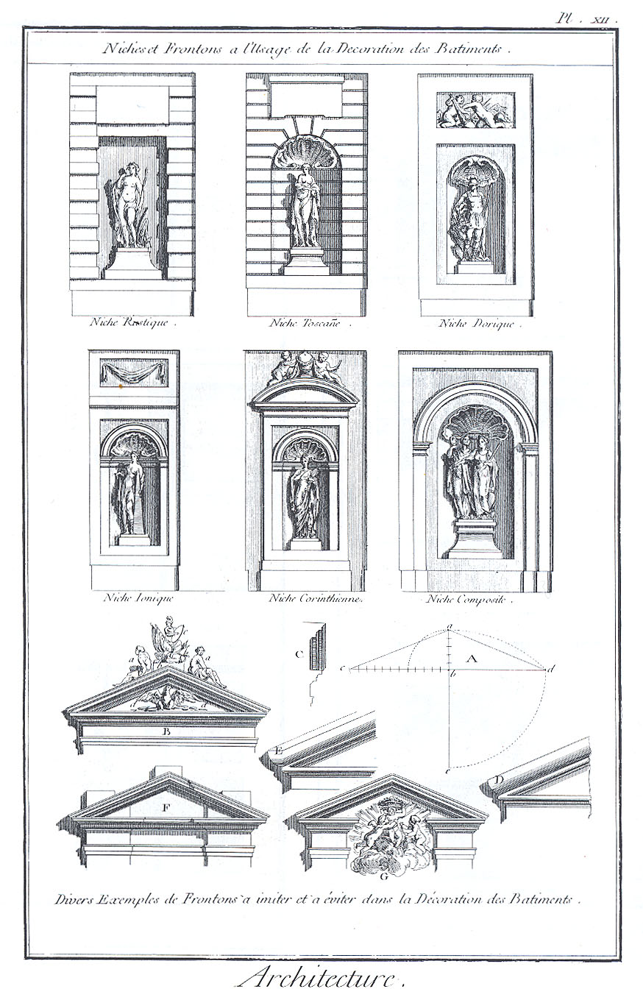](Planche_12.jpeg)

Les niches dans l'Architecture tiennent de la proportion des portes & des croisées. Ce sont des cavités prises dans l'épaisseur des murs, destinées à recevoir des statues. Il s'en fait de deux especes ; les unes quarrées par leur plan, & en plate-bande dans leur sommet, comme on le voit à la niche rustique ; les autres, dont le plan est décrit par un demi-cercle, & dont le sommet plein ceintre forme un cul de four, ainsi que le présentent les autres niches de cette Planche.

Il faut observer que, soit que le diametre des niches soit grand, petit ou moyen dans une même ordonnance de bâtiment, il faut que toutes puissent contenir une figure de même grandeur, c'est-à-dire égale au tiers de la hauteur de l'ordre qui préside dans la décoration de l'édifice ; de maniere que, dans le cas où ce rapport ne pourroit avoir lieu, il faudroit éviter l'application des niches. Disons un mot du moyen de faire servir les statues d'une hauteur égale dans des niches de différente grandeur. Par exemple, dans les petites niches on se contentera de poser sous les piés de la statue un socle, comme il s'en remarque dans les niches dorique, ïonique & corinthienne ; dans les moyennes niches, au lieu de socle, on placera un piédouche, comme dans les ni- ches toscane & rustique. Enfin dans les grandes niches, non-seulement on groupera les figures, mais on placera un piédestal, comme dans la niche composite ; de maniere que par les différentes hauteurs des piédestaux, des piédouches ou des socles, les statues d'une hauteur égale pourront être placées dans des niches de diverses grandeurs.

En général il ne faut pas abuser de l'emploi des niches dans l'Architecture ; il devroit être réservé pour les édifices sacrés, les fontaines, les châteaux d'eaux, & autres édifices hydrauliques. Dans les maisons des particuliers elles attaquent la solidité des murs, & ne présentent à l'oeil que des figures plus petites que nature, qui rendent l'ordonnance de la décoration chétive & mesquine ; ce qui ne peut arriver dans les monumens publics, à cause de leur grandeur, toujours fort au-dessus de celle des bâtimens d'habitation.

Au bas de cette Planche on remarque plusieurs desseins de frontons. La figure A donne la maniere de tracer leur hauteur par leur base, c'est-à-dire que la perpendiculaire a du triangle isocele a, c, d, qui les compose, soit à la base c, d de ce triangle. comme cinq est à vingt-quatre ; ce qui est la même chose que le procédé de décrire le quart de cercle d, e, pour du point e, comme centre, tracer la portion d, a ; portion qui détermineroit la courbure du fronton circulaire, de même hauteur que le fronton triangulaire.

En général les frontons circulaires ont plus de pesanteur réelle, & présentent une forme plus matérielle à l'oeil que les triangulaires ; aussi doit-on ne les employer que dans les ordonnances rustique & toscane, malgré la multitude d'exemples contraires.

La figure B présente la forme d'un fronton la plus réguliere, c'est-à-dire un entablement continu & une corniche angulaire ; à l'égard des ornemens de sculpture, le mieux seroit de n'en jamais mettre dessus les frontons, parce que c'est employer deux amortissemens pyramidaux l'un sur l'autre ; mais particulierement on devroit toujours éviter les figures a posées sur les corniches inclinées ; le socle horisontal b semblant autoriser celle c, ainsi qu'on le remarque avec succès au château de Seaux, du côté de l'entrée. Au contraire, le tympan d devroit toujours être destiné à recevoir quelques bas reliefs, & c'est à quoi se devroit réduire toute la richesse de ces couronnemens, qui néanmoins, comme les niches, devroient être consacrés pour la décoration de nos temples, ou n'être employés que sur les avant-corps principaux des palais des Rois & des édifices publics, & jamais dans la décoration des bâtimens particuliers.

La figure C offre la coupe ou profil du fronton B.

La figure D fait voir la partie angulaire de l'extrémité du fronton, tel qu'on l'exécute dans l'Architecture réguliere, de préférence à la crossette que présente la figure E, qui, de même que celles F, G, ne sont placées ici que comme des exemples à éviter, ainsi qu'une infinité d'autres frontons enroullés, découpés, chantournés ; productions gothiques qui ne sont imitées de nos jours, que par les architectes subalternes, & que les grands maîtres sçavent rejetter.

[->](../03-Seconde_partie-Les_Principes_des_trois_ordres_grecs/Légende.md)
