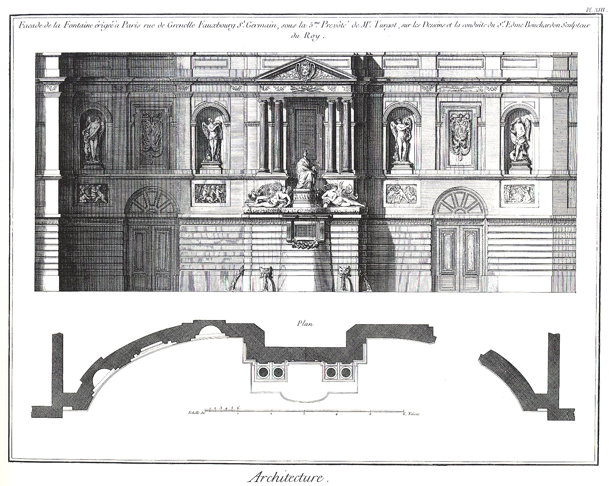
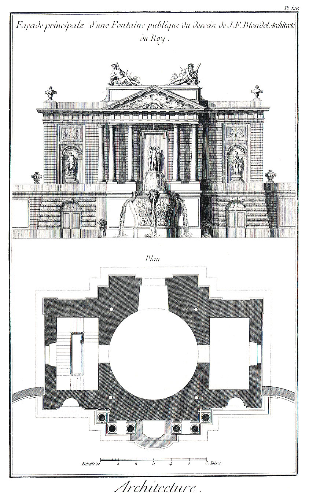

SECONDE PARTIE.
===============

Observations générales sur les trois ordres grecs appliqués en particulier à plusieurs monumens érigés pour la magnificence.

La connoissance des ordres que nous venons d'acquérir seroit insuffisante, si nous ne cherchions pas à connoître l'application que nous en devons faire dans la décoration des bâtimens. Nous avons déjà dit qu'il en étoit de cinq especes, trois grecs & deux romains. Les trois Planches suivantes vont nous offrir l'application des trois premiers dans la fontaine de Grenelle faubourg S. Germain, d'ordre ïonique ; dans le projet d'une autre fontaine, d'ordre dorique ; & dans la colonade du Louvre, d'ordre corinthien. A l'égard des deux derniers, toscan & composite, production des Romains, nous n'avons point donné d'exemple de leur application dans l'Architecture : il suffit de sçavoir que le toscan, ordre rustique, ne doit être employé que dans les ouvrages militaires, ou dans l'Architecture civile, dans les dépendances des grands bâtimens, tels qu'aux orangeries, comme à Versailles, aux écuries, &c. & que l'ordre composite, composé lui-même des autres ordres, mais toûjours d'une expression corinthienne, ne peut guere être employé que dans les décorations théatrales, aux fêtes publiques, dans les pompes funébres, &c. malgré l'usage qu'en ont fait quelques-uns de nos architectes au portail des Minimes, au château de Clagny, &c.

Nous ne craignons pas de l'avouer ici ; la juste application des ordres à l'Architecture est plus essentielle que l'on ne se l'imagine ordinairement. Combien ne voyons-nous pas de bâtimens dont l'usage intérieur exige extérieurement un air de solidité, & qui ont pour décoration dans leur dehors un ordre moyen ou délicat ; & d'autres dont la destination semble exiger de l'élégance, avoir dans leur façade un ordre ou une expression rustique, comme s'il étoit indifférent de négliger la relation que ces deux parties doivent avoir ensemble? Mais passons aux explications des trois Planches de cette deuxieme partie ; elles nous donneront occasion de discuter plus précisément l'opinion des architectes modernes à cet égard.

PLANCHE XIII. Fontaine de Grenelle, faubourg S. Germain.
--------------------------------------------------------

Ce monument élevé par la ville de Paris en 1739, sur les desseins de M. Bouchardon, Sculpteur du Roi, qui a présidé à la conduite de l'Architecture, & exécuté la sculpture qui s'y remarque, est un des édifices modernes qui fait le plus d'honneur à notre siecle. En effet une architecture pure, un appareil correct, une construction solide, & une sculpture admirable, sont autant de beautés réunies qu'on rencontre difficilement ailleurs. Nous ne parlerons point ici de la situation de ce monument ; personne n'ignore que ce chef-d'oeuvre méritoit un tout autre point de vûe : mais, nous l'avons déjà dit, cette partie est trop négligée en France. Nous ne pouvons dissimuler encore que l'ordre ïonique qui détermine le caractere de l'ordonnance de ce monument, non seulement n'exprime pas assez de solidité, mais paroît d'un trop petit module pour l'étendue de l'édifice. Il semble que l'ordre dorique devroit être le propre des bâtimens de l'espece dont nous parlons. Une fontaine suppose des voûtes dans son intérieur, d'épaisses murailles, un volume d'eau dont le poids est considérable, une humidité difficile à parer ; autant de motifs qui veulent être annoncés dans la décoration de ses dehors, par un caractere viril que l'ordre ïonique ne peut offrir. Nous concevons bien que cette fontaine est dédiée à la ville de Paris, & que cette divinité féminine a pû autoriser l'ordre ïonique dans le frontispice du temple qui paroît être élevé derriere elle. Mais nous le pensons ainsi. Le premier mérite de l'artiste est de faire ensorte de concilier les accessoires de la décoration avec la convenance de l'édifice. Le premier objet qui doit frapper l'oeil du spectateur, c'est le caractere propre à la chose ; autrement, l'esprit est distrait : on remarque bien les beautés de détail ; mais les vraies beautés sont celles de l'ensemble ; toutes les autres doivent lui être subordonnées. Au reste, cette réflexion, qui nous est particuliere, n'empêche pas que ce monument ne soit très-recommandable : aussi l'avons-nous préféré dans cette collection, pour exemple, à la fontaine des Innocens, autre chef-d'oeuvre, mais dont l'architecture corinthienne nous a paru encore plus desassortie à l'idée qu'on doit se former d'un bâtiment hydraulique.

Comme il ne s'agit dans cette deuxieme partie que de l'application des ordres à l'Architecture, & non de la description de chaque monument en particulier, nous n'entrerons dans aucun détail pour ce qui regarde la beauté de l'ordonnance, ni sur le choix des parties, ni sur la maniere de profiler, ni sur la distribution des ornemens. L'aspect du lieu, ou l'inspection de la Planche que nous donnons, dédommageront suffisamment de notre silence à cet égard.

PLANCHE XIV. Autre fontaine d'ordre dorique.
--------------------------------------------

Nous venons d'éprouver en quelque sorte, à-propos de la Planche précédente, la nécessité de faire choix de l'ordre dorique pour la décoration des bâtimens hydrauliques. Nous ajoutons ici cet exemple, non pour nous mettre en parallele avec l'habile artiste qui a donné les desseins de la treizieme Planche, mais pour donner à connoître si une plus grande architecture, une sculpture moins colossale, & l'application de l'ordre viril, peuvent convenir plus véritablement aux monumens dont nous parlons ; nous convenons qu'alors la virilité de cet ordre semble exiger des ornemens & une sculpture qui lui soit assortie, & qu'en conséquence il conviendroit de dédier l'édifice à Neptune, à quelque fleuve, &c. plûtôt qu'à Amphytrite, à quelques Nayades, &c. Mais en supposant que le lieu où se doit élever le monument, ne permette que des attributs ou des allégories féminines, il nous semble qu'il seroit préférable, malgré l'analogie que doit avoit avoir la Sculpture avec l'Architecture, de rendre cette derniere relative au genre de l'édifice, comme l'objet principal, plûtôt que de chercher à la faire dépendre des accessoires. Ajoutons à cela que cet ordre, quoique solide, peut s'enrichir & se disposer de maniere à pouvoir recevoir tel symbole que la nécessité semblera exiger.

Si ce que nous avançons paroît avoir quelque fondement, il n'est donc pas aussi indifférent qu'on se l'imagine ordinairement, d'appliquer un ordre plûtôt qu'un autre dans un édifice de genre différent ; ce qui n'arrive le plus souvent que parce qu'on ignore le vrai caractere, la véritable expression de chacun d'eux. Nous l'avons déjà dit, nous le répétons, l'ordre toscan ne devroit jamais être employé que pour les ouvrages militaires, ou dans l'Architecture civile pour les dépendances des bâtimens d'habitation de quelqu'importance ; l'ordre dorique, pour les édifices publics ; l'ordre ïonique, pour les maisons de plaisance ; l'ordre corinthien, pour les palais des Rois ; l'ordre composite, aux monumens élevés pour la magnificence. Mais comme notre objet dans ces élémens est de ne parler que de l'application des trois ordres grecs, dorique, ïonique & corinthien, & que nous n'avons point d'édifice dorique régulier à citer en France, nous avons donné ce dessein de fontaine d'ordre dorique (a), afin de prendre occasion de parler de ces trois ordres en particulier, & de leur application en général dans l'Architecture.

Nous venons de dire qu'il n'y avoit point d'ordre dorique régulier. Avant de passer à l'ordre corinthien, disons un mot de ce que nous entendons par la régularité de cet ordre.

Les Grecs, à qui nous devons la découverte des proportions de l'ordre dont nous parlons, avoient conçu qu'une de ses beautés principales devoit consister dans la symétrie ; ce qu'ils ont exécuté avec le plus grand succès ; mais comme ils n'accouploient pas les colonnes, & que les modernes en ont connu la nécessité à certains égards, plusieurs ont tenté en vain de concilier cette régularité des Grecs avec les accouplemens ; en sorte que les uns ont fait pénétrer les bases & les chapiteaux, comme on le voit au portail des Minimes ; les autres, pour éviter ce défaut, ont fait leurs métopes oblongues ou barlongues, comme on le remarque à Saint-Gervais ; ceux-ci ont renflé leurs colonnes, comme au bureau des marchands drapiers ; ceux-là ont donné un module de plus à leur ordre, comme au portique de la cour royale du château de Vincennes ; autant de tentatives infructueuses que d'autres enfin ont cru éviter, en se privant de l'application de cet ordre dans leurs productions : extrémité peut-être plus condamnable encore, parce qu'elle détruit l'esprit de convenance, & qu'elle prive la plus grande partie de nos édifices du caractere qui leur convient. Tant d'irrésolutions & d'incertitudes nous ont portés à chercher un moyen moins imparfait que tous les précédens, & que nous avons employé dans plus d'une occasion avec quelqu'avantage. Nous en allons donner le précis.

La difficulté de l'accouplement consiste en ce que les Grecs n'ont donné de l'axe d'un trigliphe à l'autre, que deux modules & demi, qui valent trente minutes, le métope étant d'un module & demi, & le trigliphe d'un module, & que lorsque les colonnes & les pilastres sont accouplés, il faut nécessairement que d'un axe de colonne à l'autre il y ait trente-quatre minutes, chaque demi-diametre étant d'un module, & chaque base de cinq minutes ; en sorte que trente minutes données par les Grecs, ne pouvant satisfaire à trente-quatre minutes qu'exige l'accouplement des modernes, il faut nécessairement hausser la frise de l'entablement de trois minutes, qui, au lieu de dix-huit, en aura vingt-un, pour donner ensuite vingt minutes à la largeur du métope, & quatorze à celle du trigliphe, qui ensemble égaleront trente quatre minutes nécessaires pour le bas des colonnes accouplées deux à deux. De ce procédé il s'ensuit à la vérité que l'entablement acquiert trois minutes de plus que le quart de la hauteur de la colonne ; mais il faut observer que non-seulement cette proportion a été sujette à variation dans tous les tems ; que d'ailleurs cette partie supérieure est toujours fort élevée de l'oeil du spectateur ; & qu'enfin cette augmentation est préférable à faire un entablement de quatre modules un quart porté sur une colonne dorique de dix-sept modules, ainsi que Le Vau l'a pratiqué à son portique de Vincennes déjà cité; systême qui renverse les lois fondamentales de l'art, & qui ôte absolument à l'ordre le caractere de virilité qu'il nous paroît essentiel de lui conserver.

Ce moyen qui n'est pas sans inconvénient, nous paroît moins licencieux que tous les autres, & peut faire appliquer cet ordre à tous les édifices où son expression paroîtroit convenable, en observant cependant que les mesures que nous venons de donner, ne regardent que les angles saillans, & que lorsqu'il paroîtra nécessaire, pour donner plus de mouvement à son ordonnance, de pratiquer des angles rentrans qu'il faudra donner à ces derniers d'un axe de trigliphe à l'autre, trente-sept minutes, au lieu de trente quatre, afin que les mutules placés sous le sophite du larmier supérieur de la corniche soient aussi sans aucune espece de pénétration. Autrement, on ne doit faire aucun cas de la décoration de ce genre, parce que celle-ci n'étant mise en oeuvre que pour embellir nos édifices, elle doit plaire à tous les yeux, loin d'offrir la confusion & le desordre qu'on remarque dans presque tous nos bâtimens françois où cet ordre préside. (Voyez ce que nous avons déjà dit des fontaines, Tome VII. page 102.)

(a) Cette Planche auroit dû précéder la fontaine de Grenelle ; mais comme cette ordonnance dorique est de notre composition, nous avons jugé à propos dans ces élémens de faire passer la production de M. Bouchardon avant la nôtre, comme un juste tribut que nous devons aux ouvrages de cet artiste célebre. 

[->](../04-Troisieme_partie-Exemples_d'édifices_sacrés/Légende.md)
