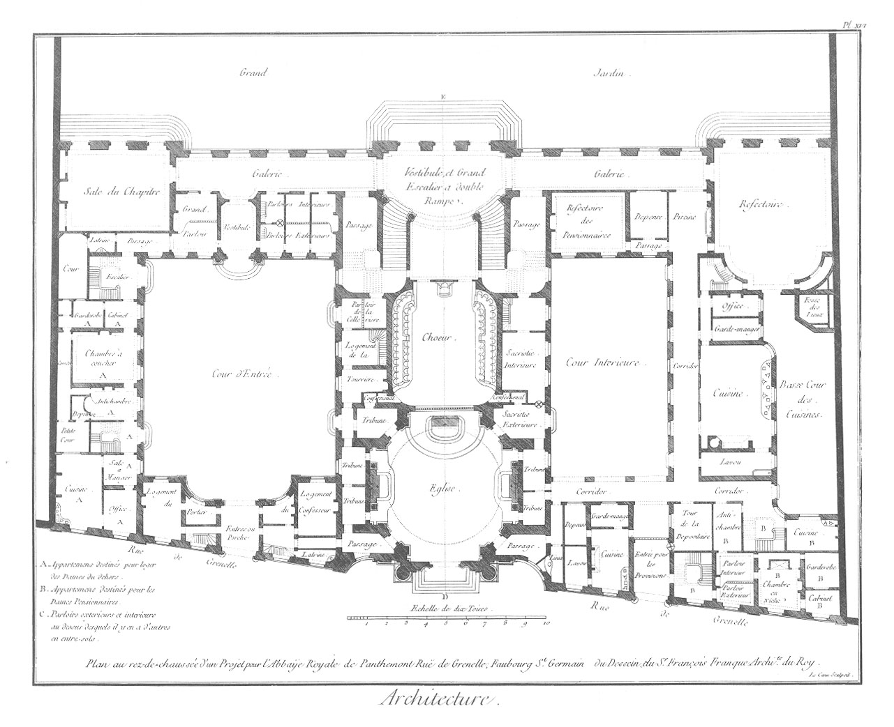
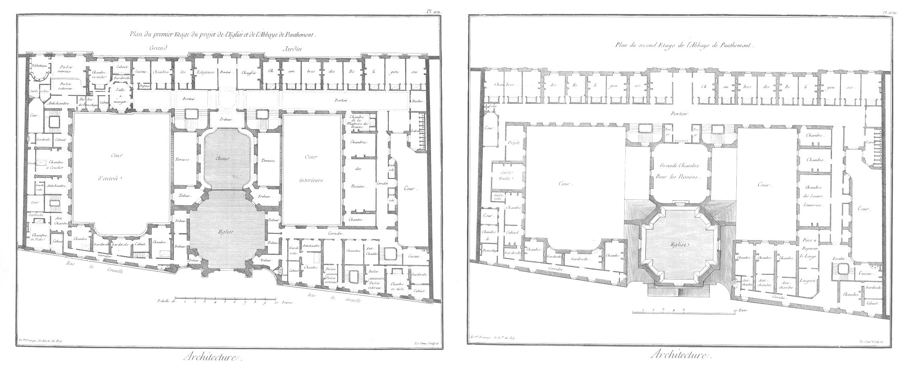
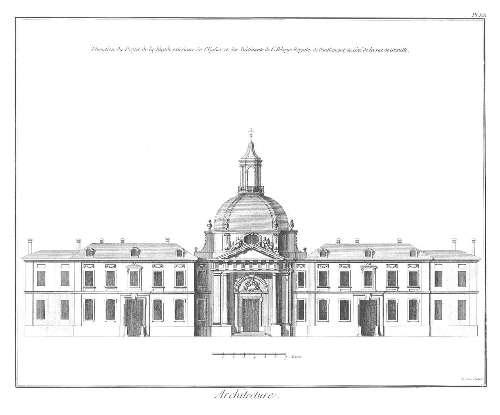
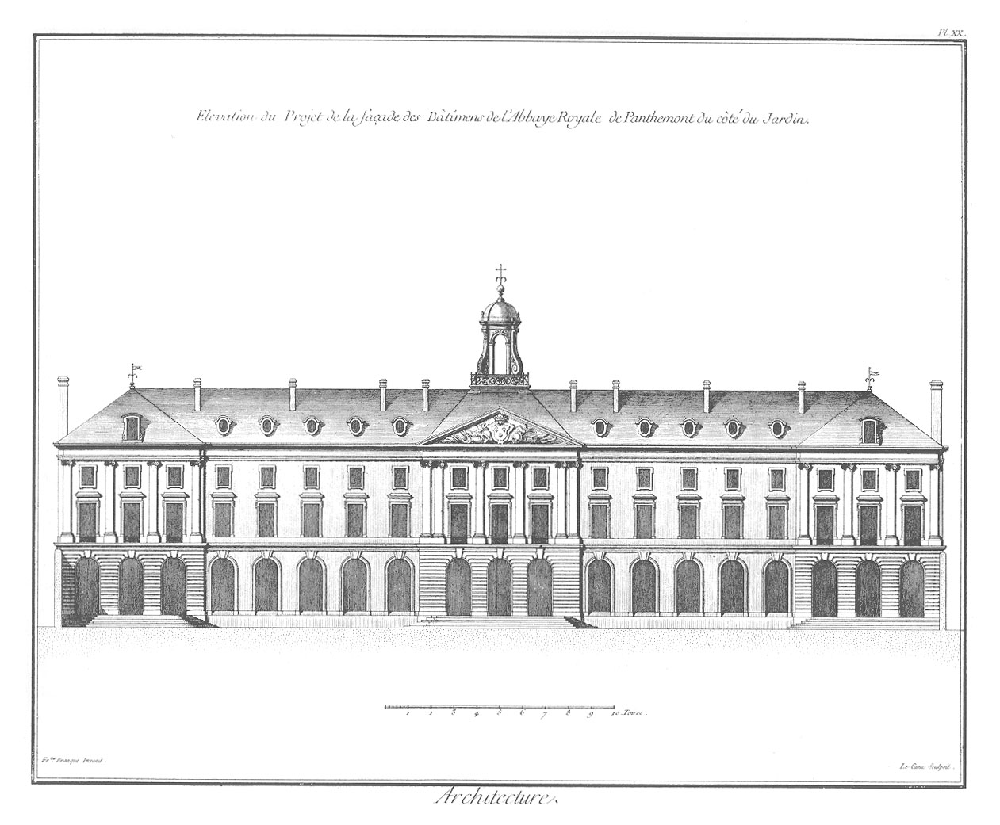
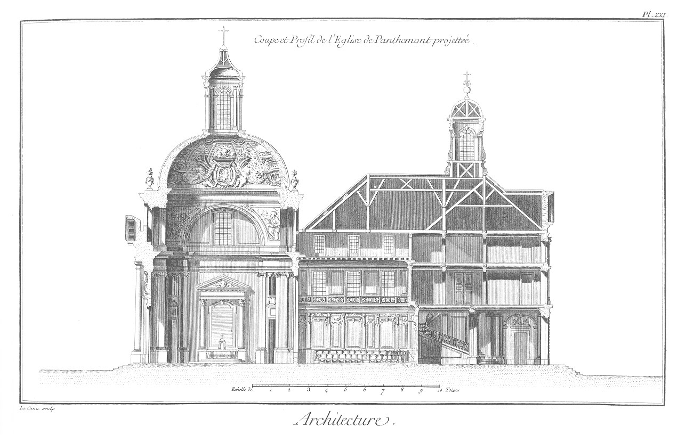

TROISIEME PARTIE.
=================

Observations générales sur les édifices sacrés, appliquées en particulier à une abbaye.

Les édifices sacrés sont de tous les bâtimens ceux qui devroient annoncer le plus de grandeur, de dignité & de majesté, & rien n'est si négligé que la plûpart de nos églises. En général nos églises paroissiales, & particulierement les modernes, n'ont point ce caractere ; elles ne sont point assez vastes pour contenir les différens genres d'ornemens dont on décore l'intérieur, & le plus souvent ces décorations sont plus théatrales que convenables à la maison du Seigneur.

Cette courte réflexion n'empêche pas que nous n'applaudissions aux chefs-d'oeuvre que renferment la plûpart de nos monumens sacrés ; mais nous n'en sommes pas moins forcés de convenir qu'à l'exception de quel-ques édifices gothiques, nous n'avons guéres d'ouvrages modernes qui méritent quelque considération, & que le Val de-Grace, la Sorbonne, l'Oratoire, sont peut-etre les seules églises en cette ville qui offrent le plus d'objets conformes à l'idée qu'on doit se former de l'ordonnance, de la décoration & de la disposition de nos temples.

Nous pourrions pousser plus loin nos observations critiques, & nous étendre sur les reproches que l'on peut légitimement faire à nos églises ; nous pourrions aussi entreprendre ici l'éloge de l'église de sainte Genévieve, qui se bâtit de nos jours sur les desseins & sous la conduite de M. Soufflot, contrôleur des bâtimens de Sa Majesté; & celui de la nouvelle paroisse de la Magdeleine, qui va s'élever sur les desseins de M. Contant, architecte du Roi, & dont les plans, approuvés de la Cour & des connoisseurs, promettent les plus grands succès : mais obligés de nous renfermer dans l'explication de nos Planches, & de supprimer tous les détails qui ne sont pas essentiels, nous passons au projet qui a été fait pour l'abbaye de Panthemont (a) par M. Franque, aussi architecte du Roi, & que nous donnons plûtôt que l'édifice érigé par M. Contant pour la même abbaye, parce que nous donnons les nouvelles décorations intérieures du Palais-royal, exécutées sur les desseins de M. Contant.

PLANCHE XVI.
------------

Plan au rez-de-chaussée du projet de l'abbaye de Panthemont.

L'église du plan que nous donnons ici, ne paroît pas d'abord un projet considérable, en comparaison des monumens que nous venons de citer ; mais néanmoins la régularité de son ordonnance extérieure & intérieure, & la simplicité louable de sa décoration, la rendent digne d'être mise en parallele avec les deux églises des dames de sainte Marie, l'une à la porte S. Antoine, l'autre à Chaillot, aussi-bien qu'avec celle des dames de l'Annonciade à S. Denis ; ouvrages du premier mérite en ce genre ; toutes trois exécutées sur les desseins des Mansards. D'ailleurs nous avons choisi ce projet d'abbaye plûtôt que celui d'une église paroissiale, à cause des bâtimens qui le composent, & dont la distribution nous rapproche davantage de la partie de l'Architecture qui intéresse le plus grand nombre.

PLANCHES XVII. & XVIII.
-----------------------

La Planche dix-septieme offre la distribution du premier étage, & la dix-huitieme tous les supplémens que n'ont pu contenir les deux plans précédens ; en sorte que par ces trois Planches on est en état de concevoir toutes les parties d'utilité, de commodité & d'agrément qu'il convient de donner à une abbaye royale destinée à contenir une abbesse, un certain nombre de religieuses, des dames pensionnaires de dehors, des demoiselles pensionnaires logées dans l'intérieur, & généralement toutes les pieces principales, pourvûes des dégagemens qui leur sont relatifs. La grandeur de l'échelle de ces plans, & la précaution que nous avons prise de décrire l'usage de chacun, nous dispense d'entrer dans un plus grand détail.

PLANCHE XIX.
------------

Cette Planche offre le frontispice de l'église & la façade extérieure des bâtimens du côté de la rue. Ces derniers sont d'un bon style, & se lient heureusement par le moyen de la tour creuse, avec le portail de l'église d'ordonnance grave & réguliere, & où cependant un ordre ïonique eût peut-être été plus convenable que le dorique, comme on le voit du côté des jardins.

PLANCHE XX.
-----------

Cette Planche fait voir la façade du côté des jardins, qui ayant trente-huit toises quatre pieds de longueur, a pu être divisée par trois avant-corps & deux arriere-corps ; les trois premiers sont revêtus de pilastres ïoniques, les deux derniers n'en ont seulement que l'entablement. Ce bel étage est élevé sur un soubassement, genre d'ordonnance préférable à beaucoup d'égards à deux ordres pratiqués l'un sur l'autre, qui non-seulement deviennent monotomes, mais ne distinguent jamais l'étage supérieur d'avec l'inférieur.

PLANCHE XXI.
------------

Cette Planche offre la coupe prise dans le plan du rez-de-chaussée sur la ligne D, E. On remarque dans cette coupe l'intérieur de l'église, celle du choeur des dames religieuses, le profil du grand escalier, & les développemens de la maçonnerie & de la charpente de la plus grande partie de ce monument. On y remarque aussi, quoiqu'en petit, ce genre de la décoration & des ornemens, dont le style ne peut faire que beaucoup d'honneur à M. Franque, dont nous possédons à Paris & dans la plus grande partie de nos provinces des ouvrages très- estimés.

(a) Nous avions promis dans le quatrieme Volume, p. 420. de donner les desseins de l'abbaye de Corbie, par M. Franque, & celle de Clairvaux, par M. le Carpentier ; mais nous nous sommes décidés far celle de Panthemont, aussi du dessein de M. Franque, & préféré l'hôtel-de-ville de Rouen, par M. le Carpentier, afin de jetter plus de varieté dans cette collection. 

[->](../05-Quatrieme_partie-Exemples_d'édifices_publics/Légende.md)
