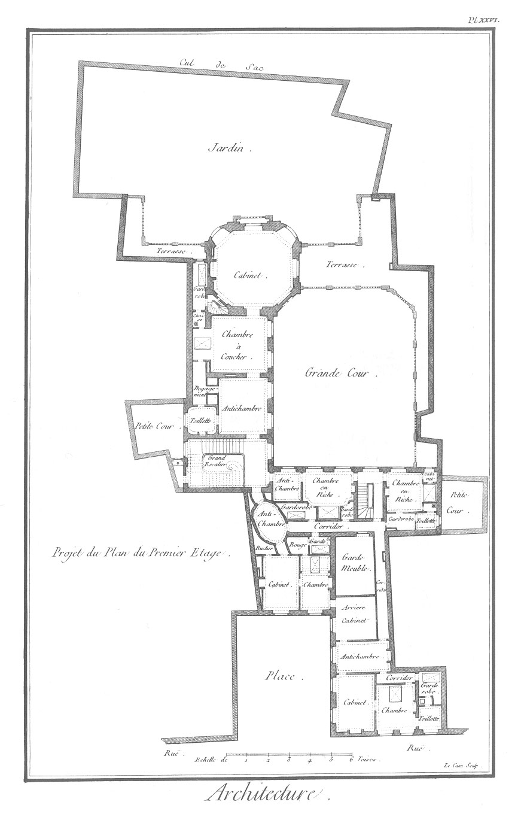
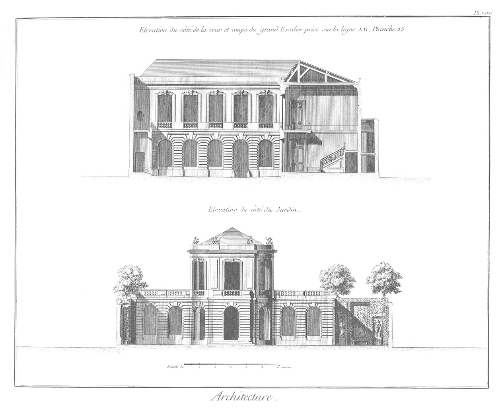
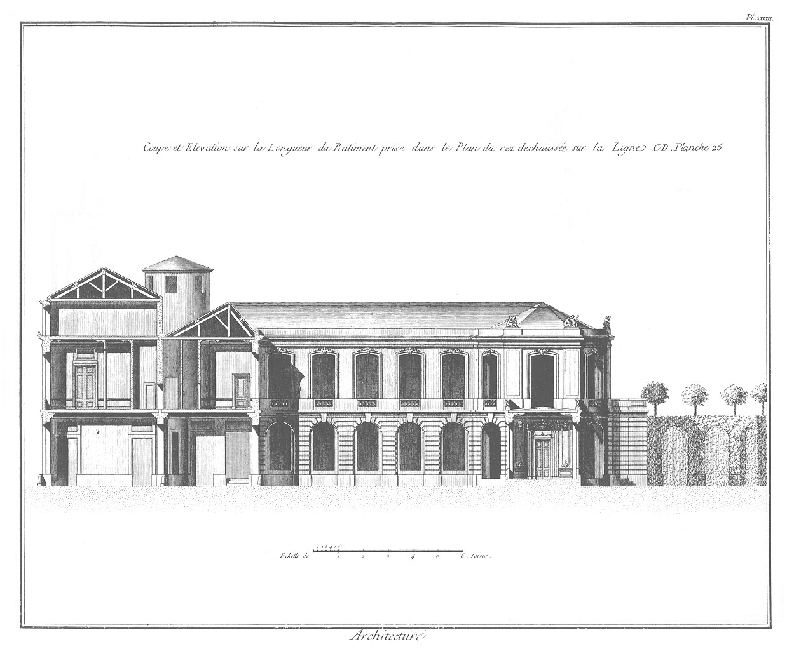

SIXIEME PARTIE.
===============

Observations générales sur les maisons particulieres, appliquees à un bâtiment régulier distribué dans un terrein très-irrégulier.

Sous le nom de bâtimens particuliers on comprend deux sortes d'habitations, les unes destinées à la résidence des riches citoyens, & où ils font leur demeure habituelle ; les autres, celles que les habitans font élever dans les cités pour assûrer une partie de leur revenu, en les donnant à loyer aux commerçans, aux artisans, &c. Les premiers doivent avoir un caractere qui ne tienne ni de la beauté des hôtels, ni de la simplicité des maisons ordinaires. Les ordres d'Architecture ne doivent jamais entrer pour rien dans leur décoration, malgré l'opulence de ceux qui les font élever (a). Non-seulement ces ordres y deviennent trop petits à cause du peu d'élévation des pieces, mais ils doivent être reservés pour les bâtimens de quelque importance, ne produisant un véritablement bel effet que lorsqu'ils peuvent avoir un certain diametre.

A leur défaut, dans les premiers bâtimens dont il s'agit, il faut seulement faire usage de l'expression d'un de ces ordres, pour l'appliquer selon le goût ou le rang de celui qui doit l'habiter, & se ressouvenir que l'Architecture doit toûjours être d'un bon style ; les ornemens, quand ils sont nécessaires, répandus avec choix ; & les façades régulieres.

Les secondes habitations doivent aussi avoir leur caractere particulier, qui consiste en une plus ou moins grande simplicité assortie à l'importance des villes où elles sont élevées. La symétrie, la solidité, la commodité & l'économie, doivent faire l'objet capital de ces dernieres demeures : plusieurs corps-de-logis séparés par des cours airées doivent déterminer le local de leur distribution ; selon leur situation, elles doivent contenir ou des boutiques, ou des magasins, ou des atteliers, ou des logemens subalternes ; dispositions néanmoins qui ne doivent nuire en rien à l'ordonnance des façades sur la rue (b), parce que ces sortes d'habitations étant en bien plus grand nombre que les autres édifices, elles doivent contribuer à la décoration & à l'embellissement des villes.

Appliquons ces notions élémentaires à la distribution & à la décoration d'une maison particuliere de la premiere classe, projettée pour Avignon par M. Franque, architecte du Roi.

PLANCHE XXV.
------------

Cette Planche offre une distribution réguliere très-ingénieuse, contenue dans un terrain clos de murs, le plus irrégulier qu'il soit possible, & dont M. Franque a tiré parti d'une maniere à faire juger de sa sagacité, de son goût & de son intelligence. En effet, rien de si bien entendu que ce plan ; beauté, proportion, variété, agrément, commodité, symétrie, relation des dedans aux dehors, tout s'y trouve réuni. En un mot, ce projet nous paroît un chef-d'oeuvre, & seroit seul capable de faire beaucoup d'honneur à cet architecte, s'il n'avoit prouvé par tant d'autres productions l'étendue de ses connoissances, & son expérience dans l'art de bâtir.

PLANCHE XXVI.
-------------

Cette Planche donne le plan du premier étage de ce bâtiment, & est composé d'un bel appartement & de quatre autres moins considérables, mais tous pourvûs des commodités qui leur sont nécessaires. Au-dessus de cet étage, du côté de la place seulement, est encore pratiqué un appartement ; en sorte que tout le rez-de-chaussée est occupé par un appartement de société, un jardin, des cuisines, des offices, des écuries & des remises ; & que dans les étages supérieurs on trouve un appartement pour le maître du logis, & cinq appartemens pour sa famille ou ses amis ; distribution suffisante pour la maison d'un particulier riche, qui retiré en province, y jouit d'un revenu honnête, & qui se détermine à se vouloir loger commodément & avec goût.

PLANCHE XXVII.
--------------

Cette Planche offre l'élévation du côté de la cour, avec la coupe du grand escalier, & l'élévation du côté du jardin de ce bâtiment. On remarque un caractere de fermeté dans l'ordonnance de ses façades, qui n'a rien de pesant ni de desassorti ; caractere qui se suffit à lui-même, & qui prouve bien l'inutilité des ordres dans les habitations des particuliers. Si nos architectes présentoient toûjours de telles productions à leurs propriétaires, ceux-ci n'auroient pas la manie de vouloir une décoration, qui, pour être plus riche, n'en est pas plus estimée des connoisseurs. Des arcades plein ceintre, un certain mouvement dans les plans, des balustrades au lieu de balcons, des ouvertures en rapport avec les trumeaux, de beaux chambranles, des refends placés convenablement, une sculpture bien repartie, d'excellens profils, un bel appareil, sont autant de beautés caractéristiques du ressort des bâtimens dont nous parlons, & qui se rencontrent dans ce projet ; considération qui nous l'ont fait préférer à tout autre dans cette collection, parce que nous nous serions fait honneur de l'avoir produit: du-moins nous nous flatons qu'on nous sçaura gré de l'avoir rendu public, comme un exemple utile, intéressant & capable de piquer l'émulation de nos jeunes artistes.

PLANCHE XXVIII.
---------------

Cette Planche fait voir la coupe du corps-de-logis sur la rue, l'élévation de l'aîle de bâtiment sur la cour, & la décoration intérieure du cabinet en galerie donnant sur le jardin. On voit régner dans cette façade le même caractere que dans les élévations précédentes : unité recommandable comme le seul moyen de rendre un bâtiment de peu d'étendue, plus considérable en apparence.

- (a) Une maison particuliere bâtie par M. Cartault pour M. Janvri, rue de Varenne, faubourg S. Germain, est telle que nous la desirons. Le bâtiment élevé pour M. d'Argenson, alors Chancelier de M. le Duc d'Orléans, par M. Boiffrand, rue des Bons-Enfans, est encore un exemple de ce que nous recommandons. 
- (b) Une maison bourgeoise, rue Saint-Martin, vis-à-vis la fontaine Maubué, & une autre, rue des mauvaises Paroles, toutes deux bâtis par M. Cartault, sont dans le genre que nous indiquons ici. 

[->](../08-Septieme_partie-Décoration_intérieure_de_l'appartement_de_parade_du_Palais-royal/Légende.md)
