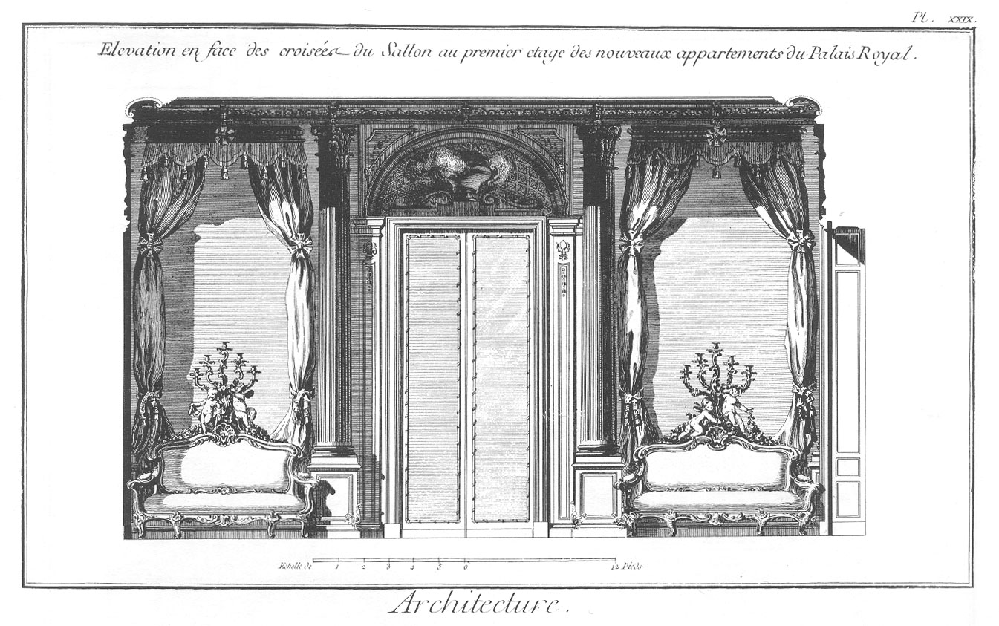
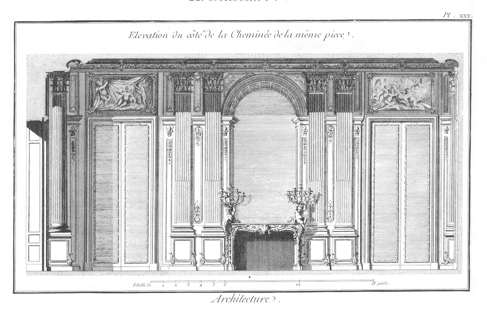
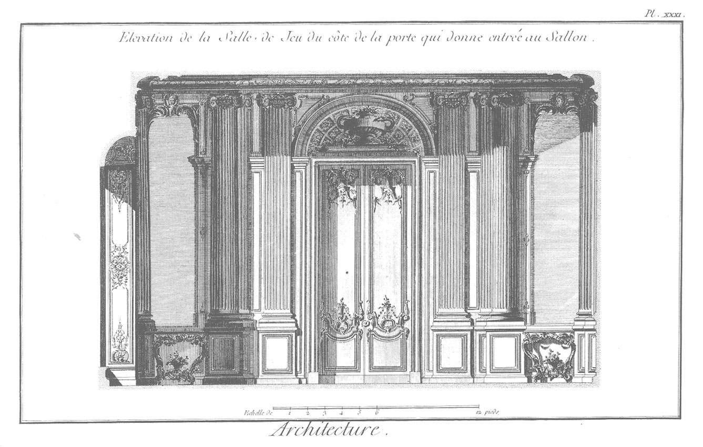
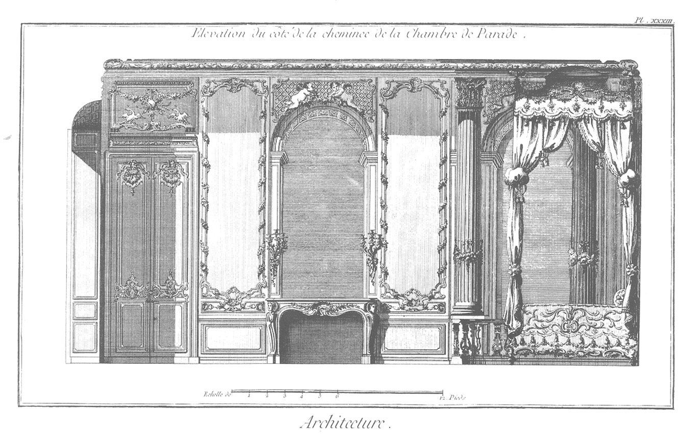
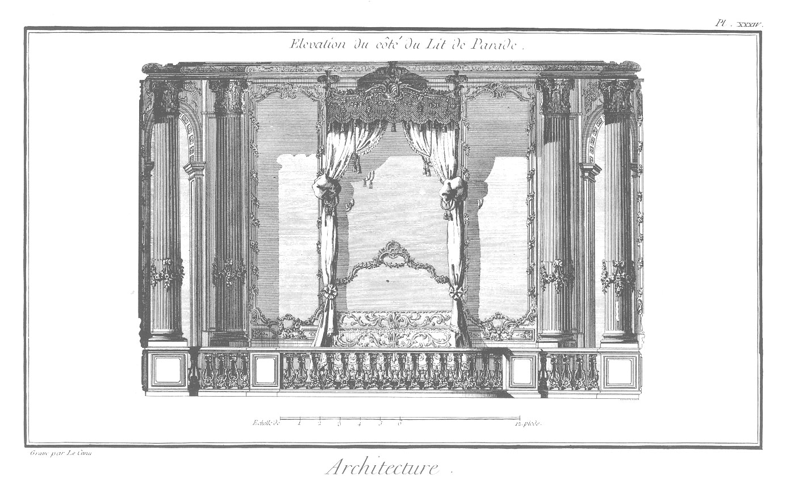
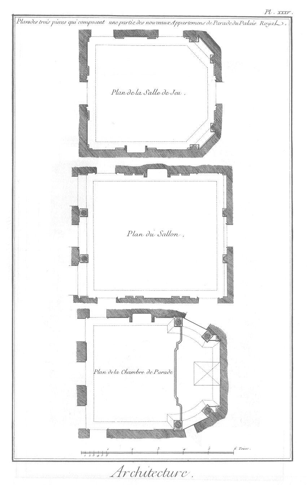
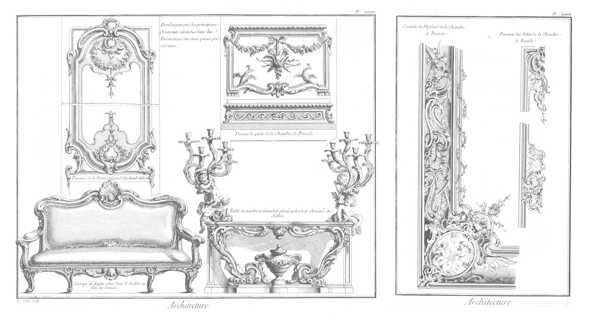
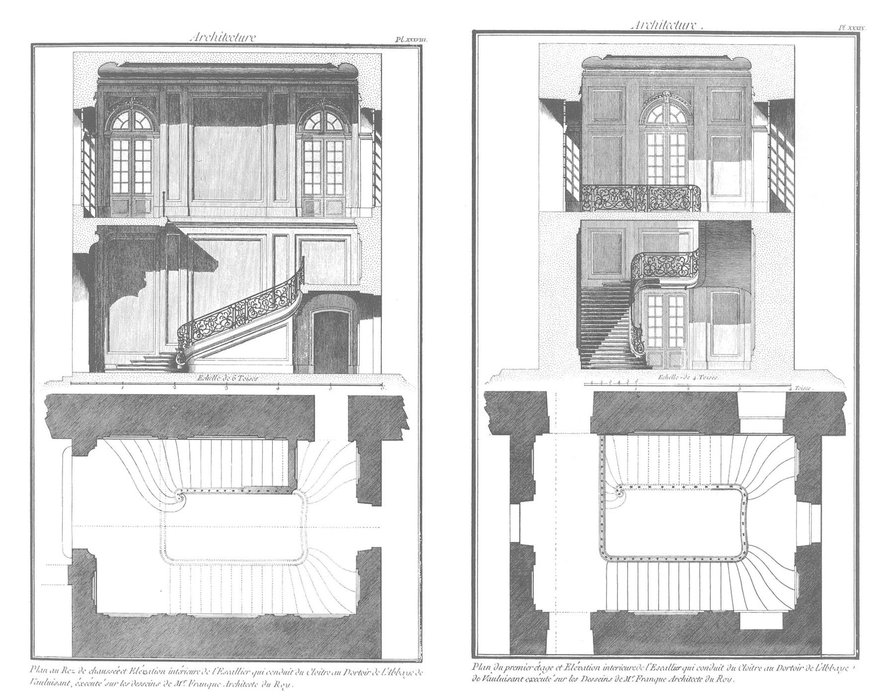

SEPTIEME PARTIE.
================

Observations générales sur la décoration intérieure appliquées en particulier à un appartement de parade.

Nous avons parlé, tome IV. page 702. &c. de la décoration en général. Il s'agit ici de la décoration des appartemens en particulier : nous ne rappellerons point les écarts de l'imagination de la plûpart de nos artistes à cet égard. La quantité de gravûres qui s'en sont répandues dans le public, font assez connoître combien il étoit essentiel que ces compositions frivoles passassent de mode, pour faire place à des compositions moins bisarres sans doute. Nous sommes arrivés à cette époque, à en juger par quelques productions des architectes de nos jours. Pour nous convaincre de ce que nous avan- çons, nous allons en citer plusieurs de l'un & l'autre genre, & nous finirons ces observations par donner les décorations faites dernierement dans les appartemens du palais-royal, pour feue madame la duchesse d'Orléans, sur les desseins de M. Contant, architecte du Roi, de qui nous avons quantité d'ouvrages du premier mérite, & qui en plus d'une occasion a donné des preuves de son goût dans l'architecture, & de son génie dans les choses d'agrément.

Les décorations intérieures qui tiennent le premier rang, n'entendant pas parler ici de celles du dernier siecle d'un genre admirable (a), & à qui on ne peut reprother qu'un peu de pesanteur & peut-etre un peu de confusion, les décorations, dis-je, qui tiennent le premier rang sont celles du palais-royal que nous venons de citer, de l'hôtel de Toulouse, de l'hôtel de Biron, de la maison de M. Bourette, de la maison de campagne de M. d'Argenson à Neuilly, de la galerie de l'hôtel de Choiseul, &c. qui, comparées avec celles du palais Bourbon, celles de l'hôtel de Soubise, de l'hôtel de Rohan-Chabot, de la maison de M. Dionis, de la maison de campagne de M. de la Valliere à Montrouge, de la galerie de l'hôtel de Villars, &c. montrent assez la préférence que les unes doivent avoir sur les autres, & combien il eût été dangereux que les artistes les plus célebres de notre tems n'eussent pas créé un nouveau genre de décoration qui anéantît pour ainsi dire cette frivolité qui seule faisoit le mérite des appartemens du palais Bourbon, &c. ainsi que ce caractere de pesanteur que nous avons reproché aux anciennes décorations de la plûpart de nos maisons royales. Entrons dans quelque détail à ce sujet à-propos des desseins que nous allons offrir, & qui, comme nous venons de le remarquer, ont été exécutés sous la conduite de M. Contant, par les plus habiles artistes, qui ont secondé ce sçavant architecte dans les embellissemens du palais-royal.

PLANCHE XXIX.
-------------

Elévation en face des croisées du salon, au premier étage des nouveaux appartemens du palais-royal.

Cette décoration toute de menuiserie peinte en blanc, & dont tous les ornemens sont dorés d'or mat & d'or bruni, offre le plus grand éclat. La porte à placards est revêtue de glaces, & les deux côtés occupés par des sophas (Voyez le dessein en grand d'un de ces sophas Pl. XXXVI.) au-dessus desquels sont aussi des glaces qui toutes répondent aux axes des croisées qui sont en face, & répetent le spectacle des jardins du palais-royal. Ces sophas sont couverts par des campanilles d'étoffe or & argent ajustées avec goût, qui meublent cette piece avec la plus grande magnificence. Le plafond de ce sallon est peint par M. Pierre, dont le nom seul dit tout. Les deux colonnes qui se voient ici sont engagées pour symétriser avec celles isolées qui leur sont opposées, & qui ont été introduites ainsi, pour racheter l'inégalité de cette piece anciennement bâtie avec assez d'irrégularité. (Voyez le plan de cette piece, Pl. XXXV.)

PLANCHE XXX.
------------

Elévation du côté de la cheminée de la même piece.

Les portes de cette décoration sont de glaces, comme celles de la piece précédente, & ne different que dans leur attique ; le dessein de la cheminée est de bon goût. Il est aisé de s'appercevoir combien sa beauté réelle l'emporte sur les tiges du palmier, les guirlandes, les rocailles, les palmettes, &c. qu'on a vû si long-tems faire toute la ressource de nos sculpteurs en bois dans ce genre de décoration. Le chambranle de cette cheminée est aussi d'une belle forme, & est revêtu de bronze doré d'or moulu, traité de la plus grande maniere. Des girandoles avec des génies enrichissent ses angles ; ces girandoles correspondent à de pareilles qui sont posées sur une table de marbre placée en face de la cheminée, & dont on voit le dessein dans la Planche XXXVI.

Les pilastres corinthiens qui décorent cette façade & son opposée, ont autorisé ici des membres d'Architecture qui l'ont empêché de devenir frivole, comme cela se pratiquoit précédemment ; en sorte que toute cette ordonnance d'un bon style paroît convenable à la dignité du prince qui habite ce palais ; considération plus intéressante qu'on ne s'imagine, & qui devroit être la premiere regle de toutes les productions des artistes.

PLANCHE XXXI.
-------------

Elévation de la salle de jeu du côté de la porte qui donne entrée au sallon.

Cette décoration d'ordre ïonique est composée de grandes parties, & ornée d'excellens détails. Pour s'en convaincre, on n'a qu'à comparer cette production avec la plûpart de celles du palais Bourbon, gravées dans l'Architecture françoise, ou avec celles de l'hôtel de Soubise, insérées dans les oeuvres de M. Boifrand, & on verra combien les repos qui se remarquent ici, sont préférables à cette multitude d'ornemens qu'on a prodigués avec excès pendant trente années dans tous nos bâtimens, & dont même la décoration intérieure de nos temples n'est pas toujours exempte. Cet ordre est ïonique, pilastres & colonnes ; ces dernieres sont engagées pour occuper moins de place dans l'intérieur de la piece, & pour corriger l'irrégularité de la bâtisse, nos anciens architectes ayant presque toujours sacrifié les dehors au-dedans des appartemens. (Voyez le plan de cette piece, Pl. XXXV.)

PLANCHE XXXII.
--------------

Elévation du côté de la cheminée de la même piece.

Cette façade, du même style que la précédente, fait voir le côté de la cheminée placée entre deux pilastres ; de belles tapisseries occupent les deux espaces qui déterminent le grand diametre de cette piece. Ces deux espaces sont d'inégale grandeur, à cause de la premiere disposition du plan, qui n'étant pas régulier, a occasionné ce défaut de symétrie dans cette ordonnance. Deux pans coupés dans l'un des côtés de la profondeur de cette salle de jeu, lui donnent une forme assez agréable, & ont produit la facilité d'y poser des glaces ; ressource ingénieuse que l'homme de mérite scait se permettre quelquefois, mais dont l'homme subalterne abuse presque toujours, ainsi qu'on le remarque dans la plûpart des bâtimens que nous avons cités. L'abus des glaces n'est jamais une beauté dans les appartemens ; la prodigalité de ces corps transparens annoncent plûtôt la stérilité que le génie de l'architecte. Les beaux appartemens du château de Richelieu, de celui de Maisons, de celui de Versailles, la gallerie de Meudon, celle de Clagny, tous ces chefs-d'oeuvre n'en ont point ; ils auroient occupé moins utilement la place des trésors qu'ils contiennent, & par conséquent auroient privé l'homme de goût des productions des grands maîtres qui s'y remarquent. Il est vrai qu'il n'en est pas de même d'un appartement d'habitation, principalement de celui destiné à une princesse. Aussi M. Contant en a-t-il usé, mais avec cette discrétion qui décele l'homme de génie & l'homme instruit de la convenance de son art & des grands principes de sa profession.

PLANCHE XXXIII.
---------------

Elévation du côté de la cheminée de la chambre de parade.

Cette décoration est du meilleur genre. De belles parties, des détails heureux, des matieres précieuses, des étoffes de prix, tout concourt à procurer à cette piece une très-grande magnificence ; les ornemens d'ailleurs nous ont paru assez intéressans, pour que nous en donnassions la plus grande partie dans les Planches XXXVI. & XXXVII. mais ce que nous n'avons pu rendre, sont les beautés de l'exécution considérées séparément dans chaque genre, & qui doivent exciter la curiosité des amateurs & des artistes éclairés.

PLANCHE XXXIV.
--------------

Elévation du côté du lit de parade.

Cette Planche fera connoître une des meilleures décorations en ce genre, qui se soit vûe jusqu'à présent dans l'intérieur de nos appartemens. Les quatre colonnes qui se remarquent ici, dont deux placées sur un plan différent, donnent à cette ordonnance un caractere grave, qui n'ôte cependant rien à son élégance. La forme du plan (voyez ce plan, Pl. XXXV.) contribue même à ajouter de la beauté à cette décoration, & à contenir le lit avec la dignité qui lui convient ; d'ailleurs la forme de ce lit, la richesse de ces étoffes, la balustrade qui le renferme, les glaces qui sont placées dans les pans coupés, la forme ingénieuse des chapiteaux & des cannelures de l'ordre, enfin l'exacte régularité de chaque partie, tout dans ce dessein fait le plus grand plaisir. Cette belle piece est terminée par une corniche composée d'ornemens d'un excellent genre, & dont on trouvera les desseins pour la plus grande partie, Planche XXXVII.

PLANCHE XXXV.
-------------

Plans des trois pieces qui composent une partie de l'ap- partement de parade dont nous venons de parler.

La forme des plans contribuant essentiellement à la beauté de la décoration intérieure, nous avons rassemblé sur la même Planche les trois plans des décorations précédentes. Ces trois plans font connoître les difficultés que M. Contant a été obligé de vaincre, pour rendre ces décorations régulieres dans autant de cages irrégulieres ; obstacle qui exige dans un architecte le génie de son art, pour procurer en particulier à chacune de ces pieces les commodités qui leur sont nécessaires ; commodités qui font aujourd'hui une des parties essentielles de notre distribution.

PLANCHES XXXVI. & XXXVII.
-------------------------

Développemens des principaux ornemens répandus dans la décoration des trois pieces précédentes.

Le genre mâle que la plûpart de nos architectes cherchent aujourd'hui à donner à nos ornemens, leur a semblé néanmoins ne pas devoir exiger ce caractere de pesanteur que nos anciens ont affecté dans les dedans des appartemens, ni cette prodigalité de petites parties que nous avons déjà reprochée à la plûpart de nos sculpteurs en bois, mais un juste milieu entre ces deux excès, parce qu'ils ont senti enfin que les décorations intérieures doivent être agréables ; que rien n'y doit paroître lourd ni dans les masses ni dans les détails ; que même il étoit nécessaire de réveiller leur ordonnance par un peu de contraste, pourvu qu'il ne fût point outré; le contraste dont plusieurs ont abusé quelquefois, n'ayant engendré que des chimeres, & qu'ils ont senti que trop de symétrie à son tour ne produisoit souvent que des compositions froides & monotones. Les ornemens de ces deux Planches sont également exempts de ces deux défauts, en fixant, pour ainsi dire, le véritable goût & le style propre à cette partie de l'art.

PLANCHES XXXVIII. & XXXIX.
--------------------------

Ces deux dernieres Planches offrent les plans & les décorations intérieures d'un escalier bâti sur les desseins de M. Franque, architecte du roi, à l'abbaye de Vaux-luisant. La simplicité qui regne dans son ordonnance, sans être pauvre, la proportion des membres qui y président, un certain caractere de fermeté qui se remarque dans les profils, la forme ingénieuse des rampes & du contour des marches qu'il a fallu assujettir à la hauteur du premier étage, en conservant un palier au milieu, sont les motifs qui nous ont portés à préférer cet exemple à tout autre d'une distribution plus compliquée. D ailleurs l'Architecture françoise offrira à nos lecteurs plus d'un modele en ce genre, & plusieurs monumens considérables, qui accompagnés des descriptions que nous avons été chargés d'en faire, pourront contribuer à développer les connoissances des jeunes artistes. Au reste, ce sera au public éclairé à juger des observations répandues dans l'un & l'autre ouvrage ; au-moins l'assûrons-nous de notre impartialité. La meilleure preuve que nous en puissions donner, c'est le choix des productions que nous lui offrons ici, & la réputation que se sont acquis les habiles artistes qui ont la meilleure part en cette collection.

(a) Telle que celle du Louvre, des Tuileries, de Versailles, du Palais-royal, de Vincennes &c.

[->](../09-Coupe_des_Pierres/Légende.md)
