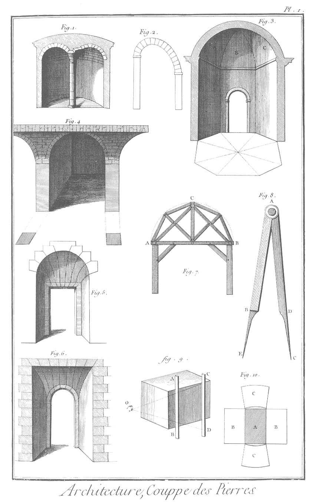
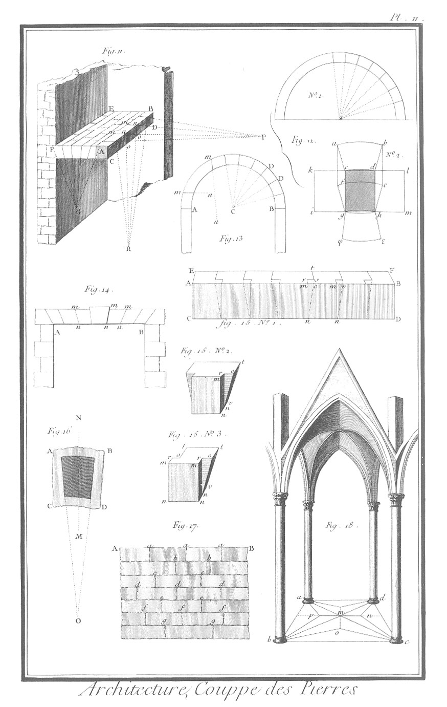
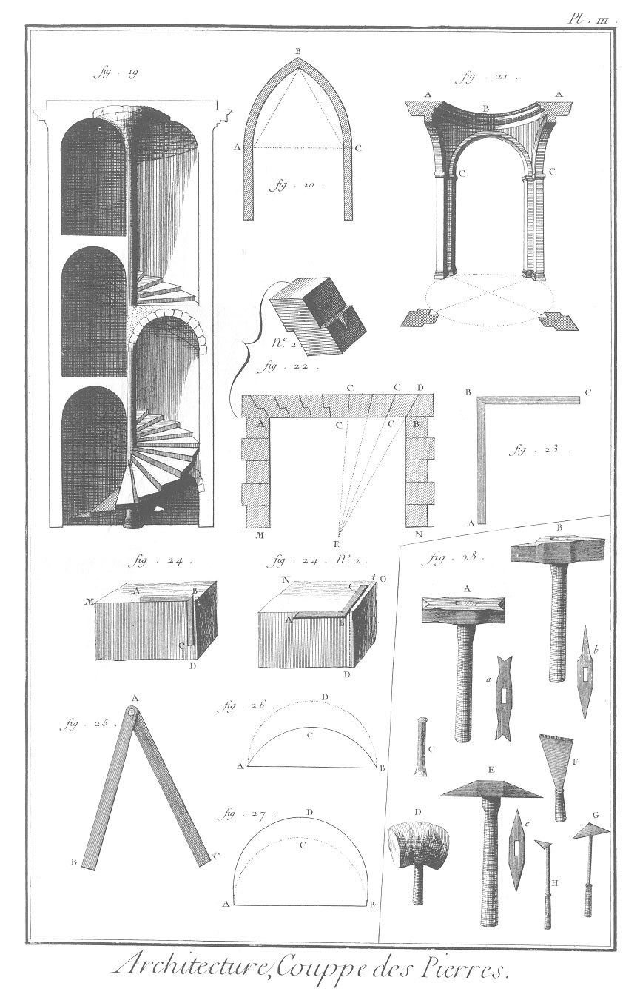
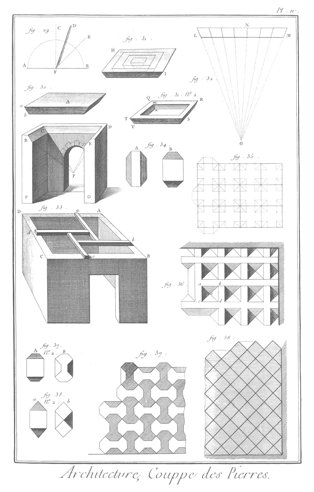
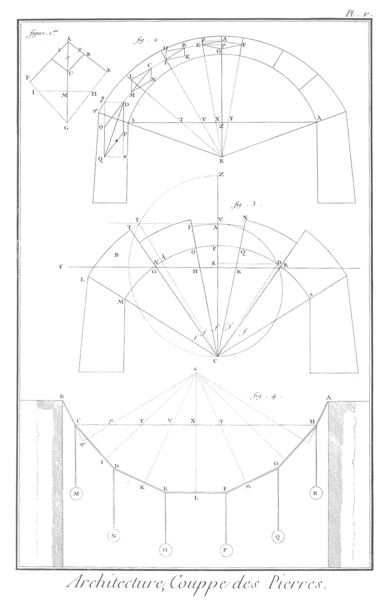

COUPE DES PIERRES.
==================

PLANCHE I.ere
-------------

1. Voûte annulaire dont le plan est un cercle.
2. Arc rampant dont les impostes ne sont point de niveau.
3. Arc de cloître.
	- A, B, C, portions de berceaux.
4. Voûte d'arrête.
5. Arriere-voussure de la porte Saint Antoine.
6. Arriere-voussure de Montpellier.
7. Ceinture pour soutenir les voussoirs pendant la construction d'une voûte.
	- A B, entrait qui répond au niveau des impostes.
	- C, poinçon qui répond au dessous de la clé; les autres pieces servent à soutenir les dosses sur lesquelles on construit la voûte.
8. Compas d'appareilleur.
	- A E, la branche femelle, fendue depuis A jusqu'en B, pour recevoir la partie A D de l'autre branche A C.
9. Dégauchissement d'une pierre ; il se fait avec les deux regles A B, C D, que l'on place dans des ciselures pratiquées à la pierre dont on taille toute la surface selon la direction du fond de ces ciselures.
10. Développement.
	- A, doele.
	- B, paneaux de lit.
	- C, paneaux de tête.

PLANCHE II.
-----------

11. Double coupe de la plate-bande A B C D d'un pallier.
	- P, point de concours des joints m n, m n.
	- R, point de concours des joints n o, n o.
	- G, point de concours des joints de lit des claveaux du platfond.
12. 
	- n. 1. Epure d'un berceau cylindrique.
	- n. 2. Epure d'un claveau de voûte cylindrique.
		- c, d, g, h, la doele entourée des paneaux de lit & de tête, désignés par les autres lettres.
13. Fausse coupe dans un berceau cylindrique.
14. Bonne coupe d'une plate-bande A B.
15.
	- n. 1. Fausse coupe apparente d'une des plates-bandes des fenêtres & portes du Louvre.
	- n. 2. Clé de la plate-bande en perspective.
	- n. 3. Un des autres voussoirs.
16. Direction que doit avoir le fil ou lit de la pierre dans un voussoir.
17. Liaisons des pierres dans un mur.
18. Voûte gothique : les nervures qui répondent audessus des lignes a d, b c, sont les arcs doubleaux ; celles au-dessus des lignes a b, d c, lorsque ces parties sont fermées de mur, s'appellent formerets. mp, mn, mo, sont les liernes ; ap, bp, co, cn, sont les tiercerons ; a c, b d, sont les ogives.

PLANCHE III.
------------

19. Voûte hélicoïde sur noyau.
20. Ceintre gothique, approchant de la chaînette.
21. Panache.
22. Plate-bande, dont une moitié B C est composée de voussoirs, dont les joints de lit sont formés par un seul plan, C C, & l'autre moitié A C, par des voussoirs à crossettes. 
22. n. 2. Un des voussoirs à crossette en perspective.
23. Equerre du tailleur de pierre ; elle est de fer.
24.
	- n. 1 &
	- n. 2. Usage de l'équerre pour équarrir une pierre.
25. Sauterelle, fausse équerre ou récipiangle.
26. Arc surbaissé.
27. Arc surhaussé. Outils du tailleur de pierre.
28.
	- A, têtû.
	- a, son plan.
	- B, laye ou marteau bretelé.
	- b, son plan.
	- C, ciseau.
	- D, maillet.
	- E, marteau ou pioche.
	- e, son plan.
	- F, riflard bretelé.
	- G, crochet.
	- H, ripe.

PLANCHE IV.
-----------

29. Epure.
30. Voûte plate d'une seule pierre.
31.
	- n. 1 &
	- n. 2. Voûte plate, composée de plusieurs rangs de voussoirs inscrits les uns dans les autres.
32. Plate-bande.
33. Plancher composé de poutrelles, proposé par Serlio.
34. 
	- A, extrados.
	- B, intrados ou doele d'un des voussoirs d'une voûte plate.
35. Doele d'une voûte plate, proposée par M. Abeille.
36. Extrados de la même voûte.
37. Compartiment de l'extrados d'une voûte plate, dont les claveaux ne laissent point de vuide.
	- n. 2.
		- A, doele d'un des claveaux de la voûte précédente.
		- B, extrados du même claveau.
38. Compartiment de l'extrados d'une voûte plate en quarrés égaux, diagonalement opposés à ceux de l'intrados.
	- n. 2.
		- a, doele ou intrados d'un des claveaux de la voûte précédente.
		- b, extrados du même claveau.

PLANCHE V.
----------

1. &
2. &
3. &
4. Démonstrations relatives à la poussée des voûtes.

[->](../10-Moulin_à_scier_des_pierres/Légende.md)
