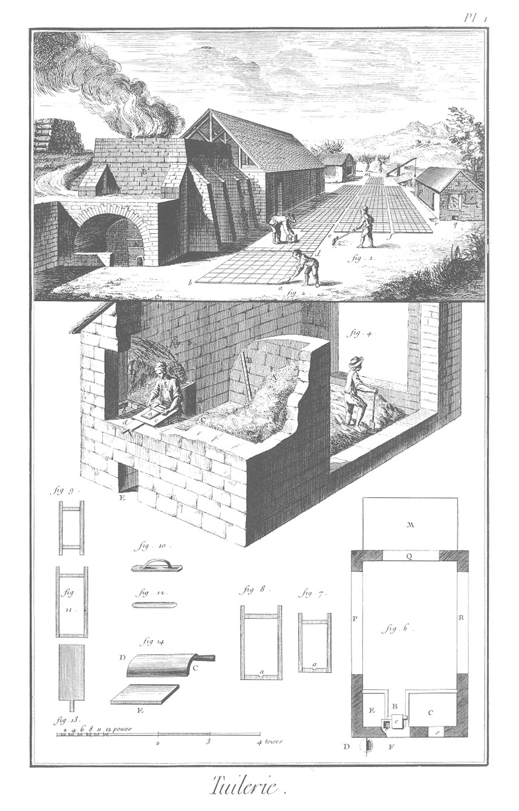
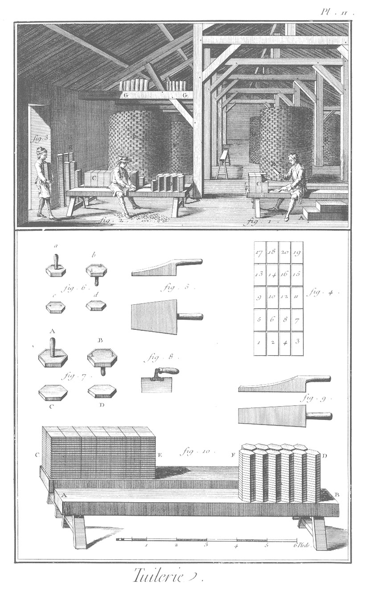
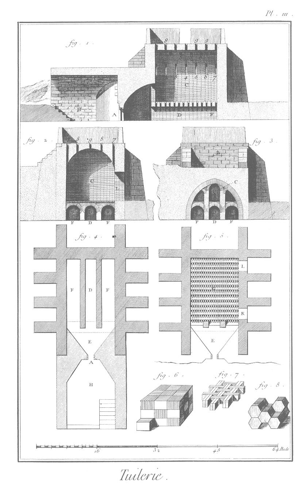

TUILERIE.
=========

PLANCHE I.ere
-------------

La vignette représente une tuilerie & tous les bâtimens nécessaires.

- A, B, C, le fourneau adossé à un terrein élevé par lequel on monte au-dessus. Les murailles sont fortifiées & soutenues par des contre-forts C, C, entre lesquels il y a deux portes pour entrer dans le fourneau. Voyez l'explication de la Planche III.
- D, E, la halle dans laquelle on calibre le carreau & on le met sécher à l'ombre, ainsi que la tuile.
- F, moulerie. Elle a plusieurs ouvertures ou fenêtres. Le mouleur, qui est au-dedans de ce bâtiment, donne au coucheur les tuiles ou planchettes à mesure qu'il les a moulées. La fenêtre S fermée par une toile pendante, sert à introduire le sable dont le mouleur a besoin pour sécher son moule & le bloc sur lequel il travaille. L'ouverture q sert à tirer au dehors le sable qui tombe aux pies du mouleur. Les autres ouvertures p, aussi fermées par des toiles, répondent à la partie de ce bâtiment où on marche la terre glaise. Derriere ce bâtiment est une fosse dans laquelle on détrempe la terre glaise. On voit une de ces fosses en m ; elle est ordinairement entourée de glaise seche & concassée en petits morceaux. r, tonneau ou baquet rempli d'eau, & enterré de presque toute sa hauteur, & à moitié recouvert par une planche. Le coucheur y trempe les planchettes sur lesquelles il transporte la tuile. n, petit pont & bascule servant à puiser l'eau nécessaire, qui coule par des rigoles dans les fosses à tremper.

1. Ouvrier qui prépare & applanit une aire ou place d, e, f, couverte de sable, pour mettre sécher les moulées.

2. Coucheur qui étend sur la place a, b, d, les tuiles ou planches de terre que le mouleur lui a fournies ; il les transporte en se servant de petits ais de bois qu'on nomme aussi planchettes, sur les aires ou places où il les laisse sécher.

3. Leveur qui rassemble les planches ou tuiles quand elles sont presque séches, pour les transporter dans la halle couverte D, E.

4. Ouvrier qui marche la terre glaise, c'est-à-dire qui la pétrit avec les piés. La terre suffisamment corroyée, est transportée à la pelle sur le banc-à-terre qui est à droite du mouleur.

5. Le mouleur placé debout devant le bloc c, & entre les deux massifs E, C, qu'on nomme bancs. Le premier est destiné à recevoir la terre corroyée qu'on voit en D; & le second C, le sable A avec lequel il saupoudre le moule & le bloc sur lequel il travaille. Le sable est retenu sur le banc par des planches appuyées sur le tasseau B, & un semblable fixé à la muraille opposée. a, planchette que le mouleur applanit avec le racle. b, l'auget plein d'eau, dans lequel le mouleur met tremper le racle. d, planchette de bois avec laquelle le coucheur transporte les planches pour les faire sécher sur les aires ou places. E, ouverture par laquelle on retire le sable qui est tombé aux piés du mouleur. 

6. Plan de l'attelier du mouleur.
	- M, la fosse où on détrempe la terre glaise.
	- Q, fenêtre par laquelle on la jette dans la marche, qui est l'espace entre P & R. 
	- P, R, ouvertures pour entrer dans la marche : on les ferme avec des toiles.
	- E, banc-à-terre.
	- B, place du mouleur.
	- C, banc à sable.
	- s, fenêtre par laquelle on jette le sable sur le banc.
	- c, bloc.
	- b, l'auget.
	- F, place du coucheur.
	- D, tonneau ou baquet plein d'eau, dans lequel le coucheur trempe ses planchettes.

7. Moule à tuile de petit moule. Ce chassis, qui a un demi-pouce d'épaisseur, a intérieurement neuf à dix pouces de longueur sur six de large. Il a une échancrure a qui reçoit la terre avec laquelle le coucheur forme le crochet de la tuile.

8. Moule pour la tuile du grand moule. Il a sept lignes d'épaisseur, treize pouces de long & huit de large, & aussi une échancrure a pour former le crochet de la tuile.

9. Moule pour la brique. Il a intérieurement un pouce deux lignes d'épaisseur, huit pouces de long & quatre pouces de large.

10. La plane avec laquelle le mouleur étend la terre dans les moules à tuiles, & dont il se sert comme l'ouvrier (fig. 5.) se sert du racle : il y en a de différentes grandeurs. 

11. Moule à planches dont on fait le carreau. Il a intérieurement douze pouces de long sur six de large, & sept lignes d'épaisseur pour la planche dont on fait le carreau de petit moule. On se sert d'un plus grand pour la planche dont on fait le carreau du grand moule.

12. Racle : il est de bois, comme tous les autres outils, & sert au mouleur pour applanir la terre dont il forme les planches.

13. Planchette avec laquelle le coucheur (fig. 2.) transporte les planches de terre glaise sur les places pour les faire sécher. Il y en a de plus longues & de plus larges pour la tuile.

14. Plioir sur lequel le leveur (figure 3.) transporte la tuile faîtiere, & sur lequel il lui fait prendre la courbure convenable. C, la poignée du plioir. E, la tuile.

PLANCHE II.
-----------

La vignette représente l'intérieur de la halle D, E, Plan. I. C'est un grand bâtiment de 36 piés de large sur 72 de long, dont le toît soutenu par cinq fermes de charpente, repose par ses extrémités sur des murs de huit à dix piés d'élevation. C'est dans ce bâtiment qu'on met sécher la tuile & le carreau, que l'on releve de dessus les places avant qu'ils soient entierement secs. On forme avec la tuile de grandes tours F, F, F, F, F, composées de trois, quatre ou cinq tours l'une dans l'autre, & on la laisse sécher parfaitement en cet état avant de la mettre au fourneau. Les tuiles sont rangées quatre par quatre, les crochets en-haut, & tournés alternativement l'un vers le centre de la tour, & l'autre vers le dehors. Les paquets de quatre tuiles sont posés en liaison les uns sur les autres, en sorte qu'un paquet couvre le joint qui est entre les deux paquets qui sont au-dessous. On laisse les joints fort larges, afin que l'air circule plus facilement, & seche plus promptement la tuile. C'est aussi pour la même raison que les différentes tours qui sont les unes dans les autres, sont espacées d'un pié ou environ. On met aussi sécher la tuile faîtiere sur les pieces de la charpente du comble qui peuvent les recevoir, comme on voit en G, G; on se sert pour y atteindre de quelques treteaux ou banquettes.

1. Ouvrier qui coupe & bat les planches pour en faire du carreau. Il est assis sur un banc qu'on nomme selle, sur lequel il coupe en deux & deux à-la-fois avec le tranchant de la batte, les planches qu'il prend au tas A, dont les endroits se touchent. (L'envers est le côté de la planche qui touchoit le sable lorsqu'elle étoit sur la place). Il bat ensuite une des moitiés avec la batte (fig. 5.), ce qui applanit l'endroit ; il bat ensuite l'autre moitié qu'il renverse la premiere, & continue ainsi jusqu'à ce qu'il ait formé vingt-cinq piles C de quarrés. Chaque pile est composée de vingt quarrés dont les endroits se touchent ; disposition qui doit être conservée depuis que le leveur a ainsi placé les planches, jusqu'à ce que le carreau soit cuit. Les vingt-cinq piles forment la sellée, qui est composée de cinq cents carreaux.

2. Le coupeur assis sur une des deux selles. Il prend deux quarrés à-la-fois, dont les endroits se touchent ; & ayant appliqué l'envers de l'un sur là selle, il applique de la main gauche un des calibres a, A, (fig. 6. & 7.) dont il fait entrer les pointes dans le quarré. Ensuite tenant de la main droite le couteau (fig. 3.), il retranche tout autour du calibre les parties du quarré qui excedent, & forme ainsi un premier carreau. Il forme de même le second, dont il tourne l'endroit sur l'endroit du premier, & continue ainsi la pile qu'il a commencée, & forme de nouvelles piles D de carreaux, auxquelles il ne manque plus que la cuisson pour être en état de servir. E, plusieurs piles de carreaux qui achevent de sécher.

3. Ouvrier qui porte une brassée ou pile de carreaux. Le même ouvrier leve aussi les planches de dessus les places.

4. Arrangement des planches sur les places, & la maniere dont le leveur tourne les endroits les uns sur les autres de la main gauche. Il saisit la planche 1. de la droite, la planche 3. par le milieu des longs côtés, & du même tems il les renverse sur les planches 2. & 4. Il prend ensemble les deux planches 1. & 2. dont les endroits se touchent, & les pose ainsi ensemble sur les planches 3. & 4. en sorte que les envers de ces paquets se touchent. Il continue ainsi à renverser & à empiler les planches 5. 6. 7. 8. 9. 10. 11. 12. 13. 14. 15. 16. 17. 18. 19. 20. ce qui forme cinq paquets particuliers qu'il empile les uns sur les autres sur celui du milieu 9. 10. 11. 12. ce qui forme une brassée composée de vingt planches.

5. Plan & profil de la batte dont l'ouvrier (fig. 1.) se sert pour battre & dresser en trois ou quatre coups les quarrés dont on fait les carreaux. Cet instrument est d'un bois dur & uni ; il a neuf pouces de long, sept de large dans sa plus grande largeur ; le manche a cinq ou six pouces.

6. Calibre & carreau de petit moule.
	- a, calibre vû par dessus, du côté de la poignée.
	- b, calibre vû par-dessous, du côté des pointes qui servent à le fixer dans les quarrés de terre glaise, dont le coupeur rogne l'excédent. Les calibres qui sont de bois, sont entourés d'une bande de fer, pour qu'ils ne soient point endommagés par le couteau.
	- c, carreau vû par l'endroit où sont les empreintes des chevilles qui empêchent le calibre de tourner sur le carreau. d, carreau vû par dessous & du côté de l'envers qui est un peu plus petit que l'endroit, les côtés étant coupés un peu obliquement, pour que la jonction des arrêtes supérieures se fasse avec plus d'exactitude.

7. Calibre de carreau de grand moule.
	- A & B, calibre vû par-dessus & par-dessous.
	- C & D, carreau vû par-dessus & par-dessous.

8. Couteau de coupeur. C'est un morceau de lame de faulx, auquel on a adapté un manche ; la lame a six pouces de longueur, & trois de large.

9. Plan & profil du batrieau, qui sert à battre la tuile encore flexible, pour la redresser avant de l'arranger en tours pour sécher parfaitement & à l'ombre. On se sert aussi de cet instrument qui a douze ou treize pouces de long, non compris le manche qui en a cinq, & trois ou quatre pouces de large aux extrémités, pour battre la tuile faîtiere, & la plier sur le plioir.

10. Les deux selles du coupeur, qui ont chacune de A en B, dix piés de long, un pié de large, & six pouces d'épaisseur ; le dessus est élevé d'environ dix-huit pouces au-dessus du terrein. Sur la premiere sont onze pilles F, D, de vingt carreaux chacune, qui sont entierement achevées ; & sur l'autre selle, quatorze pilles de demi-planches ou quarrés C, E, qui, à mesure qu'ils seront rognés, passeront sur l'autre selle. Ces deux pilles ensemble contiennent cinq cens carreaux.

PLANCHE III.
------------

Profils, élévations & plans du fourneau pour cuire la brique, la tuile, & le carreau.

1. Coupe suivant la longueur, par la ligne D E A H du plan, (figure 4).
	- H, la voûte.
	- A, la bouche du fourneau d'un pié 8 pouces de large sur trois piés de haut. C'est par cette ouverture que l'on jette le bois pour chauffer le fourneau.
	- E, la bombarde.
	- D F, cendrier au-dessous de la grille formée par quatorze ponts de trois arcades chacun.
	- C, vuide du fourneau au-dessus de la grille où on arrange la tuile, brique, ou carreau que l'on veut cuire.
	- 1, 2, 3, 4, 5, 6, 7, premier rang de cheminées ou ventouses de six pouces en quarré, qui commencent à la naissance de la voûte.
	- 8, 8, 8, second rang de six cheminées.
	- 9, 9, 9, troisieme rang de cheminées percées au sommet de la voûte. Toutes les ouvertures de ces cheminées sont disposées en quinconce, afin que l'on puisse, selon que l'on en laisse quelques-unes ouvertes, attirer la flamme vers la partie de la capacité du fourneau qui y répond. La terrasse au-dessus du fourneau est entourée par un petit mur bâti à la legére, servant de brise-vent : ce qui l'empêche de refouler la flamme dans le fourneau.

2. Coupe transversale du fourneau.
	- F D F, cendrier sous les arcades qui soûtiennent la grille.
	- C, vuide du fourneau.
	- L, une des deux portes par lesquelles on enfourne les ouvrages que l'on veut cuire.
	- 7, 8, 9, 8, 7, cheminées par lesquelles passe la flamme qui vient de la bombarde, à-travers la masse des ouvrages que l'on fait cuire en passant par les ouvertures de la grille & par celles qui sont au-dessus des arcades du premier pont du côté de la bombarde.

3. Coupe transversale de la bombarde près du premier pont.
	- F D F, cendrier.
	- C, ouvertures au-dessus des arcades du premier pont par lesquelles la bombarde communique au fourneau.
	- B, partie extérieure du fourneau au-dessus de la voûte de la bombarde. Tout l'intérieur du fourneau, les arcades, la bombarde, sont revêtus de tuileaux maçonnés avec de la terre à four.

4. Plan général de la fondation du fourneau & des contreforts qui en soûtiennent les murailles.
	- F D F, cendrier ; il est carrelé avec des carreaux de terre cuite.
	- E, la bombarde.
	- A, la bouche.
	- H, la voûte sous laquelle se placent les ouvriers qui fournissent le bois au fourneau.

5. Plan du fourneau & de la bombarde au niveau de la grille.
	- G, la grille formée par 14 ponts d'un pié de large, & espacés de quatre pouces. Ces ponts sont joints les uns aux autres par des briques disposées tant plein que vuide ; ce qui forme dans les entreponts un grand nombre d'ouvertures de quatre pouces de long sur un pouce & demi de large, par lesquelles la flamme qui vient par-dessous les arcades, passe & se distribue dans toute la capacité du fourneau.
	- E, la bombarde.
	- K L, portes pour enfourner & défourner les ouvrages : ces portes sont fermées par une maçonnerie de brique & terre franche, quand le fourneau est en feu.

6. Disposition & arrangement de la tuile dans le fourneau ; elles sont posées sur le champ en sorte que les tuiles d'une brassée croissent celles de là brassée qui est au-dessous.

7. Disposition & arrangement de la brique dans le fourneau. Celles du rang supérieur croisent celles du rang inférieur, & laissent de petits vuides par lesquels la flamme pénetre toute la fournée.

8. Disposition & arrangement du carreau dans le four- neau ; ils y sont placés sur le champ, les brassées couchées horisontalement les unes sur les autres, les endroits des carreaux tournés l'un vers l'autre, de même que les envers.

[->](../15-Couvreur/Légende.md)
