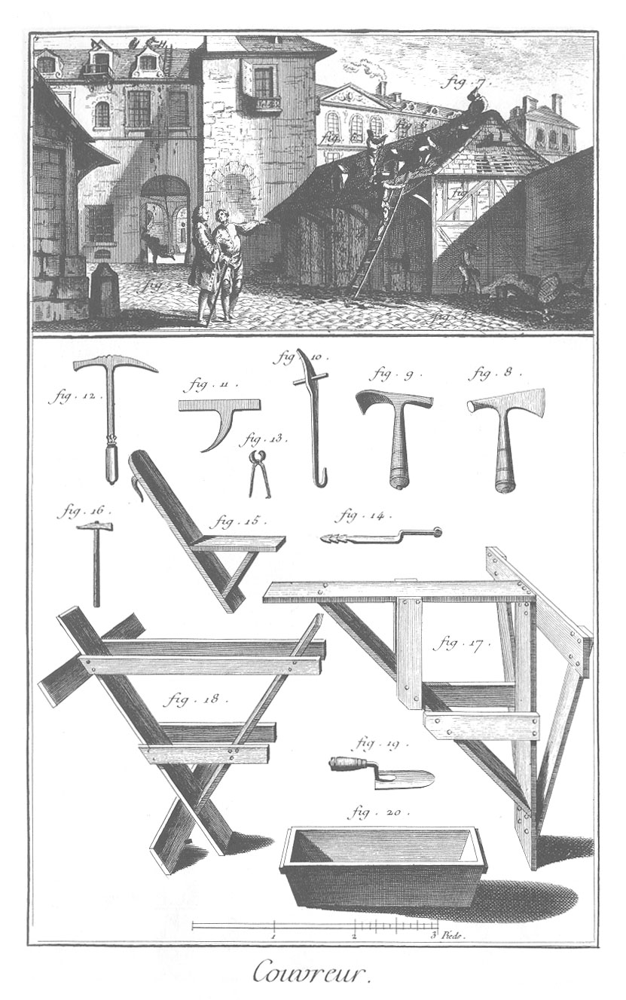

COUVREUR.
=========

1. Batiment à la couverture duquel on travaille.
2. Architecte qui donne des ordres au principal ouvrier.
3. Manoeuvre qui prépare le plâtre pour le gâcher.
4. Manoeuvre qui porte aux ouvriers le platre gâché.
5. Ouvrier qui balaye les places où l'on doit employer le plâtre.
6. Ouvrier qui pose les tuiles sur le latis.
7. Ouvrier qui pose les faîtieres.
8. Marteau à couper.
9. Marteau à hacher.
10. Contrelatoir.
11. Enclume sur laquelle on coupe les ardoises.
12. Marteau à couper l'ardoise.
13. Tenailles.
14. Tire-clou.
15. Oiseau.
16. Martelet.
17. Chevalet.
18. Chevalet rampant.
19. Truelle.
20. Auge à gâcher.

[->](../16-Carreleur/Légende.md)
