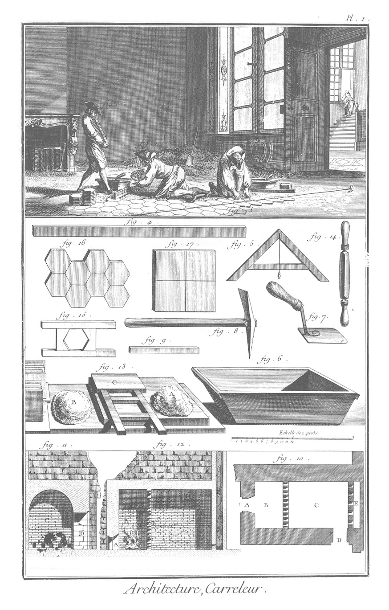
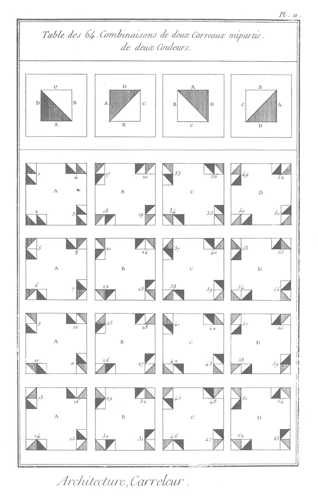

CARRELEUR.
==========

PLANCHE I.ere
--------------

1. Ouvrier qui nivelle le plancher.
2. Manoeuvre qui porte le carreau à l'ouvrier qui le pose.
3. Ouvrier qui pose le carreau.
4. Regle.
5. Niveau.
6. Auge à mortier.
7. Truelle.
8. Décentoir.
9. Plane. Les figures suivantes appartiennent à la maniere de faire le carreau.
10. Plan du four à cuire le carreau.
	- A, porte de la bouchette.
	- B, la bouchette.
	- C, le four.
	- D, le têtin.
	- E, la cheminée.
11. Coupe du four prise en-travers, en regardant du côté de la cheminée.
12. Coupe du four, de la bouchette & de la cheminée prise sur la longueur.
13. 
	- A, terre argilleuse pêtrie pour faire le carreau.
	- B, tas de sable pour mêler à la terre.
	- C, moule quarré.
14. Couteau à couper la terre.
15. Moule exagone.
16. Petits carreaux exagones.
17. Petits carreaux quarrés.

PLANCHE II.
-----------

Soixante-quatre combinaisons des carreaux mi-partis de deux couleurs.

[->](../../12-Argenteur/Légende.md)
