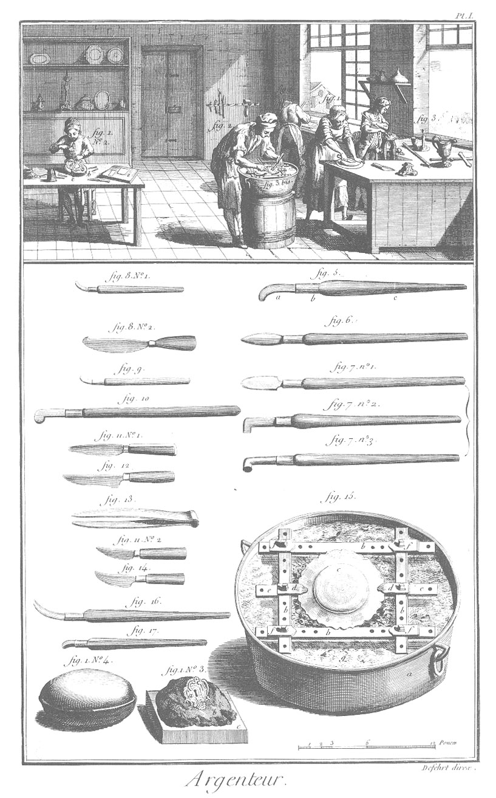
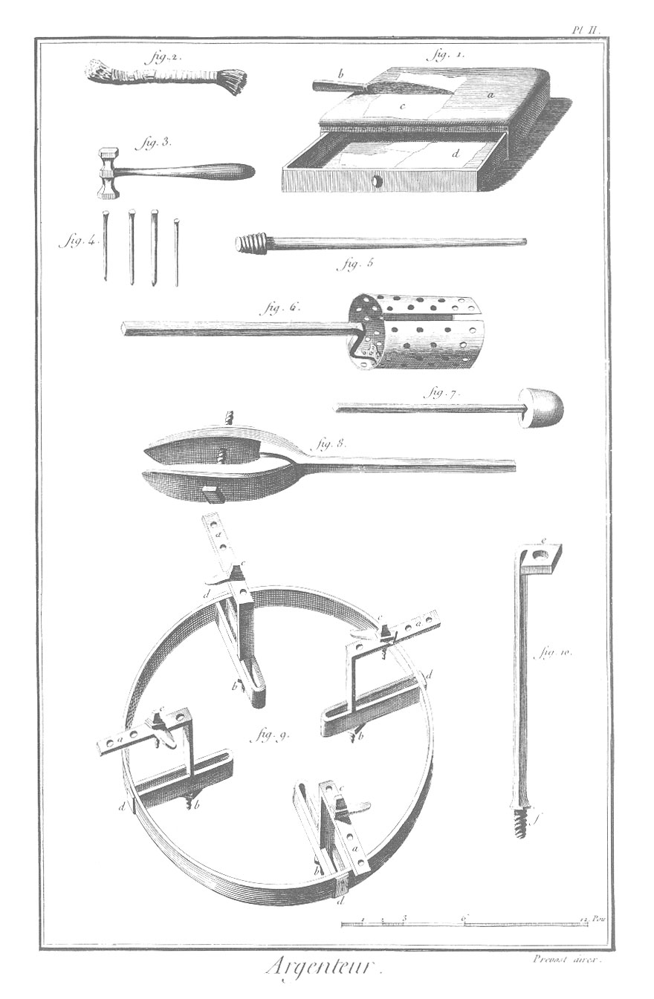

ARGENTEUR
=========

Contenant deux Planches.

PLANCHE I.ere
-------------

Vignette.

1. 
	- n. 1. Maniere de hacher une assiete ou autres pieces. Cette opération se fait avec les couteaux représentés au bas de la Planche, fig. 8. n. 2. & fig. 11. 12. 14.
	- n. 2. Ouvrier qui cizele une piece.
		- a, la piece.
		- b, coussin représenté au bas de la Planche, figure 1. n. 4.
		- c, corde qui passe au-travers de la table, & qu'on revoit en d sous le pié du ciseleur. Cette corde sert à contenir la piece. Quand elle est petite, on la met en ciment sur un bloc, tel qu'on le voit au bas de la Planche, fig. 1. n. 3.
		- a, piece appliquée sur le ciment.
		- b, le ciment.
		- c, morceau de bois pour recevoir le ciment.
		- e, coussinet sur lequel se coupe la feuille d'argent, représenté au bas de la Planche, fig. 1. n. 4. 
2. Maniere de charger, c'est-à-dire d'appliquer les feuilles d'argent sur la piece. L'ouvrier tient de la main droite le brunissoir à ravaler, & de l'autre les brusselles. 
3. &
	- bis. La chaudiere répétée fig. 15.
4. Ouvrieres qui brunissent une piece.

Bas de la Planche.

5. Brunissoir appellé féve.
	- a, le brunissoir.
	- b, la virole ou frete.
	- c, le manche.
	
6. Brunissoir appellé droit.
7. 
	- n. 1. Brunissoir appellé mousse.
	- n. 2. Brunissoir en forme de T.
	- n. 3. Brunissoir appellé croche.
8. 
	- n. 1. Brunissoir à ravaler.
	- n. 2. Couteau à hacher.
9. Autre brunissoir à ravaler.
10. Brunissoir appellé grosse-féve.
11. &
	- 11. n. 2. &
12. Autres couteaux à hacher.
13. Les brusselles, espece de pinces pour prendre les feuilles d'argent.
14. Autres couteaux à hacher.
15. Chaudiere remplie de cendre g, sur laquelle on pose les pieces qu'on veut charger ou argenter.
	- b, b, b, b, le mandrin.
	- c, assiete posée sur le mandrin, & retenue par les vis d, d, sur les barres e, e. Les trous qu'on voit sur les barres du mandrin, sont destinés à recevoir les vis f, f, f, f, pour donner au mandrin l'ouverture qu'exige la forme ou la grandeur de la piece.

PLANCHE II.
-----------

1. Coussinet à tiroir sur lequel on coupe les feuilles d'argent.
	- a, peau garnie par dessous, & formant une espece de petit matelas.
	- b, le couteau.
	- c, feuille d'argent.
	- d, dedans du tiroir.
2. Gratte-bosse.
3. Masse ou marteau à ciseler.
4. Ciselets de différentes grandeurs.
5. Mandrin pour les piés de chandeliers d'église.
6. Mandrin à caffetieres.
7. Mandrin à timballes.
8. Mandrin à bec pour les petites pieces qui sont plates.
9. Développement du mandrin à coulisses pour les grandes pieces plates.
	- a, a, a, a, branches percées de plusieurs trous pour les vis.
	- b, b, b, b, écrous pour fixer les branches dans les coulisses.
	- c, c, c, c, les vis.
	- d, d, d, d, coulisses fixées sur le cercle du mandrin.
10. Mandrin à tige.
	- e, écrou dans lequel on fixe la branche d'un chandelier.
	- f, vis pour tenir le pié d'un chandelier.

Nota. Tous les mandrins de l'argenteur sont de fer.

[->](../13-Armurier/Légende.md)
