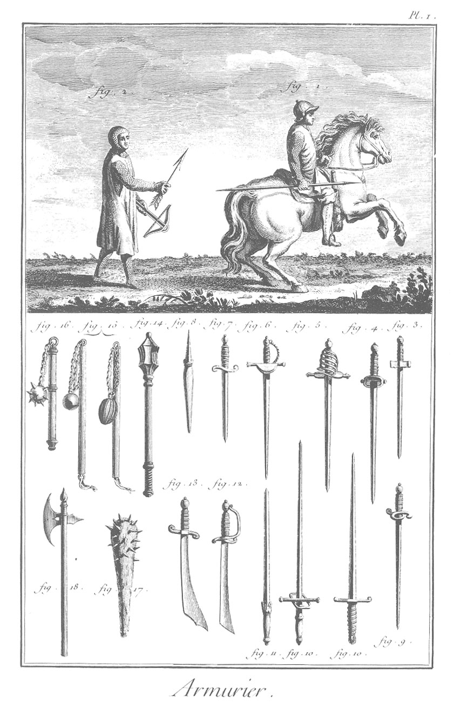
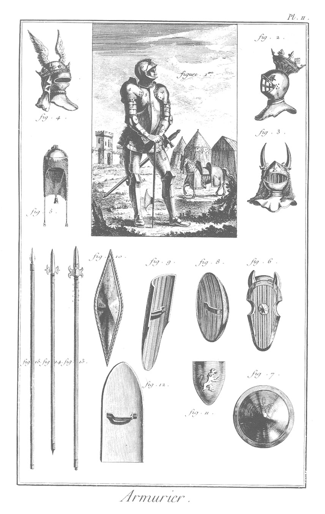

ARMURIER
========

Contenant deux Planches.

PLANCHE I.ere Armures des anciens François.
-------------------------------------------

1. Elle représente un estradiot à cheval avec son arzegaye qu'il tient de la main droite ; il a les manches & les gantelets de mailles, & est vêtu d'une soubreveste. A l'arçon de la selle pend une massue ou masse d'armes. Les estradiots, les argoulets & les carabins composoient la cavalerie legére, & étoient à-peu-près armés de même. On donnoit aussi aux estradiots le nom de cavalerie albanoise. Quant aux argoulets, ils étoient armés de même que les estradiots, excepté la tête, où ils mettoient un cabasset qui ne les empêchoit point de coucher en joue. Leurs armes offensives étoient l'épée au côté, la masse à l'arçon gauche, & à droite une arquebuse de deux piés & demi de long dans un fourreau de cuir bouilli. Les armes défensives des carabins étoient une cuirasse échancrée à l'épaule droite, afin de mieux coucher en joue ; un gantelet à coude pour la main de la bride, le cabasset en tête, & pour armes offensives une longue escopette de trois piés & demi pour le moins, & un pistolet.

2. Représente un fantassin arbalêtrier avec son armure. Il paroît vêtu d'un de ces jacques de cuir de cerf que Louis XI. fit prendre aux francs-archers. Le chaperon, qui est rond, & le gorgerin étoient d'une piece. Il est couvert d'une robe sans manches, assez semblable à une cotte-d'armes, qui va jusqu'au-dessous des genoux. Il tient de la main droite une fleche empennée, & de la main gauche une arbalêtre. Les figures du bas de la Planche représentent différentes sortes d'épées anciennes & de diverses nations, que l'on voit au cabinet d'armes de Chantilli, telles que le braquemart 3 ou épée courte, l'épée de rencontre 9, l'estocade ou épée de longueur 4, l'espadon 10-10, dont on se sert à deux mains.

	- 11, l'épée fourrée ou en bâton.
	- 5, l'épée à la suisse.
	- 6, l'épée à l'espagnole.
	- 7, poignard. 8, bayonnette.
	- 12, sabre.
	- 13, cimetere.
	- 14, masse d'armes de Bertrand du Guesclin.
	- 15, 15, masses d'armes de Roland & d'Olivier, si fameux du tems de Charlemagne, que l'on voit à Roncevaux.
	- 16, autre masse, les boulets pesent environ huit livres, les manches ont deux piés & demi de long.
	- 17, massue.
	- 18, hache d'arme du connétable de Clisson.

PLANCHE II.
-----------

1. Représente un gendarme ; elle est tirée d'un monument du commencement du quinzieme siecle.
	- 1, casque ou heaume.
	- 2, hausse-col.
	- 3, cuirasse.
	- 4, épaulieres.
	- 5, brassarts.
	- 6, gantelets.
	- 7, tassettes.
	- 8, cuissarts.
	- 9, genouilleres.
	- 10, greves ou armures des jambes.

On voit dans le lointain le cheval du gendarme ou du chevalier. La tête du cheval est couverte par un chamfrain, & le corps est bardé. Cette derniere figure est tirée de la médaille de Charles VII. & de la figure de Philippe-le-Bel, qui est dans l'église de Notre-Dame de Paris.

Les figures 2. 3. 4. représentent des cimiers, c'est-à-dire des ornemens que les princes & chevaliers mettoient au-dessus de leur heaume ou casque.

La figure 2. est le cimier royal ; c'est une couronne placée au-dessus du casque, qui a une visiere composée de petites grilles.

La figure 3. est le cimier du comte de Boulogne (Dammartin) à la bataille de Bovines ; c'étoient deux cornes faites de fanons de baleine.

La figure 4. est le cimier du connétable de Clisson.

La figure 5. est un bonnet de mailles que l'on mettoit sous le casque.

Les figures du bas de la Planche représentent, sçavoir:

La fig. 6. le chamfrain, piece principale de l'harnois du cheval ; il y en avoit de métal & d'autres de cuir bouilli. Le chamfrain servoit d'arme défensive au cheval, auquel on l'appliquoit comme un masque ou casque.

Les figures 7. 12. sont des boucliers.

7. Rondelle ou rondache.
8. Rondelle ovale.
9. Targe, bouclier de piéton.
10. Autre bouclier de piéton.
11. Bouclier de cavalier.
12. Grande targe appellée pavois ou tallevas.

Ceux qui les portoient s'en servoient pour se mettre à couvert des traits que les assiégés lançoient de dessus leurs murailles, & couvroient aussi les archers des assiégeans, qui, à la faveur de cet abri comme d'un logement, pouvoient tendre leurs arquebuses.

13. Pertuisane.
14. Hallebarde.
15. Pique.

Enfin on peut conclure avec le P. Daniel, auteur de la milice françoise, duquel ceci est extrait, qu'outre l'épée & la lance, les chevaliers & écuyers se servoient de toutes sortes d'instrumens pour armes, dès qu'ils étoient propres à tuer ou à assommer les ennemis

[->](../14-Arquebusier/Légende.md)
