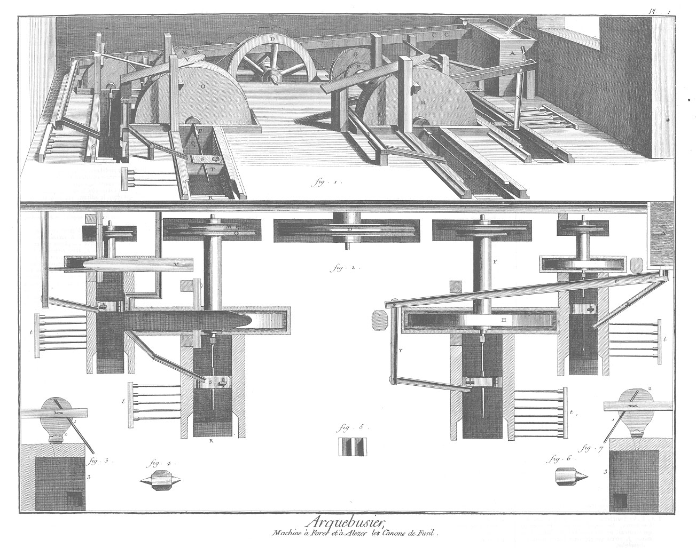
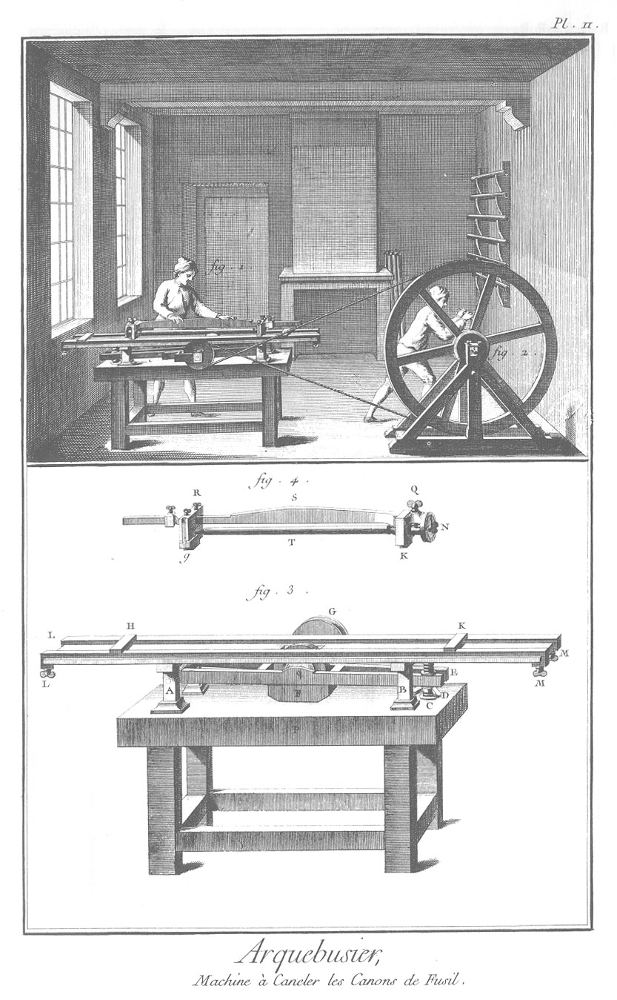
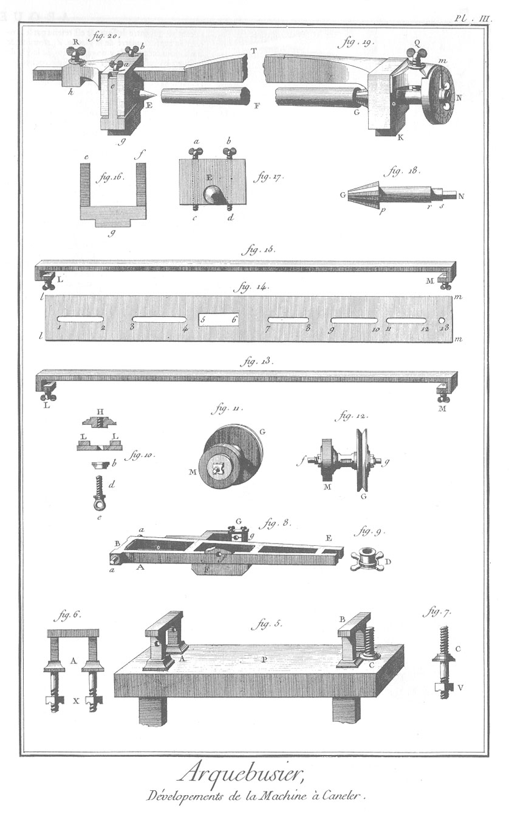
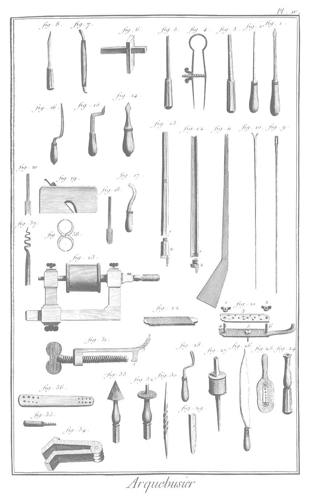
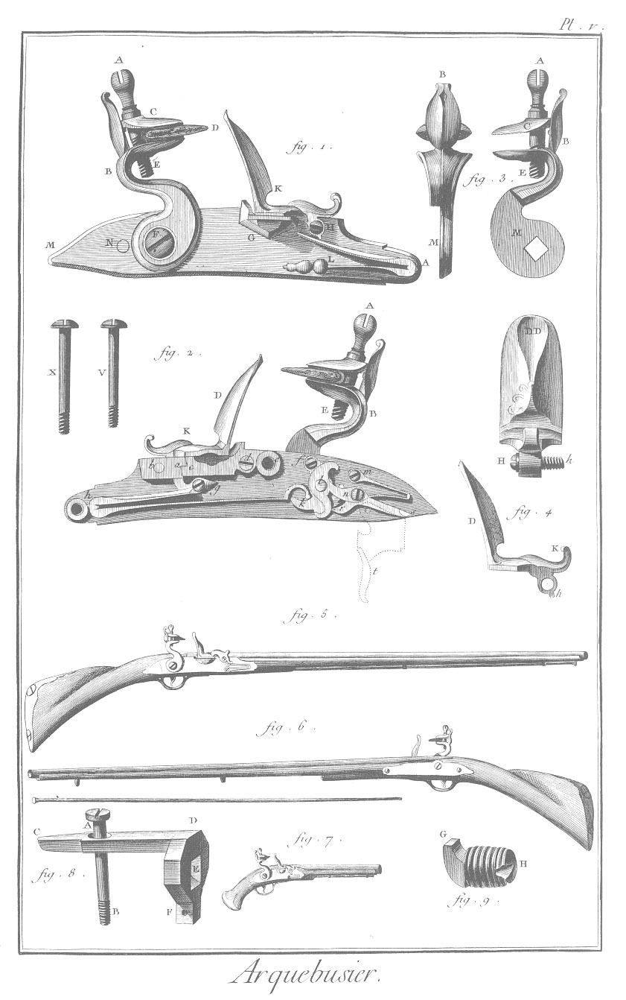

ARQUEBUSIER
===========

Contenant une Planche double & cinq Planches simples, ou sept Planches.

PLANCHE Iere. double.
---------------------

Machine à forer & à aleser les canons de fusil.

1. 
	- A, Bac qui se remplit d'eau.
	- B, tuyau ou canette qui conduit l'eau dans le bac A.
	- CC, canal qui conduit l'eau sur les aubes de la roue D.
	- D, roue qui fait tourner la poulie E.
	- E, poulie qui fait tourner l'arbre F.
	- F, arbre qui fait tourner la roue G, & la meule H, & le quarré I, où est adapté le foret L.
	- La roue G fait tourner la roue M.
	- La roue M, par un arbre N qu'on ne voit pas, commun à cette roue M & à la meule O, fait tourner la meule O, le quarré P, & le foret Q.
	- R, fosse du foreur.
	- S, fermeture.
	- T, piece échancrée qui porte le canon.
	- V, planche où est placé le semeur.
	- C, X, Y, rigoles qui portent de l'eau à toutes les fosses.

Plan de la machine.

2. Les mêmes lettres désignent les mêmes parties que ci-dessus.
3. Voyez la fig. 7\.
4. Voyez la fig. 6\.
5. Espece d'enclume à étamper en rond.
6. Deux enclumes, l'une à une seule bigorne, & l'autre à deux.
7. Plans de deux forges.
	- 1, la branloire.
	- 2, le soufflet.
	- 3, la forge.

PLANCHE II.
-----------

Machine à canneler les canons de fusil.

1. L'établi & la machine toute montée.

2. Le tourneur qui met la machine en travail.

3. Vûe de la machine plus développée par le côté opposé à celui que la vignette montre.
	- P, l'établi.
	- A, B, chevalets portant la table, & que l'on voit séparés, fig. 6. Pl. III. & montés, fig. 5. même Pl. III.
	- A, E, fourchettes qui portent la meule.
	- C, vis qui sert à lever & à abaisser l'extrémité E des fourchettes.
	- D, bras de l'écrou, qui ayant sa partie extérieure faite en poulie, reçoit les extrémités E des fourchettes.
	- L M, L M, regles de fer servant de guide au chariot.
	- H, K, deux TE'servant à limiter la course du chariot.
	- G, poulie sur laquelle passe la corde qui vient de la grande roue. L'axe de cette poulie porte la meule dont la partie inférieure plonge dans l'auge F.

4. Le chariot.
	- g, K, les patins.
	- Q, R, vis de pression, qui assujettissent la premiere Q, le déviseur N & la seconde R, la poupée à pointe lisse.
	- S, verge ou tige du chariot.
	- T, canon de fusil, pris entre les pointes des poupées Q, R.

PLANCHE III.
------------

5. Vûe de l'établi P, la table (fig. 14.) de la machine étant ôtée.
	- A, B, les chevalets.
	- C, vis qui passe entre les fourchettes.

6. Un des deux chevalets, le chevalet A séparé de l'établi ; les embases des montans terminées en boulons taraudés, pour recevoir, après avoir traversé la table de l'établi, les écrous X, qui servent à fixer ces chevalets sur l'établi : le chevalet B est fixé sur l'établi de la même maniere.

7. Vis C de la fig. 5. vûe séparément. Son embase est aussi terminée par un boulon taraudé, qui reçoit, après avoir traversé l'établi, l'écrou V.

8. 
	- A, E, les fourchettes.
	- G, coq ajoûté à l'une des fourchettes, dans lequel sont placés les colets g, qui reçoivent un des tourillons de l'arbre de la meule.
	- f, colets qui reçoivent l'autre tourillon.
	- F, l'auge.
	- B, traverse percée, à laquelle sont assemblées les fourchettes. Cette traverse est reçue entre les deux montans du chevalet A, où elle est fixée par la cheville a a, qui passe par les deux montans & toute la longueur de cette traverse.

9. Ecrou qui reçoit intérieurement la vis C de la fig. 5. & extérieurement les extrémités E des fourchettes. D, croisillons de l'écrou.

10. Assemblage de pieces, dont la fonction est de limiter la course du chariot entre les jumelles. H, le TE', coupé suivant sa longueur, & dont on voit l'intérieur taraudé.
	- L L, coupe des jumelles qui reposent sur la table.
	- b, virole ou goutte de cuivre, par laquelle passe la vis d. Cette vis, après avoir traversé la table, entre dans le TE'H. e, oeil de la vis.

11. 

	- M, la meule-taillée.
	- G, la poulie.

12. fig, l'arbre commun de la meule M, & de la poulie G, qui y sont fixées par des écrous.

13. Deux pieces pareilles ; ce sont des regles qui servent de guides au chariot.
	- L, M, vis de pression qui assujettissent-ces guides sur la table.

14. 

	- l m, l m, plan de la table.
	- 5, 6, ouverture, par laquelle la partie supérieure de la meule sort, comme on voit, fig. 3. 1, 2, 3, 4, 7, 8, 9, 10, 11, 12, 13, mortoises, à-travers lesquelles passent les vis d e, fig. 10. qui servent à fixer les TE'qui limitent la course du chariot.

15. Voyez la fig. 13.

16. Patins mobiles de la poupée à pointe lisse.
	- g, partie du patin qui marche entre les guides LM, LM des fig. 13. & 15.
	- e, f, lardons qui entrent dans les parties latérales de la poupée.

17. Elévation de la poupée, du côté de la pointe E. a c, b d, vis servant à éloigner ou à approcher le patin du corps de la poupée.

18. Pointe à pans, qui porte l'alidade du diviseur.
	- G, partie cannelée qui entre dans la culasse du canon.
	- p r, partie cylindrique qui traverse la poupée, & sur laquelle la vis d'arrêt Q de la fig. 19. vient appuyer.
	- r s, autre partie cylindrique, qui traverse l'épaisseur du cadran.
	- s N, partie quarrée, qui reçoit l'écrou à oreilles, qui porte l'aiguille ou l'alidade m, fig. 19. du diviseur.

19. Poupée fixe du chariot.
	- K, partie du patin qui passe entre les deux coulisses.
	- F, les parties du canon, du côté de la culasse, où la pointe à pan G est entrée.
	- N, le diviseur.
	- N m, l'aiguille ou l'alidade.
	- Q, vis de pression, qui fixe la pointe cannelée dans la situation requise.

20. La poupée mobile.
	- E, la pointe lisse qui entre dans l'ouverture du bout du canon E F.
	- g, patin qui passe entre les guides L M des fig. 13. & 15.
	- a b, vis servant à éloigner le patin du corps de la poupée, pour que la surface à canneler soit parallele à la table.
	- e, une des fourchettes du patin mobile.
	- h, boîte de la poupée.
	- R, vis de pression, qui assujettit cette poupée sur la barre du chariot.
	- T F, fracture de cet assemblage entier.

PLANCHE IV.
-----------

1. Foret en bois.
2. Broche pointue.
3. Queue de rat en bois.
4. Compas en ressort.
5. Broche à pans.
6. Trusquin.
7. Pierre sanguine.
8. Ciseau.
9. Lavoir.
10. Gratoir.
11. Calibre.
12. Canon carabiné.
	- 1, le canon coupé en deux sur sa longueur.
	- 2, la culasse.
13. Canon brisé.
	- 1, le canon.
	- 2, la culasse.
14. Langue de carpe.
15. Ciseau à bride.
16. Equoine.
17. Bec de corbin.
18. Fer du rabot à canon.
19. Rabot à baguette.
20. Fer de ce rabot.
21. Calibre double avec ses parties d'assemblage, 1, 2, 3, 4, 5, 6.
22. Calibre simple.
23. Chevalet avec la fraise à bassinet.
24. Porte-tareau.
25. Plastron.
26. Archet.
27. Foret avec sa boîte.
28. Rifloir.
29. Etampe quarrée.
30. Pointe à tracer.
31. Monte-ressort.
	- 1, sa griffe.
	- 2, le bec.
	- 3, le dos.
32. Fraise à roder.
33. Fraise pointue.
34. Tenaille ; à chamfrain.
35. Tareau.
36. Filiere.
37. Tire-boure.
38. Compas d'épaisseur.

PLANCHE V.
----------

1. Platine vûe en-dehors, & garnie de toutes ses pieces.
	- M, la platine, dont les bords sont terminés en biseau.
	- B, le chien.
	- C, mâchoire supérieure, dont le dessous qui s'applique sur le cuiret qui embrasse la pierre, est taillé ou piqué comme une rape à bois pour mieux la retenir ; la mâchoire inférieure est taillée de même.
	- A E, vis de mâchoire.
	- F, clou de chien.
	- D, la pierre.
	- G, le bassinet.
	- K, la batterie.
	- H, vis qui fixe la batterie sur la platine.
	- L, ressort de batterie.
	- N, extrêmité de la plus longue des deux vis qui fixent la bride de l'autre côté de la platine.

2. Platine vûe en-dedans, & garnie de toutes ses pieces.
	- B, le chien.
	- A E, vis de mâchoire.
	- D K, batterie appliquée sur le bassinet.
	- b, extrémité de la vis de batterie taraudée dans un renfort b a reservé à la platine & dans son épaisseur.
	- c d, bassinet dont la partie c est retenue par le crochet a du renfort.
	- d, vis du bassinet ; la tête est noyée dans un trou fraisé.
	- e, renfort cylindrique, au centre duquel est un trou foncé, fraisé & taraudé, pour recevoir la plus longue vis X.
	- h, autre renfort taraudé de même, pour recevoir la vis V. Ces deux vis servent à fixer la platine & le porte-vis sur le fût du fusil.
	- g h k, grand ressort, dont le talon appuye contre le le renfort quarré.
	- g, vis du grand ressort.
	- l, tourillon de la noix.
	- k, la noix.
	- f, courte vis qui passe dans un canon de la bride.
	- n, longue vis qui traverse un des bras de la bride, & le trou de la gâchette, à laquelle elle sert de centre de mouvement.
	- r s, la gâchette.
	- t, la détente, indiquée par des lignes ponctuées.
	- m, ressort & vis de gâchette.

3. Le chien vû par le dos, & du côté par où il s'applique à la platine.
	- B M, chien vû par le dos.
	- A M, chien vû par le côté.
	- M, partie plane, qui s'applique sur la platine, dans le milieu de laquelle est un trou quarré qui reçoit le quarré de la noix.
	- A B C E, comme dans les figures précédentes.

4. Elévation & profil de la batterie.
	- D D, la batterie du côté extérieur.
	- H, h, vis qui fixe la batterie sur la platine.
	- D, partie concave de la batterie, à laquelle la pierre s'applique pour faire feu.
	- h, talon de la batterie, contre lequel le ressort de batterie appuye pour la tenir appliquée sur le bassinet.
	- K, autre talon de la batterie, qui vient s'appuyer sur le ressort pour limiter sa course, lorsqu'elle est renversée par le choc de la pierre.

5. Fusil entier du côté de la platine, & garni de sa baguette ; la piece de couche qui termine la crosse, est fixée par deux vis à bois.

6. Fusil entier dégarni de sa baguette, & vû du côté du portevis.

7. Pistolet d'arçon, vû du côté de la platine.

8. Culasse brisée, à laquelle s'applique le canon du fusil.
	- C D, queue de la culasse, qui est encastrée de toute son épaisseur dans le fût où elle est fixée par une vis A B, dont la partie taraudée B entre dans l'écrou pratiqué au renfort d de la piece de détente fig. 22. de la P. VI. Elle est aussi fixée par une goupille qui traverse le fût & le trou F. E, ouverture ou mortoise quarrée, qui reçoit le crochet G de la vis de culasse (fig. 9.); ce qui réunit le canon à la culasse brisée.
9. Vis de culasse.
	- G, le crochet.
	- H, entaille qui est dirigée vers la lumiere du canon.

PLANCHE VI.

10. Platine vûe en-dehors, & dégarnie de toutes ses pieces.
	- F, ouverture circulaire & lisse, qui reçoit le tourillon du quarré de la noix.
	- N, trou taraudé, qui reçoit par l'autre côté la vis de la gâchette.
	- G, entaille qui reçoit le bassinet.
	- H, trou taraudé. qui reçoit la vis de batterie.
	- L, trou lisse fraisé par l'autre côté qui reçoit la tête de la vis du ressort de batterie.
	- 2, trou lisse, qui reçoit le pié du ressort de batterie.
11. Platine vûe en-dedans, & dégarnie de toutes ses pieces.
	- h, trou foncé, fraisé & taraudé dans un renfort cylindrique reservé à la platine qui reçoit la vis V (fig. 2. Pl. V.).
	- e, autre trou semblable, qui reçoit la vis X; ces deux vis traversent toute l'épaisseur du fût. 
	- 2, trou lisse, qui reçoit de l'autre côté le pié du ressort de la batterie.
	- 4, trou lisse foncé & fraisé, qui reçoit le pié du grand ressort.
	- b, trou taraudé dans le renfort quarré, qui reçoit par l'autre côté la vis de batterie.
	- a, crochet qui retient celui du bassinet.
	- d, trou foncé, fraisé & taraudé, qui reçoit la vis du bassinet.
	- L, trou lisse & fraisé, qui reçoit la tête de la vis du ressort de batterie.
	- g, trou foncé, fraisé & taraudé, qui recoit la vis du grand ressort.
	- f, trou foncé & taraudé, qui reçoit la courte vis de la bride.
	- F, trou lisse, qui reçoit le tourillon de la noix.
	- i, trou lisse, foncé & fraisé, qui reçoit le pié de la bride.
	- n, trou taraudé, qui reçoit la longue vis de la bride, après qu'elle a traversé la gâchette.
	- m, trou foncé, fraisé & taraudé, qui reçoit la vis du ressort de gâchette.
	- 3\, mortoise foncée, qui reçoit le pié du ressort de gâchette.

12. Porte-vis ou contre-platine, vû en-dehors.
	- e, h, trous lisses & fraisés pour recevoir les têtes des vis V, X (fig. 2.), qui assujettissent la platine au fut du fusil.

13. Sous-garde vûe de profil.
	- A C, D E, parties de la sous-garde, qui s'appliquent au fût où elles sont encastrées de presque toute leur épaisseur.
	- G, arc qui embrasse la détente ; il a en G environ dix lignes de large : E, crochet qui est reçu dans un piton fixé dans le fût.
	- B, tenon percé d'un trou, pour recevoir une goupille qui traverse l'épaisseur du fût.

14. Détente en profil & en face.
	- a, trou lisse, dans lequel passe la goupille qui fixe la détente dans le fût.
	- b, partie de la détente qui s'applique contre la gâchette.
	- c, entaille qui repose sur l'extrémité a de la fente a c (fig. 22.) de la piece de détente ; ce qui l'empêche de retrograder.
	- d d, partie de la détente, sur laquelle on applique le doigt pour faire partir le chien.
	- e f, goupille de la détente.

15. Bassinet vû par-dessus & par-dessous.
	- A, cavité du bassinet, dans laquelle on met la poudre qui sert d'amorce, & sur laquelle on abat la batterie, dont le dessus est aussi entaillé du côté de la lumiere.
	- e, crochet qui entre dessous, & est retenu par le crochet du renfort quarré de la platine.
	- d, trou lisse & fraisé pour recevoir & y noyer la tête de la vis de bassinet.
	- B, bassinet, vû par-dessous.
	- c, crochet.
	- d, trou lisse.
	- e, partie arrondie, qui est reçue dans l'entaille G de la platine (fig. 10.), à laquelle le bassinet s'applique des deux côtés.

16. La bride vûe par-dessus & par-dessous.
	- l, trou lisse, qui reçoit le petit tourillon de la noix.
	- f, canon ou trou lisse, qui reçoit la partie lisse de la vis F.
	- n, trou lisse dans un des bras de la bride, qui re- çoit la vis N, dont la partie lisse traverse la gâchette.
	- r f, un des piliers d'un des bras.
	- s, autre pilier fixé à l'autre bras ; il repose sur la platine.

17. La noix A, vûe du côté qui s'applique à la bride.
	- 4, petit-tourillon, qui entre dans le trou lisse de la bride.
	- k, levée sur laquelle appuye le grand ressort.
	- 1, cran qui repose sur la gâchette, lorsque le chien est sur son repos.
	- 2, cran moins profond, qui repose sur la gâchette, lorsque le chien est bandé.
	- B C D, noix vûe en élévation.
	- B, petit tourillon, qui entre dans le trou lisse de la bride.
	- C, tourillon du quarré; il traverse la platine.
	- D, le quarré qui reçoit le chien.
	- E, noix vûe du côté qui s'applique à la platine ; le quarré est percé d'un trou foncé, fraisé & taraudé, pour recevoir le clou du chien F, qui fixe le chien sur la noix.

18. Plan & profil du ressort de gâchette.
	- m n o, le ressort.
	- m, la vis qui entre dans le trou m de la platine.
	- o, partie du ressort qui repousse la gâchette.
	- 2, pié du ressort qui entre dans la mortoise quarrée 3 de la platine (fig. 11.) 

19. Plan & profil du grand ressort.
	- g h k, le ressort.
	- g, extrémité de la vis, qui est reçue dans le trou de même nom de la platine.
	- 4, pié du ressort, qui entre dans le trou 4 de la même platine.

20. Profil & plan de la gâchette.
	- n, trou lisse, qui re- çoit la vis N de la fig. 16.
	- r, dent qui s'applique dans les crans 1, 2 de la noix (fig. 17.), lorsque le chien est sur son repos, ou qu'il est bandé.
	- s, bras de la gâchette, sous lequel s'applique la partie b de la détente (fig. 14.)

21. Plan & profil du ressort de batterie.
	- L, vis qui fixe ce ressort à la platine, & dont la tête est noyée dans le trou fraisé L de la platine (fig. 10 & 11.) ; la partie taraudée de cette vis est reçue dans un canon 3 de la même piece que le ressort.
	- 2, pié du ressort, qui est reçu dans le trou 2 de la platine.

22. Piece de détente, dont les extrémités sont recouvertes par celles de l'arc de la sous-garde.
	- a c, fente par laquelle passe la détente (fig. 14.).
	- d, renfort percé d'un trou foncé, fraisé & taraudé, qui reçoit l'extrémité B de la vis de culasse (fig. 8.)

[->](../15-Art_militaire/1-Contenant.md)
