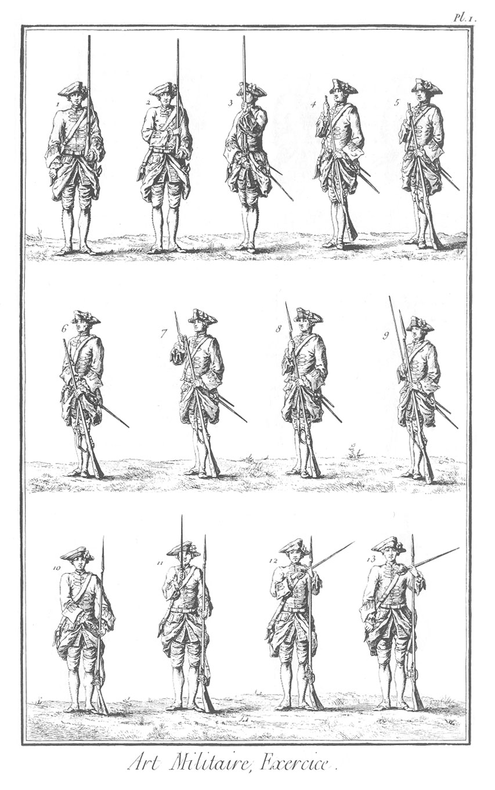
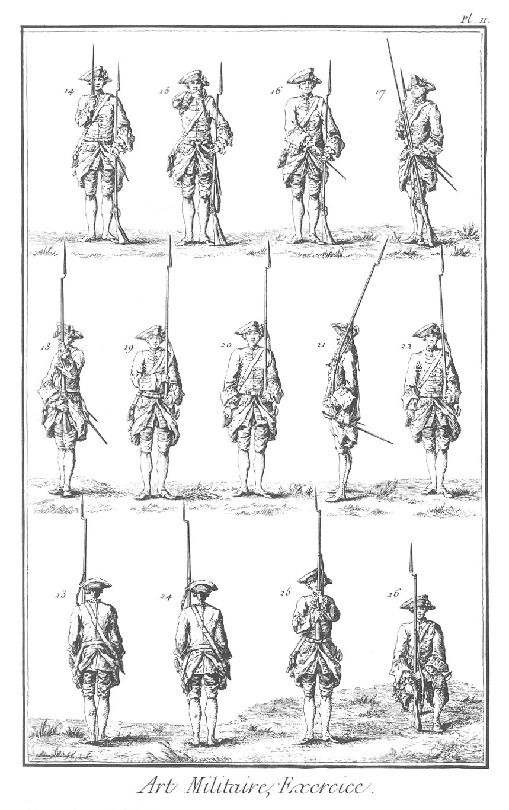
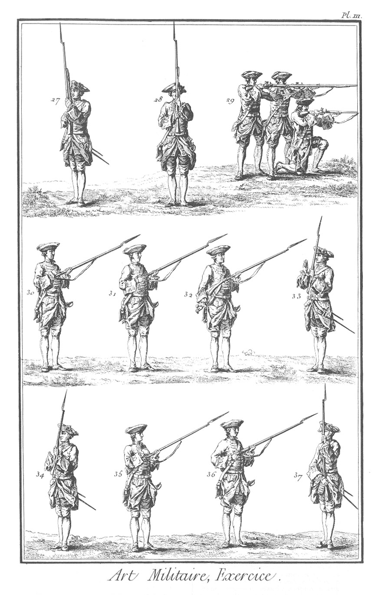
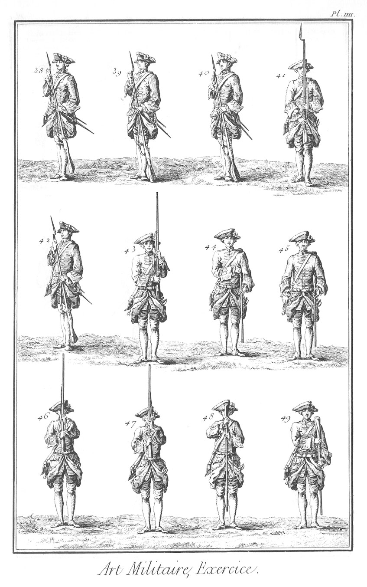
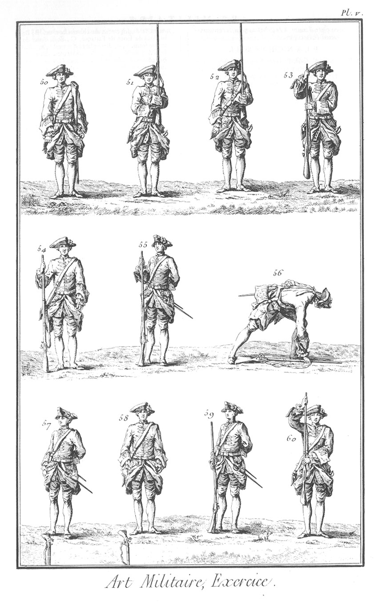

EXERCICE DE L'INFANTERIE.
=========================

PLANCHE I.ere.
--------------

1. Soldat portant le fusil.
2. Passez le fusil du côté de l'épée ; premier tems.
3. &
4. &
5. Passez le fusil du côté de l'épée ; deuxieme, troisieme & quatrieme tems.
6. Mettez la bayonnette au bout du canon ; premier tems.
7. &
8. Mettez la bayonnette au bout du canon ; deuxieme & troisieme tems.
9. Mettez la baguette dans le canon ; premier tems.
10. Tirez vos épées ; premier tems.
11. &
12. &
13. Tirez vos épées ; deuxieme, troisieme & quatrieme tems.

PLANCHE II.
-----------

14. Remettez vos épées ; deuxieme tems.
15. &
16. Remettez vos épées ; troisieme & quatrieme tems.
17. Remettez la baguette en son lieu ; premier tems.
18. Portez vos armes ; premier tems.
19. &
20. Portez vos armes ; deuxieme & troisieme tems.
21. A droite.
22. Demi-tour à droite ; premier tems.
23. &
24. Demi-tour à droite ; deuxieme & troisieme tems.
25. Haut les armes ; deuxieme tems.
26. Apprêtez vos armes ; premier rang.

PLANCHE III.
------------

27. Apprêtez vos armes ; deuxieme rang.
28. Apprêtez vos armes ; troisieme rang.
29. En joue.
30. Feu.
31. Mettez le chien en son repos.
32. Prenez la cartouche.
33. Déchirez la cartouche avec les dents ; premier tems.
34. Déchirez la cartouche avec les dents ; deuxieme tems.
35. Amorcez.
36. Fermez le bassinet.
37. Passez vos armes du côté de l'épée ; premier tems.

PLANCHE IV.
-----------

38. Passez vos armes du côté de l'épée ; deuxieme tems.
39. Passez vos armes du côté de l'épée ; troisieme tems.
40. Mettez la cartouche dans le canon.
41. Présentez vos armes ; troisieme tems.
42. Passez vos armes du côté de l'épée ; troisieme tems.
43. Passez la platine sur le bras gauche ; deuxieme tems.
44. &
45. Passez la platine sur le bras gauche ; troisieme & quatrieme tems.
46. Portez le fusil ; premier tems.
47. Renversez le fusil ; deuxieme tems.
48. &
49. Renversez le fusil ; troisieme & quatrieme tems.

PLANCHE V.
----------

50. Renversez le fusil ; cinquieme tems.
51. Portez l'arme au bras ; deuxieme tems.
52. Portez l'arme au bras ; troisieme tems.
53. Reposez-vous sur le fusil ; troisieme tems.
54. Reposez-vous sur le fusil ; quatrieme tems.
55. Posez le fusil à terre ; premier tems.
56. &
57. Posez le fusil à terre ; deuxieme & troisieme tems.
58. Posez le fusil à terre ; quatrieme tems.
59. Reprenez le fusil ; troisieme tems.
60. Portez le fusil ; premier tems.

[->](../3-Evolutions_de_l'infanterie/Légende.md)
