EVOLUTIONS de l'infanterie.
===========================

PLANCHE I.ere
-------------

[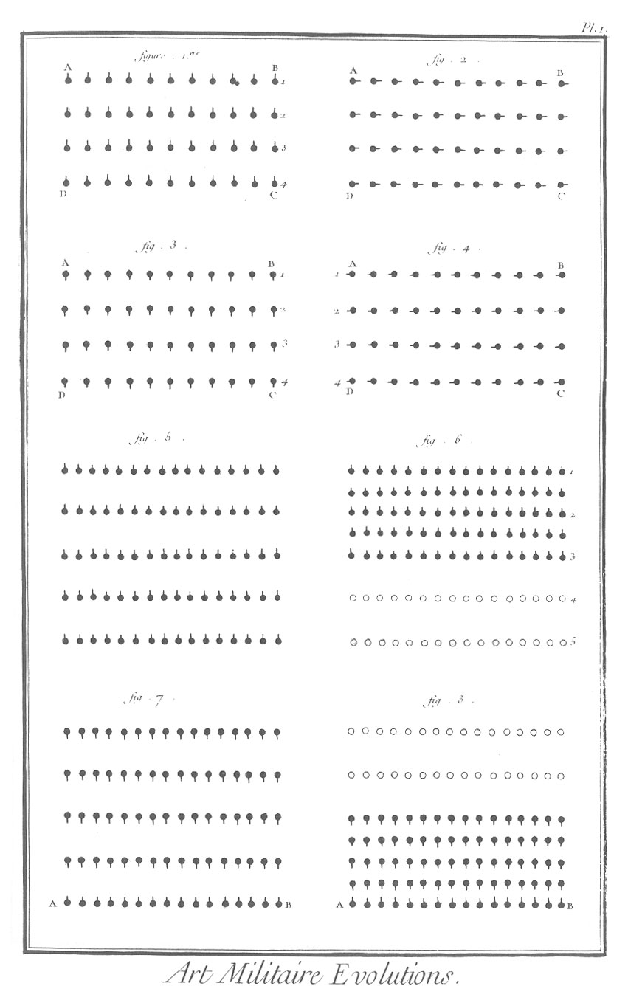](Planche_01.jpeg)

Avis. Dans cette Planche & les suivantes, les soldate sont marqués par des points noirs qui désignent le centre de l'espace qu'ils occupent. Comme on suppose que les soldats se touchent, il ne faudroit point d'intervalle entre les points ; mais alors les figures seroient trop confuses & les mouvemens que ces Planches doivent représenter ; trop difficiles à être observés.

On a tiré sur chaque point une petite ligne droite pour exprimer les armes du soldat, c'est-à-dire le côté où il les présente, & par conséquent celui où sa tête est tournée.

Dans les figures où il y a des zéros ou points blancs. ces points marquent les places que les soldats occupoient d'abord, & qu'ils laissent vuides par le mouvement qu'on leur fait exécuter.

1. Cette figure représente une troupe d'infanterie sur quatre rangs.

2. La même troupe précédente qui a fait à-droite.

3. La même troupe qui a fait deux à-droite.

4. La même qui a fait trois à-droite ; le quatrieme la remet dans sa position primitive (fig. 1.)

5. Elle représente une troupe en bataille à rangs ouverts, à laquelle on veut faire serrer les rangs.

6. La même troupe qui a serré ses rangs en-avant.

7. La même troupe dont tous les rangs, excepté le dernier A B, ont fait demi-tour à droite pour se serrer sur A B.

8. La même troupe serrée sur le dernier rang A B, qui n'a point bougé.

PLANCHE II.
-----------

[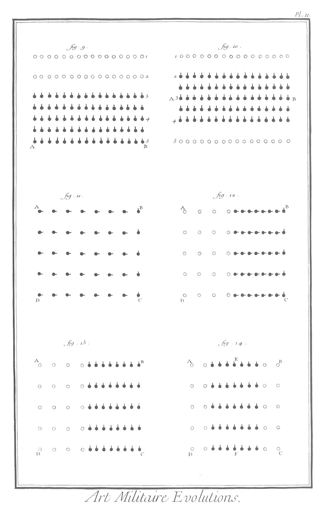](Planche_02.jpeg)

9. Elle représente les rangs qui ont serré, après avoir fait demi-tour à gauche pour faire face en tête.

10. La même troupe qui a serré ses rangs sur celui du milieu A B.

11. Elle représente une troupe à file ouverte dont toutes les files, excepté celle de la droite B C, ont fait à droite pour se serrer sur cette file.

12. Le mouvement précédent exécuté, en sorte que les files qui ont marché faisant à gauche, se trouveront faire face en tête comme B C.

13. Elle fait voir la troupe précédente après que toutes les files qui ont marché ont fait à gauche.

14. Elle représente la même troupe qui a serré ses files sur celle du centre E F.

PLANCHE III.
------------

[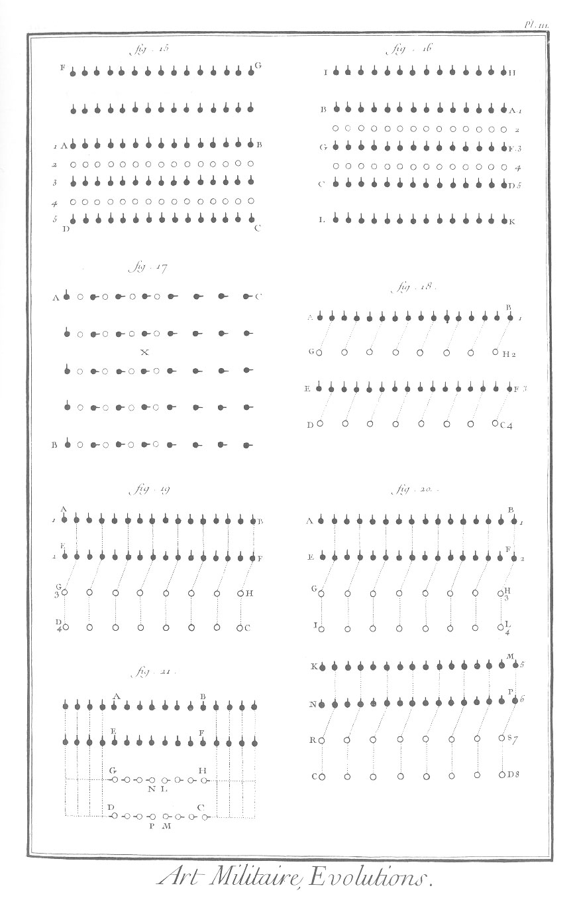](Planche_03.jpeg)

15. Elle représente une troupe A B C D, qui a ouvert ses rangs en-avant ; en sorte que le premier A B est parvenu en F G.

16. La même troupe A B C D, qui a ouvert ses rangs en- avant & en-arriere ; en sorte que le premier A B est parvenu en H I, & le dernier C D en L K.

17. Elle représente une troupe qui s'ouvre par files vers la droite.

18. Elle représente une troupe qui a doublé ses rangs à droite, les rangs G H & D C étant entrés dans A B & E F.

19. Elle représente une troupe qui a doublé ses rangs par demi-files à droite en-avant.

20. Elle représente une troupe A B C D, qui a doublé ses rangs par quatre de file en-avant.

21. Troupe qui a doublé ses rangs en-avant par demi-files sur les aîles.

PLANCHE IV.
-----------

[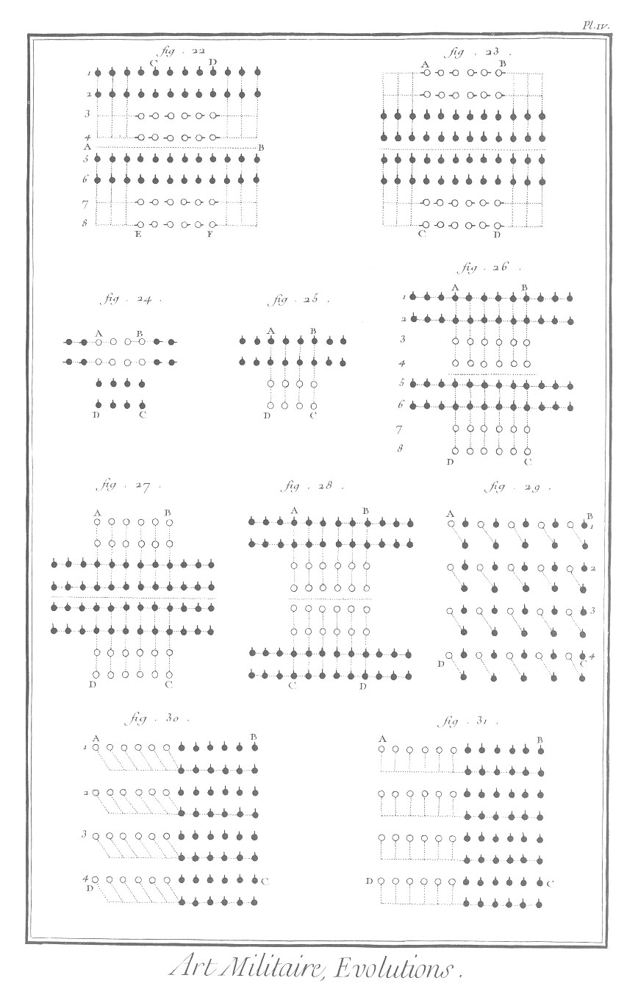](Planche_04.jpeg)

22. Troupe C D E F, qui a doublé ses rangs en- avant par quarts de files sur les aîles.

23. Troupe A B C D, qui a doublé ses rangs sur les aîles par quarts de files de la tête & de la queue.

24. Troupe A B C D, qui 2 doublé ses rangs en-dedans par demi-files.

25. Elle présente la troupe de la figure précédente, qui a doublé ses rangs en-dedans par le centre.

26. Elle représente une troupe A B C D sur huit rangs, qui a doublé ses rangs en-dedans par quarts de files. Les points blancs marquent la place qu'occupoient les rangs qui ont doublé.

27. Troupe rangée d'abord en A B C D, qui a doublé ses rangs en-dedans par quarts de files de la tête & de la queue.

28. Troupe qui occupoit d'abord l'espace A B C D, & qui a doublé ses rangs par quarts de files du centre.

29. Troupe A B C D, qui a doublé ses files à-droite.

30. Troupe A B C D, qui double ses files par demi-rangs vers l'aîle droite.

31. Elle représente la même troupe A B C D, qui double ses files par demi-rangs à droite, sans faire marcher les soldats de côté.

PLANCHE V.
----------

[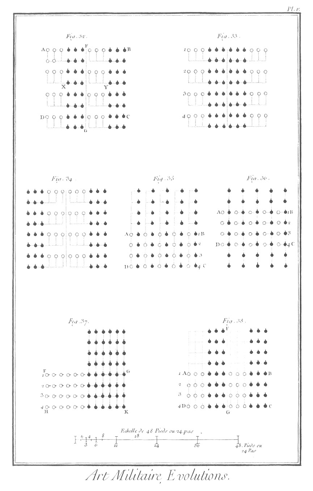](Planche_05.jpeg)

32. Troupe A B C D, qui a doublé ses files à droite par quarts de rangs.

33. Elle représente une troupe qui a doublé ses files à droite & à gauche par quarts de rangs des aîles.

34. Elle représente une troupe qui a doublé ses files à droite & à gauche par quarts de rangs du mileu.

35. Troupe A B C D, qui a doublé ses files en tête ou en- avant.

36. Troupe A B C D, qui a doublé ses files en-dedans à droite.

37. Troupe F G H K, qui a doublé ses files à droite par demi-rangs en-avant.

38. Troupe A B C D, qui a doublé ses files à droite en- avant par quarts de rangs.

PLANCHE VI.
-----------

[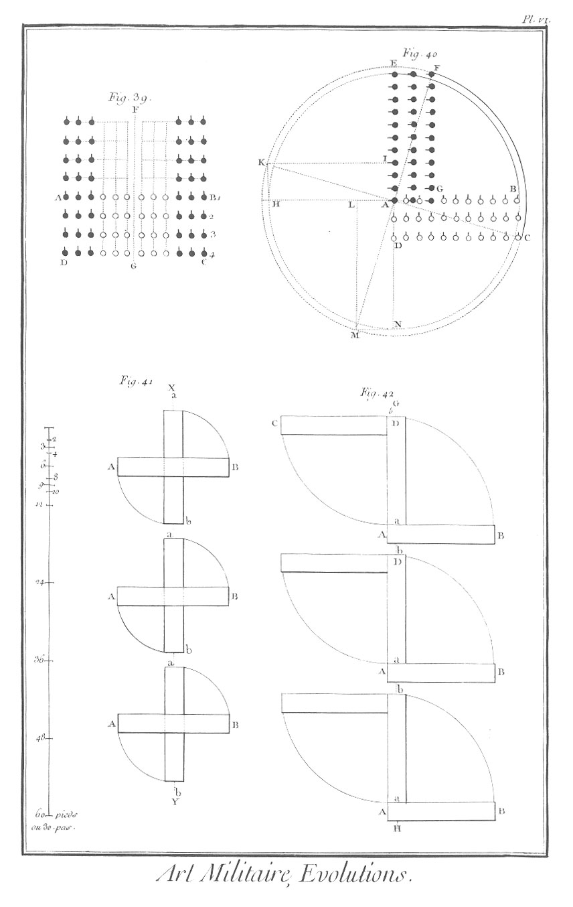](Planche_06.jpeg)

39. Troupe A B C D, qui a doublé ses files en tête à droite & à gauche par quarts de rangs du milieu.

40. Cette figure sert à expliquer le quart de conversion. La troupe d'abord placée en A B C D, ayant décrit le quart de conversion à gauche sur le pivot A, se trouve en A G E F. Un second quart de conversion du même sens la mettroit en A I K H; un troisieme, en A L M N; & un quatrieme, dans sa premiere position A B C D.

41. &
42. Elles servent à faire voir, sçavoir : la premiere 41. que les troupes, comme A A, A B, qui dans la marche sont obligées de faire face à un de leurs flancs, doivent le faire par une conversion centrale, plûtôt que par le quart de conversion ordinaire ; parce qu'en faisant ensuite le même mouvement dans un sens contraire, elle se retrouvent dans leur même position : & la fig. 42. que si les troupes A B, A B ont fait face au flanc de la marche par un quart de conversion, & qu'elles veuillent ensuite se remettre en marche par un autre quart de conversion, elles quittent alors le chemin qu'elles suivoient d'abord, pour en prendre un autre à côté.

PLANCHE VII.
------------

[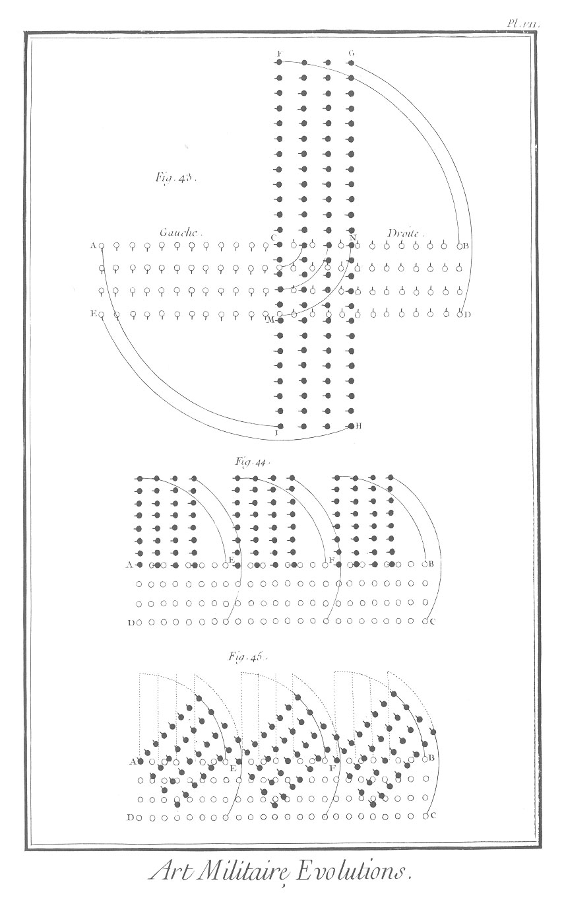](Planche_07.jpeg)

43. Elle représente une troupe rangée d'abord en A B D E, qui se trouve en F G H I par un quart de conversion fait sur le centre C.

44. Elle représente la troupe A B C D partagée en trois divisions, qui ayant chacune exécuté le quart de conversion du même côté, se trouvent en colonne ou à la suite les unes des autres.

45. Elle représente les divisions de la même troupe, lorsquelles n'ont encore exécuté que la moitié de leur mouvement.

PLANCHE VIII.
-------------

[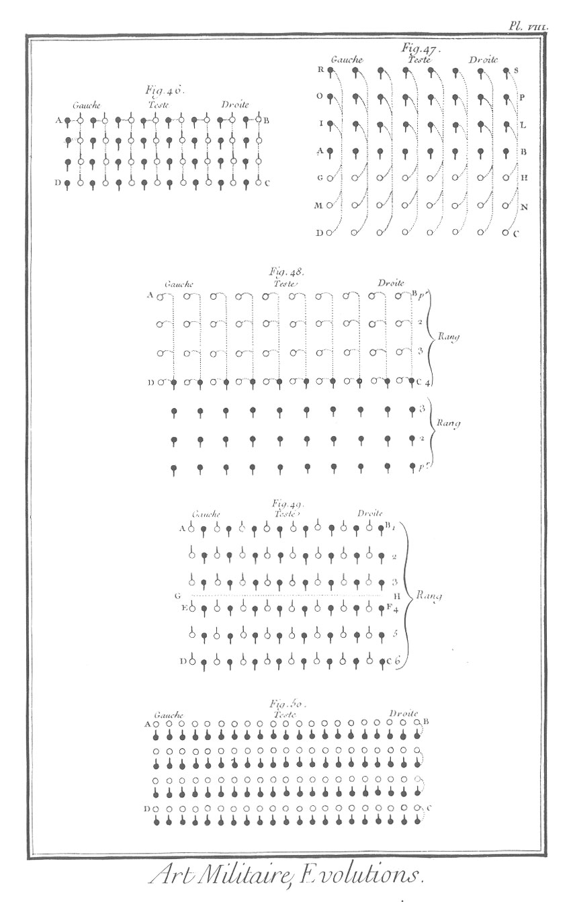](Planche_08.jpeg)

46. Troupe A, B, C, D, qui fait la contre-marche par files, conservant le même terrein.

47. Cette figure représente une troupe A, B, C, D, qui fait la contre marche en quittant ou en perdant le terrein, ou la file après soi.

48. Troupe A, B, C, D, qui a fait la contre-marche en gagnant le terrein.

49. Troupe A, B, C, D, rangée à six de hauteur, qui a fait la contre marche à droite par chefs de files & de demi-files.

50. Cette figure sert à expliquer la maniere de faire la contre-marche par rangs.

PLANCHE IX.
-----------

[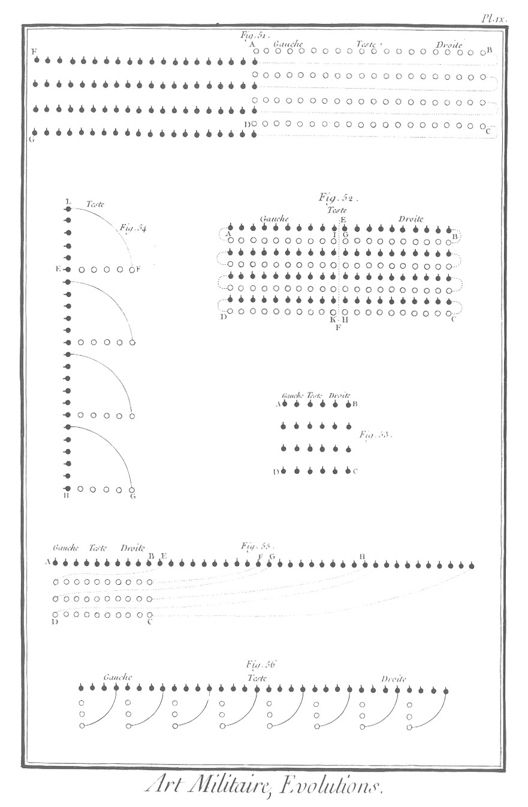](Planche_09.jpeg)

51. Cette figure sert à expliquer la maniere de faire la contre-marche par rangs en changeant de terrein ou en gagnant le terrein. L'espace A, B, C, D, est la premiere position de la troupe ; les points noirs représentent la seconde, après que la contre-marche est exécutée.

52. Troupe A, B, C, D, qui a fait la contre-marche par demi-rangs, partant des aîles ou des flancs de la troupe.

53. Troupe A, B, C, D, à laquelle on veut faire border la haie par rangs.

54. La même troupe ayant ouvert ses rangs de l'étendue de chacun pour border la haie ; ce qu'ils font par un quart de conversion à gauche, qui met toute la troupe sur le rang L, H.

55. Cette figure représente une troupe A, B, C, D, qui borde la haie en tête par rangs.

56. Cette figure représente une troupe qui a bordé la haie en tête par files.

PLANCHE X.
----------

[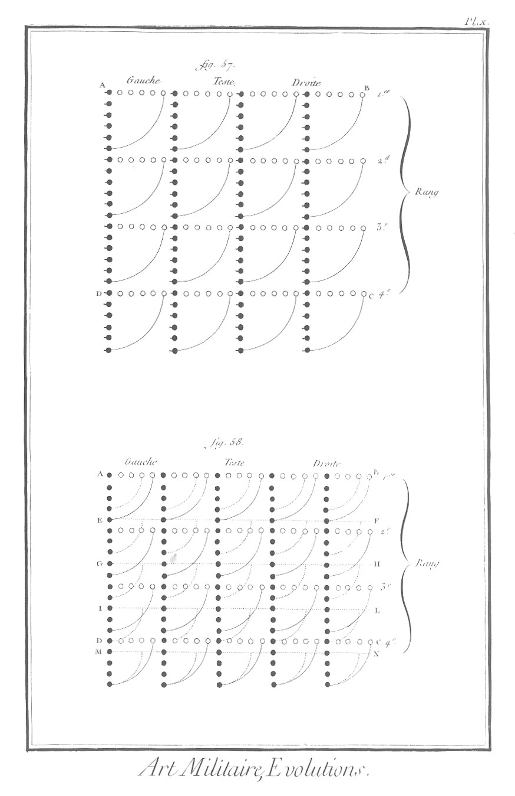](Planche_10.jpeg)

57. Cette figure sert à expliquer la maniere de faire former des haies à une troupe A, B, C, D.

58. On donne dans cette figure la maniere d'augmenter ou de diminuer les rangs d'une troupe A, B, C, D, par le moyen de l'évolution précédente. Cette troupe étoit d'abord sur quatre rangs marqués par les points blancs, après lui avoir fait former cinq haies exprimées par les points noirs. Divisant chacune de ces haies en cinq parties égales, & faisant faire à chaque division un quart de conversion à droite, elles formeront les cinq rangs marqués par les lignes A B, E F, G H, I L & M N.

PLANCHE XI.
-----------

[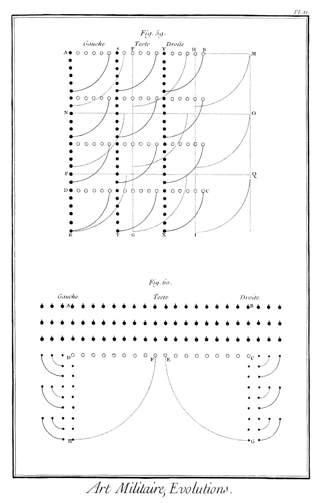](Planche_11.jpeg)

59. Cette figure sert à faire voir que la méthode donnée dans la précédente figure, pour augmenter ou diminuer les rangs d'une troupe, ne peut avoir lieu ; que les rangs de la troupe & les haies peuvent se diviser exactement en autant de parties égales que l'on veut avoir de rangs.

60. On donne dans cette fig. une méthode particuliere pour diminuer les rangs d'une troupe ; par exemple, la troupe A B C D ayant quatre rangs, de les réduire à trois.

PLANCHE XII.
------------

[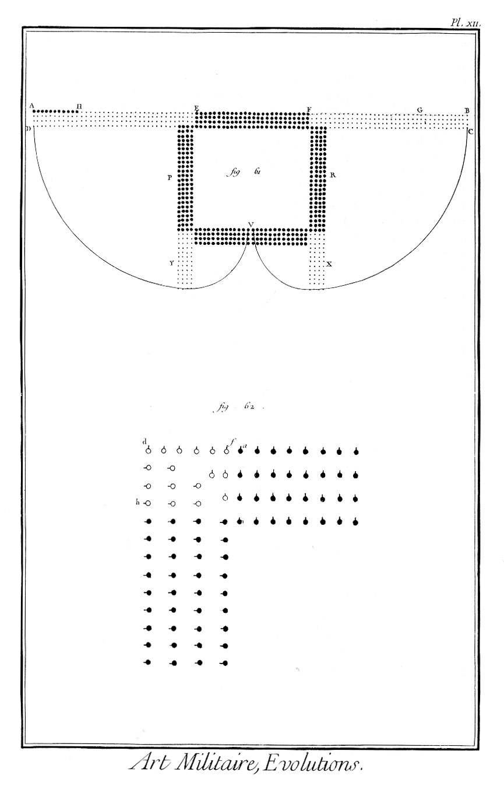](Planche_12.jpeg)

61. Une troupe ou un bataillon A B C D étant rangé en bataille, par exemple, sur quatre rangs, on donne dans cette figure la maniere de le former en quarré.

62. Comme après la formation dont il s'agit dans la figure précédente, il reste des vuides aux angles du quarré, on explique dans celle-ci la maniere dont on peut s'y prendre pour les remplir.

PLANCHE XIII.
-------------

[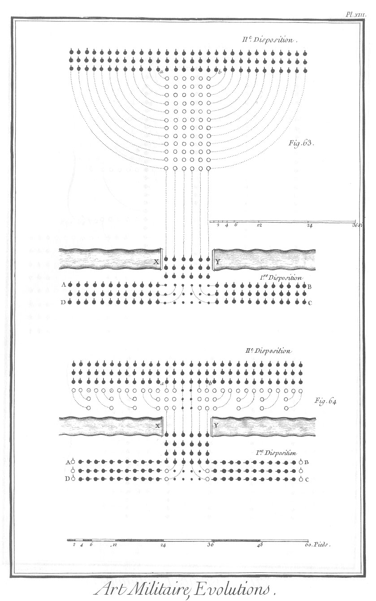](Planche_13.jpeg)

63. On donne dans cette figure la maniere de défiler par files & par le centre ; la premiere disposition que fait la troupe A B C D qui défile par le centre sur le pont ou le défilé X Y; & la seconde, la même troupe qui s'est reformée après le passage du défilé.

64. Cette figure sert, comme la précédente, à donner la maniere de défiler par files & par le centre. On y suppose que le pont ou le défilé X Y peut contenir de front le double d'hommes de la hauteur du bataillon A B C D, qui est sur trois rangs. La premiere disposition fait voir la division du centre qui entre dans le défilé X Y, & les autres divisions de la gauche qui se mettent en état de la suivre ; la seconde disposition, la maniere dont la troupe se reforme après le passage du défilé.

PLANCHE XIV.
------------

[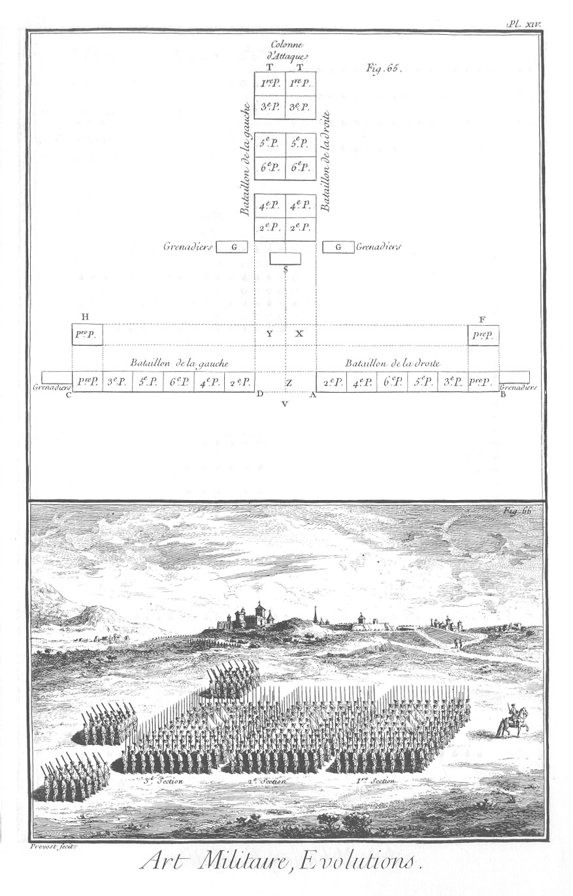](Planche_14.jpeg)

65. Cette figure sert à expliquer la formation de la colonne d'attaque T T S, composée des deux bataillons A B & C D, éloignés l'un de l'autre de l'intervalle des piquets, qu'on a supprimés dans cette figure, & divisés par pelotons. F & H sont les premiers pelotons de chacun des deux bataillons qui ont marché en-avant par huit pas redoublés, & qui ensuite doivent marcher l'un & l'autre par les flancs opposés pour se réunir en X & Y, d'où ils marchent en-avant pour former la tête de la colonne ; les autres pelotons du bataillon de la droite & de celui de la gauche faisant successivement le même mouvement, la colonne se trouve formée. G, G sont les grenadiers placés d'abord aux aîles de la ligne formée des deux bataillons A B & C D, & ensuite à l'extrémité des aîles de la queue de la colonne. S est le peloton des surnuméraires. On voit dans cette figure les trois sections qui forment la colonne.

66. Cette figure représente la colonne de M. le chevalier Follard divisée dans ses trois sections, avec les grenadiers qui forment trois pelotons à la queue.

[->](../4-Evolutions_de_la_cavalerie/Légende.md)
