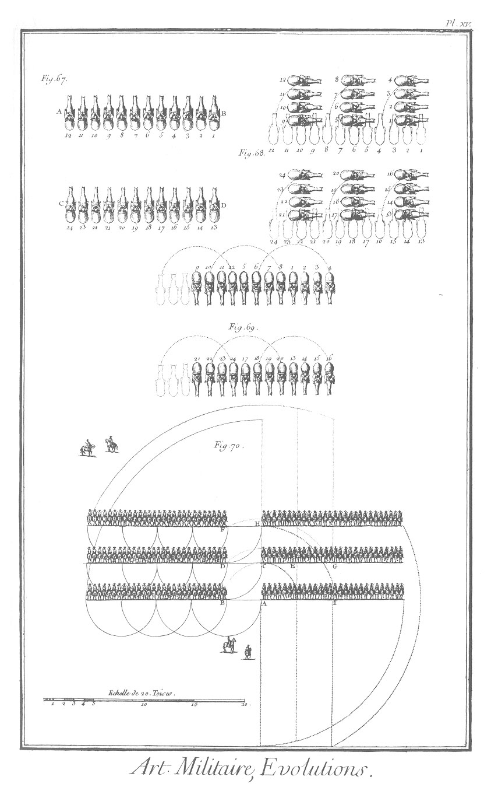

EVOLUTIONS de la cavalerie.
===========================

PLANCHE I.ere
-------------

Nota. Dans les trois premieres figures de cette Planche on a représenté les chevaux par leur projection perpendiculaire sur le terrein. On a eu soin d'observer leurs principales dimensions, c'est-à-dire leur longueur & leur largeur ; de cette maniere ils sont, pour ainsi dire, représentés à vûe d'oiseau, & l'on peut rendre l'exécution de leurs différens mouvemens bien plus sensible & plus distincte que s'ils étoient dessinés comme dans la figure 70. de cette même Planche.

67. Troupe de cavalerie sur deux rangs A B & C D, à laquelle on veut faire faire à-droite ou à gauche par divisions du front de la troupe, pour faire le demi-tour à droite, ou marcher vers ce côté ou vers la gauche.

68. Cette figure fait voir la troupe précédente qui a fai tà droite par quatre cavaliers. Les espaces ponctués représentent ceux que les chevaux occupoient avant le mouvement.

69. Cette figure représente la même troupe qui, ayant fait un second à-droite, fait face à la queue. Les espaces ponctués vers la gauche expriment le terrein que la troupe perd de ce côté dans le moument du demi-tour à droite ; elle gagne vers la droite un autre espace de pareille étendue.

70. Cette Planche représente un escadron de cinquante-six cavaliers de front, composé de quatre compagnies de quarante-deux cavaliers. Les deux compagnies de la droite sont marquées avoir fait à-droite, par demi-compagnie une demi-caracole ; & les lignes ponctuées marquent le mouvement que doit faire chaque demi-escadron, pour que tout l'escadron tourne sur son centre. Les points plus gros marquent le mouvement des deux compagnies de la gauche qui font la caracole à l'ordinaire, le cavalier A servant de pivot. Les portions de cercle en plus petits points, marquent le chemin que doivent parcourir les cavaliers des extrémités de l'autre moitié d'escadron, en sorte que le cavalier B arrivera au point C, le cavalier D au point E, le cavalier F au point G; & que quand la demi conversion sera achevée, l'intervalle qui est entre la ligne F B & la ligne A H se retrouvera entre les lignes C G & A I.

[->](../5-Fortification_&_artillerie/Légende.md)
