FORTIFICATION.
==============

PLANCHE I.ere
-------------

[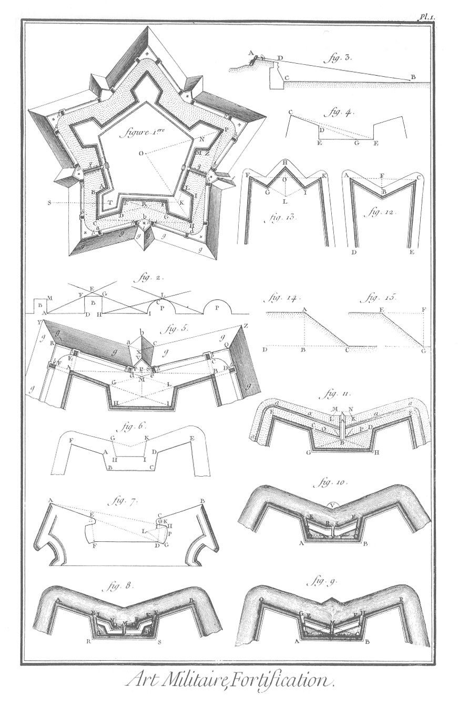](Planche_01.jpeg)

1. Plan d'un pentagone, fortifié avec des bastions & entouré d'un fossé & d'un chemin couvert avec son glacis.
	- A B C D E, est un bastion dont C B & C D sont les deux faces, & B A & D E les flancs.
	- E F, est la courtine ou la partie de l'enceinte entre deux bastions. La partie antérieure de ce polygone marquée par des hachures doubles, est le parapet : ensuite est le terre-plein du rempart en blanc ; puis le talud intérieur exprimé par des lignes paralleles jointes ensemble par de legéres hachures.
	- K N, est le côté intérieur.
	- K L, la demi-gorge du bastion.
	- O P, rayon extérieur.
	- O N, rayon intérieur.
	- C H, côté extérieur.
	- C F, ou E H, ligne de défense.
	- B C D, angle flanqué.
	- C D B, angle de l'épaule.
	- D E F, angle du flanc.
	- C R H, angle flanquant.
	- E C H, angle diminué.
	- C F H, l'angle flanquant intérieur.
	- a b d, contrescarpe : entre la contrescarpe & l'enceinte de la place, est le fossé. L'espace blanc au-delà de la contrescarpe est le chemin couvert.
	- \*, places d'armes rentrantes du chemin-couvert.
	- +, places d'armes saillantes du chemin-couvert.
	- b b, traverses du chemin-couvert.
	- g, g, glacis.
	- q, pont qui traverse le fossé.
	- s, coupure dans le glacis faisant partie du chemin qui aboutit au pont sur le bord de la contrescarpe.

2. Partie de l'enceinte d'une place avec des tours quarrées B & B, & rondes P & P.

3. Profil des remparts d'une place qui fait voir que le soldat placé en A sur la banquette, ne sçauroit en tirant découvrir le pié extérieur C du revêtement du rempart.

4. C E, ligne de défense fichante. C E, feu de courtine, ou second flanc.

5. Cette figure sert pour la construction du fossé, du chemin-couvert, & du glacis g, des places fortifiées.

6. Elle sert à faire voir l'inconvénient qu'il y auroit de faire la contrescarpe parallele à la courtine B C; les flancs A B & D C alors ne pourroient plus défendre les faces D E & A F, des bastions opposés.

7. Construction du flanc concave à orillon.
	- I H, revers de l'orillon.
	- D G, brisure de la courtine,
	- C I, orillon,
	- G P H, flanc concave.

8. Construction de la tenaille à flanc I N O Q P K, dans le fossé.

9. Tenaille simple E M F.

10. Tenaille simple brisée E R S T.

11. Caponiere A B, avec une cunette a u dans le fossé.

12. Tenaille simple qui se faisoit anciennement dans les dehors des places, & qu'on fait encore quelquefois dans la fortification passagere.

13. Tenaille double.

14. & 15. Ces figures font voir la maniere de déterminer le talud A C & E G, qui s'exprime également par B C ou E F.

PLANCHE II.
-----------

[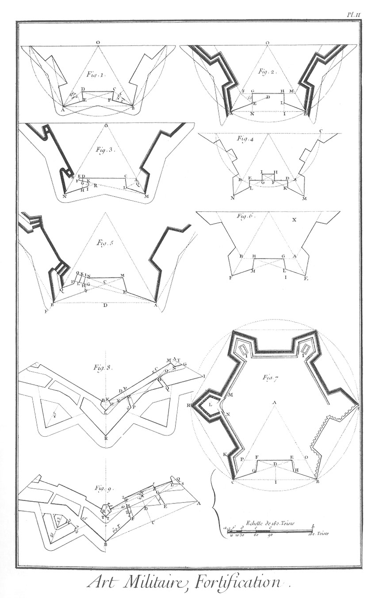](Planche_02.jpeg)

1. Système d'Errard de Bar-le-Duc.

2. Système de Marollois ou des Hollandois.

3. Système du chevalier de Ville.

4. Fortification selon l'ordre renforcé.

5. Système du comte de Pagan.

6. Système d'Allain Manesson Mallet.

7. Premier système de M. le maréchal de Vauban. Le front S B représente le plan du revêtement du rempart avec ses contreforts. L, cavalier. II, magasin à poudre. M & N, rampes pratiquées dans le talud intérieur du rempart, pour monter sur le terre-plein & pour y voiturer le canon.

8. Système de la fortification de Landau, ou second système de M. le maréchal de Vauban.

9. Système de la fortification du Neuf-Brisack, ou troisieme système de M. le maréchal de Vauban.

PLANCHE III.
------------

[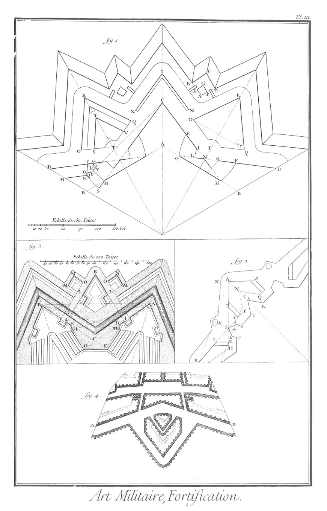](Planche_03.jpeg)

1. Système du baron de Coëhorn.

2. Système de Scheiter.

3. Système de M. Blondel.

4. Plan d'un front de fortification du Neuf-Brisack, pris au niveau des fondemens, pour faire voir l'épaisseur des revêtemens & le plan des contreforts.

PLANCHE IV.
-----------

1. Profil coupé selon la ligne S T de la figure 1. Planche I.
	- A B, niveau de la campagne.
	- A W, talud intérieur du rempart.
	- W E, terre-plein.
	- E G, talud de la banquette.
	- G H, banquette.
	- H L, côté intérieur du parapet.
	- L M, partie supérieure ou plongée du parapet.
	- V Y Q X, contrefort.
	- M N R S T Q Y, revêtement du rempart.
	- N R, escarpe.
	- N, cordon.
	- S u, fossé.
	- u m, contrescarpe.
	- m y, revêtement de la contrescarpe.
	- m c, chemin-couvert.
	- e f, banquette du chemin-couvert.
	- f h, côté intérieur du parapet du chemin-couvert.
	- h g, glacis.
	- l r, palissade du chemin couvert plantée sur la banquette au pié du côté intérieur. a b, échelle.

2. Quarré fortifié avec des demi-lunes & une contre-garde.
	- 4, 5 & 6, demi-lunes.
	- 7, contregarde vis- à-vis le bastion X.
	- \*, demi-lune à flancs.
	- +, redine.
	- m, m, places d'armes dans le fossé de la demi-lune.

3. Cette figure représente le plan d'un front de fortification fortifiée à l'ordinaire d'un fossé, d'une demi-lune, d'un chemin-couvert, & d'un avant-fossé & chemin-couvert avec des lunettes ou redoutes.
	- 1, 2, caponiere.
	- 3, demi-lune.
	- 4, 4, places d'armes dans le fossé sec de la demi-lune.
	- D, batardeau.
	- 6, 6, chemin-couvert.
	- 7, 7, glacis.
	- K K, fleche construite à l'extrémité du glacis.
	- \* \*, communications du chemin-couvert aux fleches & aux ouvrages de l'avant-fossé, avec leurs traverses appellées tambours.
	- 8, 8, avant-fossé.
	- A, lunette.
	- B, redoute.
	- 9, 9, avant-chemin couvert.
	- &, &, glacis de l'avant-chemin-couvert.

4. Ouvrage à corne vis-à-vis une courtine.
	- O T V X S P, front de l'ouvrage à corne.
	- D M & P N, branches de l'ouvrage à corne.

5. Ouvrage à couronne vis-à-vis une courtine.
	- H K I, sont les deux fronts qui forment l'ouvrage à corne.
	- H M & I N, en sont les branches.

6. Cette figure représente le plan d'une citadelle, dont le front A B est tourné vers la ville, & les autres vers la campagne.
	- B l & A F, sont ses lignes de communication avec la place.
	- X Y, est l'esplanade.

PLANCHE V.
----------

[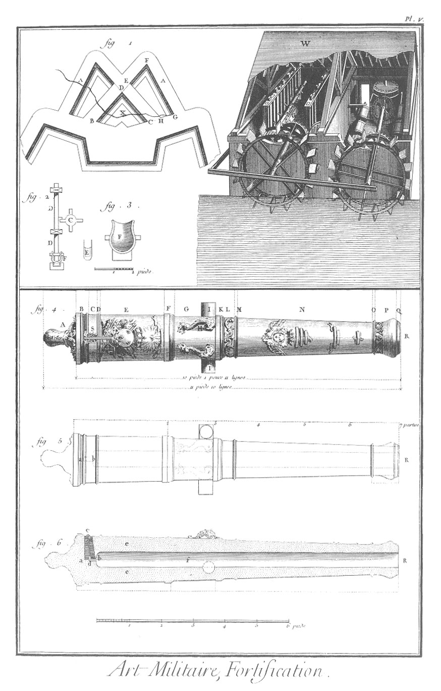](Planche_05.jpeg)

1. 
	- X, demi-lune couverte des grandes lunettes ou tenaillons A & A.
	- W, moulin à poudre avec ses roues, ses pilons & ses mortiers.
	- G, poutre creusée en forme de mortiers dans lesquels on bat la poudre.

2. Profil des pilons & mortiers.
	- C, arbre qui fait mouvoir les pilons.
	- D, pilon.
	- E, bout du pilon qui est armé de fonte.

3.
	- F, coupe d'un des mortiers de fer dans lesquels on battoit anciennement la poudre.

4. Piece de canon de vingt-quatre livres de balle.
	- A, culasse avec son bouton.
	- B, plate-bande & moulures de la culasse.
	- C, champ de la lumiere.
	- D, astragale de lumiere.
	- E, premier renfort.
	- F, plate-bande & moulures du premier renfort.
	- G, deuxieme renfort.
	- H, les anses.
	- I, les tourillons.
	- K, plate-bande & moulures du second renfort.
	- L, ceinture ou ornement de volée.
	- M, astragale de la ceinture.
	- N, volée.
	- O, astragale du colet.
	- P, colet avec le bourrelet en tulipe.
	- Q, couronne avec ses moulures.
	- R, bouche.
	- S, la lumiere.

5. Elle représente la longueur du canon divisée dans les différentes parties selon lesquelles on diminue l'épaisseur du métal, depuis la plate-bande de la culasse jusqu'au collet. Les deux lignes paralleles & ponctuées, renfermées dans l'intérieur de la piece, marquent le vuide ou l'ame du canon. a b, petite chambre qui se pratique au fond de l'ame des pieces de 24 & de 16, qui sert à la conservation du canal de la lumiere.

6. Elle représente la coupe d'une piece de 24. Les parties e, e supérieures & inférieures, remplies de points, font voir l'épaisseur du métal dans toute la longueur du canon. f, l'ame de la piece. a b, la petite chambre au fond de l'ame des pieces de 24 & de 16. c d, le canal de la lumiere, qui est percé dans une masse de cuivre de pure rosette. Cette masse est ombrée par des lignes paralleles au bas de la Planche.

PLANCHE VI.
-----------

[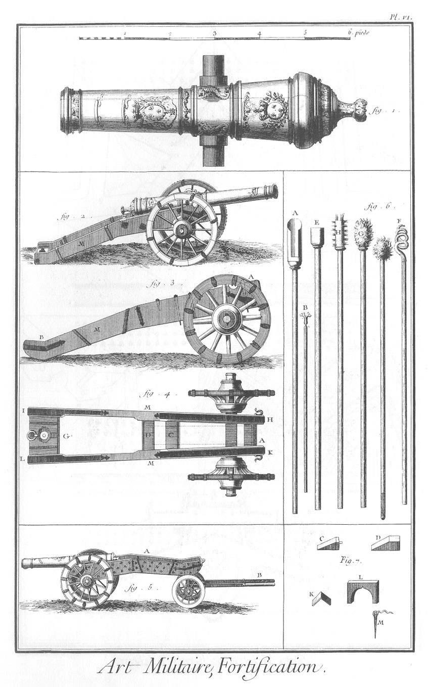](Planche_06.jpeg)

1. Piece de 24 à chambre sphérique, appellée de la nouvelle invention ou à l'espagnole. La chambre & l'ame de cette piece sont marquées par des lignes ponctuées.

2. Canon monté sur son affût.
	- M, flasques de l'affût.

3. Profil de l'affût.
	- M, flasque.
	- B, extrémité du flasque qui est appuyée sur la terre, & qu'on nomme la crosse.

4. Plan de l'affût précédent.
	- H I & K L sont les flasques.
	- A, entre-toise de volée.
	- C, entre-toise de couche.
	- D, entre-toise de mire.
	- G, entre-toise de lunette.

5. Canon monté sur son affût, auquel est attaché l'a vant-train.
	- A, affût.
	- B, l'avant-train.

6. Instrumens pour charger le canon.
	- A, lanterne.
	- B, boutefeu.
	- E, refouloir.
	- F, tirebourre.
	- H, G, I, écouvillons.

7. 
	- C & D, coins de mire.
	- K, chapiteau dont on se sert pour couvrir la lumiere.
	- L, fronteau de mire.
	- M, regorgeoir.

PLANCHE VII.
------------

[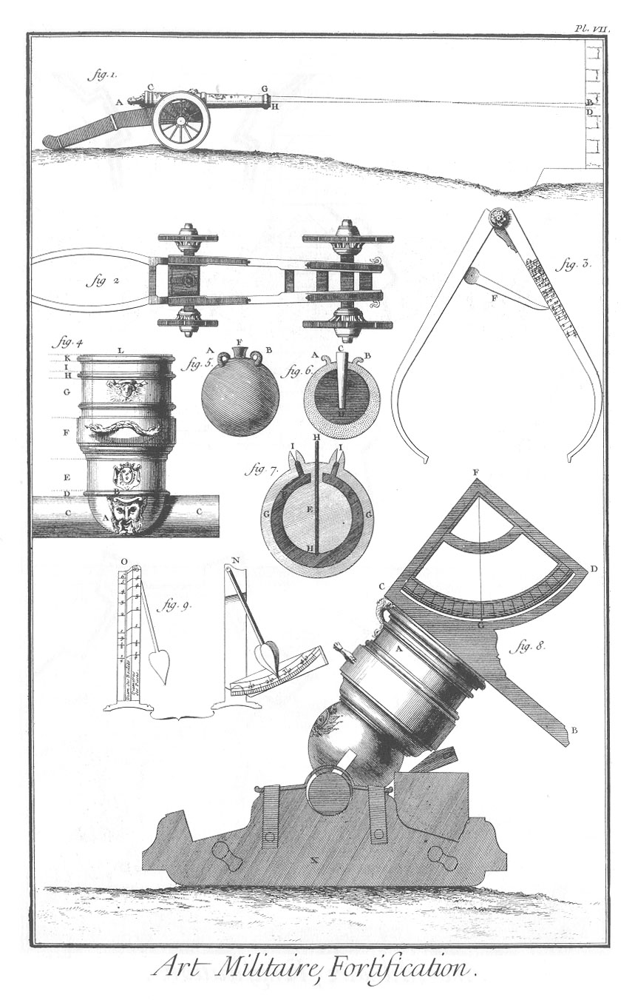](Planche_07.jpeg)

1. Cette figure sert à expliquer le pointage du canon, & à faire voir que le boulet qui suit le prolongement de l'ame selon la ligne A H, va en B au-dessus de l'alignement C G de la partie supérieure de la piece.

2. Plan de l'affût & de l'avant-train du canon.

3. Compas divisé pour calibrer les boulets, avec sa languette F.

4. Mortier.
	- A, culasse du mortier.
	- B, lumiere.
	- C, C, tourillons.
	- D, astragale de lumiere.
	- E, le premier renfort.
	- F, la platte-bande de renfort, avec l'anse.
	- G, volée.
	- H, astragale de collet.
	- I, le premier collet.
	- K, le bourlet.
	- L, bouche du mortier.

5. Bombe avec ses anses A & B, & la fusée F.

6. Profil d'une bombe. A & B en sont les anses, & C D la fusée pour mettre le feu à la bombe.

7. Cette figure sert à faire voir la maniere dont les bombes sont coulées.

8. Mortier A monté sur son affût X, avec le quart-de-cercle C F D qui sert à le pointer.

9. Cette figure représente un quart-de-cercle brisé, dont on se sert quelquefois pour le pointage du mortier. La figure O fait voir l'autre côté de la regle ou rayon N sur lequel sont marqués les diametres des boulets, & des pieces qui leur conviennent.

PLANCHE VIII.
-------------

[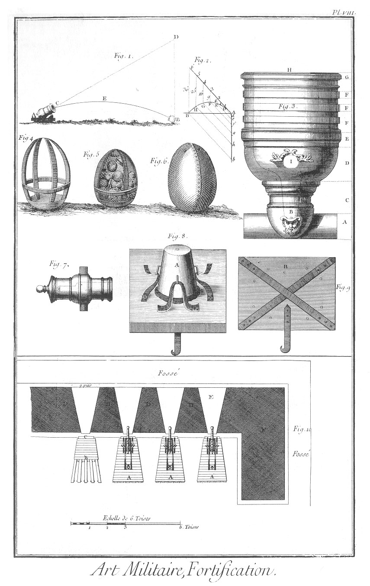](Planche_08.jpeg)

1. Elle fait voir la ligne que décrit la bombe B en sortant du mortier A.

2. On donne dans cette figure la maniere de décrire la ligne précédente.

3. Pierrier.
	- A, sont les tourillons.
	- B, le mufle avec la lumiere sur la culasse.
	- C, le renfort avec ses moulures.
	- D, le ventre.
	- E, platte-bande du renfort de volée, avec ses moulures.
	- F, F, les cercles ou renforts sur la volée.
	- G, le bourlet.
	- H, la bouche.
	- I, l'anse. L'ame de ce pierrier est l'espace renfermé par une ligne ponctuée depuis le bourlet jusqu'au bas du ventre ; & la chambre, l'espace également ponctué depuis le ventre jusqu'à la lumiere.

4. Carcasse vuide.

5. Carcasse chargée.

6. Carcasse recouverte de sa toile gaudronnée, & prête à être mise dans le mortier.

7. Obus ou haubitz.

8. Petard A attaché avec des liens de fer sur son madrier.

9. Vûe du côté du madrier opposé à celui où le petard est attaché.

10. Plan d'une batterie de canon.
	- A, A, plattes-formes.
	- B, platte-forme qui fait voir la disposition des gîtes ou des pieces de bois sur lesquelles sont clouées les planches de l'affût.
	- C, heurtoir.
	- E, embrasure.
	- D, D, merlons.
	- F, épaulement.

PLANCHE VIII. n. 2.
-------------------

[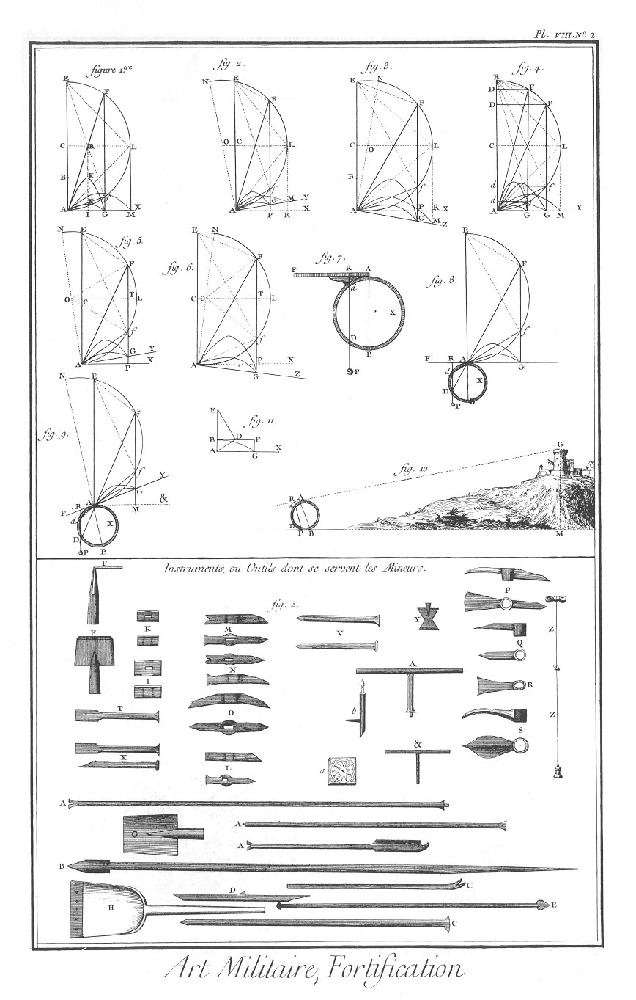](Planche_08-2.jpeg)

Les figures 1, 2, 3, 4, 5, 6, 7, 8, 9, 10 & 11. de la partie supérieure de cette Planche servent à expliquer la théorie du jet des bombes. La figure 7. représente l'instrument universel propre à jetter des bombes sur toutes sortes de plans. Dans la partie inférieure de cette même Planche sont représentés les outils de mineur.

- A, A, A, sonde à tarriere de plusieurs pieces, & vûe de plusieurs façons.
- B, sonde pour des terres.
- C, C, pinces dont l'une a un pié de chevre.
- D, petite pince à main.
- E, aiguille pour travailler dans le roc.
- F, brague vûe de deux côtés.
- G, bêche.
- H, pelle de bois ferrée.
- I, masse vûe de deux côtés.
- K, massette vûe de deux côtés.
- O, marteau à deux pointes vû de deux côtés.
- P, pic-hoyau vû de deux côtés.
- Q, pic-à-roc vû de deux côtés.
- R, hoyau.
- S, feuille de sauge vûe de deux côtés.
- T, ciseaux plats.
- V, poinçon à grain d'orge.
- X, ciseau plat vû de deux côtés.
- Y, louchet à faire les rigoles pour les augets.
- Z, plomb avec son fouet & son chat. &, équerre de mineur.
- a, boussole.
- b, chandelier de mineur.

PLANCHE IX.
-----------

[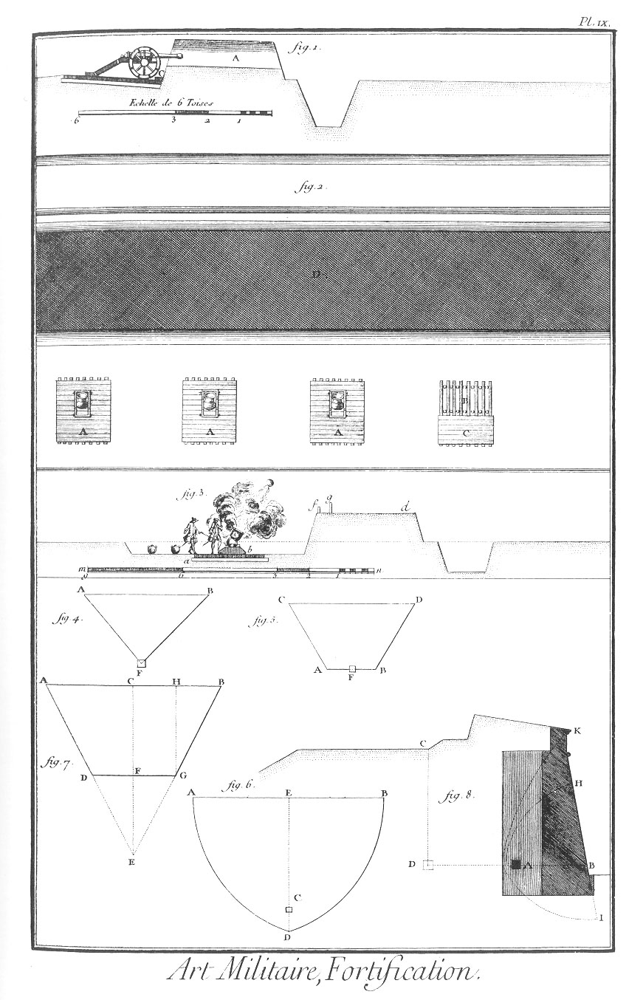](Planche_09.jpeg)

1. Profil d'une batterie, avec le canon dans l'embrasure A prêt à tirer.
	- C, heurtoir.

2.
	- D, parapet en épaulement d'une batterie de mortiers.
	- A, A, plattes-formes achevées, avec les mortiers dessus.
	- B, platte-forme qui fait voir la façon dont les gîtes doivent être disposés.
	- C, madriers qui couvrent les gîtes, & qui forment le plancher de la platte-forme.

3. Profil d'une batterie de mortiers.
	- a, platte-forme.
	- b, affût du mortier.
	- c, le mortier, avec la bombe qui en sort.
	- d, épaulement ou parapet.
	- f & g, bâtons qu'on met sur le haut de l'épaulement, sur lesquels on aligne le mortier pour chasser la bombe vers le lieu où elle doit tomber.
	- m n, échelle de neuf toises.

4. Figure de l'excavation ou de l'entonnoir d'une mine en cône.
	- A B, diametre de l'ouverture supérieure de la mine.
	- F, le fourneau.

5. Excavation d'une mine formant un cône tronqué.
	- A B, diametre de la petite base du cône tronqué.
	- C D, diametre de l'ouverture supérieure.
	- F, le fourneau ou la chambre de la mine.

6. Profil de l'excavation d'une mine formant un paraboloïde A D B.
	- C, fourneau de la mine.
	- C E, ligne de moindre résistance.

7. Cette figure sert pour le calcul des terres que la mine doit enlever, en supposant qu'elle forme un cône tronqué A D G B.

8. Profil qui fait voir la position du fourneau A d'une mine, pour faire sauter le revêtement B K.

PLANCHE X.
----------

[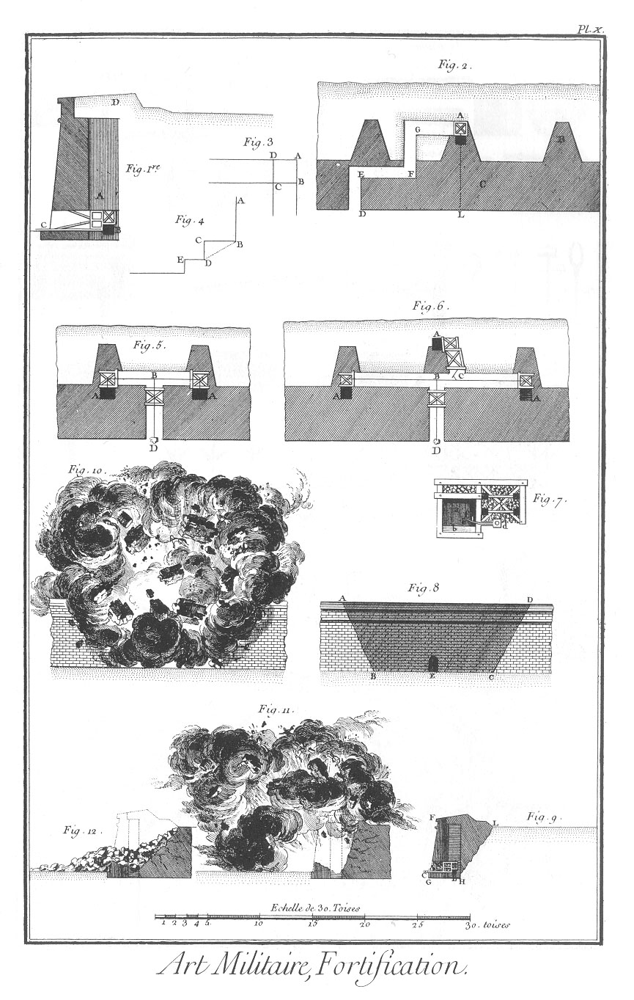](Planche_10.jpeg)

1. Cette figure sert à démontrer que si le fourneau de la mine étoit placé en B dans le contre-fort A, & que l'oeil ou l'ouverture de la mine fût vis-à-vis en C, en sorte que la distance B C fût plus courte que B D, l'effet s'en feroit vers C.

2. Elle fait voir les différens coudes D E, E F, F G, G A, qu'on fait aux galeries des mines, pour les boucher ou les remplir plus solidement que si elles ne formoient qu'une seule ligne droite.
	- B, contre-fort.
	- C, revêtement du rempart.
	- I, fourneau de la mine.

3. Elle sert à expliquer la maniere dont on bouche ou remplit les coudes des galeries des mines.

4. Elle sert à expliquer la maniere d'évaluer l'espace des galeries qu'il faut remplir pour empêcher la mine de souffler, ou ce qui est la même chose, de faire son effet dans la galerie.

5. Mine double.
	- A, A, fourneaux.
	- D, foyer de la mine.
	- D B A, saucisson.

6. Mine triplée ou tréflée.
	- A A A, fourneaux.
	- D, foyer de la mine. La ligne qui va de D en B, & de-là aux fourneaux A, A, A, est le saucisson.

7. Profil de la chambre des mines.
	- a, chambre de la mine.
	- b, lit de paille & de sacs-à-terre, sur lesquels on verse la poudre.
	- c, arcs-boutans.
	- d, auget.
	- e, saucisson.
	- f, cheville qui perce & arrête le saucisson.

8. Elévation d'un revêtement, où A B C D marquent ce que la mine doit détruire.
	- E, oeil ou entrée de la mine.

9. Profil d'une galerie, dans lequel F G H L marquent la partie du rempart que la mine doit enlever ou détruire.
	- A, galerie.
	- B, fourneau.
	- C, auget qui renferme le saucisson.
	- D, arcs-boutans.

10. Vûe de front d'une mine qui joue.

11. Vûe de côté d'une mine qui joue.

12. Profil qui fait voir l'effet d'une mine qui a joué.

PLANCHE XI.
-----------

[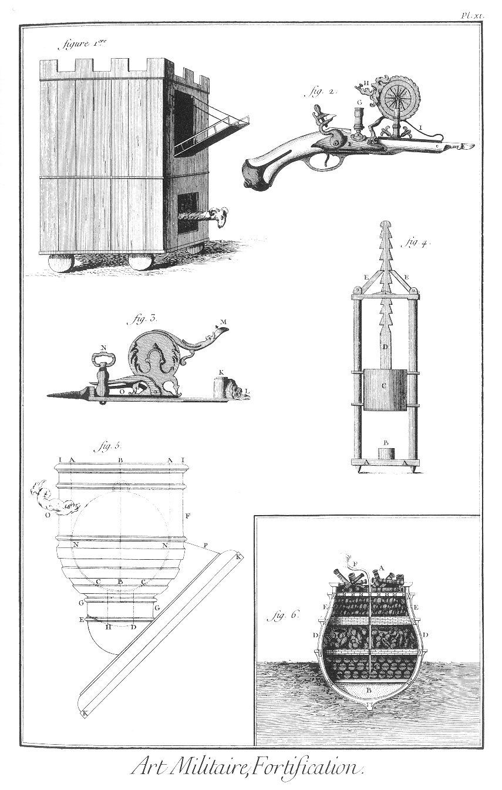](Planche_11.jpeg)

1. Tour avec son bélier & son pont.

2. Eprouvette pour l'épreuve de la poudre.
	- F, batterie pareille à celle d'un pistolet, qui met le feu à la lumiere du petit canon G.
	- G, petit canon ou boîte, où se met la charge de la poudre, ayant sa lumiere au pié & son bassinet.
	- H, roue avec le couvercle du petit canon, que la poudre fait élever par sa violence, la roue étant retenue par le ressort I, qui est au derriere.
	- I, ressort qui s'engage dans les crans de la roue, & qui le tient au degré où la poudre l'a poussé; ce que l'on connoît par les chiffres gravés autour de la roue. 

3. Autre éprouvette.
	- K, canon ou boîte, avec sa lumiere L.
	- M, couvercle de la boîte, qui est élevé par la poudre, & qui s'arrête dans la roue, au moyen des crans qui y sont renfermés, & qui ne se voyent point par le profil.
	- N, clé ou vis, laquelle pressant le ressort, le lâche & le serre comme on veut.
	- O, ressort. Cette éprouvette, qui a une vis à son extrémité, s'enfonce dans un arbre comme un tire-fond.

4. Elle représente encore une éprouvette d'une autre espece que la précédente.
	- A A; plaque de cuivre jaune, sur laquelle est creusé le bassinet où se met l'amorce, & qui répond à la lumiere.
	- B, canon ou boîte, où se met la charge de poudre.
	- C, poids massif, qui s'éleve plus ou moins haut, suivant la force de la poudre, & qui est retenu par les crans de la cremaillere D.
	- E, E, tenons qui s'ouvrent, lorsque le poids s'éleve, & qui l'empêchent de descendre, quand il est élevé.

5. Elle représente le mortier dont on se sert depuis long-tems, pour l'épreuve des poudres qu'on re- çoit dans les magasins des places.

6. Cette figure est la coupe ou le profil de la machine infernale échouée devant Saint-Malo.
	- A, coupe de cette machine suivant sa largeur.
	- B, fond de calle, rempli de sable.
	- C, premier pont rempli de vingt milliers de poudre, avec un pié de maçonnerie au-dessus.
	- D, second pont garni de six cens bombes & carcasses, & de deux piés de maçonnerie au-dessus.
	- E, troisieme pont au-dessus du gaillard, garni de cinquante barils à cercles de fer, remplis de toutes sortes d'artifices.
	- F, canal pour conduire le feu aux poudres & aux amorces. Le tillac étoit garni de vieux canons & autres vieilles pieces d'artillerie.

PLANCHE XII.
------------

[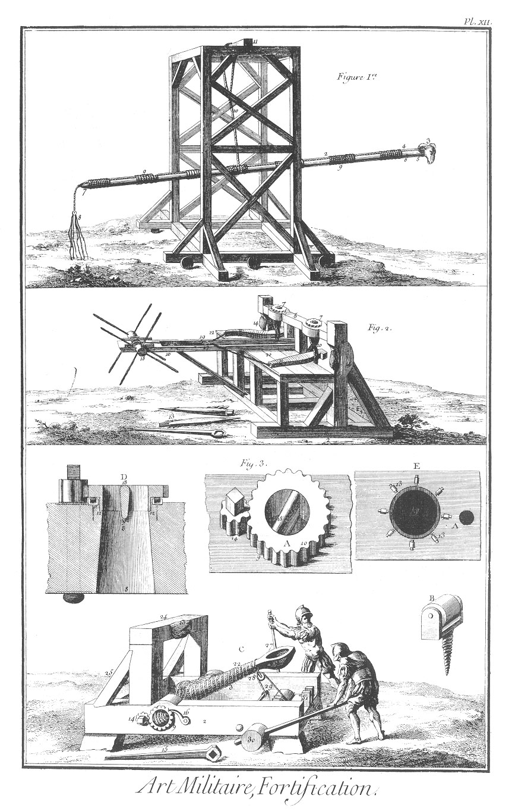](Planche_12.jpeg)

1. Bélier suspendu.
	- 2, poutre béliere.
	- 3, tête du bélier.
	- 4, bandes de fer à l'extrémité du bélier.
	- 5, chaîne de fer dont un des bouts est attaché au crochet 6.
	- 9, 9, liûres de plusieurs tours de cordes à la distance d'environ deux piés les uns des autres, pour fortifier le bélier.
	- 7, extremité de la poutre béliere, où est attaché un cable qui finit par plusieurs branches, à chacune desquelles il y avoit plusieurs hommes pour mettre la machine en mouvement.
	- 10, chaîne ou gros cable qui tenoit le bélier suspendu à la poutre 11.
	- 12, chassis servant de base à l'espece de cage ou de tortue dans laquelle est renfermé le bélier.

2. Baliste de siege, suivant M. le chevalier Folard.
	- 2, base de la baliste.
	- 3 & 4, montans.
	- 5 & 6, traversans.
	- 7, 7, les deux chapiteaux du traversant 5.
	- 8, les chapiteaux de celui d'en-bas, 6.
	- 9, poteaux équarris qui soutiennent & fortifient les deux traversans.
	- 10, 10, sont les deux écheveaux de cordes de droite & de gauche.
	- 11, 11, les deux bras engagés dans le centre des écheveaux.
	- 12, corde attachée aux deux Bras.
	- 13, traits qui sont lancés par la baliste.
	- 14, 14, partie courbe des montans.
	- 15, coussinets pratiqués dans la courbure des montans.
	- 16, arbrier sur lequel est pratiqué un canal parfaitement droit, où l'on place les traits que la baliste doit chasser.
	- 17, noix de la détente.
	- 18, treuil autour duquel se devide la corde.
	- 19, main de fer qui sert à accrocher la corde à son centre, lorsqu'on veut bander la baliste.
	- 20, espece de table ou d'échafaudage sur lequel l'arbrier est en partie soutenu.

3. 
	- C, catapulte de batterie, suivant M. le chevalier Folard.
	- A, B, D & E, sont des parties de la catapulte représentées en grand. Voyez Catapulte.

PLANCHE XIII.
-------------

[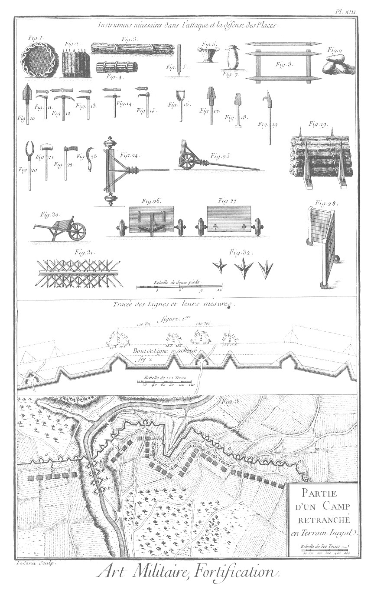](Planche_13.jpeg)

La partie supérieure représente les différens outils ou instrumens dont on se sert dans l'attaque des places.

1. Plan d'un gabion.
2. Elévation d'un gabion.
3. Fascine.
4. Fagot de sappe.
5. Piquet.
6. Panier.
7. Sac-à-terre.
8. Blinde.
9. Sacs-à-terre disposés pour former un creneau.
10. Escoupe.
11. Pioche.
12. Pic à hoyau.
13. Pic à roc.
14. Pic à tête.
15. Feuille de sauge.
16. Pelle ferrée.
17. Bêche.
18. Louchet de Flandres.
19. Croc de sappe.
20. Fourche de sappe.
21. Masse.
22. Hache commune.
23. Serpe.
24. Plan d'un mantelet roulant.
25. Profil du même mantelet.
26. Mantelet vû du côté intérieur.
27. Mantelet vû du côté de l'ennemi.
28. Ancien mantelet.
29. Chandelier.
30. Brouette.
31. Cheval de frise.
32. Chaussetrappes.

Seconde partie, ou partie inférieure de la Planche XIII. concernant le tracer des lignes & leurs mesures.

1. Cette figure sert à expliquer la construction des lignes, & elle fait voir les mesures de leurs différentes parties.
2. Partie de ligne achevée.
3. Partie d'un camp retranché en terrein inégal ou irrégulier.
	- a, a, ligne.
	- b, b, ponts de communication des quartiers couverts de part & d'autre par de petits retranchemens en forme de petites demi-lunes, redoutes ou lunettes.

PLANCHE XIV.
------------

[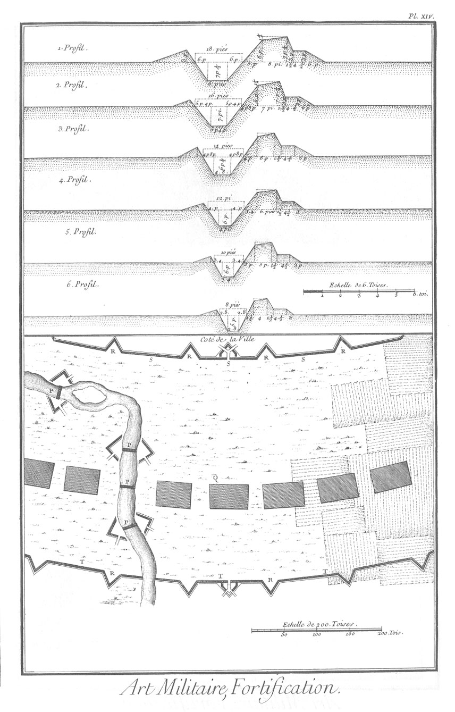](Planche_14.jpeg)

La premiere partie, ou la partie supérieure de la Planche, représente six profils de lignes proposés par M. le marechal de Vauban.

La seconde partie de la même Planche fait voir une partie du camp de l'armée qui fait un siege, renfermée entre les lignes de circonvallation & de contrevallation.

- S, S, ligne de contrevallation, laquelle est opposée à la ville.
- T, T, ligne de circonvallation opposée à l'ennemi extérieur ou à la campagne.
- R, R, redans des deux lignes.
- P, P, ponts pour la communication des quartiers, couverts des deux côtés par des especes de petites lunettes ou redoutes.
- Q, quartiers.

PLANCHE XV.
-----------

[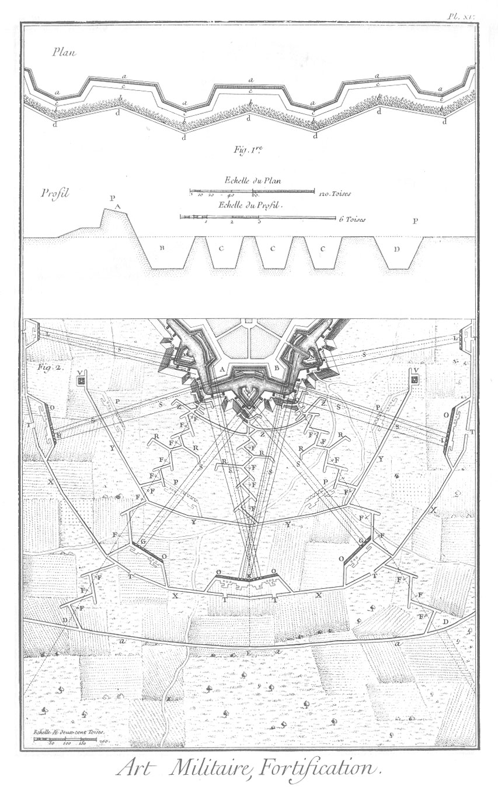](Planche_15.jpeg)

1. 
	- a, a, plan d'une partie de la ligne de circonvallation de Philisbourg en 1734.
	- c, c, fossé de la ligne.
	- b, b, puits pratiqués au-delà du fossé.
	- d, d, avant-fossé.
	- P P, profil de la même ligne.
	- A, parapet de la ligne.
	- B, fossé.
	- C, C, C, points au-delà du fossé.
	- D, avant-fossé.

2. Cette figure représente les attaques d'une place réguliere située en terrein uni ou régulier.
	- A, B, bastion du front de l'attaque.
	- C, demi-lune du même front.
	- D, D, prolongemens des capitales de A & B.
	- E, prolongemens de la capitale de la demi-lune.
	- F, F, piquets bouchonnés de paille ou de mêche allumée, pour marquer le prolongement des capitales qui doivent servir à la conduite de la tranchée.
	- G, G, batteries à ricochet des deux faces & du chemin couvert de la demi-lune C.
	- H, batterie à ricochet de la face gauche & du chemin couvert du bastion A.
	- I, batterie à ricochet de la face droite & du chemin couvert du bastion B.
	- K, batterie à ricochet des deux autres faces & du chemin couvert des bastions A & B.
	- L, L, batteries à ricochet des faces & du chemin couvert des deux demi-lunes collatérales M & N.
	- O, O, batteries à bombes.
	- P, P, places sur la seconde ligne, où l'on pourroit mettre les batteries, s'il les falloit changer.
	- Q, Q, cavaliers de tranchée qui enfilent le chemin couvert.
	- R, R, demi-places d'armes.
	- S, S, piquets sur le prolongement des pieces attaquées, pour l'établissement des pieces à ricochet.
	- T, T, passages que l'on fait en comblant la place d'armes avec des fascines, pour mener le canon aux batteries.
	- V, V, redoutes qui terminent la seconde parallele Y, Y.
	- X, X, premiere parallele ou place d'armes.
	- Z, Z, troisieme parallele ou place d'armes. a, a, chemin pour la communication des attaques.

PLANCHE XVI.
------------

[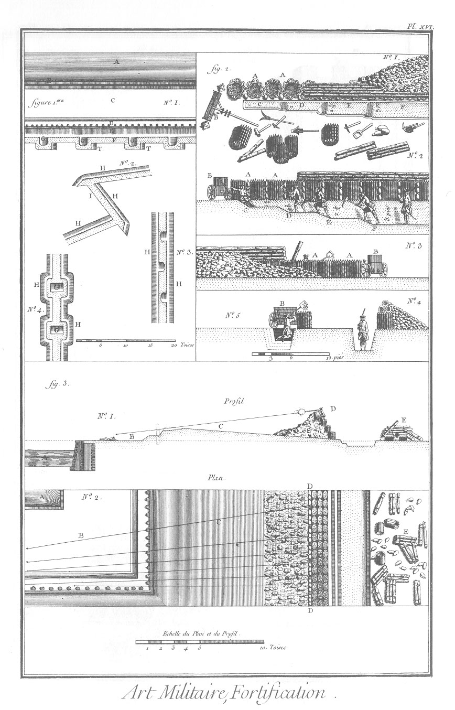](Planche_16.jpeg)

1. 
	- n. 1.
		- A, fossé.
		- B, contrescarpe.
		- C, chemin couvert.
		- D, banquette, avec le plan des palissades plantées dessus.
		- E, parapet du logement du glacis.
		- F, tranchée tournante ou logement du glacis.
		- G, G, traverses dans l'intérieur du logement.
		- T, T, traverses extérieures.

	- n. 2. Tranchée à crochet.
		- H, parapet.
		- I, revers de la tranchée.

	- n. 3. Tranchée double, avec les traverses qui servent à la défiler.
		- H, H, parapet.

	- n. 4. Tranchée directe.
		- H, H, parapet.
		- G, G, traverses.

2. 
	- n. 1. Plan d'une tête de sappe.
		- A, A, gabions.
		- B, mantelet.
		- C, travail du premier sappeur.
		- D, travail du second sappeur.
		- E, travail du troisieme sappeur.
		- F, travail du quatrieme sappeur.

	- n. 2. Vûe du côté intérieur de la sappe.
		- A, A, gabions.
		- B, mantelet.
		- C, premier sappeur.
		- D, second sappeur.
		- E, troisieme sappeur.
		- F, quatrieme sappeur.

	- n. 3. Vûe du côté extérieur de la sappe.
		- A, A, gabions.
		- B, mantelet.

	- n. 4. Profil d'une sappe achevée.

	- n. 5. Profil représentant l'excavation des quatre sappeurs.

3.
	- n. 1. Prosil d'un cavalier de tranchée.
		- A, fossé de la place.
		- B, chemin couvert ennemi.
		- C, glacis.
		- D, cavalier de tranchée, avec le soldat placé sur la troisieme banquette, qui tire en plongeant dans le chemin couvert.
		- E, amas de matériaux.

	- n. 2. Plan du même cavalier de tranchée.
		- A, fossé de la place.
		- B, place d'armes saillante du chemin couvert.
		- C, glacis.
		- D, D, troisieme banquette de gabions, sur laquelle se placent les soldats qui doivent tirer dans le chemin couvert opposé.
		- E, amas de matériaux.

PLANCHE XVII.
-------------

[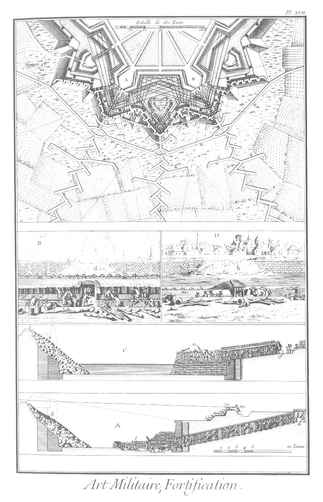](Planche_17.jpeg)

1. Cette figure sert à faire voir la disposition des batteries & du logement du chemin couvert.
	- B, B bastions du front de l'attaque.
	- C, demi-lune du même front.
	- a, a, demi-places d'armes.
	- b, b, cavaliers de tranchée.
	- c, c, batteries de pierriers.
	- d, d, batteries en breche de la demi-lune C.
	- e, e, batteries contre les faces des bastions A & B qui défendent la demi-lune. f, f, passages du fossé de la demi-lune.
	- g, g, logemens dans la même.
	- h, h, batteries en breche des bastions A & B.
	- i, i, batteries contre les défenses de ces bastions.
	- k, k, batteries contre la courtine & les faces des bastions.
	- l, l, passages du fossé des bastions.
	- m, m, logemens sur les mêmes.
	- n, n, troisieme parallele ou place d'armes.

Les autres figures du bas de la Planche font voir la maniere dont on procede au passage du fossé des places, soit que ce fossé soit sec ou plein d'eau.

- Fig. A. Profil d'une descente de fossé par une espece de galerie a b pratiquée sous le chemin couvert, & qui aboutit à la contrescarpe en b, au niveau du fond du fossé, où étant parvenu, l'on gagne le pié de la breche d par la sappe l.
	- m, le logement du chemin couvert.

- Fig. B. Ouverture de la descente vûe du côté de la campagne.
	- a, entrée de la galerie.
	- m, logement du chemin couvert.
	- d, la breche.

- Fig. C. Profil d'une descente de fossé à oeil ouvert, qui se fait ainsi lorsque le fossé est plein d'eau.
	- f g, galerie qui aboutit au niveau de l'eau du fossé, & qui est couverte de blindes & de fascines.
	- n, l'épaulement & le pont qu'on fait dans le fossé, pour gagner le pié de la breche h.

- Fig. D. Vûe de cette même descente du côté de la campagne.
	- f, l'ouverture ou le commencement de la galerie.
	- m, logement du chemin couvert.
	- h, la breche.

[->](../../16-Artificier/Légende.md)
