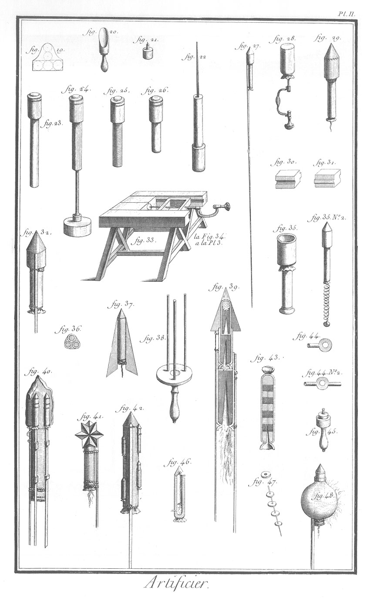
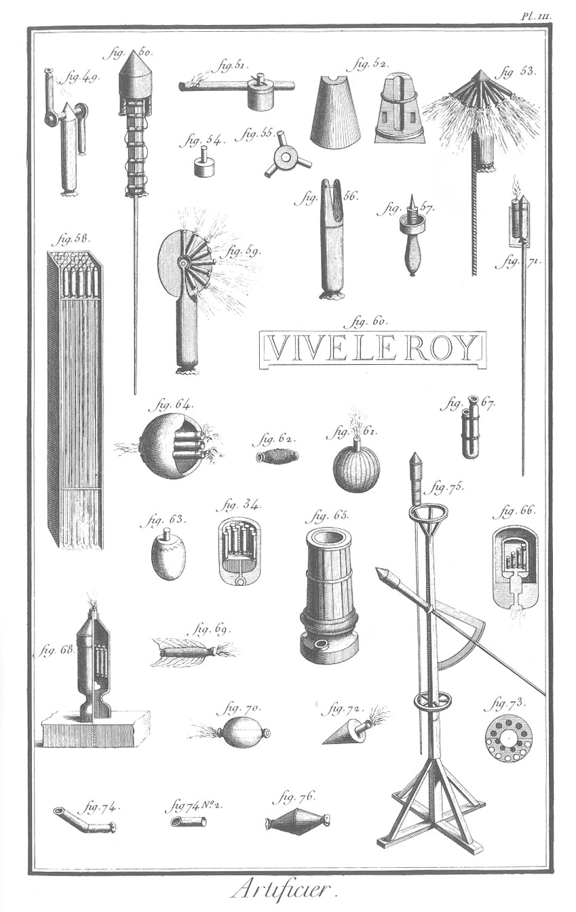
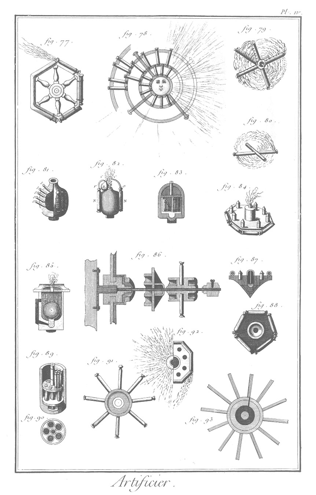
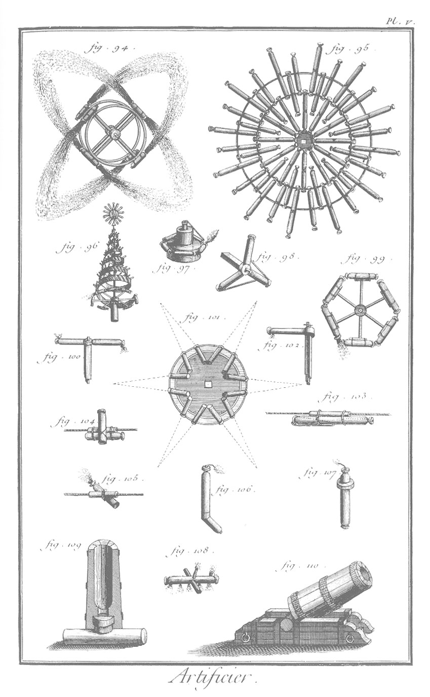
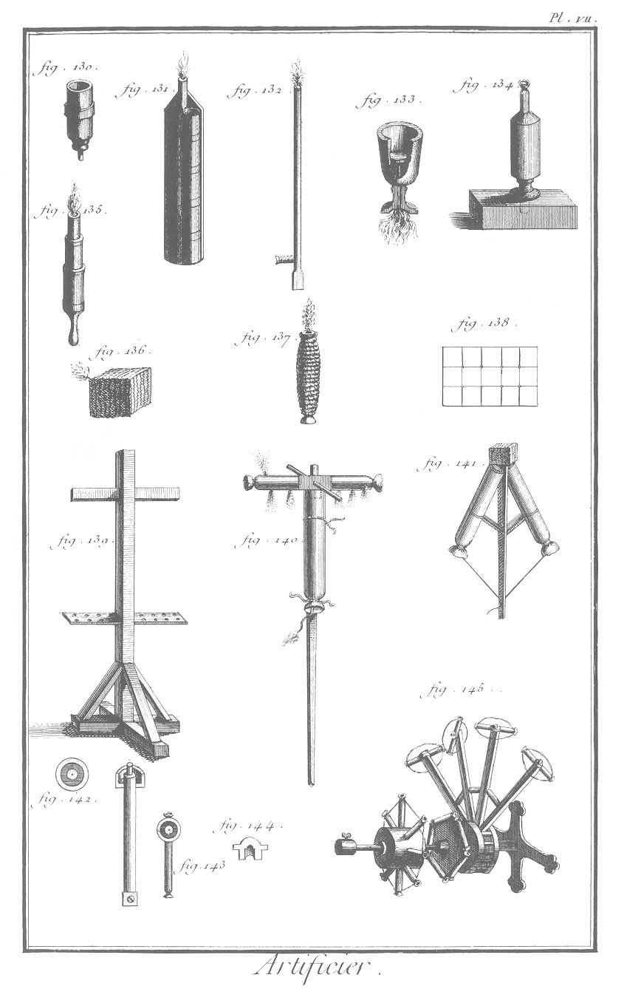

ARTIFICIER
==========

Contenant sept Planches.

PLANCHE I.ere
-------------

La vignette représente l'attelier ou le magasin d'un artificier. 

1. Etranglement des grosses fusées.

2. Maniere de charger les cartouches déjà étranglées.
	- a, le maillet.
	- b, la baguette à charger.
	- c, le cartouche.
	- d, sebille où se met la poudre apprêtée.
	- g, cuilliere pour mettre la poudre dans le cartouche.
	- e, mortier dans lequel se pilent le salpetre, le charbon & autres matieres qui entrent dans la composition de la poudre.
	- f, gloire ou soleil d'artifice.
	- h, fusées volantes montées sur leurs baguettes.
	- i, plusieurs fusées liées ensemble.
	- l, fusées chargées & étranglées par les deux bouts prêtes à monter.

3. Ouvrier qui colle le cartouche.

4. Ouvrier qui pile le charbon, le salpetre & autres matieres.

Bas de la Planche.

1. Baguette ou rouleau à mouler les cartouches.
2. Baguette à charger les cartouches.
3. Baguette à mouler les pots des fusées volantes.
4. &
5. &
6. Maniere de coller & de mouler les différens cartouches.
7. Modele de chapiteau d'une fusée volante.
8. Molette pour broyer les poudres.
9. Morceau de bois qui sert à boucher exactement le trou a de la table, fig. 10.
10. Table à broyer. Le trou a sert à faire tomber la poudre dans le tamis.
11. Pot d'une fusée volante, & maniere de découper le chapiteau.
12. Chevalet pour étrangler les fusées avec le pié.
13. Sebille à mettre la poudre apprêtée.
14. Moule à charger les petites fusées, comme lardon, &c.
15. Lardon.
16. Moule de fusée volante, avec la baguette à charger.
17. Bout d'aîle pour ramasser le poussier, &c.
18. Tamis à passer la poudre ; il y en a de différentes grandeurs.

PLANCHE II. 
-----------

Les Figures sont de Frezier.

19. Modele de la cuilliere à mettre la poudre dans le cartouche.
20. La cuilliere.
21. Culot & sa broche pour les fusées de la fig. 14.
22. Baguette pour retirer les fusées volantes du moule, lorsqu'elles y tiennent trop.
23. &
24. &
25. &
26. Baguettes à charger les fusées & leurs broches.
27. Fusée volante sur sa baguette.
28. Fusée chargée où se fait le trou de la broche avec un vilebrequin.
29. Fusée montée sans baguette.
30. &
31. Voyez la fig. 33.
32. Trois fusées accouplées ensemble.
33. Machines pour percer les fusées au vilebrequin.
34. Ballon. Voyez à la Planche III. près de la fig. 63.
35. Fusée montée sur son pot.
	- n. 2. Fusée volante sans baguette, mais avec un ressort de fils-de-fer auquel pend un poids.
36. Plan des trois fusées de la figure 32.
37. Fusée avec des aîlerons au lieu de baguettes.
38. Machine pour tirer les fusées à aîlerons.
39. Développement d'une fusée à second vol.
40. Fusée qui en contient de plus petites à second vol.
41. Fusée garnie d'une étoile.
42. Fusée garnie de saucissons.
43. Développement d'une fusée chargée & sur la broche.
44. 
	- n. 1. &
	- n. 2. Tourniquet à un & à deux tenons, pour une ou deux fusées brillantes ou chinoises.
45. Moule à faire des étoiles.
46. Fusée volante en contenant d'autres qui se multiplient en l'air.
47. Etoile en fil d'étoupille pour les pots de fusées & d'autres.
48. Fusée volante en globe.

PLANCHE III.
------------

49. Fusée montée de deux tourniquets.
50. Fusée montée en bruit de guerre.
51. &
52. Voyez la fig. 55.
53. Fusée en parapluie 56.
54. &
55. Différens piés mouvans.
59. Fusée qui porte un soleil fixe.
57. Poinçon qui s'allonge & se raccourcit.
58. Boîtes remplies de fusées prêtes à tirer.
60. Lettres ou mots d'artifice.
61. Bombe.
62. Saucisson ficelé.
63. Ballon, ainsi que 34. qui est de la Planche II. mais que l'on a mis ici pour rapprocher les ballons.
64. Développement d'un ballon.
65. Mortier pour tirer des bombes.
66. Développement d'un ballon qui en contient un autre.
67. Communication de deux jets d'artifice.
68. Développement d'un pot-à-feu.
69. Fusée d'eau à aîlerons.
70. Fusée d'eau en globe.
71. Fusée volante qui porte une gerbe.
72. Fusée d'eau en cône.
73. Intérieur d'un ballon.
74. Genouillere.
	- n. 2. Nageoire de genouillere.
75. Chevalet pour tirer & diriger les fusées.
76. Fusée d'eau en nageoire.

PLANCHE IV.
-----------

77. Soleil tournant.
78. Soleil fixe ou gloire.
79. Soleil sans centre,
80. Fusées de table.
81. Pot-à-feu d'eau.
82. Eolipile d'artifice qui rend un son de gazouillement dans l'eau.
83. Développement d'un pot-à-feu d'eau.
84. Girandoles d'eau.
85. Développement d'un mortier d'eau.
86. &
87. &
88. Machines de communication à plusieurs changemens.
89. &
90. Coupe & profil d'un mortier d'eau à jetter cinq ballons à la fois.
91. Soleil fixe.
92. Soleil tournant, qui se change en soleil fixe, posé horisontalement.
93. Soleil fixe.

PLANCHE V.
----------

94. Etoile mouvant
95. Grande gloire.
96. Spirale de lances.
97. Soleil d'eau.
98. Voyez la fig. 102.
99. Soleil tournant.
100. Voyez la fig. 102.
101. Etoile fixe.
102. Différens soleils saxons.
103. &
104. &
105. Différentes fusées de corde.
106. Genouillere.
107. Fusée d'eau avec une rotule de bois pour la faire surnager.
108. Fusée de table.
109. Développement d'un mortier.
110. Mortier sur son affût.

PLANCHE VI.
-----------

111. &
112. &
113. &
114. &
115. &
116. &
117. &
118. Machines à plusieurs changemens, toutes garnies, & devant tirer séparément.
119. Jeu de trois soleils tournans l'un après l'autre.
120. Plateau d'eau.
121. Cylindre de la fig. 118. vû de face.
122. Pot-à-feu ordinaire.
123. Gerbe de brillans.
124. Piece d'artifice à trois changemens.
125. Cheville de fer, qui enfile le cylindre de la fig. 124.
126. Spirale de jets d'artifice.
127. Pot à aigrette.
128. Brins de pots-à feu.
129. Brins de saucissons.

PLANCHE VII.
------------

130. Foureau pour ajuster le dedans des trompes.
131. Développement d'une trompe d'artifice.
132. Lance à saucissons, avec le pié de bois pour les attacher.
133. Vase d'artifice.
134. Pot à aigrette.
135. Trompe d'artifice.
136. Marons.
137. Saucisson.
138. Développement d'un maron.
139. Chevalet.
140. Fusée portant une fusée de table.
141. Fusée en chaîne, ou caducée.
142. &
143. &
144. Pieces pour ajuster des fusées en tourniquet.
145. Vûe d'une grande piece à communication & à plusieurs changemens.

[Fin du tome 18.](#)
