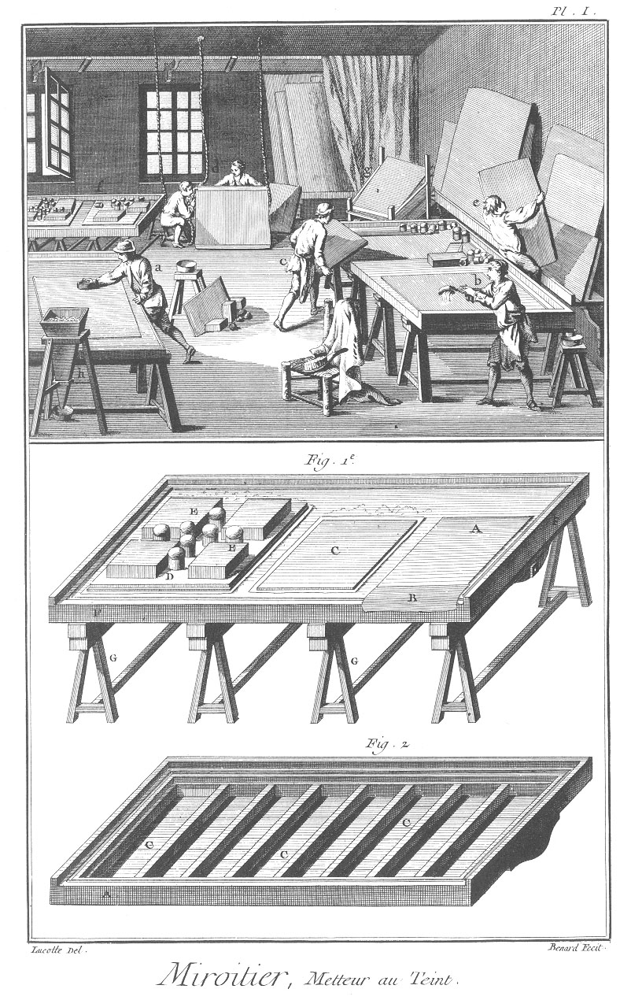

MIROITIER METTEUR AU TEINT
==========================

Contenant deux Planches.

PLANCHE Iere.
-------------

LE haut de cette Planche présente un attelier où plusieurs ouvriers sont occupés à mettre des glaces au teint. Un en a à dégraisser le teint ; un en b à verser le vif-argent sur la feuille d'étain ; un en c à poser la glace sur la même feuille d'étain ; d'autres en d à poser les glaces sur l'égouttoir ; un autre en e à ranger des glaces mises & à mettre au teint au fond de l'attelier. En f est une table où sont plusieurs glaces chargées que l'on vient de mettre au teint. A l'opposite en g est un égouttoir où sont posées les glaces. Sur le devant en h est une trémie à séparer le vif-argent des ordures.

1. représente une des tables servant à mettre les glaces au teint.
	- A, étain couvert de vif-argent.
	- B, feuille de papier.
	- C, glace mise au teint.
	- D, glace chargée.
	- E E, &c. pierres & boulets servant à charger.
	- F F, le chassis de la table.
	- G G, les piés.

2. Vue de l'intérieur de la table.
	- A A, le chassis.
	- B B, &c. les traverses.
	- C C, le fond.

PLANCHE II.
-----------

1. Table de pierre.

2. Boulon servant à mettre la table en équilibre.
	- A, la tête.
	- B, la tige.
	- C, la vis.
	- D, l'écrou.

3. Tréteau de la table.
	- A A, les piés.
	- B, la traverse.

4. Tasseau.
	- A, le trou du boulon.
	- B B, les pattes.

5. Boulet de fonte.

6. Pillot.
	- A A, les frettes.

7. Pierre à charger.

8. Brosse.
	- A, la brosse.
	- B, le manche.

9. Sébille à queue.
	- A, la sébille.
	- B, la queue.

10. Sébille à vif-argent.

11. Support de la sébille à vif-argent.

12. Egouttoir simple.
	- A, l'égouttoir.
	- B B, les cordages.

13. Egouttoir composé.
	- A A, les égouttoirs.
	- B B, &c. les montans du chassis.
	- C C, &c. les traverses du chassis.
	- D D, &c. les boulons servant de supports.

14. Dégraissoir.

15. Trémie à séparer le vif-argent des ordures.
	- A, la trémie.
	- B B, le support.
	- C, la sébille.

[->](../2-Miroitier/Légende.md)
