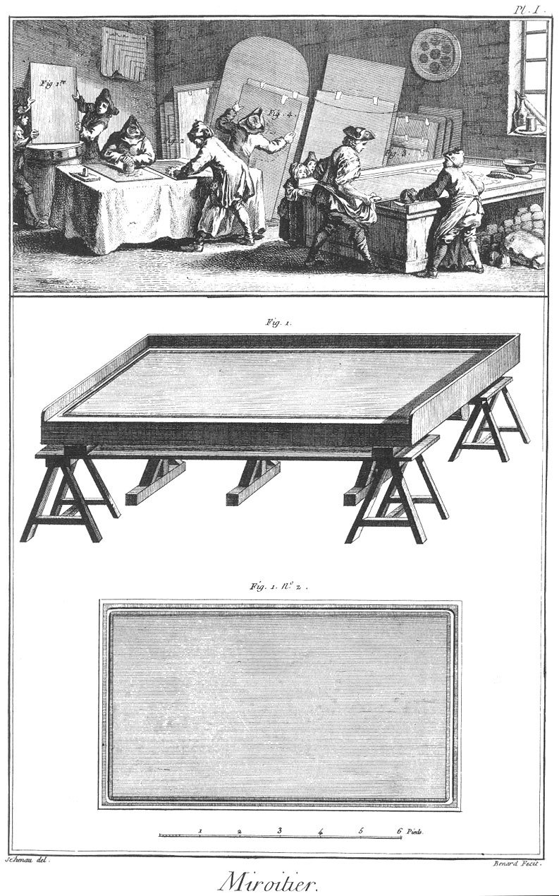
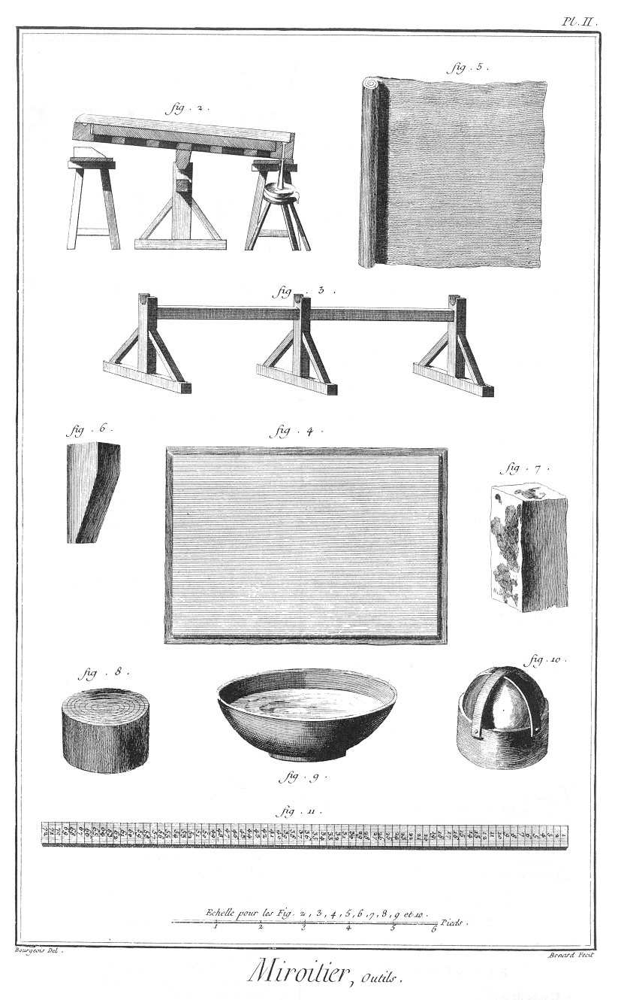
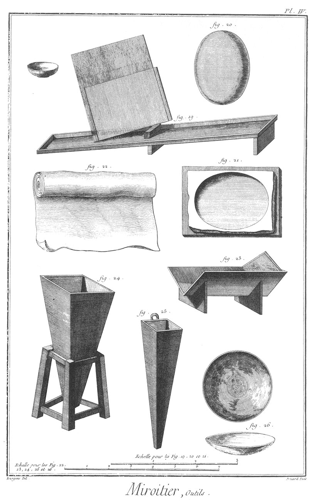
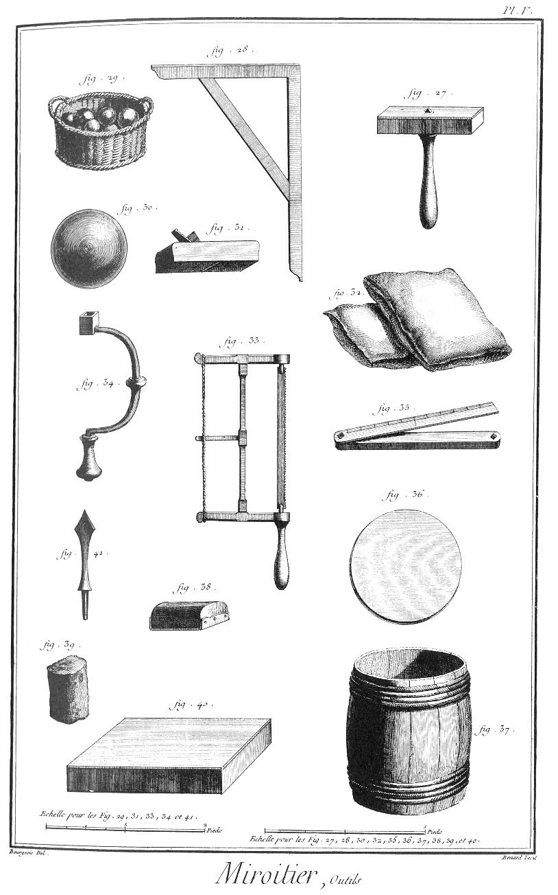
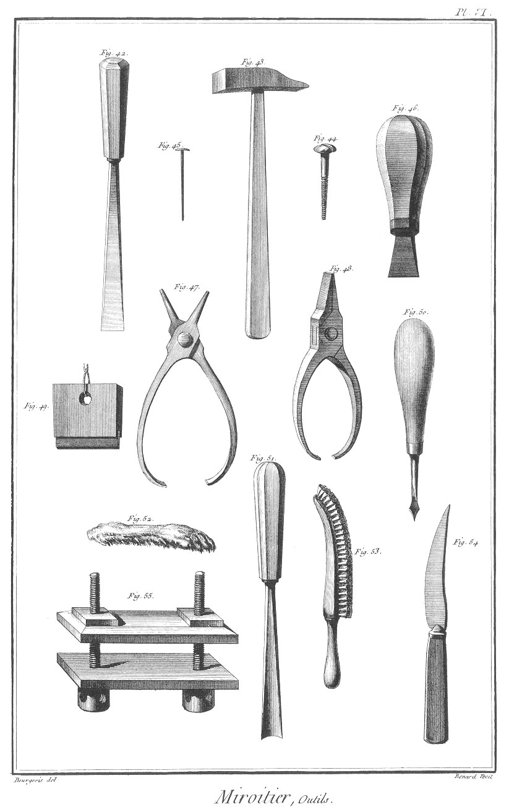

MIROITIER
=========

Contenant six Planches.

Vignette.
---------

Fig.
1. Ouvriers qui écarissent une glace sur une pierre.

2. Ouvriers qui nettoient une feuille d'étain.

3. Miroitiers qui mettent une glace au teint.

4. Glace que l'on pose contre le mur pour la laisser égoutter.

5. Pierres & boulets pour charger les glaces. PLANCHE Iere. Des Metteurs au teint.

Fig. 1. n°. 1 & 2.
Grande table ou pierre de liais.

PLANCHE II.
-----------

2. Coupe de la table.

3. Piés qui portent toute la table.

4. Glace avec feuille d'étain.

5. Feuille d'étain.

6. Billot à soutenir la table, lorsqu'elle est penchée.

7. Pierre à charger les glaces.

8. Lambeau de chapeau pour décrasser la feuille d'étain.

9. Sébille de bois pour mettre le vif-argent

10. Boulet à charger les glaces.

11. Grandeur des glaces.

PLANCHE III.
------------

12. Table pour dégraisser les glaces avec un tapis de flanelle.

13. Coupes de la table, n°. 12.

14. Chiffon.

15. Sac rempli de cendres, qui sert à nettoyer les glaces.

16. Planche à porter les glaces en ville.

17. Claie pour couvrir les glaces.

18. Papier servant à étamer.

PLANCHE IV.
-----------

19. Couloir servant à égoutter les glaces.

20. Glace convexe.

21. Moule de plâtre pour étamer les glaces bombées.

22. Morceau de flanelle servant à couvrir les glaces pour les charger.

23. Couloir pour les petites glaces.

24. Egouttoir pour le vif-argent.

25. Autre égouttoir à pendre au mur.

26. Platine de fonte servant à bomber les glaces.

PLANCHE V.
----------

27. Diamant.

28. Equerre.

29. Pannier à mettre les boulets.

30. Boulet.

31. Rabot.

32. Coussin à poser les glaces.

33. Scie.

34. Vilebrequin.

35. Regle ployante.

36. Rondeau servant à aiguiser les glaces par les bords.

37. Tonneau servant à porter le rondeau.

38. Morceau de bois couvert de bufle.

39. Emeri pour polir les glaces.

40. Morceau de glace à brouiller l'émeri.

PLANCHE VI.
-----------

42. Gouge ou fermoir.

43. Marteau.

44. Vis.

45. Pointe.

46. Tourne-vis.

47. Pinces.

48. Autres pinces nécessaires.

49. Grattoir pour ôter le vif-argent de dessus les vieilles glaces.

50. Poinçon.

51. Gouge ronde.

52. Patte-de-lievre.

53. Brosse pour nettoyer l'étain.

54. Couteau.

55. Presse.

[->](../../07-Monnoyage/Légende.md)
