MONNOYAGE
=========

Contenant dix-neuf Planches.

PLANCHE Iere.
-------------

[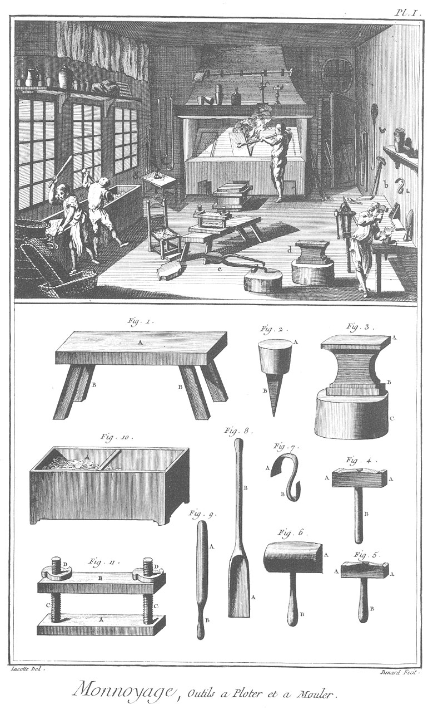](Planche_01.jpeg)

Le haut de cette Planche représente un attelier où plusieurs ouvriers sont employés à différentes choses. Les uns en a, à mouler ; un autre en b, à plotter ; un autre en c, à faire fondre l'or dans le fourneau. Cet attelier est garni d'enclumes d, de cisoirs e, d'établis à plotter f, de table g à ajuster les flaons, & de toutes choses nécessaires à la fonte de l'or.

Fig.
1. Etabli à plotter.
	- A, la table.
	- B B, les piés.

2. Tasseau à plotter.
	- A, la tête.
	- B, la pointe.

3. Enclume.
	- A, la tête.
	- B, l'empattement.
	- C, le billot.

4. Grosse masse ou marteau à plotter.
	- A A, les têtes acérées.
	- B, le manche.

5. Petite masse ou marteau à plotter.
	- A A, les têtes acérées.
	- B, le manche.

6. Batte.
	- A, la batte.
	- B, le manche.

7. Racloir.
	- A, le racloir.
	- B, le manche.

8. Pelle à remuer le sable.
	- A, la pelle.
	- B, le manche.

9. Petite batte.
	- A, la batte.
	- B, le manche.

10. Caisse au sable.
	- A, le sable.

11. Presse.
	- A, le plateau d'enhaut.
	- B, le plateau mobile.
	- C C, les vis.
	- D D, les écroux.

PLANCHE II.
-----------

Fig.
1. Planche à moule.

2. Contre-planche à moule.

3. Chassis du moule.

4. Contre-chassis du moule.

5. &
6. Modeles de lames.

7. Plusieurs moules montés & serrés avec coins dans de forts chassis.
	- A A, les moules.
	- B B, les chassis.
	- C C, &c. les coins.

8. Fort chassis servant de presse.

9. &
10. Serres ou coins de bois.

11. L'élévation.

12. Le plan.

13. La coupe du fourneau à fondre l'or.
	- A, le manteau de la cheminée.
	- B, le jambage.
	- C, le dessus du fourneau.
	- D D, &c. les couvertures du fourneau.
	- E E, la cheminée du fourneau.
	- F, le fourneau.
	- G, le dessous du fourneau.
	- H, la porte du fourneau.

14. &
15. &
16. Tisonniers crochus & pointus.
	- A A A, les tisonniers.
	- B B B, les manches.

PLANCHE III.
------------

[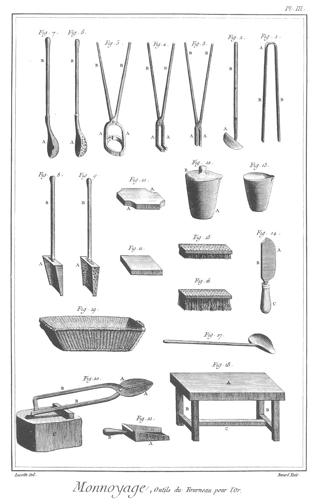](Planche_03.jpeg)

Fig.
1. Pincettes.
	- A, la tête.
	- B B, les branches.

2. Racloir.
	- A, le racloir.
	- B, le manche.

3. Tenailles droites.
	- A A, les mords.
	- B B, les branches.

4. Tenailles crochues.
	- A A, les mords.
	- B B, les branches.

5. Tenailles à creusets.
	- A A, les mords.
	- B B, les branches.

6. Ecumoir.
	- A, l'écumoir.
	- B, le manche.

7. Cuilliere.
	- A, la cuilliere.
	- B, le manche.

8. Pelle à cendre.
	- A, la pelle.
	- B, le manche.

9. Pelle à charbon.
	- A, la pelle.
	- B, le manche.

10. Carreau échancré.
	- A A, &c. les échancrures.

11. Carreau quarré.

12. Creuset.
	- A, le creuset.
	- B, le couvercle.

13. Creuset sans couvercle.

14. Serpe.
	- A, le taillant acéré.
	- B, le dos.
	- C, le manche.

15. Brosses dures.

16. Brosses molles ou vergettes.

17. Cuilliere ovale à décharger.

18. Table à ajuster les flaons.
	- A, la table.
	- B B, les piés.
	- C, la traverse.

19. Manne à contenir les lames.

20. Cisoir.
	- A A, les mords.
	- B B, les branches.
	- C, le billot.

21. Main.
	- A, la main.
	- B, le manche.

PLANCHE IV.
-----------

[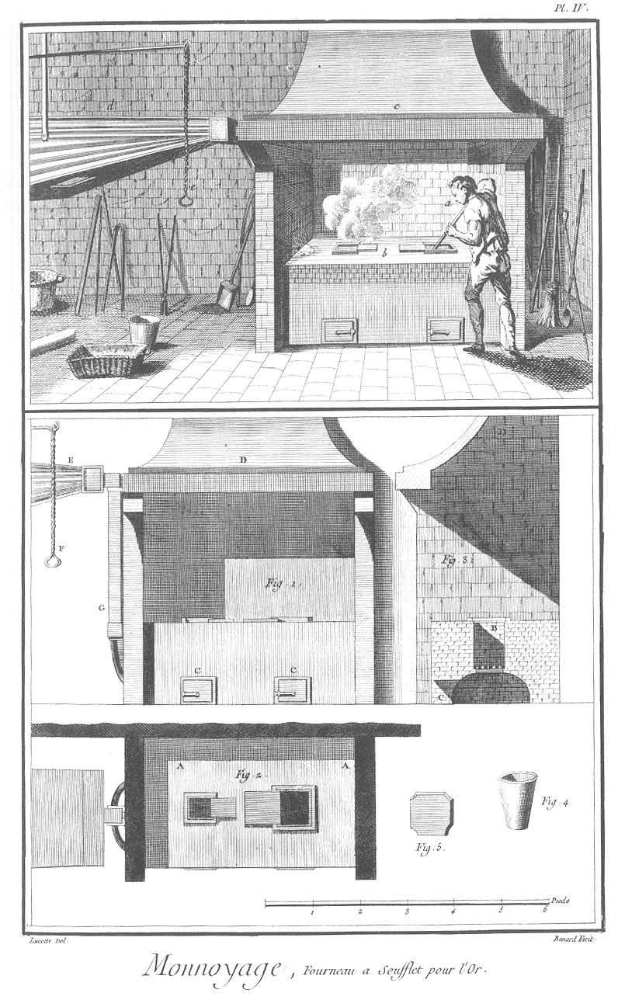](Planche_04.jpeg)

Le haut de cette Planche représente un fourneau à soufflet pour fondre l'or.

- a est un ouvrier qui découvre le creuset.
- B, le fourneau.
- c, la cheminée.
- d, le soufflet.
- e, la branloire du soufflet.

Le reste de l'attelier est semé de différens outils propres à la fonte de l'or.

1. L'élévation géométrale.

2. Le plan.

3. La coupe du fourneau à soufflet pour fondre l'or.
	- A A, la tablette du fourneau.
	- B B, les fourneaux.
	- C C, les portes du cendrier.
	- D, la cheminée.
	- E, le soufflet.
	- F, la branloire du soufflet.
	- G, le tuyau du soufflet.

4. Creuset.

5. Carreau.

PLANCHE V.
----------

[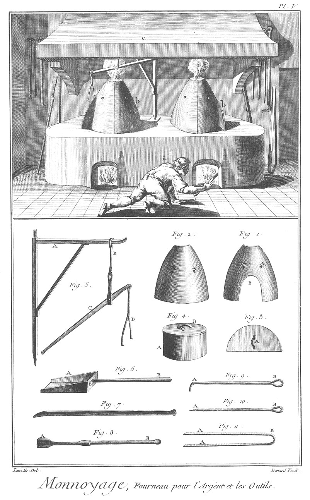](Planche_05.jpeg)

Le haut de cette Planche représente un fourneau à fondre l'argent.
	- a est un ouvrier qui tire la cendre pour donner de l'air au fourneau.
	- b b sont les fourneaux.
	- c est la cheminée.

Le reste de l'attelier est semé des outils propres à la fonte de l'argent.

Fig.
1. Chappe de devant.
	- A A, trous pour l'enlever.
	- B, ventouse.

2. Chappe de derriere.
	- A A, trous pour l'enlever.

3. Couvercle de la bouche du fourneau.
	- A, la main

4. Creuset pour l'argent.
	- A, le creuset.
	- B, le couvercle.
	- C, la main du couvercle.

5. Fléau à enlever les chappes.
	- A, la potence.
	- B, le point d'appui du levier.
	- C, le levier.
	- D, le crochet double.

6. Pelle à cendre.
	- A, la pelle.
	- B, le manche.

7. Pince à enlever les creusets.

8. Houlette.
	- A, la houlette.
	- B, le manche.

9. Tisonnier crochu.
	- A, le tisonnier.
	- B, le manche.

10. Tisonnier pointu.
	- B, le manche.

11. Pinces.
	- A A, les tiges.
	- B, la tête.

PLANCHE VI.
-----------

[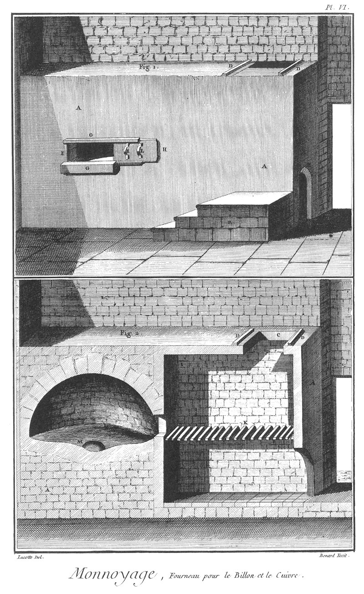](Planche_06.jpeg)

Fig.
1. L'élévation perspective, & la fig.

2. l'élévation intérieure d'un fourneau à fondre le billon & le cuivre.
	- A A, le fourneau.
	- B, le marchepié.
	- C, la ventouse.
	- D D, les coulisseaux de la ventouse.
	- E, la porte du cendrier.
	- F, la bouche du four.
	- G G, les coulisseaux de la bouche.
	- H, le couvercle de la bouche.
	- I I, les mains.
	- K, la grille du fourneau.
	- L, l'endroit où se fait la fonte.
	- M, masse de métal.

PLANCHE VII.
------------

[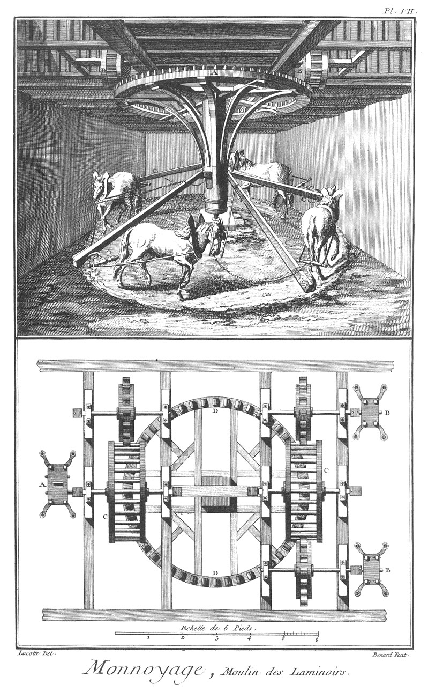](Planche_07.jpeg)

Le haut de cette Planche représente le manege des laminoirs.

- A, le rouet.
- B B, les lanternes.
- C C, les leviers.

Le bas de cette Planche représente le plan de différens laminoirs montés sur leur charpente.

- A, le dégrossi.
- B B, les laminoirs.
- C C, les lanternes.
- D D, le rouet.

PLANCHE VIII.
-------------

[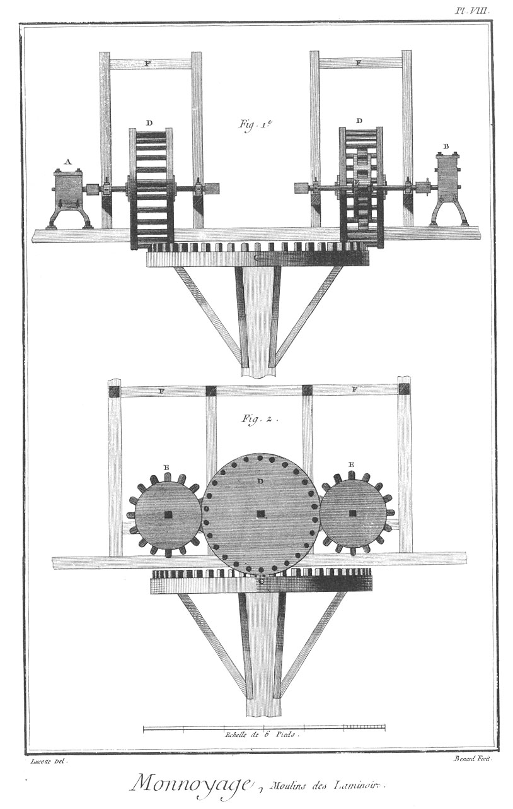](Planche_08.jpeg)

Fig.
1. Elévation géométrale, & fig.

2. élévation latérale des laminoirs montés sur leur charpente.
	- A, le dégrossi.
	- B, le laminoir.
	- C, le rouet.
	- D D, les lanternes.
	- E, les petites roues.
	- F F, &c. la charpente.

PLANCHE IX.
-----------

[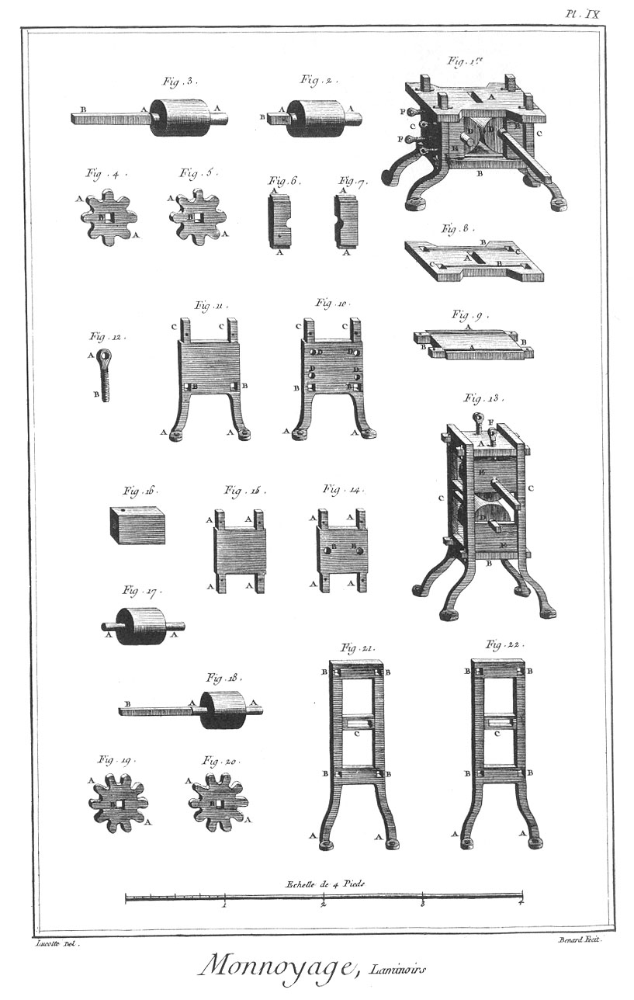](Planche_09.jpeg)

Fig.
1. Laminoir dégrossi monté.
	- A, la platine supérieure.
	- B, la platine inférieure.
	- C C, les platines latérales.
	- D D, les cylindres.
	- E, les coussinets.
	- F F, les vis.

2. Contre-cylindre du laminoir.
	- A A, les tourillons.
	- B, le quarré.

3. Cylindre du laminoir.
	- A A, les tourillons.
	- B, le quarré.

4. &
5. Pignons du laminoir.
	- A A, les dents.
	- B B, les trous quarrés.

6. &
7. Coussinets du laminoir.
	- A A, &c. les languettes.

8. Platine supérieure du laminoir.
	- A, la lumiere.
	- B B, les rainures.
	- C C, &c. les mortoises.

9. Platine inférieure du laminoir.
	- A A, les rainures.
	- B B, &c. les tenons.

10. &
11. Platines latérales du laminoir.
	- A A, &c. les pattes.
	- B B, les mortoises.
	- C C, les tenons.
	- B B, les tenons.
	- D D, &c. les trous des vis.

12. Vis du laminoir.
	- A, la tête.
	- B, la tige taraudée.

13. Laminoir monté.
	- A, la platine supérieure.
	- B, la platine inférieure.
	- C C, les platines latérales.
	- D D, les cylindres.
	- E E, les coussinets.
	- F, les vis.

14. Platine supérieure du laminoir.
	- A A, &c. les tenons.
	- B B, les tenons des vis.

15. Platine inférieure.
	- A A, &c. les tenons.

16. Boîte quarrée.

17. Contre-cylindre.
	- A A, les tourillons.

18. Cylindre.
	- A A, les tourillons.
	- B, le quarré.

19. &
20. Pignons.
	- A A, les dents.
	- B B, les trous quarrés.

21. &
22. Platines latérales.
	- A A, &c. les pattes.
	- B B, &c. les mortoises.
	- C C, les lumieres.

PLANCHE X.
----------

[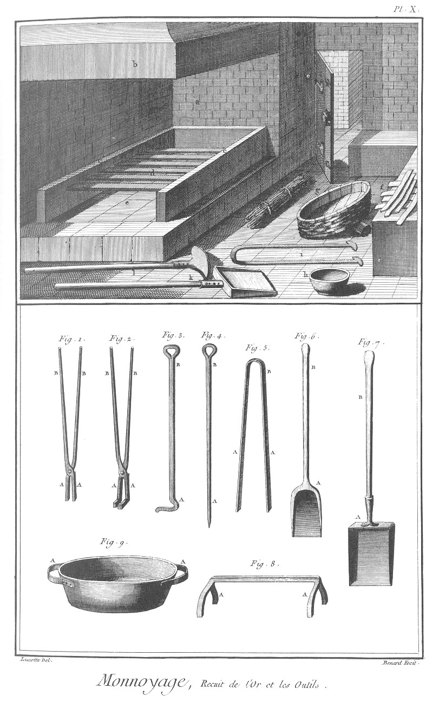](Planche_10.jpeg)

Le haut de cette Planche représente l'attelier & le fourneau à recuire l'or.

- a est le fourneau,
- b la cheminée,
- c c un petit mur en brique,
- d la grille du fourneau,
- e le cendrier du fourneau,
- f des lames,
- g un bacquet,
- h une sébille,
- i une paire de pinces,
- k une pelle de fer,
- l un rateau.

Fig.
1. Tenailles droites.
	- A A, les mords.
	- B B, les branches.

2. Tenailles croches.
	- A A, les mords.
	- B B, les branches.

3. Tisonnier crochu.
	- A, le crochet.
	- B, le manche.

4. Tisonnier pointu.
	- A, la pointe.
	- B, le manche.

5. Pinces.
	- A A, les branches.
	- B, la tête.

6. Pelle de bois.
	- A, la pelle.
	- B, le manche.

7. Pelle de fer.
	- A, la pelle.
	- B, le manche.

8. Chenet.
	- A A, les piés.

9. Bouilloire.
	- A A, les anses.

PLANCHE XI.
-----------

[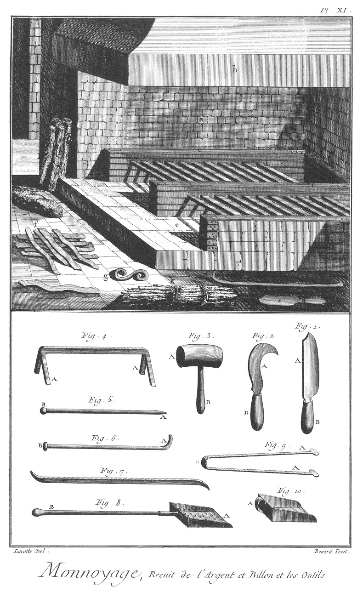](Planche_11.jpeg)

Le haut de cette Planche représente l'attelier & le fourneau à recuire l'argent & le billon. a est le fourneau, b la cheminée, c c c des petits murs en briques, d d les grilles du fourneau, e e les cendriers, f des lames, g une esse, h un tisonnier, i une serpe, k k du bois.

Fig.
1. Serpe.
	- A, la serpe.
	- B, le manche.

2. Serpette.
	- A, la serpette.
	- B, le manche.

3. Maillet.
	- A, la tête.
	- B, le manche.

4. Chenet.
	- A A, les piés.

5. Tisonnier pointu.
	- A, la pointe.
	- B, le manche.

6. Tisonnier crochu.
	- A, le crochet.
	- B, le manche.

7. Pince.

8. Pelle à charbon.
	- A, la pelle.
	- B, le manche.

9. Pinces.
	- A A, les branches.
	- B, la tête.

10. Main.
	- A, l'anse.

PLANCHE XII.
------------

[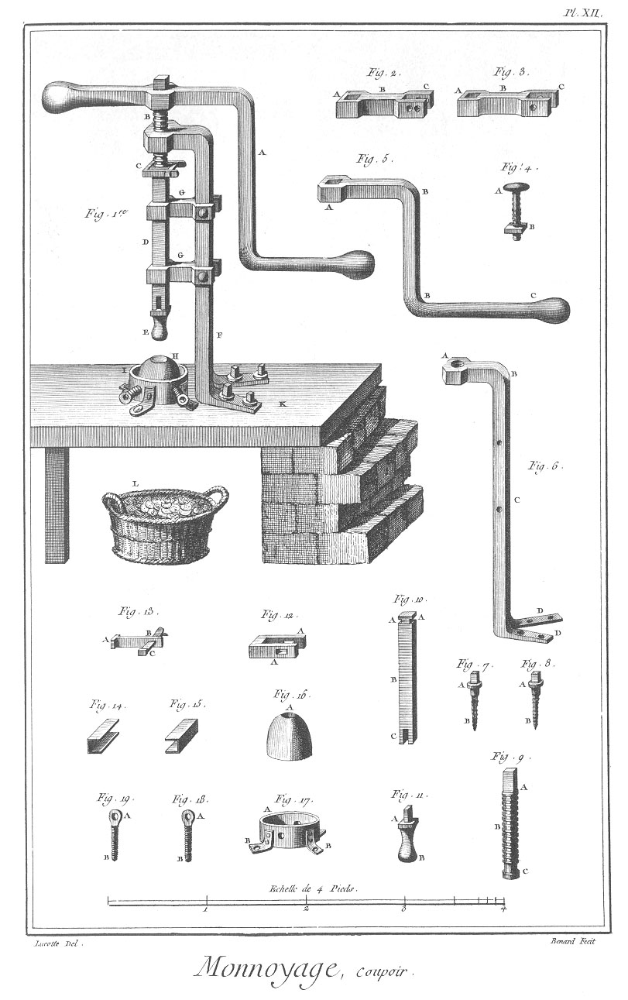](Planche_12.jpeg)

Fig.
1. Coupoir.
	- A, le balancier à contre-poids.
	- B, la vis.
	- C, le crampon du touret.
	- D, la tige de conduite.
	- E, l'emporte-piece.
	- F, le support.
	- G G, les conduits.
	- H, la perçoire.
	- I, la boîte.
	- K, l'établi.
	- L, la manne aux flaons.

2. &
3. Conduits.
	- A A, les trous de conduite.
	- B B, les tiges.
	- C C, les pattes pour les arrêter.

4. Clous à vis des conduits.
	- A, la tête.
	- B, la vis à écroux.

5. Balancier simple.
	- A, la clé.
	- B B, les coudes.
	- C, la main.

6. Support.
	- A, le trou à vis.
	- B, le coude.
	- C, la tige.
	- D D, les pattes.

7. &
8. Vis en bois à têtes, à chapeau pour arrêter le coupoir sur l'établi.
	- A A, les têtes.
	- B B, les vis.

9. Vis.
	- A, la tête.
	- B, la vis à filet quarré.
	- C, le touret.

10. Tige de conduite.
	- A A, les rainures.
	- B, la tige.
	- C, la mortoise.

11. Emporte-piece.
	- A, le tenon.
	- B, le poinçon acéré.

12. Crampon de touret.
	- A A, les mortoises.

13. Boulon du crampon.
	- A, la tête.
	- B, la mortoise.
	- C, la clavette.

14. &
15. Petites boîtes de tôle pour le touret.

16. Perçoire.
	- A, le trou acéré.

17. La boîte de la perçoire.
	- A, la boîte.
	- B B, les pattes.

18. &
19. Vis.
	- A A, les têtes.
	- B B, les tiges.

PLANCHE XIII.
-------------

[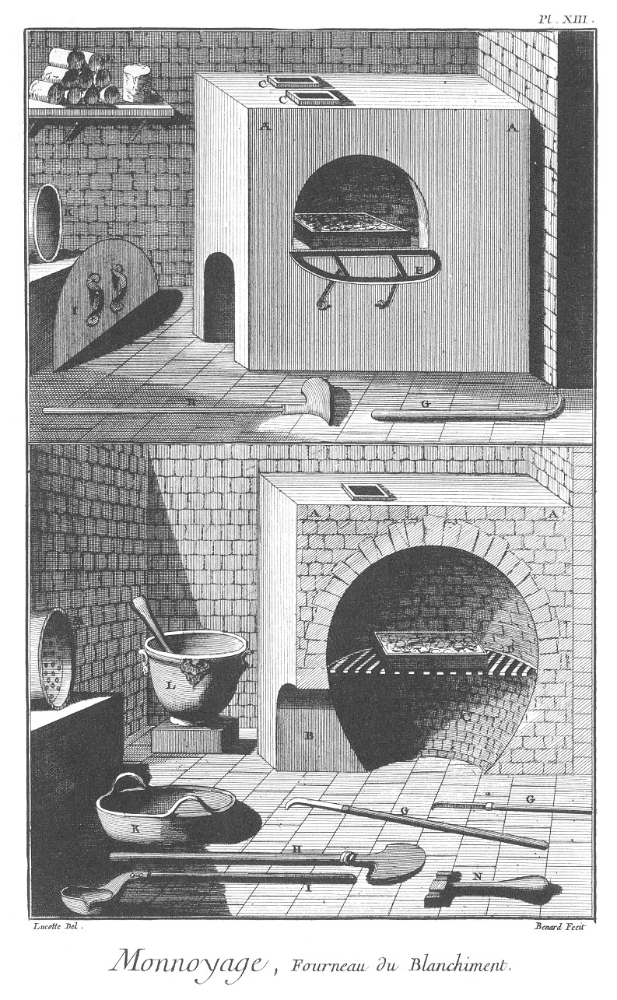](Planche_13.jpeg)

Le haut de cette Planche représente l'élévation perspective du fourneau pour le blanchiment.

- A A, le fourneau.
- B, la porte du cendrier.
- C C, les ventouses.
- D, la bouche.
- E, la soupate.
- F, la case aux flaons.
- G représente un tisonnier,
- H un rable,
- I la porte de la bouche du fourneau,
- K un creuset de fer,
- L plusieurs creusets de terre.

Le bas de cette Planche représente la coupe du même fourneau.

- A A, le fourneau.
- B, la porte du cendrier.
- C, le cendrier.
- D, la grille du fourneau.
- E, la case aux flaons.
- F, la voûte du fourneau.
- G G représentent deux crochets de cuivre,
- K un bouilloir de cuivre,
- L un mortier & son pilon,
- M un crible,
- N un marteau.

PLANCHE XIV.
------------

[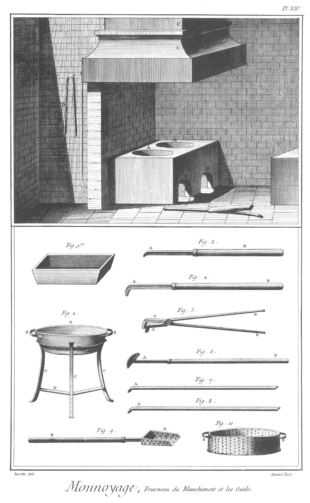](Planche_14.jpeg)

Le haut de cette Planche représente un autre fourneau pour le blanchiment.

- A A, les fourneaux.
- B B, les portes des cendriers.
- C, la cheminée.
- D, des pinces, tisonniers & autres ustensiles.

Fig.
1. Canne de fer à faire chauffer les flaons.

2. Bouilloir sur son trépié.
	- A, le bouilloir.
	- B B, les anses.
	- C C C, les supports du trépié.
	- D, l'entretoise.
	- E, le cercle supérieur.

3. &
4. Crochets de cuivre à remuer les flaons.
	- A A, les crochets.
	- B B, les manches.

5. Tenailles.
	- A A, les mords.
	- B B, les branches.

6. Racloir de cuivre.
	- A, le racloir.
	- B, le manche.

7. &
8. Poulains.
	- A A, les crochets.

9. Pelle à charbon de cuivre.
	- A, la pelle.
	- B, le manche.

10. Crible.
	- A, le crible.
	- B B, les anses.

PLANCHE XV.
-----------

[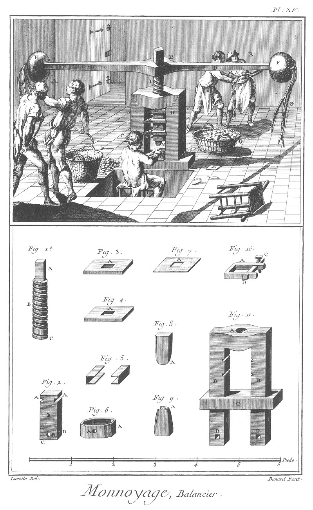](Planche_15.jpeg)

Le haut de cette Planche représente le balancier des monnoies mû en

- A & en
- B par des hommes; celui en
- C est occupé à faire marquer les flaons.
- D D, le balancier.
- E, la clé du balancier.
- G G, les cordages.
- F F, les contre-poids du balancier.
- H, la presse.
- I, la vis.
- K, la tige de conduite.
- L, le crampon.
- M M, les platines de conduite.
- N, la matrice de l'effigie.
- O, la matrice de l'écusson.
- P, la manne aux flaons non marqués.
- Q, la manne aux flaons marqués.

Fig.
1. Vis.
	- A, la tête.
	- B, la vis à filet quarré.
	- C, le touret.

2. Tige de conduite.
	 - A A, les rainures.
	 - B, la tige.
	 - C, la boîte.
	 - D D, les trous des vis.

3. &
4. Platines de conduite.
	- A A, les trous quarrés.

5. Petites boîtes de tôle pour le touret.

6. Boîte pour la matrice de l'écusson.
	- A A, les trous pour les vis.

7. Platine qui se pose sur la matrice de l'écusson pendant la marque.
	- A, le trou quarré.

8. Matrice d'effigie.
	- A, la tête acérée où est l'effigie.

9. Matrice d'écusson.
	- A, la tête acérée où est l'écusson.

10. Crampon boulonné.
	- A, le crampon.
	- B, le boulon.
	- C, la clavette.

11. Presse.
	- A, l'écrou.
	- B B, les branches.
	- C, le support.
	- D D, les trous pour l'arrêter sur le billot.

PLANCHE XVI.
------------

[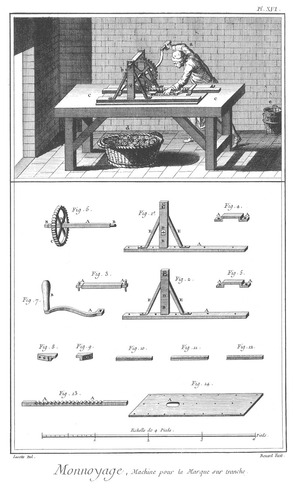](Planche_16.jpeg)

Le haut de cette Planche représente la machine à marquer la tranche des monnoies.
	- a représente un ouvrier occupé à marquer sur tranche,
	- b la machine à marquer,
	- c c la table,
	- d la manne aux monnoies,
	- e plusieurs mannes aux flaons.

Fig.
1. &
2. Chassis de la machine.
	- A A, les sommiers.
	- B B, les montans.
	- C C, les mortoises.
	- D D, les trous des tourillons.
	- E E, &c. les arboutans à patte.

3. Entretoise du chassis.
	- A A, les tenons chevillés.

4. &
5. Crampons à pattes.
	- A A, &c. les pattes.

6. Roue dentée.
	- A, l'arbre.
	- B B, les tourillons.
	- C, la roue.
	- D, la croisée de la roue.

7. Manivelle.
	- A, la clé.
	- B, le manche.

8. &
9. Arrêts des tringles à marquer.

10. &
11. &
12. Différentes tringles d'acier propres à marquer la tranche des monnoies.

13. Crémalliere.
	- A A, les dents.

14. Platine.
	- A, le trou par où passent les monnoies.

PLANCHE XVII.
-------------

[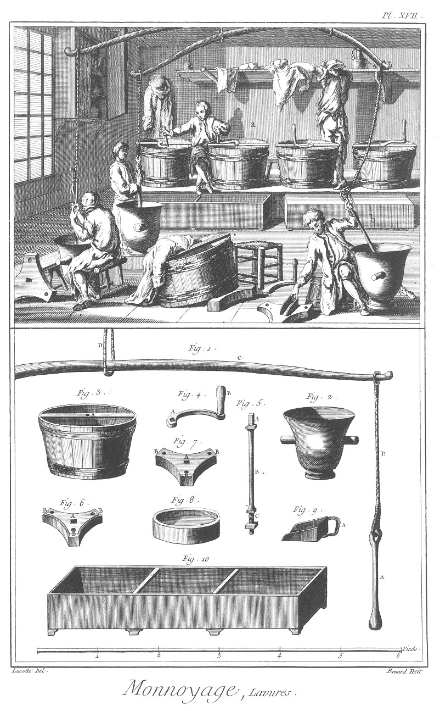](Planche_17.jpeg)

Le haut de cette Planche représente un attelier où se font les lavures. Plusieurs ouvriers sont occupés, les uns en a à tourner les manivelles ; d'autres en B B à piler les ordures & mâchefers dans des mortiers.

Fig.
1. Pilon & son mouvement.
	- A, le pilon.
	- B, la corde.
	- C, la perche.
	- D, le point d'appui.

2. Mortier.

3. Bacquet à faire les lavures.
	- A, la barre soutenant le tourniquet.

4. Manivelle.
	- A, la clé.
	- B, le manche.

5. Arbre de tourniquet.
	- A, la tête.
	- B, la tige.
	- C, la vis à écrou.

6. Croix de chevalier de bois.
	- A, le trou du milieu.
	- B B, les trous pour l'attacher.

7. Croix de chevalier de fer.
	- A, le trou du milieu.
	- B B B, les trous pour l'attacher.

8. Fond de tourniquet.

9. Main de cuivre.
	- A, l'anse.

10. Auge de bois.

PLANCHE XVIII. 
--------------

[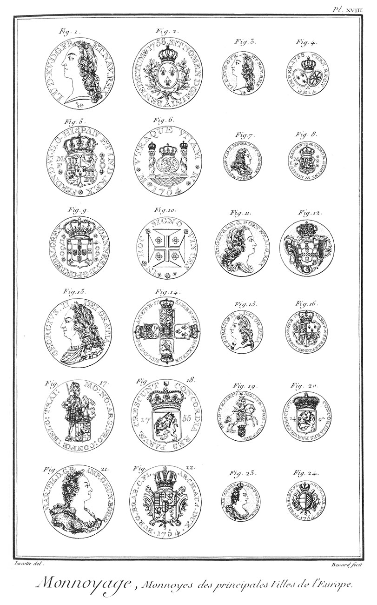](Planche_18.jpeg)

Monnoies des principales Villes de l'Europe.

Fig.
1. &
2. Ecu d'argent de France.

3. &
4. Louis d'or de France.

5. &
6. Piastre d'argent d'Espagne.

7. &
8. Pistole d'or d'Espagne.

9. &
10. Croizade d'argent de Portugal.

11. &
12. Piece d'or de Portugal.

13. &
14. Croun d'argent d'Angleterre.

15. &
16. Guinée d'or d'Angleterre.

17. &
18. Rixdalle d'argent d'Hollande.

19. &
20. Ruyder d'or d'Hollande.

21. &
22. Ducaton d'argent des Pays-Bas.

23. &
24. Souverain d'or des Pays Bas.

PLANCHE XIX.
------------

[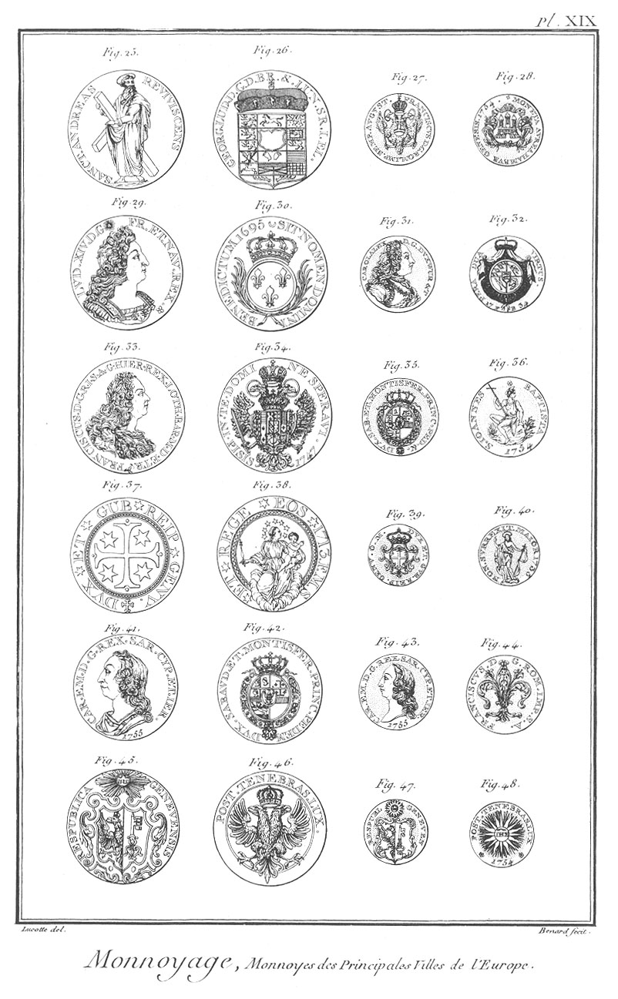](Planche_19.jpeg)

Suite des monnoies des principales Villes de l'Europe.

Fig.
25. &
26. Rixdalle d'argent d'Allemagne.

27. &
28. Ducat d'or d'Hambourg.

29. &
30. Ecu d'argent de France de Louis XIV.

31. &
32. Carolin d'or d'Allemagne.

33. &
34. Francisconi d'argent de Toscane.

35. &
36. Rouponi d'or de Toscane.

37. &
38. Croizal d'argent de Gènes.

39. &
40. Sequin d'or de Gènes.

41. &
42. Demi-écu d'argent de Savoie.

43. &
44. Pistole d'or de Savoie.

45. &
46. Patagon d'argent de Genève.

47. &
48. Pistole d'or de Genève.

[->](../08-Mosaïque/Légende.md)
