ORFEVRE GROSSIER
================

Contenant dix-neuf Planches.

PLANCHE Iere.
-------------

[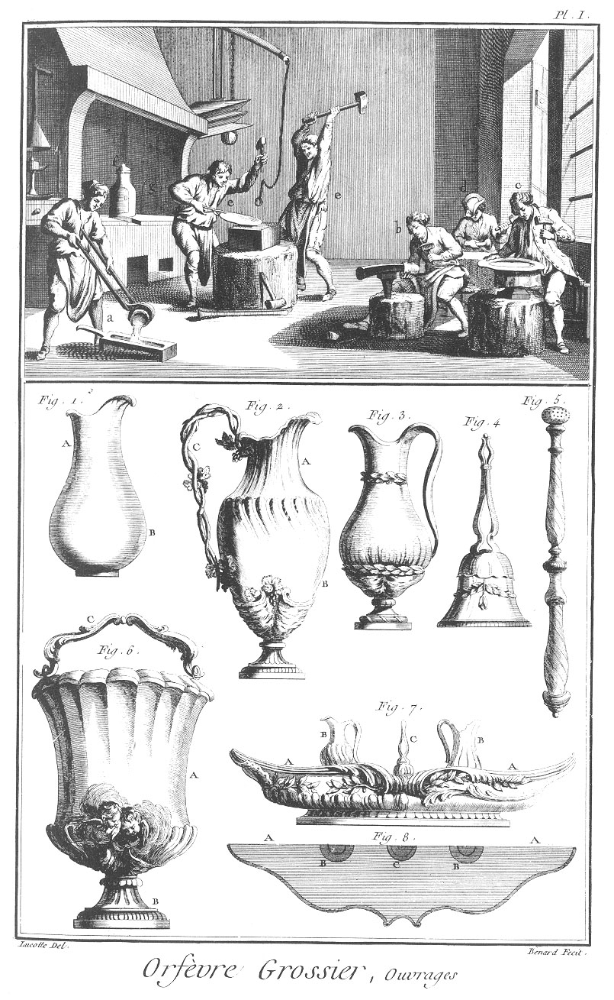](Planche_01.jpeg)

Le haut de cette Planche représente un attelier d'orfévrerie, où plusieurs ouvriers sont diversement occupés ; l'un en

- a à couler le métal dans la lingotiere ; un en
- b à rétreindre un vase ; un en
- c à planer une assiette ou un plat ; un autre en
- d à rétreindre une burette, & les autres en e à forger une plaque. Près de-là en
- f est un fourneau à fonte, en
- g une forge, en
- h une lampe à souder, chalumeau, soufflet, panier à charbon, tenailles, & autres ustensiles nécessaires à l'usage du fourneau.

Fig.
1. Burette sans anse.
	- A, le col.
	- B, la panse.

2. &
3. Burettes avec anses.
	- A, le col.
	- B, la panse.
	- C, l'anse.

4. Sonnette.

5. Bâton de goupillon.

6. Bénitier.
	- A, le bénitier.
	- B, le pié.
	- C, l'anse.

7. Elévation, &
8. plan d'une cuvette de burettes.
	- A A, la cuvette.
	- B B, les burettes.
	- C, la sonnette.

PLANCHE II.
-----------

[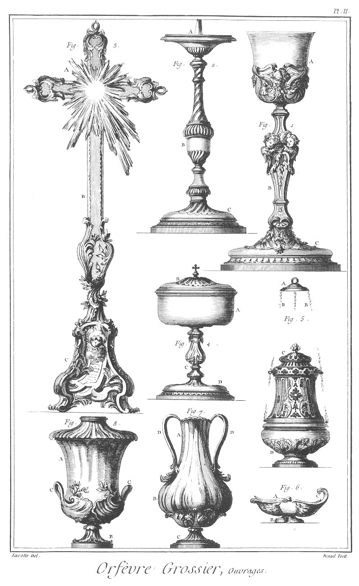](Planche_02.jpeg)

Fig.
1 Calice.
	- A, le vase.
	- B, la tige.
	- C, le pié.

2. Chandelier d'accolite.
	- A, le porte-cierge.
	- B, la tige.
	- C, le pié.

3. Croix d'autel.
	- A, la croix.
	- B, la tige.
	- C, le pié.

4. Ciboire.
	- A, le vase.
	- B, le couvercle.
	- C, la tige.
	- D, le pié.

5. Encensoir
	- A, le porte-chaîne.
	- B B, les chaînes.
	- C, le dessus.
	- D, le pié.

6. Navette.
	- A, le couvercle.
	- B, le pié.
	- C, l'anse.

7. Vase d'autel.
	- A, le col.
	- B, la panse.
	- C, le pié.
	- D D, les anses.

8. Autre vase d'autel.
	- A, le corps du vase.
	- B, le pié.
	- C C, les anses.

PLANCHE III.
------------

[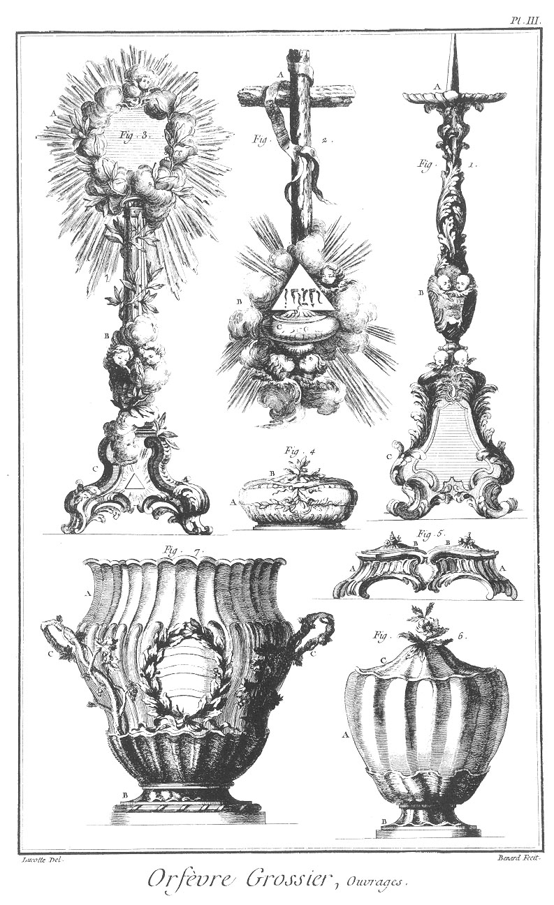](Planche_03.jpeg)

Fig.
1. Chandelier d'autel.
	- A, le porte-cierge.
	- B, la tige.
	- C, le pié.

2. Bénitier de lit.
	- A, la croix.
	- B, guegloire.
	- C, le bénitier.
	- D, le couvercle.

3. Soleil.
	- A A, contour de gloire mêlé de branches de laurier.
	- B, la tige.
	- C, le pié.

4. Coffre à mettre sur l'autel.
	- A, la boîte.
	- B, le couvercle.

5. Saliere double.
	- A A, les salieres.
	- B B, les couvercles.

6. Pot à sucre.
	- A, le vase.
	- B, le pié.
	- C, le couvercle.

7. Seau à rafraîchir.
	- A, le vase.
	- B, le pié.
	- C C, les anses.

PLANCHE IV.
-----------

[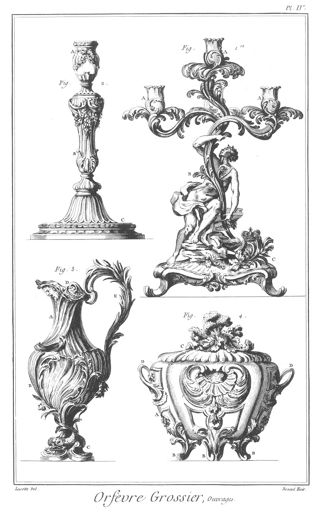](Planche_04.jpeg)

Fig.
1. Flambeaux de table à trois branches.
	- A A A, les bobeches.
	- B, la tige.
	- C, le pié.

2. Flambeau de toilette.
	- A, le porte-bobeche.
	- B, la tige.
	- C, le pié.

3. Buire pour les évêques.
	- A, le col du vase.
	- B, la panse.
	- C, le pié.
	- D, le couvercle.
	- E, l'anse.

4. Terrine.
	- A, le corps.
	- B B, les piés.
	- C, le couvercle
	- D D, les anses.

PLANCHE V.
----------

[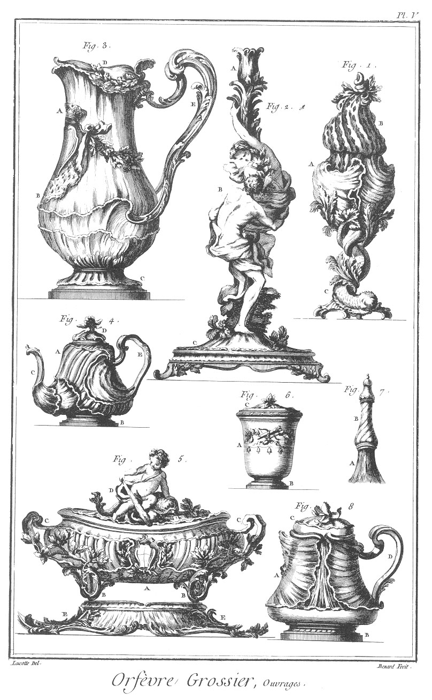](Planche_05.jpeg)

Fig.
1. Sucrier.
	- A, le sucrier.
	- B, le couvercle.
	- C, le pié.

2. Flambeau de table.
	- A, le porte-bobeche.
	- B, la tige.
	- C, le pié.

3. Pot à l'eau.
	- A, le col.
	- B, la panse.
	- C, le pié.
	- D, le couvercle.
	- E, l'anse.

4. Théiere.
	- A, le corps du vase.
	- B, le pié.
	- C, la goulotte.
	- D, le couvercle.
	- E, l'anse.

5. Soupiere.
	- A, la soupiere.
	- B B, les piés.
	- C C, les anses.
	- D, le couvercle.
	- E E, le plat de dessous.

6. Vase de toilette.
	- A, le vase.
	- B, le pié.
	- C, le couvercle.

7. Brosse à peigne.
	- A, la brosse.
	- B, le porte-brosse.

8. Marabout.
	- A, le vase.
	- B, le pié.
	- C, le couvercle.
	- D, l'anse.

PLANCHE VI.
-----------

[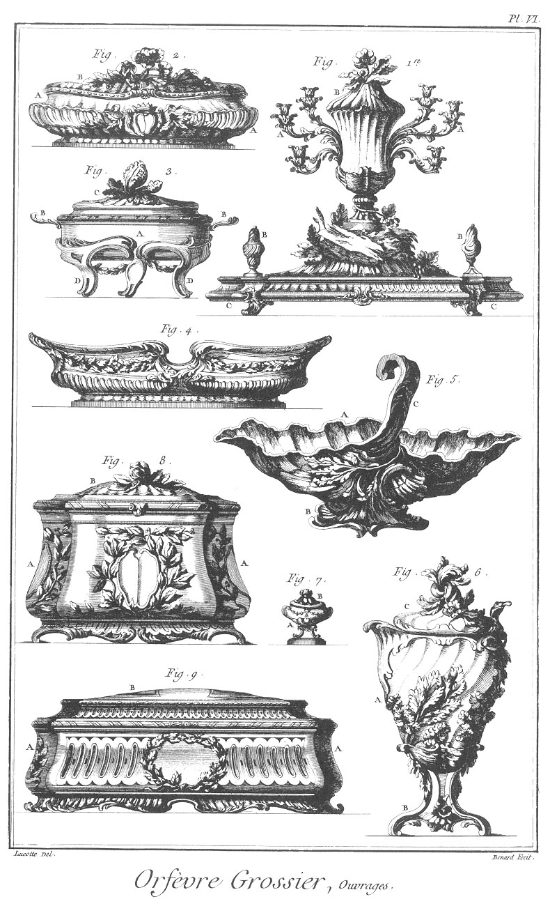](Planche_06.jpeg)

Fig.
1. Surtout.
	- A A, les bobeches.
	- B B B, les vases.
	- C C, le plateau.

2. Crèmiere.
	- A A, la crèmiere.
	- B, le couvercle.

3. Ecuelle sur son trépié.
	- A, l'écuelle.
	- D D, le trépié.

4. Cuvette à laver.

5. Sauciere.
	- A, la sauciere.
	- B, le pié.
	- C, l'anse.

6. Moutardier.
	- A, le vase.
	- B, le pié.
	- C, le couvercle.

7. Vase de toilette.
	- A, le vase.
	- B, le couvercle.

8. &
9. Coffres de toilette.
	- A A, &c. les coffres.
	- B B, les couvercles.

PLANCHE VII.
------------

Fig.
1. &
2. &
3. Assiettes contournées.

4. Jatte contournée.

5. Plat quarré contourné.

6. &
7. Plats ronds contournés.

8. &
9. Plats ovales contournés.

10. Boîte à savonnette.
	- A, le couvercle.
	- B, le pié.

11. Bassin à barbe.
	- A, l'échancrure.

12. Marabout.
	- A, le vase.
	- B, l'anse.
	- C, le couvercle.

13. Théiere,
	- A, le vase.
	- B, l'anse.
	- C, le couvercle.
	- D, la goulotte.

14. Caffetiere.
	- A, le vase.
	- B. le couvercle.
	- C, le manche.

15. Lampe de nuit.
	- A, le col.
	- B, la panse.
	- C, l'anse.

16. Réchaux à l'esprit-de-vin.
	- A, le vase contenant l'esprit-de vin.
	- B, le couvercle.
	- C C C, les piés.
	- D, le manche.

17. Caffetiere.
	- A, le col.
	- B, la panse.
	- C C C, les piés.
	- D, le couvercle.
	- E, le manche.

18. Cuillere à soupe ou à ragoût.

19. &
20. Fourchette & cuillere appellés couvert.

PLANCHE VIII. Outils.
---------------------

[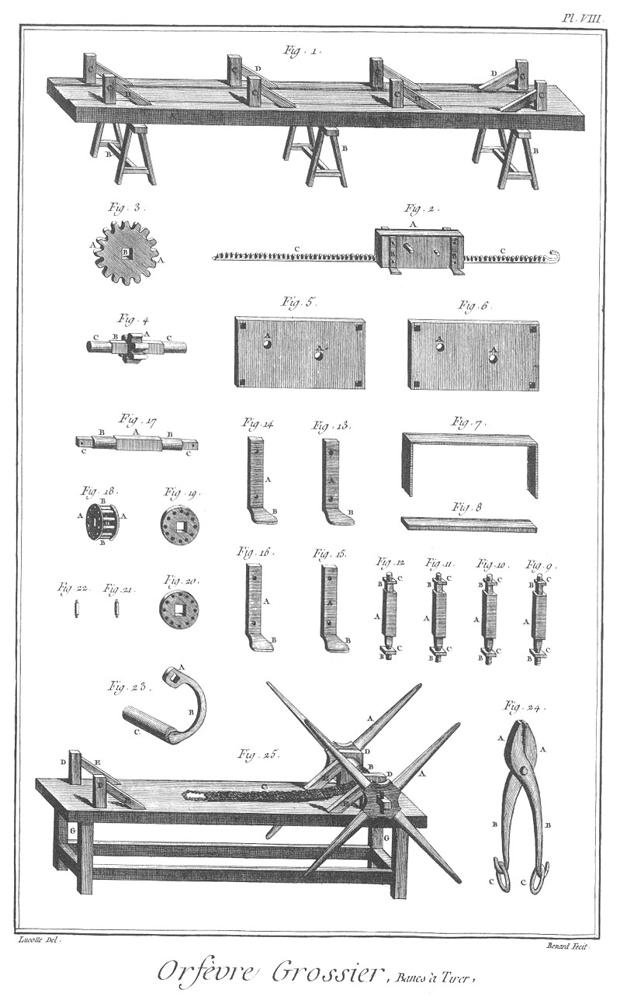](Planche_08.jpeg)

Fig.
1. Banc à tirer.
	- A, le banc.
	- B B B, les tréteaux.
	- C C, &c. les pitons.
	- D D, &c. les arcboutans.

2. Boîte à tirer.
	- A, la boîte.
	- B B, les étoquiots à pattes.
	- C C, la crémaillere.

3. Roue dentée.
	- A A, les dents.
	- B, le trou de l'arbre.

4. Pignon.
	- A, les dents.
	- B, l'arbre.
	- C C, les tourillons.

5. &
6. Platine de la boîte.
	- A A, &c. les trous des tourillons.

7. Cloison de la boîte.

8. Support de la crémaillere.

9. &
10. &
11. &
12. Goujons à vis.
	- A A, &c. les goujons.
	- B B, &c. les vis.
	- C C, &c. les écroux.

13. &
14. &
15. &
16. Etoquiots à pattes.
	- A A, &c. les étoquiots.
	- B B, &c. les pattes.

17. Arbre de la lanterne & de la roue dentée.
	- A, le corps.
	- B B, les tourillons.
	- C C, les quarrés.

19. &
20. Plateaux de la lanterne.

21. &
22. fuseaux de la lanterne.

23. Manivelle.
	- A, la clé.
	- B, la tige.
	- C, le rouleau.

24. Tenailles à tirer.
	- A A, les mords.
	- B B, les branches.
	- C C, les anneaux.
	- D, l'oeil.

25. Banc à tirer au moulinet.
	- A A, les moulinets.
	- B, l'arbre.
	- C, la sangle.
	- D D, &c. les pitons.
	- E E, leurs arboutans.
	- F, la table.
	- G G, les piés.

PLANCHE IX.
-----------

[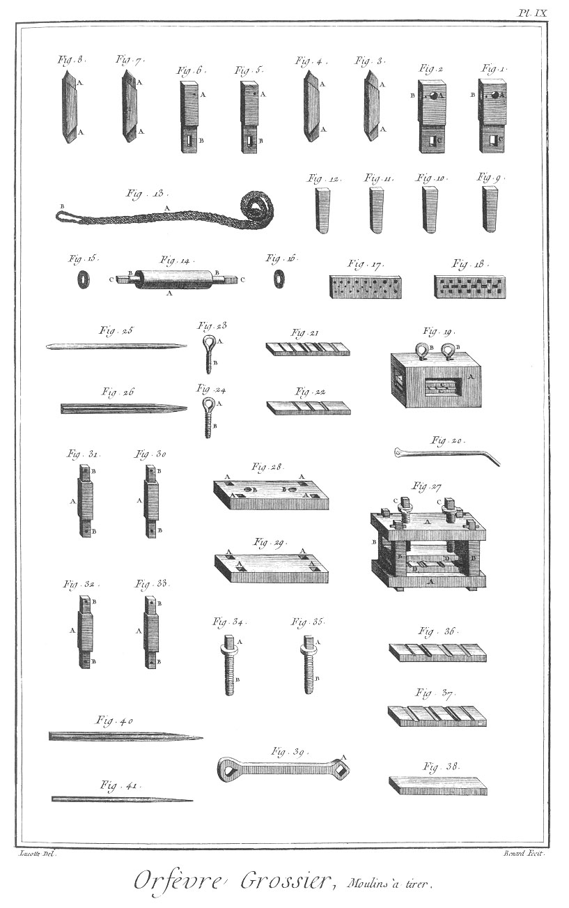](Planche_09.jpeg)

Fig.
1. &
2. Pitons de l'arbre du banc à tirer au moulinet.
	- A A, les yeux.
	- B B, les mortoises des arcboutans.
	- C C, les mortoises des clés.

3. &
4. Arcboutans des pitons précédens.
	- A A, &c. les tenons.

5. &
6. Pitons de la boîte à tirer.
	- A A, les mortoises des arcboutans.
	- B B, les mortoises des clés.

7. &
8. Arcboutans des pitons précédens.
	- A A, &c. les tenons.

9. &
10. Clés des pitons de l'arbre.

11. &
12. Clés des pitons de la boîte.

13. Sangle.
	- A, la sangle.
	- B, la boucle.

14. Arbre à tirer.
	- A, le rouleau.
	- B B, les tourillons.
	- C C, les quarrés.

15. &
16. Viroles.

17. Filieres à trous ronds & ovales.

18. Filiere à trous quarrés & méplats.

19. Boîte à tirer.
	- A, la boîte.
	- B B, les vis.
	- C C, les billes.

20. Clé à tourner les vis.

21. &
22. Billes à moulures.

23. &
24. Vis.
	- A A, les têtes.
	- B B, les vis.

25. &
26. Lingots tirés.

27. Autre boîte à tirer la moulure.
	- A A, les plateaux.
	- B B, &c. les supports.
	- C C, les vis
	- D D, les billes.

28. Plateau supé ieur.
	- A A, &c. les trous des supports.
	- B B, les trous des vis.

29. Plateau inférieur.
	- A A, &c. les trous des supports.

30. &
32. &
33. Supports.
	- A A, &c. les supports.
	- B B, &c. les tenons.

34. &
35. Vis à tête à chapeau.
	- A A, les têtes.
	- B B, les vis.

36. &
37. Billes à moulures.

38. Contre-bille.

39. Clé à vis.
	- A, la clé.

40. &
41. Lingots tirés.

PLANCHE X.
----------

[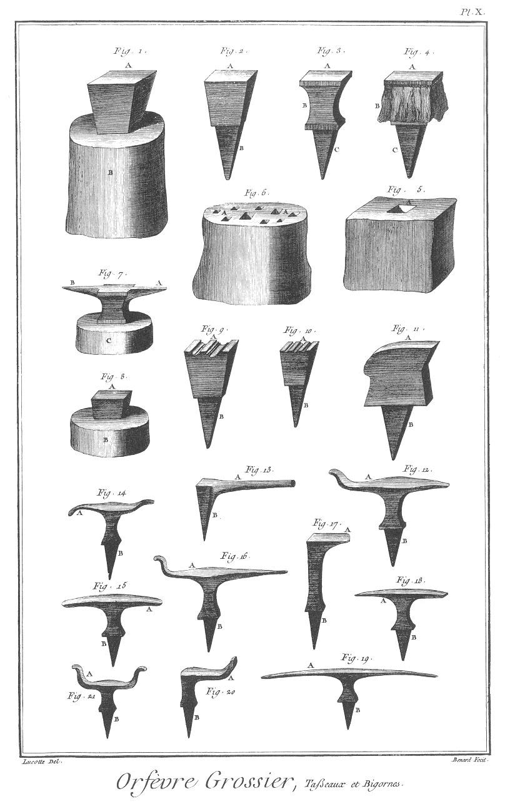](Planche_10.jpeg)

Fig.
1. Tas monté.
	- A, le dessus acéré.
	- B, le billot.

2. Tas.
	- A, le dessus acéré.
	- B, la pointe.

3. Tas à gorge.
	- A, le dessus acéré.
	- B, la gorge.
	- C, la pointe.

4. Tas garni de peau.
	- A, le dessus.
	- B, la garniture.
	- C, la pointe.

5. Billot.
	- A, le trou du tas.

6. Billot pour les bigornes.
	- A A, les trous des bigornes.

7. Bigornes montées.
	- A, la bigorne quarrée.
	- B, la bigorne ronde.
	- C, le billot.

8. Tas acéré.
	- A, le dessus.
	- B, le billot.

9. &
10. Tas à moulure.
	- A A, le dessus acéré.
	- B B, les pointes.

11. Tas plat.
	- A, le dessus acéré.
	- B, la pointe.

12. &
13. &
14. &
15. &
16. &
17. &
18. &
19. &
20. &
21. Bigornes de différentes sortes.
	- A A, &c. les bigornes.
	- B B, &c. les pointes.

PLANCHE XI.
-----------

[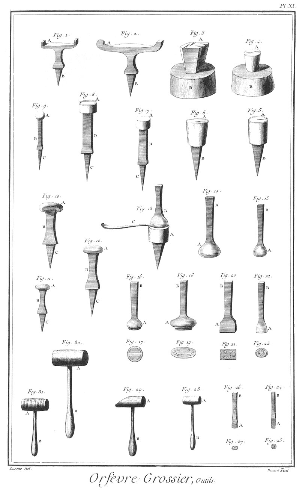](Planche_11.jpeg)

Fig.
1. &
2. Autres bigornes.
	- A A, &c. les bigornes.
	- B B, les pointes.

3. Etampe à fourchette montée.
	- A, le dessus acéré.
	- B, le billot.

4. Petite étampe à fourchette montée.
	- A, le dessus acéré.
	- B, le billot.

5. &
6. Etampes à cuillere.
	- A, le dessus acéré.
	- B B, les pointes.

7. Tasseau droit.
	- A, le dessus acéré.
	- B, la tige.
	- C, la pointe.

8. Tasseau creux.
	- A, le dessus acéré.
	- B, la tige.
	- C, la pointe.

9. Tasseau sphérique.
	- A, le dessus acéré.
	- B, la tige.
	- C, la pointe.

11. &
12. Tasseaux ronds.
	- A A A, les dessus.
	- B B B, les tiges.
	- C C C, les pointes.

13. Etampes à cuillere avec son poinçon.
	- A, l'étampe.
	- B, le poinçon.
	- C, la cuillere.

14. &
15. Poinçon à étamper les cuilleres & les fourchettes.
	- B B, les têtes.

16. &
17. &
18. &
19. &
20. &
21. &
22. &
23. &
24. &
25. &
26. &
27. Elévations & plans de poinçons & emporte-pieces.
	- A A, &c. les poinçons ou emporte-pieces.
	- B B, les têtes.

28. &
29. &
30. &
31. Maillets de différentes grosseurs.
	- A A, &c. les maillets.
	- B B, &c. les manches.

PLANCHE XII.
------------

[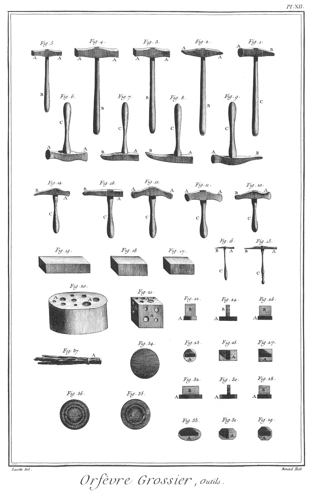](Planche_12.jpeg)

Fig.
1. Marteau.
	- A, la tête.
	- B, la panne.
	- C. le manche.

2. Marteau à deux pannes.
	- A A, les pannes.
	- B, le manche.

3. &
4. &
5. Marteaux à deux têtes.
	- A A, &c. les têtes.
	- B B, &c. les manches.

6. &
7. &
8. &
9. &
10. &
11. &
12. &
13. &
14. Différens marteaux à emboutir.
	- A A, &c. les têtes.
	- B B, &c. les pannes.
	- C C, &c. les manches.

15. &
16. Petits marteaux à emboutir.
	- A A, les têtes.
	- B B, les pannes.
	- C C, les manches.

17. &
18. &
19. Marchepiés.

20. Billot à emboutir,
	- A A, le creux.

21. Dé à emboutir.
	- A A A, les creux.

22. &
23. &
24. &
25. &
26. &
27. &
28. &
29. &
30. &
31. &
32. &
33. Plans & élevations de mandrins pour les tabatieres : le premier rond, le second barelong, le troisieme quarré, le quatrieme en exagone régulier, le cinquieme en exagone irrégulier, & le sixieme ovale.
	- A A, &c. les mandrins.
	- B B. &c. les tenons.

34. Premiere opération pour un plat ou assiette.

35. Seconde opération pour un plat ou assiette.
	- A, le fond.
	- B, le bord intérieur.

36. Troisieme & derniere opération pour un plat ou assiette.
	- A, le fond.
	- B, le bord intérieur.
	- C, le bord extérieur.

37. Ballet de peau.
	- A, la poignée.

PLANCHE XIII.
-------------

[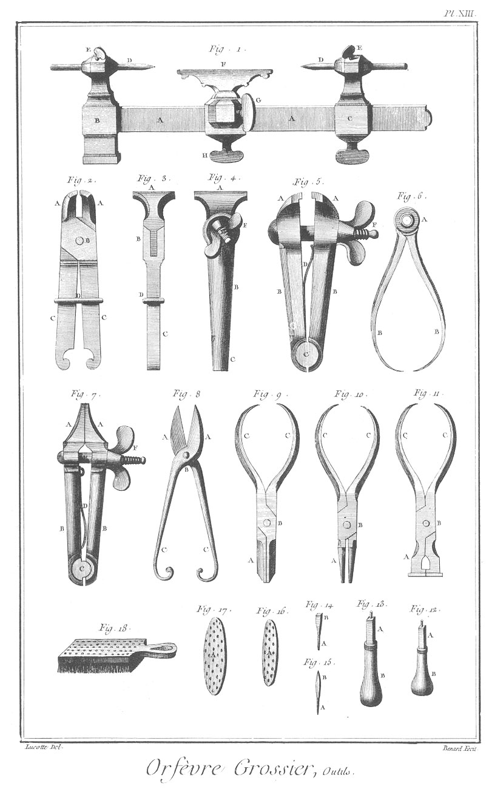](Planche_13.jpeg)

Fig.
1. Petit tour à main.
	- A A, la coulisse.
	- B, la poupée dormante.
	- C, la poupée mouvante
	- D D, les pointes.
	- E, les vis des pointes.
	- F, le support.
	- G, la vis du support.
	- H, la vis de rappel.

2. &
3. Etau à coulisse.
	- A A, les mords.
	- B, la charniere.
	- C, les branches
	- D, la coulisse.

4. &
5. Etau à main.
	- A A, les mords.
	- B B, les jumelles.
	- C, la charniere.
	- D, le ressort.
	- E, la vis.
	- F, l'écrou.

6. Compas d'épaisseur.
	- A, la tête.
	- B B, les pointes.

7. Etau à vis.
	- A A A, les mords.
	- B B, les jumelles.
	- C, la charniere.
	- D, le ressort.
	- E, la vis.
	- F, l'écrou.

8. Cisoires.
	- A A, les mords.
	- B, la charniere.
	- C C, les branches.

9. Pinces plates.
10. Pinces rondes, &
11. Pinces camuses.
	- A A A, les mords des pinces.
	- B B B, les charnieres.
	- C C C, &c. les branches.

12. &
13. Mandrins à charnons.
	- A A, les mandrins.
	- B B, les manches.

14. &
15. Tarauds.
	- A A, les vis.
	- B B, les têtes.

16. &
17. Filieres.
	- A A, &c. les trous.

18. Grandes brosses.

PLANCHE XIV.
------------

[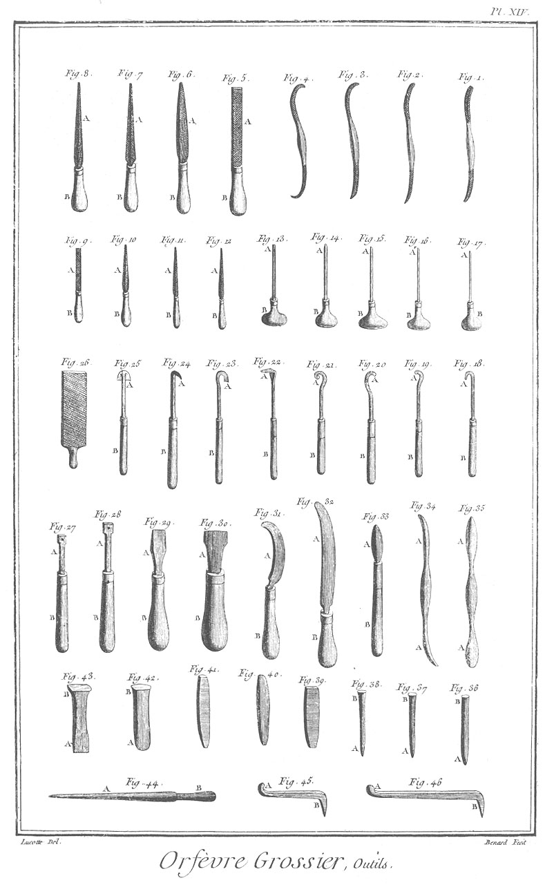](Planche_14.jpeg)

Fig.
1. &
2. &
3. &
4. Rifloirs de toutes especes.

5. Quarrelettes.

6. Demi-rondes.

7. Tierspoint.

8. Queues-de-rat.
	- A A, &c. les limes.
	- B B, &c. les manches.

9. Petite quarrelette d'Angleterre.

10. Petite demi-ronde d'Angleterre.

11. Petit tierspoint d'Angleterre.

12. Petite queue-de-rat d'Angleterre.
	- A A, &c. les limes.
	- B B, &c. les manches.

13. &
14. &
15. &
16. &
17. Echoppes & burins.
	- A A, &c. les taillans.
	- B B, &c. les manches.

18. &
19. &
20. &
21. &
22. &
23. &
24. &
25. Grattoirs de différentes sortes.
	- A A, &c. les taillans.
	- B B, &c. les manches.

26. Grande lime.

27. &
28. Mandrins à charnons.
	- A A, les mandrins.
	- B B, les manches.

29. &
30. Tourne-vis.
	- A A, les tourne-vis.
	- B B, les manches.

31. &
32. Couteaux.
	- A A, les lames.
	- B B, les manches.

33. Brunissoir emmanché.
	- A, le brunissoir.
	- B, le manche.

34. &
35. Autres brunissoirs.
	- A A, &c. les brunissoirs.

36. &
37. &
38. Différens poinçons.
	- A A A, les poinçons.
	- B B B, les têtes.

39. Mandrin méplat.

40. Mandrin rond.

41. Mandrin quarré.

42. Ciseau rond.
	- A, le taillant.
	- B, la tête.

43. Ciseau droit.
	- A, le taillant.
	- B, la tête.

44. Brunissoir.
	- A, la tige.
	- B, le manche.

45. Petite resingue.
	- A, le tasseau.
	- B, la pointe.

46. Grande resingue.
	- A, le tasseau.
	- B, la pointe.

PLANCHE XV.
-----------

[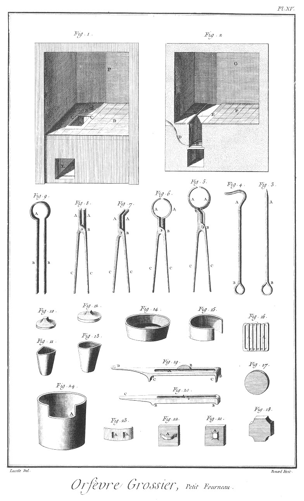](Planche_15.jpeg)

Fig.
1. Elévation d'un fourneau à fondre au creuset.
	- A, le fourneau.
	- B, le couvercle.
	- C C, les coulisses.
	- D, le dessus.
	- E, la bouche
	- F, la cheminée.

2. Coupe du même fourneau.
	- A, le fourneau.
	- B, la grille.
	- C, le cendrier.
	- D, le porte vent.
	- E E, les coulisses du couvercle.
	- F, le dessus du fourneau.
	- G, la cheminée.

3. Tisonniers pointus.
	- A, la pointe.
	- B, l'anneau.

4. Tisonnier crochu.
	- A, le crochet.
	- B, l'anneau.

5. &
6. Tenailles à creuset.
	- A A, &c. les mords.
	- B B, les yeux.
	- C C C, &c. les branches.

7. Tenailles crochues.
	- A A, les mords.
	- B, l'oeil.
	- C C, les branches.

8. Tenailles droites.
	- A A, les mords.
	- B, l'oeil.
	- C C, les branches.

9. Pinces.
	- A, la tête.
	- B, les branches.

10. Couvercle de creuset d'Allemagne.

11. Creuset d'Allemagne.

12. Couvercle de creuset de Paris.

13. Creuset de Paris.

14. Coupelle.

15. Cendrier.

16. Grille du fourneau :
	- A A, les barreaux.

17. Porte-creuset rond.

18. Porte creuset à pans creusés.

19. Lingotiere.
	- A, le moule.
	- B, le porte-creuset.

20. Autre lingotiere.
	- A, le moule.
	- B B, les piés.
	- C, la queue.

21. Couvercle du fourneau.
	- A, le bouton.

22. Porte de la bouche du fourneau.
	- A, la main.

23. Porte de la bouche du grand creuset.
	- A, les lumieres.

24. Grand creuset.
	- A A, la bouche.

PLANCHE XVI.
------------

[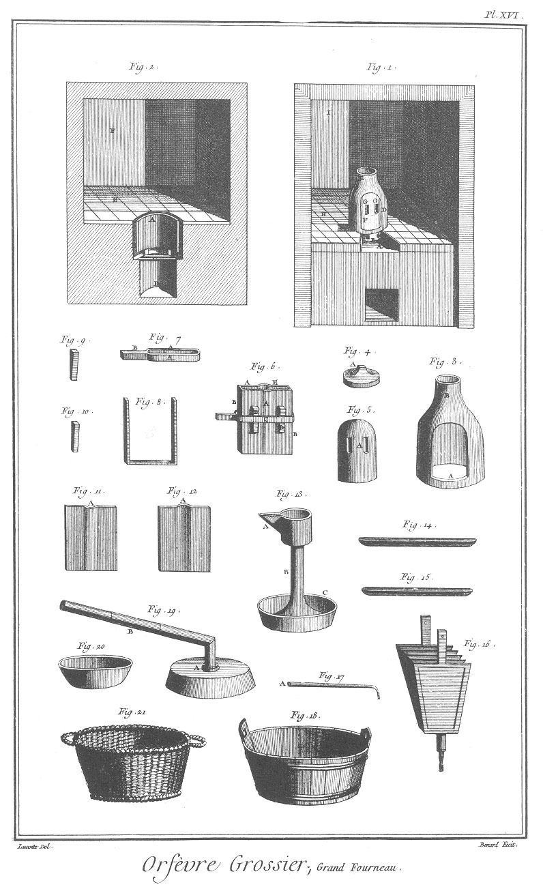](Planche_16.jpeg)

Fig.
1. Elévation d'un fourneau pour les grandes fontes.
	- A, l'ouverture de la bouche du creuset.
	- B, la bouche du creuset.
	- C C, les lumieres.
	- D, la ventouse.
	- E, la cheminée.
	- F, la porte.
	- G G, les lumieres.
	- H, le dessus du fourneau.
	- I, la cheminée du fourneau.
	- K, la bouche du fourneau.

2. Coupe du même fourneau.
	- A, le creuset.
	- B B, le fourneau.
	- C, la grille du fourneau.
	- D, le cendrier.
	- E, le dessus.
	- F, la cheminée.

3. La chappe.
	- A, la porte.
	- B, l'ouverture d'en-haut.

4. Couvercle de la chappe.
	- A, le bouton.

5. Porte de la chappe.
	- A, les lumieres.

6. Moule.
	- A A, les plateaux.
	- B B, le chassis.
	- C, la frette.
	- D D, les serres ou coins
	- E, l'embouchure.

7. Frette du moule.
	- A A, les branches.
	- B, le manche.

8. Chassis du moule.

9. &
10. Coins du moule.

11. &
12. Plateaux du moule.
	- A A, les embouchures.

13. Lampe à souder.
	- A, la lampe.
	- B, la tige.
	- C, le porte-lampe.

14. &
15. Lingots.

16. Soufflet.

17. Chalumeau.
	- A, l'embouchure.

18. Baquet.

19. Couvre-lampe.
	- A, l'entonnoir.
	B, le tuyau.

20. Sébille.

21. Panier à charbon.

PLANCHE XVII.
-------------

[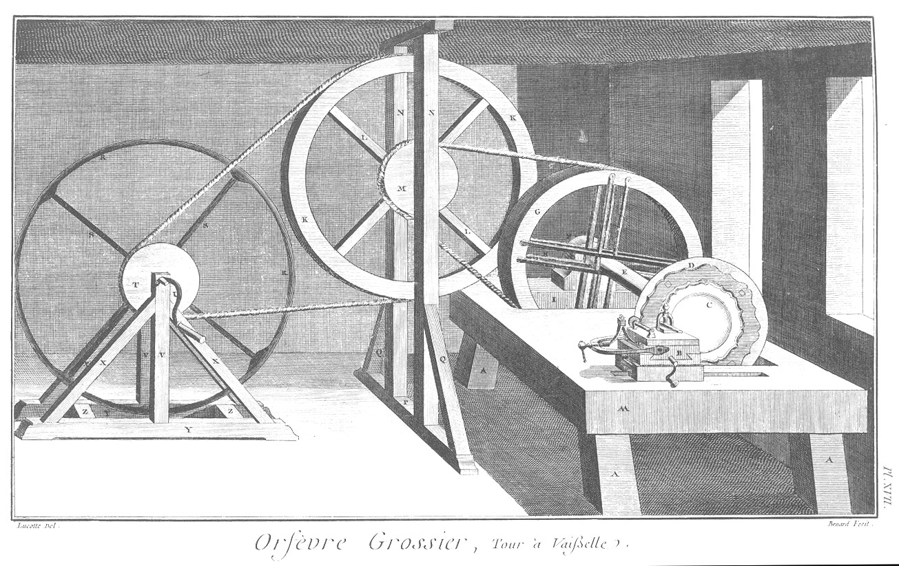](Planche_17.jpeg)

Tour à tourner la vaisselle contournée.

- A A, l'établi.
- A A, &c. les piés.
- B, le support.
- C, l'assiette ou plat.
- D, la grande roue de conduite.
- E, l'arbre.
- F, la poupée.
- G, la grande poulie.
- H H, les rayons.
- I, l'ouverture de la poulie dans l'établi.
- K, la premiere roue.
- L L, les rayons.
- M, la petite roue.
- N N, les jumelles du chassis de support.
- O, le chapeau.
- P, le sommier.
- Q Q, les contre fiches.
- R R, la seconde roue.
- S S, les rayons.
- T, la petite roue.
- U, la manivelle.
- V V, les jumelles du support.
- X X, &c. les contre fiches.
- Y Y, les sommiers.
- Z Z, les traverses des sommiers.

PLANCHE XVIII. Développement du support.
----------------------------------------

Fig.
1. Petite roue de conduite.
	- A, la roue.
	- B, l'arbre.

2. Vis du support de l'outil.
	- A, la vis.
	- B, la tête.
	- C, la clé.

3. Outil.
	- A, le taillant.

4. Premiere coulisse du support.
	- A, la tablette.
	- B, les coussinets de la petite roue de conduite.
	- C, le support de l'outil.
	- D, le chassis.
	- E, l'écrou de la vis.
	- F, le plateau à queue.

5. Deuxieme coulisse du support.
	- A, la tablette.
	- B B, les coulisseaux à queue.
	- C C, les petites vis de rappel.
	- D D, les pitons des petites vis de rappel.
	- E E, le plateau à queue.
	- F, l'échancrure.

6. Troisieme coulisse du support.
	- A A, la tablette.
	- B B, les coulisseaux à queue.
	- C C, les petites vis de rappel.
	- D D, les pitons des petites vis de rappel.
	- E, la grande vis de rappel.
	- F F, les pitons de la grande vis de rappel.
	- G, le plateau à queue.

7. Quatrieme & derniere coulisse du support.
	- A A, le grand plateau.
	- A, l'échancrure à T.
	- B B, les coulisseaux à queue.
	- C C, les petites vis de rappel.
	- E, la grande vis de rappel.
	- F F, les pitons de la grande vis de rappel.
	- G, la manivelle.

8. Support du tour monté.
	- A, la premiere coulisse.
	- B, la petite roue de conduite.
	- C C, les pitons.
	- D, le support de l'outil.
	- E, l'outil.
	- F, la vis.
	- G, le ressort de la premiere coulisse.
	- H, la vis du ressort.
	- I, le support de la vis.
	- K, la seconde coulisse.
	- L, la troisieme coulisse.
	- M, la quatrieme coulisse ou grand plateau.

9. Platine de conduite.
	- A A, les trous.

10. Cercle de conduite.
	- A A, les trous pour l'attacher.

11. Plat ou assiette prête à monter sur le tour.
	- A A, les pointes pour l'arrêter.

12. Boulon pour arrêter le cercle.
	- A, la tête.
	- B, la vis.
	- C, l'écrou.

PLANCHE XIX.
------------

[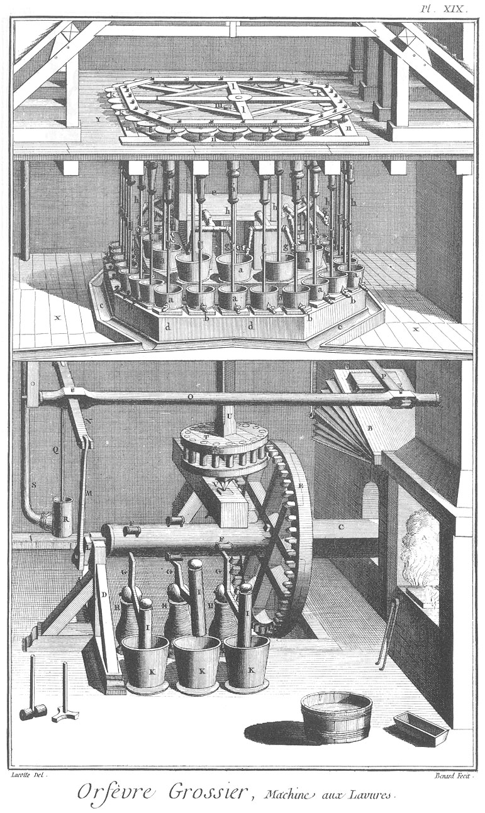](Planche_19.jpeg)

Cette Planche représente une vue perspective d'une machine aux lavures, le dessus sert à faire les lavures, & le dessous à piler les cendres.

- A, le fourneau.
- B, le soufflet.
- C, l'arbre de la machine mûe par le courant d'une riviere.
- D, le support de l'arbre.
- E, la roue.
- F F, les rouleaux.
- G G G, les bascules des pilons.
- H H H, les supports des bascules.
- I I I, les pilons.
- K K K, les mortiers.
- L, la manivelle.
- M, la tringle.
- N, la bascule de la pompe.
- O, l'arbre de la bascule.
- O O, le support de l'arbre.
- P, la bascule du soufflet.
- Q, la tringle du piston de la pompe.
- R, la pompe.
- S, le tuyau de conduite.
- T, la lanterne.
- V, le pivot de la lanterne.
- U, l'arbre de la lanterne.
- X X, le premier plancher portant tous les baquets aux lavures.
- Y Y, le second plancher portant le renvoi du mouvement.
- a a, &c. baquets aux lavures.
- b b, &c. robinets pour les vuider:
- c c les canaux pour la conduite des eaux.
- d d, &c. les supports des baquets.
- e, réservoir d'eau.
- f f, tuyaux pour conduire l'eau dans les baquets.
- g g, &c. robinets des tuyaux.
- h h, &c. tringles des triangles.
- i i, &c. boîte des tringles.
- k k, &c. roues à manivelle.
- l l chassis pour le mouvement des roues à manivelle.
- m, manivelle de l'arbre de la lanterne.
- n n, support des roues à manivelle.

[->](../10-Orfevre_Bijoutier/Légende.md)
