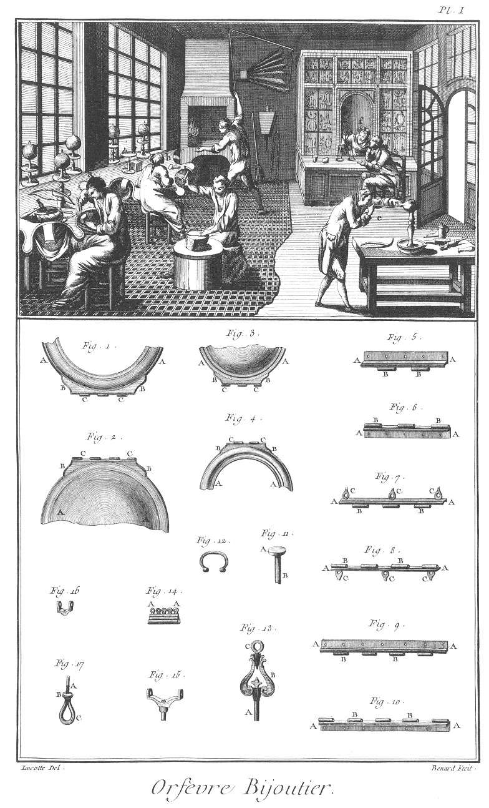
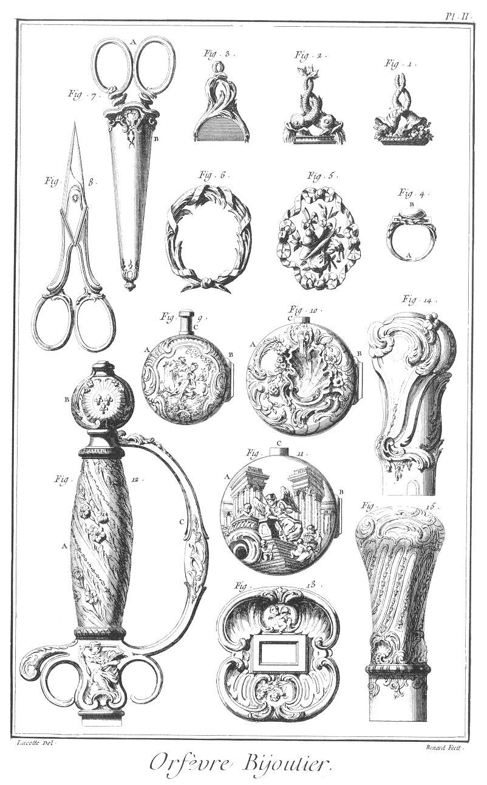
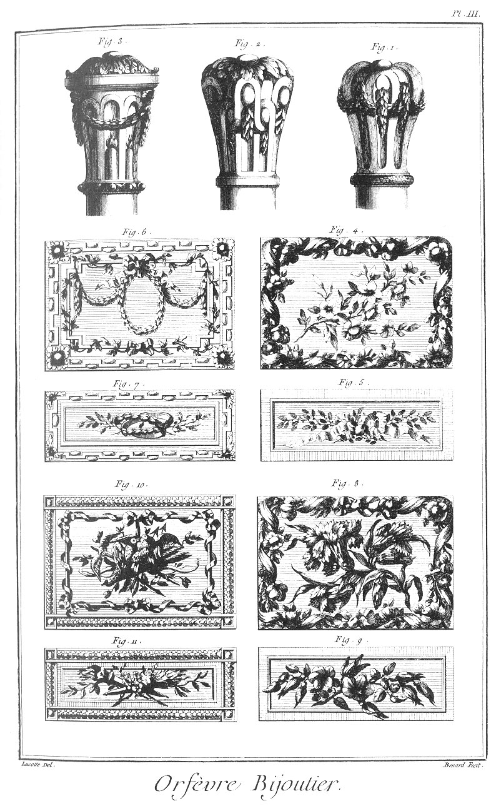
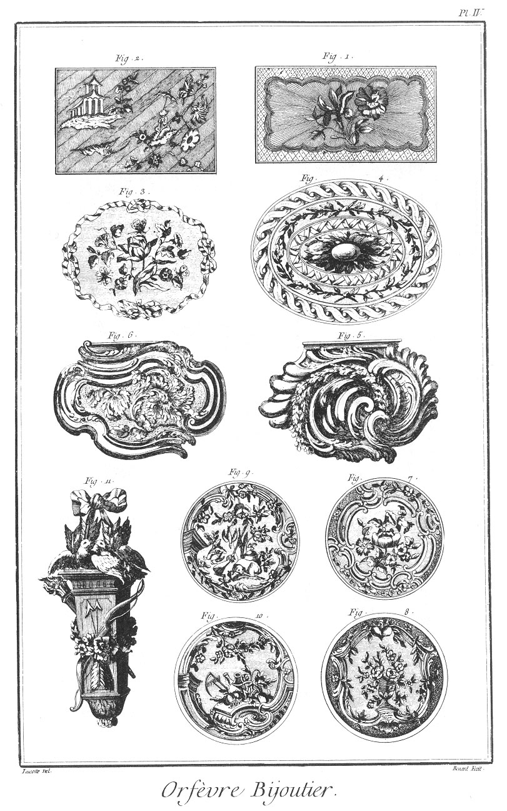
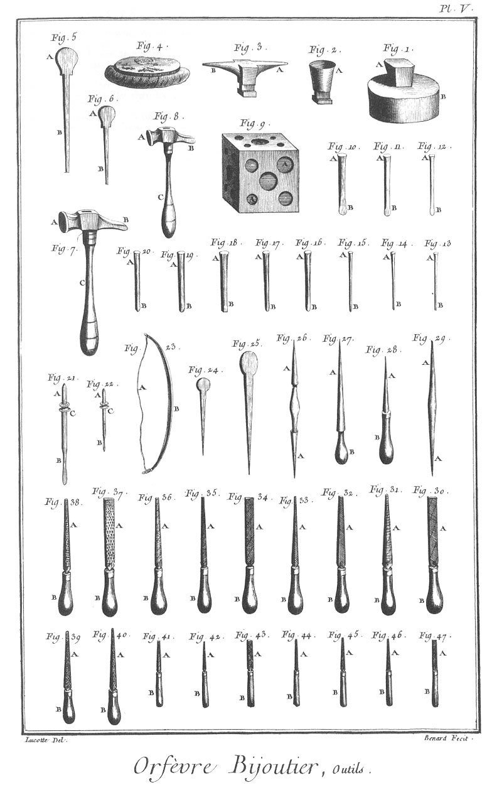
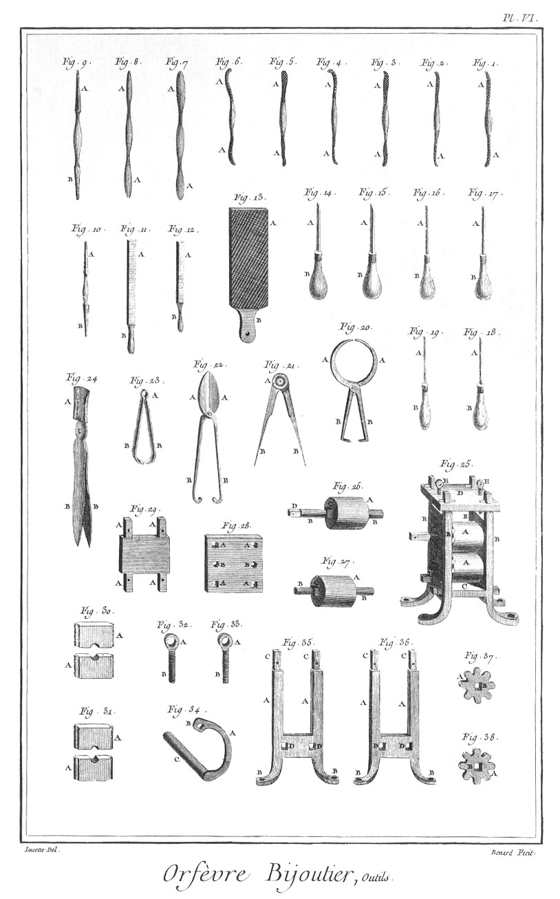
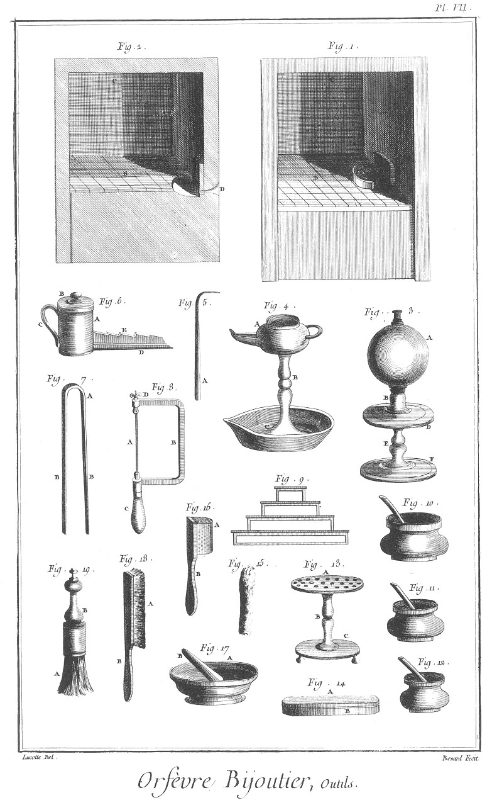

ORFEVRE-BIJOUTIER
=================

Contenant sept Planches.

PLANCHE Iere.
-------------

Le haut de cette Planche représente une boutique où plusieurs ouvriers sont occupés à divers ouvrages de bijouterie. Les uns en

- a & en
- b, à monter des bijoux ; un autre en
- c, à forger le métal ; un autre en
- d, à le chauffer ou souder à la forge ; un autre en
- e, à souder au chalumeau ou à la lampe, tandis que la maîtresse au comptoir pese & vend les marchandises de bijouterie :

le reste de l'attelier est semé de plusieurs outils propres à ces sortes d'ouvrages.

Fig.
1. Portion de couvercle de boîte de montre vu par sa charniere à charnons triplés.
	 - A A, le cercle du couvercle.
	 - B B, la charniere.
	 - C C, les charnons.

2. Portion du fond de la même boîte de montre vu par sa charniere à charnons triplés.
	- A A, le fond.
	- B B, la charniere.
	- C C, les charnons.

3. Portion de fond de boîte de montre vu par sa charniere à charnons doublés.
	- A A, le fond.
	- B B, la charniere.
	- C C, les charnons.

4. Portion de couvercle de boîte de montre vu par sa charniere à charnons doublés.
	- A A, le cercle du couvercle.
	- B B, la charniere.
	- C C, les charnons.

5. &
6. Charniere de boîte à charnons triplés.
	- A A, &c. la charniere.
	- B B, &c. les charnons.
	- C C C, les pattes.

9. &
10. Charnieres de boîte à charnons quadruplés.
	- A A, &c. la charniere.
	- B B, &c. les charnons.

11. Bouton de montre.
	- A, la tête.
	- B, la tige.

12. Anneau de montre.

13. Clé de montre.
	- A, la clé.
	- B, la monture de la clé.
	- C, l'anneau à touret.

14. Charniere de chaîne de montre.
	- A A, les anneaux des chaînes.

15. Grand étrier de porte-mousqueton.

16. Petit étrier de porte-mousqueton.

17. Porte-mousqueton à charniere.
	- A, la vis.
	- B, l'écrou.
	- C, la charniere.

PLANCHE II.
-----------

Fig.
1. &
2. Cachets simples représentant des cornets d'abondance de fleurs & de fruits entrelacés, & l'autre deux dauphins entrelacés jettant de l'eau.

3. Cachets à trois faces & à pivots.

4. Bague.
	- A, l'anneau.
	- B, le brillant.

5. Bracelet représentant un trophée pastoral entouré d'un ruban.

6. Autre bracelet entouré de palmiers entrelacés de ruban, destiné à contenir un portrait.

7. Ciseaux avec étui garni en or & en argent.
	- A, les ciseaux.
	- B, l'étui garni.

8. Ciseaux garnis en or ou en argent.

9. &
10. &
11. Boîtes de montre.
	- A A, &c. les fonds.
	- B B, &c. les charnieres.
	- C C, &c. les canons.

12. Garde d'épée enrichie & incrustée d'or & d'argent.
	- A, la poignée.
	- B, le pommeau.
	- C, la garde.

13. Coquille d'épée enrichie & incrustée d'or ou d'argent.

14. &
15. Pommes de canne.

PLANCHE III.
------------

Fig.
1. &
2. &
3. Pommes de cannes à la moderne.

4. &
5. &
6. &
7. &
8. &
9. &
10. &
11. Dessus & faces de boîtes d'or & d'argent quarrées enrichies d'ornemens en relief de diverses couleurs.

PLANCHE IV.
-----------

Fig.
1. &
2. Dessus de boîte d'or avec bas relief d'ornemens.

3. Dessus de boîte ovale festonnée.

4. Autres dessus de boîtes ovales.

5. &
6. Dessus de boîtes ovales festonnées avec reliefs d'ornemens de sculpture.

7. &
8. Dessus de boîtes rondes ornées de fleurs.

9. &
10. Dessus de boîtes rondes, ornées l'un d'un trophée de chasse, & l'autre d'un trophée d'agriculture.

11. Nécessaire enrichi d'or & d'argent de diverses couleurs.

PLANCHE V. Outils.
------------------

Fig.
1. Tas.
	- A, le tas.
	- B, le billot.

2. Tas d'établi.
	- A, la tête.

3. Bigorne d'établi.
	- A, la bigorne quarrée.
	- B, la bigorne ronde.

4. Gâteau de mastic.

5. &
6. Marteaux à sertir.
	- A A, les têtes.
	- B B, les manches.

7. &
8. Marteaux.
	- A A, les têtes.
	- B B, les pannes.
	- C C, les manches.

9. Dé à boutroler.
	- A A, &c. les creux.

10. &
11. &
12. Burin, ciseau & langue-de-carpe.
	- A A A, les têtes.
	- B B B, les taillans.

13. &
14. &
15. &
16. &
17. Différens ciselets.
	- A A, &c. les têtes.
	- B B, &c. les poinçons.

18. &
19. &
20. Boutrolles.
	- A A A, les têtes.
	- B B B, &c. les boutrolles.

21. &
22. Forets.
	- A A, les têtes.
	- B B, les taillans.
	- C C, les boîtes.

23. Archet ou arçon.
	- A, la corde à boyau.
	- B, l'arçon.

24. &
25. Pointes à émailler.

26. Tribouillet en rifloir.
	- A A, le tribouillet.

27. Tribouillet emmanché.
	- A, le tribouillet.
	- B, le manche.

28. Brunissoir emmanché.
	- A, le brunissoir.
	- B, le manche.

29. Brunissoirs en rifloir.
	- A, les brunissoirs.

30. Lime d'Angleterre quarrelette,
31. demi-ronde,
32. quarrée ou à potence,
33. à couteau,
34. tiers-point,
35. queue-de-rat,
36. ovale.
	- A A, &c. les limes.
	- B B, &c. les manches.

37. Rape quarrelette,
38. demi-ronde,
39. quarrée,
40. queue-de-rat.
	- A A, &c. les rapes.
	- B B, &c. les manches.

41. Fossillons d'Angleterre ovales,
42. queue-de-rat,
43. à couteau,
44. tiers-point,
45. quarrées ou à potence,
46. demi-ronde,
47. quarrelette.
	- A A, &c. les limes.
	- B B, &c. les manches.

PLANCHE VI.
-----------

Fig.
1. &
2. &
3. &
4. &
5. &
6. Rifloirs d'Angleterre de plusieurs especes.
	- A A, &c. les limes.

7. &
8. Brunissoirs.
	- A A, &c. les brunissoirs.

9. &
10. Grattoirs.
	- A A, les grattoirs en tiers-point.
	- B B, les grattoirs quarrés.

11. &
12. Polissoirs.
	- A A, les polissoirs.
	- B B, les manches.

13. Grande lime.
	- A la lime.
	- B, la queue.

14. &
15. &
16. &
17. &
18. &
19. Echoppes.
	- A A, les taillans.
	- B B, &c. les manches.

20. Compas d'épaisseur.
	- A A, les pointes.
	- B B, les branches.

21. Compas simple.
	- A, la tête.
	- B B, les pointes.

22. Cisoirs.
	- A A, les mors.
	- B B, les branches.

23. Pinces.
	- A, la tête.
	- B B, les branches.

24. Pinces à souder.
	- A, la pelle au borax.
	- B B, les branches.

25. Moulin à tirer.
	- A A, les cylindres.
	- B B, &c. les montans du chassis.
	- C, la traverse du chassis.
	- D, le chapeau du chassis.
	- E E, les vis.
	- F F, les coussinets.

26. &
27. Cylindre du moulin.
	- A A, les rouleaux.
	- B B, &c. les tourillons.
	- C C, les quarrés des pignons.
	- D, le quarré de la manivelle.

28. Chapeau du chassis.
	- A A, &c. les trous des montans.
	- B B, les trous des vis.

29. Traverse du chassis.
	- A A, &c. les tenons.

30. &
31. Coussinets.
	- A A, &c. les languettes.

32. &
33. Vis.
	- A A, les têtes.
	- B B, les vis.

34. Manivelle.
	- A, la manivelle.
	- B, la clé.
	- C, le manche.

35. &
36. Montans du chassis.
	- A A, &c. les montans.
	- B B, &c. les pattes.
	- C C, &c. les tenons.
	- D D, &c. les trous de la traverse.

37. &
38. Pignons.
	- A A, les dents.
	- B B, les trous pour les quarrés des rouleaux.

PLANCHE VII.
------------

Fig.
1. Elévation ; & figure
2. coupe de la forge.
	- A, la forge.
	- B, l'âtre.
	- C, la cheminée.
	- D, la tuïere du soufflet.

3. Bocal.
	- A, le globe de verre.
	- B, le pié.
	- C, l'embouchure.
	- D, le plateau.
	- E, la tige du plateau.
	- F, le pié du plateau.

4. Lampe à souder.
	- A, la lampe.
	- B, la tige.
	- C, le pié.

5. Chalumeau.
	- A, l'embouchure.

6. Borachoir.
	- A, le borachoir.
	- B, le couvercle.
	- C, l'anse.
	- D, la goulotte.
	- E, la crémaillere.

7. Pincette.
	- A, la tête.
	- B B, les branches.

8. Scie à main.
	- A, la scie.
	- B, le chassis de la monture.
	- C, le manche.
	- D D, les tourets.

9. Porte-outil en amphitéatre.

10. Pot à émeril.

11. Pot à potée.

12. Pot à noir d'ivoire.

13. Porte-outil simple.
	- A, le plateau.
	- B, la tige.
	- C, le pié.

14. Pierre à huile.
	- A, la pierre.
	- B, la boîte de fer-blanc.

15. Patte de liévre à nettoyer les bijoux.

16. Rape à nettoyer les brosses.
	- A, la rape.
	- B, le manche.

17. Mortier à broyer.
	- A, le mortier.
	- B, la molette.

18. Brosse à nettoyer les bijoux. A, la brosse. B le manche.

19. Autre brosse.
	- A, la brosse.
	- B, le manche.

[->](../11-Orfevre_Jouaillier,_Metteur_en_Oeuvre/Légende.md)
