ORFEVRE-JOUAILLIER, METTEUR EN OEUVRE
=====================================

Contenant onze Planches.

PLANCHE Iere.
-------------

[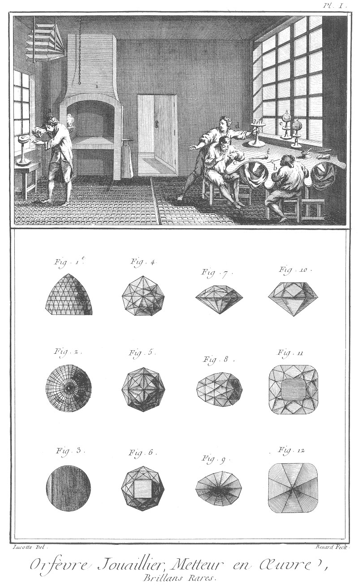](Planche_01.jpeg)

Le haut de la Planche représente un attelier où sont plusieurs ouvriers occupés à divers ouvrages de cette profession ; l'un en

- a à souder au chalumeau ; un autre en
- b à monter des diamans, un autre en
- c à ajuster des montures ; & un autre en
- d à choisir les outils qui lui sont nécessaires.

L'établi est garni de plusieurs outils relatifs à cet art, tel que bocaux

- e, poignées à ciment
- f, & autres choses semblables ;

le reste de l'attelier est aussi garni d'outils tels qu'en

- g des forets, scies, &c. en
- h, des planches garnies, & en
- i une forge propre à fondre, souder, &c.

Fig.
1. Elévation,
2. plan de dessus, &
3. plan du dessous de grandeur naturelle du plus beau diamant du grand Mogol, du poids de 279. trois 16mes de karats ; il n'a d'autre défaut qu'une petite glace sur le tranchant d'en-bas.

4. Elévation,
5. plan du dessus, &
6. plan du dessous de grandeur naturelle du diamant du grand Duc de Toscane, du poids de 139 karats, & de la grosseur à-peu-près de celle d'un oeuf de pigeon ; il est net & de belle forme.

7. Elévation,
8. plan du dessus, &
9. plan du dessous de grandeur naturelle d'un des brillans du Roi de France, appellé le sancy, du poids de 106 karats ; il est d'une eau & d'une netteté parfaite.

10. Elévation,
11. plan du dessus, &
12. plan du dessous de grandeur naturelle d'un brillant du Roi de France, appellé le pitre, du poids de 547 grains ; il il est si parfait, qu'il passe pour le plus beau diamant du monde.

PLANCHE II.
-----------

[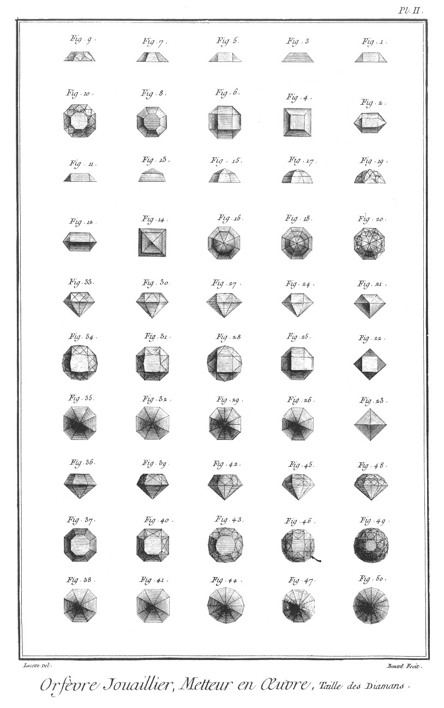](Planche_02.jpeg)

Fig.
1. Elévation, &
2. plan d'un diamant de stras oblong à neuf facettes.

3. Elévation, &
4. plan d'un diamant de stras quarré à cinq facettes.

5. Elévation, &
6. plan d'un diamant de stras irrégulierement octogonal à neuf facettes.

7. Elévation, &
8. plan d'un diamant de stras régulierement octogonal à neuf facettes.

9. Elévation, &
10. plan d'un diamant de stras irrégulierement octogonal à trente-trois facettes.

11. Elévation, &
12. plan d'un diamant-rose oblong à un rang de facettes composé de six.

13. Elévation, &
14. plan d'un diamant-rose quarré à deux rangs de facettes composés de huit.

15. Elévation, &
16. plan d'un diamant-rose régulierement octogonal à deux rangs de facettes composés de seize.

17. Elévation, &
18. plan d'un diamant-rose à trois rangs de facettes composés de vingt-quatre.

19. Elévation, &
20. plan d'un diamant-rose à trois rangs de facettes composés de cinquante-six.

21. Elévation,
22. plan du dessus, &
23. plan du dessous d'un brillant quarré à un seul rang de facettes composé de quatre, celle de dessus quarrée.

24. Elévation,
25. plan de dessus, &
26. plan de dessous d'un brillant régulierement octogonal à un seul rang de facettes composé de huit, celle de dessus quarrée.

27. Elévation,
28. plan de dessus, &
29. plan du dessous d'un brillant de douze côtés à un seul rang de facettes composé de seize, celle de dessus quarrée.

30. Elévation,
31. plan de dessus, &
32. plan du dessous d'un brillant octogonal à un seul rang de facettes composé de seize, celle de dessus de huit côtés.

33. Elévation,
34. plan du dessus, &
35. plan du dessous d'un brillant de douze côtés à un seul rang de facettes composé de trente-deux, celle de dessus de huit côtés.

36. Elévation,
37. plan du dessus, &
38. plan du dessous d'un brillant de huit côtés à un seul rang de facettes composé de huit, celle de dessus de huit côtés.

39. Elévation,
40. plan du dessus, &
41. plan du dessous d'un brillant de huit côtés à un seul rang de facettes.

42. Elévation,
43. plan du dessus, &
44. plan du dessous d'un brillant de douze côtés à un seul rang de facettes composé de quarante, celle de dessus de douze côtés.

45. Elévation,
46. plan du dessus, &
47. plan du dessous d'un brillant de douze côtés à deux rangs de facettes composés de quarante huit, celle de dessus de huit côtés.

48. Elévation,
49. plan du dessus, &
50. plan du dessous d'un brillant de seize côtés a deux rangs de facettes composés de quatre-vingt-seize, celle de dessus de douze côtés.

PLANCHE III.
------------

[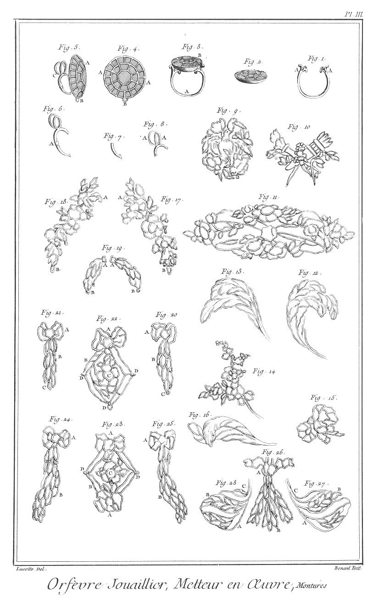](Planche_03.jpeg)

Fig.
1. Anneau de bague.
	- A A, les branches.

2. Plateau de bague.

3. Bague montée.
	- A, l'anneau.
	- B, le plateau.

4. Boucle d oreille non montée vue de face.
	- A A, les places pour les diamans.
	- B, l'anneau de pendeloque.

5. Boucle d'oreille montée de ses anneaux.
	- A, la boucle.
	- B, l'anneau de pendeloque.
	- C, l'anneau à charniere.

6. Anneau à charniere.
	- A, la charniere.

7. Partie immobile de l'anneau à charniere.

8. Partie mobile de l'anneau à charniere.
	- A A, les anneaux.

9. Boucle d'oreille non montée.

10. Branches d'amour en diamans non montée, servant à soutenir les penderoques de la girandole, fig. 3. Pl. IV.

11. Applique de diamans non montée. Voyez la fig. 6. Pl. IV.

12. Plume de diamans non montée marquée A, fig. 10. Pl. IV.

13. Autre plume de diamans non montée, marquée B, fig. 10. Pl. IV.

14. Bouquet de diamans non monté, marqué C, fig. 10. Pl. IV.

15. Noeud de diamans non monté, marqué D, fig. 10. Pl. IV.

16. Autre plume de diamans non montée, marquée E, fig. 10. Pl. IV.

Ces cinq dernieres figures sont les pieces qui composent la plume, fig. 10. Pl. IV.

17. &
18. Bouquets non montés d en-haut de la chaîne de montre, marqués A A, fig. 8. Pl. IV.
	- A A, les anneaux pour les tenir ensemble.
	- B B, les anneaux à porter les cachets.

19. Les deux guirlandes de la même chaîne non montées, marquées en B B, fig. 8. Pl. IV. 
	- A A, les anneaux d'en-haut.
	- B B, les anneaux d'en bas.

20. &
21. Deux autres guirlandes de la même chaîne, marquées C C, fig. 8. Pl. IV.
	- A A, les noeuds de ruban.
	- B B, les guirlandes.
	- C C, les anneaux.

22. Ruban de milieu de la même chaîne marquée en D, fig. 8. Pl. IV.
	- A, le noeud.
	- B B, les rubans.
	- C, le bouquet.
	- D D D, les anneaux.

23. Autre ruban de milieu de la même chaîne marquée en E, fig. 8. Pl. IV.
	- A A, les noeuds.
	- B B, les rubans.
	- C, le bouquet.
	- D D, les anneaux.

24. &
25. Deux autres guirlandes de la même chaîne, marquées en F F, fig. 8. Pl. IV.
	- A A, les noeuds.
	- B B, les guirlandes.

26. Bec de tête marqué en A, fig. 5. Pl. IV.
	- A, le noeud.
	- B, le bec en forme de bouquet à trois branches.

27. &
28. Cornes de rubans du même bec, marquées B B, fig. 5. Pl. IV.
	- A A, &c. les rubans.
	- B B, les bouquets.
	- C C, les tiges.

PLANCHE IV.
-----------

[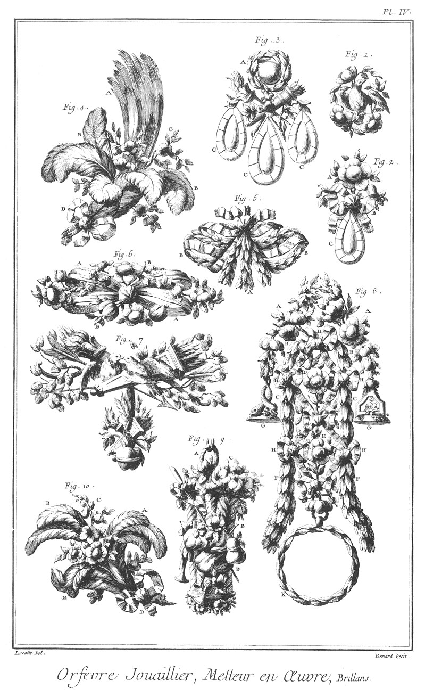](Planche_04.jpeg)

Fig.
1. Boucle d'oreille représentant une colombe perchée sur un bouquet de fleurs.

2. Boucle d'oreille avec pendeloque représentant un bouquet noué.
	- A, le bouquet.
	- B, le noeud.
	- C, la pendeloque.

3. Boucle d'oreille en girandole, représentant une rose environnée de lierre, à laquelle est suspendu un trophée d'amour soutenant trois pendeloques.
	- A, la rose.
	- B, le trophée.
	- C C C, les pendeloques.

4. Aigrette ou sultane.
	- A, la sultane.
	- B B, les plumes.
	- C, le bouquet.
	- D, le noeud.

5. Bec de tête.
	- A, le bec.
	- B B, les cornes.

6. Applique représentant un noeud de ruban entrelacé de fleurs.
	- A A, le noeud.
	- B B, les fleurs.

7. Applique avec pendeloque, l'applique représentant deux colombes perchées sur un trophée d'amour, & la pendeloque un semblable trophée avec deux coeurs enflammés.

8. Chaîne de montre représentant un ruban noué en différens endroits, entrelacé de fleurs & de guirlandes.
	- A D E, bouquets de fleurs.
	- B C F, les guirlandes.
	- G G, les cachets. 
	- H H, les noeuds.
	- I I, les rubans.
	- K, la boîte de la montre bordée de lierre.

9. Nécessaire représentant une corbeille remplie de fleurs, ornée de trophées pastorales.
	- A, l'anneau.
	- B, la corbeille.
	- C, les fleurs.
	- B, le trophée.

10. Plume en forme d'aigrette.
	- A B E, les plumes.
	- C, le bouquet.
	- D, le noeud.

PLANCHE V.
----------

[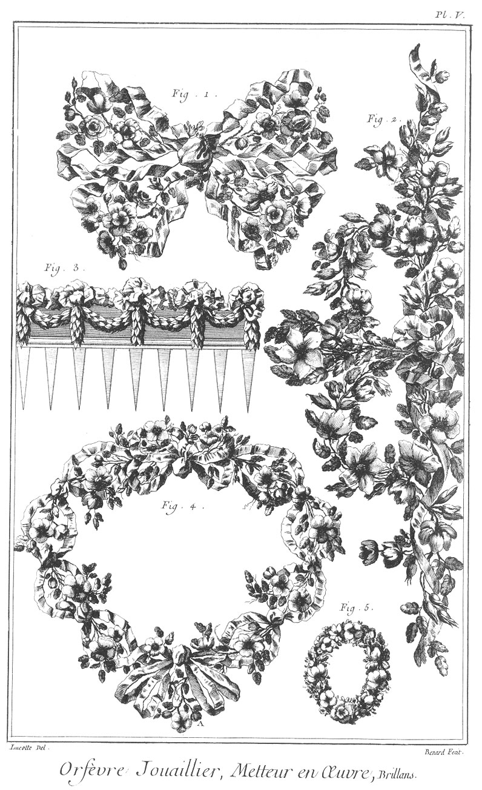](Planche_05.jpeg)

Fig.
1. Noeud de manche représentant des bouquets de fleurs entrelacés de rubans.

2. Collier en esclavage représentant aussi des fleurs entrelacées de rubans.

3. Peigne de tête orné de guirlandes de fleurs & attachées de rubans.

4. Ruban de bonnet représentant des fleurs entrelacées de rubans.
	- A, le bec.

5. Brasselet.

PLANCHE VI.
-----------

[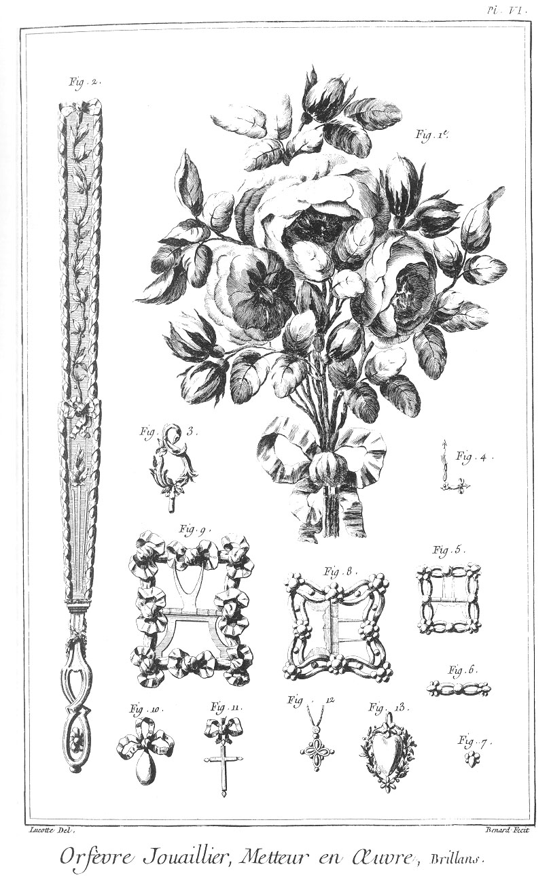](Planche_06.jpeg)

Fig.
1. Bouquet de diamans représentant des roses nouées par leur tige.

2. Bâton d'éventail enrichi de diamans.

3. Clé de montre.

4. Aiguille de montre.

5. Boucles de brasselet.

6. Anneau de brasselet.

7. Bouton de brasselet.

8. Boucle de soulier de femme.

9. Boucle de soulier d'homme.

10. Pendeloque de collier.

11. &
12. Petite croix de collier.

13. Petit coeur de collier bordé de lierre.

PLANCHE VII.
------------

[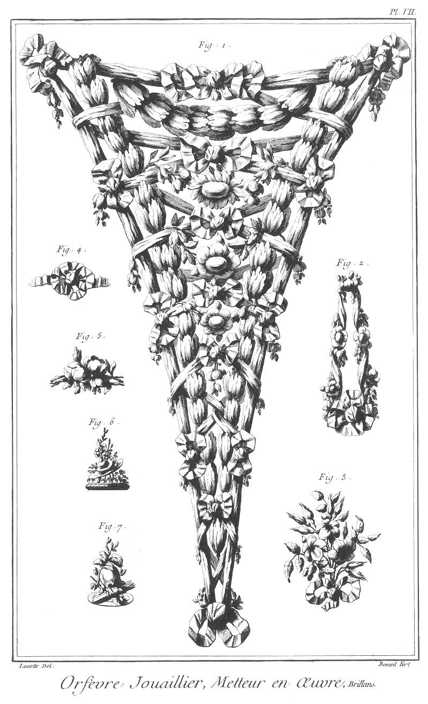](Planche_07.jpeg)

Fig.
1. Piece de diamans en rubans entrelacés de guirlandes de fleurs.

2. Agraphe de corps.

3. Bouquet propre à mettre dans les cheveux.

4. &
5. Brillans de bague, l'un représentant un noeud de ruban, & l'autre une fleur.

6. &
7. Cachets, l'un représentant des attributs pastorales, & l'autre des attributs guerriers.

PLANCHE VIII.
-------------

[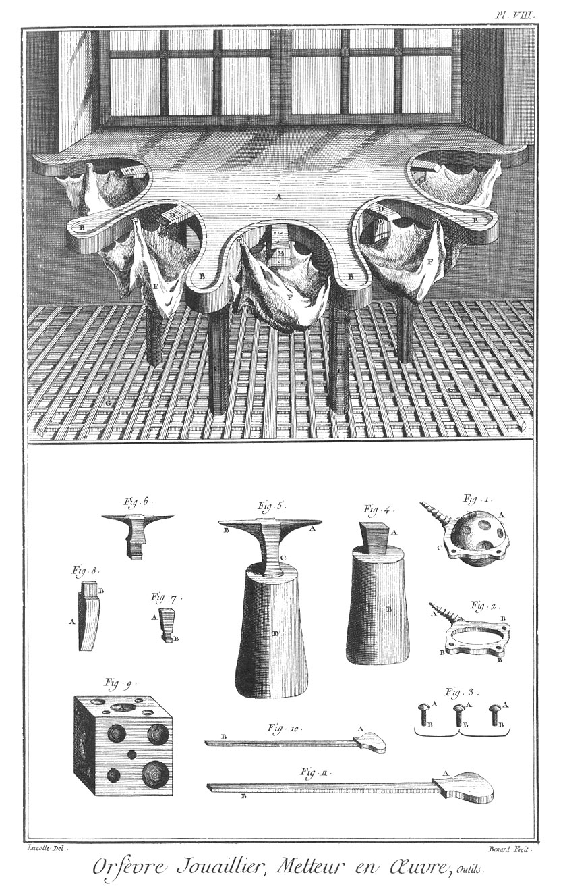](Planche_08.jpeg)

Le haut de cette Planche représente un établi de Metteur en oeuvre.

- A, l'établi.
- B B, &c. les pointes.
- C C, les piés.
- D D, les tasseaux.
- E E, les tiroirs.
- F F, les tabliers.
- G G, le grillage.

Fig.
1. Boule à sertir.
	- A, la boule.
	- B B, les troux.
	- C, le chassis.

2. Chassis de la boule à sertir.
	- A, la vis.
	- B B B, les trous pour l'arrêter.

3. Les vis pour arrêter le chassis de la boule à sertir.
	- A A A, les têtes.
	- B B B, les vis.

4. Tas.
	- A, le tas.
	- B, le billot.

5. Bigorne.
	- A, la bigorne ronde.
	- B, la bigorne quarrée.
	- C, la tige.
	- D, le billot.

6. Bigorne d'établi.
	- A, la bigorne ronde.
	- B, la bigorne quarrée.
	- C, la tige.
	- D, le tenon.

7. Petit tasseau d'établi.
	- A, la tête.
	- B, le tenon.

8. Tasseau de bois d'établi.
	- A, le tasseau.
	- B, le tenon.

9. Dé à boutroler.
	- A A, &c. les trous à boutroler.

10. &
11. Marteaux à sertir.
	- A A, les têtes.
	- B B, les manches.

PLANCHE IX.
-----------

[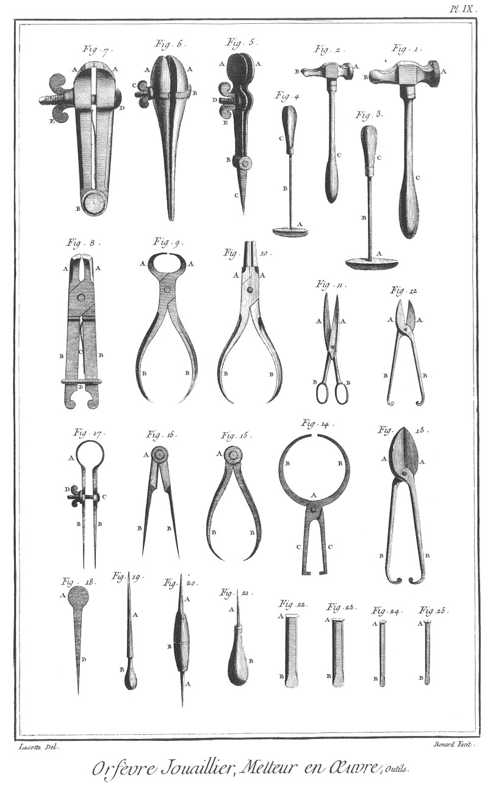](Planche_09.jpeg)

Fig.
1. &
2. Marteaux.
	- A A, les têtes.
	- B B, les pannes.
	- C C, les manches.

3. &
4. Fers à souder les modeles.
	- A A, &c. les fers.
	- B B, les tiges.
	- C C, les manches.

5. Etau à bague.
	- A A, les mords.
	- B, la charniere.
	- C, la pointe.
	- D, la vis.
	- E, l'écrou.

6. Tenailles à sertir.
	- A A, les mords.
	- B, la vis.
	- C, l'écrou.

7. Tenailles à vis.
	- A A, les mords.
	- B, la charniere.
	- C, le ressort.
	- D, la vis.
	- E, l'écrou.

8. Tenailles à viroles.
	- A A, les mords.
	- B B, les branches.
	- C, le ressort.
	- D, la virole.

9. Pinces courbes.
	- A A, les mords.
	- B B, les branches.

10. Pinces rondes.
	- A A, les mords.
	- B B, les branches.

11. Ciseaux.
	- A A, les mords.
	- B B, les anneaux.

12. Petits cisoirs.
	- A A, les mords.
	- B B, les branches.

13. Grands cisoirs.
	- A A, les mords.
	- B B, les branches.

14. Compas de proportion.
	- A, la charniere.
	- B B, les pointes courbes.
	- C C, les branches.

15. Compas d'épaisseur.
	- A, la tête.
	- B B, les pointes courbes.

16. Compas droit.
	- A, la tête.
	- B B, les pointes droites.

17. Compas à vis.
	- A, la tête à ressort.
	- B B, les pointes.
	- C, la vis.
	- D, l'écrou.

18. Pointe à découvrir.
	- A, la tête.
	- B, la pointe.

19. Grande pointe à découvrir.
	- A A, les pointes.
	- B, le manche.

20. Pointe double à découvrir.
	- A A, les pointes.
	- B, le manche.

21. Petite pointe à découvrir.
	- A, la pointe.
	- B, le manche.

22. Gros ciseaux.
	- A, la tête.
	- B, le taillant.

23. Grosse langue-de-carpe.
	- A, la tête.
	- B, le taillant.

24. Petit ciseau.
	- A, la tête.
	- B, le taillant.

25. Petite langue-de-carpe.
	- A, la tête.
	- B, le taillant.

PLANCHE X.
----------

[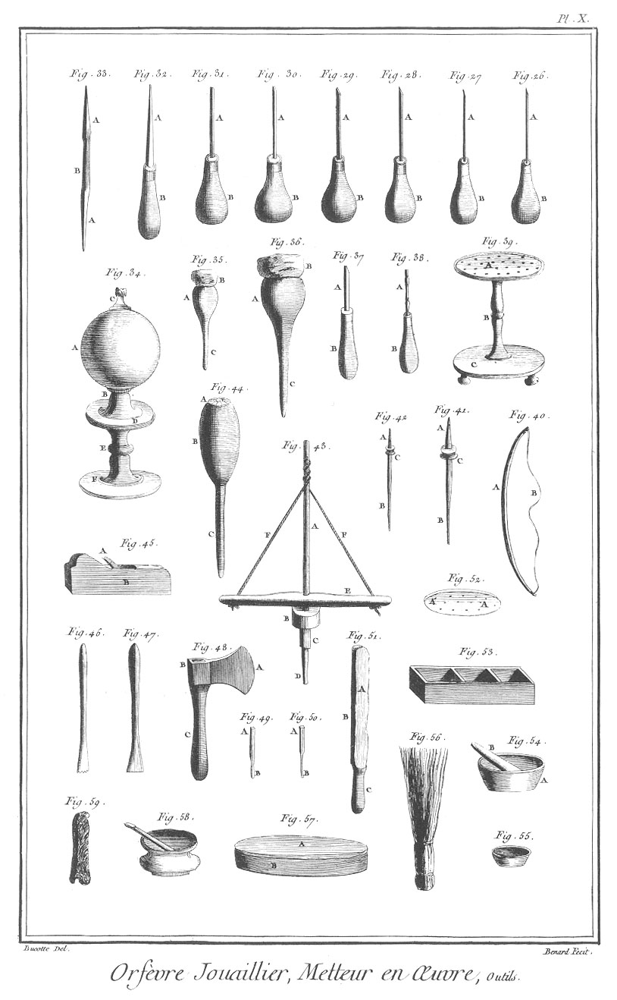](Planche_10.jpeg)

Fig.
26. &
27. Petites échoppes à refendre & à arrêter.
	- A A, les échoppes.
	- B B, les manches.

28. &
29. Echoppes à arrêter.
	- A A, les échoppes.
	- B B, les manches.

30. &
31. Echoppes à refendre.
	- A A, les échoppes.
	- B B, les manches.

32. Grattoir emmanché.
	- A, le grattoir.
	- B, le manche.

33. Grattoirs en riflard.
	- A A, les grattoirs.
	- B, la tige.

34. Bocal.
	- A, le globe de verre.
	- B, le pié.
	- C, l'embouchure.
	- D, le plateau.
	- E, la tige du plateau,
	- F, le pié du plateau.

35. Petite poignée à ciment.
	- A, la poignée.
	- B, le ciment.
	- C, la pointe.

36. Grosse poignée à ciment.
	- A, la poignée.
	- B, le ciment.
	- C, la pointe.

37. &
38. Grand & petit tourne vis.
	- A A, les tournevis.
	- B B, les manches.

39. Porte outil.
	- A, le plateau.
	- B, la tige.
	- C, le pié.

40. Petit arçon.
	- A, l'arc.
	- B, la corde.

41. &
42. Forets.
	- A A, les têtes des forets.
	- B B, les taillans.
	- C C, les boîtes.

43. Gros foret ou drille.
	- A, la tige.
	- B, le contre-poids.
	- C, le canon.
	- D, le foret.
	- E, la traverse.
	- F F, la corde.

44. Poignée à ciment garnie d'une monture.
	- A, la monture
	- B, la poignée.
	- C, la pointe.

45. Petit rabot.
	- A, le fer.
	- B, le rabot.

46. Ebauchoir denté.

47. Ebauchoir à adoucir.

48. Hache.
	- A, le taillant.
	- B, la tête.
	- C, le manche.

49. &
50. Petites pointes de foret,
	- A A, les têtes.
	- B B, les taillans.

51. Polissoir. 
	- A, le drap
	- B, le bois.
	- C, le manche.

52. Palette à forer.
	- A A, les trous des forets.

53. Boîte d'établi.

54. Mortier à noir d'ivoire.
	- A, le mortier.
	- B, le pilon.

55. Petit pot à potée.

56. Petit balai d'osier.

57. Pierre à l'huile.
	- A, la pierre.
	- B, la boîte.

58. Petit pot à émeril.

59. Patte-de-lievre.

PLANCHE XI.
-----------

[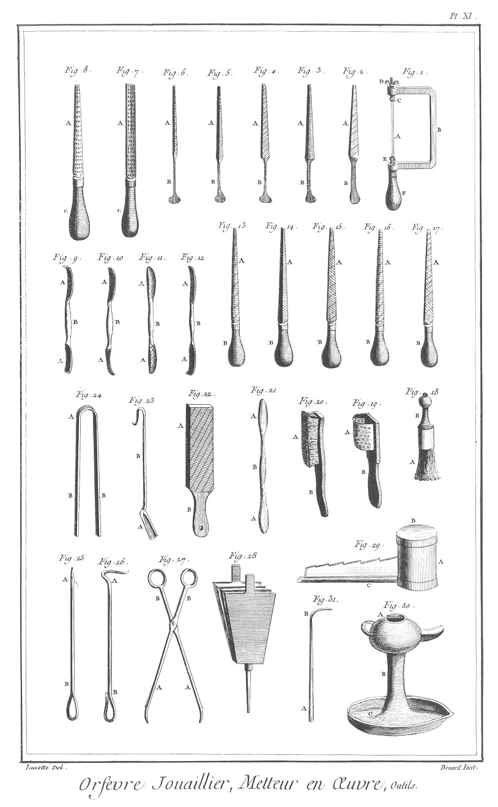](Planche_11.jpeg)

Fig.
1. Scie à main.
	- A, la scie.
	- B, la monture.
	- C, la vis.
	- D, l'écrou.
	- E, le touret.
	- F, le manche.

2. Lime à queue quarrelette.
	- A, la lime.
	- B, la queue.

3. Lime à queue demi-ronde.
	- A, la lime.
	- B, la queue.

4. Lime à queue quarrée ou à potence.
	- A, la lime.
	- B, la queue.

5. Lime à queue tierpoint.
	- A, la lime.
	- B, la queue.

6. Lime à queue, queue-de-rat.
	- A, la lime.
	- B, la queue.

7. Rape quarrelette.
	- A, la rape.
	- B, le manche.

8. Rape demi ronde.
	- A, la rape.
	- B, le manche.

9. &
10. &
11. &
12. Riflards de plusieurs sortes.
	- A A, &c. les riflards.
	- B B, &c. les tiges.

13. Lime à pointe, queue-de-rat.
	- A, la lime.
	- B, le manche.

14. Lime à pointe, tierpoint.
	- A, la lime.
	- B, le manche.

15. Lime à pointe quarrée ou à potence.
	- A, la lime.
	- B, le manche.

16. Lime à pointe demi-ronde.
	- A, la lime.
	- B, le manche.

17. Lime à pointe quarrelette.
	- A, la lime.
	- B, le manche.

18. Brosse à nettoyer les diamans.
	- A, la brosse.
	- B, le manche.

19. Rape à nettoyer les brosses.
	- A, la rape.
	- B, le manche.

20. Autre brosse à nettoyer.
	- A, la brosse.
	- B, le manche.

21. Brunissoirs en riflard.
	- A A, les brunissoirs.
	- B, la tige.

22. Lime plate.
	- A, la lime.
	- B, le manche.

23. Pelle.
	- A, la pelle.
	- B, le manche.

24. Pinces.
	- A, la tête.
	- B B, les branches.

25. Tisonnier pointu.
	- A, la pointe.
	- B, le manche.

26. Tisonnier crochu.
	- A, le crochet.
	- B, le manche.

27. Pinces de forge.
	- A A, les pinces.
	- B B, les branches.

28. Soufflet de forge.

29. Borachoir.
	- A, le borachoir.
	- B, le couvercle.
	- C, la goulotte.
	- D, la crémaillere.

30. Lampe à souder.
	- A, la lampe.
	- B, la tige.
	- C, le pié.

31. Chalumeau à souder.
	- A, l'embouchure.
	- B, le crochet.

[->](../12-Parcheminier/Légende.md)
