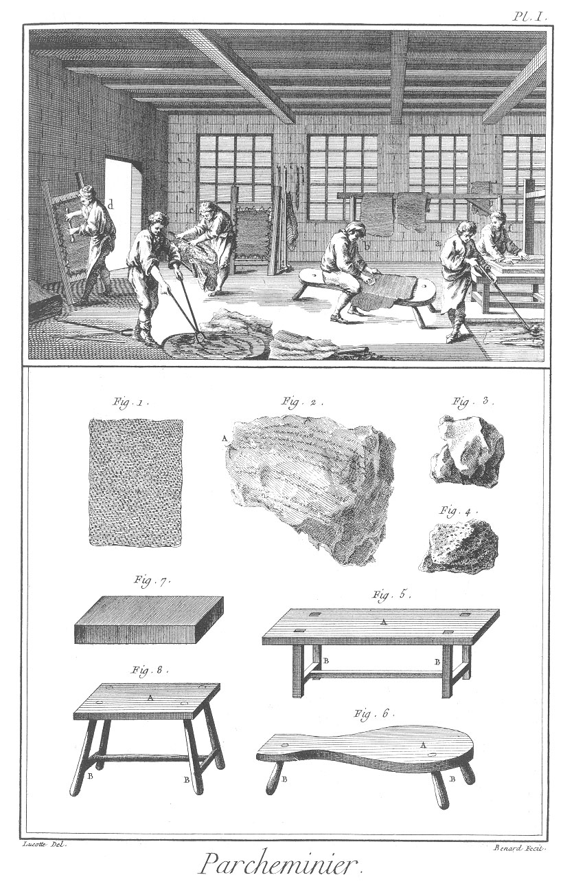
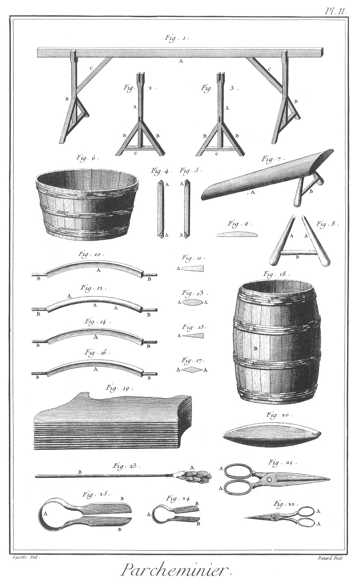
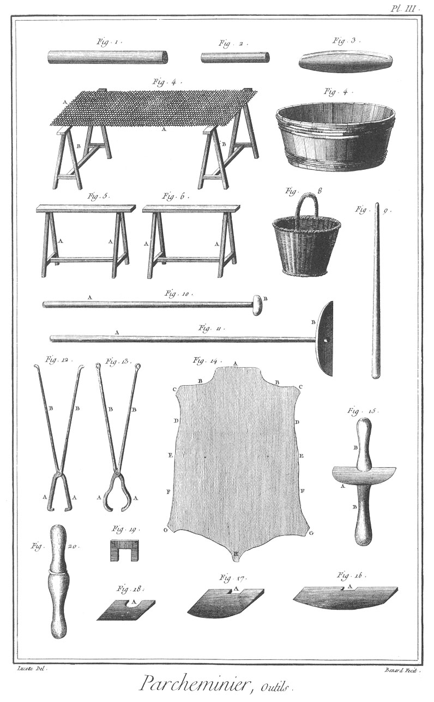
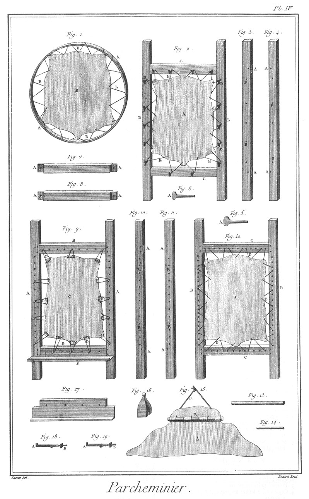
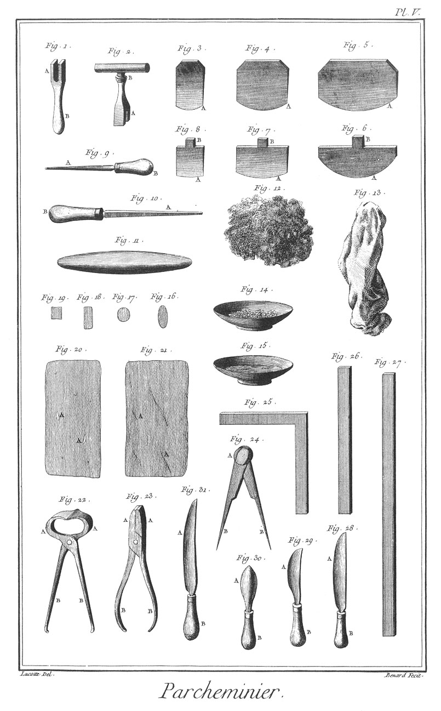
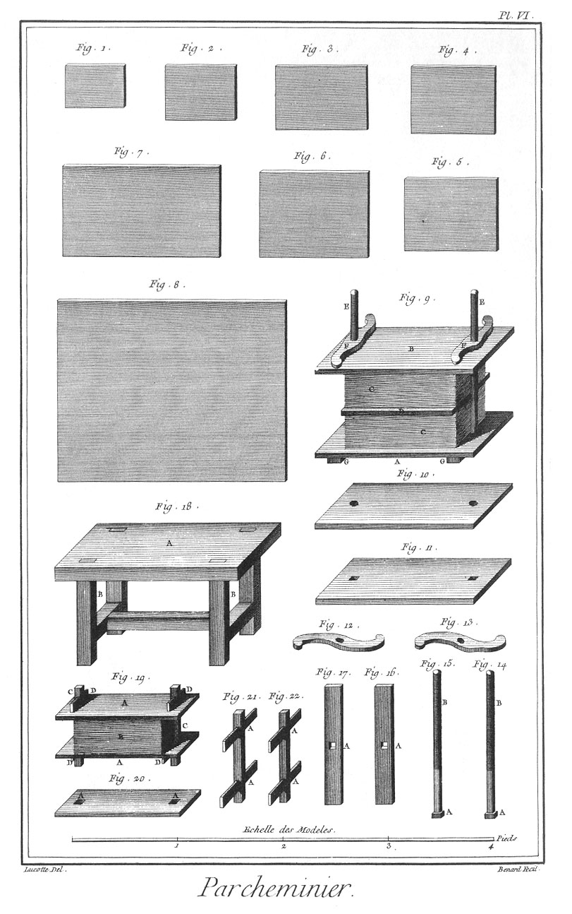
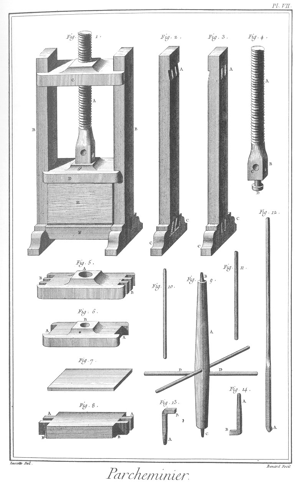

PARCHEMINIER
============

Contenant sept Planches.

PLANCHE Iere.
-------------

Le haut de cette Planche représente un attelier de parcheminier, où plusieurs ouvriers sont diversement occupés ; un en

- a, à passer les peaux fraîches dans un bassin d'eau pour les nettoyer ; un en
- b, à poncer une peau de parchemin ; un en
- c, à mettre les peaux dans le plein ; un en
- d, à raturer sur la herse ; un en
- e, à peler les peaux ; & un autre en
- f, à tailler le parchemin suivant les modeles.

Fig.
1. Morceau de peau qui démontre à-peu-près la forme des fibres aponévrotiques s'entrelaçant les unes dans les autres dont le tissu est composé.

2. Morceau de parchemin écrit, dont le côté A resserré par la chaleur du feu, démontre que cet élément en rapproche les fibres les unes des autres.

3. Morceau de chaux non éteinte.

4. Pierre-ponce.

5. Table à poncer.
	- A, la table.
	- B B, les piés.

6. Selle à poncer.
	- A, la selle.
	- B B, les piés.

7. Pierre à poncer, de liais ou de grès.

8. Escabeau de la pierre à poncer.
	- A, la tablette.
	- B B, les piés.

PLANCHE II.
-----------

Fig.
1. Etendoir pour étendre & faire secher les peaux.
	- A, la barre.
	- B B, les piés.
	- C C, les liens.

2. &
3. Piés de l'étendoir.
	- A A, les montans à fourchette.
	- B B, les arcboutans.
	- C C, les traverses.

4. &
5. Liens de l'étendoir.
	- A A, &c. les tenons.

6. Cuvier à tremper les peaux.

7. Chevalet à peler.
	- A, le chevalet.
	- B, la jambette.

8. Jambette du chevalet.
	- A A, les jambes.
	- B, la traverse.

9. Coupe du chevalet.

10. Couteau à talon ou fer à récasse, dont le taillant est arrondi.
	- A, le taillant.
	- B B, les poignées.

11. Coupe du même couteau.
	- A, le taillant arrondi.

12. Couteau à talon à deux tranchans arrondis.
	- A A, taillans.
	- B B, les poignées.

13. Coupe du même couteau.
	- A A, les taillans arrondis.

14. Couteau de riviere à un seul tranchant.
	- A. le taillant.
	- B B, les poignées.

15. Coupe du même.
	- A, le taillant.

16. Couteau de riviere à deux tranchans.
	- A, le taillant.
	- B B, les poignées.

17. Coupe du même.
	- A A, les deux tranchans.

18. Tonne que l'on enfonce en terre servant de plein.
	- A A, les cerces.
	- B B, les douves.

19. Peaux en retraite.

20. Quevre, espece de pierre à aiguiser, dont on pele aussi les cuirs.

21. Forts ciseaux.
	- A A, les anneaux.

22. Ciseaux à mouche.
	- A A, les anneaux.

23. Fourgon ou pousson, espece de goupillon fait de plusieurs mauvaises peaux réunies, servant à étendre la chaux sur les peaux.
	- A, le fourgon.
	- B, le manche.

24. &
25. Forces de différentes grosseurs.
	- A A, les ressorts.
	- B B, les mords.

PLANCHE III.
------------

Fig.
1. Peloir servant à ôter le poil ou la laine.

2. Petit peloir.

3. Pierre à peler les peaux.

4. Claie à faire sécher les peaux.
	- A A, la claie.
	- B B, les tréteaux.

5. &
6. Tréteaux.
	- A A, les piés.

7. Cuvier à tremper la bourre.

8. Panier à laver la bourre.

9. Bâton à démêler la bourre.

10. Bouloir ou pousson à remuer la chaux.
	- A, le manche.
	- B, le bouloir.

11. Rateau à remuer la chaux.
	- A, le manche.
	- B, le rateau.

12. &
13. Tenailles à tirer les peaux du plein.
	- A A, &c. les mords.
	- B B, &c. les branches.

14. Peau.
	- A, la tête ; c'est le col de l'animal.
	- B B, les colets ; ce sont les épaules.
	- C C, les pattes des colets ; ce sont les pattes de devant.
	- D D, les brisets ; ce sont les aisselles.
	- E E, les boudines ; c'est le dessous du ventre.
	- F F, les tétines ; ce sont les mamelles.
	- G G, les pattes de la culée ; ce sont les pattes de derriere.
	- H, la culée ; c'est la queue de l'animal.

15. Fer à écharner.
	- A, le fer.
	- B B, le manche.

16. &
17. &
18. Différentes lames à écharner.
	- A A A, les entailles pour les retenir au manche.

19. Serre à retenir les lames à écharner dans leurs manches.

20. Manche de lame à écharner.

PLANCHE IV.
-----------

Fig.
1. Cercle à rature.
	- A A, le cercle.
	- B, la peau montée.
	- C C, les ficelles.

2. Herse à raturer.
	- A, la peau.
	- B B, les montans de la herse.
	- C C, les traverses.
	- D D, les chevilles.
	- E E, les ficelles.

3. &
4. Montans de la herse.
	- A A, les mortoises des traverses.
	- B B, les trous des chevilles.

5. &
6. Cheville de la herse.
	- A A, les têtes.

7. &
8. Traverse de la herse.
	- A A, &c. les tenons.

9. Herse montée de brochettes.
	- A A, les montans.
	- B B, les traverses.
	- C, la peau.
	- D D, &c. les brochettes.
	- E E, &c. les chevilles.
	- F, la planchette.

10. &
11. Montans de la herse.
	- A A, les mortoises.
	- B B, les trous des chevilles.

12. Autre herse montée différemment.
	- A, la peau.
	- B B, les montans.
	- C C, les traverses.
	- D D, les ficelles pour retenir la peau.

13. &
14. Broches & brochettes à brocher les peaux sur la herse à brocher.

15. Brochette montée sur une portion de peau.
	- A, la peau.
	- B, la brochette.
	- C, la ficelle.

16. Mordant ou gland à cause de sa forme, fait pour haper le haut de la peau sur la herse.

17. Planchette qui se place au bas des herses pour déposer les outils.

18. &
19. Rapports de la planchette.
	- A A, les talons.
	- B B, les vis à écrous.

PLANCHE V.
----------

Fig.
1. Clé à tourner les vis de la herse.
	- A, la clé.
	- B, le manche.

2. Autre clé destinée au même usage.
	- A, la clé.
	- B, le manche.

3. &
4. &
5. Différentes lames à écharner.
	- A A A, les taillans.

6. &
7. &
8. Différentes lames à raturer.
	- A A A, les taillans.
	- B B B, les queues.

9. Pistolet rond pour donner le fil aux lames.
	- A, le pistolet.
	- B, le manche.

10. Pistolet quarré.
	- A, le pistolet.
	- B, le manche.

11. Affiloir pour donner le fil aux lames.

12. Effleuroir, morceau de peau garni de laine.

13. Guenillon.

14. Tasse à mouche.

15. Tasse à gomme.

16. &
17. &
18. &
19. Mouche de différentes formes pour boucher les trous du parchemin.

20. Morceau de parchemin percé de trous pour y mettre des pieces ou mouches,
	- A A, les trous.

21. Morceau de parchemin avec coutelures.
	- A A, les coutelures.

22. Tenailles ou triquoises.
	- A A, les mords.
	- B B, les branches.

23. Pinces plates.
	- A A, les mords.
	- B B, les branches.

24. Compas.
	- A, la tête.
	- B B, les jambes.

25. Equerre.

26. &
27. Regles pour couper les feuilles.

28. &
29. &
30. Différens couteaux à rogner les feuilles.
	- A A A, les lames.
	- B B B, les manches.

31. Couteau à couper les défectuosités.
	- A, la lame.
	- B, le manche.

PLANCHE VI.
-----------

Fig.
1. Modele de feuille de parchemin mesuré pour quittances de ville, 6°. 8 l. sur 4°. 91.

2. Autre pour quittances de tontine, 8°. sur 6°.

3. Autre pour brevets d'apprentissage, 10°. 61. sur 7°.

4. Autre pour procédures au parlement, 9°. 61. sur 7°. 61.

5. Autre pour procédures du conseil, 10°. 61. sur 8°.

6. Autre pour contrats de finances, de rentes, de mariage, &c. 12°. 61. sur 9°. 61.

7. Autre pour la grande chancellerie, 18°. sur 10°.

8. Autre pour lettres de grace, 26°. sur 20°.

9. Presse.
	- A, le plateau inférieur.
	- B, le plateau supérieur.
	- C C, le parchemin en presse.
	- D, le plateau intermédiaire.
	- E E, les vis.
	- F F, les écrous.
	- G G, les barres.

10. Plateau supérieur de la presse.

11. Plateau inférieur de la presse.

12. &
13. Ecrous de la presse.

14. &
15. Vis de la presse.
	- A A, les têtes.
	- B B, les vis.

16. &
17. Barres de la presse.
	- A A, les trous pour le passage de la tête des vis.

18. Table à rogner.
	- A, la table.
	- B B, les piés.

19. Petite presse.
	- A A, les plateaux.
	- B, le parchemin en presse.
	- C C, les tirans.
	- D D, &c. les coins.

20. Plateau de la petite presse.
	- A A, les trous des tirans.

21. &
22. Tirans de la petite presse.
	- A A, &c. les coins.

PLANCHE VII.
------------

Fig.
1. Grande Presse.
	- A, la vis.
	- B B, les jumelles.
	- C, le plateau à écrou.
	- D, le plateau mobile.
	- E, le parchemin en presse.
	- F, le plateau immobile.

2. &
3. Jumelles de la presse.
	- A A, les mortoises du plateau à écrou.
	- B B, les mortoises du plateau immobile.
	- C C, les piés à consoles.

4. Vis de la presse.
	- A, la vis.
	- B, le quarré.
	- C C, les trous pour le passage des leviers.
	- D, le touret.

5. Plateau à écrou de la presse.
	- A, l'écrou.
	- B B, les tenons.

6. Plateau mobile.
	- A A, les coulisses.
	- B, le trou du touret de la vis.

7. Petit plateau de séparation.

8. Plateau immobile.
	- A A, les tenons.
	- B B, les talons.

9. Moulinet propre à serrer la presse par le moyen d'un cordage arrêté à l'extrémité du levier de la presse.
	- A, l'arbre.
	- B, le tourillon.
	- C, le pivot.
	- D D, les leviers.

10. &
11. Levier du moulinet.

12. Levier de la presse servant de pince.
	- A, la pince.

13. Pivot du moulinet.
	- A, le pivot.
	- B, le talon.

14. Tourillon du mouliner
	- A, le tourillon.
	- B, le talon.

[->](../13-Patenotrier/Légende.md)
