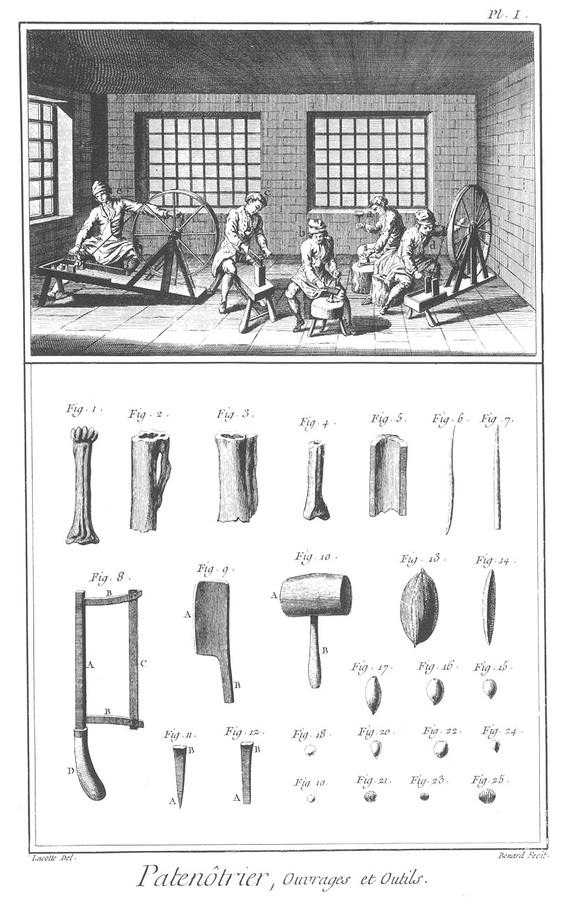
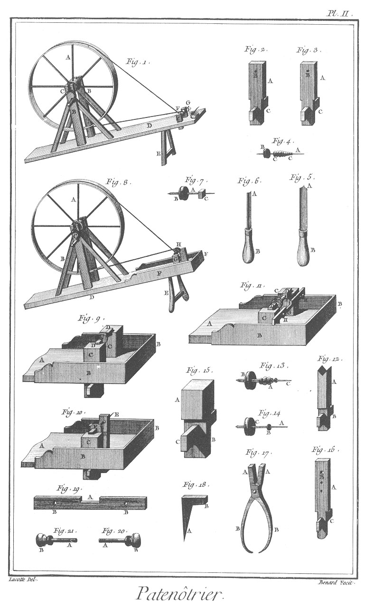

PATENOTRIER
===========

Contenant deux Planches.

PLANCHE Iere.
-------------

Le haut de cette Planche représente un attelier où plusieurs ouvriers sont occupés à la fabrique des patenôtres ; l'un en

- a, à fendre un os sur un billot avec un coin ; un autre en
- b, à dresser à la serpe un fragment d'os ; un autre en
- c, à arranger ces fragmens en pentes paralleles pour en faire des grains ; un autre en
- d, à percer ces paralleles au rouet ; & un autre en
- e enfin, à les tourner.

Fig.
1. Os entier.

2. &
3. Os dont on a coupé la tête.

4. Os scié.

5. Os fendu.

6. &
7. Petits os fendus.

8. Scie.
	- A, la tige.
	- B B, les branches.
	- C, le fer de la scie.
	- D, le manche.

9. Serpe.
	- A, le taillant.
	- B, le manche.

10. Maillet.
	- A, le maillet.
	- B, le manche.

11. Coin à pointe.
	- A, la pointe.
	- B, la tête.

12. Coin à ciseau. A, le ciseau. B, la tête.

13. Une noix de coco.

14. Une larme de Job.

15. &
16. &
17. Grosses patenôtres.

18. &
19. &
20. &
21. &
22. &
23. &
24. &
25. Différentes petites patenôtres.

PLANCHE II.
-----------

Fig.
1. Rouet à percer les patenôtres.
	- A, la roue.
	- B B, les supports.
	- C, la manivelle.
	- D, l'établi.
	- E, le pié.
	- F F, les poupées.
	- G, la broche.

2. &
3. Poupées de l'établi du rouet à percer.
	- A A, les supports.
	- B B, les trous de la broche.
	- C C, les clés.

4. Broche à tourner les grains.
	- A, la broche.
	- B, la poulie.
	- C C, les grains.

5. Gouge à grain-d'orge à tourner.
	- A, le taillant.
	- B, le manche.

6. Grain-d'orge d'une autre forme à tourner.
	- A, le taillant.
	- B, le manche.

7. Grain prêt à tourner.
	- A, la broche.
	- B, la poulie.
	- C, le grain.

8. Rouet à tourner.
	- A, la roue.
	- B B, les supports.
	- C, la manivelle.
	- D, l'établi.
	- E, le pié.
	- F F, les bordures.
	- G G, les poupées.
	- H, le grain monté.

9. Portion de l'établi disposé à polir les patenôtres.
	- A, l'établi.
	- B B, les bordures.
	- C C, les poupées.
	- D D, les tasseaux.
	- E, la poulie.

10. Portion de l'établi disposé à percer les patenôtres.
	- A, l'établi.
	- B B, les bordures.
	- C, la poupée.
	- D, la poupée de la broche.
	- E, la broche.
	- F, la poulie.
	- G, le support.

11. Portion de l'établi disposé à tourner les patenôtres.
	- A, l'établi.
	- B B, les bordures.
	- C C, les poupées.
	- D D, les tasseaux.
	- E, la poulie.
	- F, les patenôtres montées.
	- G, la barre de support.
	- H H, les, vis de la barre de support.

12. Support à scier les os.
	- A, le support.
	- B, la clé.

13. Patenôtres montées.
	- A, les patenôtres.
	- B, la poulie.
	- C, la broche.

14. Broche à percer.
	- A, la broche.
	- B, l'embase.
	- C, la poulie.

15. L'une des poupées.
	- A, le corps de la poupée.
	- B, la queue.
	- C, la clé.
	- D, le trou de la vis.

16. Poupée à broche.
	- A, la poupée.
	- B, les trous de la broche.
	- C, la clé.

17. Pinces.
	- A A, les mords.
	- B B, les branches.

18. Support coudé.
	- A, la pointe.
	- B, le coude.

19. Barre de support.
	- A, l'entaille.
	- B B, les trous des vis.

20. &
21. Vis à tête ronde de la barre de support.
	- A A, les vis.
	- B B, les têtes.

[->](../14-Patissier/Légende.md)
